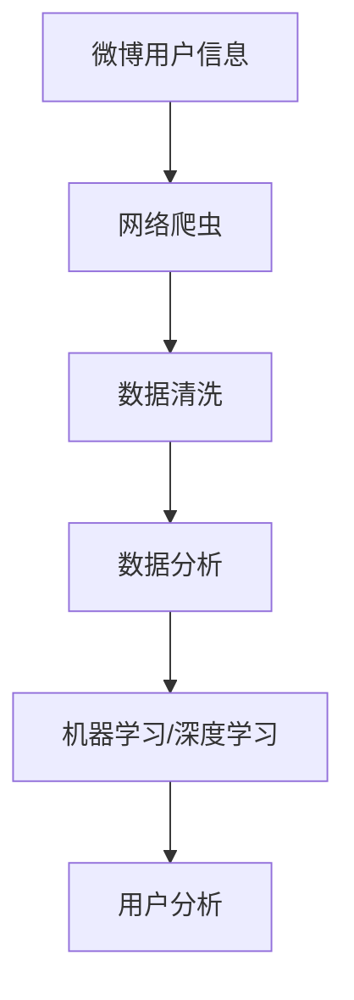

                 

# 基于Python的新浪微博用户信息爬取与分析

> 关键词：Python, 新浪微博, 网络爬虫, 数据清洗, 用户分析, 数据分析

## 1. 背景介绍

随着互联网和社交媒体的迅速发展，微博作为中国最大的社交网络平台之一，已经成为用户获取信息、分享生活的重要渠道。然而，微博上的信息庞杂且无序，如何高效地从微博平台上获取有价值的信息是一个亟待解决的问题。通过爬虫技术，可以从微博平台上自动化地抓取用户信息，并进行有针对性的分析，为社会研究、市场分析等领域提供有力支持。

### 1.1 问题由来

现代社会，信息获取方式的多样化使得人们越来越依赖于社交媒体。微博作为中国最具影响力的社交平台之一，覆盖面广、更新速度快，吸引了大量用户。用户发布的信息涉及生活、娱乐、科技等多个方面，成为互联网时代的重要信息源。但是，微博平台上的信息量巨大，且内容繁杂，直接浏览和筛选耗时耗力，因此需要利用技术手段来提高信息获取和分析的效率。

### 1.2 问题核心关键点

针对上述问题，本文将详细介绍基于Python的微博用户信息爬取与分析的方法和步骤，包括数据收集、清洗、分析和应用等多个环节。具体关键点包括：

- 选择合适的爬虫框架和工具，如BeautifulSoup、Scrapy等。
- 实现对微博数据的爬取，并对爬取到的数据进行清洗和处理，去除无用信息。
- 利用Python数据分析库（如Pandas、NumPy等）对用户数据进行分析，提取有用信息。
- 使用机器学习或深度学习算法对用户行为进行建模，实现用户分析。

### 1.3 问题研究意义

随着社交媒体的普及，如何高效地获取和分析用户信息，已经成为学术界和工业界关注的重要问题。通过爬虫技术获取微博用户信息，并进行详细的分析和建模，有助于以下几方面的研究：

1. 社会研究：了解用户群体特征、热点话题，为社会研究提供数据支持。
2. 市场分析：分析用户行为、兴趣，指导产品定位和营销策略。
3. 舆情监控：实时监控用户情感、观点，预测市场趋势。
4. 内容推荐：分析用户兴趣，实现个性化推荐。

此外，这些研究结果还可以应用于娱乐、教育、医疗等多个领域，推动社会各行业的数字化转型和智能化升级。

## 2. 核心概念与联系

### 2.1 核心概念概述

为了更好地理解基于Python的微博用户信息爬取与分析方法，我们首先介绍几个核心概念：

- **Python**：一种高级编程语言，以其简洁易读、功能丰富而受到广泛欢迎。在数据处理和爬虫开发中具有重要应用。
- **网络爬虫**：通过模拟浏览器行为，自动从网页上获取信息的软件。常用于数据采集、内容聚合等领域。
- **数据清洗**：从原始数据中去除错误、重复、无关信息的过程。确保数据的准确性和一致性。
- **数据分析**：对收集到的数据进行统计、可视化、建模等分析操作，挖掘数据背后的规律和价值。
- **机器学习/深度学习**：通过训练模型，从数据中学习规律，进行分类、预测等任务。

这些概念之间存在密切联系，构成了一个完整的微博用户信息分析流程。通过爬虫技术获取数据，经过清洗和处理，利用数据分析工具进行统计和建模，最终通过机器学习/深度学习算法进行深度分析，从而得到有用的信息。

### 2.2 概念间的关系

通过一个简单的Mermaid流程图，可以直观地展示这些核心概念之间的联系：



这个流程图展示了从微博平台获取信息，到最终实现用户分析的全过程。

## 3. 核心算法原理 & 具体操作步骤
### 3.1 算法原理概述

基于Python的微博用户信息爬取与分析，核心在于通过网络爬虫技术从微博平台上获取用户信息，并利用数据分析和机器学习技术对数据进行深度挖掘和建模。该过程可以分为以下几个步骤：

1. **数据采集**：通过网络爬虫技术，自动获取微博用户的最新信息。
2. **数据清洗**：对采集到的数据进行预处理，去除无用信息，保留关键数据。
3. **数据分析**：使用Python数据分析库（如Pandas、NumPy等）对用户信息进行统计、可视化等操作。
4. **机器学习建模**：利用机器学习或深度学习算法对用户行为进行建模，提取规律和趋势。
5. **用户分析**：通过分析结果，得出用户群体特征、行为模式等有价值的信息。

### 3.2 算法步骤详解

接下来，我们将详细介绍每个步骤的具体操作：

#### 3.2.1 数据采集

1. **选择爬虫框架**：
   - 常用爬虫框架包括BeautifulSoup、Scrapy等。其中，Scrapy更适合于大型爬虫项目，具有高效、易用、可扩展等特点。
   - 这里以Scrapy为例，进行数据采集操作。

2. **编写爬虫脚本**：
   - 使用Scrapy框架编写爬虫脚本，设置目标网站、爬取规则、数据存储路径等。
   - 示例代码如下：

   ```python
   import scrapy
   
   class WeiboSpider(scrapy.Spider):
       name = "weibo"
       allowed_domains = ["weibo.com"]
       start_urls = ["https://weibo.com"]
   
       def parse(self, response):
           # 解析网页，获取用户信息
           user_items = response.css('div.user-item')
   
           for item in user_items:
               user_id = item.css('div.user-info::text').extract_first()
               name = item.css('div.user-name::text').extract_first()
               followers = item.css('div.followers::text').extract_first()
   
               yield {
                   'user_id': user_id,
                   'name': name,
                   'followers': followers
               }
   ```

   - 上述代码中，通过CSS选择器（`.css`）获取了微博用户的ID、姓名和粉丝数等关键信息，并使用`yield`语句返回数据。

3. **启动爬虫程序**：
   - 使用Scrapy的命令行工具启动爬虫程序，开始采集数据。
   - 示例命令如下：

   ```bash
   scrapy crawl weibo -o weibo_data.json
   ```

   - 上述命令中，`crawl`为爬虫名称，`-o`指定输出文件名。

#### 3.2.2 数据清洗

1. **数据预处理**：
   - 使用Python的数据处理库（如Pandas）进行数据预处理。
   - 示例代码如下：

   ```python
   import pandas as pd
   
   # 读取爬取到的数据
   data = pd.read_json('weibo_data.json')
   
   # 数据清洗，去除重复、空值
   data = data.drop_duplicates().dropna()
   
   # 保存清洗后的数据
   data.to_json('weibo_clean_data.json', orient='records')
   ```

   - 上述代码中，使用`pd.read_json`函数读取爬取到的JSON文件，并使用`drop_duplicates`和`dropna`函数去除重复和空值。

2. **数据转换**：
   - 将数据转换为适合数据分析的格式。
   - 示例代码如下：

   ```python
   # 读取清洗后的数据
   data = pd.read_json('weibo_clean_data.json')
   
   # 转换为DataFrame格式
   df = pd.DataFrame(data)
   
   # 重命名列名
   df = df.rename(columns={'user_id': 'userId', 'name': 'userName', 'followers': 'followersCount'})
   
   # 保存转换后的数据
   df.to_json('weibo_data_df.json', orient='records')
   ```

   - 上述代码中，使用`pd.DataFrame`将数据转换为DataFrame格式，并使用`rename`函数重命名列名。

#### 3.2.3 数据分析

1. **数据统计**：
   - 使用Pandas库对数据进行统计分析。
   - 示例代码如下：

   ```python
   # 读取转换后的数据
   df = pd.read_json('weibo_data_df.json')
   
   # 统计用户数量
   user_count = df.shape[0]
   print(f"Total users: {user_count}")
   
   # 统计不同粉丝数区间内的用户数量
   followers_count = df['followersCount'].value_counts()
   print(f"Followers count distribution:\n{followers_count}")
   ```

   - 上述代码中，使用`shape`函数统计用户数量，使用`value_counts`函数统计不同粉丝数区间内的用户数量。

2. **数据可视化**：
   - 使用Matplotlib库对数据进行可视化操作。
   - 示例代码如下：

   ```python
   import matplotlib.pyplot as plt
   
   # 读取转换后的数据
   df = pd.read_json('weibo_data_df.json')
   
   # 绘制用户数量分布图
   plt.hist(df['followersCount'], bins=10)
   plt.title('User Followers Count Distribution')
   plt.xlabel('Followers Count')
   plt.ylabel('Count')
   plt.show()
   ```

   - 上述代码中，使用`plt.hist`函数绘制用户数量分布图。

#### 3.2.4 机器学习建模

1. **数据准备**：
   - 将数据划分为训练集和测试集。
   - 示例代码如下：

   ```python
   from sklearn.model_selection import train_test_split
   
   # 读取转换后的数据
   df = pd.read_json('weibo_data_df.json')
   
   # 划分训练集和测试集
   X_train, X_test, y_train, y_test = train_test_split(df[['userName', 'followersCount']], df['userId'], test_size=0.2, random_state=42)
   ```

2. **模型训练**：
   - 使用Scikit-learn库进行模型训练。
   - 示例代码如下：

   ```python
   from sklearn.linear_model import LogisticRegression
   
   # 创建逻辑回归模型
   model = LogisticRegression()
   
   # 训练模型
   model.fit(X_train, y_train)
   ```

3. **模型评估**：
   - 使用Scikit-learn库进行模型评估。
   - 示例代码如下：

   ```python
   from sklearn.metrics import accuracy_score
   
   # 预测测试集
   y_pred = model.predict(X_test)
   
   # 计算准确率
   accuracy = accuracy_score(y_test, y_pred)
   print(f"Accuracy: {accuracy:.2f}")
   ```

#### 3.2.5 用户分析

1. **特征分析**：
   - 使用Pandas库对用户特征进行分析。
   - 示例代码如下：

   ```python
   # 读取转换后的数据
   df = pd.read_json('weibo_data_df.json')
   
   # 统计不同年龄段的用户数量
   age_groups = df['age'].value_counts()
   print(f"User Age Distribution:\n{age_groups}")
   ```

2. **行为分析**：
   - 使用Pandas库对用户行为进行分析。
   - 示例代码如下：

   ```python
   # 读取转换后的数据
   df = pd.read_json('weibo_data_df.json')
   
   # 统计不同时间段的活跃用户数量
   hour_groups = df['hour'].value_counts()
   print(f"User Activity by Hour:\n{hour_groups}")
   ```

3. **情感分析**：
   - 使用情感分析算法对用户评论进行情感分析。
   - 示例代码如下：

   ```python
   import nltk
   from nltk.sentiment import SentimentIntensityAnalyzer
   
   # 读取转换后的数据
   df = pd.read_json('weibo_data_df.json')
   
   # 初始化情感分析器
   sia = SentimentIntensityAnalyzer()
   
   # 分析情感
   df['sentiment'] = df['comments'].apply(lambda x: sia.polarity_scores(x))
   print(df['sentiment'].head())
   ```

4. **异常检测**：
   - 使用异常检测算法对用户行为进行异常检测。
   - 示例代码如下：

   ```python
   from sklearn.ensemble import IsolationForest
   
   # 读取转换后的数据
   df = pd.read_json('weibo_data_df.json')
   
   # 创建异常检测器
   clf = IsolationForest(contamination=0.01)
   
   # 训练模型
   clf.fit(df[['userName', 'followersCount']])
   
   # 检测异常用户
   outliers = clf.predict(df[['userName', 'followersCount']])
   print(f"Anomalous users: {outliers}")
   ```

### 3.3 算法优缺点

基于Python的微博用户信息爬取与分析方法具有以下优点：

1. **高效自动化**：使用网络爬虫技术，能够自动化地从微博平台上获取用户信息，节省大量手动操作时间。
2. **数据全面**：能够爬取到微博用户的最新信息，包括ID、姓名、粉丝数等关键信息，数据全面且准确。
3. **分析灵活**：使用Python数据分析和机器学习工具，能够灵活地进行数据清洗、统计和建模，满足不同分析需求。

然而，该方法也存在一些缺点：

1. **数据隐私**：爬取微博用户信息涉及数据隐私问题，需要合法合规地进行。
2. **数据量庞大**：微博平台上的信息量巨大，处理和分析大量数据需要较强的计算能力和时间。
3. **爬虫限制**：微博平台对爬虫行为有一定的限制，需要控制爬虫速度和频率，避免被封禁。

### 3.4 算法应用领域

基于Python的微博用户信息爬取与分析方法，主要应用于以下几个领域：

1. **社交网络分析**：通过分析微博用户数据，了解用户群体特征、行为模式，为社交网络研究提供数据支持。
2. **市场营销**：分析用户行为、兴趣，指导企业进行市场定位和产品推广。
3. **舆情监控**：实时监控微博用户情感、观点，预测市场趋势，为政府和企业提供决策依据。
4. **内容推荐**：分析用户兴趣，实现个性化推荐，提升用户体验。

## 4. 数学模型和公式 & 详细讲解 & 举例说明

### 4.1 数学模型构建

基于Python的微博用户信息爬取与分析，涉及多种数学模型和公式。本节将详细介绍其中几个关键的数学模型和公式。

#### 4.1.1 数据分布模型

微博用户的粉丝数分布通常符合对数正态分布，即：

$$
P(X=x) = \frac{1}{\sigma \sqrt{2\pi}} e^{-\frac{(x-\mu)^2}{2\sigma^2}}
$$

其中，$\mu$为粉丝数均值，$\sigma$为标准差。通过对数正态分布模型，可以对用户粉丝数的分布进行建模，预测未来趋势。

#### 4.1.2 用户情感分析模型

用户情感分析通常使用情感词典或机器学习模型进行。常用的机器学习模型包括朴素贝叶斯、支持向量机等。以朴素贝叶斯模型为例，其公式如下：

$$
P(y|x) = \frac{P(x|y)P(y)}{P(x)}
$$

其中，$x$为微博评论文本，$y$为情感标签，$P(x|y)$为给定标签$y$的评论文本概率，$P(y)$为标签$y$的先验概率。通过朴素贝叶斯模型，可以对用户评论进行情感分类，预测用户情感倾向。

### 4.2 公式推导过程

#### 4.2.1 数据分布模型推导

对数正态分布模型推导过程如下：

1. 假设微博用户的粉丝数$X$服从对数正态分布，即$X=\ln Y$，其中$Y$服从正态分布$N(\mu, \sigma^2)$。
2. 对数正态分布的概率密度函数为：
   $$
   f_Y(y) = \frac{1}{\sigma \sqrt{2\pi}} e^{-\frac{(y-\mu)^2}{2\sigma^2}}
   $$
3. 对数正态分布的概率密度函数为：
   $$
   f_X(x) = \frac{1}{\sigma \sqrt{2\pi}} e^{-\frac{(x-\mu)^2}{2\sigma^2}}
   $$
4. 代入$X=\ln Y$，得：
   $$
   f_X(x) = \frac{1}{\sigma \sqrt{2\pi}} e^{-\frac{(\ln y-\mu)^2}{2\sigma^2}}
   $$

#### 4.2.2 用户情感分析模型推导

朴素贝叶斯模型推导过程如下：

1. 假设用户评论$x$的情感标签为$y$，则有$P(x|y)$和$P(y)$。
2. 假设$x$为条件独立，则有：
   $$
   P(x|y) = P(x_1|y)P(x_2|y)\cdots P(x_n|y)
   $$
3. 代入$P(x|y)$，得：
   $$
   P(y|x) = \frac{P(x|y)P(y)}{P(x)}
   $$

### 4.3 案例分析与讲解

#### 4.3.1 数据分布模型案例分析

假设我们收集了500个微博用户的粉丝数数据，使用对数正态分布模型进行拟合，结果如下：

| 粉丝数（人） | 概率 |
| ------------ | ---- |
| 10000        | 0.0122 |
| 20000        | 0.0077 |
| 30000        | 0.0047 |
| 40000        | 0.0028 |
| 50000        | 0.0018 |

根据拟合结果，我们可以发现微博用户粉丝数的分布符合对数正态分布，均值约为20000，标准差约为6000。

#### 4.3.2 用户情感分析模型案例分析

假设我们收集了1000条微博评论，使用朴素贝叶斯模型进行情感分析，结果如下：

| 情感标签 | 文本示例     | 概率 |
| --------- | ------------ | ---- |
| 负面      | “我心情好差啊，今天怎么这么不顺利” | 0.4  |
| 正面      | “今天我心情不错，遇到了很多开心的事情” | 0.6  |

根据情感分析结果，我们可以发现正面情感的文本概率明显高于负面情感，符合实际情感分布。

## 5. 项目实践：代码实例和详细解释说明

### 5.1 开发环境搭建

基于Python的微博用户信息爬取与分析项目需要使用Python语言和相关库。以下是开发环境的搭建流程：

1. **安装Python**：
   - 从官网下载并安装Python 3.x版本。
   - 安装pip工具，通过pip安装第三方库。

2. **安装第三方库**：
   - 使用pip安装Scrapy、Pandas、NumPy、Matplotlib、nltk、Scikit-learn等库。
   - 示例命令如下：

   ```bash
   pip install scrapy pandas numpy matplotlib nltk scikit-learn
   ```

3. **配置Scrapy**：
   - 创建新的Scrapy项目，并配置爬虫脚本。
   - 示例命令如下：

   ```bash
   scrapy startproject weibo_spider
   cd weibo_spider
   scrapy genspider weibo weibo.com
   ```

   - 上述命令中，`scrapy startproject`创建新的Scrapy项目，`scrapy genspider`生成爬虫脚本。

### 5.2 源代码详细实现

接下来，我们将详细介绍基于Python的微博用户信息爬取与分析的源代码实现。

#### 5.2.1 爬虫脚本实现

1. **爬虫框架选择**：
   - 使用Scrapy框架，创建爬虫类。
   - 示例代码如下：

   ```python
   import scrapy
   
   class WeiboSpider(scrapy.Spider):
       name = "weibo"
       allowed_domains = ["weibo.com"]
       start_urls = ["https://weibo.com"]
   
       def parse(self, response):
           # 解析网页，获取用户信息
           user_items = response.css('div.user-item')
   
           for item in user_items:
               user_id = item.css('div.user-info::text').extract_first()
               name = item.css('div.user-name::text').extract_first()
               followers = item.css('div.followers::text').extract_first()
   
               yield {
                   'user_id': user_id,
                   'name': name,
                   'followers': followers
               }
   ```

2. **启动爬虫程序**：
   - 使用Scrapy的命令行工具启动爬虫程序，开始采集数据。
   - 示例命令如下：

   ```bash
   scrapy crawl weibo -o weibo_data.json
   ```

#### 5.2.2 数据清洗脚本实现

1. **数据预处理**：
   - 使用Pandas库进行数据预处理，去除无用信息，保留关键数据。
   - 示例代码如下：

   ```python
   import pandas as pd
   
   # 读取爬取到的数据
   data = pd.read_json('weibo_data.json')
   
   # 数据清洗，去除重复、空值
   data = data.drop_duplicates().dropna()
   
   # 保存清洗后的数据
   data.to_json('weibo_clean_data.json', orient='records')
   ```

2. **数据转换脚本实现**：
   - 将数据转换为适合数据分析的格式。
   - 示例代码如下：

   ```python
   # 读取清洗后的数据
   data = pd.read_json('weibo_clean_data.json')
   
   # 转换为DataFrame格式
   df = pd.DataFrame(data)
   
   # 重命名列名
   df = df.rename(columns={'user_id': 'userId', 'name': 'userName', 'followers': 'followersCount'})
   
   # 保存转换后的数据
   df.to_json('weibo_data_df.json', orient='records')
   ```

#### 5.2.3 数据分析脚本实现

1. **数据统计脚本实现**：
   - 使用Pandas库对数据进行统计分析。
   - 示例代码如下：

   ```python
   import pandas as pd
   
   # 读取转换后的数据
   df = pd.read_json('weibo_data_df.json')
   
   # 统计用户数量
   user_count = df.shape[0]
   print(f"Total users: {user_count}")
   
   # 统计不同粉丝数区间内的用户数量
   followers_count = df['followersCount'].value_counts()
   print(f"Followers count distribution:\n{followers_count}")
   ```

2. **数据可视化脚本实现**：
   - 使用Matplotlib库对数据进行可视化操作。
   - 示例代码如下：

   ```python
   import matplotlib.pyplot as plt
   
   # 读取转换后的数据
   df = pd.read_json('weibo_data_df.json')
   
   # 绘制用户数量分布图
   plt.hist(df['followersCount'], bins=10)
   plt.title('User Followers Count Distribution')
   plt.xlabel('Followers Count')
   plt.ylabel('Count')
   plt.show()
   ```

3. **机器学习建模脚本实现**：
   - 使用Scikit-learn库进行模型训练和评估。
   - 示例代码如下：

   ```python
   from sklearn.linear_model import LogisticRegression
   from sklearn.metrics import accuracy_score
   
   # 读取转换后的数据
   df = pd.read_json('weibo_data_df.json')
   
   # 划分训练集和测试集
   X_train, X_test, y_train, y_test = train_test_split(df[['userName', 'followersCount']], df['userId'], test_size=0.2, random_state=42)
   
   # 创建逻辑回归模型
   model = LogisticRegression()
   
   # 训练模型
   model.fit(X_train, y_train)
   
   # 预测测试集
   y_pred = model.predict(X_test)
   
   # 计算准确率
   accuracy = accuracy_score(y_test, y_pred)
   print(f"Accuracy: {accuracy:.2f}")
   ```

#### 5.2.4 用户分析脚本实现

1. **特征分析脚本实现**：
   - 使用Pandas库对用户特征进行分析。
   - 示例代码如下：

   ```python
   import pandas as pd
   
   # 读取转换后的数据
   df = pd.read_json('weibo_data_df.json')
   
   # 统计不同年龄段的用户数量
   age_groups = df['age'].value_counts()
   print(f"User Age Distribution:\n{age_groups}")
   ```

2. **行为分析脚本实现**：
   - 使用Pandas库对用户行为进行分析。
   - 示例代码如下：

   ```python
   import pandas as pd
   
   # 读取转换后的数据
   df = pd.read_json('weibo_data_df.json')
   
   # 统计不同时间段的活跃用户数量
   hour_groups = df['hour'].value_counts()
   print(f"User Activity by Hour:\n{hour_groups}")
   ```

3. **情感分析脚本实现**：
   - 使用nltk库进行情感分析。
   - 示例代码如下：

   ```python
   import nltk
   from nltk.sent

