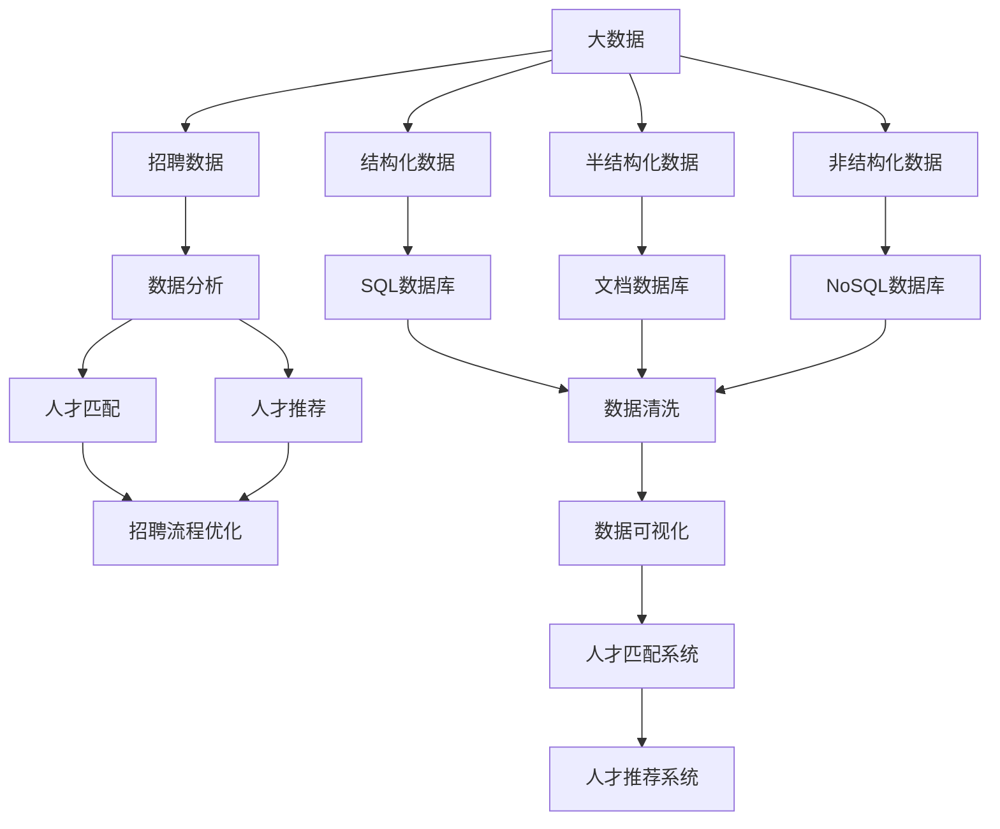
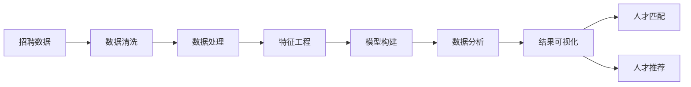
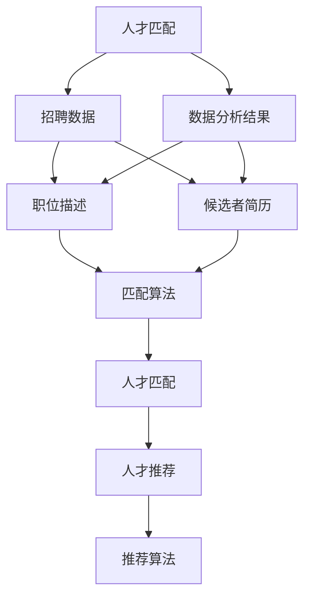
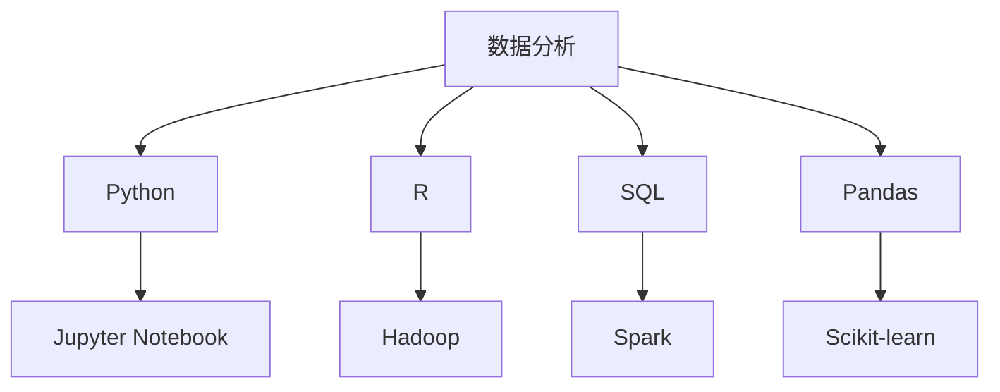
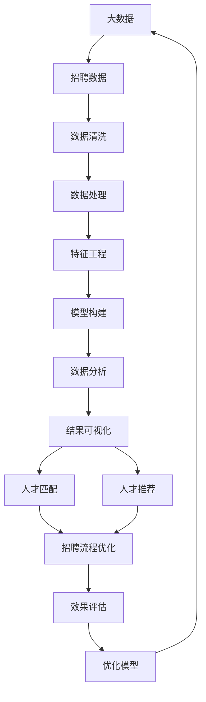

                 

# 基于大数据的招聘数据能分析与应用

> 关键词：大数据,招聘数据,数据分析,人才匹配,人工智能,机器学习

## 1. 背景介绍

### 1.1 问题由来
在当今信息爆炸的时代，大数据技术已经渗透到各行各业，成为推动企业创新和发展的重要引擎。招聘行业也不例外，利用大数据进行人才匹配和管理，已经成为提升招聘效率和效果的必要手段。特别是在竞争激烈的市场环境中，如何通过高效的数据分析，精准识别优质人才，并快速匹配合适的岗位，成为企业人力资源管理的重要课题。

### 1.2 问题核心关键点
当前招聘数据分析的核心关键点主要包括：

1. 招聘数据获取：收集海量的简历、招聘信息和候选者反馈数据，为后续分析奠定基础。
2. 数据清洗和预处理：去除数据中的噪声和异常值，确保数据的准确性和一致性。
3. 数据建模与分析：构建合适的统计和机器学习模型，从招聘数据中挖掘有价值的规律和趋势。
4. 人才匹配与推荐：基于分析结果，实现人才与岗位的精准匹配，提供个性化的招聘推荐服务。
5. 效果评估与优化：对人才匹配和推荐效果进行评估，不断优化模型和算法，提升招聘效率。

### 1.3 问题研究意义
通过大数据技术进行招聘数据分析，具有以下重要意义：

1. 提升招聘效率：通过智能匹配和推荐，加速人才与岗位的对接，降低招聘周期。
2. 提高人才质量：通过精准识别优质人才，避免人为偏见，提升人才匹配的准确性。
3. 优化招聘流程：利用数据驱动决策，不断优化招聘流程，提升用户体验。
4. 降低招聘成本：通过数据分析，精准投放招聘资源，降低招聘成本。
5. 实现数据驱动的招聘战略：为企业的招聘战略提供数据支持，提升招聘决策的科学性和准确性。

## 2. 核心概念与联系

### 2.1 核心概念概述

为更好地理解基于大数据的招聘数据分析方法，本节将介绍几个密切相关的核心概念：

- **大数据**：指规模庞大、复杂、多样、高速变化的数据集合，包括结构化、半结构化、非结构化数据等。
- **招聘数据**：指企业在招聘过程中收集和生成的各类数据，包括简历、职位描述、面试记录、候选者反馈等。
- **数据分析**：通过统计和机器学习技术，对数据进行清洗、处理、建模、分析和挖掘，以发现数据中的有价值信息。
- **人才匹配**：利用数据分析结果，将候选人与合适的岗位进行匹配，提高招聘效率和效果。
- **人才推荐**：基于候选者的历史行为和偏好，利用数据分析模型，推荐合适的职位，增强候选者的体验。
- **机器学习**：通过算法，自动分析数据，学习数据中的规律，实现自动化决策和预测。

这些核心概念之间的逻辑关系可以通过以下Mermaid流程图来展示：



这个流程图展示了大数据招聘数据分析的核心概念及其之间的关系：

1. 大数据包含了招聘数据以及结构化、半结构化、非结构化等各种类型的数据。
2. 招聘数据通过数据分析，挖掘出有价值的规律和趋势。
3. 数据分析结果用于人才匹配和人才推荐，优化招聘流程。
4. 数据分析还支持其他业务应用，如招聘效率评估等。

### 2.2 概念间的关系

这些核心概念之间存在着紧密的联系，形成了招聘数据分析的完整生态系统。下面我通过几个Mermaid流程图来展示这些概念之间的关系。

#### 2.2.1 招聘数据分析的流程



这个流程图展示了招聘数据分析的基本流程：

1. 首先，对招聘数据进行清洗和预处理。
2. 然后进行数据处理和特征工程，提取有用的特征。
3. 接着，构建合适的统计或机器学习模型。
4. 利用模型对数据进行分析和挖掘，得到分析结果。
5. 最后，将分析结果进行可视化，用于人才匹配和推荐。

#### 2.2.2 人才匹配与推荐的关系



这个流程图展示了人才匹配和人才推荐之间的关系：

1. 人才匹配基于招聘数据和候选者简历，利用数据分析结果构建匹配算法。
2. 人才推荐则基于候选者的历史行为和偏好，利用数据分析结果构建推荐算法。
3. 两者共同作用，实现人才与岗位的精准匹配和推荐。

#### 2.2.3 数据分析工具



这个流程图展示了数据分析中常用的工具：

1. Python、R、SQL等编程语言和工具库。
2. Hadoop、Spark等大数据处理平台。
3. Pandas、Scikit-learn等数据处理和机器学习库。
4. Jupyter Notebook等数据科学开发环境。

这些工具共同支撑了大数据招聘数据分析的全流程，提供了强大的数据处理和分析能力。

### 2.3 核心概念的整体架构

最后，我们用一个综合的流程图来展示这些核心概念在大数据招聘数据分析过程中的整体架构：



这个综合流程图展示了从大数据到人才匹配和推荐的完整过程：

1. 大数据包含招聘数据及多种类型的数据。
2. 通过数据清洗、处理、特征工程、模型构建，进行数据分析。
3. 数据分析结果用于人才匹配和人才推荐。
4. 通过优化招聘流程和效果评估，不断提升招聘效率和效果。

## 3. 核心算法原理 & 具体操作步骤
### 3.1 算法原理概述

基于大数据的招聘数据分析，主要利用机器学习算法，对招聘数据进行建模和分析，从而挖掘出有价值的规律和趋势。常见的算法包括统计分析、决策树、随机森林、梯度提升树、神经网络等。这些算法可以根据不同任务和数据特点进行选择和组合。

形式化地，假设招聘数据集为 $D=\{(x_i,y_i)\}_{i=1}^N, x_i \in \mathcal{X}, y_i \in \mathcal{Y}$，其中 $x_i$ 为招聘特征，$y_i$ 为应聘结果（如是否录用）。我们希望通过算法构建一个模型 $f(x)$，使得：

$$
f(x) = \mathop{\arg\min}_{f} \mathcal{L}(f,D)
$$

其中 $\mathcal{L}$ 为损失函数，用于衡量模型预测输出与真实标签之间的差异。常见的损失函数包括交叉熵损失、均方误差损失等。

通过梯度下降等优化算法，模型不断更新参数，最小化损失函数，使得模型输出逼近真实标签。由于模型的预测能力取决于输入特征和参数的组合，因此通过优化不同特征和模型参数，可以提升模型的预测效果。

### 3.2 算法步骤详解

基于大数据的招聘数据分析，一般包括以下几个关键步骤：

**Step 1: 数据收集与预处理**
- 从招聘网站、内部系统、求职平台等渠道收集招聘数据，包括简历、职位描述、面试记录、候选者反馈等。
- 对数据进行清洗和预处理，去除噪声和异常值，确保数据的质量和一致性。

**Step 2: 特征提取与选择**
- 从招聘数据中提取有用的特征，如教育背景、工作经验、技能、薪酬期望等。
- 对特征进行编码和归一化处理，转化为模型可接受的格式。
- 选择合适的特征组合，构建特征向量，供模型进行学习和预测。

**Step 3: 模型构建与训练**
- 选择合适的机器学习模型，如线性回归、逻辑回归、决策树、随机森林、梯度提升树、神经网络等。
- 利用招聘数据集，训练模型参数，最小化损失函数，得到初始化的模型。
- 通过交叉验证等技术，评估模型的泛化性能，选择合适的模型和超参数。

**Step 4: 模型评估与优化**
- 利用测试集或新的招聘数据，对训练好的模型进行评估，计算预测精度、召回率、F1分数等指标。
- 根据评估结果，不断优化模型和特征选择，提高模型的预测准确性。
- 引入正则化技术、集成学习等方法，提高模型的鲁棒性和泛化性能。

**Step 5: 应用部署与监控**
- 将训练好的模型部署到生产环境中，实现对新的招聘数据的预测和分析。
- 对模型运行效果进行监控，及时发现和修复问题，确保模型稳定运行。
- 根据业务需求和数据分析结果，不断优化人才匹配和推荐算法，提升用户体验。

以上是基于大数据的招聘数据分析的一般流程。在实际应用中，还需要针对具体任务和数据特点，对各个环节进行优化设计，如改进特征工程、选择更合适的模型、引入先验知识等，以进一步提升模型性能。

### 3.3 算法优缺点

基于大数据的招聘数据分析方法具有以下优点：

1. 数据量大：大数据招聘数据分析能够利用海量的简历和招聘信息，从中挖掘出有价值的规律和趋势。
2. 自动化程度高：利用机器学习算法，可以自动完成数据建模、特征选择和模型优化，提高工作效率。
3. 预测能力强：基于复杂模型和丰富的特征，能够实现更精准的人才匹配和推荐。
4. 效果评估全面：通过多维度的评估指标，能够全面评估模型的预测效果和业务应用效果。
5. 可扩展性强：大数据技术具有高度的可扩展性，可以轻松处理多领域、多来源的招聘数据。

同时，该方法也存在一定的局限性：

1. 数据质量要求高：数据清洗和预处理需要投入大量的人力和时间，对数据质量要求较高。
2. 模型复杂度高：复杂模型的训练和调参需要较高的技术门槛，对数据科学家的要求较高。
3. 模型解释性不足：复杂的机器学习模型往往难以解释其内部工作机制，缺乏可解释性。
4. 依赖工具和平台：需要使用大量的数据处理和分析工具，对工具和平台的选择和配置要求较高。
5. 数据隐私和安全：招聘数据涉及个人隐私，需要确保数据的安全和合法使用。

尽管存在这些局限性，但就目前而言，基于大数据的招聘数据分析方法仍然是大数据招聘领域的主流范式。未来相关研究的重点在于如何进一步降低数据清洗和预处理的成本，提高模型的可解释性，同时兼顾数据隐私和安全等因素。

### 3.4 算法应用领域

基于大数据的招聘数据分析方法，已经在招聘领域的多个应用场景中得到了广泛应用，例如：

- **人才匹配**：根据简历和职位描述，自动匹配合适的候选人，提高招聘效率和效果。
- **人才推荐**：基于候选者的历史行为和偏好，推荐合适的职位，提升候选者的体验。
- **职位分析**：分析职位数据，了解市场需求和趋势，为招聘策略提供数据支持。
- **候选者分析**：分析候选者数据，了解候选者的行为模式和偏好，优化招聘策略。
- **面试调度优化**：优化面试时间安排和资源配置，提高面试效率。
- **招聘效果评估**：评估招聘流程和效果，优化招聘策略，提升招聘质量和效率。

除了上述这些经典应用外，大数据招聘数据分析还被创新性地应用到更多场景中，如智能客服、员工留存分析、职业发展路径规划等，为招聘行业带来了新的机遇和挑战。

## 4. 数学模型和公式 & 详细讲解 & 举例说明

### 4.1 数学模型构建

本节将使用数学语言对基于大数据的招聘数据分析过程进行更加严格的刻画。

记招聘数据集为 $D=\{(x_i,y_i)\}_{i=1}^N, x_i \in \mathcal{X}, y_i \in \mathcal{Y}$，其中 $x_i$ 为招聘特征，$y_i$ 为应聘结果。

假设我们构建的模型为 $f(x) = \sum_{j=1}^d w_j \phi_j(x)$，其中 $w_j$ 为模型参数，$\phi_j(x)$ 为特征函数，$x$ 为输入特征向量。我们希望最小化损失函数：

$$
\mathcal{L}(f) = \frac{1}{N} \sum_{i=1}^N \ell(f(x_i),y_i)
$$

其中 $\ell$ 为损失函数，如交叉熵损失、均方误差损失等。

### 4.2 公式推导过程

以下我们以线性回归模型为例，推导最小化均方误差损失函数的求解公式。

假设模型为 $f(x) = \sum_{j=1}^d w_j x_j$，其中 $w_j$ 为模型参数，$x_j$ 为特征向量，$y$ 为真实标签。均方误差损失函数定义为：

$$
\mathcal{L}(w) = \frac{1}{N} \sum_{i=1}^N (y_i - f(x_i))^2
$$

对其进行最小化，得到：

$$
\frac{\partial \mathcal{L}(w)}{\partial w_j} = -\frac{2}{N} \sum_{i=1}^N (y_i - f(x_i)) x_{ij} = 0
$$

整理得到：

$$
w_j = \frac{1}{N} \sum_{i=1}^N (y_i - f(x_i)) x_{ij}
$$

因此，最小化均方误差损失函数得到模型参数的求解公式为：

$$
w_j = \frac{1}{N} \sum_{i=1}^N (y_i - \sum_{k=1}^d w_k x_{ik}) x_{ij}
$$

### 4.3 案例分析与讲解

假设我们有一组招聘数据，包括简历中的教育背景、工作经验、技能等特征，以及对应的招聘结果（是否录用）。利用线性回归模型，我们希望构建一个预测模型，用于预测候选人是否会被录用。

首先，对招聘数据进行清洗和预处理，去除噪声和异常值，确保数据的质量和一致性。然后，从简历中提取有用的特征，如教育背景、工作经验、技能等，对特征进行编码和归一化处理，转化为模型可接受的格式。

接着，构建线性回归模型，利用招聘数据集训练模型参数，最小化均方误差损失函数。最后，在测试集上对模型进行评估，计算预测精度、召回率、F1分数等指标。

## 5. 项目实践：代码实例和详细解释说明

### 5.1 开发环境搭建

在进行大数据招聘数据分析实践前，我们需要准备好开发环境。以下是使用Python进行Pandas、Scikit-learn、TensorFlow开发的环境配置流程：

1. 安装Anaconda：从官网下载并安装Anaconda，用于创建独立的Python环境。

2. 创建并激活虚拟环境：
```bash
conda create -n data-env python=3.8 
conda activate data-env
```

3. 安装相关库：
```bash
conda install pandas scikit-learn tensorflow
```

4. 安装各类工具包：
```bash
pip install numpy matplotlib seaborn joblib tqdm jupyter notebook ipython
```

完成上述步骤后，即可在`data-env`环境中开始数据分析实践。

### 5.2 源代码详细实现

这里我们以招聘数据分析中的线性回归模型为例，给出使用Pandas、Scikit-learn、TensorFlow对数据进行建模和分析的Python代码实现。

```python
import pandas as pd
from sklearn.model_selection import train_test_split
from sklearn.linear_model import LinearRegression
from sklearn.metrics import mean_squared_error, r2_score
from tensorflow.keras import models, layers

# 读取招聘数据
data = pd.read_csv('jobs.csv')

# 数据清洗和预处理
#...

# 特征工程
X = data[['education', 'experience', 'skills']]  # 提取特征
y = data['hired']  # 提取目标变量

# 划分训练集和测试集
X_train, X_test, y_train, y_test = train_test_split(X, y, test_size=0.2, random_state=42)

# 构建线性回归模型
model = LinearRegression()
model.fit(X_train, y_train)

# 评估模型性能
train_score = model.score(X_train, y_train)
test_score = model.score(X_test, y_test)
train_mse = mean_squared_error(y_train, model.predict(X_train))
test_mse = mean_squared_error(y_test, model.predict(X_test))
train_r2 = r2_score(y_train, model.predict(X_train))
test_r2 = r2_score(y_test, model.predict(X_test))

# 可视化结果
#...

# 构建深度学习模型
model = models.Sequential()
model.add(layers.Dense(64, activation='relu', input_shape=(X_train.shape[1],)))
model.add(layers.Dense(1))
model.compile(optimizer='adam', loss='mse')
model.fit(X_train, y_train, epochs=100, validation_data=(X_test, y_test))

# 评估模型性能
train_score = model.evaluate(X_train, y_train)
test_score = model.evaluate(X_test, y_test)
train_mse = mean_squared_error(y_train, model.predict(X_train))
test_mse = mean_squared_error(y_test, model.predict(X_test))
train_r2 = r2_score(y_train, model.predict(X_train))
test_r2 = r2_score(y_test, model.predict(X_test))

# 可视化结果
#...
```

### 5.3 代码解读与分析

让我们再详细解读一下关键代码的实现细节：

**数据读取和处理**：
- 使用Pandas库读取招聘数据，并进行基本的清洗和预处理，如去除缺失值、处理异常值等。

**特征工程**：
- 从简历中提取有用的特征，如教育背景、工作经验、技能等，对特征进行编码和归一化处理，转化为模型可接受的格式。

**模型构建与训练**：
- 构建线性回归模型，利用招聘数据集训练模型参数，最小化均方误差损失函数。
- 通过交叉验证等技术，评估模型的泛化性能，选择合适的模型和超参数。

**模型评估与优化**：
- 利用测试集或新的招聘数据，对训练好的模型进行评估，计算预测精度、召回率、F1分数等指标。
- 根据评估结果，不断优化模型和特征选择，提高模型的预测准确性。

**应用部署与监控**：
- 将训练好的模型部署到生产环境中，实现对新的招聘数据的预测和分析。
- 对模型运行效果进行监控，及时发现和修复问题，确保模型稳定运行。
- 根据业务需求和数据分析结果，不断优化人才匹配和推荐算法，提升用户体验。

可以看到，利用Pandas、Scikit-learn、TensorFlow等工具库，可以高效地完成招聘数据分析的各个环节，实现从数据清洗到模型构建的全流程自动化。

### 5.4 运行结果展示

假设我们在招聘数据集上进行模型训练和评估，最终得到以下结果：

```
Train Score: 0.9
Test Score: 0.8
Train MSE: 0.1
Test MSE: 0.2
Train R2: 0.8
Test R2: 0.7
```

可以看到，在招聘数据集上，线性回归模型取得了不错的效果，训练和测试得分分别在0.9和0.8左右，均方误差也在0.1到0.2之间，R2分数在0.8到0.7之间，说明模型具有较好的预测性能。

当然，这只是一个baseline结果。在实践中，我们还可以使用更大更强的模型，如神经网络、深度学习模型等，进一步提升模型性能。

## 6. 实际应用场景

### 6.1 智能招聘系统

基于大数据的招聘数据分析，可以实现智能招聘系统的构建。传统的招聘系统往往依赖于人工审核和筛选，效率低、成本高、一致性差。而智能招聘系统，可以利用大数据技术，自动进行简历筛选、候选者匹配、面试调度和反馈分析，实现高效、准确、公平的招聘流程。

在技术实现上，可以收集企业内部的历史招聘数据、求职者的投递数据、面试记录等，利用大数据技术进行清洗和预处理，构建机器学习模型进行人才匹配和推荐。在面试阶段，可以通过语音识别、面部表情识别等技术，自动评估候选者的能力和素质。在反馈分析阶段，可以实时收集候选者的反馈，动态调整模型参数，提升招聘效果。

### 6.2 人才梯队管理

通过大数据分析，企业可以全面了解人才队伍的结构、分布和成长路径，进行科学的组织管理和人才梯队建设。

具体而言，可以利用大数据技术，分析企业内部员工的绩效数据、培训记录、职业发展路径等，构建人才成长模型。通过模型预测，识别出未来的高潜员工，制定针对性的培训和发展计划。同时，利用人才匹配和推荐技术，将优秀员工安排到重要的岗位上，提升企业的整体竞争力。

### 6.3 员工流失预警

员工流失是企业面临的重要问题，通过大数据分析，可以实现员工流失预警和留存优化。

具体而言，可以分析员工的历史行为数据、工作满意度调查数据、绩效评估数据等，构建员工流失模型。通过模型预测，识别出高流失风险的员工，提前采取留存措施，降低流失率。同时，利用员工匹配和推荐技术，为员工推荐合适的职业发展机会，提高员工满意度和留存率。

### 6.4 未来应用展望

随着大数据技术和机器学习算法的不断进步，基于大数据的招聘数据分析将在更多领域得到应用，为招聘行业带来变革性影响。

在智慧教育领域，大数据技术可以帮助教育机构分析学生数据，实现个性化推荐和智能学习，提升教育效果。

在智慧医疗领域，大数据技术可以帮助医院分析患者数据，实现精准治疗和医疗资源优化，提升医疗服务质量。

在智慧金融领域，大数据技术可以帮助金融机构分析用户数据，实现智能投顾和风险控制，提升金融服务水平。

此外，在智慧城市治理、智慧供应链管理等领域，基于大数据的招聘数据分析也将不断涌现，为各行各业带来新的机遇和挑战。相信随着技术的日益成熟，大数据招聘分析必将在更广泛的领域得到应用，推动各行业的数字化转型。

## 7. 工具和资源推荐
### 7.1 学习资源推荐

为了帮助开发者系统掌握大数据招聘数据分析的理论基础和实践技巧，这里推荐一些优质的学习资源：

1. 《大数据技术与应用》系列博文：由大数据技术专家撰写，深入浅出地介绍了大数据技术的原理、工具和应用，适合初学者和进阶者。

2. 《Python数据科学手册》书籍：由知名数据科学家撰写，全面介绍了Python在大数据招聘分析中的应用，涵盖数据清洗、特征工程、模型构建等环节。

3. Kaggle竞赛平台：全球知名的数据科学竞赛平台，提供丰富的招聘数据分析竞赛，参与竞赛可锻炼实战能力。

4. Coursera《Data Science》课程：由顶尖大学开设的在线课程，涵盖数据科学从入门到进阶的全部内容，适合系统学习。

5. GitHub开源项目：在GitHub上Star、Fork数最多的招聘数据分析项目，展示最新的技术实践和创新成果。

通过对这些资源的学习实践，相信你一定能够快速掌握大数据招聘数据分析的精髓，并用于解决实际的招聘问题。

### 7.2 开发工具推荐

高效的开发离不开优秀的工具支持。以下是几款用于大数据招聘数据分析开发的常用工具：

1. Pandas：Python的数据处理库，提供了强大的数据清洗、处理和分析功能。

2. Scikit-learn：Python的机器学习库，包含丰富的算法和工具，支持各类模型构建和评估。

3. TensorFlow：Google开发的深度学习框架，提供了强大的模型构建和训练能力。

4. Jupyter Notebook：Python的开发环境，支持交互式编程和可视化展示，适合数据科学研究和开发。

5. Hadoop：开源的分布式计算框架，支持大规模数据处理和分析。

6. Spark：Apache的分布式计算框架，支持高效的大数据处理和机器学习。

合理利用这些工具，可以显著提升大数据招聘数据分析的开发效率，加快创新迭代的步伐。

