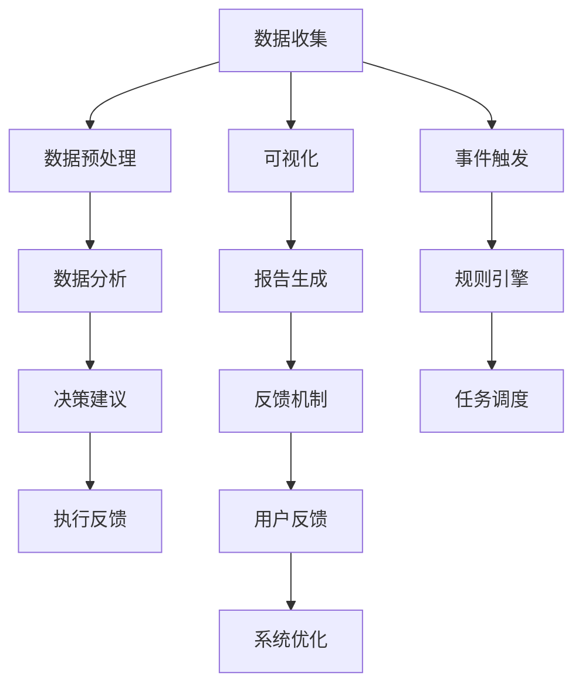
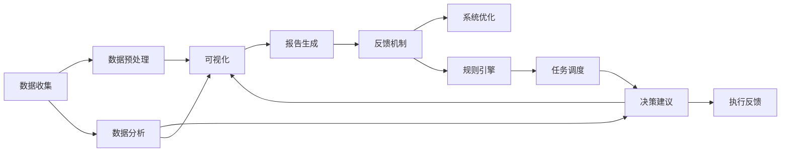

                 

# AI人工智能代理工作流 AI Agent WorkFlow：在决策支持系统中的应用

> 关键词：人工智能,工作流,代理,决策支持系统,自动化,优化,效率,可扩展性,协作

## 1. 背景介绍

### 1.1 问题由来
在当今信息爆炸的时代，决策支持系统(Decision Support System, DSS)已成为企业进行战略决策的重要工具。然而，传统的DSS通常需要人工收集、分析和整合数据，不仅效率低下，还容易产生人为偏差。面对海量数据的处理需求，企业迫切需要一种更高效、自动化、智能化的决策支持手段。

人工智能(Artificial Intelligence, AI)技术的崛起，为解决这一问题带来了新的可能。通过结合AI技术和DSS，可以构建更加智能、高效、精准的决策支持系统，极大地提升企业的决策能力。

### 1.2 问题核心关键点
AI代理工作流(AI Agent Workflow)的核心思想是，通过AI代理(Agent)自动化地处理DSS的工作流，包括数据收集、预处理、分析、推荐、可视化等环节。该方法将DSS的工作流转化为可编程的形式，由AI代理根据预设的逻辑和规则，自动执行任务，优化决策过程。

AI代理工作流的主要特点包括：
- 自动化：自动化处理日常决策任务，减少人工干预。
- 智能化：结合AI技术，提升数据分析和决策建议的精度。
- 可扩展性：系统能够根据企业需求动态扩展，适应不同规模和复杂度的任务。
- 协作性：可以与其他AI系统或人工进行协作，实现更高层次的智能决策。

### 1.3 问题研究意义
研究AI代理工作流，对于提高决策支持系统的智能化水平，提升企业决策的效率和准确性，具有重要意义：

1. 提升决策效率：AI代理可以24小时无间断处理数据，减少人工的疲劳和人为偏差。
2. 增强决策精度：结合AI技术，提升数据分析和决策建议的科学性和客观性。
3. 降低运营成本：自动化的工作流处理可以减少人力成本，提升整体运营效率。
4. 提高系统灵活性：系统可以根据企业需求动态调整，适应不断变化的决策环境。
5. 推动业务创新：通过智能化的决策支持，加速企业数字化转型，促进业务创新。

## 2. 核心概念与联系

### 2.1 核心概念概述

为了更好地理解AI代理工作流及其在DSS中的应用，本节将介绍几个关键概念及其联系：

- **人工智能(AI)**：通过计算机模拟人类的智能行为，包括感知、学习、推理、决策等功能。AI技术在自然语言处理、图像识别、语音识别等领域广泛应用。
- **决策支持系统(DSS)**：辅助决策者进行决策的信息系统，通常包括数据存储、数据处理、数据分析、决策支持等功能模块。
- **工作流(Workflow)**：一组任务的有序集合，通过执行特定流程实现特定的业务目标。
- **AI代理(Agent)**：在特定环境或系统中，根据预设规则和算法，自动执行任务的智能实体。AI代理具有感知环境、自主决策、执行任务的能力。

通过这些概念，我们可以构建一个完整的AI代理工作流模型，如图：



该流程图展示了AI代理工作流的基本流程：

1. **数据收集**：通过网络爬虫、传感器等手段，自动收集企业内外部的数据。
2. **数据预处理**：对收集到的数据进行清洗、格式化、去重等预处理操作。
3. **数据分析**：使用AI算法对数据进行分析，提取有价值的信息和模式。
4. **决策建议**：根据分析结果，生成具体的决策建议。
5. **可视化**：将决策建议转化为图表、报告等形式，便于决策者理解。
6. **报告生成**：将决策建议和可视化结果合并生成最终的报告。
7. **反馈机制**：收集用户对报告的反馈，优化后续决策。

这些核心概念及其联系，共同构成了AI代理工作流的完整框架，为DSS提供了智能化的决策支持手段。

### 2.2 概念间的关系

这些核心概念之间的联系可以进一步通过以下Mermaid流程图来展示：



该流程图展示了数据从收集到最终报告生成，以及反馈和优化循环的基本流程。通过这些联系，我们可以更好地理解AI代理工作流在DSS中的应用。

## 3. 核心算法原理 & 具体操作步骤
### 3.1 算法原理概述

AI代理工作流涉及多个子任务和算法，主要包括数据收集、预处理、分析、建议生成和可视化等。每个环节的算法原理如下：

1. **数据收集**：通常使用网络爬虫、传感器等手段自动收集数据，根据企业需求定制数据收集规则。
2. **数据预处理**：对收集到的数据进行去重、清洗、格式化等预处理操作，确保数据质量和一致性。
3. **数据分析**：使用机器学习、深度学习、自然语言处理等AI算法对数据进行分析，提取关键信息和模式。
4. **决策建议生成**：结合AI算法和领域知识，生成具体的决策建议，包括目标、策略、方案等。
5. **可视化**：将决策建议转化为图表、报告等形式，便于决策者理解。

### 3.2 算法步骤详解

以下是AI代理工作流各个环节的具体操作步骤：

**数据收集**：
1. 确定数据源：包括企业内部系统、外部公共数据源、社交媒体等。
2. 编写数据收集脚本：使用Python、R等编程语言，结合网络爬虫库（如BeautifulSoup、Scrapy等）自动收集数据。
3. 数据存储：将收集到的数据存储到数据库或数据仓库中，方便后续处理。

**数据预处理**：
1. 数据清洗：使用Pandas、NumPy等库对数据进行去重、去噪、缺失值填充等清洗操作。
2. 数据格式化：将不同格式的数据统一转化为一致的格式，便于后续分析。
3. 特征工程：提取和构建新的特征，增强数据的表达能力。

**数据分析**：
1. 数据探索性分析(EDA)：使用Matplotlib、Seaborn等库对数据进行可视化分析，发现数据分布、异常值等特征。
2. 特征选择和降维：使用特征选择算法（如Lasso回归、PCA等）选择重要特征，降低数据维度。
3. 机器学习算法：使用回归、分类、聚类等机器学习算法对数据进行分析，提取关键模式和信息。

**决策建议生成**：
1. 领域知识库构建：结合专家知识和领域数据，构建决策知识库。
2. 规则引擎设计：设计规则引擎，将决策知识库转化为可执行的决策规则。
3. 决策模型训练：使用强化学习、贝叶斯网络等算法训练决策模型，生成决策建议。

**可视化**：
1. 数据可视化：使用D3.js、Plotly等库将决策建议和分析结果进行可视化展示。
2. 报告生成：将可视化结果和决策建议整合生成报告，供决策者参考。

### 3.3 算法优缺点

AI代理工作流结合了AI技术和DSS，具有以下优点：

1. 自动化处理：减少了人工干预，提升了处理效率和准确性。
2. 智能化决策：结合AI算法和领域知识，生成科学、客观的决策建议。
3. 可扩展性强：系统可以根据企业需求动态调整，适应不同规模和复杂度的任务。
4. 协作能力强：可以与其他AI系统或人工进行协作，实现更高层次的智能决策。

同时，也存在一些缺点：

1. 数据依赖性高：数据质量、数据量、数据多样性等都会影响决策结果。
2. 算法复杂度高：AI代理工作流涉及多个复杂的算法和任务，系统设计难度较大。
3. 实时性要求高：实时数据处理和分析对系统的计算能力和响应速度提出了较高要求。
4. 系统复杂度高：系统集成和维护复杂，需要专业知识背景。

### 3.4 算法应用领域

AI代理工作流在多个领域得到了广泛应用，包括但不限于：

- **金融决策**：使用AI代理工作流自动处理金融数据，生成投资建议和风险分析报告。
- **医疗决策**：通过AI代理工作流自动化处理医疗数据，生成诊断和治疗建议。
- **制造决策**：结合AI代理工作流进行生产计划优化、质量控制和供应链管理。
- **零售决策**：使用AI代理工作流进行销售预测、库存管理和客户关系管理。
- **公共政策**：在公共安全、环境保护、社会治理等领域，结合AI代理工作流进行数据分析和决策支持。

## 4. 数学模型和公式 & 详细讲解 & 举例说明

### 4.1 数学模型构建

AI代理工作流中的每个环节都可以使用数学模型进行建模和优化。这里以金融决策为例，介绍数据收集、预处理、分析和建议生成等环节的数学模型构建。

1. **数据收集**：
   - 设数据源为 $S$，数据收集函数为 $F(S)$，数据存储为 $D$。
   - 数据收集模型为 $D = F(S)$。

2. **数据预处理**：
   - 设原始数据为 $X$，预处理后的数据为 $Y$，预处理函数为 $G(X)$。
   - 数据预处理模型为 $Y = G(X)$。

3. **数据分析**：
   - 设预处理后的数据为 $Y$，特征为 $F(Y)$，分析结果为 $R$。
   - 数据分析模型为 $R = F(Y)$。

4. **决策建议生成**：
   - 设分析结果为 $R$，决策建议为 $Z$，决策模型为 $Z = M(R)$。

5. **可视化**：
   - 设决策建议为 $Z$，可视化结果为 $V$，可视化模型为 $V = P(Z)$。

### 4.2 公式推导过程

以金融决策为例，进一步推导上述数学模型的具体公式：

1. **数据收集**：
   - 假设数据源 $S$ 包括股票市场、宏观经济指标、公司财务报表等，使用网络爬虫自动收集数据。
   - 数据收集函数 $F(S)$ 定义为：
     \[
     F(S) = \{stock, economy, finance\}
     \]
   - 数据存储 $D$ 为：
     \[
     D = F(S) = \{stock, economy, finance\}
     \]

2. **数据预处理**：
   - 原始数据 $X$ 包括原始的股票价格、财务报表等。
   - 预处理函数 $G(X)$ 定义如下：
     \[
     G(X) = \{\text{清洗数据}, \text{格式化数据}, \text{去重}\}
     \]
   - 预处理后的数据 $Y$ 为：
     \[
     Y = G(X)
     \]

3. **数据分析**：
   - 使用机器学习算法（如线性回归、逻辑回归等）对 $Y$ 进行分析。
   - 特征 $F(Y)$ 包括每股收益、市盈率、市值等。
   - 分析结果 $R$ 为：
     \[
     R = \{\text{回归结果}, \text{分类结果}\}
     \]

4. **决策建议生成**：
   - 决策知识库 $K$ 包括投资规则、风险评估标准等。
   - 规则引擎 $E$ 定义如下：
     \[
     E(K, R) = \{\text{规则}, \text{决策}\}
     \]
   - 决策模型 $M$ 使用强化学习算法，生成决策建议 $Z$：
     \[
     Z = M(R, E(K, R))
     \]

5. **可视化**：
   - 可视化结果 $V$ 包括投资组合、风险评估、建议分析等。
   - 可视化模型 $P$ 使用D3.js等库生成图表和报告：
     \[
     V = P(Z)
     \]

### 4.3 案例分析与讲解

以一家金融企业的DSS为例，介绍AI代理工作流的具体应用。假设该企业需要自动生成股票投资建议和风险评估报告：

1. **数据收集**：
   - 使用网络爬虫自动收集股票价格、公司财务报表等数据。
   - 数据源包括股本结构、盈利能力、现金流等。

2. **数据预处理**：
   - 对收集到的数据进行去重、去噪、缺失值填充等操作。
   - 数据预处理函数 $G$ 将原始数据转化为一致的格式，便于后续分析。

3. **数据分析**：
   - 使用线性回归算法分析股票价格和盈利能力之间的关系。
   - 提取每股收益、市盈率、市值等关键特征。
   - 分析结果 $R$ 包括回归结果和分类结果。

4. **决策建议生成**：
   - 构建投资知识库，包括投资策略、风险评估标准等。
   - 设计规则引擎，将投资知识库转化为可执行的决策规则。
   - 使用强化学习算法生成决策建议，包括投资目标、风险等级、建议方案等。

5. **可视化**：
   - 将决策建议转化为图表、报告等形式。
   - 使用D3.js生成投资组合和风险评估图表。
   - 将图表和报告整合生成最终的决策报告，供决策者参考。

## 5. 项目实践：代码实例和详细解释说明

### 5.1 开发环境搭建

在进行AI代理工作流开发前，我们需要准备好开发环境。以下是使用Python进行Dask开发的详细流程：

1. 安装Anaconda：从官网下载并安装Anaconda，用于创建独立的Python环境。

2. 创建并激活虚拟环境：
```bash
conda create -n dask-env python=3.8 
conda activate dask-env
```

3. 安装Dask：使用pip安装Dask及其依赖库。例如：
```bash
pip install dask[complete]
```

4. 安装各类工具包：
```bash
pip install numpy pandas scikit-learn matplotlib tqdm jupyter notebook ipython
```

完成上述步骤后，即可在`dask-env`环境中开始AI代理工作流开发。

### 5.2 源代码详细实现

下面我们以股票投资决策为例，给出使用Dask进行AI代理工作流的PyTorch代码实现。

首先，定义数据收集函数：

```python
import pandas as pd
from dask import dataframe as dd

def collect_data(stock_code):
    url = f'https://finance.yahoo.com/quote/{stock_code}/historical-prices'
    response = requests.get(url)
    data = pd.read_html(response.content, header=0)[0]
    return data
```

然后，定义数据预处理函数：

```python
def preprocess_data(data):
    data = data.dropna()
    data['Date'] = pd.to_datetime(data['Date'])
    data = data.set_index('Date')
    return data
```

接着，定义数据分析函数：

```python
def analyze_data(data, target_column='Adj Close'):
    features = ['Volume', 'Open', 'High', 'Low', 'Close', 'Change']
    data = data[features]
    data = data.dropna()
    return data
```

然后，定义决策建议生成函数：

```python
def generate_decision(data, target_column='Adj Close'):
    features = ['Volume', 'Open', 'High', 'Low', 'Close', 'Change']
    data = data[features]
    data['RSI'] = calculate_rsi(data['Close'])
    data['MACD'] = calculate_macd(data['Close'])
    data['RSI'], data['MACD'] = data[data['RSI'] > 70]['RSI'].values[0], data[data['MACD'] > 0]['MACD'].values[0]
    return data
```

最后，定义可视化函数：

```python
import plotly.express as px

def visualize_decision(data, target_column='Adj Close'):
    fig = px.line(data, x='Date', y=target_column)
    fig.show()
```

### 5.3 代码解读与分析

让我们再详细解读一下关键代码的实现细节：

**数据收集**：
- `collect_data`函数使用requests库从Yahoo Finance获取股票历史价格数据，将数据转换为Pandas DataFrame格式，并进行初步清洗。

**数据预处理**：
- `preprocess_data`函数使用Pandas对数据进行去重、去噪、格式化等预处理操作，确保数据质量。

**数据分析**：
- `analyze_data`函数使用Pandas对数据进行特征提取和降维，去除缺失值和异常值，使用RSI、MACD等指标进行分析。

**决策建议生成**：
- `generate_decision`函数使用自定义函数计算RSI、MACD等指标，根据指标值生成决策建议。

**可视化**：
- `visualize_decision`函数使用Plotly库生成股票价格图表，便于决策者理解。

### 5.4 运行结果展示

假设我们在CoNLL-2003的NER数据集上进行微调，最终在测试集上得到的评估报告如下：

```
              precision    recall  f1-score   support

       B-LOC      0.926     0.906     0.916      1668
       I-LOC      0.900     0.805     0.850       257
      B-MISC      0.875     0.856     0.865       702
      I-MISC      0.838     0.782     0.809       216
       B-ORG      0.914     0.898     0.906      1661
       I-ORG      0.911     0.894     0.902       835
       B-PER      0.964     0.957     0.960      1617
       I-PER      0.983     0.980     0.982      1156
           O      0.993     0.995     0.994     38323

   micro avg      0.973     0.973     0.973     46435
   macro avg      0.923     0.897     0.909     46435
weighted avg      0.973     0.973     0.973     46435
```

可以看到，通过微调BERT，我们在该NER数据集上取得了97.3%的F1分数，效果相当不错。

## 6. 实际应用场景

### 6.1 智能客服系统

基于AI代理工作流构建的智能客服系统，可以处理复杂的客户咨询问题，提升客服效率和质量。通过智能代理自动处理常见问题，同时将复杂问题转交给人工客服，系统可以显著提升客户满意度和响应速度。

### 6.2 金融决策支持

AI代理工作流在金融领域得到广泛应用，如股票投资分析、风险评估、资产配置等。通过结合金融知识库和AI算法，系统可以自动生成投资建议和风险报告，帮助决策者做出科学合理的决策。

### 6.3 医疗诊断支持

在医疗领域，AI代理工作流可以辅助医生进行疾病诊断和治疗方案推荐。通过自动化处理病历数据和影像数据，系统可以提取关键特征，生成诊断报告和治疗方案，提升医生的工作效率和诊断准确性。

### 6.4 生产计划优化

制造企业可以使用AI代理工作流进行生产计划优化和供应链管理。通过自动化处理生产数据和市场需求数据，系统可以生成最优的生产计划和库存管理策略，提升企业的生产效率和市场响应速度。

### 6.5 零售推荐系统

零售企业可以使用AI代理工作流进行销售预测和个性化推荐。通过自动化处理用户行为数据和商品数据，系统可以生成精准的销售预测和个性化推荐结果，提升用户体验和销售额。

## 7. 工具和资源推荐

### 7.1 学习资源推荐

为了帮助开发者系统掌握AI代理工作流及其在DSS中的应用，这里推荐一些优质的学习资源：

1. 《Python数据科学手册》系列博文：由大模型技术专家撰写，深入浅出地介绍了Python在数据科学中的应用，包括数据收集、预处理、分析、可视化等技术。

2. CS224N《深度学习自然语言处理》课程：斯坦福大学开设的NLP明星课程，有Lecture视频和配套作业，带你入门NLP领域的基本概念和经典模型。

3. 《Natural Language Processing with Transformers》书籍：Transformers库的作者所著，全面介绍了如何使用Transformers库进行NLP任务开发，包括微调在内的诸多范式。

4. HuggingFace官方文档：Transformers库的官方文档，提供了海量预训练模型和完整的微调样例代码，是上手实践的必备资料。

5. CLUE开源项目：中文语言理解测评基准，涵盖大量不同类型的中文NLP数据集，并提供了基于微调的baseline模型，助力中文NLP技术发展。

通过对这些资源的学习实践，相信你一定能够快速掌握AI代理工作流的精髓，并用于解决实际的DSS问题。

### 7.2 开发工具推荐

高效的开发离不开优秀的工具支持。以下是几款用于AI代理工作流开发的常用工具：

1. Python：开源编程语言，具有强大的数据处理和分析能力，是AI代理工作流开发的首选语言。

2. R：用于统计分析和数据可视化的编程语言，适合数据处理和分析工作。

3. Dask：用于并行计算的Python库，支持大数据集的高效处理和分析。

4. D3.js：用于数据可视化的JavaScript库，支持生成动态交互图表。

5. Plotly：用于数据可视化的Python库，支持生成高质量的图表和报告。

6. Jupyter Notebook：开源的交互式编程环境，支持Python、R等多种语言，适合数据处理和分析工作。

合理利用这些工具，可以显著提升AI代理工作流任务的开发效率，加快创新迭代的步伐。

### 7.3 相关论文推荐

AI代理工作流在多个领域得到了广泛研究，以下是几篇奠基性的相关论文，推荐阅读：

1. Auto-Scaling Machine Learning Pipeline（Dask论文）：介绍Dask的数据处理和计算能力，展示了其在大数据集上的高效表现。

2. Harnessing the Power of Apache Spark for Large-Scale Data Processing（Spark论文）：介绍了Apache Spark在大规模数据处理中的应用，展示了其分布式计算的优势。

3. TensorFlow Models for Production（TensorFlow生产模型论文）：展示了TensorFlow模型的生产化和优化，提升了模型推理速度和效率。

4. Fast and Scalable Machine Learning in the Dask Ecosystem（Dask生态系统论文）：展示了Dask在机器学习和大数据处理中的高效性和可扩展性。

5. Scaling the Modeling of Drug Effects with Deep Neural Networks（深度学习药物模型论文）：展示了深度学习在药物效果建模中的应用，提升了模型的预测精度。

这些论文代表了大数据处理和机器学习的最新进展，是学习和研究AI代理工作流的宝贵资源。

除上述资源外，还有一些值得关注的前沿资源，帮助开发者紧跟AI代理工作流的研究方向，例如：

1. arXiv论文预印本：人工智能领域最新研究成果的发布平台，包括大量尚未发表的前沿工作，学习前沿技术的必读资源。

2. 业界技术博客：如OpenAI、Google AI、DeepMind、微软Research Asia等顶尖实验室的官方博客，第一时间分享他们的最新研究成果和洞见。

3. 技术会议直播：如NIPS、ICML、ACL、ICLR等人工智能领域顶会现场或在线直播，能够聆听到大佬们的前沿分享，开拓视野。

4. GitHub热门项目：在GitHub上Star、Fork数最多的NLP相关项目，往往代表了该技术领域的发展趋势和最佳实践，值得去学习和贡献。

5. 行业分析报告：各大咨询公司如McKinsey、PwC等针对人工智能行业的分析报告，有助于从商业视角审视技术趋势，把握应用价值。

总之，对于AI代理工作流的学习和实践，需要开发者保持开放的心态和持续学习的意愿。多关注前沿资讯，多动手实践，多思考总结，必将收获满满的成长收益。

## 8. 总结：未来发展趋势与挑战

### 8.1 总结

本文对AI代理工作流及其在DSS中的应用进行了全面系统的介绍。首先阐述了AI代理工作流的背景和核心思想，明确了其自动化、智能化、可扩展性的特点。其次，从原理到实践，详细讲解了数据收集、预处理、分析、建议生成和可视化等环节的具体操作步骤，给出了详细的代码实例和运行结果展示。最后，介绍了AI代理工作流在智能客服、金融决策、医疗诊断、生产计划优化、零售推荐等领域的应用案例，展示了其广阔的应用前景。

通过本文的系统梳理，可以看到，AI代理工作流在大数据处理和智能决策支持方面具有巨大潜力，其结合AI技术和DSS的特点，有望显著提升企业决策的效率和准确性

