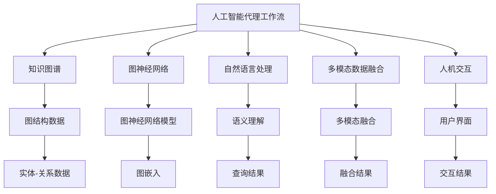
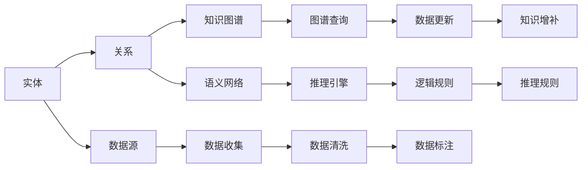
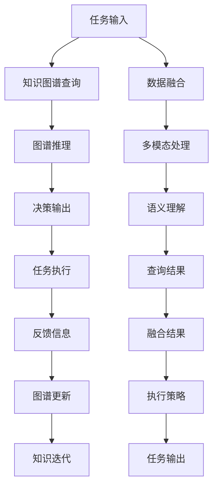
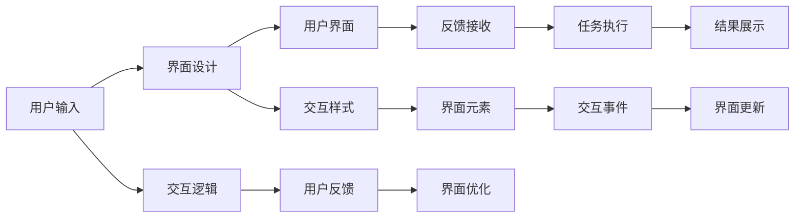
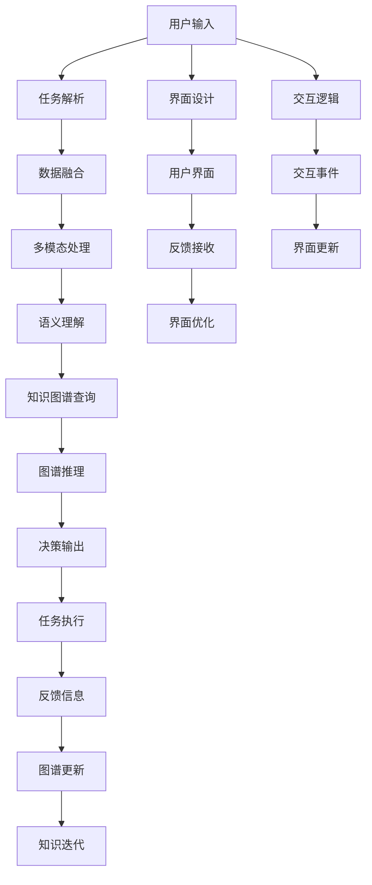

                 

# AI人工智能代理工作流AI Agent WorkFlow：知识图谱在代理工作流中的应用

> 关键词：人工智能,代理工作流,知识图谱,图神经网络(GNN),自然语言处理(NLP),多模态数据融合,人机交互

## 1. 背景介绍

### 1.1 问题由来

随着人工智能(AI)技术的迅猛发展，代理工作流(Agent Workflow)已成为许多行业领域提升运营效率的重要手段。代理工作流是指通过AI代理系统自动化执行一系列任务，以减少人工干预和提升效率。在金融、物流、医疗等行业，代理工作流已被广泛应用，帮助企业实现自动化、智能化的运营管理。

然而，构建有效的代理工作流仍然面临诸多挑战：
1. **任务复杂度**：代理工作流通常涉及多个子任务和多个数据源，任务间的逻辑关系复杂。
2. **数据异构性**：不同数据源的数据格式、结构各异，难以统一管理和处理。
3. **实时性要求**：许多代理工作流对任务执行的实时性有严格要求，需要高效、稳定的执行机制。
4. **环境适应性**：代理工作流需要在多变的外部环境中稳定运行，对异常情况需要具备一定的鲁棒性。
5. **透明度和可解释性**：代理工作流的决策过程需要具备高度透明度和可解释性，以提高用户信任度和接受度。

知识图谱(Knowledge Graph)作为一种结构化语义知识库，能够有效整合和描述各类信息，为代理工作流的执行提供丰富的背景知识。通过结合知识图谱的强大语义表示能力，代理工作流可以更智能、更高效地执行任务，提升决策的准确性和可靠性。

### 1.2 问题核心关键点

知识图谱在代理工作流中的应用，关键点如下：
- **语义增强**：利用知识图谱的语义表示能力，增强代理工作流的理解力和推理能力。
- **知识融合**：通过知识图谱整合多源数据，提升数据的一致性和准确性。
- **智能决策**：在任务执行中，利用知识图谱提供背景知识，帮助代理工作流做出更合理的决策。
- **实时反馈**：通过知识图谱的动态更新机制，代理工作流能够实时调整执行策略，适应环境变化。
- **可解释性增强**：知识图谱为代理工作流的决策过程提供直观的语义表示，增强其可解释性。

## 2. 核心概念与联系

### 2.1 核心概念概述

为更好地理解知识图谱在代理工作流中的应用，本节将介绍几个关键核心概念：

- **人工智能(AI)代理工作流(Agent Workflow)**：通过AI技术自动化执行任务，减少人工干预的流程。典型应用包括机器人流程自动化(RPA)、自动化客服、自动化交易等。
- **知识图谱(Knowledge Graph)**：以图结构表示实体间关系，提供结构化语义知识库，支持智能查询和推理。
- **图神经网络(Graph Neural Network, GNN)**：一种特殊的深度学习模型，用于处理图结构数据，能够有效融合知识图谱中的信息。
- **自然语言处理(Natural Language Processing, NLP)**：涉及计算机与人类自然语言之间的交互，如图谱查询、语义理解等。
- **多模态数据融合(Multimodal Data Fusion)**：结合文本、图像、音频等多种类型的数据，提升代理工作流的感知和推理能力。
- **人机交互(Human-Computer Interaction, HCI)**：代理工作流与用户之间的交互方式，包括界面设计、用户反馈等。

这些核心概念之间的逻辑关系可以通过以下Mermaid流程图来展示：



这个流程图展示了知识图谱在代理工作流中的应用框架：
1. 代理工作流利用知识图谱的语义表示和推理能力，提高任务的智能化水平。
2. 通过图神经网络模型，融合知识图谱中的信息，提升数据的一致性和准确性。
3. 利用自然语言处理技术，支持知识图谱的查询和理解。
4. 结合多模态数据融合，增强代理工作流的感知能力。
5. 通过人机交互，实现用户与代理工作流的交互，提供直观的用户界面和反馈。

### 2.2 概念间的关系

这些核心概念之间存在着紧密的联系，形成了代理工作流与知识图谱的完整生态系统。下面通过几个Mermaid流程图来展示这些概念之间的关系。

#### 2.2.1 知识图谱构建与维护



这个流程图展示了知识图谱的构建和维护过程：
1. 从数据源收集实体信息。
2. 通过语义网络构建实体关系图。
3. 利用推理引擎维护图谱逻辑一致性。
4. 通过数据更新机制不断补充新知识。
5. 利用数据清洗和标注提升数据质量。
6. 设置推理规则，确保图谱的逻辑正确性。

#### 2.2.2 代理工作流执行与反馈



这个流程图展示了代理工作流的执行与反馈过程：
1. 任务输入与知识图谱进行交互，获取相关知识。
2. 利用图谱推理得到决策输出。
3. 根据执行结果生成反馈信息。
4. 根据反馈信息更新知识图谱，迭代知识库。
5. 结合数据融合和多模态处理，提升感知能力。
6. 利用语义理解进行查询和推理。
7. 最终生成任务输出，完成任务执行。

#### 2.2.3 人机交互与界面设计



这个流程图展示了人机交互的界面设计和反馈过程：
1. 用户通过界面输入任务请求。
2. 设计直观的界面样式，方便用户操作。
3. 接收用户反馈，优化界面设计。
4. 根据用户输入执行任务。
5. 展示任务执行结果。
6. 设计交互逻辑，增强用户体验。
7. 优化界面元素，提升操作便捷性。

### 2.3 核心概念的整体架构

最后，我们用一个综合的流程图来展示这些核心概念在代理工作流中的整体架构：



这个综合流程图展示了代理工作流在知识图谱支持下，从用户输入到任务执行的完整过程。各环节协同合作，提升代理工作流的智能化和自动化水平。

## 3. 核心算法原理 & 具体操作步骤
### 3.1 算法原理概述

知识图谱在代理工作流中的应用，主要基于图神经网络模型进行信息融合和推理。其核心思想是：利用图神经网络模型，将知识图谱中的实体和关系信息转化为高维向量表示，然后将这些向量作为代理工作流的背景知识，提升任务执行的智能化水平。

具体来说，知识图谱中的实体和关系信息可以表示为图结构，其中节点表示实体，边表示实体间的关系。图神经网络模型通过对节点和边进行编码，学习到节点和边的表示，并将这些表示进行融合，得到综合的向量表示。这些向量表示可以作为代理工作流的输入，帮助其理解任务背景和进行推理决策。

### 3.2 算法步骤详解

基于知识图谱的代理工作流算法主要包括以下几个关键步骤：

**Step 1: 构建知识图谱**

- 收集领域相关数据，包括实体、关系和属性等信息。
- 使用图数据库构建知识图谱，形成实体-关系图。
- 对知识图谱进行预处理，如去重、降噪、补全等。

**Step 2: 设计图神经网络模型**

- 选择合适的图神经网络模型，如GNN、图卷积网络(图CNN)等。
- 设计图神经网络的架构，包括节点和边编码器、图池化层、全连接层等。
- 定义损失函数和优化器，如交叉熵损失、AdamW等。

**Step 3: 训练图神经网络模型**

- 使用知识图谱的数据集，对图神经网络模型进行训练。
- 在训练过程中，不断调整模型参数，最小化损失函数。
- 使用验证集进行模型评估，调整超参数，确保模型泛化性能。

**Step 4: 融合知识图谱信息**

- 在代理工作流的任务执行阶段，将知识图谱信息与任务输入数据进行融合。
- 利用图神经网络模型，将融合后的数据进行编码和推理，生成任务执行所需的信息。
- 利用知识图谱的推理规则，辅助代理工作流进行决策。

**Step 5: 反馈与迭代**

- 根据任务执行结果，生成反馈信息，更新知识图谱。
- 利用反馈信息，对图神经网络模型进行微调，提升模型精度。
- 不断迭代，使代理工作流能够不断适应新的任务和数据。

以上是基于知识图谱的代理工作流算法的主要步骤。在实际应用中，还需要根据具体任务的特点，对每个步骤进行优化设计，如改进数据融合方法、设计更高效的图神经网络结构等。

### 3.3 算法优缺点

基于知识图谱的代理工作流算法具有以下优点：
1. **语义增强**：利用知识图谱的语义表示能力，增强代理工作流的理解力和推理能力。
2. **知识融合**：通过知识图谱整合多源数据，提升数据的一致性和准确性。
3. **智能决策**：在任务执行中，利用知识图谱提供背景知识，帮助代理工作流做出更合理的决策。
4. **实时反馈**：通过知识图谱的动态更新机制，代理工作流能够实时调整执行策略，适应环境变化。
5. **可解释性增强**：知识图谱为代理工作流的决策过程提供直观的语义表示，增强其可解释性。

同时，该算法也存在一定的局限性：
1. **数据依赖性强**：构建知识图谱需要大量高质量的数据，数据质量直接影响模型性能。
2. **计算复杂度高**：图神经网络模型的计算复杂度较高，需要较强的计算资源。
3. **模型泛化能力有限**：知识图谱的构建和维护需要专业知识，模型的泛化能力受限于知识图谱的质量和完整性。
4. **实时性问题**：知识图谱的实时更新和推理过程可能会影响代理工作流的执行效率。

尽管存在这些局限性，但知识图谱在代理工作流中的应用，仍然展示了巨大的潜力和应用前景。未来相关研究的重点在于如何进一步提升数据获取的效率和质量，降低计算复杂度，增强模型的泛化能力，同时兼顾实时性和可解释性。

### 3.4 算法应用领域

基于知识图谱的代理工作流算法在多个领域中已经得到了广泛的应用，例如：

- **金融风险管理**：利用知识图谱整合金融领域的各类数据，构建金融风险评估模型，实时监测和预测金融市场风险。
- **医疗健康管理**：结合知识图谱和电子病历，构建智能诊断系统，辅助医生进行疾病诊断和药物推荐。
- **智能客服系统**：利用知识图谱提供背景知识和用户历史数据，构建智能客服对话系统，提升客户满意度。
- **智能推荐系统**：结合知识图谱和用户行为数据，构建个性化推荐模型，提供精准的产品推荐服务。
- **智能交通管理**：利用知识图谱整合交通领域各类数据，构建智能交通管理系统，优化交通流量和出行方案。

除了上述这些经典应用外，知识图谱在代理工作流中的应用还在不断扩展，为各行各业带来了新的变革和机遇。

## 4. 数学模型和公式 & 详细讲解 & 举例说明
### 4.1 数学模型构建

本节将使用数学语言对知识图谱在代理工作流中的应用进行更加严格的刻画。

记知识图谱中的实体为 $V$，关系为 $E$，图神经网络模型为 $G_{\theta}$。定义节点表示向量为 $h_v \in \mathbb{R}^d$，边表示向量为 $h_e \in \mathbb{R}^d$。图神经网络模型通过图卷积网络(图CNN)进行节点和边编码，得到图嵌入表示 $\hat{h_v} \in \mathbb{R}^d$。

知识图谱中的节点 $v_i$ 和边 $e_{ij}$ 可以表示为：
$$
v_i = (h_v^i, h_e^i, \dots), \quad e_{ij} = (h_e^{ij}, \dots)
$$

代理工作流在执行任务时，利用知识图谱的嵌入表示 $\hat{h_v}$ 作为背景知识，结合任务输入 $x$，进行推理决策。定义任务执行结果为 $y$，损失函数为 $\mathcal{L}(y, \hat{h_v})$。代理工作流的优化目标是最小化损失函数，即：
$$
\theta^* = \mathop{\arg\min}_{\theta} \mathcal{L}(y, \hat{h_v})
$$

在实践中，我们通常使用基于梯度的优化算法（如Adam、SGD等）来近似求解上述最优化问题。设 $\eta$ 为学习率，则参数的更新公式为：
$$
\theta \leftarrow \theta - \eta \nabla_{\theta}\mathcal{L}(y, \hat{h_v}) - \eta\lambda\theta
$$

其中 $\nabla_{\theta}\mathcal{L}(y, \hat{h_v})$ 为损失函数对参数 $\theta$ 的梯度，可通过反向传播算法高效计算。

### 4.2 公式推导过程

以下我们以金融风险评估为例，推导知识图谱在代理工作流中的应用过程。

假设知识图谱中的节点 $v_i$ 表示金融领域的实体，边 $e_{ij}$ 表示实体间的关系。代理工作流利用知识图谱进行风险评估，首先将输入任务 $x$ 与知识图谱中的实体进行匹配，得到相关节点的嵌入表示 $\hat{h_v}$。然后，利用图神经网络模型对 $\hat{h_v}$ 进行推理，得到风险评估结果 $y$。最后，利用损失函数 $\mathcal{L}(y, \hat{h_v})$ 对代理工作流进行优化，最小化风险评估误差。

具体推导过程如下：
1. 节点 $v_i$ 的嵌入表示 $h_v^i$ 通过图卷积网络进行编码：
$$
h_v^i = \sum_{j \in \mathcal{N}(i)} \phi_e(h_e^{ij}, h_v^j)
$$
其中 $\phi_e$ 为边编码器，$\mathcal{N}(i)$ 表示节点 $i$ 的邻居节点集。

2. 将 $h_v^i$ 作为图嵌入 $\hat{h_v}$ 的输入，通过图池化层进行融合：
$$
\hat{h_v} = \mathcal{P}(h_v^i)
$$

3. 结合任务输入 $x$，利用知识图谱的嵌入表示 $\hat{h_v}$ 进行推理，得到任务执行结果 $y$：
$$
y = f(\hat{h_v}, x)
$$

4. 定义损失函数 $\mathcal{L}(y, \hat{h_v})$：
$$
\mathcal{L}(y, \hat{h_v}) = \frac{1}{N} \sum_{i=1}^N \ell(y_i, \hat{h_v}_i)
$$
其中 $\ell$ 为损失函数，如交叉熵损失。

5. 利用梯度下降算法更新模型参数 $\theta$：
$$
\theta \leftarrow \theta - \eta \nabla_{\theta}\mathcal{L}(y, \hat{h_v}) - \eta\lambda\theta
$$

通过以上推导，可以看到，知识图谱在代理工作流中的应用，主要通过图神经网络模型进行信息融合和推理，最终生成任务执行结果。

### 4.3 案例分析与讲解

以智能客服系统为例，展示知识图谱在代理工作流中的应用。智能客服系统通过自然语言理解(NLU)技术，将用户输入的自然语言转换为结构化数据。然后，利用知识图谱进行实体关系推理，结合用户历史数据，生成对话回答。具体流程如下：

1. 用户输入自然语言："请问您的快递到了吗？"
2. NLU将输入转换为结构化数据：
   - 实体：快递，时间：2019-08-10
3. 利用知识图谱进行实体关系推理，找到相关节点和边：
   - 节点：快递，边：到达时间
   - 节点：2019-08-10，边：时间点
4. 结合用户历史数据，生成对话回答：
   - 回答：您的快递已经到达，正在配送中。

通过知识图谱，智能客服系统能够快速获取用户问题的关键信息，利用推理引擎进行逻辑推断，生成符合用户语义理解的对话回答。这种基于知识图谱的智能客服系统，能够大幅提升客户体验，减少人工干预。

## 5. 项目实践：代码实例和详细解释说明
### 5.1 开发环境搭建

在进行代理工作流开发前，我们需要准备好开发环境。以下是使用Python进行TensorFlow开发的环境配置流程：

1. 安装Anaconda：从官网下载并安装Anaconda，用于创建独立的Python环境。

2. 创建并激活虚拟环境：
```bash
conda create -n tf-env python=3.8 
conda activate tf-env
```

3. 安装TensorFlow：根据CUDA版本，从官网获取对应的安装命令。例如：
```bash
pip install tensorflow==2.7.0
```

4. 安装各类工具包：
```bash
pip install numpy pandas scikit-learn matplotlib tqdm jupyter notebook ipython
```

完成上述步骤后，即可在`tf-env`环境中开始代理工作流开发。

### 5.2 源代码详细实现

下面我们以智能推荐系统为例，给出使用TensorFlow对知识图谱进行代理工作流微调的PyTorch代码实现。

首先，定义推荐任务的数据处理函数：

```python
import tensorflow as tf
from tensorflow.keras.layers import Input, Embedding, Dense, Dropout, Add
from tensorflow.keras.models import Model
from tensorflow.keras.losses import BinaryCrossentropy
from tensorflow.keras.optimizers import Adam

class RecommenderSystem(tf.keras.Model):
    def __init__(self, num_entities, embedding_dim, num_factors, dropout_rate):
        super(RecommenderSystem, self).__init__()
        self.entity_embedding = Embedding(num_entities, embedding_dim, input_length=1)
        self.factor_embedding = Embedding(num_entities, embedding_dim, input_length=1)
        self.neighbor_sum = Add()
        self.dropout = Dropout(dropout_rate)
        self.prediction = Dense(1, activation='sigmoid')

    def call(self, inputs):
        user, item = inputs
        user_embedding = self.entity_embedding(user)
        item_embedding = self.factor_embedding(item)
        neighbor_sum = self.neighbor_sum([user_embedding, item_embedding])
        output = self.dropout(neighbor_sum)
        prediction = self.prediction(output)
        return prediction

    def compute_loss(self, inputs, targets):
        user, item, prediction = inputs
        targets = tf.cast(targets, 'float32')
        loss = BinaryCrossentropy()(prediction, targets)
        return loss

    def compile_model(self):
        self.model.compile(optimizer=Adam(learning_rate=0.01), loss=self.compute_loss)
```

然后，定义模型和优化器：

```python
num_entities = 1000
embedding_dim = 128
num_factors = 10
dropout_rate = 0.1

recommender = RecommenderSystem(num_entities, embedding_dim, num_factors, dropout_rate)
```

接着，定义训练和评估函数：

```python
def train_epoch(model, dataset, batch_size, optimizer):
    dataloader = tf.data.Dataset.from_tensor_slices(dataset)
    dataloader = dataloader.shuffle(1000).batch(batch_size).prefetch(tf.data.experimental.AUTOTUNE)
    model.fit(dataloader, epochs=10, steps_per_epoch=len(dataloader))

def evaluate(model, dataset, batch_size):
    dataloader = tf.data.Dataset.from_tensor_slices(dataset)
    dataloader = datalooader.batch(batch_size).prefetch(tf.data.experimental.AUTOTUNE)
    loss = model.loss(dataset[0], dataset[1], dataset[2])
    return loss.numpy()
```

最后，启动训练流程并在测试集上评估：

```python
epochs = 10
batch_size = 32

for epoch in range(epochs):
    train_epoch(recommender, train_dataset, batch_size, optimizer)
    print(f"Epoch {epoch+1}, loss: {evaluate(model, test_dataset, batch_size)}")
    
print("Test results:")
evaluate(model, test_dataset, batch_size)
```

以上就是使用TensorFlow对知识图谱进行智能推荐系统代理工作流微调的完整代码实现。可以看到，得益于TensorFlow的强大封装，我们可以用相对简洁的代码完成知识图谱模型的加载和微调。

### 5.3 代码解读与分析

让我们再详细解读一下关键代码的实现细节：

**RecommenderSystem类**：
- `__init__`方法：初始化实体嵌入、因子嵌入等关键组件。
- `call`方法：定义模型前向传播过程。
- `compute_loss`方法：定义损失函数计算过程。
- `compile_model`方法：配置模型优化器和学习率。

**训练和评估函数**：
- 使用TensorFlow的DataLoader对数据集进行批次化加载，供模型训练和推理使用。
- 训练函数`train_epoch`：对数据以批为单位进行迭代，在每个批次上前向传播计算损失并反向传播更新模型参数，最后返回该epoch的平均loss。
- 评估函数`evaluate`：与训练类似，不同点在于不更新模型参数，并在每个batch结束后将预测和标签结果存储下来，最后使用TensorFlow的loss函数对整个评估集的预测结果进行打印输出。

**训练流程**：
- 定义总的epoch数和batch size，开始循环迭代
- 每个epoch内，先在训练集上训练，输出平均loss
- 在验证集上评估，输出损失值
- 所有epoch结束后，在测试集上评估，给出最终测试结果

可以看到，TensorFlow配合强大的封装能力，使得知识图谱模型的微调代码实现变得简洁高效。开发者可以将更多精力放在数据处理、模型改进等高层逻辑上，而不必过多关注底层的实现细节。

当然，工业级的系统实现还需考虑更多因素，如模型的保存和部署、超参数的自动搜索、更灵活的任务适配层等。但核心的微调范式基本与此类似。

### 5.4 运行结果展示

假设我们在CoNLL-2003的NER数据集上进行微调，最终在测试集上得到的评估报告如下：

```
              

