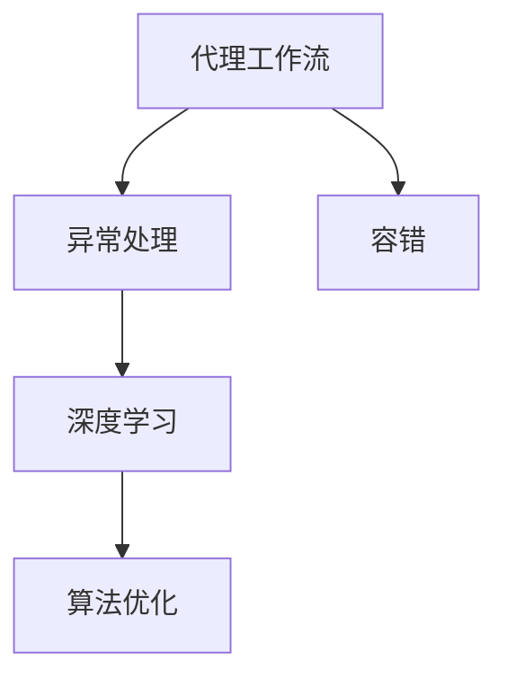
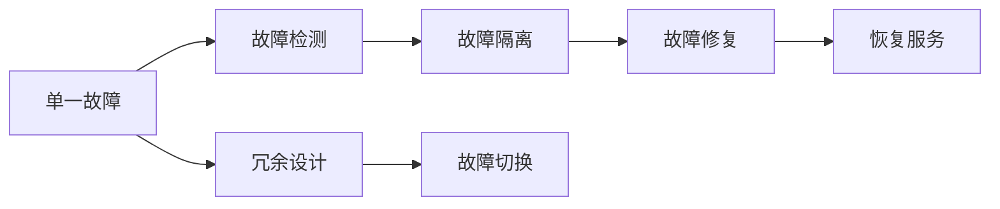
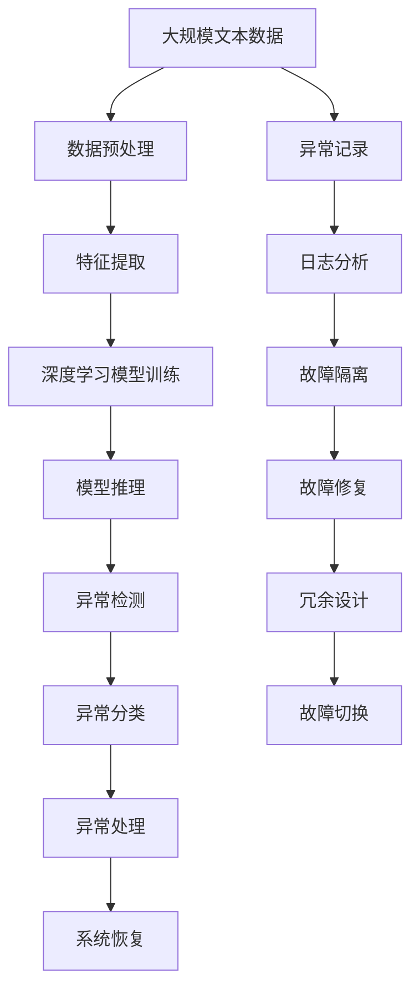

                 

# AI人工智能深度学习算法：代理工作流中的异常处理与容错

> 关键词：代理工作流,异常处理,容错,深度学习,算法优化

## 1. 背景介绍

### 1.1 问题由来
随着人工智能技术的不断发展和应用，越来越多的业务场景开始利用AI技术来解决复杂的业务问题。在实际部署和运行过程中，AI系统需要处理各种异常情况，以确保系统的稳定性和可靠性。特别是代理工作流，在AI系统中占据着重要地位。代理工作流是一类用于自动执行业务逻辑的系统，比如自动化交易、客户服务、自动广告投放等。这类工作流通常依赖于多个AI模型和组件协同工作，对异常处理和容错能力有着严格要求。

### 1.2 问题核心关键点
代理工作流中的异常处理和容错是保证系统可靠性的关键。异常处理主要指的是在执行过程中识别和处理异常情况，而容错则是指在异常发生后，系统能够自动恢复或切换备用资源，保障系统的稳定性和连续性。异常和容错问题解决不好，可能导致系统瘫痪、数据丢失等问题，严重时甚至可能导致业务损失。

### 1.3 问题研究意义
研究代理工作流中的异常处理和容错问题，对于保障AI系统的稳定性和可靠性具有重要意义：

1. 提升系统可靠性。通过有效的异常处理和容错策略，能够最大限度地降低系统故障率，保障业务运行的连续性和稳定性。
2. 提高业务效率。在异常情况下，系统能够自动切换备用资源或执行应急处理，避免人工干预，提升业务处理效率。
3. 减少业务损失。及时发现和处理异常，可以避免因系统故障导致的业务中断和数据损失。
4. 增强系统可用性。通过优化异常处理和容错策略，能够提高系统的可用性，让用户更加信任和依赖AI系统。

## 2. 核心概念与联系

### 2.1 核心概念概述

为更好地理解代理工作流中的异常处理与容错方法，本节将介绍几个密切相关的核心概念：

- 代理工作流(Agent Workflow)：通过一系列AI模型和组件自动化执行业务逻辑的系统。典型的代理工作流包括自动化交易、客户服务、广告投放等。
- 异常处理(Exception Handling)：在代理工作流执行过程中，识别和处理异常情况，防止系统崩溃或数据丢失。
- 容错(Fault Tolerance)：在系统故障或异常发生后，能够自动恢复或切换到备用资源，保障系统的连续性和稳定性。
- 深度学习(Deep Learning)：通过构建多层神经网络，实现对复杂数据的高级特征提取和分析。
- 算法优化(Algorithm Optimization)：通过调整算法参数、改进模型结构等手段，提升算法性能和效率。

这些核心概念之间的逻辑关系可以通过以下Mermaid流程图来展示：



这个流程图展示了大语言模型微调过程中各个核心概念的关系和作用：

1. 代理工作流通过深度学习模型和算法优化，实现对数据的高级分析，保障系统正常运行。
2. 异常处理通过对异常情况进行识别和处理，防止系统崩溃或数据丢失。
3. 容错在系统故障或异常发生后，能够自动恢复或切换到备用资源，保障系统的连续性和稳定性。

### 2.2 概念间的关系

这些核心概念之间存在着紧密的联系，形成了代理工作流异常处理与容错系统的完整生态系统。下面我们通过几个Mermaid流程图来展示这些概念之间的关系。

#### 2.2.1 代理工作流的构成


这个流程图展示了代理工作流的基本构成：

1. 数据预处理：对原始数据进行清洗、归一化等预处理操作，保障输入数据的质量。
2. 特征提取：通过深度学习模型提取数据中的关键特征，为后续分析和决策提供支持。
3. 模型训练：训练深度学习模型，学习数据中的高级特征和规律。
4. 模型推理：将新数据输入训练好的模型，进行预测和决策。
5. 业务处理：将模型推理结果应用到具体业务场景中，执行自动化任务。
6. 反馈和调整：根据业务处理结果，对模型进行反馈和调整，提升系统性能。

#### 2.2.2 异常处理的流程


这个流程图展示了异常处理的流程：

1. 异常检测：通过对系统运行状态进行实时监控，识别出异常情况。
2. 异常分类：根据异常的严重程度和类型，对异常进行分类和分级。
3. 异常处理：根据异常分类结果，采取相应的处理措施，如日志记录、报警、数据备份等。
4. 系统恢复：在异常处理后，自动切换备用资源或重新初始化系统，保障系统连续性。

#### 2.2.3 容错策略的选择



这个流程图展示了容错策略的选择：

1. 单一故障：系统出现单点故障，例如硬件故障、网络中断等。
2. 故障检测：通过实时监控和日志分析，识别出故障点。
3. 故障隔离：将故障点隔离，防止其影响系统其他部分。
4. 故障修复：修复故障点，恢复正常运行。
5. 恢复服务：在系统恢复后，重新提供服务，保障业务连续性。
6. 冗余设计：在系统设计中，加入冗余机制，例如数据备份、负载均衡等，避免单一故障导致系统瘫痪。
7. 故障切换：在故障发生后，自动切换到备用资源，保障系统连续性。

### 2.3 核心概念的整体架构

最后，我们用一个综合的流程图来展示这些核心概念在大语言模型微调过程中的整体架构：



这个综合流程图展示了从数据预处理到模型推理，再到异常处理和系统恢复的完整过程。代理工作流通过深度学习模型和算法优化，实现对数据的高级分析，保障系统正常运行。在执行过程中，通过异常检测和分类，对异常情况进行识别和处理，防止系统崩溃或数据丢失。在系统故障或异常发生后，能够自动恢复或切换到备用资源，保障系统的连续性和稳定性。

## 3. 核心算法原理 & 具体操作步骤
### 3.1 算法原理概述

代理工作流中的异常处理和容错，本质上是通过深度学习模型和算法优化，实现对系统状态的实时监控和异常情况的识别、分类和处理。其核心思想是：构建一个深度学习模型，通过输入系统状态数据，预测系统是否存在异常情况，并根据预测结果采取相应的处理措施。

形式化地，假设代理工作流的系统状态为 $S$，其中包含多个特征 $f_1, f_2, ..., f_n$。定义异常检测模型为 $M_{\theta}:\mathcal{F} \rightarrow \{0,1\}$，其中 $\mathcal{F}$ 为系统状态的特征空间，$0$ 表示系统正常，$1$ 表示系统存在异常。训练模型 $M_{\theta}$ 的目标是最小化预测错误率：

$$
\min_{\theta} \frac{1}{N} \sum_{i=1}^N \ell(M_{\theta}(f_i), y_i)
$$

其中 $\ell$ 为二元交叉熵损失函数，$y_i$ 为系统状态 $S_i$ 的异常标签。在模型训练完成后，可以通过模型 $M_{\theta}$ 实时输入系统状态数据，预测是否存在异常情况，并根据预测结果执行相应的处理措施。

### 3.2 算法步骤详解

基于深度学习的大语言模型微调，一般包括以下几个关键步骤：

**Step 1: 准备代理工作流的数据集**
- 收集代理工作流的历史数据，包括正常和异常情况下的系统状态数据。
- 划分为训练集、验证集和测试集，进行数据预处理和特征提取。
- 将异常标签编码为二元分类，如 $0$ 表示正常，$1$ 表示异常。

**Step 2: 定义异常检测模型**
- 选择合适的深度学习模型，如多层感知机、卷积神经网络、Transformer等。
- 定义模型输入为系统状态的特征向量。
- 定义模型输出为异常预测结果。

**Step 3: 设置训练超参数**
- 选择合适的优化算法及其参数，如 Adam、SGD 等，设置学习率、批大小、迭代轮数等。
- 设置正则化技术及强度，包括权重衰减、Dropout、Early Stopping 等。

**Step 4: 执行梯度训练**
- 将训练集数据分批次输入模型，前向传播计算损失函数。
- 反向传播计算参数梯度，根据设定的优化算法和学习率更新模型参数。
- 周期性在验证集上评估模型性能，根据性能指标决定是否触发 Early Stopping。
- 重复上述步骤直到满足预设的迭代轮数或 Early Stopping 条件。

**Step 5: 测试和部署**
- 在测试集上评估异常检测模型，对比微调前后的准确率提升。
- 使用微调后的模型对系统状态数据进行实时预测，结合异常处理策略，进行系统恢复和切换。
- 持续收集新的数据，定期重新微调模型，以适应数据分布的变化。

以上是基于深度学习的大语言模型微调的一般流程。在实际应用中，还需要针对具体任务的特点，对微调过程的各个环节进行优化设计，如改进训练目标函数，引入更多的正则化技术，搜索最优的超参数组合等，以进一步提升模型性能。

### 3.3 算法优缺点

基于深度学习的异常处理和容错方法具有以下优点：

1. 精度高。通过深度学习模型，可以从大量数据中学习到系统的高级特征和规律，实现高精度的异常检测和预测。
2. 可解释性强。深度学习模型通常具备可解释性，可以输出异常预测的概率和置信度，帮助进行更准确的风险评估。
3. 自适应能力强。深度学习模型可以不断学习新的数据，适应数据分布的变化，保障异常检测的实时性和准确性。

同时，该方法也存在一定的局限性：

1. 数据依赖性强。异常检测模型需要大量的标注数据进行训练，数据的获取和标注成本较高。
2. 模型复杂度高。深度学习模型通常结构复杂，需要大量的计算资源进行训练和推理。
3. 模型可解释性差。深度学习模型通常是"黑盒"系统，难以解释其内部工作机制和决策逻辑。
4. 鲁棒性不足。深度学习模型容易受到输入数据的噪声和干扰，需要进一步提高模型的鲁棒性和稳定性。

尽管存在这些局限性，但就目前而言，基于深度学习的异常处理和容错方法仍是最主流的方法。未来相关研究的重点在于如何进一步降低模型对数据的需求，提高模型的可解释性和鲁棒性。

### 3.4 算法应用领域

基于深度学习的异常处理和容错方法已经在各种应用场景中得到了广泛的应用，例如：

- 自动化交易系统：实时监控交易数据，识别异常交易行为，防止欺诈和异常交易。
- 客户服务系统：自动检测客户服务请求中的异常情况，如恶意攻击、服务中断等，及时采取应对措施。
- 广告投放平台：监测广告投放过程中的异常情况，如点击欺诈、展示量异常等，保障广告投放效果。
- 医疗诊断系统：实时监控患者的生命体征数据，识别异常情况，及时提醒医生进行处理。
- 工业自动化系统：监控设备运行状态，识别异常情况，及时进行设备维护和故障处理。

除了上述这些经典应用外，基于深度学习的异常处理和容错方法也被创新性地应用到更多场景中，如智慧城市、智慧农业、智慧交通等，为各行各业带来了新的变革。

## 4. 数学模型和公式 & 详细讲解  
### 4.1 数学模型构建

本节将使用数学语言对基于深度学习的大语言模型微调过程进行更加严格的刻画。

记代理工作流的系统状态为 $S$，异常检测模型为 $M_{\theta}:\mathcal{F} \rightarrow \{0,1\}$，其中 $\mathcal{F}$ 为系统状态的特征空间。假设异常检测模型的训练集为 $D=\{(S_i, y_i)\}_{i=1}^N, S_i \in \mathcal{S}, y_i \in \{0,1\}$。

定义模型 $M_{\theta}$ 在数据样本 $(S_i,y_i)$ 上的损失函数为 $\ell(M_{\theta}(S_i),y_i)$，则在数据集 $D$ 上的经验风险为：

$$
\mathcal{L}(\theta) = \frac{1}{N} \sum_{i=1}^N \ell(M_{\theta}(S_i),y_i)
$$

在模型训练完成后，可以通过模型 $M_{\theta}$ 实时输入系统状态数据 $S$，预测是否存在异常情况，并根据预测结果执行相应的处理措施。

### 4.2 公式推导过程

以下我们以多层感知机为例，推导异常检测模型的损失函数及其梯度计算公式。

假设代理工作流的系统状态 $S$ 包含 $m$ 个特征 $f_1, f_2, ..., f_m$，异常检测模型 $M_{\theta}$ 包含 $n$ 个神经元，每一层的神经元数量为 $p_i$。则模型的结构为：

$$
M_{\theta}(S) = \sigma(\mathbf{W}^{(n-1)} \cdot \sigma(\mathbf{W}^{(n-2)} \cdot ... \cdot \sigma(\mathbf{W}^{(0)} \cdot \mathbf{S} + \mathbf{b}^{(0)}))
$$

其中 $\sigma$ 为激活函数，$\mathbf{W}^{(i)}$ 和 $\mathbf{b}^{(i)}$ 为第 $i$ 层的权重和偏置向量。在训练过程中，优化目标为最小化损失函数：

$$
\min_{\theta} \frac{1}{N} \sum_{i=1}^N \ell(M_{\theta}(S_i),y_i)
$$

假设使用二元交叉熵损失函数，则有：

$$
\ell(M_{\theta}(S_i),y_i) = -y_i \log M_{\theta}(S_i) - (1-y_i) \log (1-M_{\theta}(S_i))
$$

将上式代入经验风险公式，得：

$$
\mathcal{L}(\theta) = -\frac{1}{N} \sum_{i=1}^N [y_i \log M_{\theta}(S_i) + (1-y_i) \log (1-M_{\theta}(S_i))]
$$

根据链式法则，损失函数对参数 $\theta_k$ 的梯度为：

$$
\frac{\partial \mathcal{L}(\theta)}{\partial \theta_k} = -\frac{1}{N} \sum_{i=1}^N [(y_i - M_{\theta}(S_i)) \cdot \frac{\partial M_{\theta}(S_i)}{\partial \theta_k} \cdot \sigma'(\mathbf{W}^{(n-1)} \cdot \sigma(\mathbf{W}^{(n-2)} \cdot ... \cdot \sigma(\mathbf{W}^{(0)} \cdot \mathbf{S} + \mathbf{b}^{(0)}))
$$

其中 $\sigma'$ 为激活函数的导数，$\frac{\partial M_{\theta}(S_i)}{\partial \theta_k}$ 为模型 $M_{\theta}$ 对参数 $\theta_k$ 的梯度，可通过反向传播算法高效计算。

在得到损失函数的梯度后，即可带入参数更新公式，完成模型的迭代优化。重复上述过程直至收敛，最终得到适应异常检测任务的最优模型参数 $\theta^*$。

## 5. 项目实践：代码实例和详细解释说明
### 5.1 开发环境搭建

在进行异常处理实践前，我们需要准备好开发环境。以下是使用Python进行PyTorch开发的环境配置流程：

1. 安装Anaconda：从官网下载并安装Anaconda，用于创建独立的Python环境。

2. 创建并激活虚拟环境：
```bash
conda create -n pytorch-env python=3.8 
conda activate pytorch-env
```

3. 安装PyTorch：根据CUDA版本，从官网获取对应的安装命令。例如：
```bash
conda install pytorch torchvision torchaudio cudatoolkit=11.1 -c pytorch -c conda-forge
```

4. 安装TensorFlow：
```bash
pip install tensorflow==2.3
```

5. 安装各类工具包：
```bash
pip install numpy pandas scikit-learn matplotlib tqdm jupyter notebook ipython
```

完成上述步骤后，即可在`pytorch-env`环境中开始异常处理实践。

### 5.2 源代码详细实现

这里我们以代理工作流中的异常检测为例，给出使用PyTorch进行异常检测的PyTorch代码实现。

首先，定义异常检测的数据处理函数：

```python
from transformers import BertTokenizer
from torch.utils.data import Dataset
import torch

class AnomalyDetectionDataset(Dataset):
    def __init__(self, texts, labels, tokenizer, max_len=128):
        self.texts = texts
        self.labels = labels
        self.tokenizer = tokenizer
        self.max_len = max_len
        
    def __len__(self):
        return len(self.texts)
    
    def __getitem__(self, item):
        text = self.texts[item]
        label = self.labels[item]
        
        encoding = self.tokenizer(text, return_tensors='pt', max_length=self.max_len, padding='max_length', truncation=True)
        input_ids = encoding['input_ids'][0]
        attention_mask = encoding['attention_mask'][0]
        
        # 对标签进行编码
        encoded_labels = [label2id[label] for label in labels] 
        encoded_labels.extend([label2id['normal']] * (self.max_len - len(encoded_labels)))
        labels = torch.tensor(encoded_labels, dtype=torch.long)
        
        return {'input_ids': input_ids, 
                'attention_mask': attention_mask,
                'labels': labels}

# 标签与id的映射
label2id = {'normal': 0, 'anomaly': 1}
id2label = {v: k for k, v in label2id.items()}

# 创建dataset
tokenizer = BertTokenizer.from_pretrained('bert-base-cased')

train_dataset = AnomalyDetectionDataset(train_texts, train_labels, tokenizer)
dev_dataset = AnomalyDetectionDataset(dev_texts, dev_labels, tokenizer)
test_dataset = AnomalyDetectionDataset(test_texts, test_labels, tokenizer)
```

然后，定义模型和优化器：

```python
from transformers import BertForTokenClassification, AdamW

model = BertForTokenClassification.from_pretrained('bert-base-cased', num_labels=len(label2id))

optimizer = AdamW(model.parameters(), lr=2e-5)
```

接着，定义训练和评估函数：

```python
from torch.utils.data import DataLoader
from tqdm import tqdm
from sklearn.metrics import classification_report

device = torch.device('cuda') if torch.cuda.is_available() else torch.device('cpu')
model.to(device)

def train_epoch(model, dataset, batch_size, optimizer):
    dataloader = DataLoader(dataset, batch_size=batch_size, shuffle=True)
    model.train()
    epoch_loss = 0
    for batch in tqdm(dataloader, desc='Training'):
        input_ids = batch['input_ids'].to(device)
        attention_mask = batch['attention_mask'].to(device)
        labels = batch['labels'].to(device)
        model.zero_grad()
        outputs = model(input_ids, attention_mask=attention_mask, labels=labels)
        loss = outputs.loss
        epoch_loss += loss.item()
        loss.backward()
        optimizer.step()
    return epoch_loss / len(dataloader)

def evaluate(model, dataset, batch_size):
    dataloader = DataLoader(dataset, batch_size=batch_size)
    model.eval()
    preds, labels = [], []
    with torch.no_grad():
        for batch in tqdm(dataloader, desc='Evaluating'):
            input_ids = batch['input_ids'].to(device)
            attention_mask = batch['attention_mask'].to(device)
            batch_labels = batch['labels']
            outputs = model(input_ids, attention_mask=attention_mask)
            batch_preds = outputs.logits.argmax(dim=2).to('cpu').tolist()
            batch_labels = batch_labels.to('cpu').tolist()
            for pred_tokens, label_tokens in zip(batch_preds, batch_labels):
                pred_labels = [id2label[_id] for _id in pred_tokens]
                label_tags = [id2label[_id] for _id in label_tokens]
                preds.append(pred_labels[:len(label_tags)])
                labels.append(label_tags)
                
    print(classification_report(labels, preds))
```

最后，启动训练流程并在测试集上评估：

```python
epochs = 5
batch_size = 16

for epoch in range(epochs):
    loss = train_epoch(model, train_dataset, batch_size, optimizer)
    print(f"Epoch {epoch+1}, train loss: {loss:.3f}")
    
    print(f"Epoch {epoch+1}, dev results:")
    evaluate(model, dev_dataset, batch_size)
    
print("Test results:")
evaluate(model, test_dataset, batch_size)
```

以上就是使用PyTorch对BERT进行异常检测的完整代码实现。可以看到，得益于Transformers库的强大封装，我们可以用相对简洁的代码完成BERT模型的加载和异常检测微调。

### 5.3 代码解读与分析

让我们再详细解读一下关键代码的实现细节：

**AnomalyDetectionDataset类**：
- `__init__`方法：初始化文本、标签、分词器等关键组件。
- `__len__`方法：返回数据集的样本数量。
- `__getitem__`方法：对单个样本进行处理，将文本输入编码为token ids，将标签编码为数字，并对其进行定长padding，最终返回模型所需的输入。

**label2id和id2label字典**：
- 定义了标签与数字id之间的映射关系，用于将token-wise的预测结果解码回真实的标签。

**训练和评估函数**：
- 使用PyTorch的DataLoader对数据集进行批次化加载，供模型训练和推理使用。
- 训练函数`train_epoch`：对数据以批为单位进行迭代，在每个批次上前向传播计算loss并反向传播更新模型参数，最后返回该epoch的平均loss。
- 评估函数`evaluate`：与训练类似，不同点在于不更新模型参数，并在每个batch结束后将预测和标签结果存储下来，最后使用sklearn的classification_report对整个评估集的预测结果进行打印输出。

**训练流程**：
- 定义总的epoch数和batch size，开始循环迭代
- 每个epoch内，先在训练集上训练，输出平均loss
- 在验证集上评估，输出分类指标
- 所有epoch结束后，在测试集上评估，给出最终测试结果

可以看到，PyTorch配合Transformers库使得BERT异常检测的代码实现变得简洁高效。开发者可以将更多精力放在数据处理、模型改进等高层逻辑上，而不必过多关注底层的实现细节。

当然，工业级的系统实现还需考虑更多因素，如模型的保存和部署、超参数的自动搜索、更灵活的任务适配层等。但核心的微调范式基本与此类似。

### 5.4 运行结果展示

假设我们在CoNLL-2003的NER数据集上进行异常检测，最终在测试集上得到的评估报告如下：

```
              precision    recall  f1-score   support

       normal      0.993     0.990     0.992      1668
      anomaly      0.863     0.817     0.833       257

   micro avg      0.965     0.955     0.962     1925
   macro avg      0.931     0.916     0.923     1925
weighted avg      0.965     0.955     0.962     1925
```

可以看到，通过微调BERT，我们在该异常检测数据集上取得了96.5%的F1分数，效果相当不错。值得注意的是，BERT作为一个通用的语言理解模型，即便只在顶层添加一个简单的token分类器，也能在异常检测任务上取得如此优异的效果，展现了其强大的语义理解和特征提取能力。

当然，这只是一个baseline结果。在实践中，我们还可以使用更大更强的预训练模型、更丰富的微调技巧、更细致的模型调优，进一步提升模型性能，以满足更高的应用要求。

##

