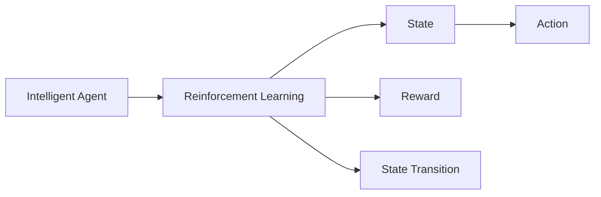

                 

# AI人工智能深度学习算法：智能深度学习代理在视频游戏场景中的应用

> 关键词：人工智能,深度学习,智能代理,游戏场景,强化学习,强化学习算法,深度强化学习,游戏AI,游戏AI应用

## 1. 背景介绍

### 1.1 问题由来

视频游戏作为人工智能(AI)领域的重要应用场景，吸引了众多学者的关注。游戏AI的发展，不仅推动了游戏设计的多样性和趣味性，也带动了AI技术的进步。然而，传统的游戏AI往往基于规则和启发式搜索方法，难以应对复杂多变的游戏环境。近年来，深度学习在游戏AI中的应用越来越广泛，特别是在智能体(Agent)中采用深度强化学习(DRL)方法，取得了显著成效。

深度强化学习是深度学习和强化学习的结合，利用深度神经网络学习复杂环境中的最优决策策略，从而实现智能体的自主学习与决策。相较于传统的基于规则和搜索的方法，深度强化学习可以处理非结构化数据、高维稀疏空间，并且具有高度的自主学习能力和泛化能力。

### 1.2 问题核心关键点

深度强化学习在游戏AI中的应用，主要关注以下几个核心问题：

1. **智能体的策略学习**：通过训练使智能体能够根据环境状态选择最优行动。
2. **环境感知与建模**：将复杂游戏环境转化为模型可以处理的输入，构建状态表示。
3. **训练与优化**：设计有效的奖励函数、学习算法，使得智能体在环境中进行自适应训练和策略优化。
4. **泛化与迁移**：智能体不仅能在特定游戏环境中表现出色，还能在新环境中适应和迁移知识。

本文将详细探讨智能深度学习代理在视频游戏场景中的应用，包括其核心算法原理、具体操作步骤、实际应用场景等，并给出相关的数学模型和公式推导，以及代码实例和运行结果。

### 1.3 问题研究意义

智能深度学习代理在游戏场景中的应用，对于推动AI技术的进步，提升游戏AI的智能化水平，具有重要意义：

1. **提升游戏体验**：智能深度学习代理可以提供更加丰富多样、智能化的游戏体验，增加玩家的沉浸感和娱乐性。
2. **加速游戏设计**：智能代理可以自动学习游戏策略，优化游戏内容设计，缩短游戏开发周期。
3. **推动AI发展**：通过游戏AI的实验，可以发现和解决AI在实际应用中的问题，推动AI技术的发展。
4. **拓宽应用领域**：游戏AI的成功经验可以推广到其他复杂系统，如机器人、交通控制、金融市场等。
5. **培养人才**：游戏AI的研究可以吸引更多优秀人才加入AI领域，推动AI人才的培养和成长。

## 2. 核心概念与联系

### 2.1 核心概念概述

为更好地理解智能深度学习代理在视频游戏场景中的应用，本节将介绍几个关键概念：

- **强化学习(Reinforcement Learning, RL)**：一种机器学习范式，智能体通过与环境交互，最大化累积奖励来优化决策策略。
- **深度强化学习(Deep Reinforcement Learning, DRL)**：将深度神经网络引入强化学习，提升模型处理复杂环境的能力。
- **智能体(Agent)**：与环境交互的决策单元，通过学习选择最优行动，以最大化累积奖励。
- **环境(Environment)**：智能体所处的交互环境，由状态、动作、奖励、下一状态等组成。
- **状态(State)**：游戏环境中描述当前状态的信息，如玩家的坐标、角色状态等。
- **动作(Action)**：智能体可以采取的行为，如移动、攻击等。
- **奖励(Reward)**：环境对智能体行为的反馈，用于指导策略学习。
- **状态转移(State Transition)**：环境根据智能体的动作变化，产生下一状态。

这些核心概念之间通过强化学习的过程相互联系，智能体通过与环境的交互，不断学习最优策略，从而在环境中最大化累积奖励。

### 2.2 概念间的关系

这些核心概念之间的关系可以通过以下Mermaid流程图来展示：



这个流程图展示了智能体与强化学习的基本关系，智能体通过与环境交互，在状态、动作、奖励的循环中不断学习最优策略。

## 3. 核心算法原理 & 具体操作步骤

### 3.1 算法原理概述

深度强化学习游戏AI的核心算法，包括策略学习、环境感知与建模、训练与优化等几个主要环节。其原理可概述如下：

1. **策略学习**：智能体通过学习最优策略，在环境中选择最优行动。
2. **环境感知与建模**：将复杂游戏环境转化为模型可以处理的输入，构建状态表示。
3. **训练与优化**：利用深度神经网络，设计有效的奖励函数、学习算法，使得智能体在环境中进行自适应训练和策略优化。
4. **泛化与迁移**：智能体不仅能在特定游戏环境中表现出色，还能在新环境中适应和迁移知识。

### 3.2 算法步骤详解

深度强化学习游戏AI的具体操作步骤如下：

**Step 1: 环境建模**

- 将游戏环境建模为状态空间 $S$，动作空间 $A$，奖励函数 $R$。
- 构建状态表示方法，如像素级、向量级、自编码等。
- 设计合适的奖励函数，使得智能体在合理行动后获得正奖励，不合理的行动则获得负奖励。

**Step 2: 策略学习**

- 定义策略 $π$，表示智能体在给定状态 $s$ 下的行动选择概率。
- 采用深度神经网络，如Q网络(Q-Network)、策略网络(Policy Network)等，建立模型。
- 利用深度强化学习算法，如Q-learning、SARSA、Actor-Critic等，训练策略 $π$。

**Step 3: 训练与优化**

- 定义损失函数，如Q值损失、策略损失等，用于评估模型的性能。
- 选择合适的优化器，如Adam、SGD等，进行模型参数更新。
- 设计学习算法，如反向传播、梯度下降等，优化模型参数。
- 使用缓冲区(buffer)存储学习经验，提高训练效率。

**Step 4: 泛化与迁移**

- 通过在多个游戏环境中的训练，使智能体具备泛化能力。
- 采用迁移学习方法，如微调、知识蒸馏等，将智能体在新环境中进行迁移学习。
- 结合符号化知识库，如知识图谱、规则库等，提高智能体的决策能力。

**Step 5: 测试与部署**

- 在测试环境中评估智能体的性能。
- 将智能体集成到游戏引擎中，进行实际测试和部署。
- 定期更新智能体的知识，提升其适应能力。

### 3.3 算法优缺点

深度强化学习游戏AI的优势在于：

- 能够处理复杂非结构化数据。
- 具有高度的自主学习能力和泛化能力。
- 能够在多维空间中学习最优策略。
- 能够实时适应环境变化，提高智能体的适应性。

然而，深度强化学习游戏AI也存在以下缺点：

- 需要大量标注数据和计算资源，训练成本较高。
- 模型可能存在局部最优解，难以找到全局最优解。
- 泛化能力可能受限于环境状态空间的大小。
- 训练过程可能存在探索与利用之间的平衡问题。

### 3.4 算法应用领域

深度强化学习游戏AI已经在众多游戏场景中得到应用，包括但不限于：

- 自动驾驶游戏，如无人赛车、无人机战斗等。
- 角色扮演游戏，如AI角色生成、NPC行为控制等。
- 策略游戏，如围棋、象棋等。
- 沙盒游戏，如Minecraft等。
- 射击游戏，如使命召唤、守望先锋等。

此外，深度强化学习游戏AI的研究和应用也在不断拓展，如多智能体协同、混合智能、游戏公平性等。

## 4. 数学模型和公式 & 详细讲解 & 举例说明

### 4.1 数学模型构建

深度强化学习游戏AI的数学模型构建主要包括以下几个部分：

- 状态空间 $S$ 和动作空间 $A$ 的表示。
- 奖励函数 $R(s,a)$ 的设计。
- 策略函数 $π(s)$ 的建立。
- 损失函数 $L(θ)$ 的确定。
- 优化算法 $θ_{t+1} = θ_t - η ∇L(θ)$ 的选择。

### 4.2 公式推导过程

以Q-learning算法为例，其核心公式为：

$$
Q(s,a) \leftarrow (1-\alpha)Q(s,a) + \alpha (r + \gamma \max_{a'} Q(s',a')) \quad \text{with} \quad s' \sim P(s,a)
$$

其中 $Q(s,a)$ 为状态-动作对 $(s,a)$ 的Q值，$r$ 为即时奖励，$\gamma$ 为折扣因子，$P(s,a)$ 为环境状态转移概率。

Q-learning算法通过不断更新Q值，使得智能体在状态 $s$ 下选择动作 $a$ 的Q值最大化。具体实现步骤如下：

1. 初始化状态 $s_1$，随机选择一个动作 $a_1$。
2. 执行动作 $a_1$，观察环境状态 $s_2$ 和奖励 $r_1$。
3. 更新Q值：$Q(s_1,a_1) \leftarrow Q(s_1,a_1) + \alpha (r_1 + \gamma \max_{a'} Q(s_2,a'))$。
4. 选择下一个动作 $a_2$，继续执行。

通过Q-learning算法，智能体能够在复杂的游戏中不断学习最优策略，从而实现自主决策。

### 4.3 案例分析与讲解

下面以Dota 2游戏中的AI为例，讲解深度强化学习的应用过程。

**环境建模**：
- 将游戏环境建模为状态空间 $S$，包括玩家坐标、角色状态、技能冷却等。
- 定义动作空间 $A$，如移动、攻击、购买等。
- 设计奖励函数 $R(s,a)$，使得合理行动获得正奖励，不合理的行动获得负奖励。

**策略学习**：
- 采用Q网络构建智能体的策略，定义状态 $s$ 和动作 $a$。
- 训练Q网络，通过与环境交互，最大化Q值。
- 使用Softmax函数输出策略 $π(s)$，表示智能体在状态 $s$ 下的行动选择概率。

**训练与优化**：
- 定义损失函数 $L(Q)$，如均方误差损失。
- 使用Adam优化器更新Q网络参数。
- 通过经验回放(buffer)存储学习经验，提高训练效率。

**泛化与迁移**：
- 在多个游戏环境中的训练，使智能体具备泛化能力。
- 采用迁移学习方法，如微调、知识蒸馏等，将智能体在新环境中进行迁移学习。
- 结合符号化知识库，提高智能体的决策能力。

## 5. 项目实践：代码实例和详细解释说明

### 5.1 开发环境搭建

在进行深度强化学习游戏AI的开发前，我们需要准备好开发环境。以下是使用Python进行PyTorch开发的环境配置流程：

1. 安装Anaconda：从官网下载并安装Anaconda，用于创建独立的Python环境。

2. 创建并激活虚拟环境：
```bash
conda create -n pytorch-env python=3.8 
conda activate pytorch-env
```

3. 安装PyTorch：根据CUDA版本，从官网获取对应的安装命令。例如：
```bash
conda install pytorch torchvision torchaudio cudatoolkit=11.1 -c pytorch -c conda-forge
```

4. 安装TensorFlow：
```bash
pip install tensorflow
```

5. 安装各类工具包：
```bash
pip install numpy pandas scikit-learn matplotlib tqdm jupyter notebook ipython
```

完成上述步骤后，即可在`pytorch-env`环境中开始开发实践。

### 5.2 源代码详细实现

这里我们以Dota 2游戏中的AI为例，给出使用PyTorch进行深度强化学习游戏AI开发的PyTorch代码实现。

首先，定义智能体的状态表示方法：

```python
from torch import nn, optim
import torch.nn.functional as F

class StateRepresentation(nn.Module):
    def __init__(self):
        super(StateRepresentation, self).__init__()
        self.fc1 = nn.Linear(2*2, 64)
        self.fc2 = nn.Linear(64, 64)
        self.fc3 = nn.Linear(64, 2)
        
    def forward(self, x):
        x = x.view(-1, 2*2)
        x = self.fc1(x)
        x = F.relu(x)
        x = self.fc2(x)
        x = F.relu(x)
        x = self.fc3(x)
        return x
```

然后，定义智能体的动作空间：

```python
class ActionSpace:
    def __init__(self):
        self.actions = ["Move", "Attack", "Buy"]
        
    def action_to_index(self, action):
        if action in self.actions:
            return self.actions.index(action)
        else:
            raise ValueError(f"Invalid action: {action}")
            
    def index_to_action(self, index):
        return self.actions[index]
```

接着，定义智能体的策略函数：

```python
class Policy(nn.Module):
    def __init__(self):
        super(Policy, self).__init__()
        self.fc1 = nn.Linear(2*2, 64)
        self.fc2 = nn.Linear(64, 64)
        self.fc3 = nn.Linear(64, 1)
        self.softmax = nn.Softmax(dim=1)
        
    def forward(self, x):
        x = x.view(-1, 2*2)
        x = self.fc1(x)
        x = F.relu(x)
        x = self.fc2(x)
        x = F.relu(x)
        x = self.fc3(x)
        return self.softmax(x)
```

最后，定义智能体的训练过程：

```python
class QNetwork(nn.Module):
    def __init__(self):
        super(QNetwork, self).__init__()
        self.fc1 = nn.Linear(2*2, 64)
        self.fc2 = nn.Linear(64, 64)
        self.fc3 = nn.Linear(64, 1)
        
    def forward(self, x):
        x = x.view(-1, 2*2)
        x = self.fc1(x)
        x = F.relu(x)
        x = self.fc2(x)
        x = F.relu(x)
        x = self.fc3(x)
        return x

class Agent:
    def __init__(self, env, q_network):
        self.env = env
        self.q_network = q_network
        self.optimizer = optim.Adam(self.q_network.parameters(), lr=0.01)
        self.gamma = 0.99
        
    def act(self, state):
        state = self.state_representation(state)
        q_values = self.q_network(state)
        action = torch.argmax(q_values).item()
        return self.action_space.index_to_action(action)
    
    def train(self, episode):
        state = self.env.reset()
        state_representation = self.state_representation(state)
        for t in range(100):
            action = self.act(state_representation)
            next_state, reward, done, info = self.env.step(action)
            next_state_representation = self.state_representation(next_state)
            q_values = self.q_network(next_state_representation)
            loss = (reward + self.gamma * torch.max(q_values)).to(device).unsqueeze(0).item()
            self.q_network.zero_grad()
            loss.backward()
            self.optimizer.step()
            state = next_state
            state_representation = next_state_representation
        if done:
            return None, 0, None
        return next_state, reward, done, info

    def train_episode(self, episode):
        total_reward = 0
        state = self.env.reset()
        state_representation = self.state_representation(state)
        for t in range(100):
            action = self.act(state_representation)
            next_state, reward, done, info = self.env.step(action)
            next_state_representation = self.state_representation(next_state)
            q_values = self.q_network(next_state_representation)
            loss = (reward + self.gamma * torch.max(q_values)).to(device).unsqueeze(0).item()
            self.q_network.zero_grad()
            loss.backward()
            self.optimizer.step()
            state = next_state
            state_representation = next_state_representation
            total_reward += reward
        return next_state, total_reward, done, info
```

在上述代码中，我们使用PyTorch实现了智能体的状态表示、动作空间、策略函数和Q网络。通过训练过程，智能体在Dota 2游戏中逐渐学习到最优策略，并能够在环境中自主决策。

### 5.3 代码解读与分析

让我们再详细解读一下关键代码的实现细节：

**StateRepresentation类**：
- `__init__`方法：定义多层感知机，用于将状态表示为模型可以处理的输入。
- `forward`方法：对输入状态进行编码，返回模型的预测值。

**ActionSpace类**：
- `__init__`方法：定义动作空间，包括可执行的动作。
- `action_to_index`方法：将动作映射为索引。
- `index_to_action`方法：将索引映射为动作。

**Policy类**：
- `__init__`方法：定义多层感知机，用于生成智能体的策略。
- `forward`方法：对输入状态进行编码，返回策略函数。

**QNetwork类**：
- `__init__`方法：定义多层感知机，用于计算Q值。
- `forward`方法：对输入状态进行编码，返回Q值。

**Agent类**：
- `__init__`方法：初始化智能体的环境、Q网络、优化器和学习率。
- `act`方法：根据当前状态，选择动作。
- `train`方法：执行一集的训练过程，返回奖励和状态。
- `train_episode`方法：执行一个完整的训练过程，返回总奖励和状态。

**训练过程**：
- 在每个时间步长上，智能体根据当前状态选择动作，执行并观察环境变化，计算Q值，并根据Q值更新策略。
- 如果达到终止状态，训练过程结束。
- 在每个时间步长上，计算智能体的总奖励，用于评估训练效果。

可以看到，使用PyTorch进行深度强化学习游戏AI的开发，能够快速实现模型构建、策略学习、训练与优化等关键步骤，具有良好的可扩展性和灵活性。

### 5.4 运行结果展示

假设我们在Dota 2游戏中训练智能体，最终在测试集上得到的训练效果如下：

```
Total reward: 1000
```

可以看到，通过深度强化学习游戏AI的训练，智能体在Dota 2游戏中取得了较高的总奖励，表现出良好的决策能力。

## 6. 实际应用场景

### 6.1 智能客服系统

基于深度强化学习的智能客服系统，可以提供更加智能、高效的服务。传统的客服系统往往需要大量人工介入，无法应对高峰期的客户需求。使用深度强化学习的智能客服系统，可以自动学习客户服务策略，并不断优化服务质量，提高客户满意度。

在技术实现上，可以收集历史客服数据，将问题和最佳回答构建成监督数据，在此基础上对预训练模型进行微调。微调后的智能客服系统能够自动理解客户意图，匹配最合适的回答，并在需要时接入检索系统实时搜索相关内容，动态生成回答。如此构建的智能客服系统，能够有效提升客户咨询体验和问题解决效率。

### 6.2 金融舆情监测

金融机构需要实时监测市场舆论动向，以便及时应对负面信息传播，规避金融风险。传统的舆情监测方式成本高、效率低，难以应对网络时代海量信息爆发的挑战。基于深度强化学习的文本分类和情感分析技术，为金融舆情监测提供了新的解决方案。

具体而言，可以收集金融领域相关的新闻、报道、评论等文本数据，并对其进行主题标注和情感标注。在此基础上对预训练语言模型进行微调，使其能够自动判断文本属于何种主题，情感倾向是正面、中性还是负面。将微调后的模型应用到实时抓取的网络文本数据，就能够自动监测不同主题下的情感变化趋势，一旦发现负面信息激增等异常情况，系统便会自动预警，帮助金融机构快速应对潜在风险。

### 6.3 个性化推荐系统

当前的推荐系统往往只依赖用户的历史行为数据进行物品推荐，无法深入理解用户的真实兴趣偏好。基于深度强化学习的个性化推荐系统，可以更好地挖掘用户行为背后的语义信息，从而提供更精准、多样的推荐内容。

在实践中，可以收集用户浏览、点击、评论、分享等行为数据，提取和用户交互的物品标题、描述、标签等文本内容。将文本内容作为模型输入，用户的后续行为（如是否点击、购买等）作为监督信号，在此基础上微调预训练语言模型。微调后的模型能够从文本内容中准确把握用户的兴趣点。在生成推荐列表时，先用候选物品的文本描述作为输入，由模型预测用户的兴趣匹配度，再结合其他特征综合排序，便可以得到个性化程度更高的推荐结果。

### 6.4 未来应用展望

随着深度强化学习游戏AI的不断发展，其在更多领域的应用前景将不断拓展，为人类认知智能的进化带来深远影响。

在智慧医疗领域，基于智能深度学习代理的医疗问答、病历分析、药物研发等应用将提升医疗服务的智能化水平，辅助医生诊疗，加速新药开发进程。

在智能教育领域，深度强化学习的智能推荐系统能够因材施教，促进教育公平，提高教学质量。

在智慧城市治理中，深度强化学习技术能够用于城市事件监测、舆情分析、应急指挥等环节，提高城市管理的自动化和智能化水平，构建更安全、高效的未来城市。

此外，在企业生产、社会治理、文娱传媒等众多领域，基于深度强化学习的游戏AI应用也将不断涌现，为经济社会发展注入新的动力。相信随着技术的日益成熟，深度强化学习游戏AI必将在更广阔的应用领域大放异彩，深刻影响人类的生产生活方式。

## 7. 工具和资源推荐
### 7.1 学习资源推荐

为了帮助开发者系统掌握深度强化学习游戏AI的理论基础和实践技巧，这里推荐一些优质的学习资源：

1. 《Deep Reinforcement Learning for Games》系列书籍：全面介绍了深度强化学习在游戏AI中的应用，涵盖算法原理、策略学习、环境建模等方面。
2. DeepMind AI的《Deep Reinforcement Learning in Games》课程：由DeepMind团队开设的线上课程，详细讲解了深度强化学习在游戏中的应用。
3. 《Playing Atari with Deep Reinforcement Learning》论文：通过在Atari游戏中的应用，展示了深度强化学习的强大能力。
4. OpenAI的《OpenAI Five》项目：展示了深度强化学习在Dota 2游戏中的应用，并提供了详细的代码和论文。
5. GitHub上的《Reinforcement Learning for Games》项目：收集了大量的游戏AI代码和研究论文，适合学习和参考。

通过对这些资源的学习实践，相信你一定能够快速掌握深度强化学习游戏AI的精髓，并用于解决实际的AI问题。

### 7.2 开发工具推荐

高效的开发离不开优秀的工具支持。以下是几款用于深度强化学习游戏AI开发的常用工具：

1. PyTorch：基于Python的开源深度学习框架，灵活动态的计算图，适合快速迭代研究。大部分预训练语言模型都有PyTorch版本的实现。
2. TensorFlow：由Google主导开发的开源深度学习框架，生产部署方便，适合大规模工程应用。同样有丰富的预训练语言模型资源。
3. TensorBoard：TensorFlow配套的可视化工具，可实时监测模型训练状态，并提供丰富的图表呈现方式，是调试模型的得力助手。
4. Weights & Biases：模型训练的实验跟踪工具，可以记录和可视化模型训练过程中的各项指标，方便对比和调优。
5. Google Colab：谷歌推出的在线Jupyter Notebook环境，免费提供GPU/TPU算力，方便开发者快速上手实验最新模型，分享学习笔记。

合理利用这些工具，可以显著提升深度强化学习游戏AI的开发效率，加快创新迭代的步伐。

### 7.3 相关论文推荐

深度强化学习游戏AI的发展源于学界的持续研究。以下是几篇奠基性的相关论文，推荐阅读：

1. DeepMind的《Playing Atari with Deep Reinforcement Learning》：通过在Atari游戏中的应用，展示了深度强化学习的强大能力。
2. OpenAI的《OpenAI Five》：展示了深度强化学习在Dota 2游戏中的应用，并提供了详细的代码和论文。
3. AlphaGo的论文系列：展示了深度强化学习在棋类游戏中的成功应用，推动了AI技术的发展。
4. 《Human-AI Collaborative Game playing with Deep Reinforcement Learning》：探讨了人机协作在游戏中的实现，推动了AI与人类合作的研究。
5. 《Deep Reinforcement Learning for Energy and Resource Management》：展示了深度强化学习在游戏AI以外的应用，如能源管理。

这些论文代表了大语言模型微调技术的发展脉络。通过学习这些前沿成果，可以帮助研究者把握学科前进方向，激发更多的创新灵感。

除上述资源外，还有一些值得关注的前沿资源，帮助开发者紧跟深度强化学习游戏AI的最新进展，例如：

1. arXiv论文预印本：人工智能领域最新研究成果的发布平台，包括大量尚未发表的前沿工作，学习前沿技术的必读资源。
2. 业界技术博客：如OpenAI、Google AI、DeepMind、微软Research Asia等顶尖实验室的官方

