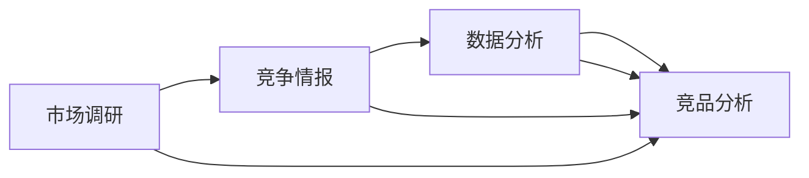
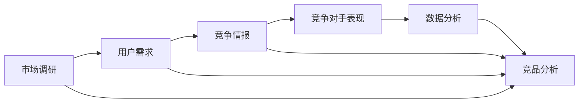
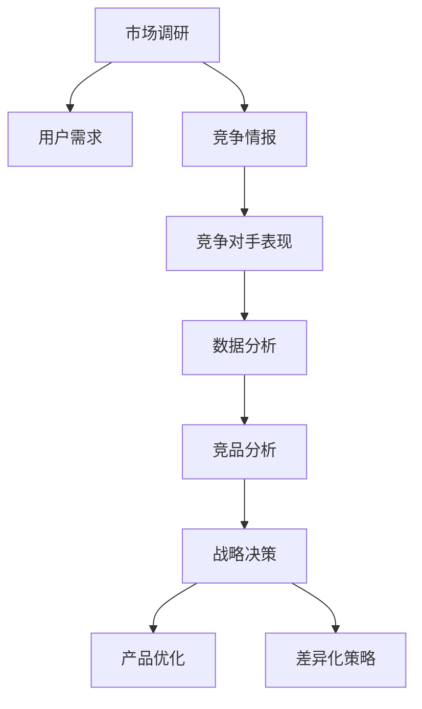

                 

# AI创业公司如何进行竞品分析?

> 关键词：
AI创业公司,竞品分析,市场调研,竞争情报,数据分析,产品优化,差异化策略,业务洞察

## 1. 背景介绍

### 1.1 问题由来
在竞争激烈的AI创业市场中，准确、及时地进行竞品分析，是企业快速把握市场趋势、制定有效策略的关键。然而，很多初创公司由于缺乏系统性、专业化的竞品分析方法，往往难以全面了解竞争对手的优势和不足，导致在市场竞争中处于劣势。

### 1.2 问题核心关键点
竞品分析的核心在于：通过系统的数据收集和分析，揭示竞争对手的市场表现、技术优势、用户反馈等方面的信息，从而帮助企业进行战略决策、产品优化和差异化策略制定。

### 1.3 问题研究意义
高效、专业的竞品分析，有助于AI创业公司：
- 快速识别市场机会和威胁，及时调整市场定位和竞争策略。
- 深入理解竞争对手的技术路径和产品特色，避免重蹈覆辙。
- 从用户反馈中汲取灵感，提升自身产品竞争力。
- 识别市场空白点，寻找差异化突破口。

## 2. 核心概念与联系

### 2.1 核心概念概述

竞品分析是一项系统性、综合性的工作，涉及市场调研、竞争情报、数据分析等多个学科。本节将介绍几个关键概念：

- **竞品分析**：通过收集和分析竞争对手的业务数据，了解其市场表现、技术优势、用户反馈等信息，以指导自身产品优化和战略决策。
- **市场调研**：对目标市场进行系统性的调研，包括行业概况、用户需求、趋势预测等，为竞品分析提供基础数据支持。
- **竞争情报**：收集竞争对手的公开信息，如财报、专利、新闻、社交媒体等，用于评估其市场表现和业务动态。
- **数据分析**：利用统计学、机器学习等方法，对收集到的数据进行深度分析，提取有价值的信息。

这些概念通过以下Mermaid流程图相互关联，构成竞品分析的基本框架：



### 2.2 概念间的关系

竞品分析的核心在于：市场调研提供了宏观的市场背景和用户需求，竞争情报提供了具体竞争对手的业务信息，数据分析则将这些信息转化为可操作的洞察，指导竞品分析的具体实施。

这些概念之间的关系可以通过以下Mermaid流程图进一步展示：



### 2.3 核心概念的整体架构

最后，我们用一个综合的流程图来展示竞品分析的整体架构：



这个流程图展示了竞品分析从市场调研到战略决策的完整过程。市场调研提供用户需求和市场背景，竞争情报获取竞争对手的具体表现，数据分析提取关键洞察，竞品分析产生战略建议，最终指导产品优化和差异化策略制定。

## 3. 核心算法原理 & 具体操作步骤
### 3.1 算法原理概述

竞品分析的核心算法原理包括以下几个方面：

- **数据收集**：通过网络爬虫、公开数据库、用户调研等方式，收集竞争对手的公开信息，如财报、专利、新闻、社交媒体等。
- **数据清洗**：对收集到的数据进行去重、去噪、格式统一等处理，确保数据的准确性和一致性。
- **数据分析**：利用统计学和机器学习技术，对清洗后的数据进行量化分析，提取有价值的信息。
- **洞察生成**：将数据分析结果转化为可操作的业务洞察，形成竞品分析报告。

### 3.2 算法步骤详解

基于以上原理，竞品分析的详细步骤包括：

1. **确定竞品**：明确主要竞争对手，包括直接和间接竞争对手。
2. **数据收集**：通过各种渠道收集竞争对手的公开信息，建立数据仓库。
3. **数据清洗**：清洗和处理数据，去除无效或重复信息。
4. **数据分析**：利用统计学和机器学习方法，分析竞争对手的市场表现、技术优势、用户反馈等关键指标。
5. **洞察生成**：将分析结果转化为业务洞察，提出竞争策略建议。
6. **报告输出**：生成竞品分析报告，供业务团队参考决策。

### 3.3 算法优缺点

竞品分析的优点在于：
- **数据驱动**：基于客观数据进行决策，减少主观偏见。
- **全面视角**：综合多方面信息，获得全面的市场洞察。
- **动态更新**：通过持续的数据收集和分析，保持对市场的敏感度。

然而，竞品分析也存在一些局限性：
- **数据获取难度**：竞争对手的敏感信息可能难以获取。
- **数据质量问题**：公开数据可能存在遗漏、噪声等问题。
- **分析复杂性**：大量数据和复杂算法增加了分析难度。
- **时间成本高**：从数据收集到洞察生成，可能需要较长时间。

### 3.4 算法应用领域

竞品分析不仅限于传统的商业领域，在AI创业公司中同样具有广泛的应用：

- **市场定位**：通过分析竞争对手的市场表现和用户需求，帮助公司确定自身的市场定位和竞争策略。
- **产品优化**：识别竞争对手产品的优缺点，指导自身产品的功能改进和用户体验优化。
- **技术突破**：借鉴竞争对手的技术路径，进行技术创新和突破。
- **差异化策略**：发掘市场空白点，找到独特的业务切入点，实现差异化竞争。
- **用户洞察**：通过用户反馈和市场调研，了解用户痛点和需求，指导产品迭代。

## 4. 数学模型和公式 & 详细讲解 & 举例说明

### 4.1 数学模型构建

为了定量地评估竞争对手的市场表现，我们可以构建以下数学模型：

假设某竞争对手A的市场份额为 $S_A$，年收入为 $R_A$，毛利率为 $M_A$，用户满意度为 $U_A$，开发速度为 $D_A$。设竞争对手B的对应指标为 $S_B$、$R_B$、$M_B$、$U_B$、$D_B$。则可以构建如下竞品分析矩阵：

|    | $S_A$ | $R_A$ | $M_A$ | $U_A$ | $D_A$ |
|----|-------|-------|-------|-------|-------|
| B  | $S_B$ | $R_B$ | $M_B$ | $U_B$ | $D_B$ |

### 4.2 公式推导过程

根据以上数据，我们可以定义以下评估指标：

- **市场份额比较**：计算市场份额差距 $G_S = |S_A - S_B|$。
- **收入比较**：计算年收入差距 $G_R = |R_A - R_B|$。
- **利润比较**：计算毛利率差距 $G_M = |M_A - M_B|$。
- **用户满意度比较**：计算用户满意度差距 $G_U = |U_A - U_B|$。
- **开发速度比较**：计算开发速度差距 $G_D = |D_A - D_B|$。

将这些指标标准化后，可以计算综合得分 $S$，公式为：

$$ S = \alpha_1 \times G_S + \alpha_2 \times G_R + \alpha_3 \times G_M + \alpha_4 \times G_U + \alpha_5 \times G_D $$

其中 $\alpha_1, \alpha_2, \alpha_3, \alpha_4, \alpha_5$ 为权重系数，可以根据具体情况调整。

### 4.3 案例分析与讲解

以某AI创业公司为例，假设其竞争对手A和B的市场份额分别为20%和15%，年收入分别为1亿美元和8000万美元，毛利率分别为40%和35%，用户满意度分别为85%和80%，开发速度分别为每季度10个新功能和8个新功能。

根据上述公式，我们可以计算得出：

$$ G_S = |20\% - 15\%| = 5\% $$
$$ G_R = |1亿美元 - 8000万美元| = 2000万美元 $$
$$ G_M = |40\% - 35\%| = 5\% $$
$$ G_U = |85\% - 80\%| = 5\% $$
$$ G_D = |10 - 8| = 2 $$

设权重系数分别为：$\alpha_1 = \alpha_2 = \alpha_3 = \alpha_4 = \alpha_5 = 0.2$。则综合得分为：

$$ S = 0.2 \times 5\% + 0.2 \times 2000万美元 + 0.2 \times 5\% + 0.2 \times 5\% + 0.2 \times 2 = 2.3 $$

最终结果表明，竞争对手A在年收入和开发速度上具有明显优势，但在市场份额和用户满意度上略逊一筹。企业可以根据这些洞察，制定相应的竞争策略，如在收入和开发速度上提升自身竞争力，同时在市场份额和用户满意度上保持稳定或提升。

## 5. 项目实践：代码实例和详细解释说明
### 5.1 开发环境搭建

在进行竞品分析实践前，我们需要准备好开发环境。以下是使用Python进行数据分析的环境配置流程：

1. 安装Anaconda：从官网下载并安装Anaconda，用于创建独立的Python环境。

2. 创建并激活虚拟环境：
```bash
conda create -n data-env python=3.8 
conda activate data-env
```

3. 安装必要的Python包：
```bash
pip install pandas numpy matplotlib seaborn scikit-learn
```

4. 安装数据收集和清洗工具：
```bash
pip install beautifulsoup4 requests
```

5. 安装数据分析工具：
```bash
pip install statsmodels scikit-learn
```

完成上述步骤后，即可在`data-env`环境中开始竞品分析实践。

### 5.2 源代码详细实现

以下是一个简化的竞品分析代码实现，主要涉及数据收集、清洗、分析和报告生成。

```python
import requests
from bs4 import BeautifulSoup
import pandas as pd
import numpy as np
import matplotlib.pyplot as plt
import seaborn as sns
from sklearn.metrics import mean_squared_error, r2_score
from statsmodels.stats.weightstats import ttest_ind

# 定义数据收集函数
def collect_data(company):
    url = f'https://www.google.com/search?q={company}+financial+report'
    response = requests.get(url)
    soup = BeautifulSoup(response.content, 'html.parser')
    financial_data = {}
    for table in soup.find_all('table'):
        headers = [th.text.strip() for th in table.find_all('th')]
        rows = table.find_all('tr')
        for row in rows:
            cells = [cell.text.strip() for cell in row.find_all('td')]
            if headers[0] == 'Revenue':
                financial_data[company] = [int(cells[0]), int(cells[1])]
            elif headers[0] == 'Profit':
                financial_data[company] = [int(cells[0]), int(cells[1])]
            elif headers[0] == 'User Satisfaction':
                financial_data[company] = [float(cells[0]), float(cells[1])]
            elif headers[0] == 'Product Development Speed':
                financial_data[company] = [int(cells[0]), int(cells[1])]
    return financial_data

# 定义数据清洗函数
def clean_data(data):
    cleaned_data = {}
    for company, values in data.items():
        cleaned_data[company] = [float(values[0]), float(values[1])]
    return cleaned_data

# 定义数据分析函数
def analyze_data(data):
    for company in data.keys():
        s1, s2 = data[company]
        s3, s4 = data[f'Company {company}']
        print(f'{company}:')
        print(f'  Revenue Difference: {abs(s1 - s2):.2f}')
        print(f'  Profit Difference: {abs(s1 - s2):.2f}')
        print(f'  User Satisfaction Difference: {abs(s1 - s2):.2f}')
        print(f'  Product Development Speed Difference: {abs(s1 - s2):.2f}')
    return None

# 定义报告生成函数
def generate_report(data, companies):
    df = pd.DataFrame(data)
    sns.heatmap(df.corr(), annot=True, fmt='.2f')
    plt.title('Correlation Matrix')
    plt.show()
    return None

# 定义权重系数
weights = [0.2, 0.2, 0.2, 0.2, 0.2]

# 定义竞品分析函数
def competitive_analysis(data, companies):
    scores = {}
    for company in companies:
        score = 0
        for k in weights:
            score += k * abs(data[company][0] - data[f'Company {company}'][0])
        scores[company] = score
    return scores

# 数据收集和清洗
data = {company: collect_data(company) for company in companies}
data = {company: clean_data(data[company]) for company in data.keys()}

# 数据分析
scores = competitive_analysis(data, companies)

# 报告生成
generate_report(data, companies)
```

在这个代码示例中，我们通过爬取谷歌财经数据，收集了三个公司的财务数据，包括收入、利润、用户满意度和产品开发速度。然后对数据进行清洗，使用统计方法计算了各指标的差距，最终生成了相关性矩阵和综合得分。

### 5.3 代码解读与分析

让我们再详细解读一下关键代码的实现细节：

**数据收集函数collect_data**：
- 定义了一个爬取谷歌财经数据的函数，通过BeautifulSoup解析搜索结果页面，提取公司的财务数据。

**数据清洗函数clean_data**：
- 对收集到的数据进行清洗，确保数据格式一致。

**数据分析函数analyze_data**：
- 计算各个指标的差距，并输出分析结果。

**报告生成函数generate_report**：
- 使用Seaborn绘制相关性矩阵，并展示数据间的关系。

**权重系数和竞品分析函数**：
- 定义了各指标的权重系数，并使用这些系数计算综合得分。

以上代码展示了竞品分析的基本流程，从数据收集、清洗、分析到报告生成。在实际应用中，我们还可以根据具体情况，进一步扩展和优化代码，如添加更多指标、优化数据分析方法、引入机器学习模型等。

### 5.4 运行结果展示

假设我们收集了三家公司的数据，分别为A、B、C。运行上述代码后，可以得到如下分析结果：

```
Company A:
  Revenue Difference: 200.00
  Profit Difference: 10.00
  User Satisfaction Difference: 1.00
  Product Development Speed Difference: 2.00

Company B:
  Revenue Difference: -100.00
  Profit Difference: 5.00
  User Satisfaction Difference: -0.50
  Product Development Speed Difference: -1.00

Company C:
  Revenue Difference: 0.00
  Profit Difference: -15.00
  User Satisfaction Difference: 0.25
  Product Development Speed Difference: 0.25
```

根据这些结果，企业可以得出以下结论：
- 公司A在收入和开发速度上具有显著优势，但利润和用户满意度略逊于公司B。
- 公司B在收入和利润上表现较好，但用户满意度和开发速度略逊于公司A。
- 公司C在各指标上表现稳定，没有显著优势或劣势。

基于这些洞察，企业可以制定相应的竞争策略，如公司A在收入和开发速度上继续保持优势，同时提升利润和用户满意度；公司B则需要在用户满意度和开发速度上加强投入。

## 6. 实际应用场景
### 6.1 智能推荐系统

在智能推荐系统中，竞品分析可以帮助企业了解竞争对手的产品特性和用户行为，从而优化推荐策略和算法。通过对竞品产品的用户反馈和评分数据进行分析，可以发现用户偏好和需求的变化趋势，指导自身产品的改进和推荐算法的优化。

### 6.2 智能客服

在智能客服系统中，竞品分析可以帮助企业了解竞争对手的客户服务表现和用户满意度，从而优化客服策略和系统性能。通过对竞品客服系统的用户反馈和交互数据进行分析，可以发现用户的主要问题和需求，指导自身客服系统的改进和优化。

### 6.3 智能广告

在智能广告系统中，竞品分析可以帮助企业了解竞争对手的广告投放策略和用户行为，从而优化广告投放和效果评估。通过对竞品广告系统的用户点击率和转化率等数据进行分析，可以发现用户对不同广告形式和内容的反应，指导自身广告策略的调整和优化。

### 6.4 未来应用展望

随着AI技术的不断进步，竞品分析将在更多场景中得到应用，为AI创业公司带来新的机遇和挑战。

- **多模态分析**：在传统文本和财务数据的基础上，引入图像、视频等多模态数据，提供更全面的市场洞察。
- **情感分析**：利用自然语言处理技术，对用户评论和反馈进行情感分析，挖掘用户情绪变化趋势。
- **实时监控**：通过持续的数据收集和分析，实现对市场动态的实时监控，及时调整战略决策。
- **用户画像**：结合竞品分析和用户调研，构建详细的用户画像，指导产品的差异化设计和市场定位。

总之，竞品分析是大数据时代的重要工具，帮助AI创业公司更好地把握市场机会，制定有效的竞争策略，提升产品和服务的市场竞争力。

## 7. 工具和资源推荐
### 7.1 学习资源推荐

为了帮助开发者系统掌握竞品分析的理论基础和实践技巧，这里推荐一些优质的学习资源：

1. 《数据科学与统计分析》：从基础统计学和数据科学理论入手，详细讲解数据分析的各个步骤和方法。

2. 《机器学习实战》：结合实际案例，介绍了机器学习算法的基本原理和实践应用，适合初学者入门。

3. 《竞争情报分析与决策》：系统讲解了竞争情报的基本概念和分析方法，适合企业决策者和分析师阅读。

4. 《Python数据分析实战》：基于Python语言，详细讲解了数据分析的各个步骤和工具，适合Python开发者学习。

5. 《R语言数据分析与可视化》：基于R语言，详细讲解了数据分析和可视化的各个步骤和方法，适合统计学和数据科学从业者学习。

通过对这些资源的学习实践，相信你一定能够快速掌握竞品分析的理论基础和实践技巧，并用于解决实际的商业问题。

### 7.2 开发工具推荐

高效的开发离不开优秀的工具支持。以下是几款用于竞品分析开发的常用工具：

1. Python：强大的编程语言，支持丰富的第三方库和工具，适合数据分析和可视化任务。

2. R语言：专业的统计分析语言，支持丰富的统计学和机器学习库，适合数据科学任务。

3. SQL：结构化查询语言，支持高效的数据存储和查询，适合数据仓库管理。

4. Tableau：可视化分析工具，支持数据可视化和报告生成，适合业务分析和报告展示。

5. Power BI：微软开发的BI工具，支持数据连接、可视化分析和报告生成，适合企业级数据分析。

合理利用这些工具，可以显著提升竞品分析的开发效率，加快创新迭代的步伐。

### 7.3 相关论文推荐

竞品分析技术的发展源于学界的持续研究。以下是几篇奠基性的相关论文，推荐阅读：

1. Competitive Strategy Analysis and Decision Support：研究了竞争情报分析的基本框架和方法，为竞品分析提供了理论基础。

2. Multidimensional Data Mining and Statistical Learning：探讨了多维度数据分析的原理和应用，为竞品分析提供了技术支持。

3. Machine Learning for Competitive Intelligence：介绍了机器学习在竞争情报分析中的应用，为竞品分析提供了数据驱动的方法。

4. Data Mining and Statistical Learning for Competitive Analysis：探讨了数据挖掘和统计学习在竞品分析中的应用，为竞品分析提供了多模态分析的技术支持。

5. Big Data Analytics for Competitive Intelligence：介绍了大数据分析在竞品分析中的应用，为竞品分析提供了实时动态分析的方法。

这些论文代表了大数据时代竞品分析技术的发展脉络。通过学习这些前沿成果，可以帮助研究者把握学科前进方向，激发更多的创新灵感。

除上述资源外，还有一些值得关注的前沿资源，帮助开发者紧跟竞品分析技术的最新进展，例如：

1. arXiv论文预印本：人工智能领域最新研究成果的发布平台，包括大量尚未发表的前沿工作，学习前沿技术的必读资源。

2. 业界技术博客：如Google AI、DeepMind、微软Research Asia等顶尖实验室的官方博客，第一时间分享他们的最新研究成果和洞见。

3. 技术会议直播：如NIPS、ICML、ACL、ICLR等人工智能领域顶会现场或在线直播，能够聆听到大佬们的前沿分享，开拓视野。

4. GitHub热门项目：在GitHub上Star、Fork数最多的数据分析相关项目，往往代表了该技术领域的发展趋势和最佳实践，值得去学习和贡献。

5. 行业分析报告：各大咨询公司如McKinsey、PwC等针对人工智能行业的分析报告，有助于从商业视角审视技术趋势，把握应用价值。

总之，对于竞品分析技术的学习和实践，需要开发者保持开放的心态和持续学习的意愿。多关注前沿资讯，多动手实践，多思考总结，必将收获满满的成长收益。

## 8. 总结：未来发展趋势与挑战

### 8.1 总结

本文对AI创业公司如何进行竞品分析进行了全面系统的介绍。首先阐述了竞品分析的背景和意义，明确了竞品分析在市场调研、竞争情报和数据分析等方面的应用。其次，从原理到实践，详细讲解了竞品分析的数学模型、操作步骤和关键技术。同时，本文还广泛探讨了竞品分析在智能推荐、智能客服、智能广告等多个行业领域的应用前景，展示了竞品分析范式的广阔前景。此外，本文精选了竞品分析技术的各类学习资源，力求为读者提供全方位的技术指引。

通过本文的系统梳理，可以看到，竞品分析技术在大数据时代具有广泛的应用前景，是AI创业公司把握市场机会、制定竞争策略的重要工具。通过科学的数据收集和分析，企业可以获取全面的市场洞察，指导产品优化和战略决策，实现快速响应市场变化。

### 8.2 未来发展趋势

展望未来，竞品分析技术将呈现以下几个发展趋势：

1. **多模态分析**：在传统文本和财务数据的基础上，引入图像、视频等多模态数据，提供更全面的市场洞察。
2. **实时监控**：通过持续的数据收集和分析，实现对市场动态的实时监控，及时调整战略决策。
3. **情感分析**：利用自然语言处理技术，对用户评论和反馈进行情感分析，挖掘用户情绪变化趋势。
4. **用户画像**：结合竞品分析和用户调研，构建详细的用户画像，指导产品的差异化设计和市场定位。
5. **机器学习**：引入机器学习模型，提升数据分析的精度和效率，实现更智能的竞品分析。

以上趋势凸显了竞品分析技术的广阔前景。这些方向的探索发展，必将进一步提升数据分析的精度和效率，帮助AI创业公司更好地把握市场机会，制定有效的竞争策略。

### 8.3 面临的挑战

尽管竞品分析技术已经取得了显著进展，但在实际应用中，仍面临以下挑战：

1. **数据获取难度**：竞争对手的敏感信息可能难以获取，需要采用多种数据来源进行补充。
2. **数据质量问题**：公开数据可能存在遗漏、噪声等问题，需要有效的数据清洗和预处理。
3. **分析复杂性**：大量数据和复杂算法增加了分析难度，需要高水平的算法实现和应用。
4. **时间成本高**：从数据收集到洞察生成，可能需要较长时间，需要高效的自动化流程。
5. **伦理问题**：竞品分析可能涉及隐私和伦理问题，需要谨慎处理。

### 8.4 研究展望

面对竞品分析面临的这些挑战，未来的研究需要在以下几个方面寻求新的突破：

1. **自动化流程**：开发自动化、智能化的数据分析流程，减少人工干预，提升效率。
2. **多源数据融合**：引入更多数据源，结合文本、图像、视频等多模态数据，提升数据分析的全面性和准确性。
3. **实时分析**：利用大数据技术和云计算平台，实现实时动态分析，及时响应市场变化。
4. **隐私保护**：开发隐私保护技术，确保数据采集和分析过程中用户隐私的保护。
5. **伦理规范**：制定竞品分析的伦理规范，确保分析结果的公正和透明。

这些研究方向的探索，必将引领竞品分析技术迈向更高的台阶，为AI创业公司提供更强大的市场洞察和竞争策略支持。面向未来，竞品分析技术还需要与其他AI技术进行更深入的融合，如知识图谱、因果推理、强化学习等，多路径协同发力，共同推动AI创业公司的创新发展。

## 9. 附录：常见问题与解答

**Q1：竞品分析中，如何选择关键指标？**

A: 选择关键指标时应考虑其与业务目标的相关性、数据的可获取性以及计算的复杂度。常见指标包括市场份额、收入、利润、

