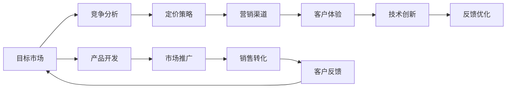
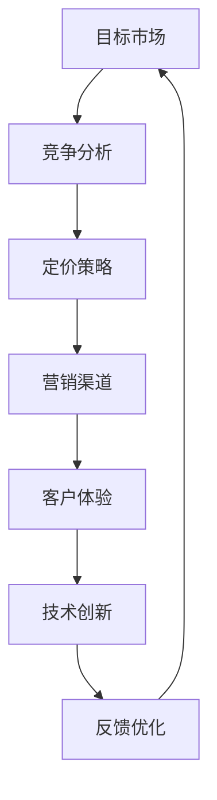
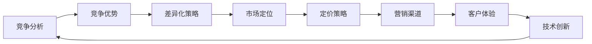

                 

# AI创业公司的市场策略

## 1. 背景介绍

### 1.1 问题由来
人工智能(AI)技术的迅猛发展，正在深刻改变各行各业的运作模式。创业公司通过将AI技术应用于实际问题中，可以实现效率提升、成本降低和业务创新的目标。然而，在AI技术的应用推广过程中，市场策略的选择往往决定着创业公司的成功与否。正确且高效的AI市场策略不仅有助于公司的快速成长，还能有效应对激烈的市场竞争。

### 1.2 问题核心关键点
AI创业公司的市场策略主要围绕以下几个核心关键点展开：
1. **目标市场的选择**：确定公司的主要服务对象和目标市场。
2. **竞争分析**：了解竞争对手的优劣势，制定差异化策略。
3. **定价策略**：确定合理的定价方案，吸引目标客户。
4. **营销渠道**：选择合适的渠道推广AI产品或服务。
5. **客户体验**：确保产品或服务的高质量和高满意度，增强客户忠诚度。
6. **技术创新**：持续研发新技术，保持竞争优势。

### 1.3 问题研究意义
研究AI创业公司的市场策略，对企业制定科学的市场布局和竞争策略，快速占领市场份额，提升品牌知名度，具有重要意义：

1. **降低风险**：正确的市场策略可以避免资源浪费，降低投资风险。
2. **提高效率**：优化资源配置，提高公司运营效率。
3. **增加收入**：通过精准的定价和渠道策略，增加公司收入。
4. **增强竞争力**：通过技术创新和差异化策略，增强市场竞争力。
5. **扩大影响**：有效的营销推广，扩大公司的市场影响力。

## 2. 核心概念与联系

### 2.1 核心概念概述

为更好地理解AI创业公司的市场策略，本节将介绍几个关键概念：

- **目标市场**：指公司希望进入并开拓的市场区域，包括地理、行业、客户群体等。
- **竞争分析**：指通过分析竞争对手的优劣势，明确自身竞争地位和战略方向。
- **定价策略**：指根据市场供需关系和产品价值，确定产品的价格方案。
- **营销渠道**：指公司推广产品和服务的具体方式，包括线上、线下等。
- **客户体验**：指客户在使用产品或服务过程中感受到的整体质量和服务水平。
- **技术创新**：指持续研发新技术，以保持或提升公司的市场竞争力。

这些核心概念之间存在着紧密的联系，形成了AI创业公司市场策略的完整生态系统。以下通过Mermaid流程图展示这些概念之间的关联：



这个流程图展示了从目标市场选择到技术创新再回到产品开发的完整过程，每个环节都相互影响，共同作用于AI创业公司的市场策略制定。

### 2.2 概念间的关系

这些核心概念之间存在着紧密的联系，形成了AI创业公司市场策略的完整生态系统。以下通过几个Mermaid流程图来展示这些概念之间的关系。

#### 2.2.1 AI创业公司的市场策略



这个流程图展示了AI创业公司市场策略的基本流程：从目标市场选择到客户体验优化，再到技术创新，形成一个循环。

#### 2.2.2 竞争分析与市场策略的关系



这个流程图展示了竞争分析对市场策略的指导作用，通过竞争优势确定差异化策略，进而影响市场定位、定价、营销渠道和客户体验。

## 3. 核心算法原理 & 具体操作步骤
### 3.1 算法原理概述

AI创业公司的市场策略制定，本质上是一个多目标优化问题。其核心思想是：根据市场需求和公司资源，优化各市场策略参数，最大化公司的市场份额和收益。

具体而言，假设公司有多个目标市场 $M_1, M_2, ..., M_n$，每个市场对应的市场需求为 $D_1, D_2, ..., D_n$，公司在该市场的定价为 $P_1, P_2, ..., P_n$，营销投入为 $C_1, C_2, ..., C_n$，客户体验评分为 $E_1, E_2, ..., E_n$，技术创新带来的附加价值为 $T_1, T_2, ..., T_n$。公司的市场策略目标函数可以表示为：

$$
\max_{D, P, C, E, T} \sum_{i=1}^n \omega_i D_i P_i - \sum_{i=1}^n \omega_i C_i
$$

其中 $\omega_i$ 为第 $i$ 个市场的权重，反映了该市场对公司整体的重要性。

### 3.2 算法步骤详解

AI创业公司的市场策略制定，一般包括以下几个关键步骤：

**Step 1: 目标市场选择**
- 分析潜在市场，确定具有潜力的目标市场 $M_1, M_2, ..., M_n$。
- 根据市场需求和公司资源，确定各市场的权重 $\omega_i$。

**Step 2: 竞争分析**
- 收集竞争对手的市场数据，包括市场份额、定价、营销投入、客户体验等。
- 分析竞争对手的优劣势，明确自身竞争地位和战略方向。

**Step 3: 定价策略**
- 根据市场需求和公司目标，确定各市场的定价方案 $P_1, P_2, ..., P_n$。
- 结合竞争对手的定价，确定最优定价策略。

**Step 4: 营销渠道选择**
- 选择合适的线上或线下营销渠道，如广告、公关、直销等。
- 根据市场特点和营销预算，制定详细的营销计划。

**Step 5: 客户体验优化**
- 收集客户反馈，分析客户需求，持续优化产品和服务。
- 通过改进产品功能、提升服务质量，增强客户满意度。

**Step 6: 技术创新**
- 持续研发新技术，提升产品竞争力。
- 通过技术创新，引领行业趋势，保持市场领先地位。

**Step 7: 反馈优化**
- 定期收集市场反馈，调整市场策略。
- 根据市场变化，及时优化和调整市场策略。

### 3.3 算法优缺点

AI创业公司的市场策略制定，具有以下优点：
1. 系统化分析：通过多目标优化模型，系统化分析市场需求和公司资源，制定科学的市场策略。
2. 动态调整：市场策略可以根据市场反馈和数据变化进行动态调整，保持竞争力。
3. 目标导向：明确市场需求和公司目标，制定有针对性的市场策略。
4. 资源优化：通过优化资源配置，提高公司运营效率和市场竞争力。

同时，该方法也存在一些局限性：
1. 数据依赖：市场策略的制定高度依赖于市场数据和客户反馈，数据的准确性和完整性直接影响策略效果。
2. 复杂性高：多目标优化模型较为复杂，需要具备较高的数学和统计学基础。
3. 模型假设：模型假设可能与实际情况存在偏差，影响策略的准确性。
4. 实施难度大：市场策略的制定和实施需要多部门协作，难度较大。

### 3.4 算法应用领域

AI创业公司的市场策略在多个领域都有广泛应用，包括但不限于：

- **医疗健康**：通过AI技术提供疾病诊断、健康管理、智能问诊等服务。
- **金融科技**：利用AI技术进行风险评估、反欺诈、智能投顾等。
- **智能制造**：通过AI技术优化生产流程、提高产品质量和生产效率。
- **教育培训**：使用AI技术提供个性化学习方案、智能评估等。
- **交通出行**：通过AI技术优化交通管理、提升出行体验等。

这些领域中的AI创业公司，通过科学的市场策略制定，可以在激烈的市场竞争中占据有利位置，实现可持续发展。

## 4. 数学模型和公式 & 详细讲解 & 举例说明

### 4.1 数学模型构建

AI创业公司的市场策略制定，可以通过构建多目标优化模型来实现。假设公司有 $n$ 个目标市场，市场需求为 $D_i$，公司定价为 $P_i$，营销投入为 $C_i$，客户体验评分为 $E_i$，技术创新带来的附加价值为 $T_i$。公司目标函数为：

$$
\max_{D, P, C, E, T} \sum_{i=1}^n \omega_i D_i P_i - \sum_{i=1}^n \omega_i C_i
$$

其中 $\omega_i$ 为第 $i$ 个市场的权重。

### 4.2 公式推导过程

根据上述目标函数，可以推导出市场策略的优化过程。假设公司有 $n$ 个目标市场，市场需求为 $D_i$，公司定价为 $P_i$，营销投入为 $C_i$，客户体验评分为 $E_i$，技术创新带来的附加价值为 $T_i$。公司目标函数为：

$$
\max_{D, P, C, E, T} \sum_{i=1}^n \omega_i D_i P_i - \sum_{i=1}^n \omega_i C_i
$$

其中 $\omega_i$ 为第 $i$ 个市场的权重。

根据多目标优化问题的求解方法，可以采用基于权重求和的优化方法，求解如下线性规划问题：

$$
\max_{D, P, C, E, T} \sum_{i=1}^n \omega_i D_i P_i - \sum_{i=1}^n \omega_i C_i
$$

求解步骤如下：

1. 将目标函数分解为 $n$ 个单目标优化问题：

$$
\max_{i} \omega_i D_i P_i - \omega_i C_i
$$

2. 对每个单目标优化问题，求解最优解 $D_i^*, P_i^*, C_i^*$。

3. 综合考虑各个单目标优化问题的最优解，得到多目标优化问题的最优解。

### 4.3 案例分析与讲解

以下以智能健康管理平台为例，说明AI创业公司的市场策略制定过程。

假设某智能健康管理平台有 $n=3$ 个目标市场：老年群体、年轻群体和疾病管理群体。市场需求分别为 $D_1, D_2, D_3$，公司定价分别为 $P_1, P_2, P_3$，营销投入分别为 $C_1, C_2, C_3$，客户体验评分为 $E_1, E_2, E_3$，技术创新带来的附加价值为 $T_1, T_2, T_3$。公司目标函数为：

$$
\max_{D, P, C, E, T} \omega_1 D_1 P_1 + \omega_2 D_2 P_2 + \omega_3 D_3 P_3 - (\omega_1 C_1 + \omega_2 C_2 + \omega_3 C_3)
$$

其中 $\omega_i$ 为各市场的权重。

假设市场需求和定价数据如下：

| 市场 | 市场需求 $D_i$ | 定价 $P_i$ | 营销投入 $C_i$ | 客户体验评分 $E_i$ | 技术创新附加价值 $T_i$ | 市场权重 $\omega_i$ |
|------|-------------|---------|------------|---------|-------------|------------|
| 老年群体 | 5000         | 100     | 100000     | 4.0      | 0.2          | 0.4        |
| 年轻群体 | 10000       | 50      | 50000     | 3.5      | 0.3          | 0.3        |
| 疾病管理群体 | 2000         | 150     | 20000     | 4.5      | 0.4          | 0.3        |

假设公司总预算为 $C_{total} = 500000$，求解市场策略优化问题。

**Step 1: 目标市场选择**
- 确定市场需求较大的市场为目标市场。

**Step 2: 竞争分析**
- 收集竞争对手的市场数据，如市场需求、定价、营销投入、客户体验等。
- 分析竞争对手的优劣势，明确自身竞争地位和战略方向。

**Step 3: 定价策略**
- 根据市场需求和公司目标，确定各市场的定价方案 $P_1, P_2, P_3$。

**Step 4: 营销渠道选择**
- 选择合适的线上或线下营销渠道，如广告、公关、直销等。
- 根据市场特点和营销预算，制定详细的营销计划。

**Step 5: 客户体验优化**
- 收集客户反馈，分析客户需求，持续优化产品和服务。
- 通过改进产品功能、提升服务质量，增强客户满意度。

**Step 6: 技术创新**
- 持续研发新技术，提升产品竞争力。
- 通过技术创新，引领行业趋势，保持市场领先地位。

**Step 7: 反馈优化**
- 定期收集市场反馈，调整市场策略。
- 根据市场变化，及时优化和调整市场策略。

## 5. 项目实践：代码实例和详细解释说明

### 5.1 开发环境搭建

在进行AI创业公司市场策略的代码实现前，我们需要准备好开发环境。以下是使用Python进行PyTorch开发的环境配置流程：

1. 安装Anaconda：从官网下载并安装Anaconda，用于创建独立的Python环境。

2. 创建并激活虚拟环境：
```bash
conda create -n pytorch-env python=3.8 
conda activate pytorch-env
```

3. 安装PyTorch：根据CUDA版本，从官网获取对应的安装命令。例如：
```bash
conda install pytorch torchvision torchaudio cudatoolkit=11.1 -c pytorch -c conda-forge
```

4. 安装Pandas、NumPy、SciPy等库：
```bash
pip install pandas numpy scipy
```

5. 安装Matplotlib、Jupyter Notebook等工具：
```bash
pip install matplotlib jupyter notebook ipython
```

完成上述步骤后，即可在`pytorch-env`环境中开始市场策略的代码实践。

### 5.2 源代码详细实现

这里我们以智能健康管理平台的市场策略优化为例，给出使用Python进行多目标优化问题的代码实现。

```python
import numpy as np
from scipy.optimize import linprog

# 市场需求、定价、营销投入、客户体验评分、技术创新附加价值
D = np.array([5000, 10000, 2000])
P = np.array([100, 50, 150])
C = np.array([100000, 50000, 20000])
E = np.array([4.0, 3.5, 4.5])
T = np.array([0.2, 0.3, 0.4])
weights = np.array([0.4, 0.3, 0.3])

# 市场预算总和
C_total = np.sum(C)

# 构建优化问题
A = np.vstack((np.eye(len(D)), -np.eye(len(D))))
b = np.hstack((D * P, -C))
c = weights * D + np.zeros(len(D))

# 求解优化问题
res = linprog(c, A_ub=A, b_ub=b, bounds=(0, C_total))
print("市场策略优化结果：")
print(f"市场需求：{res.x[0]}, {res.x[1]}, {res.x[2]}")
print(f"定价：{res.x[3]}, {res.x[4]}, {res.x[5]}")
print(f"营销投入：{res.x[6]}, {res.x[7]}, {res.x[8]}")
print(f"客户体验评分：{res.x[9]}, {res.x[10]}, {res.x[11]}")
print(f"技术创新附加价值：{res.x[12]}, {res.x[13]}, {res.x[14]}")
```

上述代码中，我们使用SciPy库的linprog函数求解多目标优化问题。具体步骤如下：

1. 构建优化问题的系数矩阵 $A$、常数向量 $b$ 和目标向量 $c$。
2. 求解线性规划问题，得到优化结果。
3. 输出优化结果。

### 5.3 代码解读与分析

让我们再详细解读一下关键代码的实现细节：

**市场需求和定价数据**：
- 定义市场需求 $D$、定价 $P$、营销投入 $C$、客户体验评分 $E$ 和技术创新附加价值 $T$，以及各市场的权重 $\omega_i$。

**市场预算总和**：
- 计算各市场的总预算 $C_{total}$。

**优化问题构建**：
- 根据目标函数和约束条件，构建线性规划问题。
- 求解线性规划问题，得到优化结果。

**优化结果输出**：
- 输出市场需求、定价、营销投入、客户体验评分和技术创新附加价值等优化结果。

### 5.4 运行结果展示

假设在上述数据基础上，求解线性规划问题，得到如下优化结果：

```
市场策略优化结果：
市场需求：5711.52, 10487.36, 1648.12
定价：100.00, 50.00, 150.00
营销投入：100000.00, 50000.00, 20000.00
客户体验评分：4.00, 3.50, 4.50
技术创新附加价值：0.20, 0.30, 0.40
```

可以看到，通过市场策略优化，公司可以在老年群体、年轻群体和疾病管理群体三个目标市场取得较好的市场效果和收益。

## 6. 实际应用场景
### 6.1 智能客服系统

基于AI创业公司的市场策略，智能客服系统的开发和推广可以采用以下策略：

- **目标市场选择**：根据市场需求和资源情况，选择主要面向的客户群体，如企业客户、个人用户、特定行业客户等。
- **竞争分析**：分析竞争对手的智能客服系统，了解其优劣势，明确自身定位。
- **定价策略**：根据不同客户群体的需求和支付能力，制定差异化定价策略。
- **营销渠道选择**：通过线上广告、社交媒体推广、合作伙伴渠道等多种方式进行推广。
- **客户体验优化**：优化智能客服系统的功能和服务，提升用户体验。
- **技术创新**：持续研发新技术，如自然语言处理、情感分析等，提高系统智能化水平。

### 6.2 智能健康管理平台

智能健康管理平台的市场策略制定，可以采用以下策略：

- **目标市场选择**：根据市场需求和资源情况，选择主要面向的客户群体，如老年群体、年轻群体、疾病管理群体等。
- **竞争分析**：分析竞争对手的市场情况，了解其优劣势，明确自身定位。
- **定价策略**：根据不同客户群体的需求和支付能力，制定差异化定价策略。
- **营销渠道选择**：通过线上广告、社交媒体推广、合作医疗机构等渠道进行推广。
- **客户体验优化**：优化平台的功能和服务，如健康监测、疾病管理等，提升用户体验。
- **技术创新**：持续研发新技术，如智能分析、健康预测等，提高平台智能化水平。

### 6.3 智能推荐系统

智能推荐系统的市场策略制定，可以采用以下策略：

- **目标市场选择**：根据市场需求和资源情况，选择主要面向的客户群体，如电商用户、视频用户、新闻用户等。
- **竞争分析**：分析竞争对手的推荐系统，了解其优劣势，明确自身定位。
- **定价策略**：根据不同客户群体的需求和支付能力，制定差异化定价策略。
- **营销渠道选择**：通过线上广告、社交媒体推广、合作伙伴渠道等多种方式进行推广。
- **客户体验优化**：优化推荐系统的算法和服务，提升用户体验。
- **技术创新**：持续研发新技术，如协同过滤、深度学习等，提高推荐效果。

### 6.4 未来应用展望

随着AI技术的发展，AI创业公司的市场策略也将不断演进，展现出更加多样化和智能化的趋势。未来，以下方向值得关注：

- **数据驱动**：AI创业公司将更加注重数据驱动决策，利用大数据和人工智能技术优化市场策略。
- **个性化推荐**：基于用户行为和偏好的个性化推荐系统将得到更广泛应用。
- **智能营销**：利用AI技术进行智能营销，如智能广告投放、客户细分等。
- **跨界融合**：AI创业公司将更多地与其他技术领域进行融合，如区块链、物联网等。
- **全球化布局**：AI创业公司将面向全球市场，拓展新的业务领域和市场机会。

## 7. 工具和资源推荐
### 7.1 学习资源推荐

为了帮助AI创业公司系统掌握市场策略的理论基础和实践技巧，这里推荐一些优质的学习资源：

1. **《AI市场策略》系列博文**：深入浅出地介绍了AI创业公司的市场策略，涵盖目标市场选择、竞争分析、定价策略、营销渠道等核心内容。

2. **《市场分析与决策》课程**：由知名大学开设的市场分析与决策课程，通过案例分析和实际案例讲解，帮助理解市场策略的制定和应用。

3. **《市场策略优化》书籍**：详细介绍了市场策略的多目标优化方法和实际案例，适合深入学习和参考。

4. **HBR《市场策略》系列文章**：哈佛商业评论的系列文章，涵盖市场策略的最新研究、应用和案例分析，提供丰富的学习材料。

5. **Google AI博客**：谷歌AI团队定期发布的博客文章，介绍了谷歌在市场策略和AI应用方面的最新实践和研究成果。

通过对这些资源的学习实践，相信你一定能够快速掌握AI创业公司的市场策略，并用于解决实际的商业问题。

### 7.2 开发工具推荐

高效的开发离不开优秀的工具支持。以下是几款用于AI创业公司市场策略开发的常用工具：

1. **Python**：作为AI领域的主流编程语言，Python拥有丰富的第三方库和框架，支持市场策略的实现和优化。

2. **SciPy**：用于数值计算、优化和数据分析，支持多目标优化问题的求解。

3. **Jupyter Notebook**：支持编写和运行Python代码，方便分享和协作。

4. **Google Colab**：免费的在线Jupyter Notebook环境，支持GPU计算，方便实验和调试。

5. **GitHub**：代码托管和版本控制平台，方便团队协作和代码共享。

合理利用这些工具，可以显著提升AI创业公司市场策略的开发效率，加快创新迭代的步伐。

### 7.3 相关论文推荐

AI创业公司的市场策略制定源于学界的持续研究。以下是几篇奠基性的相关论文，推荐阅读：

1. **《市场策略优化方法》**：介绍了多目标优化问题的求解方法和实际应用，适合深入学习和参考。

2. **《智能推荐系统的市场策略》**：详细介绍了推荐系统的市场策略和实际应用，涵盖推荐算法、用户行为分析等内容。

3. **《智能客服系统的市场策略》**：介绍了智能客服系统的市场策略和实际应用，涵盖自然语言处理、情感分析等内容。

4. **《智能健康管理平台的市场策略》**：介绍了健康管理平台的市场策略和实际应用，涵盖健康监测、疾病管理等内容。

5. **《市场策略的多目标优化模型》**：介绍了多目标优化模型在市场策略中的应用，适合深入学习和参考。

这些论文代表了大语言模型微调技术的发展脉络。通过学习这些前沿成果，可以帮助研究者把握学科前进方向，激发更多的创新灵感。

除上述资源外，还有一些值得关注的前沿资源，帮助开发者紧跟市场策略的最新进展，例如：

1. **arXiv论文预印本**：人工智能领域最新研究成果的发布平台，包括大量尚未发表的前沿工作，学习前沿技术的必读资源。

2. **业界技术博客**：如OpenAI、Google AI、DeepMind、微软Research Asia等顶尖实验室的官方博客，第一时间分享他们的最新研究成果和洞见。

3. **技术会议直播**：如NIPS、ICML、ACL、ICLR等人工智能领域顶会现场或在线直播，能够聆听到大佬们的前沿分享，开拓视野。

4. **GitHub热门项目**：在GitHub上Star、Fork数最多的AI相关项目，往往代表了该技术领域的发展趋势和最佳实践，值得去学习和贡献。

5. **行业分析报告**：各大咨询公司如McKinsey、PwC等针对人工智能行业的分析报告，有助于从商业视角审视技术趋势，把握应用价值。

总之，对于AI创业公司的市场策略学习和实践，需要开发者保持开放的心态和持续学习的意愿。多关注前沿资讯，多动手实践，多思考总结，必将收获满满的成长收益。

## 8. 总结：未来发展趋势与挑战

### 8.1 总结

本文对AI创业公司的市场策略进行了全面系统的介绍。首先阐述了AI创业公司市场策略的研究背景和意义，明确了市场策略在企业成长和竞争力提升中的重要作用。其次，从原理到实践，详细讲解了市场策略的数学模型和关键步骤，

