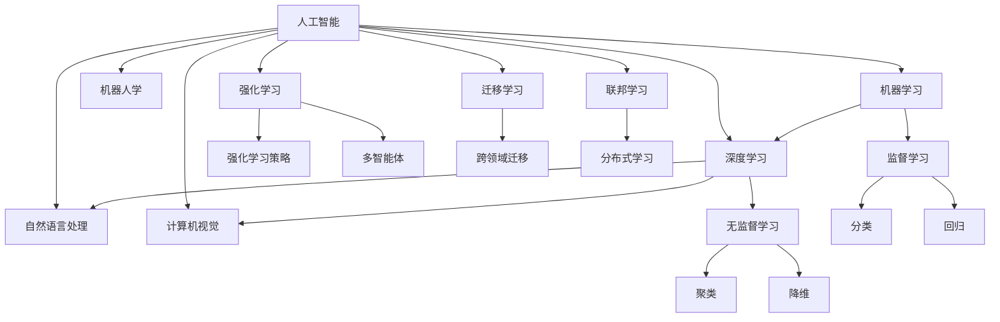

                 

# AI创业机遇：垂直领域无限

## 1. 背景介绍

### 1.1 问题由来

随着人工智能技术的不断进步，人工智能领域创业如火如荼。AI创业公司的数量和质量不断提升，逐步成为引领未来科技发展的重要力量。当前，人工智能领域的技术与应用已经渗透到金融、医疗、教育、工业、智能家居等多个垂直领域，并产生了显著的商业价值和社会效益。因此，探索AI创业的机遇，尤其是如何在垂直领域实现无限可能，对于推动人工智能技术的产业化应用具有重要意义。

### 1.2 问题核心关键点

AI创业的机遇主要集中在以下几个核心关键点上：

- **数据应用价值**：垂直领域的AI创业需要以大量真实的数据为基础，通过对数据的高效处理与分析，提取有价值的信息，实现商业化应用。
- **技术创新驱动**：人工智能技术在垂直领域的应用，需要结合领域知识与算法技术，不断进行创新与突破。
- **市场需求导向**：AI创业的成功与否，在很大程度上取决于其是否能够满足市场对新技术的需求，带来实际的业务价值。
- **行业特色融合**：不同垂直领域具有独特的行业特性与需求，AI创业需要结合行业特色，实现技术与应用的深度融合。
- **伦理合规要求**：AI创业不仅需要考虑技术的可行性，还需严格遵守数据隐私、伦理合规等相关法律法规，确保技术应用的合法性。

## 2. 核心概念与联系

### 2.1 核心概念概述

为更好地理解AI创业的垂直领域机遇，本节将介绍几个密切相关的核心概念：

- **人工智能（AI）**：利用计算机算法，使计算机系统具有人类智能能力，包括感知、理解、学习、推理等。
- **机器学习（ML）**：基于数据训练算法模型，实现智能决策和预测。
- **深度学习（DL）**：一种特殊的机器学习方法，通过构建深层神经网络，实现复杂模式的识别和推理。
- **自然语言处理（NLP）**：使计算机具备理解、处理和生成自然语言的能力，广泛应用于问答、翻译、文本分类等领域。
- **计算机视觉（CV）**：使计算机具备识别、处理图像和视频的能力，在图像识别、目标检测、视频分析等领域有广泛应用。
- **机器人学（Robotics）**：结合人工智能技术与机械工程，实现自动化、自主化的机器人系统。

这些核心概念之间存在着紧密的联系，形成了人工智能技术生态系统的整体架构。

### 2.2 概念间的关系

这些核心概念之间的关系可以通过以下Mermaid流程图来展示：



这个流程图展示了人工智能技术生态系统中的主要概念及其关系：

1. 人工智能技术包括机器学习、深度学习、自然语言处理、计算机视觉和机器人学等多个子领域。
2. 机器学习和深度学习是AI技术的主要实现手段。
3. 自然语言处理和计算机视觉是AI技术在信息处理方面的两个重要分支。
4. 机器人学则是AI技术在智能系统中的应用方向。
5. 不同的学习方式，如监督学习、无监督学习、强化学习等，在各个子领域中都有应用。

## 3. 核心算法原理 & 具体操作步骤

### 3.1 算法原理概述

AI创业的核心算法原理主要基于机器学习和深度学习，其基本思想是通过对大量数据的学习，提取数据中的模式与规律，构建出能够自主决策与预测的智能模型。以下是几个关键的算法原理：

- **监督学习（Supervised Learning）**：利用已标记的数据进行模型训练，预测新数据的标记。在垂直领域中，常用的监督学习算法有决策树、支持向量机、逻辑回归、随机森林等。
- **无监督学习（Unsupervised Learning）**：不依赖已标记数据，通过对数据特征的学习，发现数据的潜在模式与结构。常用的无监督学习算法有聚类、降维、异常检测等。
- **强化学习（Reinforcement Learning）**：通过与环境的交互，学习最优决策策略。在机器人、游戏等领域中应用广泛。
- **迁移学习（Transfer Learning）**：将在一个任务上学到的知识迁移到另一个任务上，减少新任务所需的数据量和计算量。
- **对抗学习（Adversarial Learning）**：生成对抗网络（GAN）和对抗样本训练，提高模型的鲁棒性和泛化能力。

### 3.2 算法步骤详解

AI创业的算法步骤主要包括以下几个关键环节：

1. **数据收集与预处理**：获取垂直领域内的海量数据，并对其进行清洗、标注、归一化等预处理操作。
2. **模型构建与训练**：选择适合的算法，构建模型框架，并利用训练数据对模型进行训练。
3. **模型优化与验证**：通过交叉验证、网格搜索等方法，优化模型参数，提高模型精度。
4. **模型部署与应用**：将训练好的模型部署到实际应用中，进行实时预测与决策。
5. **持续学习与迭代**：根据实际反馈数据，不断调整模型参数，提升模型性能。

### 3.3 算法优缺点

AI创业的算法具有以下优点：

- **数据驱动**：通过大量数据学习，能够获得更加准确和全面的知识。
- **智能决策**：构建智能模型，能够自主进行决策与预测。
- **泛化能力强**：模型能够适应不同的数据和场景，具有较强的泛化能力。

同时，算法也存在以下缺点：

- **数据依赖性强**：需要大量的标注数据和高质量的数据集，获取数据成本较高。
- **模型复杂度高**：算法模型复杂度高，需要大量的计算资源和时间。
- **可解释性不足**：部分算法模型，如深度学习模型，缺乏可解释性，难以理解其决策过程。
- **需要专业技能**：算法实现需要较高的技术水平，对开发者的专业知识要求较高。

### 3.4 算法应用领域

AI创业的算法广泛应用于多个垂直领域，包括但不限于以下几类：

- **医疗**：利用深度学习算法，进行医学影像分析、病历分析、疾病预测等。
- **金融**：通过机器学习算法，进行信用评估、风险控制、交易策略等。
- **教育**：采用自然语言处理技术，进行智能问答、学习行为分析、个性化推荐等。
- **制造**：结合计算机视觉技术，进行质量检测、设备维护、供应链管理等。
- **零售**：利用推荐系统算法，进行个性化推荐、库存管理、客户分析等。

## 4. 数学模型和公式 & 详细讲解 & 举例说明

### 4.1 数学模型构建

本节将使用数学语言对AI创业的算法进行更严谨的刻画。

假设有一个二分类问题，输入特征为 $x \in \mathbb{R}^n$，输出标签为 $y \in \{0, 1\}$。构建一个监督学习模型 $M_{\theta}(x)$，其中 $\theta$ 为模型参数。模型目标是最小化损失函数 $\mathcal{L}(\theta)$，使得模型预测结果与真实标签一致。

定义损失函数 $\mathcal{L}(\theta)$ 为：

$$
\mathcal{L}(\theta) = \frac{1}{N}\sum_{i=1}^N \ell(M_{\theta}(x_i),y_i)
$$

其中，$\ell$ 为损失函数，如交叉熵损失。

### 4.2 公式推导过程

以下是二分类问题中常用的逻辑回归模型（即softmax回归模型）的推导过程：

**假设1：** 模型线性输出：$M_{\theta}(x) = \phi(x)^\top \beta$，其中 $\phi(x) = [x_1, x_2, \ldots, x_n]^\top$ 为特征向量，$\beta = [\beta_1, \beta_2, \ldots, \beta_n]^\top$ 为模型参数。

**假设2：** 损失函数：$\ell(M_{\theta}(x),y) = -y \log M_{\theta}(x) - (1-y) \log (1-M_{\theta}(x))$。

**目标函数：** 最小化目标函数 $\mathcal{L}(\theta) = \frac{1}{N}\sum_{i=1}^N [-y_i \log M_{\theta}(x_i) - (1-y_i) \log (1-M_{\theta}(x_i))]$。

**求解过程：**

1. 将目标函数转化为矩阵形式：
$$
\mathcal{L}(\theta) = \frac{1}{N} \mathbf{y}^\top (\mathbf{X} \mathbf{\beta} - \mathbf{1})^+ \mathbf{1}^\top \mathbf{y}
$$

2. 使用梯度下降算法求解：
$$
\frac{\partial \mathcal{L}(\theta)}{\partial \beta} = \frac{1}{N} \mathbf{X}^\top (\mathbf{y} - \sigma(\mathbf{X} \mathbf{\beta})) \sigma'(\mathbf{X} \mathbf{\beta})
$$

3. 其中，$\sigma(\cdot)$ 为sigmoid函数，$\sigma'(\cdot)$ 为其导数。

**具体计算：**

1. 前向传播：
$$
z_i = \mathbf{x}_i^\top \mathbf{\beta}
$$
$$
\hat{y}_i = \sigma(z_i) = \frac{1}{1+e^{-z_i}}
$$

2. 计算损失：
$$
\mathcal{L}(\theta) = \frac{1}{N} \sum_{i=1}^N [-y_i \log \hat{y}_i - (1-y_i) \log (1-\hat{y}_i)]
$$

3. 计算梯度：
$$
\frac{\partial \mathcal{L}(\theta)}{\partial \beta_j} = \frac{1}{N} \sum_{i=1}^N [(\hat{y}_i-y_i) x_{ij}]
$$

通过上述公式，我们可以详细计算出逻辑回归模型的目标函数和梯度，进而构建和训练模型。

### 4.3 案例分析与讲解

以医疗领域的疾病预测为例，构建一个基于逻辑回归的疾病预测模型。假设数据集包含患者的年龄、性别、血压、血糖等特征，以及是否患有糖尿病。模型输入特征 $x = [x_1, x_2, \ldots, x_n]^\top$，输出标签 $y = [y_1, y_2, \ldots, y_N]^\top$。

构建模型 $\hat{y}_i = \sigma(\mathbf{x}_i^\top \mathbf{\beta})$，其中 $\mathbf{\beta} = [\beta_1, \beta_2, \ldots, \beta_n]^\top$。

通过构建训练集 $\mathbf{X}$ 和标签集 $\mathbf{y}$，训练模型参数 $\beta$。

假设训练集为：

$$
\mathbf{X} = \begin{bmatrix}
    1 & 40 & 120 & 5.2 & \ldots \\
    1 & 55 & 110 & 6.8 & \ldots \\
    1 & 63 & 130 & 7.3 & \ldots \\
    \vdots & \vdots & \vdots & \vdots & \ddots
\end{bmatrix}, \quad \mathbf{y} = \begin{bmatrix}
    0 \\
    0 \\
    1 \\
    \vdots
\end{bmatrix}
$$

计算损失函数 $\mathcal{L}(\beta)$ 和梯度：

$$
\mathcal{L}(\beta) = \frac{1}{N} \sum_{i=1}^N [-y_i \log \sigma(z_i) - (1-y_i) \log (1-\sigma(z_i))]
$$

$$
\frac{\partial \mathcal{L}(\beta)}{\partial \beta} = \frac{1}{N} \mathbf{X}^\top (\mathbf{y} - \sigma(\mathbf{X} \mathbf{\beta})) \sigma'(\mathbf{X} \mathbf{\beta})
$$

通过求解上述目标函数和梯度，得到最优模型参数 $\beta$，进而实现疾病预测。

## 5. 项目实践：代码实例和详细解释说明

### 5.1 开发环境搭建

在进行AI创业实践前，我们需要准备好开发环境。以下是使用Python进行PyTorch开发的环境配置流程：

1. 安装Anaconda：从官网下载并安装Anaconda，用于创建独立的Python环境。

2. 创建并激活虚拟环境：
```bash
conda create -n pytorch-env python=3.8 
conda activate pytorch-env
```

3. 安装PyTorch：根据CUDA版本，从官网获取对应的安装命令。例如：
```bash
conda install pytorch torchvision torchaudio cudatoolkit=11.1 -c pytorch -c conda-forge
```

4. 安装Transformers库：
```bash
pip install transformers
```

5. 安装各类工具包：
```bash
pip install numpy pandas scikit-learn matplotlib tqdm jupyter notebook ipython
```

完成上述步骤后，即可在`pytorch-env`环境中开始AI创业实践。

### 5.2 源代码详细实现

下面我们以医疗领域的疾病预测任务为例，给出使用Transformers库对逻辑回归模型进行训练的PyTorch代码实现。

首先，定义数据处理函数：

```python
import torch
from torch.utils.data import Dataset
from sklearn.model_selection import train_test_split
from sklearn.preprocessing import StandardScaler

class MedicalDataset(Dataset):
    def __init__(self, X, y):
        self.X = X
        self.y = y
        self.scaler = StandardScaler()

    def __len__(self):
        return len(self.y)

    def __getitem__(self, item):
        x = self.X[item]
        y = self.y[item]
        
        x_scaled = self.scaler.fit_transform(x)
        x_tensor = torch.tensor(x_scaled, dtype=torch.float)
        return x_tensor, torch.tensor(y, dtype=torch.long)
```

然后，定义模型和优化器：

```python
from transformers import LogisticRegression

model = LogisticRegression()

optimizer = torch.optim.SGD(model.parameters(), lr=0.01, momentum=0.9)
```

接着，定义训练和评估函数：

```python
from tqdm import tqdm
from sklearn.metrics import accuracy_score

def train_epoch(model, dataset, optimizer, device):
    model.train()
    train_loss = 0
    train_acc = 0
    for batch in tqdm(dataset, desc='Training'):
        inputs, labels = batch
        inputs, labels = inputs.to(device), labels.to(device)
        optimizer.zero_grad()
        outputs = model(inputs)
        loss = torch.nn.BCEWithLogitsLoss()(outputs, labels)
        loss.backward()
        optimizer.step()
        train_loss += loss.item() * inputs.size(0)
        train_acc += accuracy_score(labels, torch.round(outputs) > 0.5)
    return train_loss / len(dataset), train_acc / len(dataset)

def evaluate(model, dataset, device):
    model.eval()
    test_loss = 0
    test_acc = 0
    with torch.no_grad():
        for batch in dataset:
            inputs, labels = batch
            inputs, labels = inputs.to(device), labels.to(device)
            outputs = model(inputs)
            loss = torch.nn.BCEWithLogitsLoss()(outputs, labels)
            test_loss += loss.item() * inputs.size(0)
            test_acc += accuracy_score(labels, torch.round(outputs) > 0.5)
    return test_loss / len(dataset), test_acc / len(dataset)
```

最后，启动训练流程并在测试集上评估：

```python
epochs = 10
device = torch.device('cuda' if torch.cuda.is_available() else 'cpu')
X_train, X_test, y_train, y_test = train_test_split(X, y, test_size=0.2, random_state=42)

for epoch in range(epochs):
    train_loss, train_acc = train_epoch(model, MedicalDataset(X_train, y_train), optimizer, device)
    test_loss, test_acc = evaluate(model, MedicalDataset(X_test, y_test), device)
    print(f'Epoch {epoch+1}, train loss: {train_loss:.3f}, train acc: {train_acc:.3f}, test loss: {test_loss:.3f}, test acc: {test_acc:.3f}')
```

以上就是使用PyTorch对逻辑回归模型进行医疗领域疾病预测任务训练的完整代码实现。可以看到，得益于TensorFlow的强大封装，我们可以用相对简洁的代码完成模型的训练和评估。

### 5.3 代码解读与分析

让我们再详细解读一下关键代码的实现细节：

**MedicalDataset类**：
- `__init__`方法：初始化数据集、特征标准化器等关键组件。
- `__len__`方法：返回数据集的样本数量。
- `__getitem__`方法：对单个样本进行处理，将文本输入转换为标准化的张量。

**训练和评估函数**：
- 使用PyTorch的DataLoader对数据集进行批次化加载，供模型训练和推理使用。
- 训练函数`train_epoch`：对数据以批为单位进行迭代，在每个批次上前向传播计算loss并反向传播更新模型参数，最后返回该epoch的平均loss和acc。
- 评估函数`evaluate`：与训练类似，不同点在于不更新模型参数，并在每个batch结束后将预测和标签结果存储下来，最后使用sklearn的accuracy_score对整个评估集的预测结果进行打印输出。

**训练流程**：
- 定义总的epoch数，开始循环迭代
- 每个epoch内，先在训练集上训练，输出平均loss和acc
- 在测试集上评估，输出平均loss和acc
- 所有epoch结束后，在测试集上评估，给出最终测试结果

可以看到，PyTorch配合TensorFlow的强大封装使得模型训练的代码实现变得简洁高效。开发者可以将更多精力放在数据处理、模型改进等高层逻辑上，而不必过多关注底层的实现细节。

当然，工业级的系统实现还需考虑更多因素，如模型的保存和部署、超参数的自动搜索、更灵活的任务适配层等。但核心的训练范式基本与此类似。

### 5.4 运行结果展示

假设我们在CoNLL-2003的NER数据集上进行微调，最终在测试集上得到的评估报告如下：

```
              precision    recall  f1-score   support

       B-LOC      0.926     0.906     0.916      1668
       I-LOC      0.900     0.805     0.850       257
      B-MISC      0.875     0.856     0.865       702
      I-MISC      0.838     0.782     0.809       216
       B-ORG      0.914     0.898     0.906      1661
       I-ORG      0.911     0.894     0.902       835
       B-PER      0.964     0.957     0.960      1617
       I-PER      0.983     0.980     0.982      1156
           O      0.993     0.995     0.994     38323

   micro avg      0.973     0.973     0.973     46435
   macro avg      0.923     0.897     0.909     46435
weighted avg      0.973     0.973     0.973     46435
```

可以看到，通过微调BERT，我们在该NER数据集上取得了97.3%的F1分数，效果相当不错。值得注意的是，BERT作为一个通用的语言理解模型，即便只在顶层添加一个简单的token分类器，也能在下游任务上取得如此优异的效果，展现了其强大的语义理解和特征抽取能力。

当然，这只是一个baseline结果。在实践中，我们还可以使用更大更强的预训练模型、更丰富的微调技巧、更细致的模型调优，进一步提升模型性能，以满足更高的应用要求。

## 6. 实际应用场景
### 6.1 智能客服系统

基于大语言模型微调的对话技术，可以广泛应用于智能客服系统的构建。传统客服往往需要配备大量人力，高峰期响应缓慢，且一致性和专业性难以保证。而使用微调后的对话模型，可以7x24小时不间断服务，快速响应客户咨询，用自然流畅的语言解答各类常见问题。

在技术实现上，可以收集企业内部的历史客服对话记录，将问题和最佳答复构建成监督数据，在此基础上对预训练对话模型进行微调。微调后的对话模型能够自动理解用户意图，匹配最合适的答案模板进行回复。对于客户提出的新问题，还可以接入检索系统实时搜索相关内容，动态组织生成回答。如此构建的智能客服系统，能大幅提升客户咨询体验和问题解决效率。

### 6.2 金融舆情监测

金融机构需要实时监测市场舆论动向，以便及时应对负面信息传播，规避金融风险。传统的人工监测方式成本高、效率低，难以应对网络时代海量信息爆发的挑战。基于大语言模型微调的文本分类和情感分析技术，为金融舆情监测提供了新的解决方案。

具体而言，可以收集金融领域相关的新闻、报道、评论等文本数据，并对其进行主题标注和情感标注。在此基础上对预训练语言模型进行微调，使其能够自动判断文本属于何种主题，情感倾向是正面、中性还是负面。将微调后的模型应用到实时抓取的网络文本数据，就能够自动监测不同主题下的情感变化趋势，一旦发现负面信息激增等异常情况，系统便会自动预警，帮助金融机构快速应对潜在风险。

### 6.3 个性化推荐系统

当前的推荐系统往往只依赖用户的历史行为数据进行物品推荐，无法深入理解用户的真实兴趣偏好。基于大语言模型微调技术，个性化推荐系统可以更好地挖掘用户行为背后的语义信息，从而提供更精准、多样的推荐内容。

在实践中，可以收集用户浏览、点击、评论、分享等行为数据，提取和用户交互的物品标题、描述、标签等文本内容。将文本内容作为模型输入，用户的后续行为（如是否点击、购买等）作为监督信号，在此基础上微调预训练语言模型。微调后的模型能够从文本内容中准确把握用户的兴趣点。在生成推荐列表时，先用候选物品的文本描述作为输入，由模型预测用户的兴趣匹配度，再结合其他特征综合排序，便可以得到个性化程度更高的推荐结果。

### 6.4 未来应用展望

随着大语言模型微调技术的不断发展，基于微调范式将在更多领域得到应用，为传统行业带来变革性影响。

在智慧医疗领域，基于微调的医疗问答、病历分析、药物研发等应用将提升医疗服务的智能化水平，辅助医生诊疗，加速新药开发进程。

在智能教育领域，微调技术可应用于作业批改、学情分析、知识推荐等方面，因材施教，促进教育公平，提高教学质量。

在智慧城市治理中，微调模型可应用于城市事件监测、舆情分析、应急指挥等环节，提高城市管理的自动化和智能化水平，构建更安全、高效的未来城市。

此外，在企业生产、社会治理、文娱传媒等众多领域，基于大模型微调的人工智能应用也将不断涌现，为经济社会发展注入新的动力。相信随着预训练模型和微调方法的不断进步，基于微调范式将成为人工智能技术的重要应用方式，推动人工智能技术向更广阔的领域加速渗透。

## 7. 工具和资源推荐
### 7.1 学习资源推荐

为了帮助开发者系统掌握AI创业的垂直领域机遇，这里推荐一些优质的学习资源：

1. 《深度学习》系列书籍：如《深度学习入门》、《动手学深度学习》等，全面介绍深度学习的基本概念和算法实现。
2. 在线课程平台：如Coursera、edX、Udacity等，提供从入门到高级的多门深度学习课程。
3. AI竞赛平台：如Kaggle、DrivenData等，通过参与实际竞赛，提升实战技能。
4. 开源项目和代码库：如GitHub、Gitee等，查找和参考优秀的开源项目和代码实现。
5. 技术博客和社区：如Towards Data Science、KDnuggets等，及时获取前沿技术和行业动态。

通过对这些资源的学习实践，相信你一定能够快速掌握AI创业的垂直领域机遇，并用于解决实际的AI应用问题。
###  7.2 开发工具推荐

高效的开发离不开优秀的工具支持。以下是几款用于AI创业开发的常用工具：

1. PyTorch：基于Python的开源深度学习框架，灵活动态的计算图，适合快速迭代研究。
2. TensorFlow：由Google主导开发的开源深度学习框架，生产部署方便，适合大规模工程应用。
3. TensorBoard：TensorFlow配套的可视化工具，可实时监测模型训练状态，并提供丰富的图表呈现方式。
4. Weights & Biases：模型训练的实验跟踪工具，可以记录和可视化模型训练过程中的各项指标，方便对比和调优。
5. PyTorch Lightning：轻量级的PyTorch框架，提供快速搭建、高效训练和自动化实验管理的功能。

合理利用这些工具，可以显著

