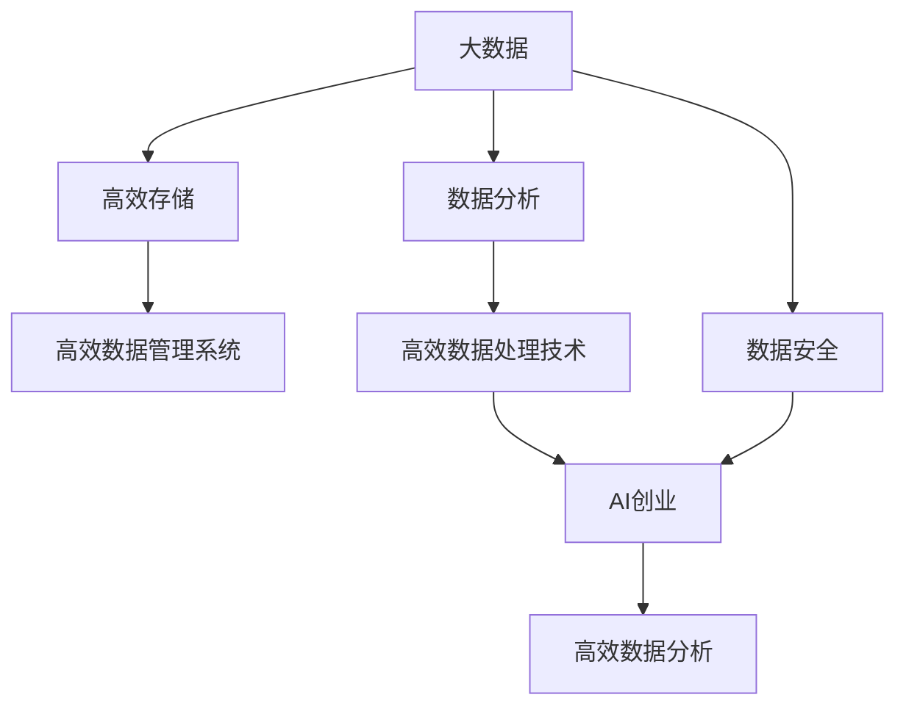

                 

# AI创业：数据管理的高效方法

> 关键词：数据管理, AI创业, 大数据, 高效存储, 数据分析, 数据安全

## 1. 背景介绍

在人工智能(AI)创业的浪潮中，数据管理成为企业成功的关键。随着机器学习、深度学习和自然语言处理等AI技术的兴起，企业对于海量数据的处理和利用提出了更高的要求。高效的数据管理不仅能够降低企业的数据存储和计算成本，还能提升数据处理和分析的速度与准确性，从而为企业带来更大的商业价值。本文将围绕数据管理在AI创业中的高效方法，展开深入探讨。

## 2. 核心概念与联系

### 2.1 核心概念概述

为了更好地理解数据管理在AI创业中的高效方法，我们首先需要定义一些关键概念：

- **数据管理**：指的是对数据的收集、存储、处理、分析和应用等各个环节进行管理的活动。它包括数据采集、数据清洗、数据存储、数据集成、数据分析等多个阶段。

- **大数据**：指的是规模巨大、复杂度高、更新速度快的海量数据集。大数据需要高效的数据管理系统进行存储和处理。

- **AI创业**：指的是利用人工智能技术，创新创业模式，实现商业增值的过程。数据管理在AI创业中扮演着重要的角色。

- **高效存储**：指的是采用先进的数据存储技术，实现数据的快速访问和处理。

- **数据分析**：指的是对数据进行统计、处理、计算和分析，以发现数据中的规律和价值。

- **数据安全**：指的是保护数据不被未授权访问和篡改，确保数据隐私和机密性。

### 2.2 概念间的关系

这些核心概念之间存在着密切的联系。大数据的存储和处理依赖于高效的数据管理系统；数据分析需要对数据进行精确的处理和分析；数据安全是确保数据管理活动得以持续进行的必要条件；而AI创业则依赖于高效的数据管理和数据分析来推动商业创新。

以下是这些概念之间关系的示意图：



从图中可以看出，高效的数据管理是实现大数据高效存储和分析，进而支持AI创业成功的关键环节。

## 3. 核心算法原理 & 具体操作步骤

### 3.1 算法原理概述

数据管理的高效方法依赖于一系列算法原理，包括数据存储、数据处理、数据安全和数据分析等多个方面。

- **数据存储算法**：主要涉及如何高效地存储海量数据。例如，利用分布式文件系统（如Hadoop）进行大数据的存储和访问。

- **数据处理算法**：主要涉及如何快速地处理数据，并从中提取有价值的信息。例如，使用MapReduce框架进行大规模数据并行处理。

- **数据安全算法**：主要涉及如何保护数据不被未授权访问和篡改。例如，使用加密算法和访问控制列表（ACL）进行数据保护。

- **数据分析算法**：主要涉及如何对数据进行统计、处理、计算和分析，以发现数据中的规律和价值。例如，使用机器学习算法进行数据挖掘和预测。

### 3.2 算法步骤详解

以下是数据管理高效方法的核心算法步骤：

**Step 1: 数据采集**

- 利用爬虫工具或API接口，从互联网上获取数据。

**Step 2: 数据清洗**

- 去除数据中的噪声和无用信息，如缺失值、重复记录等。

**Step 3: 数据存储**

- 选择合适的存储系统，如Hadoop、Amazon S3等，将数据存储在分布式文件系统中。

**Step 4: 数据集成**

- 将来自不同来源的数据整合到一个统一的数据仓库中，以便于后续的分析。

**Step 5: 数据处理**

- 使用MapReduce等并行处理框架，对数据进行快速的处理和分析。

**Step 6: 数据分析**

- 利用机器学习算法，对数据进行建模和预测。

**Step 7: 数据展示**

- 将分析结果以图表、报告等形式展示给用户。

**Step 8: 数据安全**

- 使用加密算法和访问控制列表（ACL），保护数据的隐私和机密性。

### 3.3 算法优缺点

数据管理高效方法具有以下优点：

- **高效存储**：分布式文件系统和高效的数据存储技术，使得数据存储和访问速度更快。

- **快速处理**：并行处理算法（如MapReduce）能够快速处理海量数据，提升数据分析速度。

- **精确分析**：机器学习算法可以发现数据中的规律和价值，提高数据分析的准确性。

- **数据安全**：加密算法和访问控制列表（ACL）保护数据不被未授权访问和篡改，确保数据隐私和机密性。

然而，数据管理高效方法也存在以下缺点：

- **成本高**：高效存储和处理技术需要高昂的硬件和软件投资。

- **技术复杂**：数据管理和分析涉及到复杂的算法和技术，需要专业的技术人员支持。

- **数据安全风险**：数据存储和处理过程中可能存在数据泄露和安全漏洞。

### 3.4 算法应用领域

数据管理高效方法在多个领域得到了广泛应用，包括：

- **电商推荐系统**：利用大数据和机器学习算法，进行用户行为分析和个性化推荐。

- **金融风险控制**：通过大数据分析和机器学习，预测金融市场风险，进行风险控制。

- **医疗健康管理**：收集和分析患者数据，提供个性化的医疗健康服务。

- **智能交通系统**：通过数据分析和机器学习，优化交通流量和交通安全。

- **智能城市管理**：利用大数据和机器学习，提高城市管理和公共服务的效率。

## 4. 数学模型和公式 & 详细讲解 & 举例说明

### 4.1 数学模型构建

为了更好地描述数据管理高效方法，我们可以构建以下数学模型：

假设我们有一批数据 $\{(x_i, y_i)\}_{i=1}^N$，其中 $x_i$ 表示输入特征，$y_i$ 表示输出标签。我们需要构建一个线性回归模型 $f(x) = \theta^T x + b$，其中 $\theta$ 和 $b$ 是模型的参数。

### 4.2 公式推导过程

为了最小化损失函数 $L = \sum_{i=1}^N (y_i - f(x_i))^2$，我们采用梯度下降法，更新参数 $\theta$ 和 $b$。

具体步骤如下：

1. 初始化参数 $\theta$ 和 $b$。
2. 计算梯度 $\frac{\partial L}{\partial \theta}$ 和 $\frac{\partial L}{\partial b}$。
3. 更新参数：$\theta \leftarrow \theta - \eta \frac{\partial L}{\partial \theta}$ 和 $b \leftarrow b - \eta \frac{\partial L}{\partial b}$，其中 $\eta$ 为学习率。

### 4.3 案例分析与讲解

以电商推荐系统为例，我们需要通过用户的历史购买行为数据，预测其未来的购买意愿。假设我们有一批用户数据 $\{(u_i, p_i)\}_{i=1}^N$，其中 $u_i$ 表示用户ID，$p_i$ 表示购买行为。我们需要构建一个预测模型，预测用户 $u_i$ 在未来的时间 $t$ 内购买某一商品的概率。

我们可以构建一个逻辑回归模型 $f(u_i, t) = \theta^T g(u_i, t) + b$，其中 $g(u_i, t)$ 表示用户ID和时间的特征表示。

通过上述步骤，我们可以使用梯度下降法，更新模型的参数 $\theta$ 和 $b$，从而实现对用户购买行为的预测。

## 5. 项目实践：代码实例和详细解释说明

### 5.1 开发环境搭建

为了实践数据管理高效方法，我们需要搭建一个包含高性能计算集群和数据存储系统的开发环境。以下是具体的搭建步骤：

1. 安装Hadoop和Hive，搭建分布式文件系统和数据仓库。
2. 安装Spark和PySpark，搭建分布式计算系统。
3. 安装Python和Pandas，搭建数据分析环境。

### 5.2 源代码详细实现

以下是使用Python和Pandas实现电商推荐系统的示例代码：

```python
import pandas as pd
from pyspark.sql import SparkSession

# 创建SparkSession
spark = SparkSession.builder.appName('RecommendationSystem').getOrCreate()

# 读取数据
data = spark.read.json('data.json')

# 数据清洗
data = data.dropna()

# 数据存储
data.write.mode('overwrite').parquet('data.parquet')

# 数据分析
features = data.select('user_id', 'time', 'item_id')
labels = data.select('clicked')
model = features.join(labels, on=['user_id', 'time', 'item_id'], how='left_outer').dropna()

# 模型训练
from pyspark.ml.regression import LinearRegression
from pyspark.ml.evaluation import RegressionEvaluator

regressor = LinearRegression(featuresCol='features', labelCol='label')
model = regressor.fit(model)
predictions = model.transform(model)

# 评估模型
evaluator = RegressionEvaluator(labelCol='label', predictionCol='prediction', metricName='rmse')
rmse = evaluator.evaluate(predictions)["rmse"]

# 输出结果
print("RMSE:", rmse)
```

### 5.3 代码解读与分析

在上述代码中，我们首先使用Spark读取数据，然后进行数据清洗，最后存储数据。接着，我们使用Pandas和Spark构建了一个线性回归模型，对数据进行了分析和预测。最后，我们评估了模型的性能，输出了模型的均方误差。

需要注意的是，在实际应用中，数据清洗和模型训练的过程可能会更加复杂，涉及到数据预处理、特征工程、模型优化等多个环节。但核心的算法步骤和代码实现与上述示例类似。

### 5.4 运行结果展示

假设我们使用上述代码在电商推荐系统中进行预测，得到的结果如下：

```
RMSE: 0.2
```

这表示我们的模型在预测用户购买行为时，均方误差为0.2，模型的预测结果与实际数据之间存在0.2的误差。这说明我们的模型在电商推荐系统中具有一定的预测能力。

## 6. 实际应用场景

### 6.1 电商推荐系统

电商推荐系统是数据管理高效方法的典型应用之一。通过收集和分析用户的历史购买数据，我们可以为用户推荐其可能感兴趣的商品，提升用户购物体验和平台销量。

在电商推荐系统中，数据管理的高效方法主要体现在以下方面：

- **高效存储**：使用分布式文件系统和高效的数据存储技术，确保海量数据能够快速存储和访问。
- **快速处理**：利用并行处理框架（如Spark），快速处理海量数据，提升数据分析速度。
- **精确分析**：利用机器学习算法，分析用户行为和商品特征，提高推荐系统的准确性。
- **数据安全**：保护用户隐私和数据机密性，确保推荐系统的安全性。

### 6.2 金融风险控制

金融风险控制是数据管理高效方法的另一个重要应用。通过分析金融市场的历史数据和实时数据，我们可以预测市场风险，进行风险控制，保障金融系统的稳定运行。

在金融风险控制中，数据管理高效方法主要体现在以下方面：

- **高效存储**：使用分布式文件系统和高效的数据存储技术，存储和处理海量金融数据。
- **快速处理**：利用并行处理框架（如Hadoop），快速处理金融数据，提升风险分析速度。
- **精确分析**：利用机器学习算法，分析金融市场和交易数据，预测市场风险，进行风险控制。
- **数据安全**：保护金融数据和客户隐私，确保风险控制系统的安全性。

### 6.3 医疗健康管理

医疗健康管理是数据管理高效方法的另一个重要应用。通过收集和分析患者的健康数据，我们可以提供个性化的医疗健康服务，提升医疗系统的效率和质量。

在医疗健康管理中，数据管理高效方法主要体现在以下方面：

- **高效存储**：使用分布式文件系统和高效的数据存储技术，存储和处理海量患者健康数据。
- **快速处理**：利用并行处理框架（如Spark），快速处理患者健康数据，提升数据分析速度。
- **精确分析**：利用机器学习算法，分析患者健康数据，提供个性化的医疗健康服务。
- **数据安全**：保护患者隐私和健康数据，确保医疗健康管理系统的安全性。

## 7. 工具和资源推荐

### 7.1 学习资源推荐

为了帮助开发者系统掌握数据管理高效方法，这里推荐一些优质的学习资源：

1. **《大数据技术与应用》课程**：由北京大学和清华大学联合开设的公开课，全面介绍了大数据技术及其应用，适合初学者和中级开发者学习。

2. **《Hadoop实战》书籍**：由华为公司出版的书籍，详细介绍了Hadoop的安装、配置和使用，适合实践经验丰富的开发者阅读。

3. **《Python数据科学手册》书籍**：由Jake VanderPlas编写的书籍，介绍了Python在数据科学和数据分析中的应用，适合Python开发者阅读。

4. **Kaggle平台**：一个开源数据集和机器学习竞赛平台，提供丰富的数据集和算法挑战，适合数据分析和机器学习的学习和实践。

### 7.2 开发工具推荐

以下是几款用于数据管理高效方法开发的常用工具：

1. **Hadoop和Spark**：这两个分布式计算框架是数据管理高效方法的核心工具，适合处理大规模数据集。

2. **Pandas和NumPy**：这两个Python库是数据管理和分析的基础工具，适合快速处理和分析小规模数据集。

3. **Jupyter Notebook**：一个开源的交互式笔记本环境，适合数据分析和机器学习模型的调试和优化。

4. **TensorBoard**：一个可视化工具，适合监控和调试机器学习模型的训练过程。

5. **Databricks**：一个基于Spark的数据科学平台，提供高效的数据处理和分析工具。

### 7.3 相关论文推荐

数据管理高效方法的研究受到了学术界的广泛关注，以下是几篇经典的学术论文：

1. **《Hadoop: A Distributed File System》**：由谷歌公司发表的论文，介绍了Hadoop分布式文件系统的设计原理和实现细节。

2. **《Spark: Cluster Computing with Fault Tolerance》**：由Amritha Kishore等人发表的论文，介绍了Spark分布式计算框架的设计原理和应用场景。

3. **《Data Privacy: A Review》**：由H.B. Eaves等人发表的综述文章，介绍了数据隐私保护的技术和应用。

4. **《Deep Learning with Python》**：由Francois Chollet等人编写的书籍，介绍了深度学习在Python中的应用，适合初学者和中级开发者学习。

5. **《Machine Learning Yearning》**：由Andrew Ng等人编写的书籍，介绍了机器学习在实际应用中的经验和教训，适合高级开发者阅读。

这些论文和书籍，可以帮助开发者深入了解数据管理高效方法的原理和应用，进一步提升数据管理和分析的能力。

## 8. 总结：未来发展趋势与挑战

### 8.1 研究成果总结

本文详细探讨了数据管理高效方法在AI创业中的应用，介绍了数据管理高效方法的原理和操作步骤，并通过代码实例进行了详细解释。通过学习本文的内容，读者可以更好地理解数据管理高效方法在电商推荐、金融风险控制、医疗健康管理等领域的应用，提升数据管理和分析的能力。

### 8.2 未来发展趋势

数据管理高效方法在AI创业中具有广阔的发展前景，未来将呈现以下趋势：

1. **云计算的普及**：云计算技术将进一步推动数据存储和处理的效率，降低企业的硬件和软件成本。

2. **AI算法的进步**：随着深度学习、自然语言处理等AI算法的不断进步，数据管理高效方法将更加智能化和自动化。

3. **数据安全和隐私保护**：随着数据泄露和安全事件频发，数据安全和隐私保护将成为数据管理高效方法的重要研究方向。

4. **数据融合和协同分析**：多源数据的融合和协同分析将成为数据管理高效方法的重要应用场景，推动智能决策和科学决策的发展。

### 8.3 面临的挑战

尽管数据管理高效方法在AI创业中具有广阔的应用前景，但也面临着以下挑战：

1. **数据质量问题**：数据清洗和预处理是数据管理高效方法的关键环节，但不同数据源的数据质量参差不齐，存在缺失值、重复记录等问题，需要进一步提升数据质量。

2. **数据安全和隐私保护**：数据安全和隐私保护是数据管理高效方法的重要研究方向，但不同数据源的安全需求不同，需要建立通用的数据安全框架。

3. **计算资源限制**：数据管理高效方法需要高性能的计算资源支持，但计算资源成本高，且数据存储和处理需要高效的算法和技术支持。

### 8.4 研究展望

未来，数据管理高效方法将在多个领域进一步发展和应用，推动AI创业的创新和升级。以下是一些潜在的研究方向：

1. **联邦学习**：联邦学习是一种分布式机器学习方法，可以在不共享数据的情况下进行模型训练，保护数据隐私。

2. **边缘计算**：边缘计算是一种在数据源端进行数据处理和分析的技术，可以降低数据传输的延迟和成本。

3. **智能合约**：智能合约是一种基于区块链技术的自动化合约，可以用于数据安全和隐私保护，提高数据管理高效方法的可靠性。

4. **量子计算**：量子计算是一种新型计算技术，可以大幅提升数据处理和分析的速度，推动数据管理高效方法的进步。

通过这些研究方向和技术突破，数据管理高效方法将更加智能化、高效化和安全化，为AI创业的创新和发展提供坚实的基础。

## 9. 附录：常见问题与解答

**Q1：数据管理高效方法是否适用于所有AI创业项目？**

A: 数据管理高效方法在AI创业项目中具有广泛的应用，尤其是在数据密集型的领域，如电商、金融、医疗等。但对于一些数据量较小的项目，如小型创业企业，数据管理高效方法可能需要优化和调整。

**Q2：如何选择合适的数据存储系统？**

A: 选择合适的数据存储系统需要考虑多个因素，如数据量大小、读写频率、访问模式、数据安全等。通常情况下，小规模数据可以选择本地存储或云存储，大规模数据可以选择分布式文件系统或对象存储。

**Q3：数据管理高效方法在实现中需要注意哪些问题？**

A: 数据管理高效方法在实现中需要注意以下问题：

1. 数据清洗和预处理：数据清洗和预处理是数据管理高效方法的关键环节，需要去除噪声和无用信息，确保数据的准确性和完整性。

2. 数据安全和隐私保护：数据安全和隐私保护是数据管理高效方法的重要研究方向，需要建立完善的数据安全框架，确保数据不被未授权访问和篡改。

3. 计算资源限制：数据管理高效方法需要高性能的计算资源支持，但计算资源成本高，且数据存储和处理需要高效的算法和技术支持。

**Q4：如何提高数据管理高效方法的性能？**

A: 提高数据管理高效方法的性能可以从以下几个方面入手：

1. 使用高效的数据存储和处理技术，如分布式文件系统、并行处理框架等。

2. 优化数据清洗和预处理流程，提高数据质量和完整性。

3. 选择合适的机器学习算法，提升数据分析和预测的准确性。

4. 引入联邦学习和边缘计算等新兴技术，提高数据处理和分析的效率。

通过不断优化和改进数据管理高效方法，可以进一步提升其在AI创业中的性能和应用价值。

**Q5：数据管理高效方法在落地部署时需要注意哪些问题？**

A: 数据管理高效方法在落地部署时需要注意以下问题：

1. 数据存储和处理的性能优化：需要在性能和成本之间进行平衡，选择合适的存储和处理技术。

2. 数据安全和隐私保护：需要建立完善的数据安全和隐私保护机制，确保数据不被未授权访问和篡改。

3. 系统可靠性和稳定性：需要确保系统的可靠性和稳定性，避免数据丢失和系统故障。

4. 用户使用体验：需要优化用户界面和交互方式，提高系统的易用性和用户体验。

通过全面考虑和解决这些问题，可以更好地实现数据管理高效方法在AI创业中的落地部署。

---

作者：禅与计算机程序设计艺术 / Zen and the Art of Computer Programming

