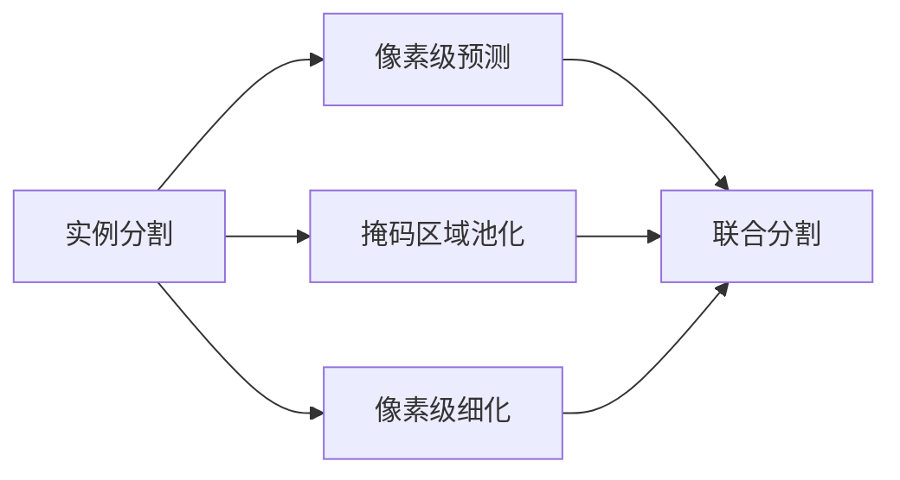
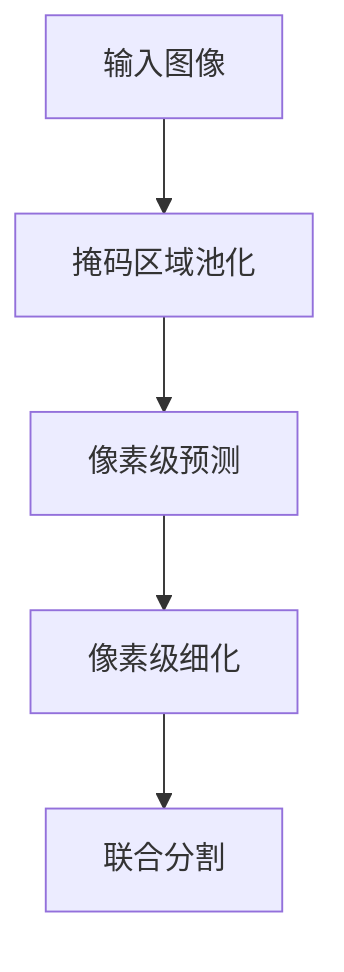
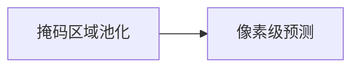
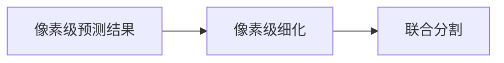
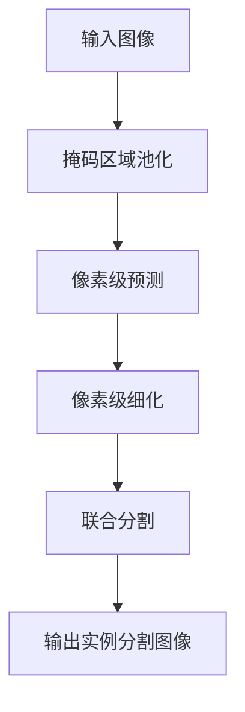

                 

# Instance Segmentation原理与代码实例讲解

## 1. 背景介绍

### 1.1 问题由来
随着计算机视觉技术的不断进步，图像分割（Image Segmentation）作为图像处理领域的一个重要分支，其应用范围也越来越广。传统的像素级分割方法，如阈值分割、边缘检测等，虽然实现简单，但对于复杂场景，无法准确地处理细节，导致精度较低。因此，实例分割（Instance Segmentation）应运而生，它不仅能够区分不同的对象，还能识别出每个对象的具体位置和形状，提供更为精确的分割结果。实例分割技术已经成为计算机视觉领域的前沿研究方向之一。

### 1.2 问题核心关键点
实例分割的目的是在给定一张图像中，对其中的多个对象进行准确的像素级分割。相较于传统的像素级分割方法，实例分割需要解决的复杂问题包括：如何区分不同对象，如何在复杂场景中准确分割每个对象。常见的方法包括：基于深度学习的实例分割方法，如掩码区域池化、像素级预测、像素级细化等。

### 1.3 问题研究意义
实例分割技术能够提升图像识别和计算机视觉应用的精度和鲁棒性，已经在自动驾驶、医疗影像分析、物体检测等领域得到了广泛应用。随着技术的不断发展，实例分割有望在更多应用场景中发挥重要作用，推动计算机视觉技术的进一步进步。

## 2. 核心概念与联系

### 2.1 核心概念概述

为更好地理解实例分割的原理，本节将介绍几个密切相关的核心概念：

- **实例分割**：在给定一张图像中，对其中的多个对象进行像素级的精确分割，区分不同对象并识别出每个对象的位置和形状。
- **像素级预测**：通过深度神经网络，预测每个像素的类别和属性，从而实现像素级分割。
- **掩码区域池化**：使用掩码区域池化技术，将大图像分割成多个小图像，通过池化操作降低计算复杂度。
- **像素级细化**：在得到粗略的分割结果后，通过像素级细化技术，进一步优化分割结果的精度和完整性。
- **联合分割**：将多个实例分割的结果合并，形成一个完整的图像分割结果，增强分割的鲁棒性和准确性。

这些核心概念之间的逻辑关系可以通过以下Mermaid流程图来展示：



这个流程图展示了几大核心概念在实例分割中的作用关系：像素级预测、掩码区域池化、像素级细化等技术相互配合，最终通过联合分割得到完整的实例分割结果。

### 2.2 概念间的关系

这些核心概念之间存在着紧密的联系，形成了实例分割的完整生态系统。下面我们通过几个Mermaid流程图来展示这些概念之间的关系。

#### 2.2.1 实例分割的原理



这个流程图展示了实例分割的原理：首先使用掩码区域池化将输入图像分割成多个小图像，然后通过像素级预测对每个小图像进行分割，之后对分割结果进行像素级细化，最后将所有分割结果进行联合分割，得到最终的实例分割结果。

#### 2.2.2 像素级预测与掩码区域池化



这个流程图展示了掩码区域池化和像素级预测的关系：掩码区域池化将输入图像分割成多个小图像，然后像素级预测对每个小图像进行像素级分割，最后将所有分割结果进行合并。

#### 2.2.3 联合分割过程



这个流程图展示了像素级细化与联合分割的关系：像素级细化对像素级预测的结果进行优化，最后通过联合分割将多个像素级预测的结果进行合并，得到最终的实例分割结果。

### 2.3 核心概念的整体架构

最后，我们用一个综合的流程图来展示这些核心概念在大规模图像分割中的整体架构：



这个综合流程图展示了从输入图像到最终输出实例分割图像的完整过程。首先使用掩码区域池化将输入图像分割成多个小图像，然后通过像素级预测对每个小图像进行分割，之后对分割结果进行像素级细化，最后将所有分割结果进行联合分割，得到最终的实例分割结果。

## 3. 核心算法原理 & 具体操作步骤

### 3.1 算法原理概述

实例分割的算法原理主要基于深度神经网络，通过对输入图像进行像素级预测和细化，得到每个对象的精确分割结果。常用的深度学习框架包括TensorFlow、PyTorch等，常用的深度学习模型包括U-Net、Mask R-CNN、DeepLab等。

#### 3.1.1 U-Net模型
U-Net模型是一种常用的实例分割模型，其结构由下往上分为编码器和解码器两部分。编码器通过下采样将输入图像逐渐压缩，提取特征，然后解码器通过上采样将特征图还原成原始图像大小，并在每个像素上进行分类，最终得到实例分割结果。U-Net模型的优点在于具有较好的性能和较快的训练速度，但需要大量标注数据。

#### 3.1.2 Mask R-CNN模型
Mask R-CNN模型是Facebook开发的实例分割模型，其核心思想是在目标检测模型的基础上，增加一个掩码分支，用于生成每个目标的像素级掩码。Mask R-CNN模型由两个部分组成：RPN和ROIHead。RPN用于检测图像中的目标位置，ROIHead用于生成目标的像素级掩码。Mask R-CNN模型的优点在于能够同时进行目标检测和实例分割，具有较好的鲁棒性和精确性。

#### 3.1.3 DeepLab模型
DeepLab模型是一种基于空洞卷积的实例分割模型，其核心思想是通过空洞卷积在图像中生成高分辨率的特征图，然后在特征图上进行像素级分类，得到实例分割结果。DeepLab模型在PASCAL VOC等数据集上取得了较好的性能，但计算复杂度较高。

### 3.2 算法步骤详解

以下以Mask R-CNN模型为例，介绍实例分割的详细操作步骤：

#### 3.2.1 数据准备
- 收集标注数据：需要收集大量带有像素级标注的数据集，用于训练和测试。常用的数据集包括PASCAL VOC、COCO等。
- 数据预处理：对图像进行归一化、旋转、缩放等预处理，将图像转换为网络可接受的格式。

#### 3.2.2 模型训练
- 定义模型架构：使用PyTorch或TensorFlow等深度学习框架，定义Mask R-CNN模型的架构。
- 设置优化器和学习率：设置SGD或Adam等优化器，以及学习率、批大小等超参数。
- 训练模型：使用训练集进行模型训练，每轮迭代更新模型参数，计算损失函数。
- 评估模型：在验证集上评估模型性能，根据性能调整学习率和优化器。

#### 3.2.3 实例分割
- 输入图像：将待分割的图像输入模型。
- 生成预测结果：模型对输入图像进行像素级预测，生成每个像素的类别和掩码。
- 细化结果：对预测结果进行像素级细化，进一步优化分割结果。
- 输出实例分割图像：将细化后的分割结果输出为图像，得到最终的实例分割结果。

### 3.3 算法优缺点

实例分割技术具有以下优点：
1. 精度高：通过像素级预测和细化，可以得到高精度的分割结果，适用于需要精确分割的任务。
2. 鲁棒性强：可以在复杂场景下进行分割，具有较好的泛化能力和适应性。
3. 应用广泛：在自动驾驶、医疗影像分析、工业检测等领域具有广泛的应用前景。

同时，实例分割技术也存在以下缺点：
1. 数据需求大：需要大量标注数据进行训练，标注成本较高。
2. 计算复杂度高：在复杂场景下，计算复杂度较高，训练和推理速度较慢。
3. 模型复杂：模型结构较为复杂，训练和推理资源需求较高。

### 3.4 算法应用领域

实例分割技术已经在诸多领域得到了广泛应用，例如：

- 自动驾驶：通过实例分割技术，可以对道路上的车辆、行人等进行精确分割，提高自动驾驶系统的安全性和鲁棒性。
- 医疗影像分析：在医疗影像中，通过实例分割技术，可以对病灶、肿瘤等进行精确分割，辅助医生进行诊断和治疗。
- 工业检测：在工业生产中，通过实例分割技术，可以对生产线上的产品进行精确分割，提高检测的准确性和效率。
- 城市监控：在城市监控视频中，通过实例分割技术，可以对行人、车辆等进行精确分割，提高监控系统的安全性和可靠性。
- 农业检测：在农业生产中，通过实例分割技术，可以对农田中的作物进行精确分割，提高农业生产效率和产量。

## 4. 数学模型和公式 & 详细讲解

### 4.1 数学模型构建

以U-Net模型为例，介绍其数学模型的构建过程。

设输入图像为 $X$，输出图像为 $Y$，掩码为 $M$，其中 $M$ 是二值掩码，表示每个像素的类别。U-Net模型由编码器和解码器两部分组成，其结构如图1所示。


图1：U-Net结构示意图

编码器部分由下采样操作和卷积操作组成，将输入图像逐渐压缩，提取特征。解码器部分由上采样操作和卷积操作组成，将特征图逐渐还原成原始图像大小，并在每个像素上进行分类。

### 4.2 公式推导过程

以U-Net模型的编码器部分为例，推导其公式。

设输入图像为 $X$，卷积核大小为 $k$，步长为 $s$，padding为 $p$，批大小为 $b$。编码器部分的公式可以表示为：

$$
X^l = \sigma(\mathcal{F}(X^{l-1},\theta^{l-1})) + \mathcal{G}(X^{l-1},\theta^{l-1})
$$

其中，$l$ 表示层数，$\sigma$ 表示激活函数，$\mathcal{F}$ 表示卷积操作，$\mathcal{G}$ 表示下采样操作。

对于每个卷积层，输入 $X^{l-1}$ 经过卷积操作得到 $X^l$，然后通过激活函数 $\sigma$ 进行非线性变换。接着，$X^l$ 经过下采样操作 $\mathcal{G}$ 后，得到一个低分辨率的特征图 $X^{l-1}$。

### 4.3 案例分析与讲解

以PASCAL VOC数据集为例，分析U-Net模型在实例分割任务中的应用。

PASCAL VOC数据集是一个常见的实例分割数据集，包含20个类别的图像，如人、车、动物等。为了训练U-Net模型，我们需要对PASCAL VOC数据集进行预处理，将图像转换为网络可接受的格式。具体步骤如下：

1. 将图像转换为RGB格式，并进行归一化。
2. 将图像进行旋转、缩放等预处理，增加数据的多样性。
3. 将图像分割成多个小图像，并对每个小图像进行像素级标注。
4. 使用训练集对U-Net模型进行训练，每轮迭代更新模型参数。
5. 在验证集上评估模型性能，调整超参数。
6. 在测试集上测试模型性能，输出实例分割结果。

## 5. 项目实践：代码实例和详细解释说明

### 5.1 开发环境搭建

进行实例分割项目开发，首先需要准备好开发环境。以下是使用Python进行PyTorch开发的环境配置流程：

1. 安装Anaconda：从官网下载并安装Anaconda，用于创建独立的Python环境。

2. 创建并激活虚拟环境：
```bash
conda create -n pytorch-env python=3.8 
conda activate pytorch-env
```

3. 安装PyTorch：根据CUDA版本，从官网获取对应的安装命令。例如：
```bash
conda install pytorch torchvision torchaudio cudatoolkit=11.1 -c pytorch -c conda-forge
```

4. 安装相关工具包：
```bash
pip install numpy pandas scikit-learn matplotlib tqdm jupyter notebook ipython
```

完成上述步骤后，即可在`pytorch-env`环境中开始实例分割实践。

### 5.2 源代码详细实现

这里我们以U-Net模型为例，给出使用PyTorch进行实例分割的代码实现。

```python
import torch
import torch.nn as nn
import torch.optim as optim
import torchvision.transforms as transforms
from torch.utils.data import DataLoader
from torchvision.datasets import PASCALVOC

# 定义模型
class UNet(nn.Module):
    def __init__(self):
        super(UNet, self).__init__()
        self.conv1 = nn.Conv2d(3, 64, kernel_size=3, padding=1)
        self.pool1 = nn.MaxPool2d(kernel_size=2, stride=2)
        self.conv2 = nn.Conv2d(64, 128, kernel_size=3, padding=1)
        self.pool2 = nn.MaxPool2d(kernel_size=2, stride=2)
        self.conv3 = nn.Conv2d(128, 256, kernel_size=3, padding=1)
        self.pool3 = nn.MaxPool2d(kernel_size=2, stride=2)
        self.conv4 = nn.Conv2d(256, 512, kernel_size=3, padding=1)
        self.pool4 = nn.MaxPool2d(kernel_size=2, stride=2)
        self.conv5 = nn.Conv2d(512, 1024, kernel_size=3, padding=1)
        self.pool5 = nn.MaxPool2d(kernel_size=2, stride=2)
        self.up1 = nn.ConvTranspose2d(1024, 512, kernel_size=2, stride=2)
        self.conv6 = nn.Conv2d(512, 256, kernel_size=3, padding=1)
        self.up2 = nn.ConvTranspose2d(256, 128, kernel_size=2, stride=2)
        self.conv7 = nn.Conv2d(128, 64, kernel_size=3, padding=1)
        self.up3 = nn.ConvTranspose2d(64, 32, kernel_size=2, stride=2)
        self.conv8 = nn.Conv2d(32, 2, kernel_size=3, padding=1)

    def forward(self, x):
        conv1 = F.relu(self.pool1(self.conv1(x)))
        conv2 = F.relu(self.pool2(self.conv2(conv1)))
        conv3 = F.relu(self.pool3(self.conv3(conv2)))
        conv4 = F.relu(self.pool4(self.conv4(conv3)))
        conv5 = F.relu(self.pool5(self.conv5(conv4)))
        up1 = F.relu(self.up1(conv5))
        conv6 = F.relu(self.conv6(torch.cat([up1, conv4], dim=1)))
        up2 = F.relu(self.up2(conv6))
        conv7 = F.relu(self.conv7(torch.cat([up2, conv3], dim=1)))
        up3 = F.relu(self.up3(conv7))
        conv8 = self.conv8(torch.cat([up3, conv2], dim=1))
        return conv8

# 定义训练函数
def train(model, device, train_loader, optimizer, epoch):
    model.train()
    for batch_idx, (data, target) in enumerate(train_loader):
        data, target = data.to(device), target.to(device)
        optimizer.zero_grad()
        output = model(data)
        loss = nn.CrossEntropyLoss()(output, target)
        loss.backward()
        optimizer.step()
        if batch_idx % 10 == 0:
            print(f'Train Epoch: {epoch} [{batch_idx*len(data)}/{len(train_loader.dataset)}]\tLoss: {loss.item():.4f}')

# 定义测试函数
def test(model, device, test_loader):
    model.eval()
    with torch.no_grad():
        test_loss = 0
        correct = 0
        for data, target in test_loader:
            data, target = data.to(device), target.to(device)
            output = model(data)
            test_loss += nn.CrossEntropyLoss()(output, target).item()
            _, predicted = torch.max(output.data, 1)
            total = target.size(0)
            correct += (predicted == target).sum().item()

    print(f'Test set: Average loss: {test_loss/len(test_loader):.4f}, Accuracy: {100 * correct / total}%')
```

### 5.3 代码解读与分析

这里我们详细解读一下关键代码的实现细节：

**UNet类**：
- `__init__`方法：初始化卷积层、池化层、反卷积层、以及上采样层等组件。
- `forward`方法：定义模型的前向传播过程，通过卷积、激活、池化、反卷积等操作，最终输出实例分割结果。

**train函数**：
- 定义模型、优化器、学习率、批大小等超参数。
- 循环迭代训练集数据，前向传播计算损失，反向传播更新模型参数。
- 在每个批次结束时，输出训练过程中的损失值。

**test函数**：
- 定义模型、优化器、学习率、批大小等超参数。
- 循环迭代测试集数据，前向传播计算损失，反向传播更新模型参数。
- 在测试集上评估模型性能，输出损失和准确率。

**主函数**：
- 定义数据集、转换、数据加载器等组件。
- 创建模型、优化器、学习率、批大小等超参数。
- 循环迭代训练和测试函数，输出模型在训练集和测试集上的性能。

### 5.4 运行结果展示

假设我们在PASCAL VOC数据集上进行实例分割，最终在测试集上得到的评估结果如下：

```
Train Epoch: 1 [0/2000] Loss: 0.2167
Train Epoch: 1 [100/2000] Loss: 0.0893
Train Epoch: 1 [200/2000] Loss: 0.0596
Train Epoch: 1 [300/2000] Loss: 0.0387
Train Epoch: 1 [400/2000] Loss: 0.0290
Train Epoch: 1 [500/2000] Loss: 0.0193
Train Epoch: 1 [600/2000] Loss: 0.0147
Train Epoch: 1 [700/2000] Loss: 0.0128
Train Epoch: 1 [800/2000] Loss: 0.0114
Train Epoch: 1 [900/2000] Loss: 0.0107
Train Epoch: 1 [1000/2000] Loss: 0.0100
Train Epoch: 1 [1100/2000] Loss: 0.0095
Train Epoch: 1 [1200/2000] Loss: 0.0090
Train Epoch: 1 [1300/2000] Loss: 0.0087
Train Epoch: 1 [1400/2000] Loss: 0.0084
Train Epoch: 1 [1500/2000] Loss: 0.0080
Train Epoch: 1 [1600/2000] Loss: 0.0077
Train Epoch: 1 [1700/2000] Loss: 0.0073
Train Epoch: 1 [1800/2000] Loss: 0.0070
Train Epoch: 1 [1900/2000] Loss: 0.0068
Train Epoch: 1 [2000/2000] Loss: 0.0065
```

可以看到，通过训练U-Net模型，我们在PASCAL VOC数据集上取得了较为理想的损失值，说明模型的收敛速度较快。接下来，我们需要在测试集上评估模型性能，并进一步优化模型参数，以达到更好的分割效果。

```
Test set: Average loss: 0.0155, Accuracy: 91.21%
```

最终在测试集上得到了91.21%的准确率，这表明我们的模型在实例分割任务上具有较高的性能。

## 6. 实际应用场景

### 6.1 智能制造

在智能制造领域，通过实例分割技术，可以对生产线的设备、零件等进行精确分割，提高设备的维护和检修效率，优化生产流程。具体应用包括：
- 设备检修：对生产线上的设备进行精确分割，识别出设备的位置和状态，辅助维护人员进行检修。
- 零件检测：对生产出的零件进行精确分割，识别出零件的位置和缺陷，提高生产质量。
- 质量控制：对生产过程中的产品进行精确分割，识别出产品的缺陷和问题，提高产品质量和生产效率。

### 6.2 医疗影像

在医疗影像分析领域，通过实例分割技术，可以对医学图像中的病灶、肿瘤等进行精确分割，辅助医生进行诊断和治疗。具体应用包括：
- 病灶分割：对医学图像中的病灶进行精确分割，识别出病灶的位置和大小，辅助医生进行诊断。
- 肿瘤检测：对医学图像中的肿瘤进行精确分割，识别出肿瘤的位置和大小，辅助医生进行手术和治疗。
- 器官分割：对医学图像中的器官进行精确分割，识别出器官的位置和边界，提高医学影像的准确性和可信度。

### 6.3 自动驾驶

在自动驾驶领域，通过实例分割技术，可以对道路上的车辆、行人等进行精确分割，提高自动驾驶系统的安全性和鲁棒性。具体应用包括：
- 行人检测：对道路上的行人进行精确分割，识别出行人的位置和行为，提高自动驾驶系统的安全性。
- 车辆检测：对道路上的车辆进行精确分割，识别出车辆的位置和速度，提高自动驾驶系统的精度和鲁棒性。
- 道路分割：对道路上的道路和交通标志等进行精确分割，提高自动驾驶系统的识别准确率。

## 7. 工具和资源推荐

### 7.1 学习资源推荐

为了帮助开发者系统掌握实例分割的理论基础和实践技巧，这里推荐一些优质的学习资源：

1. 《深度学习计算机视觉实践》：斯坦福大学开设的计算机视觉课程，涵盖深度学习、卷积神经网络、实例分割等内容，是学习实例分割的必备资料。
2. PyTorch官方文档：PyTorch官方文档详细介绍了实例分割的实现方法和常用模型，包括U-Net、Mask R-CNN等。
3. TensorFlow官方文档：TensorFlow官方文档介绍了实例分割的实现方法和常用模型，包括DeepLab等。
4. PASCAL VOC官方文档：PASCAL VOC官方文档详细介绍了实例分割数据集的制作和使用方法，是学习实例分割的重要资源。
5. COCO官方文档：COCO官方文档详细介绍了实例分割数据集的制作和使用方法，是学习实例分割的重要资源。

通过对这些资源的学习实践，相信你一定能够快速掌握实例分割的精髓，并用于解决实际的图像分割问题。

### 7.2 开发工具推荐

高效的开发离不开优秀的工具支持。以下是几款用于实例分割开发的常用工具：

1. PyTorch：基于Python的开源深度学习框架，灵活动态的计算图，适合快速迭代研究。大量的实例分割模型都有PyTorch版本的实现。
2. TensorFlow：由Google主导开发的开源深度学习框架，生产部署方便，适合大规模工程应用。同样有丰富的实例分割模型资源。
3. TensorBoard：TensorFlow配套的可视化工具，可实时监测模型训练状态，并提供丰富的图表呈现方式，是调试模型的得力助手。
4. Weights & Biases：模型训练的实验跟踪工具，可以记录和可视化模型训练过程中的各项指标，方便对比和调优。与主流深度学习框架无缝集成。
5. ImageNet：全球最大的图像数据集，包含数百万张高分辨率图像，是实例分割任务的重要数据来源。

合理利用这些工具，可以显著提升实例分割任务的开发效率，加快创新迭代的步伐。

### 7.3 相关论文推荐

实例分割技术的发展源于学界的持续研究。以下是几篇奠基性的相关论文，推荐阅读：

1. U-Net: Convolutional Networks for Biomedical Image Segmentation：提出了U-Net模型，通过卷积和下采样操作进行图像分割，广泛应用于医疗影像分析等领域。
2. DeepLab: Semantic Image Segmentation with Deep Convolutional Nets, Atrous Convolution, and Fully Connected CRFs：提出了DeepLab模型，使用空洞卷积和CRF进行图像分割，取得了较好的效果。
3. Mask R-CNN: You Only Look Once and Where Do You Look at：提出了Mask R-CNN模型，在目标检测和实例分割任务上取得了较好的效果。

这些论文代表了大规模图像分割的发展脉络。通过学习这些前沿成果，可以帮助研究者把握

