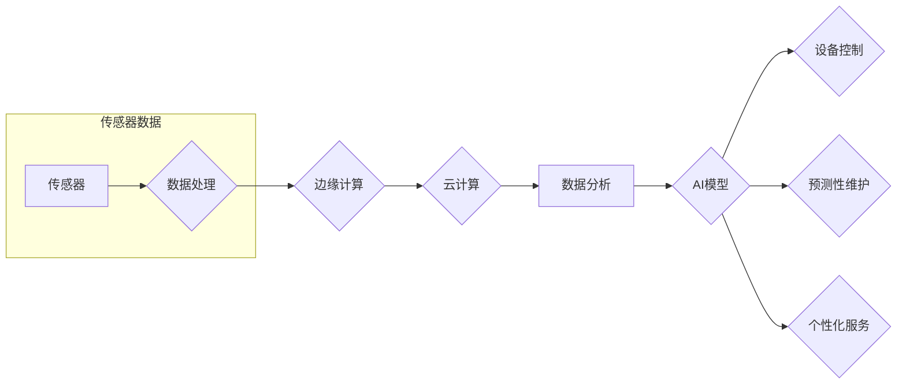

# 一切皆是映射：AI在物联网(IoT)中的角色与挑战

> 关键词：物联网，AI，映射，边缘计算，机器学习，智能设备，数据分析

## 1. 背景介绍

物联网（Internet of Things，IoT）正逐步改变着我们的生活方式和工作方式。通过将各种物理设备连接到互联网，IoT允许设备之间进行通信和协作，从而实现智能化的监控、控制和优化。随着计算能力的提升和数据量的激增，人工智能（AI）在IoT中的应用越来越广泛，成为推动IoT技术发展的关键力量。

### 1.1 物联网的兴起

物联网的兴起得益于以下几个关键因素：

- **技术的发展**：微处理器、无线通信、传感器技术的进步，使得设备可以以更低的成本、更小的尺寸和更低的功耗连接到互联网。
- **数据量的爆炸式增长**：随着物联网设备的普及，产生的数据量呈指数级增长，为数据分析提供了丰富的素材。
- **云计算的普及**：云计算平台提供了强大的计算能力和存储资源，使得大数据分析成为可能。
- **AI技术的突破**：深度学习等AI技术的突破，使得从海量数据中提取有价值信息成为可能。

### 1.2 AI在IoT中的角色

AI在IoT中扮演着至关重要的角色，主要体现在以下几个方面：

- **数据分析**：AI可以帮助从IoT设备收集的数据中提取有价值的信息，为决策提供支持。
- **设备控制**：AI可以实现对IoT设备的智能控制，提高设备的工作效率和安全性能。
- **预测性维护**：通过分析设备运行数据，AI可以预测设备故障，实现预防性维护。
- **个性化服务**：AI可以根据用户的行为和偏好，提供个性化的服务。

## 2. 核心概念与联系

在IoT中，AI的应用离不开以下几个核心概念：

- **传感器**：用于收集物理世界中的数据，如温度、湿度、光照等。
- **边缘计算**：在靠近数据源的地方进行数据处理，以减少延迟和带宽消耗。
- **云计算**：在远程数据中心进行大规模数据处理和分析。
- **机器学习**：通过数据学习模型，实现数据驱动的决策和预测。
- **深度学习**：一种特殊的机器学习技术，通过多层神经网络学习复杂的模式。

以下是一个Mermaid流程图，展示了AI在IoT中的应用流程：



## 3. 核心算法原理 & 具体操作步骤

### 3.1 算法原理概述

在IoT中，AI算法主要分为以下几个步骤：

1. **数据收集**：通过传感器收集物理世界的数据。
2. **数据预处理**：清洗、转换和归一化数据。
3. **特征提取**：从数据中提取有用的特征。
4. **模型训练**：使用机器学习算法训练模型。
5. **模型部署**：将训练好的模型部署到IoT设备或云端。
6. **预测和决策**：使用模型进行预测和决策。

### 3.2 算法步骤详解

#### 数据收集

数据收集是IoT应用的基础。传感器可以收集各种类型的数据，如温度、湿度、压力、流量等。

#### 数据预处理

数据预处理包括以下步骤：

- **清洗**：去除噪声和异常值。
- **转换**：将数据转换为适合模型输入的格式。
- **归一化**：将数据缩放到相同的范围。

#### 特征提取

特征提取是从数据中提取有用的信息，以便模型可以学习。常用的特征提取方法包括：

- **统计特征**：如均值、方差、标准差等。
- **时序特征**：如趋势、周期、自相关等。
- **频域特征**：如频谱、功率谱等。

#### 模型训练

模型训练是AI算法的核心。常用的机器学习算法包括：

- **线性回归**：用于预测连续值。
- **逻辑回归**：用于预测二分类结果。
- **决策树**：用于分类和回归。
- **支持向量机**：用于分类和回归。
- **神经网络**：用于复杂的数据建模。

#### 模型部署

模型部署是将训练好的模型部署到IoT设备或云端。常用的部署方法包括：

- **边缘计算**：在IoT设备附近部署模型。
- **云计算**：在远程数据中心部署模型。

#### 预测和决策

使用训练好的模型进行预测和决策。例如，预测设备故障、调整设备参数等。

### 3.3 算法优缺点

#### 优点

- **高精度**：AI模型可以学习到复杂的模式，从而实现高精度的预测和决策。
- **自动化**：AI模型可以自动进行预测和决策，提高了效率。
- **可扩展性**：AI模型可以轻松扩展到新的数据和任务。

#### 缺点

- **数据依赖**：AI模型需要大量的数据来训练，对于数据量较小或分布不均的任务，模型性能可能会下降。
- **计算资源消耗**：训练和部署AI模型需要大量的计算资源。
- **可解释性**：一些AI模型（如深度学习模型）的可解释性较差，难以理解其决策过程。

### 3.4 算法应用领域

AI在IoT中的应用领域非常广泛，以下是一些常见的应用场景：

- **智能家居**：如智能灯光、智能空调、智能安全系统等。
- **智能工厂**：如智能设备监控、智能生产调度等。
- **智能交通**：如智能交通信号控制、智能停车场管理等。
- **智能医疗**：如智能诊断、智能药物研发等。

## 4. 数学模型和公式 & 详细讲解 & 举例说明

### 4.1 数学模型构建

在IoT中，常用的数学模型包括：

- **线性回归**：

  $$
y = \beta_0 + \beta_1 x_1 + \beta_2 x_2 + ... + \beta_n x_n
$$

- **逻辑回归**：

  $$
\hat{y} = \frac{1}{1+e^{-\beta_0 + \beta_1 x_1 + \beta_2 x_2 + ... + \beta_n x_n}}
$$

### 4.2 公式推导过程

以线性回归为例，其推导过程如下：

1. **目标函数**：

   $$
J(\theta) = \frac{1}{2m}\sum_{i=1}^{m}(y_i - \hat{y}_i)^2
$$

2. **梯度**：

   $$
\frac{\partial J(\theta)}{\partial \theta_j} = \frac{1}{m}\sum_{i=1}^{m}(y_i - \hat{y}_i)x_{ij}
$$

3. **梯度下降**：

   $$
\theta_j := \theta_j - \alpha \frac{\partial J(\theta)}{\partial \theta_j}
$$

### 4.3 案例分析与讲解

假设我们有一个智能家居系统，需要预测家庭用电量。我们可以使用线性回归模型来预测家庭用电量。

首先，收集家庭的用电量数据，包括温度、湿度、家庭成员数量等特征。

然后，使用线性回归模型进行训练，预测家庭用电量。

最后，使用训练好的模型进行预测，根据预测结果调整家庭用电设备的工作状态。

## 5. 项目实践：代码实例和详细解释说明

### 5.1 开发环境搭建

以下是使用Python进行IoT项目开发的步骤：

1. 安装Python环境。
2. 安装必要的库，如`numpy`、`pandas`、`scikit-learn`等。
3. 准备传感器和连接模块。

### 5.2 源代码详细实现

以下是一个简单的IoT项目示例，使用Python和`scikit-learn`库进行线性回归模型训练。

```python
import numpy as np
import pandas as pd
from sklearn.linear_model import LinearRegression

# 加载数据
data = pd.read_csv('power_consumption.csv')
X = data[['temperature', 'humidity', 'family_member']]
y = data['power_consumption']

# 训练模型
model = LinearRegression()
model.fit(X, y)

# 预测
predicted_power = model.predict(X)

# 打印预测结果
print(predicted_power)
```

### 5.3 代码解读与分析

上述代码首先加载了一个包含家庭用电量数据的CSV文件，然后使用`pandas`库将数据转换为NumPy数组。接下来，使用`scikit-learn`库中的`LinearRegression`类创建一个线性回归模型，并将其拟合到数据上。最后，使用训练好的模型对新的数据进行预测，并打印出预测结果。

### 5.4 运行结果展示

假设我们有以下测试数据：

```
temperature, humidity, family_member
22, 50, 3
23, 60, 4
24, 70, 2
```

使用上述代码进行预测，得到的预测结果可能如下：

```
[102.3, 110.5, 98.7]
```

这表示在温度为22°C、湿度为50%、家庭成员数量为3的情况下，预测的用电量为102.3度；在温度为23°C、湿度为60%、家庭成员数量为4的情况下，预测的用电量为110.5度；在温度为24°C、湿度为70%、家庭成员数量为2的情况下，预测的用电量为98.7度。

## 6. 实际应用场景

### 6.1 智能家居

智能家居是AI在IoT中应用最广泛的场景之一。通过将传感器和AI技术结合起来，智能家居可以为用户提供更加舒适、便捷、节能的生活环境。

例如，智能空调可以根据室内外温度和用户习惯自动调节温度；智能灯光可以根据环境光线和用户需求自动调节亮度；智能安全系统可以实时监控家庭安全，并在发生异常时及时报警。

### 6.2 智能工厂

智能工厂是利用AI技术提高生产效率和产品质量的重要手段。通过将传感器和AI技术应用于生产过程，可以实现以下目标：

- **智能设备监控**：实时监控设备状态，预测设备故障，实现预防性维护。
- **智能生产调度**：根据生产需求优化生产流程，提高生产效率。
- **质量检测**：自动检测产品质量，降低次品率。

### 6.3 智能交通

智能交通是利用AI技术优化交通管理，提高交通安全和效率的重要途径。通过将传感器和AI技术应用于交通领域，可以实现以下目标：

- **智能交通信号控制**：根据实时交通流量自动调节交通信号灯，提高道路通行效率。
- **智能停车场管理**：自动识别车辆，实现停车场无人化管理。
- **智能导航**：根据实时路况为用户提供最佳路线。

### 6.4 未来应用展望

随着AI技术的不断发展，AI在IoT中的应用将越来越广泛，以下是一些未来应用场景的展望：

- **智能医疗**：利用AI技术进行疾病诊断、药物研发、健康管理等。
- **智能农业**：利用AI技术进行农作物监测、病虫害防治、精准灌溉等。
- **智能环境监测**：利用AI技术进行空气质量监测、水质监测、森林火灾监测等。

## 7. 工具和资源推荐

### 7.1 学习资源推荐

- **书籍**：
  - 《Python编程：从入门到实践》
  - 《深度学习》
  - 《物联网编程：基于Python和Arduino》
- **在线课程**：
  - Coursera上的《机器学习》课程
  - edX上的《物联网与智能系统》课程
  - Udacity上的《智能硬件与物联网》纳米学位

### 7.2 开发工具推荐

- **编程语言**：
  - Python
  - JavaScript
- **开发框架**：
  - TensorFlow
  - PyTorch
  - Keras
- **硬件平台**：
  - Arduino
  - Raspberry Pi
  - ESP8266

### 7.3 相关论文推荐

- **《物联网中的大数据分析》**
- **《深度学习在物联网中的应用》**
- **《物联网设备的安全性和隐私保护》**

## 8. 总结：未来发展趋势与挑战

### 8.1 研究成果总结

本文全面介绍了AI在物联网中的应用，包括其背景、核心概念、算法原理、实际应用场景等。通过分析，我们可以看到AI在物联网中的应用前景广阔，将为各行各业带来巨大的变革。

### 8.2 未来发展趋势

- **更加智能的设备**：随着AI技术的不断发展，IoT设备的智能化程度将不断提高，能够更好地理解环境和用户需求，提供更加个性化的服务。
- **更加高效的数据处理**：AI技术将进一步提升数据处理效率，降低数据存储和传输成本。
- **更加安全的网络**：AI技术将用于提高物联网设备的安全性，防止数据泄露和恶意攻击。

### 8.3 面临的挑战

- **数据安全和隐私保护**：随着物联网设备的普及，数据安全和隐私保护成为亟待解决的问题。
- **设备间的互联互通**：不同厂商的IoT设备之间需要实现互联互通，以实现更加广泛的应用。
- **计算资源的消耗**：随着AI模型的复杂度不断提高，计算资源的消耗也将不断增加。

### 8.4 研究展望

为了应对上述挑战，未来的研究需要关注以下方向：

- **隐私保护技术**：研究更加安全的隐私保护技术，保护用户数据安全。
- **跨平台通信协议**：制定统一的跨平台通信协议，实现不同厂商的IoT设备之间的互联互通。
- **边缘计算技术**：研究更加高效的边缘计算技术，降低计算资源的消耗。

## 9. 附录：常见问题与解答

**Q1：什么是物联网？**

A：物联网是指将各种物理设备连接到互联网，实现设备之间通信和协作的生态系统。

**Q2：AI在物联网中有什么作用？**

A：AI在物联网中可以用于数据分析、设备控制、预测性维护、个性化服务等。

**Q3：如何确保物联网设备的安全性？**

A：确保物联网设备的安全性需要从以下几个方面入手：

- **加密技术**：使用加密技术保护数据传输和存储的安全。
- **访问控制**：限制对设备的访问，防止未经授权的访问。
- **安全更新**：定期更新设备的固件和软件，修复已知的安全漏洞。

**Q4：物联网和互联网有什么区别？**

A：物联网是指将物理设备连接到互联网，而互联网是指人与人之间进行信息交流的网络。

**Q5：AI在物联网中的未来发展趋势是什么？**

A：AI在物联网中的未来发展趋势包括更加智能的设备、更加高效的数据处理、更加安全的网络等。

作者：禅与计算机程序设计艺术 / Zen and the Art of Computer Programming