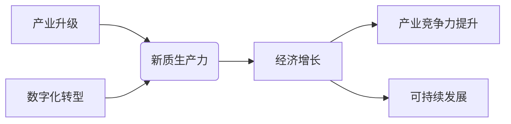

# 产业转型升级与新质生产力的推动

> 关键词：产业升级，新质生产力，数字化转型，人工智能，物联网，大数据，云计算，智能化，可持续发展

## 1. 背景介绍

在全球经济一体化的浪潮中，传统产业面临着转型升级的迫切需求。随着信息技术的飞速发展，以人工智能、物联网、大数据、云计算等为代表的新质生产力正在逐步改变着产业格局，推动着产业从传统的劳动密集型向智能化、自动化、绿色化方向发展。本文将深入探讨产业转型升级与新质生产力的推动作用，分析其背后的核心原理和操作步骤，并展望未来发展趋势与挑战。

### 1.1 问题的由来

当前，全球经济发展进入新常态，传统产业面临着以下挑战：

- 产业结构不合理，产能过剩问题突出。
- 技术创新能力不足，产品附加值低。
- 资源环境约束加剧，可持续发展压力增大。
- 劳动力成本上升，比较优势减弱。

为了应对这些挑战，产业转型升级成为必然趋势。而新质生产力作为推动产业升级的重要引擎，正逐渐改变着传统产业的生存和发展方式。

### 1.2 研究现状

近年来，各国政府和企业纷纷加大投入，推动产业转型升级。在技术创新、人才培养、产业布局等方面取得了一系列成果。以下是一些典型的案例：

- 中国：提出“中国制造2025”战略，推动制造业转型升级。
- 美国：实施“工业互联网”计划，推动制造业与互联网深度融合。
- 德国：提出“工业4.0”战略，推动制造业向智能化、网络化方向发展。

### 1.3 研究意义

研究产业转型升级与新质生产力的推动作用，对于实现以下目标具有重要意义：

- 提升产业竞争力，增强国际市场地位。
- 促进经济结构调整，实现可持续发展。
- 创新经济增长模式，培育新的经济增长点。
- 改善人民生活质量，促进社会和谐发展。

### 1.4 本文结构

本文将从以下方面展开论述：

- 核心概念与联系
- 核心算法原理与操作步骤
- 数学模型与公式
- 项目实践
- 实际应用场景
- 工具和资源推荐
- 总结：未来发展趋势与挑战

## 2. 核心概念与联系

### 2.1 核心概念

#### 2.1.1 产业升级

产业升级是指通过技术创新、产业组织优化、产业链完善等手段，提升产业整体竞争力，实现产业结构优化和产业素质提高的过程。

#### 2.1.2 新质生产力

新质生产力是指以人工智能、物联网、大数据、云计算等为代表的技术创新，为经济发展注入新的活力，推动产业升级和经济增长。

#### 2.1.3 数字化转型

数字化转型是指企业通过数字化技术改造传统业务流程，提升运营效率，创造新的商业模式。

### 2.2 核心概念联系



如图所示，产业升级、新质生产力、数字化转型三者相互关联，共同推动经济增长和产业竞争力的提升，实现可持续发展。

## 3. 核心算法原理 & 具体操作步骤

### 3.1 算法原理概述

产业转型升级与新质生产力的推动，主要依赖于以下几个核心算法原理：

- 人工智能算法：包括机器学习、深度学习等，用于数据分析、智能决策、自动化控制等。
- 物联网算法：包括边缘计算、云计算等，用于设备互联、数据采集、远程监控等。
- 大数据分析算法：包括数据挖掘、预测分析等，用于业务洞察、风险控制、精准营销等。
- 云计算算法：包括分布式计算、虚拟化技术等，用于资源调度、负载均衡、弹性伸缩等。

### 3.2 算法步骤详解

#### 3.2.1 人工智能算法

1. 数据采集：收集企业内部和外部的各类数据，包括结构化数据、非结构化数据等。
2. 数据预处理：对采集到的数据进行清洗、去噪、标准化等处理，提高数据质量。
3. 模型选择：根据具体任务选择合适的机器学习或深度学习模型。
4. 模型训练：使用标注数据进行模型训练，不断优化模型参数。
5. 模型评估：使用测试集评估模型性能，调整模型结构或参数。

#### 3.2.2 物联网算法

1. 设备接入：将各类传感器、控制器等设备接入物联网平台。
2. 数据采集：实时采集设备运行数据，包括温度、湿度、压力等。
3. 数据处理：对采集到的数据进行预处理，包括数据过滤、压缩、加密等。
4. 数据传输：将处理后的数据传输到云端或边缘计算平台。
5. 数据分析：对传输过来的数据进行实时分析，实现远程监控、故障诊断等功能。

#### 3.2.3 大数据分析算法

1. 数据集成：将来自不同来源的数据进行整合，形成统一的数据仓库。
2. 数据挖掘：使用数据挖掘技术，从海量数据中挖掘出有价值的信息。
3. 预测分析：基于历史数据，对未来趋势进行预测分析。
4. 业务洞察：根据数据分析结果，为企业决策提供支持。
5. 风险控制：通过风险分析，制定相应的风险控制措施。

#### 3.2.4 云计算算法

1. 资源规划：根据业务需求，规划计算、存储、网络等资源。
2. 虚拟化技术：将物理资源虚拟化，提高资源利用率。
3. 负载均衡：将请求均匀分配到不同的虚拟机或服务器，保证系统稳定性。
4. 弹性伸缩：根据业务负载动态调整资源规模，提高系统性能。
5. 安全保障：采用安全机制，确保数据和系统安全。

### 3.3 算法优缺点

#### 3.3.1 人工智能算法

优点：
- 自主学习和适应能力强。
- 高效处理大量数据。
- 降低人力成本。

缺点：
- 模型复杂度高，训练成本高。
- 难以解释模型的决策过程。

#### 3.3.2 物联网算法

优点：
- 实时性强，响应速度快。
- 系统可靠性高。
- 降低了人力成本。

缺点：
- 硬件设备成本高。
- 数据传输带宽要求高。

#### 3.3.3 大数据分析算法

优点：
- 丰富的数据分析工具。
- 提高决策效率。

缺点：
- 数据质量要求高。
- 分析结果难以解释。

#### 3.3.4 云计算算法

优点：
- 资源利用率高。
- 弹性伸缩能力强。

缺点：
- 系统安全性要求高。
- 成本较高。

### 3.4 算法应用领域

#### 3.4.1 人工智能算法

- 智能制造：生产流程自动化、质量控制、智能决策等。
- 金融科技：风险控制、欺诈检测、智能投顾等。
- 医疗健康：疾病诊断、药物研发、健康管理等。

#### 3.4.2 物联网算法

- 智能交通：智能交通信号、智能停车、车联网等。
- 智能家居：智能家电、智能安防、家庭娱乐等。
- 工业互联网：设备运维、供应链管理、远程监控等。

#### 3.4.3 大数据分析算法

- 消费者行为分析：精准营销、客户关系管理、需求预测等。
- 市场营销：市场趋势分析、竞争分析、品牌管理等。
- 供应链管理：库存优化、物流优化、风险管理等。

#### 3.4.4 云计算算法

- 企业应用：企业资源规划、客户关系管理、办公自动化等。
- 在线教育：在线课堂、在线考试、学习社区等。
- 在线娱乐：游戏、视频、音乐等。

## 4. 数学模型和公式 & 详细讲解 & 举例说明

### 4.1 数学模型构建

产业转型升级与新质生产力的推动涉及多个数学模型，以下列举几个典型模型：

#### 4.1.1 机器学习模型

- 线性回归模型：用于预测连续值。

$$
y = \beta_0 + \beta_1x_1 + \beta_2x_2 + ... + \beta_nx_n + \epsilon
$$

- 逻辑回归模型：用于预测离散值（如二分类）。

$$
P(y=1) = \frac{1}{1+e^{-(\beta_0 + \beta_1x_1 + \beta_2x_2 + ... + \beta_nx_n)}}
$$

- 支持向量机(SVM)模型：用于分类和回归。

$$
w \cdot x + b = 0
$$

- 深度学习模型：包括卷积神经网络(CNN)、循环神经网络(RNN)等。

#### 4.1.2 物联网模型

- 传感器模型：用于描述传感器数据采集和处理过程。

$$
y = f(x)
$$

- 通信模型：用于描述数据传输过程。

$$
P = G \cdot H
$$

#### 4.1.3 大数据分析模型

- 聚类分析模型：用于数据分类。

$$
C = \{C_1, C_2, ..., C_k\}
$$

- 联合分析模型：用于关联规则挖掘。

$$
R \subseteq U \times U
$$

### 4.2 公式推导过程

由于篇幅限制，此处仅以线性回归模型为例，介绍公式推导过程。

#### 4.2.1 最小二乘法

线性回归模型的目标是最小化预测值与真实值之间的误差平方和。

$$
S = \sum_{i=1}^n (y_i - \hat{y}_i)^2
$$

其中，$y_i$ 为真实值，$\hat{y}_i$ 为预测值。

#### 4.2.2 梯度下降法

梯度下降法是一种优化算法，用于求解最小化目标函数的参数。

$$
\theta \leftarrow \theta - \alpha \nabla_{\theta}S
$$

其中，$\alpha$ 为学习率。

#### 4.2.3 公式推导

根据最小二乘法，可以得到误差平方和的导数：

$$
\nabla_{\theta}S = 2X^T(X\theta - y)
$$

其中，$X$ 为设计矩阵，$y$ 为真实值向量。

根据梯度下降法，可以得到参数更新公式：

$$
\theta \leftarrow \theta - \alpha X^T(X\theta - y)
$$

通过迭代更新参数，直至达到收敛条件。

### 4.3 案例分析与讲解

#### 4.3.1 人工智能案例分析

假设我们要预测一家电商平台的商品销量，使用线性回归模型进行分析。

- 数据集：包含商品ID、价格、广告点击量、季节等特征，以及对应的销量数据。
- 特征工程：对数据进行预处理，包括缺失值填充、异常值处理、特征编码等。
- 模型选择：选择线性回归模型作为预测模型。
- 模型训练：使用梯度下降法训练模型参数。
- 模型评估：使用测试集评估模型性能，调整模型参数。

#### 4.3.2 物联网案例分析

假设我们要监测一家工厂的设备运行状态，使用物联网技术进行实时监控。

- 设备接入：将传感器、控制器等设备接入物联网平台。
- 数据采集：实时采集设备运行数据，包括温度、湿度、压力等。
- 数据处理：对采集到的数据进行预处理，包括数据过滤、压缩、加密等。
- 数据传输：将处理后的数据传输到云端或边缘计算平台。
- 数据分析：对传输过来的数据进行实时分析，实现远程监控、故障诊断等功能。

#### 4.3.3 大数据分析案例分析

假设我们要分析一家企业的客户流失情况，使用大数据分析技术进行挖掘。

- 数据集成：将来自不同来源的客户数据、交易数据、社交媒体数据等进行整合，形成统一的数据仓库。
- 数据挖掘：使用聚类分析、关联规则挖掘等技术，从数据中挖掘出有价值的信息。
- 业务洞察：根据数据分析结果，制定相应的客户关系管理策略，降低客户流失率。

## 5. 项目实践：代码实例和详细解释说明

### 5.1 开发环境搭建

为了演示产业转型升级与新质生产力的推动，以下以Python编程语言为例，介绍相关开发环境搭建过程。

1. 安装Python：从Python官网下载并安装Python 3.8版本。
2. 安装pip：使用pip安装Python包管理工具。
3. 安装相关库：使用pip安装以下库：numpy、pandas、matplotlib、sklearn、scikit-learn、tensorflow、pytorch等。

### 5.2 源代码详细实现

以下以一个简单的线性回归模型为例，展示Python代码实现过程。

```python
import numpy as np
import matplotlib.pyplot as plt

# 数据生成
np.random.seed(0)
x = np.random.rand(100)
y = 1.5 * x + 0.2 * np.random.randn(100)
x = x.reshape(-1, 1)

# 模型
class LinearRegression:
    def __init__(self):
        self.w = None
        self.b = None

    def fit(self, x, y):
        X_b = np.c_[np.ones((x.shape[0], 1)), x]
        self.w = np.linalg.lstsq(X_b, y, rcond=None)[0]
        self.b = self.w[0]

    def predict(self, x):
        X_b = np.c_[np.ones((x.shape[0], 1)), x]
        return X_b.dot(self.w)

# 训练模型
model = LinearRegression()
model.fit(x, y)

# 可视化
plt.scatter(x, y)
plt.plot(x, model.predict(x), color='red')
plt.show()
```

### 5.3 代码解读与分析

- `import numpy as np`：导入NumPy库，用于矩阵运算。
- `import matplotlib.pyplot as plt`：导入matplotlib库，用于数据可视化。
- `np.random.seed(0)`：设置随机种子，保证实验结果可复现。
- `x = np.random.rand(100)`：生成100个随机数据作为自变量。
- `y = 1.5 * x + 0.2 * np.random.randn(100)`：生成线性关系的数据作为因变量。
- `x = x.reshape(-1, 1)`：将自变量 reshape 成二维数组，方便矩阵运算。
- `class LinearRegression`：定义线性回归模型类。
- `def __init__(self)`：初始化模型参数。
- `def fit(self, x, y)`：训练模型参数。
- `X_b = np.c_[np.ones((x.shape[0], 1)), x]`：在自变量前添加一列全为1的列，实现偏置项。
- `self.w = np.linalg.lstsq(X_b, y, rcond=None)[0]`：使用最小二乘法求解参数。
- `self.b = self.w[0]`：获取偏置项。
- `def predict(self, x)`：预测因变量。
- `plt.scatter(x, y)`：绘制散点图。
- `plt.plot(x, model.predict(x), color='red')`：绘制拟合曲线。
- `plt.show()`：显示图形。

通过以上代码，我们可以看到，使用Python和线性回归模型进行数据处理和可视化是非常简单高效的。

### 5.4 运行结果展示

运行上述代码后，将生成一个散点图和一条拟合曲线，展示了数据与线性关系。

## 6. 实际应用场景

### 6.1 人工智能应用场景

#### 6.1.1 智能制造

智能制造是产业转型升级的重要方向之一。通过人工智能技术，可以实现以下应用：

- 智能生产：实现生产过程的自动化、智能化，提高生产效率和产品质量。
- 智能检测：实时监测设备运行状态，预防故障，降低维修成本。
- 智能决策：基于历史数据，为企业决策提供支持，降低决策风险。

#### 6.1.2 金融科技

金融科技是金融行业转型升级的重要途径。通过人工智能技术，可以实现以下应用：

- 智能风控：实时监测交易行为，识别潜在风险，降低欺诈损失。
- 智能客服：提供24小时在线客服，提高客户满意度。
- 智能投顾：根据用户风险偏好，提供个性化投资建议。

### 6.2 物联网应用场景

#### 6.2.1 智能交通

智能交通是智慧城市建设的重要组成部分。通过物联网技术，可以实现以下应用：

- 智能交通信号：根据实时交通流量，优化信号灯控制，缓解交通拥堵。
- 智能停车：提供实时停车信息，方便驾驶员快速找到停车位。
- 车联网：实现车辆与车辆、车辆与基础设施之间的互联互通，提高交通安全和效率。

#### 6.2.2 智能家居

智能家居是人们生活品质提升的重要途径。通过物联网技术，可以实现以下应用：

- 智能家电：实现家电之间的互联互通，方便用户远程控制。
- 智能安防：实时监测家庭安全，预防盗窃、火灾等事故。
- 智能健康管理：监测用户健康状况，提供个性化健康管理方案。

### 6.3 大数据应用场景

#### 6.3.1 智能医疗

智能医疗是医疗行业转型升级的重要方向。通过大数据技术，可以实现以下应用：

- 智能诊断：辅助医生进行疾病诊断，提高诊断准确率。
- 智能药物研发：基于海量数据，加速新药研发进程。
- 智能健康管理：提供个性化健康管理方案，预防疾病发生。

#### 6.3.2 智慧城市

智慧城市是城市现代化建设的重要目标。通过大数据技术，可以实现以下应用：

- 智能交通：优化交通信号控制，缓解交通拥堵。
- 智能环保：实时监测环境质量，提高环境保护水平。
- 智能安防：保障城市安全，预防和打击犯罪。

### 6.4 未来应用展望

随着新质生产力的不断发展，未来产业转型升级与新质生产力的推动将在以下方面取得更大进展：

1. 智能化生产：通过人工智能、物联网、大数据等技术，实现生产过程的智能化、自动化。
2. 网络化协同：通过云计算、大数据等技术，实现产业链上下游企业之间的协同创新。
3. 绿色化发展：通过节能减排、循环利用等技术，实现可持续发展。
4. 个性化定制：通过大数据、人工智能等技术，满足消费者个性化需求。
5. 智慧化治理：通过大数据、云计算等技术，提升政府治理能力和水平。

## 7. 工具和资源推荐

### 7.1 学习资源推荐

以下是一些学习产业转型升级与新质生产力的优质资源：

- 《人工智能：一种现代的方法》
- 《大数据时代：生活、工作与思维的大变革》
- 《云原生应用架构设计》
- 《智慧城市：构建面向未来的城市基础设施》

### 7.2 开发工具推荐

以下是一些用于开发产业转型升级与新质生产力应用的相关工具：

- Python编程语言
- TensorFlow、PyTorch等深度学习框架
- Hadoop、Spark等大数据处理平台
- Kubernetes等容器化平台
- OpenStack等云计算平台

### 7.3 相关论文推荐

以下是一些与产业转型升级与新质生产力相关的经典论文：

- 《工业4.0：制造业的第四次工业革命》
- 《智慧城市：构建面向未来的城市基础设施》
- 《人工智能：一种现代的方法》
- 《大数据时代：生活、工作与思维的大变革》

## 8. 总结：未来发展趋势与挑战

### 8.1 研究成果总结

本文对产业转型升级与新质生产力的推动进行了全面系统的介绍，分析了其核心原理、操作步骤、应用场景和发展趋势，并探讨了面临的挑战。

### 8.2 未来发展趋势

未来，产业转型升级与新质生产力的推动将呈现以下发展趋势：

1. 人工智能与物联网、大数据、云计算等技术的深度融合。
2. 新质生产力在各个领域的广泛应用。
3. 智慧城市建设成为全球发展趋势。
4. 产业生态体系逐步完善。

### 8.3 面临的挑战

产业转型升级与新质生产力的推动也面临着以下挑战：

1. 技术创新难度加大，需要加大研发投入。
2. 人才短缺问题突出，需要加强人才培养。
3. 产业协同发展难度加大，需要完善产业生态。
4. 数据安全和隐私保护问题日益严峻。

### 8.4 研究展望

为了应对上述挑战，未来研究需要在以下方面取得突破：

1. 加强基础理论研究，推动技术创新。
2. 加大人才培养力度，提升人才队伍素质。
3. 完善产业生态体系，促进产业协同发展。
4. 制定数据安全和隐私保护法规，保障数据安全和隐私。

## 9. 附录：常见问题与解答

### 9.1 产业升级与传统产业转型的区别

A: 产业升级是指通过技术创新、产业组织优化、产业链完善等手段，提升产业整体竞争力，实现产业结构优化和产业素质提高的过程。传统产业转型是指产业从传统业态向新型业态转变的过程。产业升级是产业转型的重要组成部分，两者相辅相成。

### 9.2 新质生产力与传统生产力的区别

A: 新质生产力是指以人工智能、物联网、大数据、云计算等为代表的技术创新，为经济发展注入新的活力，推动产业升级和经济增长。传统生产力是指以人力、物力、财力等资源为基础的生产力。新质生产力是传统生产力的升级版。

### 9.3 产业转型升级与新质生产力推动对就业的影响

A: 产业转型升级与新质生产力的推动，一方面会带来新的就业机会，如人工智能工程师、大数据分析师等；另一方面，一些传统岗位可能会被自动化、智能化技术替代。因此，需要加强对劳动者的技能培训，帮助他们适应新的就业环境。

### 9.4 产业转型升级与新质生产力推动对环境的影响

A: 产业转型升级与新质生产力的推动，有助于提高资源利用效率，降低能源消耗，减少污染排放，实现可持续发展。

### 9.5 产业转型升级与新质生产力推动对国家安全的影响

A: 产业转型升级与新质生产力的推动，有助于提升国家科技实力和产业竞争力，保障国家安全。

作者：禅与计算机程序设计艺术 / Zen and the Art of Computer Programming