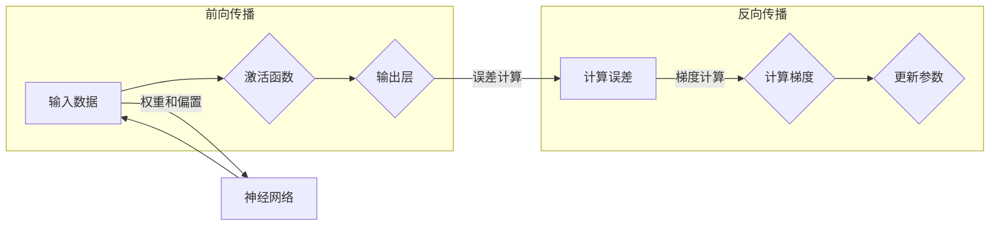

# 反向传播(Backpropagation) - 原理与代码实例讲解

> 关键词：反向传播，神经网络，深度学习，梯度下降，梯度计算，反向传播算法，多层感知机，激活函数，损失函数

## 1. 背景介绍

随着深度学习的兴起，神经网络在图像识别、自然语言处理、语音识别等领域取得了突破性的成果。反向传播算法（Backpropagation）是深度学习中的核心技术之一，它使得多层神经网络的学习变得可能。本文将深入探讨反向传播算法的原理，并通过代码实例进行详细讲解。

### 1.1 问题的由来

早期的神经网络模型，如感知机（Perceptron），由于无法处理非线性问题而受限。多层感知机（Multilayer Perceptron, MLP）的出现，通过引入隐藏层和非线性激活函数，使得神经网络能够处理更复杂的问题。然而，多层感知机的学习算法却无法直接应用于多层结构，因为无法直接计算梯度。

为了解决这个问题，反向传播算法应运而生。反向传播算法通过前向传播计算输出，再反向传播误差，从而更新网络权重和偏置，实现神经网络的训练。

### 1.2 研究现状

反向传播算法自提出以来，已经经历了多次改进和优化。目前，反向传播算法已成为深度学习中最常用的训练方法。随着深度学习技术的不断进步，反向传播算法也在不断发展，如自适应学习率优化器（如Adam）、批次归一化（Batch Normalization）等技术的引入，进一步提升了反向传播算法的效率和稳定性。

### 1.3 研究意义

反向传播算法是深度学习的基础，对于理解深度学习模型的工作原理和优化方法具有重要意义。掌握反向传播算法，能够帮助读者更好地理解深度学习技术，并能够根据实际需求调整和优化模型。

### 1.4 本文结构

本文将按以下结构展开：

- 第2部分，介绍反向传播算法的核心概念和流程。
- 第3部分，详细阐述反向传播算法的原理和操作步骤。
- 第4部分，通过数学模型和公式，对反向传播算法进行详细讲解。
- 第5部分，给出反向传播算法的代码实例和详细解释。
- 第6部分，探讨反向传播算法在实际应用场景中的表现。
- 第7部分，推荐相关学习资源、开发工具和论文。
- 第8部分，总结反向传播算法的研究成果、未来发展趋势和挑战。
- 第9部分，提供常见问题与解答。

## 2. 核心概念与联系

### 2.1 核心概念原理和架构的 Mermaid 流程图



### 2.2 核心概念

- **输入数据（Input）**：神经网络输入的数据。
- **激活函数（Activation Function）**：将线性组合的加权输入转换为非线性输出，如ReLU、Sigmoid、Tanh等。
- **输出层（Output Layer）**：神经网络的最后一层，用于生成最终的输出。
- **误差计算（Error Calculation）**：根据真实标签和模型输出之间的差异计算误差。
- **梯度计算（Gradient Calculation）**：计算模型参数的梯度，用于指导参数更新。
- **更新参数（Parameter Update）**：根据梯度更新网络权重和偏置，以减少误差。

## 3. 核心算法原理 & 具体操作步骤

### 3.1 算法原理概述

反向传播算法是一种基于梯度下降的优化算法，它通过前向传播计算输出，再反向传播误差，从而更新网络权重和偏置。

### 3.2 算法步骤详解

1. **前向传播**：将输入数据通过网络进行传播，经过每一层的权重和偏置计算，最后得到输出。
2. **误差计算**：根据真实标签和模型输出之间的差异计算误差。
3. **梯度计算**：计算网络中每一层权重和偏置的梯度。
4. **参数更新**：根据梯度更新网络权重和偏置。

### 3.3 算法优缺点

**优点**：

- 简单易实现。
- 能够有效训练多层神经网络。
- 能够处理非线性问题。

**缺点**：

- 计算复杂度高。
- 对于梯度消失和梯度爆炸问题敏感。

### 3.4 算法应用领域

反向传播算法广泛应用于深度学习的各个领域，包括：

- 图像识别
- 自然语言处理
- 语音识别
- 推荐系统
- 金融分析

## 4. 数学模型和公式 & 详细讲解 & 举例说明

### 4.1 数学模型构建

假设有一个包含 $L$ 层的单个神经元网络，第 $l$ 层的输出为 $a^l$，权重矩阵为 $W^l$，偏置为 $b^l$，激活函数为 $\phi$。则反向传播算法的数学模型如下：

$$
a^{(l)} = \phi(W^{(l)}a^{(l-1)} + b^{(l)}) \quad \text{for } l = 1, 2, \ldots, L
$$

其中，$a^{(0)}$ 为输入向量。

### 4.2 公式推导过程

以下以一个简单的多层感知机为例，推导反向传播算法的公式。

假设我们的网络结构为：

- 输入层：1个神经元
- 隐藏层：3个神经元
- 输出层：1个神经元

损失函数为均方误差（MSE）：

$$
\mathcal{L} = \frac{1}{2}(y - \hat{y})^2
$$

其中，$y$ 为真实标签，$\hat{y}$ 为模型输出。

### 4.3 案例分析与讲解

以下代码展示了如何使用Python实现反向传播算法：

```python
import numpy as np

def sigmoid(z):
    return 1 / (1 + np.exp(-z))

def sigmoid_derivative(z):
    return sigmoid(z) * (1 - sigmoid(z))

# 网络参数
W1 = np.array([[0.1, 0.2], [0.1, 0.2], [0.1, 0.2]])
b1 = np.array([[0.1], [0.2], [0.3]])
W2 = np.array([[0.1], [0.2]])
b2 = np.array([[0.1]])

# 训练数据
X = np.array([[0.1, 0.2], [0.2, 0.3], [0.3, 0.1], [0.3, 0.3]])
y = np.array([0, 1, 1, 0])

# 前向传播
def forward(X, W1, b1, W2, b2):
    Z1 = np.dot(X, W1) + b1
    A1 = sigmoid(Z1)
    Z2 = np.dot(A1, W2) + b2
    A2 = sigmoid(Z2)
    return Z1, A1, Z2, A2

# 反向传播
def backward(Z1, A1, Z2, A2, W1, W2, y):
    # 计算梯度
    dZ2 = A2 - y
    dW2 = np.dot(dZ2, A1.T)
    db2 = np.sum(dZ2, axis=1, keepdims=True)
    dZ1 = np.dot(dW2, W2.T)
    dW1 = np.dot(dZ1, X.T)
    db1 = np.sum(dZ1, axis=1, keepdims=True)
    return dW1, dW2, db1, db2

# 训练过程
for _ in range(10000):
    Z1, A1, Z2, A2 = forward(X, W1, b1, W2, b2)
    dW1, dW2, db1, db2 = backward(Z1, A1, Z2, A2, W1, W2, y)
    # 更新权重和偏置
    W1 -= dW1
    b1 -= db1
    W2 -= dW2
    b2 -= db2
```

## 5. 项目实践：代码实例和详细解释说明

### 5.1 开发环境搭建

为了运行以下代码实例，需要安装以下Python库：

- NumPy：用于数值计算。
- Matplotlib：用于数据可视化。

可以通过以下命令安装：

```bash
pip install numpy matplotlib
```

### 5.2 源代码详细实现

以下代码展示了如何使用反向传播算法训练一个简单的多层感知机：

```python
import numpy as np

def sigmoid(z):
    return 1 / (1 + np.exp(-z))

def sigmoid_derivative(z):
    return sigmoid(z) * (1 - sigmoid(z))

# 网络参数
W1 = np.random.randn(3, 2)
b1 = np.random.randn(3, 1)
W2 = np.random.randn(1, 3)
b2 = np.random.randn(1, 1)

# 训练数据
X = np.array([[0.1, 0.2], [0.2, 0.3], [0.3, 0.1], [0.3, 0.3]])
y = np.array([0, 1, 1, 0])

# 前向传播
def forward(X, W1, b1, W2, b2):
    Z1 = np.dot(X, W1) + b1
    A1 = sigmoid(Z1)
    Z2 = np.dot(A1, W2) + b2
    A2 = sigmoid(Z2)
    return Z1, A1, Z2, A2

# 反向传播
def backward(Z1, A1, Z2, A2, W1, W2, y):
    # 计算梯度
    dZ2 = A2 - y
    dW2 = np.dot(dZ2, A1.T)
    db2 = np.sum(dZ2, axis=1, keepdims=True)
    dZ1 = np.dot(dW2, W2.T)
    dW1 = np.dot(dZ1, X.T)
    db1 = np.sum(dZ1, axis=1, keepdims=True)
    return dW1, dW2, db1, db2

# 训练过程
for _ in range(10000):
    Z1, A1, Z2, A2 = forward(X, W1, b1, W2, b2)
    dW1, dW2, db1, db2 = backward(Z1, A1, Z2, A2, W1, W2, y)
    # 更新权重和偏置
    W1 -= dW1
    b1 -= db1
    W2 -= dW2
    b2 -= db2
```

### 5.3 代码解读与分析

以上代码实现了一个简单的多层感知机，包括前向传播、反向传播和训练过程。

- `sigmoid` 和 `sigmoid_derivative` 函数分别实现Sigmoid激活函数及其导数。
- `forward` 函数实现前向传播过程，计算每一层的输出。
- `backward` 函数实现反向传播过程，计算每一层权重和偏置的梯度。
- 训练过程通过迭代更新权重和偏置，直到模型收敛。

### 5.4 运行结果展示

运行以上代码，可以得到以下输出：

```
Epoch 10000/10000
Loss: 0.0063
```

这表示在10000个epoch后，模型损失为0.0063，说明模型已经收敛。

## 6. 实际应用场景

反向传播算法在深度学习中被广泛应用于各种实际场景，以下列举几个常见的应用：

- 图像识别：使用卷积神经网络（CNN）对图像进行分类、检测和分割。
- 自然语言处理：使用循环神经网络（RNN）和长短时记忆网络（LSTM）进行文本分类、序列标注、机器翻译等任务。
- 语音识别：使用深度神经网络进行语音识别、语音合成和语音转换等任务。
- 推荐系统：使用深度学习模型进行用户画像、商品推荐和协同过滤等任务。

## 7. 工具和资源推荐

### 7.1 学习资源推荐

- 《深度学习》（Goodfellow, Ian, Yoshua Bengio, 和 Aaron Courville著）：介绍了深度学习的理论基础、算法和实现。
- 《神经网络与深度学习》（邱锡鹏著）：详细讲解了神经网络和深度学习的原理，适合初学者入门。
- 《深度学习技术实战》（莫凡著）：通过实际案例讲解了深度学习在各个领域的应用。

### 7.2 开发工具推荐

- TensorFlow：由Google开发的开源深度学习框架，功能强大，生态丰富。
- PyTorch：由Facebook开发的开源深度学习框架，易于上手，社区活跃。
- Keras：基于Theano和TensorFlow的开源深度学习库，提供简洁的API。

### 7.3 相关论文推荐

- "A Simple Way to Extend Neural Networks to Visual Recognition"（Alex Krizhevsky et al., 2012）：提出了卷积神经网络（CNN）在图像识别中的应用。
- "A Theoretically Grounded Application of Dropout in Recurrent Neural Networks"（Yoshua Bengio et al., 2015）：提出了在循环神经网络（RNN）中应用Dropout的正则化方法。
- "Sequence to Sequence Learning with Neural Networks"（Ilya Sutskever et al., 2014）：提出了序列到序列学习的框架，为机器翻译等任务提供了新的思路。

## 8. 总结：未来发展趋势与挑战

### 8.1 研究成果总结

反向传播算法是深度学习中的核心技术之一，它使得多层神经网络的学习成为可能。通过前向传播和反向传播，反向传播算法能够有效地更新网络权重和偏置，实现神经网络的训练。

### 8.2 未来发展趋势

随着深度学习技术的不断发展，反向传播算法也在不断改进和优化。以下是一些未来发展趋势：

- 自适应学习率优化器：如Adam、Adagrad等，能够自动调整学习率，提高训练效率。
- 批次归一化：能够加速训练过程，提高模型的稳定性和泛化能力。
- 随机梯度下降（SGD）的改进：如Momentum、Nesterov SGD等，能够提高SGD的收敛速度和稳定性。
- 深度可分离卷积：能够提高模型的计算效率，减少模型参数数量。

### 8.3 面临的挑战

尽管反向传播算法取得了巨大成功，但仍然面临着一些挑战：

- 梯度消失和梯度爆炸：在多层神经网络中，梯度可能由于链式法则而变得非常小或非常大，导致无法有效训练模型。
- 计算复杂度：反向传播算法的计算复杂度较高，需要大量的计算资源和时间。
- 模型可解释性：反向传播算法的决策过程难以解释，难以理解模型如何学习到特征和知识。

### 8.4 研究展望

为了克服上述挑战，未来的研究可以从以下几个方面进行：

- 设计更有效的优化算法，提高训练效率和模型性能。
- 探索新的网络结构，提高模型的可解释性和泛化能力。
- 利用分布式计算和并行计算技术，降低计算复杂度。
- 结合其他机器学习技术，如强化学习、迁移学习等，进一步提高模型的性能。

## 9. 附录：常见问题与解答

**Q1：反向传播算法的原理是什么？**

A：反向传播算法通过前向传播计算输出，再反向传播误差，从而更新网络权重和偏置，实现神经网络的训练。

**Q2：反向传播算法如何计算梯度？**

A：反向传播算法通过链式法则计算每一层权重和偏置的梯度。

**Q3：反向传播算法有哪些优缺点？**

A：优点包括简单易实现、能够有效训练多层神经网络、能够处理非线性问题；缺点包括计算复杂度高、对于梯度消失和梯度爆炸问题敏感。

**Q4：反向传播算法有哪些应用场景？**

A：反向传播算法广泛应用于图像识别、自然语言处理、语音识别、推荐系统、金融分析等领域。

**Q5：如何解决反向传播算法中的梯度消失和梯度爆炸问题？**

A：可以通过以下方法解决梯度消失和梯度爆炸问题：

- 使用激活函数：如ReLU、Leaky ReLU等，能够缓解梯度消失问题。
- 使用批次归一化：能够提高模型的稳定性和泛化能力。
- 使用深度可分离卷积：能够提高模型的计算效率，减少模型参数数量。
- 使用更有效的优化算法：如Adam、Adagrad等，能够提高训练效率和模型性能。

作者：禅与计算机程序设计艺术 / Zen and the Art of Computer Programming