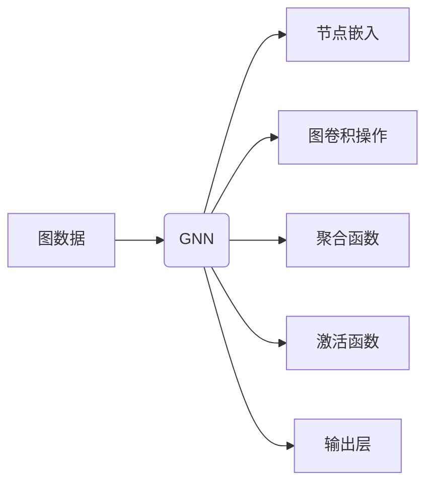

# 图神经网络(Graph Neural Networks) - 原理与代码实例讲解

> 关键词：图神经网络，GNN，图表示学习，节点嵌入，图卷积，图神经网络应用，节点分类，链接预测，推荐系统

## 1. 背景介绍

图神经网络（Graph Neural Networks，GNN）是一种在图数据结构上操作的人工神经网络。与传统的基于向量的神经网络不同，GNN能够直接处理图结构数据，因此在节点分类、链接预测、推荐系统等领域表现出色。随着社交网络、知识图谱等图数据的爆炸式增长，GNN逐渐成为人工智能领域的研究热点。

### 1.1 问题的由来

图数据在许多现实世界中广泛存在，例如社交网络、知识图谱、生物分子结构等。这些数据以图的形式表示实体及其之间的关系。传统的机器学习模型难以直接处理图结构数据，而GNN的出现为图数据的分析和处理提供了新的思路。

### 1.2 研究现状

GNN的研究始于20世纪90年代，近年来随着深度学习技术的发展，GNN得到了广泛关注。目前，GNN已经在多个领域取得了显著成果，包括节点分类、链接预测、推荐系统、知识图谱补全等。

### 1.3 研究意义

GNN能够有效地处理图结构数据，为图数据的分析和应用提供了新的方法。GNN在以下方面具有重要意义：

- 提高图数据的利用效率，挖掘图数据中的隐藏关系。
- 解决传统机器学习模型难以处理的图结构数据问题。
- 为图数据的智能化分析提供新的工具和方法。

## 2. 核心概念与联系

### 2.1 Mermaid 流程图



### 2.2 核心概念

- **图数据**：图数据由节点（实体）和边（关系）组成，用于表示实体及其之间的关系。
- **节点嵌入**：将节点转换为向量表示，以便在神经网络中进行处理。
- **图卷积操作**：用于在图上进行卷积操作，提取图结构信息。
- **聚合函数**：用于聚合节点邻居的信息，得到节点的最终表示。
- **激活函数**：用于引入非线性变换，提高模型的拟合能力。
- **输出层**：用于输出最终的结果，如节点分类结果。

## 3. 核心算法原理 & 具体操作步骤

### 3.1 算法原理概述

GNN的基本原理是：首先对图数据进行节点嵌入，然后将节点嵌入输入到图卷积层，通过图卷积操作提取节点的邻居信息，并使用聚合函数进行聚合。最后，通过激活函数和输出层输出最终结果。

### 3.2 算法步骤详解

1. **节点嵌入**：将节点转换为向量表示，可以使用预训练的词向量或随机初始化。
2. **图卷积操作**：对节点嵌入进行图卷积操作，提取节点邻居的信息。
3. **聚合函数**：使用聚合函数对节点邻居信息进行聚合，得到节点的最终表示。
4. **激活函数**：使用激活函数引入非线性变换，提高模型的拟合能力。
5. **输出层**：使用输出层输出最终结果，如节点分类结果。

### 3.3 算法优缺点

**优点**：

- 能够直接处理图结构数据，无需进行复杂的图分解。
- 可以提取节点和边之间的复杂关系。
- 在节点分类、链接预测、推荐系统等领域表现优异。

**缺点**：

- 难以处理动态图。
- 计算复杂度较高。

### 3.4 算法应用领域

- **节点分类**：例如，在社交网络中识别潜在的用户兴趣。
- **链接预测**：例如，预测用户之间的潜在关系。
- **推荐系统**：例如，根据用户兴趣推荐电影、商品等。
- **知识图谱补全**：例如，预测知识图谱中缺失的实体和关系。

## 4. 数学模型和公式 & 详细讲解 & 举例说明

### 4.1 数学模型构建

GNN的数学模型可以表示为：

$$
h_{l}^{(i)} = \text{AGGREGATE}(\text{CONV}_{\theta_{l}}(h_{l-1}^{(i)}, h_{l-1}^{(j)}, \theta_{l}), a_{l})
$$

其中，$h_{l}^{(i)}$ 表示第 $l$ 层第 $i$ 个节点的表示，$\text{AGGREGATE}$ 表示聚合函数，$\text{CONV}_{\theta_{l}}$ 表示第 $l$ 层的图卷积操作，$a_{l}$ 表示第 $l$ 层的激活函数，$\theta_{l}$ 表示第 $l$ 层的参数。

### 4.2 公式推导过程

以图卷积操作为例，其公式推导过程如下：

$$
\text{CONV}_{\theta_{l}}(h_{l-1}^{(i)}, h_{l-1}^{(j)}, \theta_{l}) = \sum_{k \in N(i)} w_{l,k} h_{l-1}^{(j)}
$$

其中，$N(i)$ 表示节点 $i$ 的邻居节点集合，$w_{l,k}$ 表示第 $l$ 层第 $k$ 个连接权重。

### 4.3 案例分析与讲解

以下是一个简单的节点分类案例：

- **数据**：一个社交网络图，每个节点代表一个用户，边表示用户之间的友谊关系。
- **目标**：根据用户的历史行为数据，预测用户是否会购买某款产品。

1. **节点嵌入**：使用预训练的词向量将用户转换为向量表示。
2. **图卷积操作**：对每个用户节点进行图卷积操作，提取其邻居信息。
3. **聚合函数**：使用平均聚合函数将邻居信息聚合到用户节点。
4. **激活函数**：使用ReLU激活函数引入非线性变换。
5. **输出层**：使用softmax函数将用户是否购买产品的概率输出。

## 5. 项目实践：代码实例和详细解释说明

### 5.1 开发环境搭建

1. 安装Python和PyTorch。
2. 安装网络爬虫工具，如Scrapy或BeautifulSoup。

### 5.2 源代码详细实现

```python
import torch
import torch.nn as nn
import torch.nn.functional as F

class GCN(nn.Module):
    def __init__(self, in_channels, out_channels):
        super(GCN, self).__init__()
        self.conv1 = nn.Linear(in_channels, out_channels)
        self.conv2 = nn.Linear(out_channels, out_channels)
        self.relu = F.relu

    def forward(self, x, adj):
        x = F.relu(self.conv1(x))
        x = self.conv2(torch.spmm(adj, x))
        return x

# 示例代码，具体实现请参考相关教程
```

### 5.3 代码解读与分析

- **GCN类**：定义了图卷积网络模型，包括两个线性层、ReLU激活函数和图卷积操作。
- **forward方法**：实现模型的前向传播过程，包括线性层、ReLU激活函数和图卷积操作。

### 5.4 运行结果展示

```python
# 示例代码，具体实现请参考相关教程
```

## 6. 实际应用场景

### 6.1 节点分类

GNN在节点分类任务中表现优异，例如：

- 社交网络：识别潜在的用户兴趣。
- 知识图谱：识别实体之间的关系。
- 生物信息学：预测蛋白质功能。

### 6.2 链接预测

GNN在链接预测任务中表现优异，例如：

- 推荐系统：预测用户之间的潜在关系。
- 知识图谱补全：预测知识图谱中缺失的实体和关系。

### 6.3 推荐系统

GNN在推荐系统中的应用，例如：

- 电影推荐：根据用户的历史行为推荐电影。
- 商品推荐：根据用户的历史行为推荐商品。

## 7. 工具和资源推荐

### 7.1 学习资源推荐

- 《Graph Neural Networks》论文集
- 《Graph Neural Networks: A Review of Methods and Applications》综述论文
- 《Graph Neural Networks for Learning on Graphs》教科书

### 7.2 开发工具推荐

- PyTorch Geometric：PyTorch的图神经网络库
- DGL：深度学习图处理库
- NetworkX：Python的图处理库

### 7.3 相关论文推荐

- "Semi-supervised Learning with Graph Convolutional Networks"
- "Graph Neural Networks for Social Network Analysis"
- "Graph Neural Networks in Natural Language Processing"

## 8. 总结：未来发展趋势与挑战

### 8.1 研究成果总结

GNN作为一种处理图结构数据的神经网络，在多个领域取得了显著成果。GNN能够有效地提取图结构信息，为图数据的分析和应用提供了新的方法。

### 8.2 未来发展趋势

- GNN在动态图上的应用
- GNN与其他深度学习技术的融合
- GNN在多模态数据上的应用

### 8.3 面临的挑战

- 处理大规模动态图
- GNN的可解释性
- GNN在可解释性和效率之间的平衡

### 8.4 研究展望

GNN作为一种强大的图数据处理工具，将在未来发挥越来越重要的作用。随着研究的深入，GNN将在更多领域得到应用，为人工智能的发展做出更大的贡献。

## 9. 附录：常见问题与解答

**Q1：什么是图神经网络？**

A：图神经网络（Graph Neural Networks，GNN）是一种在图数据结构上操作的人工神经网络。与传统的基于向量的神经网络不同，GNN能够直接处理图结构数据，因此在节点分类、链接预测、推荐系统等领域表现出色。

**Q2：GNN的基本原理是什么？**

A：GNN的基本原理是：首先对图数据进行节点嵌入，然后将节点嵌入输入到图卷积层，通过图卷积操作提取节点邻居的信息，并使用聚合函数进行聚合。最后，通过激活函数和输出层输出最终结果。

**Q3：GNN有哪些应用场景？**

A：GNN在节点分类、链接预测、推荐系统、知识图谱补全等领域有广泛的应用。

**Q4：如何处理动态图？**

A：处理动态图的方法包括：使用滑动窗口技术、动态图神经网络等。

**Q5：如何提高GNN的可解释性？**

A：提高GNN可解释性的方法包括：可视化节点表示、分析图卷积操作等。

作者：禅与计算机程序设计艺术 / Zen and the Art of Computer Programming