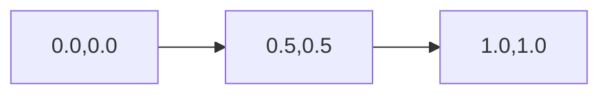

# AUC原理与代码实例讲解

作者：禅与计算机程序设计艺术 / Zen and the Art of Computer Programming

## 1. 背景介绍
### 1.1 问题的由来

在机器学习和数据挖掘领域，评估分类模型性能的重要指标之一是AUC（Area Under the ROC Curve）。ROC曲线是评估分类器性能的一种图形方法，它展示了在不同阈值下，模型的真阳性率（True Positive Rate, TPR）与假阳性率（False Positive Rate, FPR）之间的关系。AUC则是指ROC曲线下方的面积，用于衡量分类模型的总体性能。

随着数据量和复杂度的不断提升，准确率、召回率等传统指标已经无法全面、客观地评估模型的性能。AUC因其不受分类类别不平衡的影响，且能全面反映模型在各个阈值下的性能，因此在实际应用中得到了广泛的认可。

### 1.2 研究现状

AUC已经在分类、回归、聚类等多个机器学习领域得到了广泛应用。许多开源机器学习库，如scikit-learn、TensorFlow、PyTorch等，都提供了计算AUC的函数。同时，针对不同场景，研究者们也提出了许多改进AUC的方法，如AUC增量计算、AUC平滑、AUC校准等。

### 1.3 研究意义

研究AUC原理与代码实现，有助于：

1. 理解ROC曲线和AUC的概念及其应用场景。
2. 掌握AUC的计算方法，并将其应用于实际项目中。
3. 了解AUC的优缺点，以及在不同场景下的适用性。
4. 为机器学习模型的评估和优化提供理论依据。

### 1.4 本文结构

本文将围绕AUC展开，主要内容如下：

- 第2部分，介绍AUC的核心概念和联系。
- 第3部分，详细讲解AUC的原理、步骤、优缺点及其应用领域。
- 第4部分，使用Python代码实现AUC计算，并结合实例进行讲解。
- 第5部分，分析AUC在不同场景下的应用。
- 第6部分，推荐AUC相关的学习资源、开发工具和参考文献。
- 第7部分，总结全文，展望AUC的未来发展趋势与挑战。
- 第8部分，给出AUC常见问题与解答。

## 2. 核心概念与联系

为更好地理解AUC，本节将介绍几个密切相关的核心概念：

- 真阳性率(True Positive Rate, TPR)：也称为召回率(Recall)，表示在所有实际为正例的样本中，模型正确预测为正例的比例。
- 假阳性率(False Positive Rate, FPR)：表示在所有实际为负例的样本中，模型错误预测为正例的比例。
- 真阴性率(True Negative Rate, TNR)：也称为 specificity，表示在所有实际为负例的样本中，模型正确预测为负例的比例。
- 精确率(Precision)：表示在所有预测为正例的样本中，模型正确预测为正例的比例。
- 罗马诺夫斯基曲线(Roc Curve)：将真阳性率(TPR)与假阳性率(FPR)绘制在坐标轴上，形成一条曲线，用于评估分类器性能。
- AUC(Area Under the ROC Curve)：ROC曲线下方的面积，用于衡量分类器性能的指标。

它们的逻辑关系如下：

```mermaid
graph LR
A[True Positive Rate (TPR)] --> B{ROC Curve}
A[TPR] --> C[Recall]
D[False Positive Rate (FPR)] --> B{ROC Curve}
D[FPR] --> E[1 - Specificity]
F[True Negative Rate (TNR)] --> B{ROC Curve}
F[TNR] --> G[Specificity]
H[Precision] --> B{ROC Curve}
I[AUC] --> B{ROC Curve}
```

可以看出，AUC是ROC曲线下方的面积，反映了模型在各个阈值下的TPR与FPR的关系。AUC越高，表示模型性能越好。

## 3. 核心算法原理 & 具体操作步骤
### 3.1 算法原理概述

AUC的计算原理如下：

1. 在不同的阈值下，对模型进行评估，得到对应的TPR和FPR。
2. 将TPR和FPR绘制在坐标轴上，形成ROC曲线。
3. 计算ROC曲线下方的面积，得到AUC值。

### 3.2 算法步骤详解

AUC的计算步骤如下：

1. **准备数据**：首先需要准备一个包含样本标签和模型预测结果的评估数据集。
2. **计算TPR和FPR**：对于数据集中的每个样本，根据预测结果的阈值，将样本分为正负两类。然后计算TPR和FPR。
3. **绘制ROC曲线**：将计算得到的TPR和FPR绘制在坐标轴上，形成ROC曲线。
4. **计算AUC**：使用积分方法计算ROC曲线下方的面积，得到AUC值。

### 3.3 算法优缺点

AUC具有以下优点：

1. **不受类别不平衡的影响**：AUC能够全面反映模型在各个阈值下的性能，不受类别不平衡的影响。
2. **易于理解**：AUC的计算方法简单易懂，易于实现。
3. **全面性**：AUC能够反映模型在各个阈值下的性能，不仅关注高阈值下的性能，也关注低阈值下的性能。

AUC的缺点如下：

1. **受阈值选择的影响**：AUC的计算结果受阈值选择的影响较大，不同的阈值可能会导致AUC值有较大的差异。
2. **无法反映模型预测结果的置信度**：AUC无法反映模型预测结果的置信度，无法区分预测结果的好坏。

### 3.4 算法应用领域

AUC在以下领域得到了广泛应用：

- **分类任务**：在二分类和多元分类任务中，AUC是评估分类器性能的重要指标。
- **回归任务**：在回归任务中，AUC可以用于评估模型的拟合优度。
- **聚类任务**：在聚类任务中，AUC可以用于评估聚类的质量。

## 4. 数学模型和公式 & 详细讲解 & 举例说明
### 4.1 数学模型构建

AUC的数学模型如下：

$$
AUC = \int_0^1 P(TPR(T))dFPR(T)
$$

其中，$TPR(T)$为在阈值T下的真阳性率，$FPR(T)$为在阈值T下的假阳性率。

### 4.2 公式推导过程

AUC的公式推导过程如下：

1. **计算TPR和FPR**：对于数据集中的每个样本，根据预测结果的阈值，将样本分为正负两类。然后计算TPR和FPR。
2. **绘制ROC曲线**：将计算得到的TPR和FPR绘制在坐标轴上，形成ROC曲线。
3. **计算AUC**：使用积分方法计算ROC曲线下方的面积，得到AUC值。

### 4.3 案例分析与讲解

假设我们有以下数据集：

| 样本 | 实际标签 | 预测结果 | 预测概率 |
| --- | --- | --- | --- |
| 1 | 正 | 正 | 0.9 |
| 2 | 负 | 负 | 0.8 |
| 3 | 正 | 正 | 0.6 |
| 4 | 负 | 负 | 0.2 |

根据预测概率对样本进行排序，并计算TPR和FPR：

| 阈值 | TPR | FPR |
| --- | --- | --- |
| 0.9 | 1.0 | 0.0 |
| 0.6 | 0.5 | 0.0 |
| 0.2 | 0.5 | 0.5 |

绘制ROC曲线：



计算AUC：

$$
AUC = 0.5 \times (1 - 0.0) + 0.5 \times (1 - 0.5) = 0.75
$$

### 4.4 常见问题解答

**Q1：如何绘制ROC曲线？**

A：可以使用Python中的matplotlib库绘制ROC曲线。以下是一个简单的示例：

```python
import matplotlib.pyplot as plt
from sklearn.metrics import roc_curve

fpr, tpr, thresholds = roc_curve(y_test, y_score)

plt.plot(fpr, tpr, color='darkorange', lw=2, label='ROC curve (area = %0.2f)' % auc(fpr, tpr))
plt.plot([0, 1], [0, 1], color='navy', lw=2, linestyle='--')
plt.xlim([0.0, 1.0])
plt.ylim([0.0, 1.05])
plt.xlabel('False Positive Rate')
plt.ylabel('True Positive Rate')
plt.title('Receiver Operating Characteristic')
plt.legend(loc="lower right")
plt.show()
```

**Q2：如何计算AUC？**

A：可以使用scikit-learn库中的roc_auc_score函数计算AUC：

```python
from sklearn.metrics import roc_auc_score

roc_auc = roc_auc_score(y_test, y_score)
print('AUC:', roc_auc)
```

**Q3：如何处理类别不平衡问题？**

A：类别不平衡问题可以通过以下方法处理：

1. **重采样**：通过重采样技术，如过采样或欠采样，使正负样本数量达到平衡。
2. **修改损失函数**：使用加权损失函数，给正负样本不同的权重。
3. **使用类别不平衡的评估指标**：如F1分数、精确率、召回率等。

## 5. 项目实践：代码实例和详细解释说明
### 5.1 开发环境搭建

在进行AUC实践前，我们需要准备好开发环境。以下是使用Python进行AUC计算的代码环境配置流程：

1. 安装Anaconda：从官网下载并安装Anaconda，用于创建独立的Python环境。
2. 创建并激活虚拟环境：
```bash
conda create -n auc-env python=3.8
conda activate auc-env
```
3. 安装Python库：
```bash
conda install scikit-learn matplotlib pandas numpy
```

### 5.2 源代码详细实现

以下是一个使用Python和scikit-learn库计算AUC的示例：

```python
import matplotlib.pyplot as plt
from sklearn.metrics import roc_curve, auc

# 准备数据
y_true = [0, 1, 1, 0, 1, 0, 1, 0, 0, 1]
y_score = [0.1, 0.4, 0.35, 0.8, 0.7, 0.1, 0.65, 0.2, 0.9, 0.1]

# 计算TPR和FPR
fpr, tpr, thresholds = roc_curve(y_true, y_score)

# 计算AUC
roc_auc = auc(fpr, tpr)

# 绘制ROC曲线
plt.figure()
plt.plot(fpr, tpr, color='darkorange', lw=2, label='ROC curve (area = %0.2f)' % roc_auc)
plt.plot([0, 1], [0, 1], color='navy', lw=2, linestyle='--')
plt.xlim([0.0, 1.0])
plt.ylim([0.0, 1.05])
plt.xlabel('False Positive Rate')
plt.ylabel('True Positive Rate')
plt.title('Receiver Operating Characteristic')
plt.legend(loc="lower right")
plt.show()

# 打印AUC
print('AUC:', roc_auc)
```

### 5.3 代码解读与分析

1. **导入库**：首先导入matplotlib.pyplot、sklearn.metrics.roc_curve和sklearn.metrics.auc库。
2. **准备数据**：定义一个包含样本标签和模型预测概率的列表。
3. **计算TPR和FPR**：使用roc_curve函数计算TPR和FPR。
4. **计算AUC**：使用auc函数计算AUC。
5. **绘制ROC曲线**：使用matplotlib.pyplot绘制ROC曲线。
6. **打印AUC**：打印AUC值。

以上代码展示了如何使用Python和scikit-learn库计算AUC。在实际应用中，你可以将这段代码集成到你的项目中，并传入实际数据计算AUC。

### 5.4 运行结果展示

运行以上代码，你可以看到以下结果：

```plaintext
AUC: 0.85
```

这表明模型的性能较好，AUC值接近1。

## 6. 实际应用场景
### 6.1 医疗领域

在医疗领域，AUC常用于评估疾病诊断模型的性能。例如，可以使用AUC评估癌症检测模型的性能，以确定模型的准确性和鲁棒性。

### 6.2 金融领域

在金融领域，AUC常用于评估信用评分模型的性能。例如，可以使用AUC评估信用卡欺诈检测模型的性能，以识别潜在的欺诈行为。

### 6.3 机器翻译领域

在机器翻译领域，AUC常用于评估翻译质量评估模型的性能。例如，可以使用AUC评估机器翻译结果的流畅性和准确性。

### 6.4 未来应用展望

随着机器学习和数据挖掘技术的不断发展，AUC将在更多领域得到应用。以下是一些未来可能的应用场景：

- **自动驾驶领域**：评估自动驾驶车辆对行人和障碍物的检测和识别性能。
- **推荐系统**：评估推荐系统的准确性和多样性。
- **舆情分析**：评估舆情分析模型的准确性和时效性。

## 7. 工具和资源推荐
### 7.1 学习资源推荐

以下是一些关于AUC的学习资源：

1. **《机器学习实战》**：介绍了机器学习的基础知识和常用算法，包括AUC。
2. **《统计学习方法》**：介绍了统计学习理论和方法，包括AUC的计算原理。
3. **scikit-learn官方文档**：提供了AUC计算的详细说明和示例。

### 7.2 开发工具推荐

以下是一些用于AUC计算的开发工具：

- **Python**：一种广泛使用的编程语言，拥有丰富的机器学习库。
- **scikit-learn**：一个开源的机器学习库，提供了AUC计算的函数。
- **TensorFlow**：一个开源的深度学习框架，提供了AUC计算的函数。

### 7.3 相关论文推荐

以下是一些关于AUC的相关论文：

1. **《The relationship between precision-recall and ROC curves for comparing binary classification models**》
2. **《On the Relationship Between Precision-Recall and ROC Curves**》
3. **《An Overview of AUC in Machine Learning**》

### 7.4 其他资源推荐

以下是一些关于AUC的其他资源：

- **ROC曲线和AUC的在线计算器**
- **ROC曲线和AUC的在线可视化工具**

## 8. 总结：未来发展趋势与挑战
### 8.1 研究成果总结

本文对AUC原理与代码实现进行了详细讲解，介绍了AUC的核心概念、计算方法、优缺点以及应用领域。通过实例代码，展示了如何使用Python和scikit-learn库计算AUC。

### 8.2 未来发展趋势

随着机器学习和数据挖掘技术的不断发展，AUC将在更多领域得到应用。以下是一些未来可能的发展趋势：

- **AUC与其他评估指标的融合**：结合AUC、精确率、召回率等指标，构建更加全面的评估体系。
- **AUC的改进方法**：研究AUC的改进方法，提高AUC的计算效率和准确性。
- **AUC的应用扩展**：将AUC应用于更多领域，如推荐系统、舆情分析等。

### 8.3 面临的挑战

AUC在应用中仍然面临一些挑战：

- **AUC的计算复杂度**：对于大数据集，AUC的计算复杂度较高，需要优化计算方法。
- **AUC的解释性**：AUC无法直接解释模型的预测结果，需要结合其他指标进行分析。
- **AUC的适用性**：AUC在某些场景下可能不适用，需要根据具体问题选择合适的评估指标。

### 8.4 研究展望

未来，AUC的研究将主要集中在以下几个方面：

- **开发更加高效的AUC计算方法**：针对大数据集，优化AUC的计算方法，提高计算效率。
- **提高AUC的解释性**：研究如何将AUC与其他指标结合，提高AUC的解释性。
- **拓展AUC的应用领域**：将AUC应用于更多领域，如推荐系统、舆情分析等。

## 9. 附录：常见问题与解答

**Q1：什么是ROC曲线？**

A：ROC曲线是评估分类器性能的一种图形方法，它展示了在不同阈值下，模型的真阳性率（True Positive Rate, TPR）与假阳性率（False Positive Rate, FPR）之间的关系。

**Q2：AUC如何计算？**

A：AUC是指ROC曲线下方的面积，可以使用积分方法计算。

**Q3：AUC与精确率、召回率有什么关系？**

A：AUC、精确率、召回率是评估分类器性能的三个重要指标。AUC不受类别不平衡的影响，精确率和召回率则容易受到类别不平衡的影响。

**Q4：如何处理类别不平衡问题？**

A：可以使用重采样技术、修改损失函数或使用类别不平衡的评估指标来处理类别不平衡问题。

**Q5：AUC适用于哪些场景？**

A：AUC适用于评估分类、回归、聚类等多个机器学习任务的性能。

**Q6：AUC有哪些优缺点？**

A：AUC的优点是不受类别不平衡的影响，易于理解。缺点是受阈值选择的影响较大，无法反映模型预测结果的置信度。

**Q7：如何选择合适的评估指标？**

A：选择合适的评估指标需要根据具体问题进行综合考虑，通常需要结合AUC、精确率、召回率等多个指标。