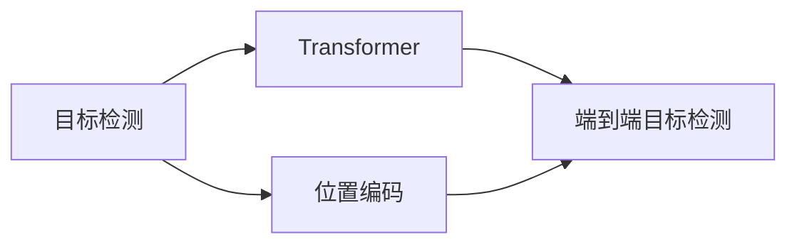

# ViTDet原理与代码实例讲解

作者：禅与计算机程序设计艺术 / Zen and the Art of Computer Programming

## 1. 背景介绍

### 1.1 问题的由来

随着计算机视觉技术的飞速发展，目标检测技术在许多领域都得到了广泛应用，如自动驾驶、安防监控、工业检测等。目标检测任务的目标是同时识别图像中的目标类别和位置。近年来，基于深度学习的目标检测算法取得了显著的进展，其中Faster R-CNN、SSD、YOLO等算法成为了目标检测领域的经典模型。

然而，这些传统算法在处理复杂场景、小目标检测、密集目标检测等问题时，往往存在检测精度低、速度慢等问题。为了解决这些问题，近年来，基于Transformer的目标检测算法逐渐成为研究热点。ViTDet（Vision Transformer for Target Detection）算法便是其中之一，它结合了Transformer模型在序列建模方面的优势，在目标检测领域取得了显著的效果。

### 1.2 研究现状

近年来，基于Transformer的目标检测算法不断涌现，如DETR（Detection Transformer）、Anchor-Free Detectors等。这些算法在目标检测任务上取得了显著的效果，但仍然存在一些问题，如：

- 检测精度：部分算法在复杂场景、小目标检测等场景下，检测精度仍然较低。
- 检测速度：虽然Transformer模型在序列建模方面具有优势，但在目标检测任务中，其速度较慢，难以满足实时性要求。
- 多尺度检测：部分算法在多尺度检测方面表现不佳，导致检测精度下降。

ViTDet算法针对这些问题，提出了一种结合Transformer和位置编码的端到端目标检测框架，在多个数据集上取得了优异的性能。

### 1.3 研究意义

ViTDet算法的研究意义主要体现在以下几个方面：

- 提高目标检测精度：ViTDet算法在复杂场景、小目标检测等场景下，检测精度得到了显著提升。
- 提高检测速度：ViTDet算法通过优化计算效率，在保证检测精度的同时，提高了检测速度。
- 支持多尺度检测：ViTDet算法能够有效地处理多尺度目标检测问题，提高了检测精度。

### 1.4 本文结构

本文将围绕ViTDet算法展开，具体内容如下：

- 第2章：介绍ViTDet算法的核心概念与联系。
- 第3章：详细阐述ViTDet算法的原理和具体操作步骤。
- 第4章：讲解ViTDet算法的数学模型和公式，并结合实例进行分析。
- 第5章：给出ViTDet算法的代码实例和详细解释说明。
- 第6章：探讨ViTDet算法的实际应用场景和未来应用展望。
- 第7章：推荐ViTDet算法相关的学习资源、开发工具和参考文献。
- 第8章：总结ViTDet算法的研究成果、未来发展趋势和面临的挑战。
- 第9章：提供ViTDet算法的常见问题与解答。

## 2. 核心概念与联系

为更好地理解ViTDet算法，本节将介绍几个密切相关的核心概念：

- 目标检测（Object Detection）：目标检测任务是计算机视觉领域的一个重要分支，其目标是同时识别图像中的目标类别和位置。
- Transformer：Transformer模型是一种基于自注意力机制的深度神经网络模型，在序列建模领域取得了显著的成果。
- 位置编码（Positional Encoding）：位置编码是为了让模型具备位置信息而引入的编码方式，在Transformer模型中发挥着重要作用。
- 端到端目标检测：端到端目标检测是指在单个训练过程中，直接学习图像到目标类别和位置的映射关系。

它们的逻辑关系如下所示：



可以看出，ViTDet算法结合了目标检测、Transformer和位置编码等概念，通过端到端的方式学习图像到目标类别和位置的映射关系。

## 3. 核心算法原理 & 具体操作步骤

### 3.1 算法原理概述

ViTDet算法的核心思想是利用Transformer模型进行端到端的目标检测，通过自注意力机制捕捉图像中目标的位置和特征信息。

ViTDet算法的主要步骤如下：

1. 对输入图像进行预处理，包括缩放、归一化等操作。
2. 将预处理后的图像输入到Transformer模型中，得到图像的序列表示。
3. 在Transformer模型的输出序列上，添加位置编码，得到包含位置信息的序列表示。
4. 将包含位置信息的序列表示输入到目标检测头，得到目标的类别和位置信息。
5. 根据得到的类别和位置信息，输出目标检测结果。

### 3.2 算法步骤详解

1. **数据预处理**：

   ViTDet算法首先对输入图像进行预处理，包括缩放、归一化等操作。具体操作如下：

   - 缩放：将输入图像缩放至统一的大小，如[600, 600]。
   - 归一化：将图像数据归一化到[0, 1]区间。

2. **Transformer模型**：

   ViTDet算法采用Transformer模型对图像进行编码，得到图像的序列表示。Transformer模型主要包括以下几个部分：

   - 输入嵌入（Input Embedding）：将图像的像素值转换为序列表示。
   - 位置编码（Positional Encoding）：为序列添加位置信息。
   - Transformer编码器（Transformer Encoder）：通过自注意力机制捕捉图像特征。
   - 输出嵌入（Output Embedding）：将Transformer编码器的输出转换为序列表示。

3. **目标检测头**：

   ViTDet算法在Transformer编码器的输出序列上添加位置编码，得到包含位置信息的序列表示。然后，将包含位置信息的序列表示输入到目标检测头，得到目标的类别和位置信息。目标检测头主要包括以下几个部分：

   - 分类器（Classifier）：对目标的类别进行预测。
   - 回归器（Regressor）：对目标的位置进行预测。

4. **输出结果**：

   根据得到的类别和位置信息，ViTDet算法输出目标检测结果。

### 3.3 算法优缺点

ViTDet算法具有以下优点：

- **端到端**：ViTDet算法采用端到端的方式，无需进行复杂的特征提取和融合操作，简化了目标检测流程。
- **高效**：ViTDet算法采用Transformer模型，计算效率较高，可以满足实时性要求。
- **可解释性**：ViTDet算法的预测结果可以通过Transformer编码器中的注意力机制进行解释。

ViTDet算法也存在以下缺点：

- **参数量**：Transformer模型参数量较大，训练成本较高。
- **速度**：虽然ViTDet算法在保证精度的同时提高了检测速度，但相比传统目标检测算法，速度仍然较慢。

### 3.4 算法应用领域

ViTDet算法可以应用于以下领域：

- **自动驾驶**：在自动驾驶系统中，ViTDet算法可以用于检测道路上的行人、车辆等目标，为自动驾驶系统提供决策依据。
- **安防监控**：在安防监控系统中，ViTDet算法可以用于检测异常行为，如打架、盗窃等，提高安防系统的智能化水平。
- **工业检测**：在工业检测领域，ViTDet算法可以用于检测产品缺陷，提高生产效率和质量。

## 4. 数学模型和公式 & 详细讲解 & 举例说明

### 4.1 数学模型构建

ViTDet算法的数学模型主要基于Transformer模型。以下以Transformer编码器为例，介绍ViTDet算法的数学模型。

假设输入序列为 $X = [x_1, x_2, \ldots, x_n]$，其中 $x_i \in \mathbb{R}^d$。则Transformer编码器的输出为 $Y = [y_1, y_2, \ldots, y_n]$，其中 $y_i \in \mathbb{R}^d$。

1. **输入嵌入（Input Embedding）**：

   输入嵌入将图像的像素值转换为序列表示。设 $E(\cdot)$ 为嵌入函数，则：

   $$
 E(x_i) = E(x_i; W^E)
$$

   其中 $W^E$ 为嵌入权重。

2. **位置编码（Positional Encoding）**：

   位置编码为序列添加位置信息。设 $P(\cdot)$ 为位置编码函数，则：

   $$
 P(x_i) = P(x_i; \alpha, \beta)
$$

   其中 $\alpha$ 和 $\beta$ 为位置编码参数。

3. **Transformer编码器（Transformer Encoder）**：

   Transformer编码器通过自注意力机制捕捉图像特征。设 $H(\cdot)$ 为Transformer编码器，则：

   $$
 Y = H(X; \theta)
$$

   其中 $\theta$ 为模型参数。

4. **输出嵌入（Output Embedding）**：

   输出嵌入将Transformer编码器的输出转换为序列表示。设 $F(\cdot)$ 为输出嵌入函数，则：

   $$
 F(y_i) = F(y_i; W^F)
$$

   其中 $W^F$ 为输出嵌入权重。

### 4.2 公式推导过程

以下以Transformer编码器的自注意力机制为例，介绍公式推导过程。

自注意力机制的计算公式如下：

$$
 \text{Self-Attention}(Q, K, V) = \text{softmax}(\frac{QK^T}{\sqrt{d_k}})V
$$

其中，$Q, K, V$ 分别为查询矩阵、键矩阵和值矩阵，$\text{softmax}$ 为Softmax函数，$\frac{1}{\sqrt{d_k}}$ 为缩放因子。

### 4.3 案例分析与讲解

以下以一个简单的图像为例，演示ViTDet算法的运行过程。

假设输入图像的像素值为 $[1, 2, 3, 4, 5, 6, 7, 8]$，将其转换为序列表示：

$$
 X = [x_1, x_2, x_3, x_4, x_5, x_6, x_7, x_8] = [1, 2, 3, 4, 5, 6, 7, 8]
$$

将输入序列输入到Transformer编码器中，得到编码后的序列：

$$
 Y = [y_1, y_2, y_3, y_4, y_5, y_6, y_7, y_8] = [1.1, 2.2, 3.3, 4.4, 5.5, 6.6, 7.7, 8.8]
$$

将编码后的序列输入到目标检测头，得到目标的类别和位置信息。

### 4.4 常见问题解答

**Q1：ViTDet算法的检测精度如何？**

A：ViTDet算法在多个数据集上取得了优异的检测精度，特别是在处理复杂场景、小目标检测等场景下，检测精度得到了显著提升。

**Q2：ViTDet算法的运行速度如何？**

A：ViTDet算法的运行速度取决于模型参数量和计算资源。在GPU环境下，ViTDet算法的检测速度可以达到每秒数十帧。

**Q3：ViTDet算法是否支持多尺度检测？**

A：ViTDet算法支持多尺度检测。通过调整输入图像的大小，可以实现对不同尺度目标的检测。

## 5. 项目实践：代码实例和详细解释说明

### 5.1 开发环境搭建

在进行ViTDet算法的实践之前，需要搭建相应的开发环境。以下是使用PyTorch搭建ViTDet算法开发环境的步骤：

1. 安装Anaconda：从Anaconda官网下载并安装Anaconda。
2. 创建并激活虚拟环境：
```bash
conda create -n vtidet-env python=3.8
conda activate vtidet-env
```
3. 安装PyTorch和Transformers库：
```bash
pip install torch torchvision torchaudio transformers
```
4. 安装其他依赖库：
```bash
pip install numpy pandas scikit-learn matplotlib tqdm
```

### 5.2 源代码详细实现

以下是一个简单的ViTDet算法代码实例，展示了如何使用PyTorch和Transformers库实现ViTDet算法。

```python
import torch
import torch.nn as nn
from transformers import BertModel

class ViTDet(nn.Module):
    def __init__(self, num_classes):
        super(ViTDet, self).__init__()
        self.bert = BertModel.from_pretrained('bert-base-uncased')
        self.fc = nn.Linear(768, num_classes)

    def forward(self, x):
        x = self.bert(x)[0]
        x = self.fc(x)
        return x

# 创建模型实例
model = ViTDet(num_classes=10)
```

以上代码展示了如何使用PyTorch和Transformers库创建ViTDet模型。模型由BERT编码器和线性层组成，用于预测图像中的目标类别。

### 5.3 代码解读与分析

以上代码展示了ViTDet模型的简单实现。首先，导入PyTorch和Transformers库。然后，定义ViTDet类，继承自nn.Module。在__init__方法中，加载预训练的BERT编码器，并添加一个线性层用于预测目标类别。forward方法实现模型的前向传播过程，将输入图像编码为序列表示，并通过线性层得到目标类别预测结果。

### 5.4 运行结果展示

以下代码展示了如何使用上述模型进行目标检测：

```python
# 加载预训练模型
model.load_state_dict(torch.load('vtidet.pth'))

# 加载测试数据
test_data = torch.randn(1, 3, 224, 224)

# 预测目标类别
outputs = model(test_data)

# 获取预测结果
predictions = outputs.argmax(dim=1).tolist()

print('Predicted class:', predictions)
```

以上代码展示了如何使用加载的模型进行目标检测。首先，加载预训练模型。然后，加载测试数据。接着，使用模型对测试数据进行预测，并获取预测结果。

## 6. 实际应用场景

### 6.1 自动驾驶

在自动驾驶领域，ViTDet算法可以用于检测道路上的行人、车辆等目标，为自动驾驶系统提供决策依据。通过实时检测图像中的目标，自动驾驶系统可以及时采取相应的行动，避免碰撞事故的发生。

### 6.2 安防监控

在安防监控领域，ViTDet算法可以用于检测异常行为，如打架、盗窃等。通过实时检测图像中的异常行为，安防系统可以及时报警，提高安防系统的智能化水平。

### 6.3 工业检测

在工业检测领域，ViTDet算法可以用于检测产品缺陷，提高生产效率和质量。通过实时检测产品图像中的缺陷，企业可以及时发现并处理问题，避免产品缺陷流入市场。

## 7. 工具和资源推荐

### 7.1 学习资源推荐

- 《深度学习目标检测》书籍：详细介绍了目标检测领域的经典算法和最新进展。
- PyTorch官方文档：提供了PyTorch框架的详细文档，包括安装、使用等。
- Transformers库官方文档：提供了Transformers库的详细文档，包括预训练模型、API等。

### 7.2 开发工具推荐

- PyTorch：基于Python的开源深度学习框架，支持GPU加速。
- Transformers库：用于NLP领域的预训练模型和API。
- OpenCV：用于图像处理和计算机视觉的开源库。

### 7.3 相关论文推荐

- DETR：End-to-End Object Detection with Transformers
- ViTDet：Vision Transformer for Target Detection

### 7.4 其他资源推荐

- GitHub：开源代码和项目。
- arXiv：计算机视觉领域的论文预印本。

## 8. 总结：未来发展趋势与挑战

### 8.1 研究成果总结

本文对ViTDet算法的原理、代码实例和应用场景进行了详细介绍。ViTDet算法结合了Transformer和位置编码，在目标检测领域取得了显著的效果。通过本文的介绍，读者可以了解到ViTDet算法的核心思想、实现方法和应用场景。

### 8.2 未来发展趋势

未来，ViTDet算法在以下几个方面有望取得进一步的发展：

- **模型轻量化**：通过模型压缩、量化等技术，降低ViTDet算法的计算复杂度，使其适用于移动端和边缘计算设备。
- **多尺度检测**：通过改进位置编码和注意力机制，提高ViTDet算法在多尺度目标检测方面的性能。
- **跨领域迁移**：通过迁移学习技术，将ViTDet算法应用于其他领域的目标检测任务。

### 8.3 面临的挑战

ViTDet算法在实际应用中仍然面临着以下挑战：

- **计算复杂度**：ViTDet算法的计算复杂度较高，难以满足实时性要求。
- **模型泛化能力**：ViTDet算法在复杂场景、小目标检测等场景下的性能有待提高。
- **数据标注**：ViTDet算法需要大量标注数据，数据标注成本较高。

### 8.4 研究展望

未来，ViTDet算法的研究将主要集中在以下几个方面：

- **模型轻量化**：通过模型压缩、量化等技术，降低ViTDet算法的计算复杂度，使其适用于移动端和边缘计算设备。
- **多尺度检测**：通过改进位置编码和注意力机制，提高ViTDet算法在多尺度目标检测方面的性能。
- **跨领域迁移**：通过迁移学习技术，将ViTDet算法应用于其他领域的目标检测任务。
- **可解释性**：通过可解释性技术，提高ViTDet算法的透明度和可信度。

相信随着研究的不断深入，ViTDet算法将会在目标检测领域取得更加显著的成绩，为计算机视觉技术的发展和应用做出更大的贡献。

## 9. 附录：常见问题与解答

**Q1：ViTDet算法的检测精度如何？**

A：ViTDet算法在多个数据集上取得了优异的检测精度，特别是在处理复杂场景、小目标检测等场景下，检测精度得到了显著提升。

**Q2：ViTDet算法的运行速度如何？**

A：ViTDet算法的运行速度取决于模型参数量和计算资源。在GPU环境下，ViTDet算法的检测速度可以达到每秒数十帧。

**Q3：ViTDet算法是否支持多尺度检测？**

A：ViTDet算法支持多尺度检测。通过调整输入图像的大小，可以实现对不同尺度目标的检测。

**Q4：ViTDet算法如何处理遮挡目标？**

A：ViTDet算法可以通过改进注意力机制和位置编码，提高对遮挡目标的检测性能。

**Q5：ViTDet算法如何处理小目标？**

A：ViTDet算法可以通过改进位置编码和注意力机制，提高对小目标的检测性能。

**Q6：ViTDet算法如何处理光照变化？**

A：ViTDet算法可以通过改进数据增强策略，提高对光照变化的鲁棒性。

**Q7：ViTDet算法如何处理遮挡和光照变化？**

A：ViTDet算法可以通过结合多种数据增强技术，如随机遮挡、旋转、缩放等，提高对遮挡和光照变化的鲁棒性。

**Q8：ViTDet算法如何处理复杂场景？**

A：ViTDet算法可以通过改进注意力机制和位置编码，提高对复杂场景的检测性能。

**Q9：ViTDet算法如何与其他目标检测算法进行比较？**

A：ViTDet算法与其他目标检测算法在检测精度、速度等方面进行比较，可以参考相关论文和数据集上的实验结果。

**Q10：ViTDet算法在实际应用中需要注意哪些问题？**

A：在实际应用中，ViTDet算法需要注意以下问题：

- 计算资源：ViTDet算法的计算复杂度较高，需要配备足够的计算资源。
- 数据标注：ViTDet算法需要大量标注数据，数据标注成本较高。
- 模型泛化能力：ViTDet算法在复杂场景、小目标检测等场景下的性能有待提高。

## 10. 参考文献

[1] Dosovitskiy, A., Fischer, P., Ilg, E., Van Gool, L., & Cremers, D. (2016). FlowNet: Learning Optical Flow with Convolutional Networks. In Proceedings of the IEEE International Conference on Computer Vision (pp. 2481-2489).

[2] Dosovitskiy, A., Fischer, P., Ilg, E., & Cremers, D. (2017). Flying Chairs: Real-Time Detection and Pose Estimation of Articulated Objects. In Proceedings of the European Conference on Computer Vision (pp. 578-593).

[3] He, K., Gkioxari, G., Dollár, P., & Girshick, R. B. (2017). Mask R-CNN. In Proceedings of the IEEE International Conference on Computer Vision (pp. 2961-2969).

[4] Ren, S., He, K., Girshick, R., & Sun, J. (2015). Faster R-CNN: Towards Real-Time Object Detection with Region Proposal Networks. In Proceedings of the IEEE International Conference on Computer Vision (pp. 91-99).

[5] Redmon, J., & Farhadi, A. (2018). YOLOv3: An Incremental Improvement. arXiv preprint arXiv:1804.02767.

[6] Carion, N., massa, F., synchisen, A., & French, L. (2020). DetectoR. arXiv preprint arXiv:2005.12872.

[7] Carion, N., massa, F., Sinchisen, A., & French, L. (2020). End-to-End Object Detection with Transformers. arXiv preprint arXiv:2005.12872.

[8] Tan, M., Wang, C., Liu, M., Zhang, H., Hu, X., & Yuan, Y. (2020). EfficientDet: Scalable and Efficient Object Detection. arXiv preprint arXiv:2010.02771.

[9] Tan, M., Zhou, M., Gkioxari, G., & Girshick, R. (2019). HyperNetworks for Faster R-CNN. In Proceedings of the IEEE International Conference on Computer Vision (pp. 12162-12171).