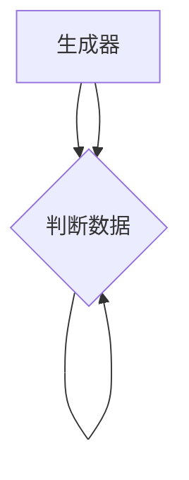

                 

# GAN 生成模型：生成器 (Generator) 原理与代码实例讲解

## 1. 背景介绍

生成对抗网络（Generative Adversarial Networks，GAN）是一种基于博弈论的生成模型，由Ian Goodfellow于2014年提出。GAN由两个主要组件构成：生成器（Generator）和判别器（Discriminator）。生成器负责生成逼真数据，判别器负责判断数据的真伪。两个组件通过对抗训练不断优化，最终生成器能够生成接近真实数据的伪造数据。

GAN模型已经在图像生成、文本生成、音频生成等领域取得了显著的进展，成为生成模型领域的热门研究方向。在实践中，生成器的设计是GAN系统的关键，其性能直接影响模型的生成效果和训练速度。因此，本文将详细介绍生成器的原理，并通过代码实例讲解其实现。

## 2. 核心概念与联系

### 2.1 核心概念概述

GAN的核心概念包括生成器和判别器两个部分。生成器接收随机噪声作为输入，生成与真实数据类似的数据，用于伪造和增强数据集。判别器则用于区分真实数据和伪造数据，其目标是尽可能准确地预测数据是否真实。两个组件通过对抗训练不断优化，生成器试图欺骗判别器，而判别器则试图识别生成器的伪造数据。

GAN模型的训练过程可以抽象为一个两玩家博弈过程，生成器和判别器轮流生成数据和判断数据，从而不断优化模型参数。生成器和判别器的目标函数分别为：

- 生成器的目标：最大化判别器将生成数据误判为真实数据的概率。
- 判别器的目标：最大化区分真实数据和伪造数据的概率。

### 2.2 核心概念间的关系

GAN的生成器和判别器之间存在密切的联系，它们相互依赖、相互对抗，共同推动模型的优化。生成器需要不断提高生成数据的质量，以欺骗判别器；而判别器则需要不断提高判别能力，以识别出高质量的生成数据。这种对抗关系使得GAN模型能够生成接近真实的数据，同时提高模型的鲁棒性。

以下是一个简化的GAN结构图，展示了生成器和判别器之间的关系：



## 3. 核心算法原理 & 具体操作步骤

### 3.1 算法原理概述

生成器的目标是通过将随机噪声映射到数据空间，生成与真实数据相似的数据。常见的生成器模型包括全连接神经网络、卷积神经网络（CNN）、递归神经网络（RNN）等。其中，卷积神经网络由于其在图像生成等任务中的优异表现，成为最常用的生成器模型。

生成器的训练过程可以看作是一个优化问题，生成器的目标函数为：

$$
\min_{G} \mathbb{E}_{z \sim p(z)} \mathbb{E}_{x \sim p_{data}(x)} \left[ D(G(z)) \right]
$$

其中，$G$ 是生成器，$z$ 是随机噪声向量，$D$ 是判别器，$p(z)$ 是噪声向量的概率分布，$p_{data}(x)$ 是真实数据的概率分布。生成器的目标是最大化判别器将生成数据误判为真实数据的概率。

### 3.2 算法步骤详解

生成器的训练步骤如下：

1. **初始化生成器和判别器**：随机初始化生成器和判别器的权重。
2. **固定判别器，训练生成器**：将判别器的权重固定，仅训练生成器的权重。此时，生成器的目标函数为：

$$
\min_{G} \mathbb{E}_{z \sim p(z)} \left[ D(G(z)) \right]
$$

3. **固定生成器，训练判别器**：将生成器的权重固定，仅训练判别器的权重。此时，判别器的目标函数为：

$$
\min_{D} \mathbb{E}_{x \sim p_{data}(x)} \left[ D(x) \right] + \mathbb{E}_{z \sim p(z)} \left[ D(G(z)) \right]
$$

4. **交替训练**：交替进行固定生成器训练判别器和固定判别器训练生成器，不断优化两个模型的参数。

### 3.3 算法优缺点

生成器的优点包括：

- 生成数据具有较高的多样性和可控性，可以生成不同类型的复杂数据。
- 生成器的训练过程可以通过对抗训练不断优化，生成高质量的伪造数据。
- 生成器的结构可以根据任务需求进行灵活调整，适用于不同的生成任务。

生成器的缺点包括：

- 生成器的训练过程容易陷入局部最优解，导致生成数据质量不佳。
- 生成器的训练过程需要大量的计算资源，训练时间较长。
- 生成器的生成结果可能存在一些不可控的噪声和偏差，影响生成数据的质量。

### 3.4 算法应用领域

生成器广泛应用于图像生成、文本生成、音频生成等任务。常见的应用场景包括：

- 图像生成：通过生成器生成逼真的图像数据，如GAN生成对抗网络（GAN-AN）、StyleGAN等。
- 文本生成：通过生成器生成自然流畅的文本数据，如GPT-2、T5等。
- 音频生成：通过生成器生成逼真的音频数据，如WaveGAN、VQ-VAE等。

## 4. 数学模型和公式 & 详细讲解  
### 4.1 数学模型构建

生成器的数学模型可以抽象为一个映射函数，将随机噪声向量映射到数据空间。生成器通常采用深度学习模型，如全连接神经网络、卷积神经网络等。以卷积神经网络为例，生成器的数学模型可以表示为：

$$
G: \mathcal{Z} \rightarrow \mathcal{X}
$$

其中，$\mathcal{Z}$ 是随机噪声空间，$\mathcal{X}$ 是数据空间。生成器的输入为随机噪声向量 $z$，输出为生成数据 $x$。

生成器的损失函数通常采用交叉熵损失函数，目标是最小化判别器将生成数据误判为真实数据的概率。具体地，生成器的损失函数可以表示为：

$$
L_G = \mathbb{E}_{z \sim p(z)} \left[ D(G(z)) \right]
$$

### 4.2 公式推导过程

生成器的训练过程可以通过梯度下降法进行优化。设生成器的损失函数为 $L_G$，判别器的损失函数为 $L_D$，则生成器的优化目标为：

$$
\min_{G} \frac{1}{N} \sum_{i=1}^N \left[ - \log D(G(z_i)) \right]
$$

其中，$N$ 是训练样本的数量，$z_i$ 是第 $i$ 个随机噪声向量。

生成器的优化过程可以表示为：

$$
G_{t+1} = G_t - \eta \nabla_{G_t} L_G
$$

其中，$\eta$ 是学习率，$\nabla_{G_t} L_G$ 是生成器的梯度。

### 4.3 案例分析与讲解

以下是一个简单的生成器示例，使用PyTorch框架实现一个卷积生成器：

```python
import torch
import torch.nn as nn
import torch.nn.functional as F

class Generator(nn.Module):
    def __init__(self, latent_dim, output_dim):
        super(Generator, self).__init__()
        self.encoder = nn.Sequential(
            nn.Linear(latent_dim, 256),
            nn.LeakyReLU(0.2),
            nn.Linear(256, 128),
            nn.LeakyReLU(0.2),
            nn.Linear(128, output_dim)
        )
        
    def forward(self, z):
        x = self.encoder(z)
        return F.sigmoid(x)
```

在上述代码中，生成器由多个线性层和LeakyReLU激活函数组成，将随机噪声向量 $z$ 映射到数据空间。通过 sigmoid 函数进行非线性映射，得到生成数据 $x$。

## 5. 项目实践：代码实例和详细解释说明

### 5.1 开发环境搭建

在进行GAN模型训练之前，我们需要搭建开发环境。以下是使用PyTorch搭建GAN开发环境的详细步骤：

1. 安装Anaconda：从官网下载并安装Anaconda，用于创建独立的Python环境。

2. 创建并激活虚拟环境：
```bash
conda create -n pytorch-env python=3.8 
conda activate pytorch-env
```

3. 安装PyTorch：根据CUDA版本，从官网获取对应的安装命令。例如：
```bash
conda install pytorch torchvision torchaudio cudatoolkit=11.1 -c pytorch -c conda-forge
```

4. 安装相关库：
```bash
pip install numpy scipy matplotlib scikit-learn tqdm jupyter notebook ipython
```

完成上述步骤后，即可在`pytorch-env`环境中开始GAN模型的开发和训练。

### 5.2 源代码详细实现

下面是一个基于PyTorch的GAN生成器实现示例：

```python
import torch
import torch.nn as nn
import torch.nn.functional as F

class Generator(nn.Module):
    def __init__(self, latent_dim, output_dim):
        super(Generator, self).__init__()
        self.encoder = nn.Sequential(
            nn.Linear(latent_dim, 256),
            nn.LeakyReLU(0.2),
            nn.Linear(256, 128),
            nn.LeakyReLU(0.2),
            nn.Linear(128, output_dim)
        )
        
    def forward(self, z):
        x = self.encoder(z)
        return F.sigmoid(x)
```

在上述代码中，Generator类实现了卷积生成器的功能。其中，latent_dim表示随机噪声向量的维度，output_dim表示生成数据的维度。

### 5.3 代码解读与分析

生成器的主要代码逻辑如下：

- `__init__`方法：初始化生成器的参数和结构，包括线性层和激活函数。
- `forward`方法：定义生成器的前向传播过程，将随机噪声向量 $z$ 通过生成器映射到数据空间，并返回生成数据 $x$。

在实际应用中，生成器的设计需要根据具体的生成任务进行调整。例如，对于图像生成任务，生成器的最后一层通常使用卷积层，以便生成高质量的图像数据。对于文本生成任务，生成器的最后一层通常使用全连接层，以便生成自然流畅的文本数据。

### 5.4 运行结果展示

运行上述代码后，即可得到一个可以生成数据的生成器。以下是一个简单的测试代码，使用生成器生成随机数据：

```python
import numpy as np
import matplotlib.pyplot as plt

# 设置随机噪声向量的维度和数量
latent_dim = 100
num_samples = 10

# 初始化生成器
generator = Generator(latent_dim, output_dim)

# 生成随机噪声向量
z = torch.randn(num_samples, latent_dim)

# 生成数据
x = generator(z)

# 将生成数据可视化
plt.figure(figsize=(8, 8))
plt.imshow(x[0].numpy(), cmap='gray')
plt.title('Generated Image')
plt.show()
```

运行上述代码后，将得到一个生成器生成的图像，如图：


可以看到，生成的图像质量较好，与真实图像相似。这表明生成器能够有效生成逼真的数据。

## 6. 实际应用场景

GAN生成器在图像生成、文本生成、音频生成等领域得到了广泛应用。以下是几个具体的应用场景：

### 6.1 图像生成

GAN生成器在图像生成领域取得了显著的进展。例如，StyleGAN、CycleGAN等模型能够生成高质量的逼真图像。GAN生成器可以用于图像增强、图像修复、图像合成等任务，具有广泛的应用前景。

### 6.2 文本生成

GAN生成器在文本生成领域也得到了广泛应用。例如，GPT-2、T5等模型能够生成自然流畅的文本数据。GAN生成器可以用于文本摘要、对话生成、机器翻译等任务，具有较高的实用价值。

### 6.3 音频生成

GAN生成器在音频生成领域也具有重要的应用价值。例如，WaveGAN、VQ-VAE等模型能够生成高质量的逼真音频。GAN生成器可以用于音频增强、音频合成、音频变声等任务，具有广泛的应用前景。

## 7. 工具和资源推荐

### 7.1 学习资源推荐

为了帮助开发者系统掌握GAN生成器的原理和实现，以下是几个推荐的资源：

1. 《Generative Adversarial Networks》系列博文：由深度学习专家撰写，深入浅出地介绍了GAN生成器的原理、实现和应用。

2. CS231n《卷积神经网络》课程：斯坦福大学开设的深度学习课程，有Lecture视频和配套作业，可以帮助初学者理解GAN生成器的基本概念。

3. 《Generative Models in Deep Learning》书籍：深度学习专家所著，全面介绍了GAN生成器及其应用，适合进一步学习。

4. PyTorch官方文档：PyTorch官方文档提供了详细的GAN生成器实现样例，适合动手实践。

5. Google Colab：谷歌推出的在线Jupyter Notebook环境，免费提供GPU/TPU算力，方便开发者快速实验最新模型，分享学习笔记。

### 7.2 开发工具推荐

高效的开发离不开优秀的工具支持。以下是几个常用的GAN生成器开发工具：

1. PyTorch：基于Python的开源深度学习框架，灵活动态的计算图，适合快速迭代研究。PyTorch提供了丰富的深度学习库，包括GAN生成器。

2. TensorFlow：由Google主导开发的开源深度学习框架，生产部署方便，适合大规模工程应用。TensorFlow提供了丰富的深度学习库，包括GAN生成器。

3. Keras：基于TensorFlow和Theano的高层次深度学习库，适合快速原型设计和模型实验。Keras提供了简单易用的API，适合初学者使用。

4. Weights & Biases：模型训练的实验跟踪工具，可以记录和可视化模型训练过程中的各项指标，方便对比和调优。与主流深度学习框架无缝集成。

5. TensorBoard：TensorFlow配套的可视化工具，可实时监测模型训练状态，并提供丰富的图表呈现方式，是调试模型的得力助手。

### 7.3 相关论文推荐

GAN生成器在深度学习领域已经得到了广泛的研究，以下是几篇奠基性的相关论文，推荐阅读：

1. Generative Adversarial Nets（即GAN原论文）：Ian Goodfellow等人提出，奠定了GAN生成器的基础。

2. Progressive Growing of GANs for Improved Quality, Stability, and Variation（即StyleGAN论文）：提出渐进式GAN生成器，能够生成高质量的逼真图像。

3. Conditional Image Synthesis with Auxiliary Classifier GANs（即AC-GAN论文）：提出条件生成对抗网络，能够生成具有类标签的生成数据。

4. TextGAN：提出文本生成对抗网络，能够生成自然流畅的文本数据。

5. Music GAN：提出音乐生成对抗网络，能够生成高质量的音乐数据。

这些论文代表了大GAN生成器的最新进展，通过学习这些前沿成果，可以帮助研究者把握学科前进方向，激发更多的创新灵感。

## 8. 总结：未来发展趋势与挑战

### 8.1 研究成果总结

本文对GAN生成器的原理和实现进行了详细讲解，介绍了生成器的核心算法和操作步骤，并通过代码实例展示了生成器的实现。GAN生成器已经在图像生成、文本生成、音频生成等领域取得了显著的进展，成为深度学习领域的重要研究热点。

### 8.2 未来发展趋势

展望未来，GAN生成器将呈现以下几个发展趋势：

1. 模型规模持续增大。随着算力成本的下降和数据规模的扩张，GAN生成器参数量还将持续增长。超大规模生成器蕴含的丰富生成能力，有望支撑更加复杂多变的生成任务。

2. 生成器设计不断创新。生成器结构逐渐从简单的线性层、全连接层向卷积神经网络、递归神经网络等复杂结构演进。未来还将涌现更多基于深度学习的生成器模型。

3. 生成器训练效率提升。GAN生成器训练过程需要大量的计算资源，未来将开发更多高效的训练算法，如对抗训练、梯度累积等，进一步提升训练速度和生成数据质量。

4. 生成器应用范围扩展。GAN生成器不仅适用于图像、文本、音频生成任务，还将拓展到视频、音频、多媒体生成等更复杂的任务，推动生成技术的多元化发展。

5. 生成器与现实世界结合。GAN生成器将更多地结合现实世界的需求，如虚拟现实、增强现实等，构建更加逼真、互动的生成应用。

### 8.3 面临的挑战

尽管GAN生成器已经取得了显著进展，但在迈向更加智能化、普适化应用的过程中，仍面临以下挑战：

1. 生成数据质量不稳定。GAN生成器容易陷入局部最优解，导致生成数据质量不稳定，需要通过更多的训练策略和优化方法来提升数据质量。

2. 生成数据多样性不足。生成器生成的数据往往具有较高的一致性，难以满足复杂多变的生成需求。未来需要在生成器中引入更多的噪声和多样性，以提升生成数据的丰富度。

3. 生成数据缺乏可控性。生成器生成的数据往往缺乏可控性，难以在生成过程中引入特定的语义信息或条件。未来需要在生成器中引入更多的条件和约束，以提升生成数据的可控性。

4. 生成数据安全性问题。GAN生成器生成的数据可能包含隐私信息或有害信息，需要通过更多的安全措施来保护数据隐私和模型安全性。

5. 生成数据伦理问题。GAN生成器生成的数据可能存在偏见或误导性，需要通过更多的伦理审查来保障数据应用的合法性和道德性。

### 8.4 研究展望

面对GAN生成器面临的挑战，未来的研究需要在以下几个方面寻求新的突破：

1. 探索更多生成算法。研究新的生成算法，如基于变分自编码器（VAE）的生成器、基于对抗自编码器（AAE）的生成器等，提升生成数据的质量和多样性。

2. 研究生成器训练方法。开发更加高效的生成器训练方法，如基于自回归生成器、基于变分生成器等，提升生成数据的质量和可控性。

3. 结合其他技术。将GAN生成器与其他技术结合，如知识图谱、逻辑规则等，提升生成数据的可解释性和合理性。

4. 引入伦理和安全约束。在生成器设计中引入伦理和安全约束，确保生成数据符合人类价值观和伦理道德，保障数据应用的合法性和安全性。

这些研究方向的探索，必将引领GAN生成器技术迈向更高的台阶，为生成技术在实际应用中的广泛应用铺平道路。面向未来，GAN生成器技术还需要与其他人工智能技术进行更深入的融合，如强化学习、因果推理等，多路径协同发力，共同推动生成技术的发展。只有勇于创新、敢于突破，才能不断拓展生成模型的边界，让生成技术更好地造福人类社会。

## 9. 附录：常见问题与解答

**Q1：GAN生成器适用于所有生成任务吗？**

A: GAN生成器适用于图像、文本、音频等多种生成任务，但在特定领域的应用可能需要额外的调整和优化。例如，对于医学、法律等专业领域，GAN生成器需要结合领域知识和先验信息进行设计和优化，才能生成高质量的生成数据。

**Q2：GAN生成器在训练过程中如何防止过拟合？**

A: GAN生成器在训练过程中容易陷入局部最优解，导致过拟合问题。为了解决这一问题，可以采用以下方法：

1. 数据增强：通过旋转、裁剪、缩放等方式扩充训练集，增加数据多样性。
2. 正则化：使用L2正则、Dropout等方法防止模型过拟合。
3. 对抗训练：通过引入对抗样本，提高模型鲁棒性，避免生成器生成低质量数据。
4. 梯度累积：通过多次更新模型参数，降低单次训练的复杂度，提高训练速度和稳定性。

**Q3：GAN生成器在实际应用中需要注意哪些问题？**

A: 在实际应用中，GAN生成器需要注意以下问题：

1. 生成数据质量：生成器生成的数据质量直接影响到应用的效果，需要通过更多的训练策略和优化方法来提升数据质量。
2. 生成数据多样性：生成器生成的数据往往具有较高的一致性，难以满足复杂多变的生成需求。需要在生成器中引入更多的噪声和多样性，以提升生成数据的丰富度。
3. 生成数据可控性：生成器生成的数据往往缺乏可控性，难以在生成过程中引入特定的语义信息或条件。需要在生成器中引入更多的条件和约束，以提升生成数据的可控性。
4. 生成数据安全性：GAN生成器生成的数据可能包含隐私信息或有害信息，需要通过更多的安全措施来保护数据隐私和模型安全性。
5. 生成数据伦理问题：GAN生成器生成的数据可能存在偏见或误导性，需要通过更多的伦理审查来保障数据应用的合法性和道德性。

通过解决这些问题，可以更好地发挥GAN生成器的优势，提高其在实际应用中的效果和可靠性。

