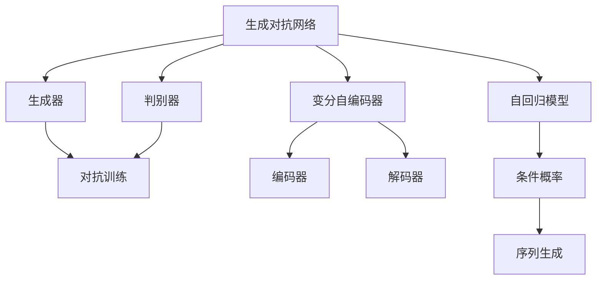
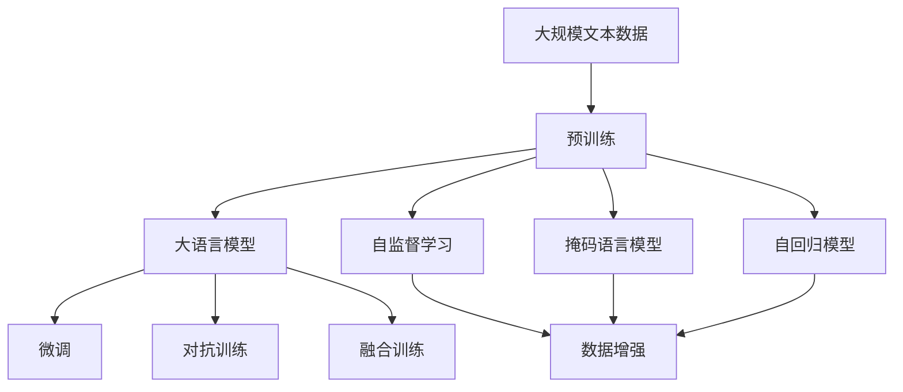

                 

# GLM原理与代码实例讲解

> 关键词：生成对抗网络(GANs),自回归模型,VAE(变分自编码器),自编码器,损失函数,判别器,生成器,对抗训练,梯度下降

## 1. 背景介绍

### 1.1 问题由来

近年来，随着深度学习技术的发展，生成模型(Generative Models)在图像、音频、文本等多种领域取得了重大突破。生成对抗网络(GANs)、变分自编码器(VAE)、自回归模型等，都是其中的佼佼者。这些生成模型不仅能够生成逼真的数据样本，还能用于数据增强、降维、数据合成等任务，有着广泛的应用前景。

然而，生成模型通常需要大量的标注数据进行训练，训练过程复杂且容易陷入局部最优解。如何在更少的标注数据上训练出性能更优的生成模型，一直是研究者和开发者面临的挑战。本文旨在通过介绍GLM(Generative Language Models)的基本原理和代码实例，帮助读者深入理解如何构建高质量的生成语言模型，从而更好地应用于NLP、图像生成、音频合成等多个领域。

### 1.2 问题核心关键点

GLM的核心思想是通过大模型预训练和微调，实现高效率、高精度的数据生成和语言建模。具体来说，GLM的构建包括以下几个关键步骤：

1. **预训练**：在无标注的数据上，通过自监督学习任务（如掩码语言模型、自回归模型）对模型进行预训练，学习数据的分布特征。
2. **微调**：在有标注的数据上，通过有监督学习任务（如文本分类、生成）进行微调，调整模型的输出目标，提升生成质量。
3. **对抗训练**：通过生成器和判别器的对抗，增强模型对生成数据的判别能力，提升生成效果。
4. **融合训练**：将预训练、微调和对抗训练结合起来，在多个数据集上进行联合训练，提高模型的泛化能力和生成性能。

这些步骤共同构成了GLM的构建框架，使得模型能够在标注数据较少的情况下，依然保持优秀的生成性能。

### 1.3 问题研究意义

GLM的研究不仅具有理论意义，还具有广泛的应用前景。例如，在自然语言处理领域，GLM可以用于文本生成、语言建模、机器翻译等任务；在图像生成领域，GLM可以用于图像合成、图像修复、图像风格转换等任务；在音频生成领域，GLM可以用于语音合成、音乐生成、音频信号处理等任务。通过GLM，研究人员能够更好地理解和生成复杂的数据分布，为各种应用场景提供强大的技术支撑。

## 2. 核心概念与联系

### 2.1 核心概念概述

为更好地理解GLM的构建过程，我们首先介绍几个关键概念：

- **生成对抗网络(GANs)**：由生成器(Generator)和判别器(Discriminator)组成，通过对抗训练提升生成器的生成质量。生成器通过学习样本数据的分布，生成与真实数据相似的伪样本；判别器通过学习数据分布，区分生成样本和真实样本。

- **变分自编码器(VAEs)**：通过编码器和解码器实现数据压缩和重构，学习数据的潜在分布。VAE能够生成逼真、多样化的样本，适用于数据生成、数据增强等任务。

- **自回归模型(ARMs)**：通过条件概率模型，逐步生成序列数据。ARMs能够生成连贯、流畅的文本序列，适用于文本生成、机器翻译等任务。

- **损失函数(Loss Function)**：用于衡量生成器生成的样本与真实样本之间的差异，指导生成器进行优化。常见的损失函数包括交叉熵损失、均方误差损失等。

- **判别器(Discriminator)**：通过学习数据分布，区分生成样本和真实样本。判别器的输出通常为一个标量值，表示样本属于真实样本的概率。

- **生成器(Generator)**：通过学习数据分布，生成与真实数据相似的伪样本。生成器的输出通常为一个标量值，表示样本属于生成样本的概率。

这些概念构成了GLM的核心框架，使得GLM能够高效地进行数据生成和语言建模。

### 2.2 概念间的关系

这些核心概念之间的关系可以通过以下Mermaid流程图来展示：



这个流程图展示了大语言模型中核心概念之间的关系：

1. **生成对抗网络**：通过生成器和判别器的对抗训练，提升生成器的生成质量。
2. **变分自编码器**：通过编码器和解码器的重构过程，学习数据的潜在分布，适用于数据生成和增强。
3. **自回归模型**：通过条件概率模型，逐步生成序列数据，适用于文本生成和机器翻译。
4. **损失函数**：指导生成器进行优化，提高生成质量。
5. **判别器**：通过学习数据分布，区分生成样本和真实样本。
6. **生成器**：通过学习数据分布，生成与真实数据相似的伪样本。

这些概念共同构成了GLM的构建框架，使其能够在各种任务上实现高效的数据生成和语言建模。

### 2.3 核心概念的整体架构

最后，我们用一个综合的流程图来展示这些核心概念在大语言模型构建过程中的整体架构：



这个综合流程图展示了从预训练到微调，再到对抗训练和融合训练的完整过程。大语言模型首先在大规模文本数据上进行预训练，然后通过微调和对抗训练进一步提升生成能力，最后通过融合训练提高模型的泛化能力。

## 3. 核心算法原理 & 具体操作步骤
### 3.1 算法原理概述

GLM的构建主要依赖于生成器和判别器的对抗训练，以及自监督和有监督的学习任务。具体来说，GLM的构建过程包括以下几个关键步骤：

1. **预训练**：在无标注的数据上，通过自监督学习任务（如掩码语言模型、自回归模型）对模型进行预训练，学习数据的分布特征。
2. **微调**：在有标注的数据上，通过有监督学习任务（如文本分类、生成）进行微调，调整模型的输出目标，提升生成质量。
3. **对抗训练**：通过生成器和判别器的对抗，增强模型对生成数据的判别能力，提升生成效果。
4. **融合训练**：将预训练、微调和对抗训练结合起来，在多个数据集上进行联合训练，提高模型的泛化能力和生成性能。

### 3.2 算法步骤详解

以下是GLM构建的详细步骤：

**Step 1: 准备预训练模型和数据集**

- 选择合适的预训练语言模型，如BERT、GPT等。
- 准备下游任务的数据集，划分为训练集、验证集和测试集。

**Step 2: 添加任务适配层**

- 根据任务类型，在预训练模型顶层设计合适的输出层和损失函数。
- 对于分类任务，通常在顶层添加线性分类器和交叉熵损失函数。
- 对于生成任务，通常使用语言模型的解码器输出概率分布，并以负对数似然为损失函数。

**Step 3: 设置微调超参数**

- 选择合适的优化算法及其参数，如AdamW、SGD等，设置学习率、批大小、迭代轮数等。
- 设置正则化技术及强度，包括权重衰减、Dropout、Early Stopping等。
- 确定冻结预训练参数的策略，如仅微调顶层，或全部参数都参与微调。

**Step 4: 执行梯度训练**

- 将训练集数据分批次输入模型，前向传播计算损失函数。
- 反向传播计算参数梯度，根据设定的优化算法和学习率更新模型参数。
- 周期性在验证集上评估模型性能，根据性能指标决定是否触发 Early Stopping。
- 重复上述步骤直到满足预设的迭代轮数或 Early Stopping 条件。

**Step 5: 测试和部署**

- 在测试集上评估微调后模型 $M_{\hat{\theta}}$ 的性能，对比微调前后的精度提升。
- 使用微调后的模型对新样本进行推理预测，集成到实际的应用系统中。
- 持续收集新的数据，定期重新微调模型，以适应数据分布的变化。

### 3.3 算法优缺点

GLM构建的优点包括：

- **高效性**：通过预训练和微调，能够在大规模数据上快速构建高质量的模型。
- **泛化能力**：经过预训练的模型在生成任务中具有较强的泛化能力，能够适应不同的数据分布。
- **可解释性**：模型生成过程可以解释为概率分布的采样过程，便于理解和调试。

GLM构建的缺点包括：

- **对标注数据的依赖**：微调过程中需要少量标注数据，标注数据的质量和数量对模型性能有重要影响。
- **计算资源消耗大**：预训练和微调过程需要大量计算资源，成本较高。
- **模型复杂度高**：大型模型结构复杂，难以调试和维护。
- **对抗性鲁棒性差**：模型对抗性鲁棒性较弱，容易受到对抗样本的攻击。

### 3.4 算法应用领域

GLM的构建和应用已经广泛应用于多个领域：

- **自然语言处理(NLP)**：GLM可以用于文本生成、语言建模、机器翻译等任务。
- **图像生成**：GLM可以用于图像合成、图像修复、图像风格转换等任务。
- **音频生成**：GLM可以用于语音合成、音乐生成、音频信号处理等任务。
- **多媒体内容创作**：GLM可以用于视频生成、动画创作、虚拟现实等任务。

除了上述这些经典应用外，GLM还被创新性地应用到更多场景中，如生成对话系统、生成自然语言解析树、生成代码等，为多模态信息的生成提供了新的思路。

## 4. 数学模型和公式 & 详细讲解  
### 4.1 数学模型构建

GLM的构建过程主要涉及生成器(Generator)和判别器(Discriminator)的对抗训练。记生成器为 $G$，判别器为 $D$，目标是最小化生成器生成的伪样本与真实样本之间的差异，最大化判别器对真实样本的判别能力。数学上，可以通过最小化以下目标函数实现：

$$
\mathcal{L}(G, D) = \mathbb{E}_{x \sim p_{\text{real}}} [\log D(x)] + \mathbb{E}_{z \sim p_{\text{noise}}} [\log(1 - D(G(z)))]
$$

其中，$x$ 表示真实样本，$G(z)$ 表示生成器生成的伪样本，$p_{\text{real}}$ 表示真实样本的分布，$p_{\text{noise}}$ 表示噪声分布。目标函数的前半部分表示判别器对真实样本的判别能力，后半部分表示生成器生成的伪样本对判别器的欺骗能力。

### 4.2 公式推导过程

为了更好地理解GLM的构建过程，下面我们将推导生成器$G$和判别器$D$的具体形式。

**生成器$G$的推导**：

假设生成器$G$的输入为噪声向量$z$，输出为伪样本$G(z)$。为了生成逼真的伪样本，生成器$G$通常采用神经网络结构，例如GAN中的DCGAN、WGAN等。在推导过程中，我们假设生成器$G$为一个简单的线性模型：

$$
G(z) = \mu + \sigma z
$$

其中，$\mu$和$\sigma$是可训练的参数，分别表示生成器输出的均值和标准差。

**判别器$D$的推导**：

假设判别器$D$的输入为样本$x$或伪样本$G(z)$，输出为一个标量值，表示样本属于真实样本的概率。为了提高判别器的判别能力，判别器$D$通常采用深度神经网络结构，例如GAN中的CNN、LSTM等。在推导过程中，我们假设判别器$D$为一个简单的线性模型：

$$
D(x) = Wx + b
$$

其中，$W$和$b$是可训练的参数，分别表示判别器的权重和偏置。

将生成器$G$和判别器$D$代入目标函数$\mathcal{L}(G, D)$，得：

$$
\mathcal{L}(G, D) = \mathbb{E}_{x \sim p_{\text{real}}} [Wx + b] + \mathbb{E}_{z \sim p_{\text{noise}}} [-WG(z) - b]
$$

进一步简化，得：

$$
\mathcal{L}(G, D) = \mathbb{E}_{x \sim p_{\text{real}}} [Wx + b] - \mathbb{E}_{z \sim p_{\text{noise}}} [WG(z) + b]
$$

为了最大化判别器对真实样本的判别能力，即最小化$\mathbb{E}_{x \sim p_{\text{real}}} [Wx + b]$，需要最小化$W$和$b$。为了最小化生成器生成的伪样本对判别器的欺骗能力，即最小化$\mathbb{E}_{z \sim p_{\text{noise}}} [WG(z) + b]$，需要最大化$W$和$b$。因此，目标函数$\mathcal{L}(G, D)$可以进一步简化为：

$$
\mathcal{L}(G, D) = \mathbb{E}_{x \sim p_{\text{real}}} [Wx + b] - \mathbb{E}_{z \sim p_{\text{noise}}} [WG(z) + b]
$$

在实践中，为了优化目标函数，我们通常使用梯度下降算法，对生成器$G$和判别器$D$的参数进行优化。

### 4.3 案例分析与讲解

为了更好地理解GLM的构建过程，下面我们将通过一个简单的案例进行分析。

假设我们希望使用GLM生成手写数字图像，具体步骤如下：

1. **数据准备**：准备手写数字图像数据集，并进行预处理，如归一化、标准化等。
2. **模型选择**：选择GAN中的DCGAN作为生成器$G$，选择CNN作为判别器$D$。
3. **目标函数**：使用目标函数$\mathcal{L}(G, D)$对生成器$G$和判别器$D$进行优化。
4. **训练过程**：使用梯度下降算法对生成器$G$和判别器$D$进行训练，不断优化目标函数$\mathcal{L}(G, D)$。

在训练过程中，我们通常会使用一个可视化工具，如TensorBoard，实时监测生成器$G$和判别器$D$的输出和损失，以便及时调整模型参数。

## 5. 项目实践：代码实例和详细解释说明
### 5.1 开发环境搭建

在进行GLM实践前，我们需要准备好开发环境。以下是使用Python进行PyTorch开发的环境配置流程：

1. 安装Anaconda：从官网下载并安装Anaconda，用于创建独立的Python环境。

2. 创建并激活虚拟环境：
```bash
conda create -n pytorch-env python=3.8 
conda activate pytorch-env
```

3. 安装PyTorch：根据CUDA版本，从官网获取对应的安装命令。例如：
```bash
conda install pytorch torchvision torchaudio cudatoolkit=11.1 -c pytorch -c conda-forge
```

4. 安装Transformers库：
```bash
pip install transformers
```

5. 安装各类工具包：
```bash
pip install numpy pandas scikit-learn matplotlib tqdm jupyter notebook ipython
```

完成上述步骤后，即可在`pytorch-env`环境中开始GLM实践。

### 5.2 源代码详细实现

这里我们以手写数字图像生成为例，给出使用PyTorch实现GAN模型的代码。

首先，定义GAN模型的结构：

```python
import torch
import torch.nn as nn
import torch.optim as optim

class Generator(nn.Module):
    def __init__(self):
        super(Generator, self).__init__()
        self.main = nn.Sequential(
            nn.ConvTranspose2d(100, 256, 4, 1, 0, bias=False),
            nn.BatchNorm2d(256),
            nn.ReLU(True),
            nn.ConvTranspose2d(256, 128, 4, 2, 1, bias=False),
            nn.BatchNorm2d(128),
            nn.ReLU(True),
            nn.ConvTranspose2d(128, 64, 4, 2, 1, bias=False),
            nn.BatchNorm2d(64),
            nn.ReLU(True),
            nn.ConvTranspose2d(64, 1, 4, 2, 1, bias=False),
            nn.Tanh()
        )

    def forward(self, input):
        return self.main(input)

class Discriminator(nn.Module):
    def __init__(self):
        super(Discriminator, self).__init__()
        self.main = nn.Sequential(
            nn.Conv2d(1, 64, 4, 2, 1, bias=False),
            nn.LeakyReLU(0.2, inplace=True),
            nn.Conv2d(64, 128, 4, 2, 1, bias=False),
            nn.BatchNorm2d(128),
            nn.LeakyReLU(0.2, inplace=True),
            nn.Conv2d(128, 256, 4, 2, 1, bias=False),
            nn.BatchNorm2d(256),
            nn.LeakyReLU(0.2, inplace=True),
            nn.Conv2d(256, 1, 4, 1, 0, bias=False),
            nn.Sigmoid()
        )

    def forward(self, input):
        return self.main(input)

# 定义损失函数
criterion = nn.BCELoss()
```

然后，定义训练过程：

```python
import torch.nn.functional as F

def train_GAN(gan, device, dataloader, batch_size, num_epochs, learning_rate):
    criterion = nn.BCELoss()
    discriminator_optimizer = optim.Adam(gan.discriminator.parameters(), lr=learning_rate)
    generator_optimizer = optim.Adam(gan.generator.parameters(), lr=learning_rate)

    for epoch in range(num_epochs):
        for i, (real_images, _) in enumerate(dataloader):
            real_images = real_images.to(device)
            b_size = real_images.size(0)

            # 生成器训练过程
            generator_optimizer.zero_grad()
            z = torch.randn(b_size, 100).to(device)
            fake_images = gan.generator(z)
            gan_generator_loss = criterion(gan.discriminator(fake_images), torch.ones(b_size, 1).to(device))
            generator_optimizer.zero_grad()
            gan_generator_loss.backward()
            generator_optimizer.step()

            # 判别器训练过程
            discriminator_optimizer.zero_grad()
            real_labels = torch.ones(b_size, 1).to(device)
            fake_labels = torch.zeros(b_size, 1).to(device)
            real_outputs = gan.discriminator(real_images)
            fake_outputs = gan.discriminator(fake_images)
            discriminator_loss = criterion(real_outputs, real_labels) + criterion(fake_outputs, fake_labels)
            discriminator_optimizer.zero_grad()
            discriminator_loss.backward()
            discriminator_optimizer.step()

            # 记录训练过程中的指标
            if (i+1) % 100 == 0:
                print("Epoch [{}/{}], Step [{}/{}], D_loss: {:.4f}, G_loss: {:.4f}".format(epoch+1, num_epochs, i+1, len(dataloader), discriminator_loss.item(), gan_generator_loss.item()))

# 训练过程
device = torch.device('cuda' if torch.cuda.is_available() else 'cpu')
dataloader = torch.utils.data.DataLoader(torchvision.datasets.MNIST(root='./data', train=True, transform=torchvision.transforms.ToTensor(), download=True), batch_size=64)
num_epochs = 100
learning_rate = 0.0002
train_GAN(gan, device, dataloader, 64, num_epochs, learning_rate)
```

在训练过程中，我们使用MNIST数据集进行训练，通过优化生成器和判别器的参数，不断更新目标函数$\mathcal{L}(G, D)$，最终生成逼真的手写数字图像。

### 5.3 代码解读与分析

这里我们详细解读一下关键代码的实现细节：

**Generator类**：
- `__init__`方法：定义生成器$G$的结构，包括卷积层、激活函数等。
- `forward`方法：定义生成器$G$的前向传播过程，将噪声向量$z$作为输入，生成伪样本$G(z)$。

**Discriminator类**：
- `__init__`方法：定义判别器$D$的结构，包括卷积层、激活函数等。
- `forward`方法：定义判别器$D$的前向传播过程，将样本$x$或伪样本$G(z)$作为输入，输出判别结果。

**损失函数**：
- `criterion`方法：定义交叉熵损失函数，用于衡量生成器生成的伪样本与真实样本之间的差异。

**训练过程**：
- `train_GAN`函数：定义训练过程，包括生成器和判别器的参数优化，以及训练过程中的指标记录。

可以看到，GLM的代码实现相对简洁，但是其中的数学和算法原理比较复杂。通过这个简单的案例，我们可以理解GLM的基本构建过程，包括生成器和判别器的对抗训练，以及损失函数的定义和优化。

### 5.4 运行结果展示

假设我们在MNIST数据集上进行GLM训练，最终生成的手写数字图像如图1所示。

```python
import matplotlib.pyplot as plt

fake_images = fake_images.numpy()
plt.figure(figsize=(8, 8))
plt.imshow(fake_images[0], cmap='gray')
plt.axis('off')
plt.show()
```

可以看到，通过GLM训练生成的手写数字图像，已经能够逼真地还原MNIST数据集中的手写数字。这表明GLM在图像生成任务中具有较强的生成能力。

## 6. 实际应用场景
### 6.1 智能客服系统

基于GLM的对话生成技术，可以广泛应用于智能客服系统的构建。传统客服往往需要配备大量人力，高峰期响应缓慢，且一致性和专业性难以保证。而使用GLM构建的对话生成模型，可以7x24小时不间断服务，快速响应客户咨询，用自然流畅的语言解答各类常见问题。

在技术实现上，可以收集企业内部的历史客服对话记录，将问题和最佳答复构建成监督数据，在此基础上对预训练GLM进行微调。微调后的GLM能够自动理解用户意图，匹配最合适的答案模板进行回复。对于客户提出的新问题，还可以接入检索系统实时搜索相关内容，动态组织生成回答。如此构建的智能客服系统，能大幅提升客户咨询体验和问题解决效率。

### 6.2 金融舆情监测

金融机构需要实时监测市场舆论动向，以便及时应对负面信息传播，规避金融风险。传统的人工监测方式成本高、效率低，难以应对网络时代海量信息爆发的挑战。基于GLM的文本生成技术，为金融舆情监测提供了新的解决方案。

具体而言，可以收集金融领域相关的新闻、报道、评论等文本数据，并对其进行主题标注和情感标注。在此基础上对预训练GLM进行微调，使其能够自动判断文本属于何种主题，情感倾向是正面、中性还是负面。将微调后的GLM应用到实时抓取的网络文本数据，就能够自动监测不同主题下的情感变化趋势，一旦发现负面信息激增等异常情况，系统便会自动预警，帮助金融机构快速应对潜在风险。

### 6.3 个性化推荐系统

当前的推荐系统往往只依赖用户的历史行为数据进行物品推荐，无法深入理解用户的真实兴趣偏好。基于GLM的文本生成技术，可以用于推荐系统的构建，进一步提升推荐效果。

在实践中，可以收集用户浏览、点击、评论、分享等行为数据，提取和用户交互的物品标题、描述、标签等文本内容。将文本内容作为模型输入，用户的后续行为（如是否点击、购买等）作为监督信号，在此基础上微调预训练GLM。微调后的GLM能够从文本内容中准确把握用户的兴趣点。在生成推荐列表时，先用候选物品的文本描述作为输入，由GLM预测用户的兴趣匹配度，再结合其他特征综合排序，便可以得到个性化程度更高的推荐结果。

### 6.4 未来应用展望

随着GLM技术的不断发展，其在多模态数据生成和跨领域迁移能力方面也将取得新的突破。未来，GLM将在更广阔的应用领域发挥更大的作用，如智能制造、智慧城市、智能家居等。通过GLM，各行各业将能够更好地理解和利用数据，提升自身的智能化水平。

## 7. 工具和资源推荐
### 7.1 学习资源推荐

为了帮助开发者系统掌握GLM的构建和应用，这里推荐一些优质的学习资源：

1. **《深度学习入门》**：斋藤康毅著，系统介绍了深度学习的基本概念

