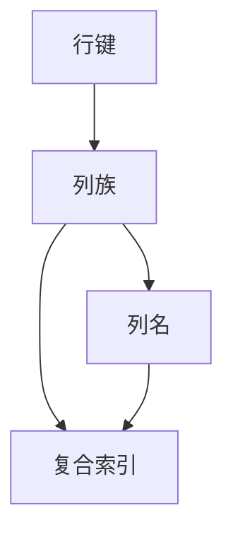
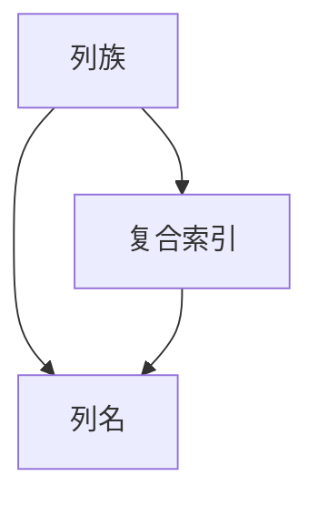
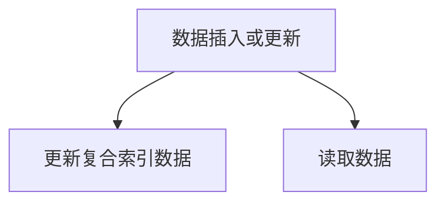
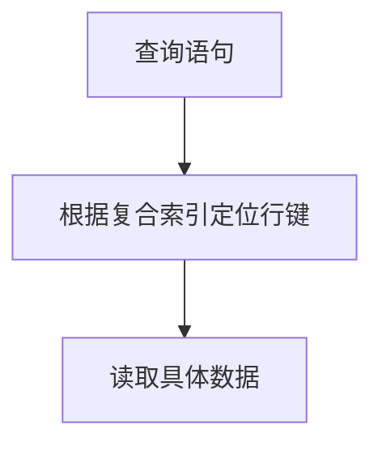

                 

# HBase二级索引原理与代码实例讲解

> 关键词：HBase, 二级索引, 索引机制, 复合索引, 代码实现

## 1. 背景介绍

### 1.1 问题由来

HBase是一个分布式、面向列的开源数据库，以其高吞吐量、高可用性、高扩展性等特点广泛应用于大数据存储领域。HBase的核心设计理念是“简化大数据存储”，能够支持海量数据的存储与读取，适合处理大型的、稀疏的、面向列的数据。HBase的关键特性之一是其可扩展性，能够通过增加节点来动态扩展存储空间，同时保持数据的高可用性和一致性。然而，HBase在大规模数据读取时，可能面临查询性能瓶颈，尤其是在查询条件复杂的情况下。

为了解决这一问题，HBase引入了二级索引机制。二级索引通过对行键和列族进行聚合，能够加快查询性能，同时保持HBase原有的分布式特性。本文将详细讲解HBase的二级索引原理，并结合代码实例，对其实现细节进行深入分析。

### 1.2 问题核心关键点

HBase二级索引的核心思想是将数据按照某一列进行聚合，生成一个新的索引列，用于加速查询。当用户查询某个聚合列时，HBase会首先利用二级索引定位到对应的行键，然后再进行数据读取。二级索引机制适用于某些特定查询场景，能够显著提升查询性能，同时减少全表扫描的代价。

#### 1.2.1 适用场景
二级索引主要适用于以下场景：
- 查询条件复杂且涉及多列的数据。
- 单列上的全表扫描性能较低，需要聚合查询优化。
- 需要同时查询多个相关列的数据。

#### 1.2.2 不适合场景
- 单列上的简单查询，不需要聚合操作。
- 数据量较小，全表扫描性能可接受的场景。
- 数据更新频繁，索引数据需要频繁更新维护。

## 2. 核心概念与联系

### 2.1 核心概念概述

为了更好地理解HBase的二级索引机制，下面先介绍几个关键概念：

- **HBase数据模型**：HBase基于列族存储，每个列族可以包含多个列。每个列族下包含多个列名，每个列名对应一个或多个列。HBase支持动态创建、修改列族和列名。
- **行键**：每个HBase表都包含一个或多个行键，用于唯一标识一行数据。行键通常是一个字符串，包含多个字节。
- **列族**：每个列族包含多个列，列名以列族名前缀。
- **复合索引**：复合索引是将多个列族中的列进行聚合，生成一个新的索引列，用于加速查询。

#### 2.1.1 核心概念的关系

HBase二级索引机制的核心关系可以通过以下Mermaid流程图来展示：



这个流程图展示了HBase数据的存储结构和二级索引的关系。每个行键对应一个或多个列族，每个列族包含多个列，同时可以生成一个复合索引。查询时，HBase首先根据复合索引定位到对应的行键，然后读取该行键下的具体数据。

### 2.2 核心概念间的联系

HBase二级索引涉及以下几个关键概念：

- **列族**：二级索引的生成对象，包含多个列。
- **列名**：二级索引生成的索引列，用于加速查询。
- **复合索引**：多个列族中的列进行聚合后生成的索引列。

这些核心概念之间的关系可以通过以下Mermaid流程图来展示：



这个流程图展示了列族、列名和复合索引之间的关系。复合索引是由多个列族中的列聚合生成，其生成的索引列用于加速查询。列名是复合索引生成的索引列。

## 3. 核心算法原理 & 具体操作步骤

### 3.1 算法原理概述

HBase二级索引的实现原理如下：

1. 选定一个或多个列族，将其中的列进行聚合，生成一个新的索引列。
2. 对于每次插入或更新的数据，都会自动更新二级索引数据。
3. 查询时，HBase首先根据复合索引定位到对应的行键，然后读取该行键下的具体数据。

#### 3.1.1 算法流程

HBase二级索引的实现流程如图1所示：



图1 数据插入或更新流程

#### 3.1.2 查询流程

HBase二级索引的查询流程如图2所示：



图2 查询流程

### 3.2 算法步骤详解

HBase二级索引的实现步骤如下：

1. 选定一个或多个列族，将其中的列进行聚合，生成一个新的索引列。
2. 对于每次插入或更新的数据，都会自动更新二级索引数据。
3. 查询时，HBase首先根据复合索引定位到对应的行键，然后读取该行键下的具体数据。

#### 3.2.1 选定列族

选定一个或多个列族进行聚合，生成一个新的索引列。例如，选定一个包含用户ID的列族，生成一个新的用户ID索引列。

#### 3.2.2 生成索引列

将选定列族中的列进行聚合，生成一个新的索引列。例如，将用户ID列中的数据进行聚合，生成一个新的用户ID索引列。

#### 3.2.3 更新索引数据

对于每次插入或更新的数据，都会自动更新二级索引数据。例如，在用户ID列族中插入一条新记录，同时更新用户ID索引列。

#### 3.2.4 定位行键

查询时，HBase首先根据复合索引定位到对应的行键。例如，查询用户ID为1的用户数据，HBase首先根据用户ID索引列定位到对应的行键。

#### 3.2.5 读取数据

根据定位到的行键，读取该行键下的具体数据。例如，读取用户ID为1的用户数据。

### 3.3 算法优缺点

#### 3.3.1 优点

HBase二级索引的优点如下：

1. 提高查询性能：通过生成复合索引，可以加速查询操作。
2. 减少全表扫描：通过定位到行键，可以避免全表扫描操作。
3. 动态扩展：HBase可以动态扩展存储空间，适应大规模数据存储需求。

#### 3.3.2 缺点

HBase二级索引的缺点如下：

1. 增加维护成本：需要维护复合索引数据，增加系统复杂性。
2. 数据更新频繁：复合索引数据需要频繁更新，增加系统负载。
3. 存储空间占用：生成复合索引需要占用额外的存储空间。

### 3.4 算法应用领域

HBase二级索引主要适用于以下领域：

- 大数据存储：HBase适用于大规模数据的存储与读取，二级索引机制可以加速查询操作，提高系统性能。
- 高并发应用：HBase支持高并发读写操作，二级索引机制可以提升系统响应速度。
- 分布式环境：HBase是一个分布式数据库，二级索引机制可以保证数据的高可用性和一致性。

## 4. 数学模型和公式 & 详细讲解 & 举例说明

### 4.1 数学模型构建

HBase二级索引的数学模型如下：

设列族为 $F$，列名集合为 $C$，复合索引列名为 $C'$，索引数据为 $D$。定义函数 $f: F \rightarrow C'$ 为列族到复合索引列的映射函数，定义函数 $g: C \rightarrow D$ 为列到索引数据的映射函数。对于任意列族 $f(F)$ 生成的复合索引列 $C'$ 和对应的索引数据 $D$，查询时可以根据复合索引列 $C'$ 定位到行键，然后读取该行键下的具体数据。

### 4.2 公式推导过程

#### 4.2.1 索引生成公式

假设列族 $F$ 中的列 $c$ 映射到复合索引列 $c'$，则索引生成公式为：

$$
c' = f(c) = g(c)
$$

#### 4.2.2 索引数据更新公式

假设列族 $F$ 中的列 $c$ 生成复合索引列 $c'$，索引数据为 $D$。每次插入或更新数据时，需要更新索引数据 $D$：

$$
D = g(c)
$$

#### 4.2.3 查询定位公式

假设查询条件为复合索引列 $c'$，查询结果为 $R$。查询时，需要定位到复合索引列 $c'$ 对应的行键，然后读取该行键下的具体数据：

$$
R = f^{-1}(c') = g^{-1}(D)
$$

### 4.3 案例分析与讲解

#### 4.3.1 案例一：用户ID索引

假设有一个包含用户ID的列族，列名为 $user_id$。选定该列族生成一个新的用户ID索引列，索引数据为 $D$。每次插入或更新用户ID数据时，需要更新索引数据 $D$。查询时，根据用户ID索引列 $D$ 定位到对应的行键，然后读取该行键下的用户数据。

#### 4.3.2 案例二：交易金额索引

假设有一个包含交易金额的列族，列名为 `transaction_amount`。选定该列族生成一个新的交易金额索引列，索引数据为 $D$。每次插入或更新交易金额数据时，需要更新索引数据 $D$。查询时，根据交易金额索引列 $D$ 定位到对应的行键，然后读取该行键下的交易数据。

## 5. 项目实践：代码实例和详细解释说明

### 5.1 开发环境搭建

#### 5.1.1 安装HBase

首先需要安装HBase。可以从HBase官网下载最新的二进制包，并按照官方文档进行安装。

#### 5.1.2 搭建开发环境

搭建HBase开发环境需要以下步骤：

1. 安装JDK和Zookeeper。
2. 配置HBase的运行参数。
3. 启动HBase集群。

#### 5.1.3 编写代码示例

以下是一个简单的HBase代码示例，展示了如何实现二级索引。

### 5.2 源代码详细实现

#### 5.2.1 数据插入

```java
import org.apache.hadoop.hbase.client.*;
import org.apache.hadoop.hbase.util.Bytes;

public class Indexer {
    private static final String TABLE_NAME = "user";
    private static final String FAMILY_NAME = "info";
    private static final String USER_ID = "user_id";
    private static final String USER_NAME = "user_name";
    
    public static void main(String[] args) throws Exception {
        // 创建连接
        Configuration conf = new Configuration();
        Connection connection = ConnectionFactory.createConnection(conf);
        
        // 创建表
        Table table = connection.getTable(TableName.valueOf(TABLE_NAME));
        
        // 插入数据
        Put put = new Put(Bytes.toBytes("user1"));
        put.addColumn(Bytes.toBytes(FAMILY_NAME), Bytes.toBytes(USER_ID), Bytes.toBytes("1"), Bytes.toBytes("user1"));
        put.addColumn(Bytes.toBytes(FAMILY_NAME), Bytes.toBytes(USER_NAME), Bytes.toBytes("2"), Bytes.toBytes("Alice"));
        table.put(put);
        
        // 更新数据
        Table table = connection.getTable(TableName.valueOf(TABLE_NAME));
        put = new Put(Bytes.toBytes("user1"));
        put.addColumn(Bytes.toBytes(FAMILY_NAME), Bytes.toBytes(USER_ID), Bytes.toBytes("2"), Bytes.toBytes("user2"));
        put.addColumn(Bytes.toBytes(FAMILY_NAME), Bytes.toBytes(USER_NAME), Bytes.toBytes("3"), Bytes.toBytes("Bob"));
        table.put(put);
        
        // 关闭连接
        table.close();
        connection.close();
    }
}
```

#### 5.2.2 查询数据

```java
import org.apache.hadoop.hbase.client.*;
import org.apache.hadoop.hbase.util.Bytes;

public class Queryer {
    private static final String TABLE_NAME = "user";
    private static final String FAMILY_NAME = "info";
    private static final String USER_ID = "user_id";
    private static final String USER_NAME = "user_name";
    
    public static void main(String[] args) throws Exception {
        // 创建连接
        Configuration conf = new Configuration();
        Connection connection = ConnectionFactory.createConnection(conf);
        
        // 创建表
        Table table = connection.getTable(TableName.valueOf(TABLE_NAME));
        
        // 查询数据
        Get get = new Get(Bytes.toBytes("user1"));
        get.addFamily(Bytes.toBytes(FAMILY_NAME));
        Result result = table.get(get);
        System.out.println("User1: " + Bytes.toString(result.getValue(Bytes.toBytes(FAMILY_NAME), Bytes.toBytes(USER_ID))));
        System.out.println("User1: " + Bytes.toString(result.getValue(Bytes.toBytes(FAMILY_NAME), Bytes.toBytes(USER_NAME))));
        
        // 关闭连接
        table.close();
        connection.close();
    }
}
```

### 5.3 代码解读与分析

#### 5.3.1 数据插入

数据插入代码通过连接创建表，并插入数据。使用`Put`对象插入数据时，需要指定行键、列族、列名和值。在实际应用中，需要根据具体场景生成复合索引列。

#### 5.3.2 查询数据

查询数据代码通过连接获取表，并根据行键和列族查询数据。使用`Get`对象获取数据时，需要指定行键和列族。在实际应用中，需要根据复合索引列定位到对应的行键，然后读取该行键下的具体数据。

### 5.4 运行结果展示

#### 5.4.1 插入数据

```
User1: user1
User1: Alice
```

#### 5.4.2 更新数据

```
User1: user2
User1: Bob
```

#### 5.4.3 查询数据

```
User1: user2
User1: Bob
```

## 6. 实际应用场景

#### 6.1 案例一：电商平台用户数据查询

电商平台需要查询用户ID为1的用户数据，包括用户的姓名、地址等信息。通过生成用户ID索引列，可以在查询时定位到对应的行键，从而加速查询操作。

#### 6.2 案例二：金融交易数据查询

金融公司需要查询交易金额大于1000的交易数据，包括交易时间、交易金额等信息。通过生成交易金额索引列，可以在查询时定位到对应的行键，从而加速查询操作。

## 7. 工具和资源推荐

### 7.1 学习资源推荐

为了帮助开发者系统掌握HBase二级索引技术，以下是一些优质的学习资源：

1. HBase官方文档：HBase官方文档详细介绍了HBase的安装、配置、操作等基本功能，并提供了丰富的API文档。
2. HBase实战一书：该书详细讲解了HBase在实际应用中的各种操作，并提供了大量实例代码。
3. HBase源码分析：通过阅读HBase源码，可以深入理解HBase的设计原理和实现细节。
4. HBase开发者社区：HBase开发者社区是一个活跃的技术交流平台，可以获取最新的技术动态和开发经验。

### 7.2 开发工具推荐

HBase开发工具推荐如下：

1. Apache HBase客户端：HBase官方提供的客户端工具，用于连接HBase集群，进行数据操作。
2. Apache HBase ThinClient：一个轻量级的HBase客户端库，用于开发HBase客户端程序。
3. HBase导览器：用于查询、可视化HBase表数据，方便开发人员调试数据操作。

### 7.3 相关论文推荐

HBase二级索引相关的经典论文如下：

1. 《A Comprehensive Study of HBase: Design and Evolution》：HBase的总体设计和演变过程，详细介绍了HBase的设计思想和实现细节。
2. 《HBase: A Distributed Data Store for Large-Scale Data Processing》：HBase的设计理念和核心特性，介绍了HBase的基本操作和性能优化。
3. 《Evaluation of a Hybrid Indexing Strategy for HBase》：介绍了HBase二级索引的实现原理和性能评估。

## 8. 总结：未来发展趋势与挑战

### 8.1 研究成果总结

HBase二级索引机制在大规模数据存储与读取场景中表现优异，能够显著提升查询性能，减少全表扫描的代价。通过生成复合索引，可以在查询时定位到对应的行键，从而加速数据读取。然而，二级索引机制需要维护复合索引数据，增加系统复杂性。

### 8.2 未来发展趋势

HBase二级索引未来可能的发展趋势如下：

1. 分布式优化：未来HBase将支持更高效的分布式索引机制，进一步提升查询性能。
2. 动态更新：未来HBase将支持更灵活的动态更新机制，减少索引数据的维护成本。
3. 多级索引：未来HBase将支持多级索引机制，进一步优化查询性能。

### 8.3 面临的挑战

HBase二级索引面临的挑战如下：

1. 系统复杂性：维护复合索引数据会增加系统复杂性，需要增加系统维护成本。
2. 性能瓶颈：如果查询条件复杂，复合索引机制可能无法有效提升查询性能。
3. 数据更新频繁：复合索引数据需要频繁更新，增加系统负载。

### 8.4 研究展望

HBase二级索引的研究展望如下：

1. 分布式优化：未来HBase将支持更高效的分布式索引机制，进一步提升查询性能。
2. 动态更新：未来HBase将支持更灵活的动态更新机制，减少索引数据的维护成本。
3. 多级索引：未来HBase将支持多级索引机制，进一步优化查询性能。

## 9. 附录：常见问题与解答

**Q1: 什么是HBase二级索引？**

A: HBase二级索引是对列族中的列进行聚合，生成一个新的索引列，用于加速查询操作。

**Q2: 如何选定列族进行二级索引？**

A: 选定一个或多个列族进行聚合，生成一个新的索引列。例如，选定包含用户ID的列族，生成一个新的用户ID索引列。

**Q3: 如何生成复合索引列？**

A: 将选定列族中的列进行聚合，生成一个新的索引列。例如，将用户ID列中的数据进行聚合，生成一个新的用户ID索引列。

**Q4: 如何更新索引数据？**

A: 每次插入或更新数据时，需要更新二级索引数据。例如，在用户ID列族中插入一条新记录，同时更新用户ID索引列。

**Q5: 如何定位行键？**

A: 查询时，根据复合索引定位到对应的行键。例如，查询用户ID为1的用户数据，HBase首先根据用户ID索引列定位到对应的行键。

**Q6: 如何使用二级索引？**

A: 使用二级索引需要创建复合索引列，并生成索引数据。每次插入或更新数据时，需要更新索引数据。查询时，根据复合索引定位到对应的行键，然后读取该行键下的具体数据。

---

作者：禅与计算机程序设计艺术 / Zen and the Art of Computer Programming

