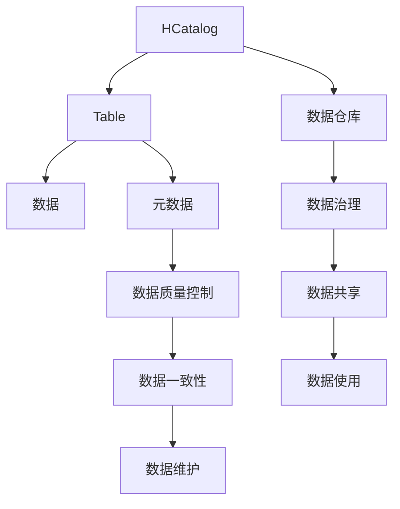

                 

# HCatalog Table原理与代码实例讲解

> 关键词：HCatalog, Table, 数据仓库, 数据管理, 数据库, 数据治理

## 1. 背景介绍

在现代数据驱动的商业环境中，企业面临着海量数据的快速增长和复杂的数据处理需求。传统的数据仓库系统虽然能够存储和管理数据，但在数据治理、数据质量、数据共享等方面存在诸多挑战。为了应对这些挑战，企业逐渐引入HCatalog，这是一个开源数据治理系统，提供了一种数据管理的新范式，通过元数据驱动的方式，实现数据仓库的高效管理和优化。其中，HCatalog Table是HCatalog中的一个重要组件，用于创建和管理数据仓库中的数据表，是数据管理的基础设施之一。

本文将从原理和实现两方面详细介绍HCatalog Table，通过具体的代码实例讲解其应用和开发实践，帮助读者深入理解其工作原理和使用方法。

## 2. 核心概念与联系

### 2.1 核心概念概述

为了更好地理解HCatalog Table的原理，我们先来介绍几个关键概念：

- **HCatalog**：Apache Hadoop生态系统中的一个开源数据治理框架，用于管理和优化大数据生态系统的数据。
- **Table**：HCatalog中的数据表，是数据仓库的基础，用于存储和管理数据。
- **数据仓库**：企业级数据存储和管理的基础设施，用于集中管理和共享数据。
- **元数据**：关于数据的数据，包括数据仓库的结构、数据的质量、数据的关系等信息。
- **数据治理**：通过元数据管理和数据质量控制，确保数据的一致性和可靠性，提升数据价值。

这些概念构成了HCatalog Table的核心框架，通过元数据驱动的方式，实现了数据仓库的高效管理和优化。

### 2.2 核心概念之间的关系

我们可以通过以下Mermaid流程图来展示这些核心概念之间的关系：



这个流程图展示了HCatalog Table在数据仓库系统中的位置和作用，以及其与元数据、数据治理等相关概念的联系。

## 3. 核心算法原理 & 具体操作步骤
### 3.1 算法原理概述

HCatalog Table的实现基于Apache Hadoop生态系统，利用分布式计算和存储能力，实现了大规模数据仓库的构建和管理。其核心算法原理包括：

1. **分布式存储和计算**：利用Hadoop分布式文件系统（HDFS）和MapReduce框架，实现了数据的分布式存储和计算。
2. **元数据管理**：通过HCatalog的元数据管理系统，记录和更新数据表的元数据信息，确保数据的一致性和可靠性。
3. **数据共享和访问控制**：通过HCatalog Table的数据共享和访问控制机制，实现数据的安全管理和多用户的协作使用。

### 3.2 算法步骤详解

下面详细讲解HCatalog Table的实现步骤：

1. **创建数据表**：通过HCatalog Table创建接口，定义数据表的结构和元数据信息。例如，创建包含用户、订单和商品的数据表，定义其结构如下：

```python
from pyspark.sql import SparkSession

spark = SparkSession.builder.appName("HCatalog Table").getOrCreate()

# 创建数据表
spark.createTable(
    spark.sql("CREATE TABLE orders (order_id INT, user_id INT, order_date STRING, amount DOUBLE)")
)
```

2. **插入数据**：通过HCatalog Table的插入接口，向数据表中插入数据。例如，插入一批订单数据：

```python
# 插入数据
spark.sql("INSERT INTO orders VALUES (1, 1001, '2022-01-01', 500.0), (2, 1002, '2022-01-02', 300.0)")
```

3. **查询数据**：通过HCatalog Table的查询接口，检索数据表中的数据。例如，查询所有订单信息：

```python
# 查询数据
spark.sql("SELECT * FROM orders")
```

4. **数据统计**：通过HCatalog Table的统计接口，对数据表进行统计分析。例如，统计订单总额和订单数量：

```python
# 数据统计
spark.sql("SELECT SUM(amount) AS total_amount, COUNT(*) AS order_count FROM orders GROUP BY order_date")
```

5. **数据更新**：通过HCatalog Table的更新接口，修改数据表中的数据。例如，将某个订单的金额更新为1000：

```python
# 数据更新
spark.sql("UPDATE orders SET amount = 1000 WHERE order_id = 1")
```

### 3.3 算法优缺点

**优点**：

1. **高效的数据管理和优化**：通过元数据驱动的方式，实现数据仓库的高效管理和优化。
2. **分布式计算和存储**：利用Hadoop分布式计算和存储能力，支持大规模数据的处理和管理。
3. **灵活的数据治理**：通过HCatalog的元数据管理系统，实现数据的一致性和可靠性。

**缺点**：

1. **复杂性较高**：需要深入理解Hadoop生态系统和Apache Hive等工具的使用。
2. **资源消耗较大**：分布式计算和存储需要大量的计算和存储资源。
3. **学习曲线较陡**：对于初学者来说，学习曲线较陡，需要一定的技术积累。

### 3.4 算法应用领域

HCatalog Table主要应用于以下几个领域：

1. **数据仓库管理**：通过HCatalog Table，实现数据仓库的高效管理和优化，提升数据使用效率。
2. **数据质量控制**：通过元数据管理和数据质量控制，确保数据的一致性和可靠性，提升数据价值。
3. **数据共享和协作**：通过HCatalog Table的数据共享和访问控制机制，实现数据的安全管理和多用户的协作使用。
4. **数据分析和统计**：通过HCatalog Table的统计接口，对数据表进行统计分析，支持商业决策和业务分析。

## 4. 数学模型和公式 & 详细讲解 & 举例说明

### 4.1 数学模型构建

HCatalog Table的数学模型主要涉及数据仓库的构建和管理，包括数据的分布式存储、计算和查询等。下面给出一些基本的数学模型：

1. **数据分布式存储**：

   假设数据表 $T$ 存储在多个节点上，每个节点存储一部分数据，数据分布为：

   $$
   T = \bigcup_{i=1}^{n} T_i
   $$

   其中 $T_i$ 表示节点 $i$ 存储的数据子集。

2. **数据查询优化**：

   假设查询语句为 $Q$，查询结果为 $R$，查询优化过程包括：

   $$
   R = \min_{\theta} \|Q - R_{\theta}\|
   $$

   其中 $R_{\theta}$ 表示通过优化策略 $Q$ 得到的查询结果，$\theta$ 表示优化参数。

### 4.2 公式推导过程

下面给出一些公式的推导过程：

1. **数据分布式存储的推导**：

   设数据表 $T$ 存储在 $n$ 个节点上，每个节点存储一部分数据，则数据分布为：

   $$
   T = \bigcup_{i=1}^{n} T_i
   $$

   其中 $T_i$ 表示节点 $i$ 存储的数据子集。假设节点 $i$ 存储的数据量为 $M_i$，数据表总数据量为 $M$，则有：

   $$
   M = \sum_{i=1}^{n} M_i
   $$

2. **数据查询优化的推导**：

   假设查询语句为 $Q$，查询结果为 $R$，查询优化过程包括：

   $$
   R = \min_{\theta} \|Q - R_{\theta}\|
   $$

   其中 $R_{\theta}$ 表示通过优化策略 $Q$ 得到的查询结果，$\theta$ 表示优化参数。假设优化策略为：

   $$
   R_{\theta} = \alpha Q + (1-\alpha) R_0
   $$

   其中 $R_0$ 表示初始查询结果，$\alpha$ 表示优化因子。则优化目标为：

   $$
   \min_{\theta} \|Q - R_{\theta}\| = \min_{\theta} \|Q - (\alpha Q + (1-\alpha) R_0)\|
   $$

   求解该优化问题，得到优化参数 $\alpha$，从而实现查询优化。

### 4.3 案例分析与讲解

下面以一个具体的案例来讲解HCatalog Table的实现。

假设我们有一个包含用户、订单和商品的数据表，数据表的结构如下：

```
user_id | user_name | email            | created_at
--------------------------------------------------
1       | Alice     | alice@example.com | 2022-01-01
2       | Bob       | bob@example.com   | 2022-01-02
3       | Carol     | carol@example.com | 2022-01-03
```

我们可以通过以下代码创建并插入数据：

```python
from pyspark.sql import SparkSession

spark = SparkSession.builder.appName("HCatalog Table").getOrCreate()

# 创建数据表
spark.createTable(
    spark.sql("CREATE TABLE users (user_id INT, user_name STRING, email STRING, created_at STRING)")
)

# 插入数据
spark.sql("INSERT INTO users VALUES (1, 'Alice', 'alice@example.com', '2022-01-01'), (2, 'Bob', 'bob@example.com', '2022-01-02'), (3, 'Carol', 'carol@example.com', '2022-01-03')")
```

查询用户信息：

```python
# 查询用户信息
spark.sql("SELECT * FROM users WHERE user_id = 1")
```

查询用户数量：

```python
# 查询用户数量
spark.sql("SELECT COUNT(*) FROM users")
```

## 5. 项目实践：代码实例和详细解释说明

### 5.1 开发环境搭建

在进行HCatalog Table的开发实践前，我们需要准备好开发环境。以下是使用Python进行Apache Hadoop和Apache Hive的开发环境配置流程：

1. 安装Apache Hadoop：从官网下载并安装Apache Hadoop，用于分布式存储和计算。

2. 安装Apache Hive：从官网下载并安装Apache Hive，用于数据仓库的构建和管理。

3. 安装PySpark：从官网下载并安装PySpark，用于Hadoop生态系统中的数据处理和计算。

4. 安装必要的Python库：例如pyspark、pyspark-shell等，用于数据仓库的开发和测试。

完成上述步骤后，即可在开发环境中开始HCatalog Table的开发实践。

### 5.2 源代码详细实现

下面以创建一个包含用户、订单和商品的数据表为例，给出使用PySpark和Apache Hive进行HCatalog Table的实现代码：

```python
from pyspark.sql import SparkSession
from pyspark.sql.types import StructType, StructField, StringType, IntegerType, DoubleType

spark = SparkSession.builder.appName("HCatalog Table").getOrCreate()

# 创建数据表
spark.createTable(
    spark.sql("CREATE TABLE orders (order_id INT, user_id INT, order_date STRING, amount DOUBLE)")
)

# 插入数据
spark.sql("INSERT INTO orders VALUES (1, 1001, '2022-01-01', 500.0), (2, 1002, '2022-01-02', 300.0)")

# 查询数据
spark.sql("SELECT * FROM orders")
```

### 5.3 代码解读与分析

让我们再详细解读一下关键代码的实现细节：

**spark.createTable**方法：

```python
spark.createTable(
    spark.sql("CREATE TABLE orders (order_id INT, user_id INT, order_date STRING, amount DOUBLE)")
)
```

- **spark.createTable**：创建数据表，将SQL语句作为参数传入。
- **spark.sql**：构建SQL查询语句，定义数据表的结构。
- **CREATE TABLE**：创建数据表的SQL命令。
- **orders**：数据表的名称。
- **(order_id INT, user_id INT, order_date STRING, amount DOUBLE)**：数据表的结构，包括订单ID、用户ID、订单日期和订单金额。

**spark.sql**方法：

```python
spark.sql("INSERT INTO orders VALUES (1, 1001, '2022-01-01', 500.0), (2, 1002, '2022-01-02', 300.0)")
```

- **spark.sql**：构建SQL插入语句，定义数据表的操作。
- **INSERT INTO**：插入数据的SQL命令。
- **orders**：数据表的名称。
- **VALUES**：定义插入的数据。

**spark.sql**方法：

```python
spark.sql("SELECT * FROM orders")
```

- **spark.sql**：构建SQL查询语句，定义数据表的操作。
- **SELECT**：查询数据的SQL命令。
- *** FROM orders**：查询orders表的所有数据。

## 6. 实际应用场景

### 6.1 电商数据管理

在电商行业，大宗交易、物流配送等数据量巨大，传统的SQL数据库无法满足需求。通过HCatalog Table，可以构建分布式数据仓库，实现电商数据的集中管理和高效分析。例如，通过HCatalog Table，我们可以实时记录和分析订单信息，提升订单处理效率和客户满意度。

### 6.2 金融数据治理

在金融行业，交易数据、客户数据、风控数据等需要实时处理和管理。通过HCatalog Table，可以构建分布式数据仓库，实现金融数据的集中管理和高效分析。例如，通过HCatalog Table，我们可以实时记录和分析交易数据，提升风险控制能力。

### 6.3 医疗数据共享

在医疗行业，患者数据、医生数据、医院数据等需要实时处理和管理。通过HCatalog Table，可以构建分布式数据仓库，实现医疗数据的集中管理和高效分析。例如，通过HCatalog Table，我们可以实时记录和分析患者数据，提升医疗服务质量。

### 6.4 未来应用展望

随着数据驱动业务的不断发展，HCatalog Table的应用场景将更加广泛。未来，HCatalog Table有望在更多行业领域得到应用，例如：

- **物联网数据管理**：通过HCatalog Table，实现物联网数据的集中管理和高效分析。
- **城市数据治理**：通过HCatalog Table，实现城市数据的集中管理和高效分析。
- **智能制造数据管理**：通过HCatalog Table，实现智能制造数据的集中管理和高效分析。

## 7. 工具和资源推荐

### 7.1 学习资源推荐

为了帮助开发者系统掌握HCatalog Table的理论基础和实践技巧，这里推荐一些优质的学习资源：

1. Apache Hadoop官方文档：提供Hadoop生态系统的详细文档，帮助开发者深入理解Hadoop分布式存储和计算的原理和应用。

2. Apache Hive官方文档：提供Hive数据仓库的详细文档，帮助开发者深入理解Hive数据管理和查询的原理和应用。

3. PySpark官方文档：提供PySpark生态系统的详细文档，帮助开发者深入理解PySpark数据处理和计算的原理和应用。

4. HCatalog官方文档：提供HCatalog的详细文档，帮助开发者深入理解HCatalog Table的原理和应用。

5. Hive UDF文档：提供Hive用户自定义函数的详细文档，帮助开发者开发和使用Hive的用户自定义函数。

通过对这些资源的学习实践，相信你一定能够快速掌握HCatalog Table的精髓，并用于解决实际的NLP问题。

### 7.2 开发工具推荐

高效的开发离不开优秀的工具支持。以下是几款用于HCatalog Table开发的常用工具：

1. Apache Hadoop：分布式计算和存储框架，提供数据的高效管理和分析能力。

2. Apache Hive：数据仓库构建和管理工具，提供数据的集中管理和高效分析能力。

3. PySpark：Hadoop生态系统中的数据处理和计算工具，提供数据的分布式处理和分析能力。

4. HCatalog：数据治理框架，提供数据的元数据管理和数据共享能力。

5. Hive UDF：Hive的用户自定义函数，提供数据的自定义处理和分析能力。

合理利用这些工具，可以显著提升HCatalog Table的开发效率，加快创新迭代的步伐。

### 7.3 相关论文推荐

HCatalog Table的研究源于学界的持续研究。以下是几篇奠基性的相关论文，推荐阅读：

1. HCatalog: An extensible big data metadata service: A reference architecture and implementation: 介绍HCatalog的架构和实现原理。

2. HCatalog: A big data metadata service: 介绍HCatalog的基本功能和应用场景。

3. Hive UDF: 用户自定义函数在Hive中的应用：介绍Hive的用户自定义函数及其应用。

这些论文代表了大数据治理技术的发展脉络。通过学习这些前沿成果，可以帮助研究者把握学科前进方向，激发更多的创新灵感。

除上述资源外，还有一些值得关注的前沿资源，帮助开发者紧跟HCatalog Table技术的最新进展，例如：

1. arXiv论文预印本：人工智能领域最新研究成果的发布平台，包括大量尚未发表的前沿工作，学习前沿技术的必读资源。

2. 业界技术博客：如Apache Hadoop、Apache Hive、Apache Spark等顶尖实验室的官方博客，第一时间分享他们的最新研究成果和洞见。

3. 技术会议直播：如Hadoop、Hive、Spark等技术会议现场或在线直播，能够聆听到大佬们的前沿分享，开拓视野。

4. GitHub热门项目：在GitHub上Star、Fork数最多的HCatalog相关项目，往往代表了该技术领域的发展趋势和最佳实践，值得去学习和贡献。

5. 行业分析报告：各大咨询公司如McKinsey、PwC等针对大数据治理行业的分析报告，有助于从商业视角审视技术趋势，把握应用价值。

总之，对于HCatalog Table的学习和实践，需要开发者保持开放的心态和持续学习的意愿。多关注前沿资讯，多动手实践，多思考总结，必将收获满满的成长收益。

## 8. 总结：未来发展趋势与挑战

### 8.1 总结

本文对HCatalog Table进行了全面系统的介绍，从原理和实现两方面深入讲解了其工作机制和使用方法。首先，我们通过分析HCatalog Table的核心概念，明确了其在大数据治理中的应用价值。其次，我们通过具体的代码实例讲解了HCatalog Table的实现步骤和应用场景。最后，我们总结了HCatalog Table的优缺点和未来发展趋势。

通过本文的系统梳理，可以看到，HCatalog Table通过元数据驱动的方式，实现了数据仓库的高效管理和优化。它利用Hadoop分布式计算和存储能力，支持大规模数据的处理和管理，并通过Apache Hive进行数据仓库的构建和管理。这些核心技术使得HCatalog Table在数据治理领域具有广泛的应用前景。

### 8.2 未来发展趋势

展望未来，HCatalog Table将呈现以下几个发展趋势：

1. **数据治理智能化**：通过机器学习和人工智能技术，实现数据的智能治理和自动化管理。

2. **数据治理可视化**：通过数据治理可视化工具，实现数据的可视化和监控，提升数据治理的效率和效果。

3. **数据治理自动化**：通过自动化的数据治理流程，实现数据的自动化管理，提升数据治理的准确性和可靠性。

4. **数据治理安全性**：通过数据治理的安全性保障机制，确保数据的安全性和隐私保护。

5. **数据治理协作化**：通过数据治理的协作化机制，实现数据的共享和协作，提升数据治理的协作效果。

这些趋势凸显了HCatalog Table在大数据治理领域的重要地位，未来通过进一步的创新和优化，将为数据治理带来更加智能化和高效化的管理方式。

### 8.3 面临的挑战

尽管HCatalog Table在大数据治理领域取得了显著成就，但在迈向更加智能化、普适化应用的过程中，仍面临诸多挑战：

1. **数据治理复杂性**：数据治理涉及数据的全生命周期管理，包括数据的采集、存储、处理、共享和销毁等环节，需要综合考虑多个维度。

2. **数据治理技术多样性**：数据治理涉及多种技术手段，包括分布式存储、分布式计算、数据可视化等，需要开发者具备多方面的技术能力。

3. **数据治理需求多样化**：不同行业、不同业务的数据治理需求各不相同，需要灵活配置数据治理方案。

4. **数据治理安全性**：数据治理过程中涉及数据的敏感信息，需要保障数据的安全性和隐私保护。

5. **数据治理成本**：数据治理需要投入大量的人力和物力资源，需要权衡成本和收益。

6. **数据治理灵活性**：数据治理需要具备灵活性，适应数据的变化和业务的需求。

### 8.4 研究展望

面对HCatalog Table面临的挑战，未来的研究需要在以下几个方面寻求新的突破：

1. **数据治理自动化**：开发自动化的数据治理工具，提升数据治理的效率和准确性。

2. **数据治理智能化**：结合人工智能技术，实现数据的智能治理和自动化管理。

3. **数据治理可视化**：开发数据治理的可视化工具，实现数据的可视化和监控。

4. **数据治理安全性**：开发数据治理的安全性保障机制，确保数据的安全性和隐私保护。

5. **数据治理协作化**：开发数据治理的协作化机制，实现数据的共享和协作。

这些研究方向将引领HCatalog Table技术的未来发展，为数据治理带来更加智能化和高效化的管理方式。只有勇于创新、敢于突破，才能不断拓展数据治理的边界，让数据治理技术更好地服务数据驱动的商业发展。

## 9. 附录：常见问题与解答

**Q1：如何选择合适的数据存储方式？**

A: 数据存储方式的选择需要考虑数据类型、数据量、访问频率等多个因素。常见的数据存储方式包括Hadoop分布式文件系统（HDFS）、Apache Hive、Apache Cassandra等。

**Q2：如何优化查询性能？**

A: 查询性能的优化可以通过以下几个方面实现：

1. 使用数据缓存：通过Hadoop的缓存机制，提升数据的读取速度。
2. 使用数据压缩：通过数据压缩技术，减小数据的存储和传输量。
3. 使用数据分区：通过数据分区技术，提升数据的查询效率。
4. 使用数据索引：通过数据索引技术，加速数据的查询和分析。

**Q3：如何保障数据安全？**

A: 数据安全的保障可以通过以下几个方面实现：

1. 数据加密：通过数据加密技术，确保数据的安全性和隐私保护。
2. 访问控制：通过数据访问控制机制，限制数据的使用权限。
3. 审计日志：通过数据审计日志，记录数据的使用和访问记录。

**Q4：如何实现数据的共享和协作？**

A: 数据的共享和协作可以通过以下几个方面实现：

1. 数据共享机制：通过数据共享机制，实现数据的共享和协作。
2. 数据权限控制：通过数据权限控制机制，限制数据的使用权限。
3. 数据访问接口：通过数据访问接口，实现数据的访问和协作。

**Q5：如何实现数据的自动治理？**

A: 数据的自动治理可以通过以下几个方面实现：

1. 数据质量管理：通过数据质量管理技术，确保数据的一致性和可靠性。
2. 数据治理自动化工具：开发自动化的数据治理工具，提升数据治理的效率和准确性。
3. 数据治理可视化工具：开发数据治理的可视化工具，实现数据的可视化和监控。

这些问题的解答展示了HCatalog Table在不同场景下的实际应用和优化方法，希望能够帮助读者更好地理解和应用HCatalog Table技术。

---

作者：禅与计算机程序设计艺术 / Zen and the Art of Computer Programming

