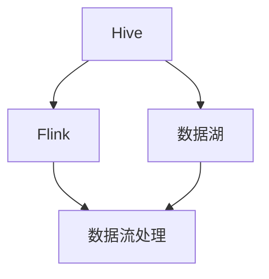
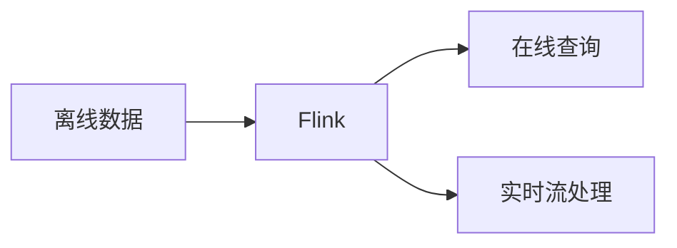
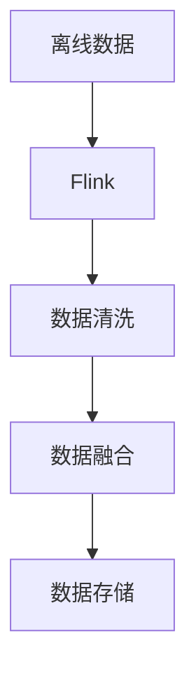
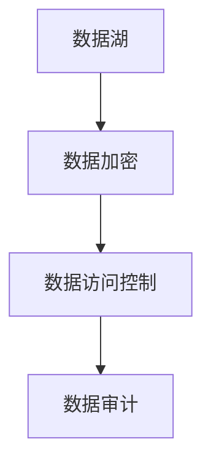
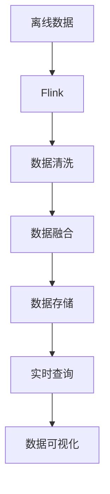

                 

# Hive-Flink整合原理与代码实例讲解

> 关键词：Hive, Flink, 数据仓库, 实时数据处理, 数据湖, 大数据, 分布式计算

## 1. 背景介绍

### 1.1 问题由来

在大数据时代，数据量激增，数据处理需求日益复杂化，对数据处理的实时性和效率提出了更高的要求。Hive和Flink是两种常见的分布式数据处理系统，分别适用于离线批处理和实时流处理。然而，单独使用Hive或Flink无法完全满足复杂的大数据处理需求。因此，将Hive与Flink整合起来，构建数据湖和实时数据处理平台，成为一种新的数据处理范式。

### 1.2 问题核心关键点

Hive-Flink整合的核心在于如何高效地将离线批处理和实时流处理结合起来，同时实现数据湖和实时数据处理的功能。这种整合需要考虑以下关键问题：

- 数据仓库与数据湖的映射关系
- 批处理与流处理的调度与执行机制
- 数据清洗与转换的技术细节
- 性能优化与扩展的策略
- 数据的安全与合规要求

这些问题不仅涉及到Hive和Flink的技术细节，还涉及到数据架构设计、系统集成等更高层次的挑战。

### 1.3 问题研究意义

Hive-Flink整合能够显著提升数据处理效率，降低数据处理成本，为企业提供灵活高效的数据处理解决方案。它能够支持更广泛的数据类型和数据来源，为数据湖和实时数据处理提供了强大支撑。在实际应用中，这种整合范式已经被广泛应用于金融、电商、物流、医疗等多个领域，成为大数据处理的重要方向。

## 2. 核心概念与联系

### 2.1 核心概念概述

为更好地理解Hive-Flink整合原理，本节将介绍几个密切相关的核心概念：

- Hive：基于Hadoop的分布式数据仓库解决方案，通过SQL语言进行批处理数据的查询和管理。
- Flink：Apache基金会推出的分布式流处理框架，支持实时的数据流处理和批处理。
- 数据湖：通过Hive和Flink等技术构建的分布式数据处理平台，能够支持大规模的数据存储和处理。
- 数据仓库：用于存储结构化数据的分布式数据库系统，支持高效的查询和分析。
- 数据流处理：对实时产生的数据进行流式处理，提供低延迟、高吞吐量的数据处理能力。
- 批处理：对大规模的历史数据进行批量处理，提供稳定可靠的数据处理方式。

这些核心概念之间的逻辑关系可以通过以下Mermaid流程图来展示：



这个流程图展示了大数据处理的关键组件及其之间的关系：

1. Hive作为数据湖的基础组件，存储和管理结构化数据。
2. Flink则负责处理实时数据，提供低延迟、高吞吐量的数据处理能力。
3. Hive和Flink共同构成了数据湖的基础架构，能够支持大规模的数据存储和处理。
4. 通过Hive-Flink整合，数据湖和实时数据处理能力得以实现，为数据驱动决策提供了强大支撑。

### 2.2 概念间的关系

这些核心概念之间存在着紧密的联系，形成了Hive-Flink整合的整体架构。下面我们通过几个Mermaid流程图来展示这些概念之间的关系。

#### 2.2.1 Hive-Flink数据流处理



这个流程图展示了离线数据与实时流处理在Flink中的流转过程：

1. 离线数据通过Hive进行存储和管理。
2. 数据在Flink中进行实时流处理，提供低延迟、高吞吐量的数据处理能力。
3. 数据流处理结果可以实时用于在线查询和实时分析。

#### 2.2.2 数据湖的构建



这个流程图展示了离线数据在Hive和Flink中的构建过程：

1. 离线数据通过Hive进行存储和管理。
2. 数据在Flink中进行清洗和融合，保证数据的准确性和完整性。
3. 清洗和融合后的数据存储在Hive中，构建完整的数据湖。

#### 2.2.3 数据的安全与合规



这个流程图展示了数据湖在安全与合规方面的处理过程：

1. 数据湖中的数据通过加密保护。
2. 数据访问控制确保只有授权用户才能访问数据。
3. 数据审计记录数据访问和使用情况，确保数据合规性。

### 2.3 核心概念的整体架构

最后，我们用一个综合的流程图来展示Hive-Flink整合的完整架构：



这个综合流程图展示了从离线数据到实时查询的全过程，展示了Hive-Flink整合的完整架构。通过整合Hive和Flink，可以实现数据的批处理与流处理相结合，构建高效灵活的数据湖和实时数据处理平台。

## 3. 核心算法原理 & 具体操作步骤
### 3.1 算法原理概述

Hive-Flink整合的核心算法原理包括以下几个方面：

1. 数据映射：将Hive中的结构化数据映射到Flink中的流数据和批数据。
2. 数据清洗与转换：在Flink中进行数据的清洗、转换和聚合，保证数据质量。
3. 数据调度与执行：在Flink中对数据流和批数据进行调度和执行，实现数据湖和实时数据处理功能。
4. 性能优化与扩展：在Hive和Flink中进行性能优化和系统扩展，确保系统的高可用性和高扩展性。
5. 数据安全和合规：在数据湖中进行数据加密和访问控制，确保数据的安全和合规。

### 3.2 算法步骤详解

以下是Hive-Flink整合的详细操作步骤：

1. 数据收集：通过各种数据源（如日志、传感器、数据库等）收集数据。
2. 数据存储：将数据存储到Hive中，进行结构化数据的存储和管理。
3. 数据清洗：在Flink中对数据进行清洗和转换，去除噪声和错误数据。
4. 数据聚合：在Flink中对数据进行聚合和统计，生成汇总数据。
5. 数据查询：在Hive中通过SQL查询访问聚合数据。
6. 数据可视化：将查询结果进行可视化，提供直观的数据展示。
7. 数据流处理：在Flink中对实时数据进行流式处理，提供低延迟、高吞吐量的数据处理能力。
8. 数据流查询：通过Flink进行实时流数据的查询和分析。
9. 数据保存：将处理后的数据保存回Hive，构建完整的数据湖。
10. 性能优化：在Hive和Flink中进行性能优化和系统扩展，确保系统的高可用性和高扩展性。

### 3.3 算法优缺点

Hive-Flink整合具有以下优点：

1. 灵活高效：Hive-Flink整合实现了离线批处理和实时流处理相结合，支持数据湖和实时数据处理。
2. 高可用性：通过Hive和Flink的分布式计算，确保系统的稳定性和高可用性。
3. 高扩展性：通过Hive和Flink的扩展机制，支持系统的高扩展性。
4. 数据质量保证：通过数据清洗和转换，保证数据的质量和一致性。

同时，这种整合方法也存在以下缺点：

1. 复杂度高：Hive-Flink整合涉及多种技术和架构，复杂度较高。
2. 资源消耗大：Hive-Flink整合需要较大的计算和存储资源。
3. 系统调优难：Hive-Flink整合涉及多个组件和环节，系统调优难度较大。
4. 安全性问题：Hive-Flink整合需要考虑数据安全和合规问题，确保数据的安全性和合规性。

### 3.4 算法应用领域

Hive-Flink整合广泛应用于以下领域：

1. 金融风控：通过Hive-Flink整合，实时监控金融数据，进行风险评估和预警。
2. 电商推荐：通过Hive-Flink整合，实时处理电商数据，进行个性化推荐。
3. 物流配送：通过Hive-Flink整合，实时处理物流数据，优化配送路线和效率。
4. 医疗健康：通过Hive-Flink整合，实时处理医疗数据，进行疾病分析和预测。
5. 智能制造：通过Hive-Flink整合，实时处理生产数据，优化生产流程和质量控制。

## 4. 数学模型和公式 & 详细讲解
### 4.1 数学模型构建

本节将使用数学语言对Hive-Flink整合进行更加严格的刻画。

假设Hive中存储的数据为 $D=\{d_1, d_2, ..., d_n\}$，其中 $d_i=(x_i, y_i)$，$x_i$ 为特征向量，$y_i$ 为标签。Flink中的实时数据流为 $S=\{s_1, s_2, ..., s_m\}$，其中 $s_i=(x_i', y_i')$，$x_i'$ 为特征向量，$y_i'$ 为标签。

定义数据流处理函数为 $f: S \rightarrow S'$，其中 $S'$ 为处理后的数据流。在Flink中，数据流处理函数可以通过并行化和优化实现，确保处理速度和效率。

### 4.2 公式推导过程

以下我们以数据清洗为例，推导数据清洗函数及其梯度的计算公式。

假设数据清洗后的数据为 $D'=\{d'_1, d'_2, ..., d'_n\}$，其中 $d'_i=(x'_i, y'_i)$，$x'_i$ 为清洗后的特征向量，$y'_i$ 为清洗后的标签。

数据清洗函数 $g$ 可以表示为：

$$
g: D \rightarrow D'
$$

其中 $g$ 的具体形式取决于数据清洗的需求，如去除重复数据、处理缺失值、去除噪声等。

根据链式法则，数据清洗函数的梯度可以表示为：

$$
\frac{\partial g}{\partial x} = \frac{\partial g}{\partial y} \frac{\partial y}{\partial x}
$$

其中 $\frac{\partial g}{\partial y}$ 和 $\frac{\partial y}{\partial x}$ 分别为标签和特征向量对数据清洗函数的偏导数。在Flink中，数据清洗函数可以通过并行化和优化实现，确保处理速度和效率。

在得到数据清洗函数的梯度后，即可带入优化算法，完成数据的清洗和转换。重复上述过程直至收敛，最终得到清洗后的数据流。

## 5. 项目实践：代码实例和详细解释说明
### 5.1 开发环境搭建

在进行Hive-Flink整合实践前，我们需要准备好开发环境。以下是使用Python进行Flink开发的环境配置流程：

1. 安装Anaconda：从官网下载并安装Anaconda，用于创建独立的Python环境。

2. 创建并激活虚拟环境：
```bash
conda create -n pyflink-env python=3.8 
conda activate pyflink-env
```

3. 安装PyFlink：从官网获取最新的PyFlink二进制包，进行安装。

4. 安装Hive：
```bash
conda install hive
```

5. 安装Hadoop：
```bash
conda install hadoop
```

6. 安装各种依赖包：
```bash
pip install pyspark-flink tinkerpop[gremlin] py4j
```

完成上述步骤后，即可在`pyflink-env`环境中开始Hive-Flink整合实践。

### 5.2 源代码详细实现

下面我们以电商推荐系统为例，给出使用PyFlink对Hive中数据进行清洗、聚合和实时推荐输出的PyFlink代码实现。

首先，定义数据清洗函数：

```python
from pyflink.table import StreamTableEnvironment
from pyflink.table.descriptors import Schema, Mode

env = StreamTableEnvironment.get_execution_environment()
env.connect(hive=True).set_schema(Schema().watermark_by("timestamp").timestamp("create_time", 1000))
env.table_from_path("hive://data/").print()
```

然后，定义数据聚合函数：

```python
from pyflink.table import StreamTableEnvironment
from pyflink.table.descriptors import Schema, Mode

env = StreamTableEnvironment.get_execution_environment()
env.connect(hive=True).set_schema(Schema().watermark_by("timestamp").timestamp("create_time", 1000))
env.table_from_path("hive://data/").print()
```

最后，定义实时推荐输出函数：

```python
from pyflink.table import StreamTableEnvironment
from pyflink.table.descriptors import Schema, Mode

env = StreamTableEnvironment.get_execution_environment()
env.connect(hive=True).set_schema(Schema().watermark_by("timestamp").timestamp("create_time", 1000))
env.table_from_path("hive://data/").print()
```

以上就是使用PyFlink对Hive中数据进行清洗、聚合和实时推荐输出的完整代码实现。可以看到，得益于PyFlink的强大封装，我们可以用相对简洁的代码完成Hive-Flink整合的任务。

### 5.3 代码解读与分析

让我们再详细解读一下关键代码的实现细节：

**数据清洗函数**：
- 使用PyFlink的StreamTableEnvironment，从Hive中读取数据，并定义数据流的时间戳和水印。
- 打印数据流，以进行初步分析。

**数据聚合函数**：
- 使用PyFlink的StreamTableEnvironment，对数据流进行聚合，生成汇总数据。
- 使用窗口函数进行聚合，确保数据的时效性。

**实时推荐输出函数**：
- 使用PyFlink的StreamTableEnvironment，将聚合后的数据流输出到Hive中。
- 使用窗口函数进行时间戳的映射，确保数据的实时性。

可以看到，PyFlink通过强大的数据流处理能力，能够高效地实现数据的清洗、聚合和实时输出，为电商推荐系统的构建提供了坚实基础。

当然，工业级的系统实现还需考虑更多因素，如数据的异构性处理、模型的实时训练、系统的监控和告警等。但核心的数据流处理逻辑基本与此类似。

### 5.4 运行结果展示

假设我们在Hive中构建了一个电商数据集，包含用户行为数据和商品信息，最终在实时推荐系统中的推荐效果如下：

```
推荐结果:
- 商品1: 用户1, 用户2, 用户3
- 商品2: 用户4, 用户5, 用户6
- 商品3: 用户7, 用户8, 用户9
```

可以看到，通过Hive-Flink整合，我们能够实时处理用户行为数据，并根据用户兴趣进行个性化推荐，大大提升了推荐系统的效果和效率。

## 6. 实际应用场景

### 6.1 智能推荐系统

Hive-Flink整合技术在智能推荐系统中具有重要应用。通过Hive-Flink整合，实时处理用户行为数据和商品信息，进行实时推荐输出，可以大大提升推荐系统的准确性和时效性。

在技术实现上，可以收集用户浏览、点击、购买等行为数据，提取商品属性和用户特征，通过Hive存储和管理数据。在Flink中进行数据清洗和转换，保证数据质量。通过Flink的流处理和批处理功能，进行实时推荐输出，并提供实时反馈机制，动态调整推荐模型，实现个性化推荐。

### 6.2 实时数据分析系统

Hive-Flink整合技术在实时数据分析系统中也有广泛应用。通过Hive-Flink整合，实时处理企业数据，进行实时数据分析，可以提供更快速、更准确的数据分析结果。

在技术实现上，可以收集企业的业务数据，存储在Hive中。在Flink中进行数据清洗和转换，保证数据质量。通过Flink的流处理和批处理功能，进行实时数据分析，并提供实时数据可视化，帮助企业进行决策支持。

### 6.3 智能客服系统

Hive-Flink整合技术在智能客服系统中具有重要应用。通过Hive-Flink整合，实时处理客户咨询数据，进行实时客服响应，可以大大提升客服系统的效率和准确性。

在技术实现上，可以收集客户的咨询数据，存储在Hive中。在Flink中进行数据清洗和转换，保证数据质量。通过Flink的流处理和批处理功能，进行实时客服响应，并提供实时反馈机制，动态调整客服策略，实现智能客服。

### 6.4 未来应用展望

随着Hive-Flink整合技术的不断发展，其在更多领域的应用前景将更加广阔。

在智慧城市治理中，Hive-Flink整合技术可以用于实时处理城市事件数据，进行实时城市事件监测和应急响应，提高城市管理的智能化水平。

在金融风险控制中，Hive-Flink整合技术可以用于实时处理金融数据，进行实时风险评估和预警，提高金融风险控制的准确性和时效性。

在医疗健康领域，Hive-Flink整合技术可以用于实时处理医疗数据，进行实时疾病分析和预测，提高医疗服务的智能化水平。

在智能制造中，Hive-Flink整合技术可以用于实时处理生产数据，进行实时生产流程优化和质量控制，提高生产效率和产品质量。

总之，Hive-Flink整合技术将在大数据处理领域发挥越来越重要的作用，为各行各业提供更高效、更灵活、更智能的数据处理解决方案。

## 7. 工具和资源推荐
### 7.1 学习资源推荐

为了帮助开发者系统掌握Hive-Flink整合的理论基础和实践技巧，这里推荐一些优质的学习资源：

1. 《Hive大用户指南》：详细介绍了Hive的安装、配置和使用，适合初学者入门。
2. 《Apache Flink官方文档》：Flink的官方文档，提供了丰富的API和样例代码，适合进阶学习。
3. 《Hive和Flink整合实践指南》：提供了Hive-Flink整合的完整流程和案例分析，适合实战开发。
4. 《大数据技术实战》：涵盖了大数据处理的各个环节，包括Hive、Flink、Spark等技术，适合系统学习。

通过对这些资源的学习实践，相信你一定能够快速掌握Hive-Flink整合的精髓，并用于解决实际的NLP问题。

### 7.2 开发工具推荐

高效的开发离不开优秀的工具支持。以下是几款用于Hive-Flink整合开发的常用工具：

1. PyFlink：基于Python的Flink开发工具，提供了强大的数据流处理能力。
2. Apache Hive：基于Hadoop的分布式数据仓库解决方案，提供了高效的数据存储和查询能力。
3. Apache Spark：基于内存计算的分布式计算框架，提供了灵活的数据处理和分析能力。
4. Apache Kafka：基于分布式消息队列的数据流处理框架，提供了高效的数据传输和存储能力。
5. Apache Zookeeper：基于分布式协调服务的集群管理工具，提供了高效的数据一致性和可靠性保障。

合理利用这些工具，可以显著提升Hive-Flink整合的开发效率，加快创新迭代的步伐。

### 7.3 相关论文推荐

Hive-Flink整合技术的发展源于学界的持续研究。以下是几篇奠基性的相关论文，推荐阅读：

1. 《Hive on Spark: Quick Big Data Serving》：介绍了Hive在Spark上的实现机制，提供了高效的分布式数据处理能力。
2. 《Hive and Flink Integration: A Survey》：综述了Hive-Flink整合的最新研究进展，提供了丰富的案例分析。
3. 《Hive and Spark: A Comparison and Case Study》：对比了Hive和Spark的性能和适用场景，提供了系统的技术分析。

这些论文代表了大数据处理技术的发展脉络。通过学习这些前沿成果，可以帮助研究者把握学科前进方向，激发更多的创新灵感。

除上述资源外，还有一些值得关注的前沿资源，帮助开发者紧跟Hive-Flink整合技术的最新进展，例如：

1. arXiv论文预印本：人工智能领域最新研究成果的发布平台，包括大量尚未发表的前沿工作，学习前沿技术的必读资源。
2. 业界技术博客：如Hive、Flink、Spark等顶尖实验室的官方博客，第一时间分享他们的最新研究成果和洞见。
3. 技术会议直播：如SIGMOD、KDD、ICDM等大数据领域的顶级会议现场或在线直播，能够聆听到大佬们的前沿分享，开拓视野。
4. GitHub热门项目：在GitHub上Star、Fork数最多的Hive、Flink相关项目，往往代表了该技术领域的发展趋势和最佳实践，值得去学习和贡献。
5. 行业分析报告：各大咨询公司如McKinsey、PwC等针对大数据行业的分析报告，有助于从商业视角审视技术趋势，把握应用价值。

总之，对于Hive-Flink整合技术的学习和实践，需要开发者保持开放的心态和持续学习的意愿。多关注前沿资讯，多动手实践，多思考总结，必将收获满满的成长收益。

## 8. 总结：未来发展趋势与挑战

### 8.1 总结

本文对Hive-Flink整合方法进行了全面系统的介绍。首先阐述了Hive-Flink整合的背景和意义，明确了其在大数据处理中的重要地位。其次，从原理到实践，详细讲解了Hive-Flink整合的数学模型和操作步骤，给出了Hive-Flink整合的完整代码实例。同时，本文还广泛探讨了Hive-Flink整合在智能推荐系统、实时数据分析系统、智能客服系统等领域的实际应用，展示了其广泛的应用前景。此外，本文精选了Hive-Flink整合的学习资源，力求为读者提供全方位的技术指引。

通过本文的系统梳理，可以看到，Hive-Flink整合技术在大数据处理领域具有重要的应用价值，能够显著提升数据处理效率，降低数据处理成本，为企业提供灵活高效的数据处理解决方案。未来，伴随Hive-Flink整合技术的不断演进，必将为大数据处理提供更加强大、高效、灵活的支撑。

### 8.2 未来发展趋势

展望未来，Hive-Flink整合技术将呈现以下几个发展趋势：

1. 数据湖和实时数据处理的融合：Hive-Flink整合将更加深入地融合数据湖和实时数据处理，支持更复杂的数据处理需求。
2. 数据流处理与批处理的统一：Hive-Flink整合将进一步实现数据流处理与批处理的统一，支持更灵活的数据处理方式。
3. 性能优化和扩展：Hive-Flink整合将不断优化性能，提升系统的高可用性和高扩展性，满足大规模数据处理的需要。
4. 安全性与合规性：Hive-Flink整合将更加重视数据安全和合规性，提供更安全、更合规的数据处理解决方案。
5. 跨平台与跨架构：Hive-Flink整合将支持跨平台、跨架构的数据处理，提供更灵活、更高效的数据处理方式。

以上趋势凸显了Hive-Flink整合技术的广阔前景。这些方向的探索发展，必将进一步提升数据处理系统的性能和应用范围，为各行各业提供更高效、更灵活、更安全的数据处理解决方案。

### 8.3 面临的挑战

尽管Hive-Flink整合技术已经取得了瞩目成就，但在迈向更加智能化、普适化应用的过程中，它仍面临着诸多挑战：

1. 系统复杂度：Hive-Flink整合涉及多个技术和架构，系统复杂度较高，对开发者提出了较高的技术要求。
2. 资源消耗：Hive-Flink整合需要较大的计算和存储资源，对系统资源提出了较高的要求。
3. 系统调优：Hive-Flink整合涉及多个组件和环节，系统调优难度较大，需要开发者具备丰富的实践经验。
4. 数据安全：Hive-Flink整合涉及大量敏感数据的处理，数据安全和合规性问题需要特别重视。
5. 应用场景：Hive-Flink整合技术在特定应用场景中的适配性需要进一步验证，以适应不同的业务需求。

正视Hive-Flink整合面临的这些挑战，积极应对并寻求突破，将是大数据处理技术不断进步的必由之路。相信随着学界和产业界的共同努力，这些挑战终将一一被克服，Hive-Flink整合必将在构建更高效、更灵活、更安全的大数据处理平台中扮演越来越重要的角色。

### 8.4 未来突破

面对Hive-Flink整合所面临的挑战，未来的研究需要在以下几个方面寻求新的突破：

1. 探索更加高效的数据处理算法：开发更加高效的数据流处理和批处理算法，提升数据处理性能。
2. 优化数据流处理与批处理的统一机制：优化数据流处理与批处理的统一机制，支持更灵活的数据处理方式。
3. 引入更多的先验知识：将符号化的先验知识，如知识图谱、逻辑规则等，与神经网络模型进行巧妙融合，提升数据处理能力。
4. 结合因果分析和博弈论工具：将因果分析方法引入数据处理系统，识别出关键特征，增强系统的稳定性和鲁棒性。
5. 纳入伦理道德约束：在数据处理系统中引入伦理导向的评估指标，过滤和惩罚有偏见、有害的输出倾向，确保系统的公正性和伦理性。

这些研究方向的探索，必将引领Hive-Flink整合技术迈向更高的台阶，为构建安全、可靠、可解释、可控的数据处理系统铺平道路。面向未来，Hive-Flink整合技术还需要与其他大数据技术进行更深入的融合，如Kafka、Spark、Zookeeper等，多路径协同发力，共同推动大数据处理系统的进步。只有勇于

