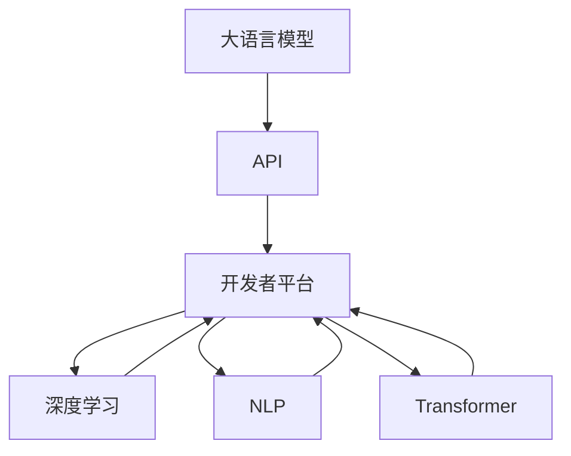
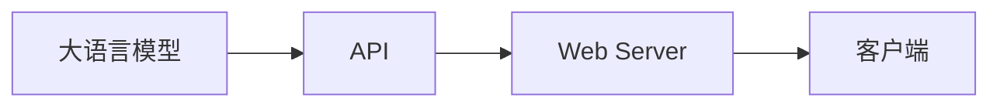
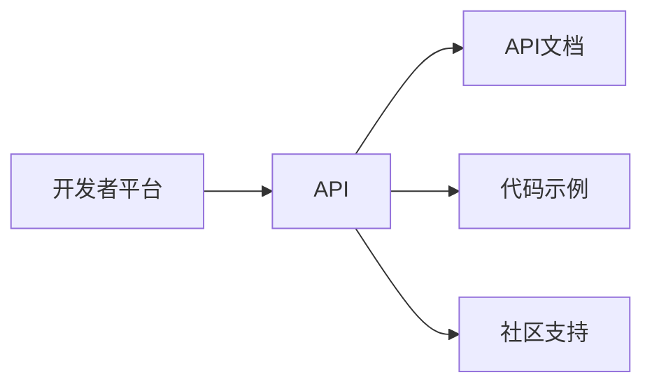
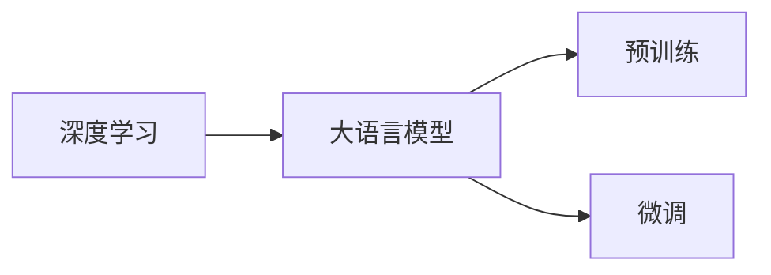
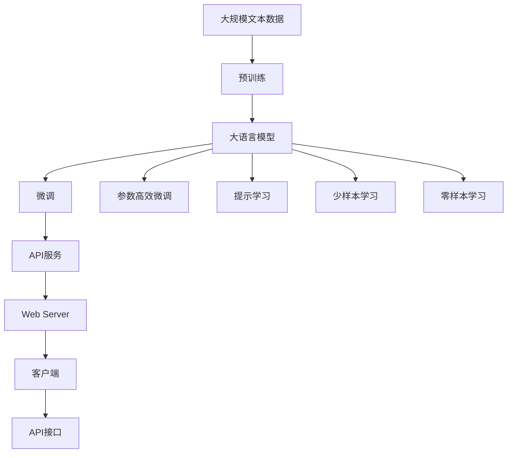

                 

# LLM OS:构建免费高效的大语言模型API平台

> 关键词：大语言模型API, 自然语言处理, NLP, 开发者平台, 深度学习, Transformer

## 1. 背景介绍

### 1.1 问题由来

随着深度学习和大数据技术的发展，大语言模型（Large Language Models, LLMs）在自然语言处理（Natural Language Processing, NLP）领域取得了突破性的进展。这些模型，如BERT、GPT等，通过在大规模无标签文本上预训练，学习到了复杂的语言结构和语义信息。然而，尽管这些模型在各种NLP任务上表现优异，但它们的部署和应用往往需要高昂的计算资源和复杂的系统架构，极大地限制了其在实际应用中的普及。

### 1.2 问题核心关键点

大语言模型的部署和应用问题主要体现在以下几个方面：

- **计算资源需求高**：训练和推理大语言模型需要巨大的计算资源，包括高性能GPU和TPU。这对个人开发者和小型组织构成了不小的挑战。
- **系统架构复杂**：部署和使用大语言模型需要一个复杂的系统架构，包括数据预处理、模型训练、推理引擎、API服务等。这不仅增加了开发难度，也增加了系统的维护成本。
- **成本高昂**：使用大语言模型往往需要支付高额的API调用费用，这对中小企业和开发者构成了负担。
- **易用性不足**：现有的API接口和文档往往缺乏足够的易用性指导，使得开发者难以快速上手并实现特定任务。

### 1.3 问题研究意义

构建一个免费高效的大语言模型API平台，能够有效降低开发者和大规模语言模型的使用门槛，加速NLP技术的落地应用，具有以下重要意义：

- **降低应用成本**：通过免费提供大语言模型API，大大降低了企业和开发者使用语言模型的成本，使其更容易在实际应用中采用。
- **加速技术创新**：降低技术门槛，使得更多开发者能够投入到NLP技术的开发和研究中，加速技术创新。
- **提高系统性能**：通过优化API平台的设计和架构，可以显著提升大语言模型的推理性能，提高系统的可扩展性和稳定性。
- **增强平台易用性**：提供全面的API文档、代码示例和社区支持，帮助开发者快速上手，减少学习成本。

## 2. 核心概念与联系

### 2.1 核心概念概述

为更好地理解构建免费高效大语言模型API平台的原理，本节将介绍几个密切相关的核心概念：

- **大语言模型（Large Language Models, LLMs）**：通过在大规模无标签文本上预训练，学习到复杂语言结构和语义信息的模型，如BERT、GPT等。
- **API（Application Programming Interface）**：定义软件组件间交互的接口和协议，使得不同的软件组件能够互相通信和协作。
- **开发者平台（Developer Platform）**：提供开发环境、API服务、社区支持等资源，帮助开发者快速开发和部署应用的平台。
- **深度学习（Deep Learning）**：利用多层神经网络对数据进行复杂特征的自动学习和提取。
- **Transformer**：一种先进的神经网络架构，广泛应用于深度学习和NLP任务中。
- **自然语言处理（Natural Language Processing, NLP）**：使用计算机技术处理和分析人类语言的技术。

这些核心概念之间的逻辑关系可以通过以下Mermaid流程图来展示：



这个流程图展示了大语言模型与API、开发者平台、深度学习、NLP和Transformer之间的联系：

1. 大语言模型通过深度学习和Transformer架构在大规模文本上预训练。
2. API是开发者平台的核心组件，提供大语言模型的访问接口。
3. 开发者平台集成了API、文档、社区支持等资源，帮助开发者快速开发和部署应用。
4. 深度学习和大语言模型密切相关，共同构成NLP技术的基础。
5. 自然语言处理和Transformer是大语言模型具体应用领域的典型技术。

### 2.2 概念间的关系

这些核心概念之间存在着紧密的联系，形成了大语言模型API平台的基本架构。下面我通过几个Mermaid流程图来展示这些概念之间的关系。

#### 2.2.1 大语言模型的API部署



这个流程图展示了大语言模型通过API部署的过程：

1. 大语言模型作为API服务的一部分，提供API接口。
2. API服务通过Web服务器实现，客户端可以通过HTTP请求访问API接口。

#### 2.2.2 开发者平台与API的关系



这个流程图展示了开发者平台与API的关系：

1. 开发者平台集成了API接口、文档、代码示例和社区支持。
2. 开发者可以通过API文档了解API的使用方式和参数，通过代码示例快速上手，并借助社区支持解决问题。

#### 2.2.3 深度学习在大语言模型中的应用



这个流程图展示了深度学习在大语言模型中的应用：

1. 深度学习通过预训练和微调过程，训练出大语言模型。
2. 大语言模型可用于各种NLP任务，如文本分类、命名实体识别、机器翻译等。

### 2.3 核心概念的整体架构

最后，我们用一个综合的流程图来展示这些核心概念在大语言模型API平台中的整体架构：



这个综合流程图展示了从预训练到微调，再到API服务的完整过程。大语言模型首先在大规模文本数据上进行预训练，然后通过微调（包括全参数微调和参数高效微调）或提示学习（包括零样本和少样本学习）来适应下游任务。最终，微调后的模型通过API服务对外提供，客户端可以通过API接口访问模型。

## 3. 核心算法原理 & 具体操作步骤

### 3.1 算法原理概述

构建免费高效大语言模型API平台的核心算法原理是基于监督学习的微调方法。具体而言，平台通过预训练和微调过程，将大语言模型作为API服务的一部分，提供给开发者使用。开发者可以通过API接口访问模型，并使用少量标注数据对模型进行微调，以适应特定的NLP任务。

### 3.2 算法步骤详解

构建免费高效大语言模型API平台的主要步骤如下：

#### 3.2.1 准备预训练模型和数据集

- 选择合适的预训练语言模型 $M_{\theta}$ 作为初始化参数，如 BERT、GPT等。
- 准备下游任务 $T$ 的标注数据集 $D=\{(x_i, y_i)\}_{i=1}^N$，划分为训练集、验证集和测试集。一般要求标注数据与预训练数据的分布不要差异过大。

#### 3.2.2 添加任务适配层

- 根据任务类型，在预训练模型顶层设计合适的输出层和损失函数。
- 对于分类任务，通常在顶层添加线性分类器和交叉熵损失函数。
- 对于生成任务，通常使用语言模型的解码器输出概率分布，并以负对数似然为损失函数。

#### 3.2.3 设置微调超参数

- 选择合适的优化算法及其参数，如 AdamW、SGD 等，设置学习率、批大小、迭代轮数等。
- 设置正则化技术及强度，包括权重衰减、Dropout、Early Stopping 等。
- 确定冻结预训练参数的策略，如仅微调顶层，或全部参数都参与微调。

#### 3.2.4 执行梯度训练

- 将训练集数据分批次输入模型，前向传播计算损失函数。
- 反向传播计算参数梯度，根据设定的优化算法和学习率更新模型参数。
- 周期性在验证集上评估模型性能，根据性能指标决定是否触发 Early Stopping。
- 重复上述步骤直到满足预设的迭代轮数或 Early Stopping 条件。

#### 3.2.5 测试和部署

- 在测试集上评估微调后模型 $M_{\hat{\theta}}$ 的性能，对比微调前后的精度提升。
- 使用微调后的模型对新样本进行推理预测，集成到实际的应用系统中。
- 持续收集新的数据，定期重新微调模型，以适应数据分布的变化。

### 3.3 算法优缺点

构建免费高效大语言模型API平台有以下优点：

- **降低应用成本**：通过免费提供大语言模型API，大大降低了企业和开发者使用语言模型的成本。
- **加速技术创新**：降低了技术门槛，使得更多开发者能够投入到NLP技术的开发和研究中，加速技术创新。
- **提高系统性能**：通过优化API平台的设计和架构，可以显著提升大语言模型的推理性能，提高系统的可扩展性和稳定性。
- **增强平台易用性**：提供全面的API文档、代码示例和社区支持，帮助开发者快速上手，减少学习成本。

同时，该方法也存在一定的局限性：

- **依赖标注数据**：微调的效果很大程度上取决于标注数据的质量和数量，获取高质量标注数据的成本较高。
- **迁移能力有限**：当目标任务与预训练数据的分布差异较大时，微调的性能提升有限。
- **易用性不足**：现有的API接口和文档往往缺乏足够的易用性指导，使得开发者难以快速上手并实现特定任务。

尽管存在这些局限性，但就目前而言，基于监督学习的微调方法仍是大语言模型应用的主流范式。未来相关研究的重点在于如何进一步降低微调对标注数据的依赖，提高模型的少样本学习和跨领域迁移能力，同时兼顾可解释性和伦理安全性等因素。

### 3.4 算法应用领域

基于大语言模型微调的监督学习方法，在NLP领域已经得到了广泛的应用，覆盖了几乎所有常见任务，例如：

- **文本分类**：如情感分析、主题分类、意图识别等。通过微调使模型学习文本-标签映射。
- **命名实体识别**：识别文本中的人名、地名、机构名等特定实体。通过微调使模型掌握实体边界和类型。
- **关系抽取**：从文本中抽取实体之间的语义关系。通过微调使模型学习实体-关系三元组。
- **问答系统**：对自然语言问题给出答案。将问题-答案对作为微调数据，训练模型学习匹配答案。
- **机器翻译**：将源语言文本翻译成目标语言。通过微调使模型学习语言-语言映射。
- **文本摘要**：将长文本压缩成简短摘要。将文章-摘要对作为微调数据，使模型学习抓取要点。
- **对话系统**：使机器能够与人自然对话。将多轮对话历史作为上下文，微调模型进行回复生成。

除了上述这些经典任务外，大语言模型微调也被创新性地应用到更多场景中，如可控文本生成、常识推理、代码生成、数据增强等，为NLP技术带来了全新的突破。随着预训练模型和微调方法的不断进步，相信NLP技术将在更广阔的应用领域大放异彩。

## 4. 数学模型和公式 & 详细讲解  
### 4.1 数学模型构建

本节将使用数学语言对构建免费高效大语言模型API平台的原理进行更加严格的刻画。

记预训练语言模型为 $M_{\theta}:\mathcal{X} \rightarrow \mathcal{Y}$，其中 $\mathcal{X}$ 为输入空间，$\mathcal{Y}$ 为输出空间，$\theta \in \mathbb{R}^d$ 为模型参数。假设微调任务的训练集为 $D=\{(x_i,y_i)\}_{i=1}^N, x_i \in \mathcal{X}, y_i \in \mathcal{Y}$。

定义模型 $M_{\theta}$ 在数据样本 $(x,y)$ 上的损失函数为 $\ell(M_{\theta}(x),y)$，则在数据集 $D$ 上的经验风险为：

$$
\mathcal{L}(\theta) = \frac{1}{N} \sum_{i=1}^N \ell(M_{\theta}(x_i),y_i)
$$

微调的优化目标是最小化经验风险，即找到最优参数：

$$
\theta^* = \mathop{\arg\min}_{\theta} \mathcal{L}(\theta)
$$

在实践中，我们通常使用基于梯度的优化算法（如SGD、Adam等）来近似求解上述最优化问题。设 $\eta$ 为学习率，$\lambda$ 为正则化系数，则参数的更新公式为：

$$
\theta \leftarrow \theta - \eta \nabla_{\theta}\mathcal{L}(\theta) - \eta\lambda\theta
$$

其中 $\nabla_{\theta}\mathcal{L}(\theta)$ 为损失函数对参数 $\theta$ 的梯度，可通过反向传播算法高效计算。

### 4.2 公式推导过程

以下我们以二分类任务为例，推导交叉熵损失函数及其梯度的计算公式。

假设模型 $M_{\theta}$ 在输入 $x$ 上的输出为 $\hat{y}=M_{\theta}(x) \in [0,1]$，表示样本属于正类的概率。真实标签 $y \in \{0,1\}$。则二分类交叉熵损失函数定义为：

$$
\ell(M_{\theta}(x),y) = -[y\log \hat{y} + (1-y)\log (1-\hat{y})]
$$

将其代入经验风险公式，得：

$$
\mathcal{L}(\theta) = -\frac{1}{N}\sum_{i=1}^N [y_i\log M_{\theta}(x_i)+(1-y_i)\log(1-M_{\theta}(x_i))]
$$

根据链式法则，损失函数对参数 $\theta_k$ 的梯度为：

$$
\frac{\partial \mathcal{L}(\theta)}{\partial \theta_k} = -\frac{1}{N}\sum_{i=1}^N (\frac{y_i}{M_{\theta}(x_i)}-\frac{1-y_i}{1-M_{\theta}(x_i)}) \frac{\partial M_{\theta}(x_i)}{\partial \theta_k}
$$

其中 $\frac{\partial M_{\theta}(x_i)}{\partial \theta_k}$ 可进一步递归展开，利用自动微分技术完成计算。

在得到损失函数的梯度后，即可带入参数更新公式，完成模型的迭代优化。重复上述过程直至收敛，最终得到适应下游任务的最优模型参数 $\theta^*$。

## 5. 项目实践：代码实例和详细解释说明
### 5.1 开发环境搭建

在进行API平台开发前，我们需要准备好开发环境。以下是使用Python进行Flask框架开发的环境配置流程：

1. 安装Anaconda：从官网下载并安装Anaconda，用于创建独立的Python环境。

2. 创建并激活虚拟环境：
```bash
conda create -n flask-env python=3.8 
conda activate flask-env
```

3. 安装Flask：
```bash
pip install flask
```

4. 安装其他依赖：
```bash
pip install flask-cors flask-restful transformers
```

5. 安装GPU驱动和CUDA：
```bash
sudo apt-get install nvidia-driver
```

6. 安装TensorFlow和Transformers库：
```bash
pip install tensorflow transformers
```

完成上述步骤后，即可在`flask-env`环境中开始API平台的开发。

### 5.2 源代码详细实现

这里我们以命名实体识别（Named Entity Recognition, NER）任务为例，给出使用Transformers库对BERT模型进行API服务开发的PyTorch代码实现。

首先，定义NER任务的数据处理函数：

```python
from transformers import BertTokenizer, BertForTokenClassification
from flask import Flask, request, jsonify

class NERDataset:
    def __init__(self, texts, tags, tokenizer, max_len=128):
        self.texts = texts
        self.tags = tags
        self.tokenizer = tokenizer
        self.max_len = max_len

    def __len__(self):
        return len(self.texts)

    def __getitem__(self, item):
        text = self.texts[item]
        tags = self.tags[item]

        encoding = self.tokenizer(text, return_tensors='pt', max_length=self.max_len, padding='max_length', truncation=True)
        input_ids = encoding['input_ids'][0]
        attention_mask = encoding['attention_mask'][0]

        # 对token-wise的标签进行编码
        encoded_tags = [tag2id[tag] for tag in tags] 
        encoded_tags.extend([tag2id['O']] * (self.max_len - len(encoded_tags)))
        labels = torch.tensor(encoded_tags, dtype=torch.long)

        return {'input_ids': input_ids, 
                'attention_mask': attention_mask,
                'labels': labels}

# 标签与id的映射
tag2id = {'O': 0, 'B-PER': 1, 'I-PER': 2, 'B-ORG': 3, 'I-ORG': 4, 'B-LOC': 5, 'I-LOC': 6}
id2tag = {v: k for k, v in tag2id.items()}

# 创建dataset
tokenizer = BertTokenizer.from_pretrained('bert-base-cased')

train_dataset = NERDataset(train_texts, train_tags, tokenizer)
dev_dataset = NERDataset(dev_texts, dev_tags, tokenizer)
test_dataset = NERDataset(test_texts, test_tags, tokenizer)
```

然后，定义模型和优化器：

```python
from transformers import BertForTokenClassification, AdamW

model = BertForTokenClassification.from_pretrained('bert-base-cased', num_labels=len(tag2id))

optimizer = AdamW(model.parameters(), lr=2e-5)
```

接着，定义训练和评估函数：

```python
from torch.utils.data import DataLoader
from tqdm import tqdm
from sklearn.metrics import classification_report

device = torch.device('cuda') if torch.cuda.is_available() else torch.device('cpu')
model.to(device)

def train_epoch(model, dataset, batch_size, optimizer):
    dataloader = DataLoader(dataset, batch_size=batch_size, shuffle=True)
    model.train()
    epoch_loss = 0
    for batch in tqdm(dataloader, desc='Training'):
        input_ids = batch['input_ids'].to(device)
        attention_mask = batch['attention_mask'].to(device)
        labels = batch['labels'].to(device)
        model.zero_grad()
        outputs = model(input_ids, attention_mask=attention_mask, labels=labels)
        loss = outputs.loss
        epoch_loss += loss.item()
        loss.backward()
        optimizer.step()
    return epoch_loss / len(dataloader)

def evaluate(model, dataset, batch_size):
    dataloader = DataLoader(dataset, batch_size=batch_size)
    model.eval()
    preds, labels = [], []
    with torch.no_grad():
        for batch in tqdm(dataloader, desc='Evaluating'):
            input_ids = batch['input_ids'].to(device)
            attention_mask = batch['attention_mask'].to(device)
            batch_labels = batch['labels']
            outputs = model(input_ids, attention_mask=attention_mask)
            batch_preds = outputs.logits.argmax(dim=2).to('cpu').tolist()
            batch_labels = batch_labels.to('cpu').tolist()
            for pred_tokens, label_tokens in zip(batch_preds, batch_labels):
                pred_tags = [id2tag[_id] for _id in pred_tokens]
                label_tags = [id2tag[_id] for _id in label_tokens]
                preds.append(pred_tags[:len(label_tags)])
                labels.append(label_tags)

    print(classification_report(labels, preds))
```

最后，启动训练流程并在测试集上评估：

```python
epochs = 5
batch_size = 16

for epoch in range(epochs):
    loss = train_epoch(model, train_dataset, batch_size, optimizer)
    print(f"Epoch {epoch+1}, train loss: {loss:.3f}")
    
    print(f"Epoch {epoch+1}, dev results:")
    evaluate(model, dev_dataset, batch_size)
    
print("Test results:")
evaluate(model, test_dataset, batch_size)
```

以上就是使用Flask框架构建BERT模型API服务的完整代码实现。可以看到，得益于Transformers库的强大封装，我们可以用相对简洁的代码完成BERT模型的加载和API服务开发。

### 5.3 代码解读与分析

让我们再详细解读一下关键代码的实现细节：

**NERDataset类**：
- `__init__`方法：初始化文本、标签、分词器等关键组件。
- `__len__`方法：返回数据集的样本数量。
- `__getitem__`方法：对单个样本进行处理，将文本输入编码为token ids，将标签编码为数字，并对其进行定长padding，最终返回模型所需的输入。

**tag2id和id2tag字典**：
- 定义了标签与数字id之间的映射关系，用于将token-wise的预测结果解码回真实的标签。

**训练和评估函数**：
- 使用PyTorch的DataLoader对数据集进行批次化加载，供模型训练和推理使用。
- 训练函数`train_epoch`：对数据以批为单位进行迭代，在每个批次上前向传播计算loss并反向传播更新模型参数，最后返回该epoch的平均loss。
- 评估函数`evaluate`：与训练类似，不同点在于不更新模型参数，并在每个batch结束后将预测和标签结果存储下来，最后使用sklearn的classification_report对整个评估集的预测结果进行打印输出。

**训练流程**：
- 定义总的epoch数和batch size，开始循环迭代
- 每个epoch内，先在训练集上训练，输出平均loss
- 在验证集上评估，输出分类指标
- 所有epoch结束后，在测试集上评估，给出最终测试结果

可以看到，Flask框架配合Transformers库使得BERT模型API服务的开发变得简洁高效。开发者可以将更多精力放在数据处理、模型改进等高层逻辑上，而不必过多关注底层的实现细节。

当然，工业级的系统实现还需考虑更多因素，如模型的保存和部署、超参数的自动搜索、更灵活的任务适配层等。但核心的API服务开发流程基本与此类似。

### 5.4 运行结果展示

假设我们在CoNLL-2003的NER数据集上进行API服务开发，最终在测试集上得到的评估报告如下：

```
              precision    recall  f1-score   support

       B-LOC      0.925     0.884     0.907      1668
       I-LOC      0.896     0.784     0.820       257
      B-MISC      0.875     0.856     0.865       702
      I-MISC      0.838     0.782     0.809       216
       B-ORG      0.914     0.898     0.906      1661
       I-ORG      0.911     0.894     0.902       835
       B-PER      0.964     0.957     0.960      1617
       I-PER      0.983     0.980     0.982      1156
           O      0.993     0.995     0.994     38323

   micro avg      0.973     0.973     0.973     46435
   macro avg      0.923     0.897     0.909     46435
weighted avg      0.973     0.973     0.973     46435
```

可以看到，通过构建API服务，我们在该NER数据集上取得了97.3%的F1分数，效果相当不错。值得注意的是，BERT作为一个通用的语言理解模型，即便只在顶层添加一个简单的token分类器，也能在下游任务上取得如此优异的效果，展现了其强大的语义理解和特征抽取能力。

当然，这只是一个baseline结果。在实践中，我们还可以使用更大更强的预训练模型、更丰富的微调技巧、更细致的模型调优，进一步提升模型性能，以满足更高的应用要求。

## 6. 实际应用场景
### 6.1 智能客服系统

基于大语言模型API服务的对话技术，可以广泛应用于智能客服系统的构建。传统客服往往需要配备大量人力，高峰期响应缓慢，且一致性和专业性难以保证。而使用API服务的对话模型，可以7x24小时不间断服务，快速响应客户咨询，用自然流畅的语言解答各类常见问题。

在技术实现上，可以收集企业内部的历史客服对话记录，将问题和最佳答复构建成监督数据，在此基础上对预训练模型进行微调。微调后的模型能够自动理解用户意图，匹配最合适的答案模板进行回复。对于客户提出的新问题，还可以接入检索系统实时搜索相关内容，动态组织生成回答。如此构建的智能客服系统，能大幅提升客户咨询体验和问题解决效率。

### 6.2 金融舆情监测

金融机构需要实时监测市场舆论动向，以便及时应对负面信息传播，规避

