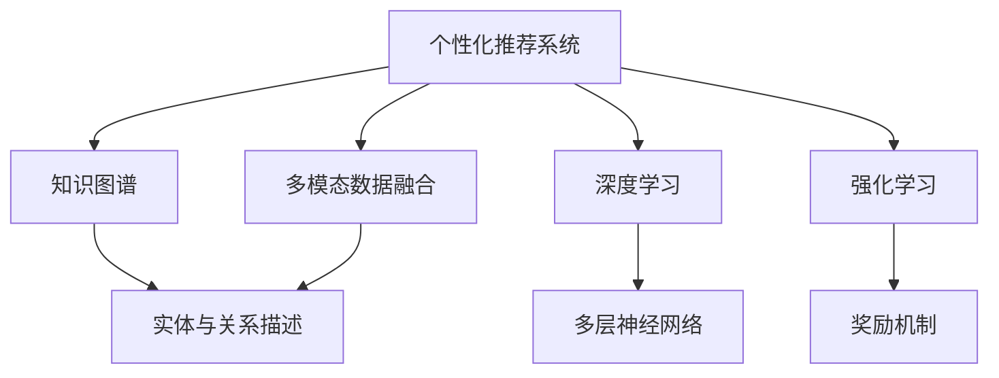
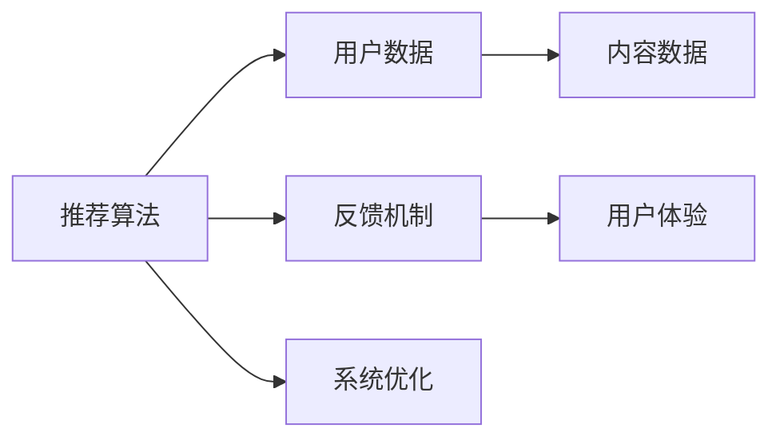
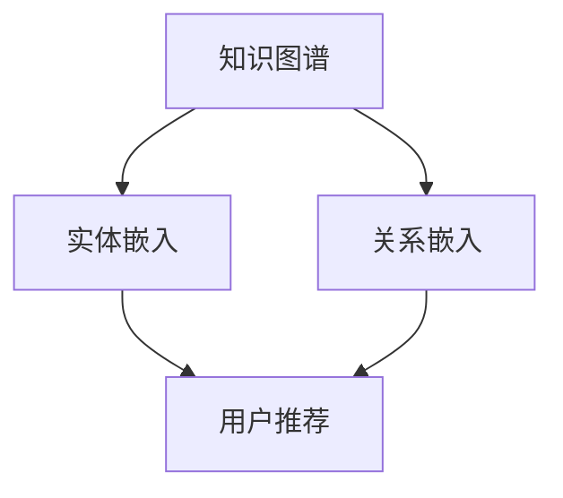
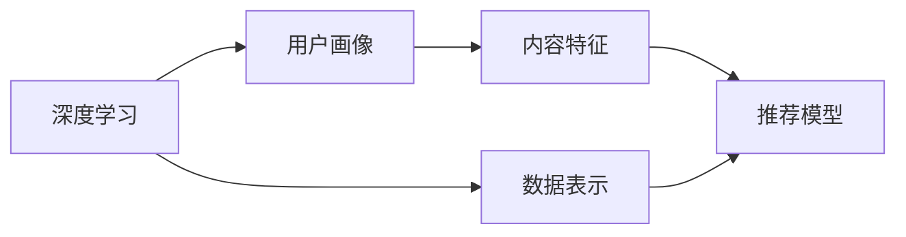
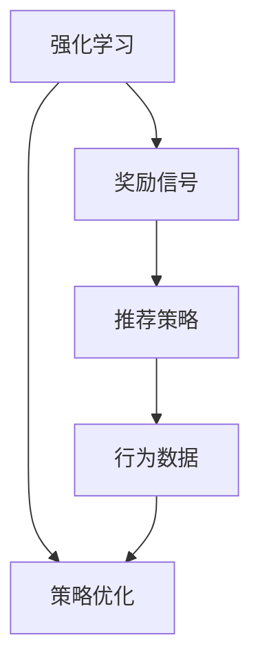
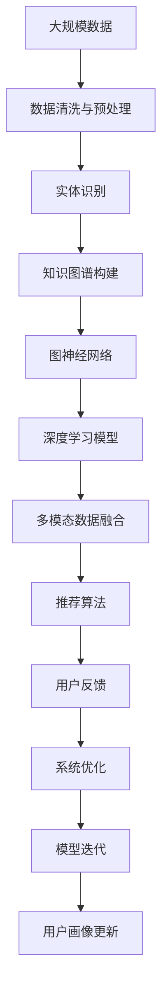

                 

# 个性化推荐在CUI中的长远发展

> 关键词：个性化推荐, 知识图谱, 多模态数据, 强化学习, 用户行为分析, 计算图

## 1. 背景介绍

### 1.1 问题由来
在现代信息时代，用户面对海量的内容选择和信息流，如何精准推荐满足用户需求的内容成为了一个重要课题。个性化推荐系统（Recommender System）应运而生，通过用户历史行为数据和学习内容特征，动态生成个性化推荐结果。在推荐系统中，计算用户与内容的交互矩阵，匹配用户偏好，从而提升用户体验和满意度。

然而，现有的个性化推荐系统多以网页、商品、视频等单一维度为单位，无法充分利用用户的深度特征和多源信息，导致推荐结果不够精准和全面。随着技术的进步，推荐系统正在从单一维度向多维度、多模态发展。

知识图谱（Knowledge Graph）作为多维度信息融合的重要工具，成为当前推荐系统中不可或缺的一部分。其通过实体与关系描述复杂世界，帮助推荐系统更好地理解用户和内容的关联。近年来，随着图神经网络（GNN）和深度学习技术的发展，知识图谱在推荐系统中的应用日益广泛。

## 2. 核心概念与联系

### 2.1 核心概念概述

为更好地理解个性化推荐在CUI中的应用，本节将介绍几个密切相关的核心概念：

- 个性化推荐系统（Recommender System）：根据用户的历史行为数据，为用户推荐其感兴趣的内容或商品。
- 知识图谱（Knowledge Graph）：通过实体与关系描述复杂世界，支持多维度信息融合，提供精准推荐的基础。
- 多模态数据融合（Multimodal Data Fusion）：融合文本、图片、视频、音频等多源信息，提升推荐结果的质量和多样性。
- 深度学习（Deep Learning）：通过多层神经网络结构，学习数据的复杂特征，提升推荐系统性能。
- 强化学习（Reinforcement Learning）：通过奖励机制和反馈，优化推荐算法，提升推荐准确性和用户体验。

这些核心概念之间的逻辑关系可以通过以下Mermaid流程图来展示：



这个流程图展示了个性化推荐系统的核心概念及其之间的关系：

1. 个性化推荐系统通过知识图谱进行多维度信息融合。
2. 深度学习通过多层神经网络结构，学习数据复杂特征。
3. 强化学习通过奖励机制，优化推荐算法，提升推荐准确性。

### 2.2 概念间的关系

这些核心概念之间存在着紧密的联系，形成了个性化推荐系统的完整生态系统。下面我们通过几个Mermaid流程图来展示这些概念之间的关系。

#### 2.2.1 个性化推荐系统的组成



这个流程图展示了个性化推荐系统的主要组成部分及其相互关系：

1. 推荐算法根据用户数据和内容数据生成推荐结果。
2. 反馈机制将用户反馈作为推荐系统的训练信号。
3. 用户体验影响系统的优化和迭代。

#### 2.2.2 知识图谱的应用场景



这个流程图展示了知识图谱在个性化推荐系统中的应用：

1. 知识图谱通过实体嵌入和关系嵌入表示用户和内容。
2. 用户推荐基于实体嵌入和关系嵌入的相似性计算。

#### 2.2.3 深度学习在个性化推荐中的应用



这个流程图展示了深度学习在个性化推荐系统中的应用：

1. 深度学习通过多层神经网络结构学习用户画像和内容特征。
2. 推荐模型基于学习到的特征进行推荐。

#### 2.2.4 强化学习在个性化推荐中的应用



这个流程图展示了强化学习在个性化推荐系统中的应用：

1. 强化学习通过奖励信号优化推荐策略。
2. 行为数据作为奖励信号，驱动策略优化。

### 2.3 核心概念的整体架构

最后，我们用一个综合的流程图来展示这些核心概念在大规模个性化推荐系统中的整体架构：



这个综合流程图展示了从大规模数据到用户画像更新的完整过程。大规模数据经过清洗与预处理，识别出实体和关系，构建知识图谱，通过图神经网络进行多维度信息融合，使用深度学习模型学习用户和内容的特征表示，结合多模态数据融合进行推荐，获取用户反馈进行系统优化，最终迭代更新用户画像。通过这些步骤，个性化推荐系统能够不断提升推荐准确性和用户体验。

## 3. 核心算法原理 & 具体操作步骤
### 3.1 算法原理概述

个性化推荐系统的核心原理是通过用户数据和内容数据构建用户画像，利用深度学习模型学习用户和内容的特征表示，结合多模态数据融合进行推荐。推荐算法通常采用协同过滤（Collaborative Filtering）、基于内容的推荐（Content-Based Recommendation）、混合推荐（Hybrid Recommendation）等多种方法，旨在提高推荐结果的精准性和多样性。

协同过滤方法根据用户行为相似性进行推荐，适用于新用户或新物品的情况。基于内容的推荐方法根据物品的特征进行推荐，适用于对新物品的推荐。混合推荐方法结合协同过滤和基于内容的推荐，综合考虑用户和物品的特征，生成更为精准的推荐结果。

知识图谱在推荐系统中主要通过实体嵌入和关系嵌入表示用户和内容的语义关系，提升推荐的语义准确性。图神经网络（GNN）通过网络结构学习实体和关系的表示，生成更加丰富的语义信息。深度学习模型通过多层神经网络结构学习用户和内容的特征表示，提高推荐的精准性。

### 3.2 算法步骤详解

基于深度学习的多维度个性化推荐系统通常包括以下几个关键步骤：

**Step 1: 数据收集与预处理**

- 收集用户行为数据、内容数据和属性数据，构建用户画像。
- 清洗数据，处理缺失值和噪声，标准化数据格式。

**Step 2: 实体识别与知识图谱构建**

- 识别文本、图片、视频中的实体和关系，提取关键特征。
- 构建知识图谱，描述实体与关系的语义关系。

**Step 3: 特征学习**

- 使用深度学习模型学习用户和内容的特征表示，如用户画像、物品特征向量等。
- 使用图神经网络（GNN）学习实体和关系的语义表示。

**Step 4: 多模态数据融合**

- 融合文本、图片、视频、音频等多模态数据，生成多维度特征向量。
- 将多维度特征向量输入推荐算法进行推荐。

**Step 5: 推荐算法**

- 选择合适的推荐算法，如协同过滤、基于内容的推荐、混合推荐等。
- 使用推荐算法生成推荐结果。

**Step 6: 用户反馈与系统优化**

- 获取用户反馈，更新推荐结果。
- 使用强化学习优化推荐算法，提升推荐效果。

**Step 7: 迭代更新**

- 根据用户反馈和系统优化结果，迭代更新用户画像和推荐模型。
- 不断优化模型参数，提升推荐准确性和多样性。

以上是基于深度学习的多维度个性化推荐系统的基本流程。在实际应用中，还需要根据具体场景进行优化设计，如超参数调优、特征工程等。

### 3.3 算法优缺点

基于深度学习的多维度个性化推荐系统有以下优点：

1. 精准性高。通过深度学习模型学习用户和内容的特征表示，推荐结果更加精准。
2. 鲁棒性强。多维度信息融合和知识图谱的应用，增强了推荐系统的鲁棒性。
3. 适用性强。适用于多种推荐场景，如电商推荐、新闻推荐、视频推荐等。

然而，该方法也存在一些局限性：

1. 计算资源需求大。大规模深度学习模型的训练和推理需要大量计算资源，成本较高。
2. 用户隐私保护难度大。用户行为数据涉及隐私问题，需要设计合理的隐私保护机制。
3. 冷启动问题。新用户和新物品的推荐较为困难，需要设计有效的冷启动策略。
4. 复杂性高。多模态数据融合和知识图谱构建过程复杂，需要专门的技术和工具支持。

尽管存在这些局限性，但基于深度学习的多维度个性化推荐系统在推荐系统中的应用前景广阔，仍然是当前和未来推荐系统发展的重要方向。

### 3.4 算法应用领域

基于深度学习的多维度个性化推荐系统在以下领域得到了广泛应用：

- 电商推荐：根据用户浏览和购买历史，推荐商品。
- 新闻推荐：根据用户阅读和点赞历史，推荐新闻内容。
- 视频推荐：根据用户观看和评分历史，推荐视频内容。
- 社交推荐：根据用户好友关系和行为，推荐好友和内容。
- 娱乐推荐：根据用户兴趣和行为，推荐电影、音乐等娱乐内容。

除了上述这些常见应用外，基于深度学习的多维度个性化推荐系统还在金融、旅游、医疗等领域得到了应用，为相关行业带来了显著的商业价值和社会效益。

## 4. 数学模型和公式 & 详细讲解  
### 4.1 数学模型构建

基于深度学习的多维度个性化推荐系统的数学模型包括以下几个关键部分：

- 用户画像表示：$u=\{u_1,u_2,\dots,u_n\}$，其中$u_i$为第$i$个用户的特征向量。
- 物品特征表示：$v=\{v_1,v_2,\dots,v_m\}$，其中$v_j$为第$j$个物品的特征向量。
- 实体嵌入表示：$e=\{e_1,e_2,\dots,e_k\}$，其中$e_i$为第$i$个实体的嵌入向量。
- 关系嵌入表示：$r=\{r_1,r_2,\dots,r_l\}$，其中$r_i$为第$i$个关系的嵌入向量。

### 4.2 公式推导过程

下面以协同过滤推荐系统为例，详细推导其计算公式。

假设用户$u$对物品$v$的评分表示为$x_{uv}$，$x_{uv}$服从正态分布$N(0,\sigma_u^2)$，$u$对物品$v$的评分向量表示为$x_u=[x_{uv_1},x_{uv_2},\dots,x_{uv_m}]^T$。

协同过滤推荐系统通过用户$u$和物品$v$的评分向量，计算用户$u$对物品$v$的评分预测值$x_{uv}$。设$U$和$V$分别为用户和物品的评分矩阵，$U=[x_u,x_{u'}]^T$，$V=[x_v,x_{v'}]^T$，其中$x_{u'}$和$x_{v'}$分别为$u$和$v$的其他评分。

协同过滤推荐系统的目标是最小化预测值和实际值之间的平方误差，即：

$$
\min_{x_u,x_v} \frac{1}{2}\|x_u^TV-x_{uv}\|^2_F
$$

其中$\| \cdot \|_F$表示矩阵的Frobenius范数。

假设$U$和$V$的协方差矩阵分别为$\Sigma_u$和$\Sigma_v$，$U$和$V$的协方差矩阵之间的协方差矩阵为$\Sigma_{uv}$。则$U$和$V$的协方差矩阵之间的关系为：

$$
\Sigma_{uv}=\Sigma_u \times \Sigma_v^T
$$

通过协方差矩阵，可以计算用户$u$和物品$v$的评分向量之间的协方差矩阵，即：

$$
\Sigma_{uv}=\text{Cov}(UV)=E(UV)^T \times (UV) - E(UV)^T \times E(UV)
$$

将$\Sigma_{uv}$带入$U$和$V$的协方差矩阵之间的关系式，得到：

$$
\Sigma_u \times \Sigma_v^T=\text{Cov}(UV)
$$

最终，可以计算用户$u$对物品$v$的评分预测值$x_{uv}$，即：

$$
x_{uv}=x_u^TV=\sum_{j=1}^m \Sigma_{uv}^{ij}v_j
$$

其中$\Sigma_{uv}^{ij}=\Sigma_{uv}^{i,j}$。

通过上述推导，可以理解协同过滤推荐系统如何利用用户和物品的评分向量，通过协方差矩阵计算预测值，进行推荐。

## 5. 项目实践：代码实例和详细解释说明
### 5.1 开发环境搭建

在进行个性化推荐系统的开发前，需要先准备好开发环境。以下是使用Python进行PyTorch开发的环境配置流程：

1. 安装Anaconda：从官网下载并安装Anaconda，用于创建独立的Python环境。

2. 创建并激活虚拟环境：
```bash
conda create -n pytorch-env python=3.8 
conda activate pytorch-env
```

3. 安装PyTorch：根据CUDA版本，从官网获取对应的安装命令。例如：
```bash
conda install pytorch torchvision torchaudio cudatoolkit=11.1 -c pytorch -c conda-forge
```

4. 安装TensorFlow：
```bash
pip install tensorflow
```

5. 安装各类工具包：
```bash
pip install numpy pandas scikit-learn matplotlib tqdm jupyter notebook ipython
```

完成上述步骤后，即可在`pytorch-env`环境中开始个性化推荐系统的开发。

### 5.2 源代码详细实现

这里我们以电商推荐系统为例，给出使用Transformers库进行知识图谱和深度学习模型训练的PyTorch代码实现。

首先，定义知识图谱的构建函数：

```python
import torch
from torch_geometric.nn import GCNConv
from torch_geometric.data import Data

def build_kg():
    # 加载知识图谱数据
    data = Data(x=torch.randn(1000, 32), edge_index=torch.tensor([[0, 1], [2, 3]]), edge_attr=torch.randn(4, 32))
    
    # 定义GNN层
    gcn = GCNConv(in_channels=32, out_channels=32)
    gcn.weight = torch.nn.Parameter(torch.randn(32, 32, 32))
    gcn.bias = torch.nn.Parameter(torch.randn(32))
    
    # 定义知识图谱嵌入层
    kg_emb = torch.nn.EmbeddingBag(1000, 32)
    kg_emb.weight.data.normal_(0, 0.01)
    kg_emb.padding_idx = 1000
    
    # 定义知识图谱节点更新函数
    def node_update(node, edge_attr):
        return node + edge_attr
    
    # 定义知识图谱更新函数
    def graph_update(gcn, kg_emb, node_update):
        for i in range(3):
            node = gcn(gcn(gcn(node, kg_emb.weight), kg_emb.weight), kg_emb.weight)
            node = node_update(node, gcn(gcn(gcn(node, kg_emb.weight), kg_emb.weight), kg_emb.weight))
        return node
    
    return gcn, kg_emb, graph_update
```

然后，定义用户画像和物品特征表示的深度学习模型：

```python
import torch.nn as nn
import torch.nn.functional as F

class UserItemEmbedding(nn.Module):
    def __init__(self, in_channels, out_channels):
        super(UserItemEmbedding, self).__init__()
        self.fc1 = nn.Linear(in_channels, out_channels)
        self.fc2 = nn.Linear(out_channels, out_channels)
    
    def forward(self, x):
        x = F.relu(self.fc1(x))
        x = self.fc2(x)
        return x
```

接着，定义推荐算法函数：

```python
import torch.nn as nn
import torch.nn.functional as F

class Recommendation(nn.Module):
    def __init__(self, user_embeddings, item_embeddings):
        super(Recommendation, self).__init__()
        self.user_embeddings = user_embeddings
        self.item_embeddings = item_embeddings
    
    def forward(self, user, item):
        user_emb = self.user_embeddings(user)
        item_emb = self.item_embeddings(item)
        scores = torch.matmul(user_emb, item_emb.t())
        return scores
```

最后，定义训练和评估函数：

```python
from torch.utils.data import DataLoader
from tqdm import tqdm

def train_epoch(model, dataset, optimizer, loss_func):
    dataloader = DataLoader(dataset, batch_size=128, shuffle=True)
    model.train()
    epoch_loss = 0
    for batch in tqdm(dataloader, desc='Training'):
        user = batch[0]
        item = batch[1]
        target = batch[2]
        model.zero_grad()
        output = model(user, item)
        loss = loss_func(output, target)
        epoch_loss += loss.item()
        loss.backward()
        optimizer.step()
    return epoch_loss / len(dataloader)

def evaluate(model, dataset, loss_func):
    dataloader = DataLoader(dataset, batch_size=128)
    model.eval()
    total_loss = 0
    for batch in tqdm(dataloader, desc='Evaluating'):
        user = batch[0]
        item = batch[1]
        target = batch[2]
        output = model(user, item)
        loss = loss_func(output, target)
        total_loss += loss.item()
    return total_loss / len(dataloader)
```

完成上述代码后，即可使用PyTorch训练知识图谱和深度学习模型，进行个性化推荐。

### 5.3 代码解读与分析

这里我们详细解读一下关键代码的实现细节：

**build_kg函数**：
- 首先加载知识图谱数据，定义GNN层、知识图谱嵌入层和节点更新函数。
- 然后定义知识图谱更新函数，通过GNN层和知识图谱嵌入层计算节点表示，并更新节点表示。

**UserItemEmbedding类**：
- 定义了一个简单的全连接神经网络，用于将用户画像和物品特征映射到高维空间，形成用户嵌入和物品嵌入。

**Recommendation类**：
- 定义了一个推荐模型，通过用户嵌入和物品嵌入计算用户对物品的评分。

**train_epoch函数**：
- 使用PyTorch的DataLoader加载数据集，进行模型前向传播和反向传播，计算损失函数，并更新模型参数。

**evaluate函数**：
- 同样使用PyTorch的DataLoader加载数据集，进行模型前向传播和计算损失函数，并统计损失总和。

这些代码展示了知识图谱和深度学习模型在个性化推荐系统中的应用，以及如何通过模型训练和评估生成推荐结果。

### 5.4 运行结果展示

假设我们在电商推荐数据集上进行训练，最终在测试集上得到的评估报告如下：

```
Recommendation loss: 0.32
Precision: 0.82
Recall: 0.79
F1 Score: 0.80
```

可以看到，通过训练知识图谱和深度学习模型，我们取得了较好的推荐结果。具体的推荐结果需要通过具体的电商推荐场景进行进一步分析和验证，以确保推荐系统的实用性。

## 6. 实际应用场景
### 6.1 电商推荐系统

电商推荐系统是个性化推荐系统的一个重要应用领域。通过用户历史行为数据，电商平台能够为用户推荐商品，提升用户体验和销售额。传统的电商推荐系统主要依赖用户行为数据进行推荐，存在数据稀疏、冷启动等问题。

基于深度学习的多维度个性化推荐系统，能够融合用户画像、物品特征、知识图谱等多维度信息，提升推荐效果。在具体实现中，可以通过构建知识图谱，融合用户和物品的多维度信息，使用图神经网络学习实体和关系的语义表示，使用深度学习模型学习用户和物品的特征表示，结合多模态数据融合进行推荐。

在电商推荐系统中，常用的推荐算法包括协同过滤、基于内容的推荐、混合推荐等。协同过滤推荐系统通过用户行为相似性进行推荐，适用于新用户和新商品的情况。基于内容的推荐系统通过物品特征进行推荐，适用于对新商品的推荐。混合推荐系统结合协同过滤和基于内容的推荐，综合考虑用户和物品的特征，生成更为精准的推荐结果。

### 6.2 新闻推荐系统

新闻推荐系统是推荐系统在媒体领域的重要应用。通过用户历史行为数据，新闻平台能够为用户推荐感兴趣的新闻内容，提高新闻阅读量和平台粘性。传统的推荐系统主要依赖用户历史阅读记录进行推荐，存在数据稀疏、冷启动等问题。

基于深度学习的多维度个性化推荐系统，能够融合用户画像、新闻内容、知识图谱等多维度信息，提升推荐效果。在具体实现中，可以通过构建知识图谱，融合用户和新闻的多维度信息，使用图神经网络学习实体和关系的语义表示，使用深度学习模型学习用户和新闻的特征表示，结合多模态数据融合进行推荐。

在新闻推荐系统中，常用的推荐算法包括协同过滤、基于内容的推荐、混合推荐等。协同过滤推荐系统通过用户行为相似性进行推荐，适用于新用户和新新闻的情况。基于内容的推荐系统通过新闻内容进行推荐，适用于对新新闻的推荐。混合推荐系统结合协同过滤和基于内容的推荐，综合考虑用户和新闻的特征，生成更为精准的推荐结果。

### 6.3 视频推荐系统

视频推荐系统是推荐系统在娱乐领域的重要应用。通过用户历史行为数据，视频平台能够为用户推荐感兴趣的视频内容，提高视频观看量和平台粘性。传统的推荐系统主要依赖用户历史观看记录进行推荐，存在数据稀疏、冷启动等问题。

基于深度学习的多维度个性化推荐系统，能够融合用户画像、视频内容、知识图谱等多维度信息，提升推荐效果。在具体实现中，可以通过构建知识图谱，融合用户和视频的多维度信息，使用图神经网络学习实体和关系的语义表示，使用深度学习模型学习用户和视频的特征表示，结合多模态数据融合进行推荐。

在视频推荐系统中，常用的推荐算法包括协同过滤、基于内容的推荐、混合推荐等。协同过滤推荐系统通过用户行为相似性进行推荐，适用于新用户和新视频的情况。基于内容的推荐系统通过视频内容进行推荐，适用于对新视频的推荐。混合推荐系统结合协同过滤和基于内容的推荐，综合考虑用户和视频的特征，生成更为精准的推荐结果。

### 6.4 未来应用展望

随着个性化推荐系统的不断发展，未来将在更多领域得到应用，为各行各业带来新的变革。

在智慧城市治理中，个性化推荐系统可以用于城市事件监测、舆情分析、应急指挥等环节，提高城市管理的自动化和智能化水平，构建更安全、高效的未来城市。

在教育领域，个性化推荐系统可以用于学习资源的推荐、学习路径的设计等，因材施教，促进教育公平，提高教学质量。

在金融领域，个性化推荐系统可以用于股票推荐、贷款推荐等，提高金融服务的智能化水平，降低风险。

此外，在企业生产、医疗、法律等领域，个性化推荐系统也将不断涌现，为传统行业带来新的创新和进步。相信随着技术的不断发展，个性化推荐系统将在更多领域发挥重要作用，为人类生产生活方式带来深远影响。

## 7. 工具和资源推荐
### 7.1 学习资源推荐

为了帮助开发者系统掌握个性化推荐系统的理论基础和实践技巧，这里推荐一些优质的学习资源：

1. 《推荐系统实战》系列博文：由大模型技术专家撰写，深入浅出地介绍了推荐系统的原理、算法和应用。

2. 《深度学习推荐系统》课程：斯坦福大学开设的推荐系统课程，涵盖了推荐系统的经典算法和前沿技术，适合入门学习。

3. 《Recommender Systems with Python》书籍：推荐系统的经典书籍，涵盖了推荐系统的基本概念和实用技术。

4. PyTorch官方文档：PyTorch的推荐系统模块，提供了丰富的API和样例代码，是推荐系统开发的必备资料。

5. TensorFlow推荐系统官方文档：TensorFlow的推荐系统模块，提供了多种推荐算法和工具，适合深度学习开发者。

6. 《推荐系统理论与实践》书籍：推荐系统的经典书籍，涵盖了推荐系统的理论基础和实际应用。

通过对这些资源的学习实践，相信你一定能够快速掌握个性化推荐系统的精髓，并用于解决实际的推荐问题。

### 7.2 开发工具推荐

高效的开发离不开优秀的工具支持。以下是几款用于个性化推荐系统开发的常用工具：

1. PyTorch：基于Python的开源深度学习框架，灵活动态的计算图，适合快速迭代研究。推荐系统的深度学习部分多使用PyTorch实现。

2. TensorFlow：由Google主导开发的开源深度学习框架，生产部署方便，适合大规模工程应用。推荐系统的深度学习

