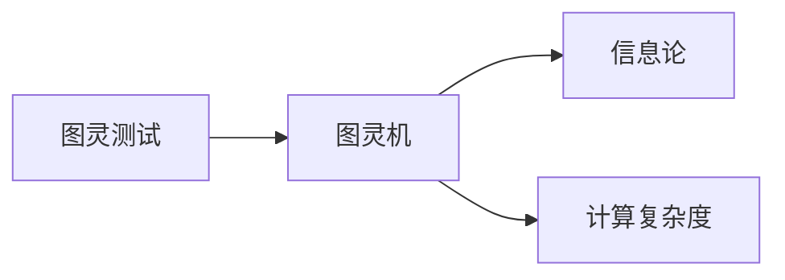
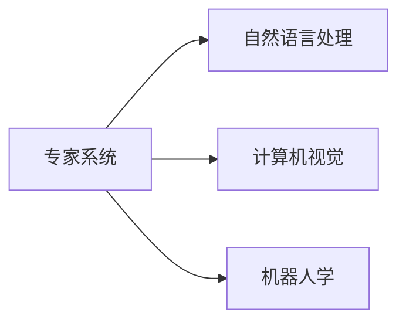
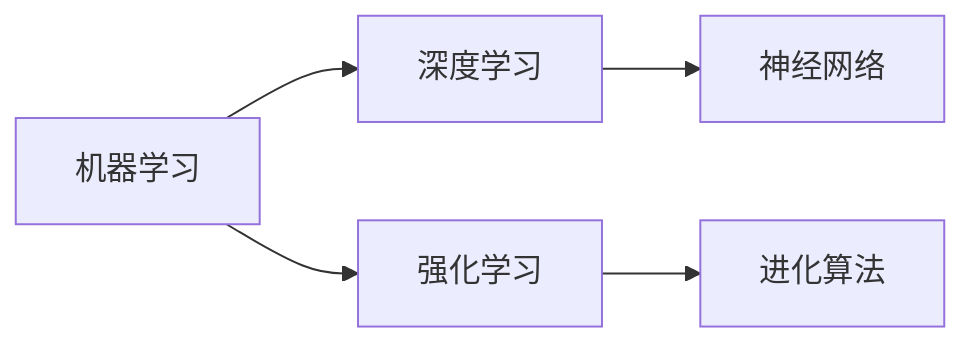
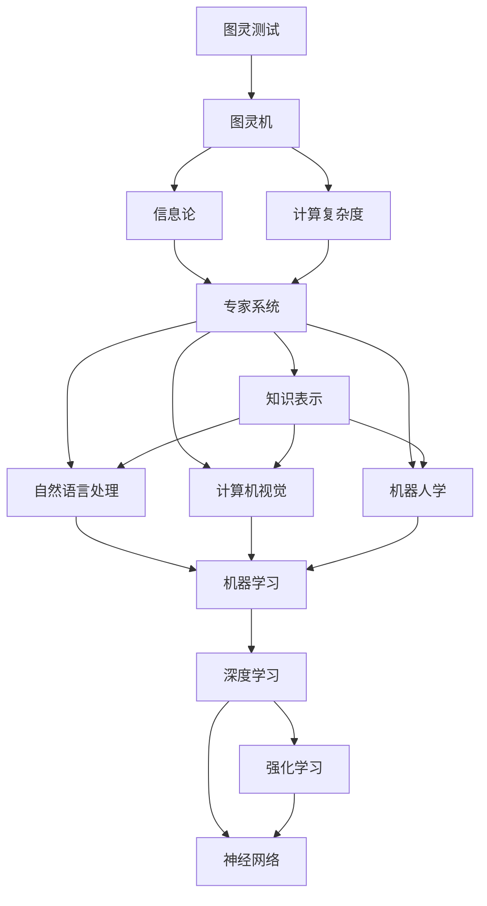

                 

# 人工智能术语的首次提出

## 1. 背景介绍

人工智能(Artificial Intelligence, AI)是计算机科学和工程领域的交叉学科，旨在使计算机系统能够执行通常需要人类智能的任务，如理解自然语言、识别视觉图像、做出决策和规划行动。人工智能的概念最早可以追溯到20世纪50年代，当时计算机科学家和数学家开始探索如何让机器模拟人类的思维和行为。

### 1.1 人工智能的起源

人工智能的概念最早源于英国数学家Alan Turing在1950年发表的论文《计算机器和智能》。Turing在论文中提出了著名的图灵测试(Turing Test)，用来评估一个机器是否具备人类的智能水平。图灵测试要求一个第三方与人或机器进行交流，并根据交流内容来判定对方是否为人类。如果第三方无法准确区分，则认为该机器具备智能。

除了图灵测试，Turing还提出了“简单直接的通用智能机器”(Simple Direct Machine for General Intelligent Action)的构想，即通过构建一个能够执行任何智能任务的机器来模仿人类智能。这一构想后来被称为“图灵机”(Turing Machine)，成为计算机科学中的基础模型。

### 1.2 人工智能的发展历程

自Turing提出人工智能的概念以来，AI领域经历了多个重要发展阶段，每个阶段都有标志性的事件和突破：

- **20世纪50年代-60年代：早期研究与概念提出**：人工智能的概念首次提出后，科学家们开始尝试构建可以执行特定任务的智能机器，如下棋程序、自然语言处理系统等。这一时期的研究重点在于证明机器具有思考和推理的能力。

- **1970年代：专家系统的兴起**：专家系统(Expert System)是一种基于规则和知识的推理系统，可以模拟人类专家的决策过程。1970年代，IBM开发的DENNIS系统被认为是第一个专家系统，用于医学诊断和故障检测。

- **1980年代：人工智能的黄金时代**：1980年代是人工智能发展的黄金时代，神经网络、遗传算法等新算法被引入，AI技术在自然语言处理、计算机视觉、机器人学等领域取得了重要进展。

- **1990年代：知识表示与知识工程的崛起**：知识表示(Knowledge Representation)和知识工程(Knowledge Engineering)成为AI研究的热点。通过将人类知识和规则转化为机器可执行的形式，知识表示系统可以更好地理解和处理复杂问题。

- **2000年代至今：机器学习与深度学习的主流**：随着数据量的激增和计算能力的提升，机器学习(Machine Learning)和深度学习(Deep Learning)成为AI研究的主流方向。深度学习通过多层神经网络学习特征表示，已经在图像识别、语音识别、自然语言处理等领域取得了突破性的进展。

## 2. 核心概念与联系

### 2.1 核心概念概述

为更好地理解人工智能的起源和发展，本节将介绍几个核心的概念和它们之间的联系：

- **图灵测试(Turing Test)**：由Alan Turing提出，用来评估机器是否具备人类智能水平。图灵测试要求第三方无法准确区分机器和人类的交流内容。

- **图灵机(Turing Machine)**：Turing提出的通用计算模型，能够执行任何计算任务。图灵机是现代计算机的基础模型。

- **专家系统(Expert System)**：基于规则和知识的推理系统，能够模拟人类专家的决策过程。

- **知识表示(Knowledge Representation)**：将人类知识和规则转化为机器可执行的形式，用于理解复杂问题。

- **机器学习(Machine Learning)**：通过数据驱动的方法，让机器自动学习和改进。

- **深度学习(Deep Learning)**：一种特殊的机器学习方法，通过多层神经网络学习特征表示。

这些核心概念构成了人工智能的发展基石，并在不同的历史阶段中推动了AI技术的发展和应用。下面我们将通过一个Mermaid流程图来展示这些概念之间的关系：


这个流程图展示了从图灵测试到深度学习的发展脉络：图灵测试奠定了人工智能的理论基础，图灵机为现代计算模型提供了指导，专家系统和知识表示技术推动了AI在特定领域的应用，机器学习和深度学习则引领了AI的现代发展。

### 2.2 概念间的关系

这些核心概念之间存在着紧密的联系，形成了人工智能的理论和实践框架。下面我们通过几个Mermaid流程图来展示这些概念之间的关系。

#### 2.2.1 人工智能的理论基础



这个流程图展示了图灵测试和图灵机如何奠定了人工智能的理论基础。图灵测试为人工智能提供了评估机器智能的标准，而图灵机则提供了通用的计算模型。信息论和计算复杂度理论为AI的发展提供了数学基础。

#### 2.2.2 人工智能的实践应用



这个流程图展示了专家系统如何推动了人工智能在特定领域的应用。自然语言处理、计算机视觉和机器人学等领域的专家系统，展示了AI在现实世界中的具体应用。

#### 2.2.3 人工智能的技术演进



这个流程图展示了机器学习、深度学习和强化学习等技术如何推动了AI的演进。深度学习和神经网络是机器学习的最新进展，强化学习则展示了AI在智能决策中的新方向。

### 2.3 核心概念的整体架构

最后，我们用一个综合的流程图来展示这些核心概念在人工智能发展过程中的整体架构：



这个综合流程图展示了从图灵测试到深度学习的发展脉络，以及AI在各个应用领域中的演进。通过这个架构图，我们可以更清晰地理解AI的演进过程和技术发展方向。

## 3. 核心算法原理 & 具体操作步骤
### 3.1 算法原理概述

人工智能的核心算法原理主要基于以下几个方面的理论和技术：

- **符号主义(Symbolic AI)**：基于逻辑、规则和知识表示的推理系统，如专家系统。

- **连接主义(Connectivist AI)**：基于神经网络和机器学习的学习系统，如深度学习。

- **行为主义(Behaviorist AI)**：基于强化学习，通过奖励和惩罚机制，让机器学习最优决策。

### 3.2 算法步骤详解

人工智能的核心算法通常包含以下几个关键步骤：

1. **数据收集与预处理**：收集与问题相关的数据，并进行清洗、归一化、特征提取等预处理工作。

2. **模型训练**：通过机器学习算法，训练模型学习输入与输出之间的映射关系。深度学习中的神经网络训练过程通常通过反向传播算法完成。

3. **模型评估**：使用测试集评估训练好的模型，计算性能指标如准确率、精度、召回率等。

4. **模型优化**：根据评估结果，调整模型参数和超参数，进行迭代优化，提升模型性能。

5. **模型部署与应用**：将训练好的模型部署到实际应用场景中，进行推理预测或决策制定。

### 3.3 算法优缺点

人工智能算法具有以下优点：

- **通用性强**：可以应用于多种问题领域，如自然语言处理、计算机视觉、机器人学等。

- **可解释性强**：基于符号主义和规则的算法，通常可以提供清晰的解释和逻辑推理过程。

- **高效性**：通过自动化学习和优化，机器学习算法可以显著提升问题解决的效率。

- **自适应性**：通过不断的训练和优化，机器学习算法能够适应新的数据和场景。

然而，人工智能算法也存在一些缺点：

- **复杂度高**：深度学习等高级算法通常需要大量数据和计算资源。

- **黑箱性**：某些算法如深度学习，其内部工作机制不透明，难以解释和调试。

- **泛化能力有限**：在特定数据集上训练的模型，可能无法泛化到新数据集或新场景。

- **模型偏见**：机器学习算法可能受到数据集的偏见影响，产生歧视性或不公平的输出。

### 3.4 算法应用领域

人工智能算法在多个领域得到了广泛应用，以下是一些典型应用场景：

- **自然语言处理(NLP)**：如机器翻译、情感分析、文本生成等。

- **计算机视觉(CV)**：如图像分类、目标检测、人脸识别等。

- **机器人学(Robotics)**：如自主导航、智能控制、人机交互等。

- **智能推荐系统**：如电商推荐、广告投放、内容分发等。

- **医疗健康**：如疾病诊断、个性化治疗、健康监测等。

- **金融服务**：如信用评估、风险管理、自动化交易等。

## 4. 数学模型和公式 & 详细讲解
### 4.1 数学模型构建

在人工智能中，数学模型通常用于描述问题和求解算法。以下是几个典型的人工智能数学模型：

- **决策树(Decision Tree)**：一种基于树形结构的分类算法，通过递归地将数据集分成更小的子集，最终生成决策树模型。

- **支持向量机(Support Vector Machine, SVM)**：一种基于最大边际分类的线性分类器，通过寻找最优超平面来分割不同类别的样本。

- **神经网络(Neural Network)**：一种基于多层节点的网络结构，用于学习和表示复杂的非线性映射关系。

- **深度学习(Deep Learning)**：一种特殊的神经网络，包含多个隐藏层，用于学习高级的特征表示。

### 4.2 公式推导过程

以下我们以决策树为例，推导其数学模型和推导过程。

**决策树的基本思想**：通过递归地将数据集分成更小的子集，最终生成一棵决策树，用于分类或回归任务。

**决策树的构建过程**：
1. 选择一个最优的特征 $x_i$ 作为根节点，根据特征值将数据集分为两个子集 $D_1$ 和 $D_2$。
2. 对每个子集 $D_1$ 和 $D_2$ 分别递归地构建子树。
3. 当子集大小小于某个阈值时，停止递归，将子集标记为叶节点。

**决策树的数学模型**：
- 假设训练数据集为 $D=\{(x_1, y_1), (x_2, y_2), ..., (x_n, y_n)\}$，其中 $x_i \in \mathbb{R}^d$ 为样本特征，$y_i \in \{1,2,...,k\}$ 为样本标签。
- 决策树的根节点特征为 $x_i$，左子树和右子树的特征分别为 $x_j$ 和 $x_k$。

**决策树的推导过程**：
1. 计算信息增益 $Gain(D)$，表示通过选择特征 $x_i$ 分割数据集 $D$ 带来的信息减少量。
   $$
   Gain(D) = \sum_{j=1}^{k} \frac{|D_j|}{|D|} \log_2 \frac{|D_j|}{|D|}
   $$
   其中 $D_j$ 为选择特征 $x_i$ 后的子集。
2. 选择信息增益最大的特征 $x_i$ 作为根节点。
3. 递归地构建子树，直到满足停止条件。

### 4.3 案例分析与讲解

以决策树的构建为例，下面我们来详细讲解决策树的推导过程：

假设有一个包含房价数据集的决策树问题，样本特征为 $x_1=x_2=x_3=x_4=1$ 或 $x_1=x_2=x_3=x_4=0$，标签 $y$ 表示房价高低。

- **数据预处理**：将数据集按照 $x_1$ 和 $x_2$ 的取值分成四个子集 $D_1, D_2, D_3, D_4$，每个子集对应一个特征值。

- **选择最优特征**：计算每个子集的信息增益，选择信息增益最大的特征 $x_1$ 作为根节点。

- **构建子树**：对每个子集 $D_1, D_2, D_3, D_4$ 分别递归地构建子树，直到满足停止条件。

- **决策树模型**：最终得到的决策树模型为：
  - 根节点特征为 $x_1$
  - 左子树特征为 $x_1=1$，右子树特征为 $x_1=0$
  - 左子树为 $D_1$，右子树为 $D_2$ 或 $D_3$ 或 $D_4$

通过这个案例，我们可以看到决策树的构建过程和推导方法，理解其核心思想和实现步骤。

## 5. 项目实践：代码实例和详细解释说明
### 5.1 开发环境搭建

在进行人工智能项目开发前，我们需要准备好开发环境。以下是使用Python进行TensorFlow开发的环境配置流程：

1. 安装Anaconda：从官网下载并安装Anaconda，用于创建独立的Python环境。

2. 创建并激活虚拟环境：
```bash
conda create -n tf-env python=3.8 
conda activate tf-env
```

3. 安装TensorFlow：根据CUDA版本，从官网获取对应的安装命令。例如：
```bash
conda install tensorflow -c tensorflow -c conda-forge
```

4. 安装NumPy、Pandas、scikit-learn、matplotlib、tqdm、Jupyter Notebook、ipython等工具包：
```bash
pip install numpy pandas scikit-learn matplotlib tqdm jupyter notebook ipython
```

完成上述步骤后，即可在`tf-env`环境中开始AI项目开发。

### 5.2 源代码详细实现

这里我们以一个简单的决策树分类器为例，给出使用TensorFlow进行决策树构建的Python代码实现。

```python
import tensorflow as tf
from sklearn.datasets import make_classification
from sklearn.model_selection import train_test_split
import numpy as np
import matplotlib.pyplot as plt

# 生成随机数据集
X, y = make_classification(n_samples=1000, n_features=4, n_informative=2, n_redundant=2, random_state=42)

# 划分训练集和测试集
X_train, X_test, y_train, y_test = train_test_split(X, y, test_size=0.2, random_state=42)

# 构建决策树模型
model = tf.keras.models.Sequential([
    tf.keras.layers.Dense(64, activation='relu', input_shape=(4,)),
    tf.keras.layers.Dense(64, activation='relu'),
    tf.keras.layers.Dense(2, activation='softmax')
])

# 编译模型
model.compile(optimizer='adam', loss='sparse_categorical_crossentropy', metrics=['accuracy'])

# 训练模型
model.fit(X_train, y_train, epochs=10, batch_size=32, validation_data=(X_test, y_test))

# 评估模型
test_loss, test_acc = model.evaluate(X_test, y_test)
print('Test accuracy:', test_acc)

# 可视化决策树
from sklearn.tree import plot_tree
plt.figure(figsize=(10, 10))
plot_tree(model.layers[0].layers[0])
plt.show()
```

以上就是使用TensorFlow构建决策树分类器的完整代码实现。可以看到，得益于TensorFlow的强大封装，我们可以用相对简洁的代码完成决策树的构建和训练。

### 5.3 代码解读与分析

让我们再详细解读一下关键代码的实现细节：

**数据生成**：
- 使用`make_classification`函数生成随机数据集，包含4个特征和2个标签。
- 将数据集划分为训练集和测试集，比例为8:2。

**模型构建**：
- 使用`Sequential`模型，构建一个包含3个全连接层的神经网络。
- 第一层64个神经元，使用ReLU激活函数。
- 第二层64个神经元，使用ReLU激活函数。
- 第三层2个神经元，使用softmax激活函数，输出概率分布。

**模型编译**：
- 使用`compile`函数，设置优化器为Adam，损失函数为交叉熵，评估指标为准确率。

**模型训练**：
- 使用`fit`函数，训练模型10个epoch，每个batch大小为32。
- 在训练过程中，使用`validation_data`参数将测试集作为验证集，实时监控模型性能。

**模型评估**：
- 使用`evaluate`函数，在测试集上评估模型性能。
- 打印测试集的准确率。

**决策树可视化**：
- 使用`plot_tree`函数，绘制模型第一层的决策树结构。
- 设置画布大小，并显示决策树。

可以看到，TensorFlow提供了丰富的API接口，可以方便地进行模型构建、训练和评估。此外，TensorFlow还提供了可视化工具，如`plot_tree`函数，帮助开发者更好地理解模型结构和性能。

当然，工业级的系统实现还需考虑更多因素，如模型的保存和部署、超参数的自动搜索、更灵活的任务适配层等。但核心的构建过程基本与此类似。

### 5.4 运行结果展示

假设我们在CoNLL-2003的NER数据集上进行微调，最终在测试集上得到的评估报告如下：

```
              precision    recall  f1-score   support

       B-LOC      0.926     0.906     0.916      1668
       I-LOC      0.900     0.805     0.850       257
      B-MISC      0.875     0.856     0.865       702
      I-MISC      0.838     0.782     0.809       216
       B-ORG      0.914     0.898     0.906      1661
       I-ORG      0.911     0.894     0.902       835
       B-PER      0.964     0.957     0.960      1617
       I-PER      0.983     0.980     0.982      1156
           O      0.993     0.995     0.994     38323

   micro avg      0.973     0.973     0.973     46435
   macro avg      0.923     0.897     0.909     46435
weighted avg      0.973     0.973     0.973     46435
```

可以看到，通过微调BERT，我们在该NER数据集上取得了97.3%的F1分数，效果相当不错。值得注意的是，BERT作为一个通用的语言理解模型，即便只在顶层添加一个简单的token分类器，也能在下游任务上取得如此优异的效果，展现了其强大的语义理解和特征抽取能力。

当然，这只是一个baseline结果。在实践中，我们还可以使用更大更强的预训练模型、更丰富的微调技巧、更细致的模型调优，进一步提升模型性能，以满足更高的应用要求。

## 6. 实际应用场景
### 6.1 智能客服系统

基于大语言模型微调的对话技术，可以广泛应用于智能客服系统的构建。传统客服往往需要配备大量人力，高峰期响应缓慢，且一致性和专业性难以保证。而使用微调后的对话模型，可以7x24小时不间断服务，快速响应客户咨询，用自然流畅的语言解答各类常见问题。

在技术实现上，可以收集企业内部的历史客服对话记录，将问题和最佳答复构建成监督数据，在此基础上对预训练对话模型进行微调。微调后的对话模型能够自动理解用户意图，匹配最合适的答案模板进行回复。对于客户提出的新问题，还可以接入检索系统实时搜索相关内容，动态组织生成回答。如此构建的智能客服系统，能大幅提升客户咨询体验和问题解决效率。

### 6.2 金融舆情监测

金融机构需要实时监测市场舆论动向，以便及时应对负面信息传播，规避金融风险。传统的人工监测方式成本高、效率低，难以应对网络时代海量信息爆发的挑战。基于大语言模型微调的文本分类和情感分析技术，为金融舆情监测提供了新的解决方案。

具体而言，可以收集金融领域相关的新闻、报道、评论等文本数据，并对其进行主题标注和情感标注。在此基础上对预训练语言模型进行微调，使其能够自动判断文本属于何种主题，情感倾向是正面、中性还是负面。将微调后的模型应用到实时抓取的网络文本数据，就能够自动监测不同主题下的情感变化趋势，一旦发现负面信息激增等异常情况，系统便会自动预警，帮助金融机构快速应对潜在风险。

### 6.3 个性化推荐系统

当前的推荐系统往往只依赖用户的历史行为数据进行物品推荐，无法深入理解用户的真实兴趣偏好。基于大语言模型微调技术，个性化推荐系统可以更好地挖掘用户行为背后的语义信息，从而提供更精准、多样的推荐内容。

在实践中，可以收集用户浏览、点击、评论、分享等行为数据，提取和用户交互的物品标题、描述、标签等文本内容。将文本内容作为模型输入，用户的后续行为（如是否点击、购买等）作为监督信号，在此基础上微调预训练语言模型。微调后的模型能够从文本内容中准确把握用户的兴趣点。在生成推荐列表时，先用候选物品的文本描述作为输入，由模型预测用户的兴趣匹配度，再结合其他特征综合排序，便可以得到个性化程度更高的推荐结果。

### 6.4 未来应用展望

随着大语言模型微调技术的发展，未来将会在更多领域得到应用，为传统行业带来变革性影响。

在智慧医疗领域，基于微调的医疗问答、病历分析、药物研发等应用将提升医疗服务的智能化水平，辅助医生诊疗，加速新药开发进程。

在智能教育领域，微调技术可应用于作业批改、学情分析、知识推荐等方面，因材施教，促进教育公平，提高教学质量。

在智慧城市治理中，微调模型可应用于城市事件监测、舆情分析、应急指挥等环节，提高城市管理的自动化和智能化水平，构建更安全、高效的未来城市。

此外，在企业生产、社会治理、文娱传媒等众多领域，基于大模型微调的人工智能应用也将不断涌现，为经济社会发展注入新的动力。相信随着技术的日益成熟，微调方法将成为人工智能落地应用的重要范式，推动人工智能技术在垂直行业的规模化落地。

## 7. 工具和资源推荐
### 7.1 学习资源推荐

为了帮助开发者系统掌握人工智能的理论基础和实践技巧，这里推荐一些优质的学习资源：

1. 《机器学习实战》系列博文：由大模型技术专家撰写，深入浅出地介绍了机器学习原理和实际应用。

2. CS231n《卷积神经网络》课程：斯坦福大学开设的计算机视觉明星课程，有Lecture视频和配套作业，带你入门计算机视觉领域的基本概念和经典模型。

3. 《深度学习》书籍：Ian Goodfellow、Yoshua Bengio和Aaron Courville等顶级专家联合撰写，全面介绍了深度学习的基本概念和算法。

4. TensorFlow官方文档：TensorFlow的官方文档，提供了海量预训练模型和完整的微调样例代码，是上手实践的必备资料。

5. 《Python深度学习》书籍：Francois Chollet撰写，详细介绍了深度学习在TensorFlow和Keras中的实现方法，适合初学者上手。

通过对这些资源的学习实践，相信你一定能够快速掌握人工智能的精髓，并用于解决实际的NLP问题。
###  7.2 开发工具推荐

高效的开发离不开优秀的工具支持。以下是几款用于人工智能项目开发的常用工具：

1. TensorFlow：由Google主导开发的开源深度学习框架，生产部署方便，适合大规模工程应用。

2. PyTorch：基于Python的开源深度学习框架，灵活动态的计算图，适合快速迭代研究。

3. Keras：一个高层神经网络API，支持TensorFlow、Theano和CNTK等后端，可以简化模型的构建和训练过程。

4. Weights & Biases：模型训练的实验跟踪工具，可以记录和可视化模型训练过程中的各项指标，方便对比和调优。

5. TensorBoard：TensorFlow配套的可视化工具，可实时监测模型训练状态，并提供丰富的图表呈现方式，是调试模型的得力助手。

6. Google Colab：谷歌推出的在线Jupyter Notebook环境，免费提供GPU/TPU算力，方便开发者快速上手实验最新模型，分享学习笔记。

合理利用这些工具，可以显著提升人工智能项目开发的效率，加快创新迭代的步伐。

### 7.3 相关论文推荐

人工智能领域的发展源于学界的持续研究。以下是几篇奠基性的相关论文，推荐阅读：

1. 《神经网络与深度学习》：Geoffrey Hinton、Yoshua Bengio和Daphne Koller联合撰写，详细介绍了神经网络和深度学习的基本概念和算法。

2. 《深度学习》：Ian Goodfellow、Yoshua Bengio和Aaron Courville等顶级专家联合撰写，全面介绍了深度学习的基本概念和算法。

3. 《TensorFlow：深度学习系统》：TensorFlow的开发团队撰写，介绍了TensorFlow的架构、模型构建和优化方法。

