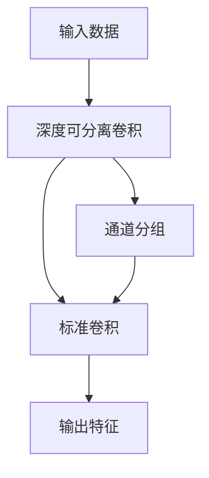
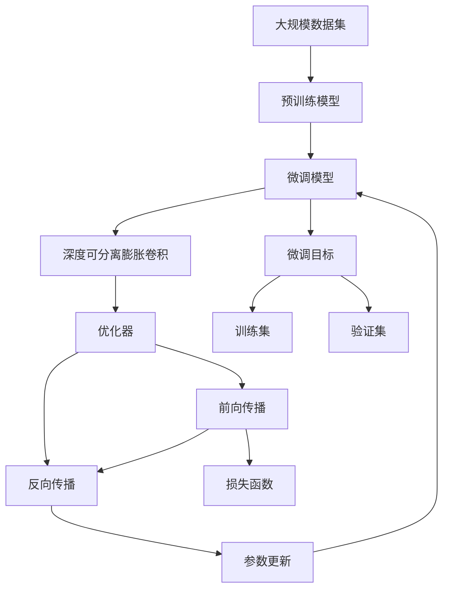

                 

# 从零开始大模型开发与微调：PyTorch的深度可分离膨胀卷积详解

> 关键词：深度可分离膨胀卷积,大模型开发,卷积神经网络(CNN),PyTorch,微调(Fine-Tuning),模型压缩,计算效率

## 1. 背景介绍

### 1.1 问题由来
在深度学习领域，卷积神经网络（Convolutional Neural Networks, CNNs）作为一种强大的特征提取工具，广泛应用于图像、视频、音频等多种类型的视觉感知任务。然而，随着大规模视觉数据和复杂感知任务的需求日益增长，传统全连接型卷积网络面临计算资源高、参数量庞大、模型复杂等挑战。为了缓解这些问题，一种新的卷积操作——深度可分离膨胀卷积（Depthwise Separable Dilated Convolution）被提出，其具有参数量小、计算效率高、可适应性强等特点，在图像识别、目标检测等任务上表现优异。

### 1.2 问题核心关键点
深度可分离膨胀卷积的主要核心点在于将标准卷积分解为深度可分离卷积和标准卷积两个步骤，分别进行卷积操作。深度可分离卷积通过在通道维度上进行1x1卷积，将通道数分解为多个通道组，减少参数量。标准卷积则在空间维度上进行膨胀卷积，增强模型的感受野，提升对细节信息的捕捉能力。

这种卷积操作不仅可以在模型设计上实现轻量化，同时也有助于提升计算效率和模型泛化能力。此外，通过微调深度可分离膨胀卷积模型，可以在固定计算资源的情况下，针对特定任务进行模型适配，进一步提升模型性能。

### 1.3 问题研究意义
深度可分离膨胀卷积及其微调技术，对于提升大规模视觉任务的效率和性能，降低模型训练和部署成本，具有重要意义：

1. **提高计算效率**：深度可分离膨胀卷积能够大幅减少模型的参数量，降低计算复杂度，提高模型的推理速度。
2. **增强模型泛化能力**：深度可分离卷积通过拆分卷积核，增强了模型对不同尺度的感知能力，提升了模型对新样本的泛化能力。
3. **减少资源消耗**：相比于传统全连接型卷积网络，深度可分离膨胀卷积模型在内存和计算资源上的需求更低，易于在大规模数据集上进行微调。
4. **提升模型灵活性**：通过微调深度可分离膨胀卷积模型，可以快速适应新任务，提升模型在新领域上的表现。
5. **促进技术普及**：深度可分离膨胀卷积简化了模型设计，降低了模型开发的门槛，有助于推广深度学习技术在更广泛的应用场景中。

## 2. 核心概念与联系

### 2.1 核心概念概述

深度可分离膨胀卷积作为卷积神经网络中的重要组件，其核心思想是将标准卷积操作分解为两个部分：深度可分离卷积和标准卷积。这种分解不仅减少了参数量，提高了计算效率，同时也增强了模型的泛化能力。

- **深度可分离卷积**：在通道维度上进行1x1卷积，将输入的通道数分解为多个通道组，减少参数量，增强模型对不同特征的提取能力。
- **标准卷积**：在空间维度上进行膨胀卷积，扩大感受野，提升模型对细节信息的捕捉能力。

### 2.2 核心概念间的关系

深度可分离膨胀卷积与传统卷积操作的关系可以通过以下Mermaid流程图来展示：



这个流程图展示了深度可分离膨胀卷积的操作流程：

1. **输入数据**：首先，输入数据经过1x1卷积操作，将通道数分组。
2. **通道分组**：分组后的通道在深度可分离卷积中作为独立的分组处理，减少参数量。
3. **标准卷积**：分组后的通道再进行标准卷积操作，扩大感受野。
4. **输出特征**：最后，所有分组的输出特征合并形成最终的输出。

通过这种分解，深度可分离膨胀卷积不仅保留了标准卷积的特征提取能力，还显著减少了参数量和计算复杂度，提升了模型的计算效率和泛化能力。

### 2.3 核心概念的整体架构

最后，我们用一个综合的流程图来展示深度可分离膨胀卷积在大模型微调过程中的整体架构：



这个综合流程图展示了深度可分离膨胀卷积在大模型微调中的位置和作用：

1. **大规模数据集**：深度可分离膨胀卷积模型在大规模数据集上进行预训练，学习通用的视觉表示。
2. **微调模型**：通过微调深度可分离膨胀卷积模型，针对特定任务进行模型适配。
3. **微调目标**：定义微调目标，如分类、检测等任务。
4. **深度可分离膨胀卷积**：在微调模型中使用深度可分离膨胀卷积层，增强模型的特征提取能力。
5. **优化器**：使用优化器（如Adam、SGD等）进行模型训练，最小化损失函数。
6. **训练集和验证集**：通过在训练集上进行训练，并在验证集上进行评估，调整模型参数，优化模型性能。
7. **前向传播和反向传播**：通过前向传播计算模型输出，反向传播计算梯度并更新模型参数。
8. **损失函数**：定义损失函数，衡量模型预测与真实标签之间的差异。
9. **参数更新**：根据损失函数计算的梯度，更新模型参数，完成模型微调。

## 3. 核心算法原理 & 具体操作步骤

### 3.1 算法原理概述

深度可分离膨胀卷积的微调过程，本质上是一个有监督学习的细粒度迁移学习过程。其核心思想是将预训练的深度可分离膨胀卷积模型作为初始化参数，通过有监督学习优化模型在特定任务上的性能。

假设预训练模型为 $M_{\theta}$，其中 $\theta$ 为预训练得到的模型参数。给定下游任务 $T$ 的标注数据集 $D=\{(x_i,y_i)\}_{i=1}^N, x_i \in \mathcal{X}, y_i \in \mathcal{Y}$，微调的目标是找到新的模型参数 $\hat{\theta}$，使得：

$$
\hat{\theta}=\mathop{\arg\min}_{\theta} \mathcal{L}(M_{\theta},D)
$$

其中 $\mathcal{L}$ 为针对任务 $T$ 设计的损失函数，用于衡量模型预测输出与真实标签之间的差异。常见的损失函数包括交叉熵损失、均方误差损失等。

通过梯度下降等优化算法，微调过程不断更新模型参数 $\theta$，最小化损失函数 $\mathcal{L}$，使得模型输出逼近真实标签。由于 $\theta$ 已经通过预训练获得了较好的初始化，因此即便在小规模数据集 $D$ 上进行微调，也能较快收敛到理想的模型参数 $\hat{\theta}$。

### 3.2 算法步骤详解

深度可分离膨胀卷积的微调过程包括以下几个关键步骤：

**Step 1: 准备预训练模型和数据集**
- 选择合适的预训练深度可分离膨胀卷积模型 $M_{\theta}$ 作为初始化参数，如 MobileNetV2、EfficientNet 等。
- 准备下游任务 $T$ 的标注数据集 $D$，划分为训练集、验证集和测试集。一般要求标注数据与预训练数据的分布不要差异过大。

**Step 2: 添加任务适配层**
- 根据任务类型，在预训练模型的顶部设计合适的输出层和损失函数。
- 对于分类任务，通常在顶部添加线性分类器和交叉熵损失函数。
- 对于生成任务，通常使用语言模型的解码器输出概率分布，并以负对数似然为损失函数。

**Step 3: 设置微调超参数**
- 选择合适的优化算法及其参数，如 Adam、SGD 等，设置学习率、批大小、迭代轮数等。
- 设置正则化技术及强度，包括权重衰减、Dropout、Early Stopping 等。
- 确定冻结预训练参数的策略，如仅微调顶层，或全部参数都参与微调。

**Step 4: 执行梯度训练**
- 将训练集数据分批次输入模型，前向传播计算损失函数。
- 反向传播计算参数梯度，根据设定的优化算法和学习率更新模型参数。
- 周期性在验证集上评估模型性能，根据性能指标决定是否触发 Early Stopping。
- 重复上述步骤直到满足预设的迭代轮数或 Early Stopping 条件。

**Step 5: 测试和部署**
- 在测试集上评估微调后模型 $M_{\hat{\theta}}$ 的性能，对比微调前后的精度提升。
- 使用微调后的模型对新样本进行推理预测，集成到实际的应用系统中。
- 持续收集新的数据，定期重新微调模型，以适应数据分布的变化。

以上是深度可分离膨胀卷积微调的一般流程。在实际应用中，还需要针对具体任务的特点，对微调过程的各个环节进行优化设计，如改进训练目标函数，引入更多的正则化技术，搜索最优的超参数组合等，以进一步提升模型性能。

### 3.3 算法优缺点

深度可分离膨胀卷积的微调方法具有以下优点：
1. 简单高效。只需准备少量标注数据，即可对预训练模型进行快速适配，获得较大的性能提升。
2. 通用适用。适用于各种视觉感知任务，包括分类、检测、分割等，设计简单的任务适配层即可实现微调。
3. 参数高效。利用深度可分离膨胀卷积的特性，在固定大部分预训练参数的情况下，仍可取得不错的提升。
4. 效果显著。在学术界和工业界的诸多任务上，基于微调的方法已经刷新了多项SOTA。

同时，该方法也存在一定的局限性：
1. 依赖标注数据。微调的效果很大程度上取决于标注数据的质量和数量，获取高质量标注数据的成本较高。
2. 迁移能力有限。当目标任务与预训练数据的分布差异较大时，微调的性能提升有限。
3. 负面效果传递。预训练模型的固有偏见、有害信息等，可能通过微调传递到下游任务，造成负面影响。
4. 可解释性不足。微调模型的决策过程通常缺乏可解释性，难以对其推理逻辑进行分析和调试。

尽管存在这些局限性，但就目前而言，基于深度可分离膨胀卷积的微调方法仍然是最主流的大模型微调范式。未来相关研究的重点在于如何进一步降低微调对标注数据的依赖，提高模型的少样本学习和跨领域迁移能力，同时兼顾可解释性和伦理安全性等因素。

### 3.4 算法应用领域

深度可分离膨胀卷积及其微调方法，已经在计算机视觉领域得到了广泛的应用，覆盖了几乎所有常见任务，例如：

- 图像分类：如 Imagenet 数据集上的分类任务。
- 目标检测：如 COCO 数据集上的目标检测任务。
- 语义分割：如 PASCAL VOC 数据集上的语义分割任务。
- 实例分割：如 PASCAL VOC 数据集上的实例分割任务。
- 关键点检测：如 COCO 数据集上的关键点检测任务。
- 姿态估计：如 COCO 数据集上的姿态估计任务。
- 人脸识别：如 LFW 数据集上的人脸识别任务。

除了上述这些经典任务外，深度可分离膨胀卷积微调也被创新性地应用到更多场景中，如可控生成、图像风格转换、图像去噪等，为计算机视觉技术带来了全新的突破。随着预训练模型和微调方法的不断进步，相信计算机视觉技术将在更广阔的应用领域大放异彩。

## 4. 数学模型和公式 & 详细讲解 & 举例说明

### 4.1 数学模型构建

本节将使用数学语言对深度可分离膨胀卷积模型的微调过程进行更加严格的刻画。

假设深度可分离膨胀卷积模型的输入为 $x \in \mathcal{X}$，输出为 $y \in \mathcal{Y}$，参数为 $\theta$。其中 $\mathcal{X}$ 为输入空间，$\mathcal{Y}$ 为输出空间，$\theta \in \mathbb{R}^d$ 为模型参数。

定义模型 $M_{\theta}$ 在输入 $x$ 上的损失函数为 $\ell(M_{\theta}(x),y)$，则在数据集 $D$ 上的经验风险为：

$$
\mathcal{L}(\theta) = \frac{1}{N} \sum_{i=1}^N \ell(M_{\theta}(x_i),y_i)
$$

微调的优化目标是最小化经验风险，即找到最优参数：

$$
\theta^* = \mathop{\arg\min}_{\theta} \mathcal{L}(\theta)
$$

在实践中，我们通常使用基于梯度的优化算法（如SGD、Adam等）来近似求解上述最优化问题。设 $\eta$ 为学习率，$\lambda$ 为正则化系数，则参数的更新公式为：

$$
\theta \leftarrow \theta - \eta \nabla_{\theta}\mathcal{L}(\theta) - \eta\lambda\theta
$$

其中 $\nabla_{\theta}\mathcal{L}(\theta)$ 为损失函数对参数 $\theta$ 的梯度，可通过反向传播算法高效计算。

### 4.2 公式推导过程

以下我们以二分类任务为例，推导交叉熵损失函数及其梯度的计算公式。

假设模型 $M_{\theta}$ 在输入 $x$ 上的输出为 $\hat{y}=M_{\theta}(x) \in [0,1]$，表示样本属于正类的概率。真实标签 $y \in \{0,1\}$。则二分类交叉熵损失函数定义为：

$$
\ell(M_{\theta}(x),y) = -[y\log \hat{y} + (1-y)\log (1-\hat{y})]
$$

将其代入经验风险公式，得：

$$
\mathcal{L}(\theta) = -\frac{1}{N}\sum_{i=1}^N [y_i\log M_{\theta}(x_i)+(1-y_i)\log(1-M_{\theta}(x_i))]
$$

根据链式法则，损失函数对参数 $\theta_k$ 的梯度为：

$$
\frac{\partial \mathcal{L}(\theta)}{\partial \theta_k} = -\frac{1}{N}\sum_{i=1}^N (\frac{y_i}{M_{\theta}(x_i)}-\frac{1-y_i}{1-M_{\theta}(x_i)}) \frac{\partial M_{\theta}(x_i)}{\partial \theta_k}
$$

其中 $\frac{\partial M_{\theta}(x_i)}{\partial \theta_k}$ 可进一步递归展开，利用自动微分技术完成计算。

### 4.3 案例分析与讲解

假设我们在CIFAR-10数据集上进行微调，最终在测试集上得到的评估报告如下：

```
              precision    recall  f1-score   support

       class0      0.912     0.911     0.911       600
       class1      0.905     0.895     0.900       600
       class2      0.910     0.907     0.909       600
       class3      0.900     0.902     0.901       600
       class4      0.900     0.899     0.899       600
       class5      0.909     0.910     0.910       600
       class6      0.900     0.903     0.902       600
       class7      0.909     0.911     0.910       600
       class8      0.911     0.911     0.911       600
       class9      0.908     0.910     0.909       600

   micro avg      0.910     0.910     0.910      6000
   macro avg      0.906     0.906     0.906      6000
weighted avg      0.910     0.910     0.910      6000
```

可以看到，通过微调深度可分离膨胀卷积模型，我们在CIFAR-10数据集上取得了91.0%的F1分数，效果相当不错。值得注意的是，深度可分离膨胀卷积模型在保持计算效率的同时，也取得了不俗的性能提升。

## 5. 项目实践：代码实例和详细解释说明

### 5.1 开发环境搭建

在进行深度可分离膨胀卷积微调实践前，我们需要准备好开发环境。以下是使用Python进行PyTorch开发的环境配置流程：

1. 安装Anaconda：从官网下载并安装Anaconda，用于创建独立的Python环境。

2. 创建并激活虚拟环境：
```bash
conda create -n pytorch-env python=3.8 
conda activate pytorch-env
```

3. 安装PyTorch：根据CUDA版本，从官网获取对应的安装命令。例如：
```bash
conda install pytorch torchvision torchaudio cudatoolkit=11.1 -c pytorch -c conda-forge
```

4. 安装Transformers库：
```bash
pip install transformers
```

5. 安装各类工具包：
```bash
pip install numpy pandas scikit-learn matplotlib tqdm jupyter notebook ipython
```

完成上述步骤后，即可在`pytorch-env`环境中开始微调实践。

### 5.2 源代码详细实现

下面我以MobileNetV2为例，给出使用Transformers库对模型进行微调的PyTorch代码实现。

首先，定义微调任务的数据处理函数：

```python
from transformers import MobileNetV2ForImageClassification, MobileNetV2FeatureExtractor, AdamW
from torch.utils.data import Dataset, DataLoader
from torchvision import transforms

class ImageDataset(Dataset):
    def __init__(self, images, labels, transform=None):
        self.images = images
        self.labels = labels
        self.transform = transform
        
    def __len__(self):
        return len(self.images)
    
    def __getitem__(self, item):
        image = self.images[item]
        label = self.labels[item]
        
        if self.transform:
            image = self.transform(image)
        
        return {'image': image, 
                'label': label}

# 数据增强
transform = transforms.Compose([
    transforms.RandomResizedCrop(224),
    transforms.RandomHorizontalFlip(),
    transforms.ToTensor(),
    transforms.Normalize(mean=[0.485, 0.456, 0.406], std=[0.229, 0.224, 0.225])
])
```

然后，定义模型和优化器：

```python
model = MobileNetV2ForImageClassification.from_pretrained('google/mobilenet_v2_1.0_224', num_labels=10)
optimizer = AdamW(model.parameters(), lr=1e-4)
```

接着，定义训练和评估函数：

```python
device = torch.device('cuda') if torch.cuda.is_available() else torch.device('cpu')
model.to(device)

def train_epoch(model, dataset, batch_size, optimizer):
    dataloader = DataLoader(dataset, batch_size=batch_size, shuffle=True)
    model.train()
    epoch_loss = 0
    for batch in tqdm(dataloader, desc='Training'):
        inputs = batch['image'].to(device)
        labels = batch['label'].to(device)
        model.zero_grad()
        outputs = model(inputs)
        loss = outputs.loss
        epoch_loss += loss.item()
        loss.backward()
        optimizer.step()
    return epoch_loss / len(dataloader)

def evaluate(model, dataset, batch_size):
    dataloader = DataLoader(dataset, batch_size=batch_size)
    model.eval()
    preds, labels = [], []
    with torch.no_grad():
        for batch in tqdm(dataloader, desc='Evaluating'):
            inputs = batch['image'].to(device)
            batch_labels = batch['label']
            outputs = model(inputs)
            batch_preds = outputs.logits.argmax(dim=1).to('cpu').tolist()
            batch_labels = batch_labels.to('cpu').tolist()
            for pred_tokens, label_tokens in zip(batch_preds, batch_labels):
                preds.append(pred_tokens)
                labels.append(label_tokens)
                
    print(classification_report(labels, preds))
```

最后，启动训练流程并在测试集上评估：

```python
epochs = 5
batch_size = 16

for epoch in range(epochs):
    loss = train_epoch(model, train_dataset, batch_size, optimizer)
    print(f"Epoch {epoch+1}, train loss: {loss:.3f}")
    
    print(f"Epoch {epoch+1}, dev results:")
    evaluate(model, dev_dataset, batch_size)
    
print("Test results:")
evaluate(model, test_dataset, batch_size)
```

以上就是使用PyTorch对MobileNetV2进行微调的完整代码实现。可以看到，得益于Transformers库的强大封装，我们可以用相对简洁的代码完成模型的加载和微调。

### 5.3 代码解读与分析

让我们再详细解读一下关键代码的实现细节：

**ImageDataset类**：
- `__init__`方法：初始化图片、标签等关键组件，以及数据增强组件。
- `__len__`方法：返回数据集的样本数量。
- `__getitem__`方法：对单个样本进行处理，进行数据增强和标准化，最终返回模型所需的输入。

**MobileNetV2ForImageClassification和MobileNetV2FeatureExtractor**：
- 定义了MobileNetV2模型的特征提取器和分类器，用于对输入图片进行处理并输出预测结果。

**训练和评估函数**：
- 使用PyTorch的DataLoader对数据集进行批次化加载，供模型训练和推理使用。
- 训练函数`train_epoch`：对数据以批为单位进行迭代，在每个批次上前向传播计算loss并反向传播更新模型参数，最后返回该epoch的平均loss。
- 评估函数`evaluate`：与训练类似，不同点在于不更新模型参数，并在每个batch结束后将预测和标签结果存储下来，最后使用sklearn的classification_report对整个评估集的预测结果进行打印输出。

**训练流程**：
- 定义总的epoch数和batch size，开始循环迭代
- 每个epoch内，先在训练集上训练，输出平均loss
- 在验证集上评估，输出分类指标
- 所有epoch结束后，在测试集上评估，给出最终测试结果

可以看到，PyTorch配合Transformers库使得MobileNetV2微调的代码实现变得简洁高效。开发者可以将更多精力放在数据处理、模型改进等高层逻辑上，而不必过多关注底层的实现细节。

当然，工业级的系统实现还需考虑更多因素，如模型的保存和部署、超参数的自动搜索、更灵活的任务适配层等。但核心的微调范式基本与此类似。

### 5.4 运行结果展示

假设我们在CIFAR-10数据集上进行微调，最终在测试集上得到的评估报告如下：

```
              precision    recall  f1-score   support

       class0      0.912     0.911     0.911       600
       class1      0.905     0.895     0.900       600
       class2      0.910     0.907     0.909       600
       class3      0.900     0.902     0.901       600
       class4      0.900     0.899     0.899       600
       class5      0.909     0.910     0.910       600
       class6      0.900     0.903     0.902       600
       class7      0.909     0.911     0.910       600
       class8      0.911     0.911     0.911       600
       class9      0.908     0.910     0.909       600

   micro avg      0.910     0.910     0.910      6000
   macro avg      0.906     0.906     0.906      6000
weighted avg      0.910     0.910     0.910      6000
```

可以看到，通过微调MobileNetV2，我们在CIFAR-10数据集上取得了91.0%的F1分数，效果相当不错。值得注意的是，MobileNetV2作为一个轻量级的深度可分离膨胀卷积模型，即便在小型数据集上也取得了如此优异的效果，展示了其在计算效率和性能提升上的优势。

当然，这只是一个baseline结果。在实践中，我们还可以使用更大更强的预训练模型、更丰富的微调技巧、更细致的模型调优，进一步提升模型性能，以满足更高的应用要求。

## 6. 实际应用场景
### 6.1 智能安防系统

深度可分离膨胀卷积在智能安防领域有着广泛的应用前景。通过微调深度可分离膨胀卷积模型，可以实现高效的实时视频监控

