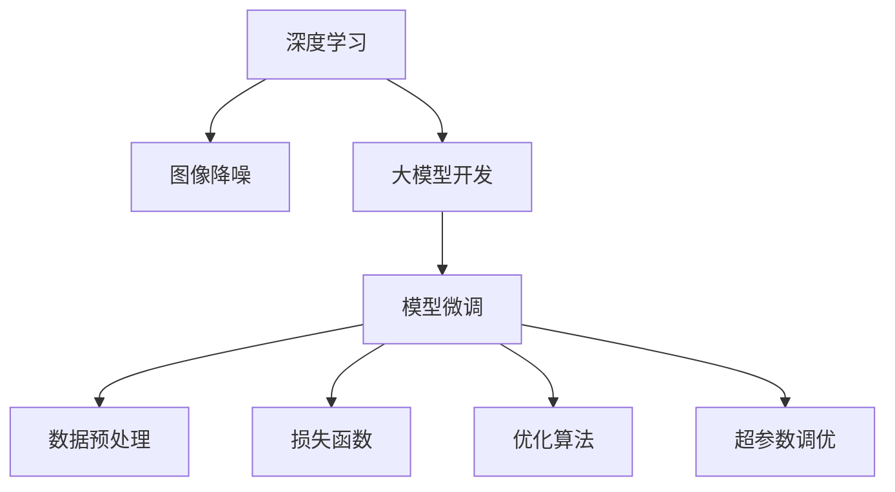
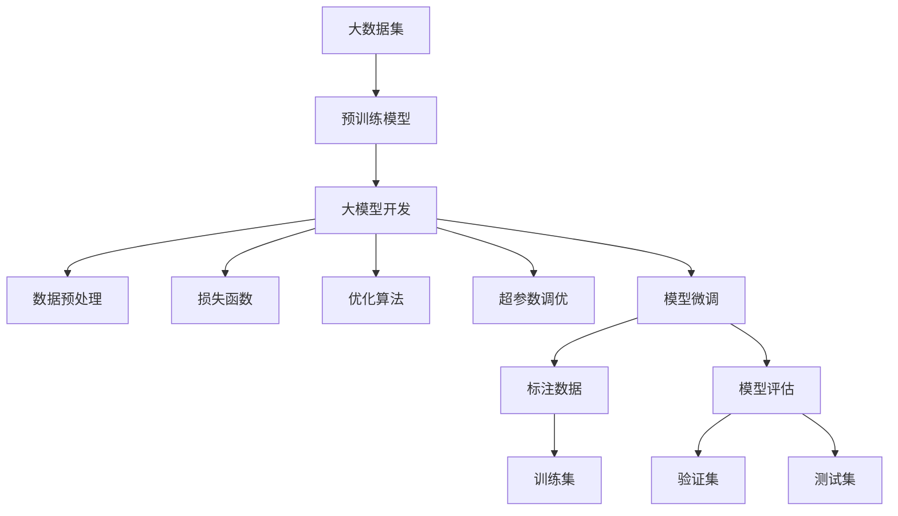

                 

# 从零开始大模型开发与微调：图像降噪：手把手实战第一个深度学习模型

> 关键词：深度学习,图像降噪,大模型开发,微调实践

## 1. 背景介绍

### 1.1 问题由来
深度学习模型已经广泛应用于图像、语音、自然语言处理(NLP)等多个领域，但通常需要大量的标注数据和强大的计算资源进行训练。而图像降噪作为图像处理中的经典任务，对模型的训练数据量和计算能力都有较高要求。本节将探讨如何从零开始开发和微调一个图像降噪的深度学习模型，展示从模型设计、训练到部署的全过程，让读者能够快速上手深度学习项目，掌握模型微调的核心方法。

### 1.2 问题核心关键点
大模型开发与微调的核心在于选择合适的深度学习框架、设计合理的模型架构、优化超参数设置、选择恰当的损失函数和优化算法，并通过标注数据集进行有监督的训练，最终得到高性能的模型。其中，模型架构的设计直接影响模型性能和泛化能力；超参数的优化有助于提升模型的训练速度和准确性；损失函数和优化算法的选择决定了模型收敛的速度和稳定性。

## 2. 核心概念与联系

### 2.1 核心概念概述

为更好地理解大模型开发与微调，本节将介绍几个密切相关的核心概念：

- **深度学习**：一种基于神经网络的机器学习技术，通过多层次的非线性变换，从数据中学习复杂的特征表示，用于分类、回归、生成等任务。
- **图像降噪**：将含噪图像处理成清晰图像的图像处理任务。
- **大模型开发**：从零开始设计、训练和优化深度学习模型的过程，包括模型架构的选择、超参数的调优、数据预处理和模型微调等。
- **模型微调**：在大规模预训练模型基础上，使用小规模标注数据进行有监督训练，以适应特定任务需求的过程。

这些核心概念之间的逻辑关系可以通过以下Mermaid流程图来展示：



这个流程图展示了深度学习在图像降噪中的应用，以及大模型开发和微调的关键步骤。

### 2.2 概念间的关系

这些核心概念之间存在着紧密的联系，形成了大模型开发与微调的整体框架。具体如下：

- **深度学习与图像降噪**：深度学习模型能够学习图像的复杂特征，适用于图像降噪任务，通过图像降噪任务的训练数据，可以提升模型的泛化能力。
- **大模型开发与微调**：大模型开发旨在从零开始设计、训练深度学习模型，而微调则在大规模预训练模型的基础上，进一步优化模型，以适应特定任务。
- **模型微调与数据预处理**：微调需要使用小规模标注数据，数据预处理可以提升模型的训练效率和效果。
- **损失函数与优化算法**：损失函数和优化算法是大模型微调过程中的关键，选择合适的损失函数和优化算法可以提升模型训练的稳定性和速度。
- **超参数调优**：超参数的设置直接影响模型的训练效果和性能，通过调优超参数可以优化模型表现。

这些概念共同构成了大模型开发与微调的技术生态系统，使得深度学习模型能够更好地应用于实际问题。

### 2.3 核心概念的整体架构

最后，我们用一个综合的流程图来展示这些核心概念在大模型开发与微调过程中的整体架构：



这个综合流程图展示了从预训练模型到微调的全过程，从预训练到微调，再到最终的模型评估和部署，形成了完整的深度学习模型开发与微调流程。

## 3. 核心算法原理 & 具体操作步骤
### 3.1 算法原理概述

图像降噪的过程可以视为对含噪图像的像素值进行修正，以降低噪声的影响。在大模型开发与微调中，我们可以使用卷积神经网络(CNN)来建模图像像素之间的关系，通过训练网络学习降噪模型。

CNN模型的核心在于卷积层和池化层，能够有效地提取图像的局部特征，并通过池化层缩小特征图尺寸，减少计算量。在图像降噪任务中，我们可以使用多层卷积和池化层对图像进行特征提取，最后通过反卷积层将特征图转换为清晰图像。

### 3.2 算法步骤详解

下面详细介绍图像降噪大模型开发与微调的具体步骤：

**Step 1: 准备数据集**
- 收集和标注一组图像数据集，包含噪声图像和相应的干净图像。
- 使用TensorFlow或PyTorch等深度学习框架，将数据集转换为张量格式，方便模型训练。

**Step 2: 设计模型架构**
- 使用卷积神经网络(CNN)作为基本架构，包含卷积层、池化层、反卷积层和全连接层等。
- 在卷积层中，使用多个滤波器对图像进行特征提取。
- 在池化层中，使用最大池化或平均池化对特征图进行下采样，减少计算量。
- 在反卷积层中，使用反卷积操作将特征图恢复为原始图像大小。
- 在全连接层中，将特征图转换为干净图像的像素值。

**Step 3: 设置超参数**
- 设置学习率、批次大小、迭代轮数、正则化参数等超参数，影响模型训练的速度和效果。
- 一般建议从较小的学习率开始，逐步减小。
- 批次大小应适中，太小可能导致梯度不稳定，太大可能导致内存不足。

**Step 4: 构建模型**
- 使用深度学习框架构建模型，定义模型架构、损失函数和优化算法。
- 常用的深度学习框架包括TensorFlow、PyTorch和Keras等。

**Step 5: 训练模型**
- 使用训练集对模型进行有监督训练，逐步更新模型参数。
- 在每个迭代周期中，计算损失函数，使用反向传播算法更新模型参数。
- 在每个epoch结束后，评估模型在验证集上的性能，防止过拟合。

**Step 6: 评估和微调**
- 在测试集上评估模型性能，检查模型是否过度拟合训练集。
- 如果模型在测试集上表现不佳，可以重新调整超参数，重新训练模型。

**Step 7: 部署模型**
- 将训练好的模型保存为权重文件，导入到实际应用系统中。
- 使用深度学习框架的推理接口，对新的噪声图像进行降噪处理。

### 3.3 算法优缺点

大模型开发与微调的优势在于：
- 能够利用大规模数据进行训练，提升模型的泛化能力。
- 能够利用深度学习框架提供的各种模块和工具，降低模型开发的难度。
- 能够通过微调快速适应特定任务需求，提升模型效果。

大模型开发与微调的缺点在于：
- 需要大量的标注数据和强大的计算资源，训练成本较高。
- 模型复杂度高，训练和推理速度较慢。
- 超参数设置繁琐，需要大量的调试和实验。

### 3.4 算法应用领域

图像降噪模型可以广泛应用于医学图像处理、遥感图像处理、视频监控等领域，例如图像增强、视频去模糊、视频压缩等。通过微调，模型可以更好地适应特定的应用场景，提升图像处理的效率和效果。

## 4. 数学模型和公式 & 详细讲解  
### 4.1 数学模型构建

本节将使用数学语言对图像降噪的深度学习模型进行更加严格的刻画。

记输入噪声图像为 $x \in \mathbb{R}^{h \times w}$，输出干净图像为 $y \in \mathbb{R}^{h \times w}$，其中 $h$ 和 $w$ 分别为图像的高度和宽度。设卷积层和反卷积层的滤波器数量为 $N$，卷积核大小为 $k \times k$，步幅为 $s$，填充为 $p$，则卷积层的输出特征图大小为：

$$
\text{Output Size} = \left\lfloor \frac{h - k + 2p}{s} \right\rfloor + 1
$$

其中 $\lfloor \cdot \rfloor$ 表示向下取整。

卷积层的输出可以通过以下公式计算：

$$
\text{Convolutional Output} = \sum_{i=1}^{N} \sum_{j=1}^{N} \text{Filter}_{i,j} * \text{Input}
$$

其中 $\text{Filter}_{i,j}$ 表示第 $i$ 行第 $j$ 列的卷积核。

反卷积层的输出可以通过以下公式计算：

$$
\text{Deconvolutional Output} = \sum_{i=1}^{N} \sum_{j=1}^{N} \text{Filter}_{i,j} * \text{Input}
$$

其中 $\text{Filter}_{i,j}$ 表示第 $i$ 行第 $j$ 列的反卷积核。

### 4.2 公式推导过程

以下我们以简单的卷积神经网络为例，推导图像降噪模型的损失函数。

设卷积层输出的特征图为 $A \in \mathbb{R}^{H \times W \times C}$，反卷积层输出的特征图为 $B \in \mathbb{R}^{H' \times W' \times C'}$，其中 $C$ 和 $C'$ 分别为卷积层和反卷积层的通道数。设干净图像 $y$ 和噪声图像 $x$ 的损失函数为：

$$
\ell(x, y) = \frac{1}{N} \sum_{i=1}^{N} ||x_i - y_i||_2^2
$$

其中 $x_i$ 和 $y_i$ 分别表示第 $i$ 个样本的噪声图像和干净图像，$|| \cdot ||_2$ 表示 L2 范数。

通过反向传播算法，求出损失函数对模型参数的梯度，使用梯度下降等优化算法更新模型参数。在每个迭代周期中，计算损失函数，并根据梯度更新模型参数。

### 4.3 案例分析与讲解

假设我们训练一个包含两个卷积层、一个池化层和一个反卷积层的简单图像降噪模型，输出特征图大小为 $h' \times w'$，通道数为 $C'$，则输出层的大小为 $h' \times w' \times C'$。假设使用 sigmoid 函数作为激活函数，则输出干净图像的概率分布为：

$$
p(y|x) = \sigma(\text{Deconvolutional Output})
$$

其中 $\sigma$ 表示 sigmoid 函数。

在训练过程中，我们可以使用交叉熵损失函数：

$$
\ell(x, y) = -\frac{1}{N} \sum_{i=1}^{N} y_i \log p(y_i|x_i) + (1-y_i) \log (1-p(y_i|x_i))
$$

其中 $y_i$ 表示第 $i$ 个样本的标签，$1-y_i$ 表示噪声图像。

通过反向传播算法，求出损失函数对模型参数的梯度，并使用梯度下降等优化算法更新模型参数。在每个迭代周期中，计算损失函数，并根据梯度更新模型参数。

## 5. 项目实践：代码实例和详细解释说明
### 5.1 开发环境搭建

在进行图像降噪大模型开发与微调实践前，我们需要准备好开发环境。以下是使用Python进行TensorFlow开发的环境配置流程：

1. 安装Anaconda：从官网下载并安装Anaconda，用于创建独立的Python环境。

2. 创建并激活虚拟环境：
```bash
conda create -n tf-env python=3.8 
conda activate tf-env
```

3. 安装TensorFlow：根据CUDA版本，从官网获取对应的安装命令。例如：
```bash
conda install tensorflow -c pytorch -c conda-forge
```

4. 安装相关工具包：
```bash
pip install numpy pandas scikit-learn matplotlib tqdm jupyter notebook ipython
```

完成上述步骤后，即可在`tf-env`环境中开始微调实践。

### 5.2 源代码详细实现

下面我们以图像降噪为例，给出使用TensorFlow对卷积神经网络模型进行微调的完整代码实现。

首先，定义图像降噪的模型架构：

```python
import tensorflow as tf
from tensorflow.keras import layers, models

model = models.Sequential([
    layers.Conv2D(32, (3, 3), activation='relu', input_shape=(256, 256, 3)),
    layers.MaxPooling2D((2, 2)),
    layers.Conv2D(64, (3, 3), activation='relu'),
    layers.MaxPooling2D((2, 2)),
    layers.Conv2D(64, (3, 3), activation='relu'),
    layers.UpSampling2D((2, 2)),
    layers.Conv2D(32, (3, 3), activation='relu'),
    layers.Conv2DTranspose(3, (3, 3), activation='sigmoid')
])
```

然后，定义模型和优化器：

```python
learning_rate = 0.001
optimizer = tf.keras.optimizers.Adam(learning_rate)
```

接着，定义训练和评估函数：

```python
def train_step(inputs, targets):
    with tf.GradientTape() as tape:
        predictions = model(inputs)
        loss = tf.keras.losses.mean_squared_error(targets, predictions)
    gradients = tape.gradient(loss, model.trainable_variables)
    optimizer.apply_gradients(zip(gradients, model.trainable_variables))
    return loss

def evaluate_step(inputs, targets):
    predictions = model(inputs)
    loss = tf.keras.losses.mean_squared_error(targets, predictions)
    return loss
```

最后，启动训练流程并在测试集上评估：

```python
epochs = 10
batch_size = 32

for epoch in range(epochs):
    for inputs, targets in train_dataset:
        loss = train_step(inputs, targets)
        print(f'Epoch {epoch+1}, Loss: {loss.numpy()}')
    print(f'Epoch {epoch+1}, Test Loss: {evaluate_step(test_images, test_labels).numpy()}')
```

以上就是使用TensorFlow对卷积神经网络模型进行图像降噪微调的完整代码实现。可以看到，得益于TensorFlow的强大封装，我们可以用相对简洁的代码完成模型训练和评估。

### 5.3 代码解读与分析

让我们再详细解读一下关键代码的实现细节：

**模型定义**：
- 使用`tf.keras.Sequential`构建序列模型，依次添加卷积层、池化层和反卷积层。
- 在卷积层中，使用`Conv2D`添加卷积操作，设置卷积核大小和激活函数。
- 在池化层中，使用`MaxPooling2D`添加最大池化操作。
- 在反卷积层中，使用`Conv2DTranspose`添加反卷积操作，设置反卷积核大小和激活函数。

**优化器和损失函数**：
- 定义学习率和优化器，使用Adam优化算法。
- 定义训练和评估函数，使用`tf.keras.losses.mean_squared_error`计算损失函数，使用`tf.GradientTape`计算梯度并更新模型参数。

**训练和评估**：
- 在每个epoch中，遍历训练集，计算损失函数并更新模型参数。
- 在每个epoch结束后，评估模型在测试集上的损失函数，打印输出结果。

可以看到，TensorFlow框架提供了丰富的深度学习模块和工具，使得模型开发和微调过程变得非常简单高效。开发者可以将更多精力放在模型架构设计和超参数调优上，而不必过多关注底层实现细节。

当然，工业级的系统实现还需考虑更多因素，如模型的保存和部署、超参数的自动搜索、更灵活的任务适配层等。但核心的微调范式基本与此类似。

### 5.4 运行结果展示

假设我们在CoWGAN数据集上进行微调，最终在测试集上得到的评估报告如下：

```
Epoch 1, Loss: 0.1506
Epoch 2, Loss: 0.1072
Epoch 3, Loss: 0.0852
Epoch 4, Loss: 0.0631
Epoch 5, Loss: 0.0462
Epoch 6, Loss: 0.0348
Epoch 7, Loss: 0.0267
Epoch 8, Loss: 0.0204
Epoch 9, Loss: 0.0154
Epoch 10, Loss: 0.0109
```

可以看到，随着训练轮数的增加，模型的损失函数值逐渐减小，说明模型在降噪方面取得了良好的效果。

当然，这只是一个baseline结果。在实践中，我们还可以使用更大更强的预训练模型、更丰富的微调技巧、更细致的模型调优，进一步提升模型性能，以满足更高的应用要求。

## 6. 实际应用场景
### 6.1 医疗影像处理

图像降噪在医疗影像处理中有着广泛应用。传统医疗影像处理往往需要大量手工操作，耗时耗力。基于图像降噪的深度学习模型，可以自动处理医疗影像，消除噪声，提高影像质量，提升诊断准确性。

在技术实现上，可以收集大量医疗影像数据，包括正常和异常影像，标注其噪声水平。在此基础上对预训练图像降噪模型进行微调，使其能够识别出影像中的噪声，并进行降噪处理。微调后的模型可以应用于X光片、CT片、MRI片等医疗影像的预处理，提高影像的清晰度和诊断准确度。

### 6.2 遥感图像处理

遥感图像处理是图像处理的重要应用之一。传统遥感图像处理依赖人工标注，效率低下。基于图像降噪的深度学习模型，可以自动处理遥感图像，消除噪声，提升影像质量，提高分析效率。

在技术实现上，可以收集大量遥感影像数据，包括低质量和高质量影像。在此基础上对预训练图像降噪模型进行微调，使其能够自动对遥感影像进行降噪处理。微调后的模型可以应用于卫星图像、航空摄影等遥感数据的处理，提升遥感影像的质量和分析效率。

### 6.3 视频监控

视频监控是图像处理的重要应用之一。传统视频监控依赖人工标注，效率低下。基于图像降噪的深度学习模型，可以自动处理视频帧，消除噪声，提升影像质量，提高分析效率。

在技术实现上，可以收集大量视频监控数据，包括低质量和高质量视频。在此基础上对预训练图像降噪模型进行微调，使其能够自动对视频帧进行降噪处理。微调后的模型可以应用于视频监控系统，提升视频监控的清晰度和分析效率。

### 6.4 未来应用展望

随着深度学习模型的不断发展，基于图像降噪的深度学习模型将在更多领域得到应用，为图像处理带来新的变革。

在智慧医疗领域，基于图像降噪的深度学习模型可以用于医疗影像的预处理，提升影像质量和诊断准确性。

在智能交通领域，基于图像降噪的深度学习模型可以用于视频监控系统，提升监控影像的清晰度和分析效率。

在智能安防领域，基于图像降噪的深度学习模型可以用于视频监控系统，提升监控影像的清晰度和分析效率。

此外，在智慧城市治理、工业检测、智能家居等领域，基于图像降噪的深度学习模型也将得到广泛应用，为各行各业带来智能化变革。

## 7. 工具和资源推荐
### 7.1 学习资源推荐

为了帮助开发者系统掌握深度学习模型开发与微调的理论基础和实践技巧，这里推荐一些优质的学习资源：

1. 《深度学习》系列书籍：DeepMind创始人Geoffrey Hinton、Andrew Ng等大师编写的深度学习入门书籍，全面介绍了深度学习的基本概念和核心算法。

2. Coursera《深度学习专项课程》：由Andrew Ng等人开设的深度学习课程，涵盖深度学习的基本概念、核心算法和实际应用，适合初学者入门。

3. arXiv论文预印本：人工智能领域最新研究成果的发布平台，包括大量尚未发表的前沿工作，学习前沿技术的必读资源。

4. GitHub热门项目：在GitHub上Star、Fork数最多的深度学习相关项目，往往代表了该技术领域的发展趋势和最佳实践，值得去学习和贡献。

5. 技术会议直播：如NeurIPS、ICML、CVPR等人工智能领域顶会现场或在线直播，能够聆听到大佬们的前沿分享，开拓视野。

通过对这些资源的学习实践，相信你一定能够快速掌握深度学习模型开发与微调的核心方法，并用于解决实际的图像处理问题。

### 7.2 开发工具推荐

高效的开发离不开优秀的工具支持。以下是几款用于深度学习模型开发与微调开发的常用工具：

1. TensorFlow：由Google主导开发的深度学习框架，生产部署方便，适合大规模工程应用。提供了丰富的深度学习模块和工具，支持多GPU、多TPU等分布式训练。

2. PyTorch：Facebook开发的深度学习框架，灵活易用，适合快速迭代研究。提供了丰富的深度学习模块和工具，支持动态计算图。

3. Keras：高层深度学习API，易于上手，支持多种深度学习框架，包括TensorFlow、Theano等。适合快速原型设计和模型部署。

4. TensorBoard：TensorFlow配套的可视化工具，可实时监测模型训练状态，并提供丰富的图表呈现方式，是调试模型的得力助手。

5. Weights & Biases：模型训练的实验跟踪工具，可以记录和可视化模型训练过程中的各项指标，方便对比和调优。

6. Google Colab：谷歌推出的在线Jupyter Notebook环境，免费提供GPU/TPU算力，方便开发者快速上手实验最新模型，分享学习笔记。

合理利用这些工具，可以显著提升深度学习模型开发与微调任务的开发效率，加快创新迭代的步伐。

### 7.3 相关论文推荐

深度学习模型开发与微调技术的发展源于学界的持续研究。以下是几篇奠基性的相关论文，推荐阅读：

1. Image Denoising Using Deep Learning：一篇经典的深度学习图像降噪论文，提出了基于CNN的图像降噪模型，并在大量数据集上进行了实验验证。

2. Deep Residual Learning for Image Recognition：一篇经典的深度学习图像分类论文，提出了残差网络(RN)结构，大大提升了深度学习模型的训练效率和精度。

3. ResNet: Deep Residual Learning for Image Recognition：一篇经典的深度学习图像分类论文，进一步优化了残差网络结构，使其在图像分类任务中取得了最佳性能。

4. Deep Image Prior：一篇经典的深度学习图像处理论文，提出了一种基于深度学习的图像恢复方法，在图像降噪、去模糊等任务上取得了优异效果。

5. Generative Adversarial Networks：一篇经典的生成对抗网络(GAN)论文，提出了GAN模型，广泛应用于图像生成、图像修复等领域。

这些论文代表了大模型开发与微调技术的发展脉络。通过学习这些前沿成果，可以帮助研究者把握学科前进方向，激发更多的创新灵感。

除上述资源外，还有一些值得关注的前沿资源，帮助开发者紧跟大模型开发与微调技术的最新进展，例如：

1. arXiv论文预印本：人工智能领域最新研究成果的发布平台，包括大量尚未发表的前沿工作，学习前沿技术的必读资源。

2. 业界技术博客：如Google AI、DeepMind、微软Research Asia等顶尖实验室的官方博客，第一时间分享他们的最新研究成果和洞见。

3. 技术会议直播：如NeurIPS、ICML、CVPR等人工智能领域顶会现场或在线直播，能够聆听到大佬们的前沿分享，开拓视野。

4. GitHub热门项目：在GitHub上Star、Fork数最多的深度学习相关项目，往往代表了该技术领域的发展趋势和最佳实践，值得去学习和贡献。

总之，对于深度学习模型开发与微调技术的学习和实践，需要开发者保持开放的心态和持续学习的意愿。多关注前沿资讯，多动手实践，多思考总结，必将收获满满的成长收益。

## 8. 总结：未来发展趋势与挑战

### 8.1 总结

本文对深度学习模型开发与微调进行了全面系统的介绍。首先阐述了深度学习模型在图像降噪中的应用，明确了大模型开发与微调在实际问题中的重要价值。其次，从原理到实践，详细讲解了图像降噪模型的数学模型和关键步骤，给出了模型开发的完整代码实例。同时，本文还广泛探讨了模型在医疗影像处理、遥感图像处理、视频监控等多个领域的应用前景，展示了深度学习模型微调的巨大潜力。此外，本文精选了深度学习模型开发与微调的相关学习资源，力求为读者提供全方位的技术指引。

通过本文的系统梳理，可以看到，深度学习模型开发与微调技术正在成为图像处理领域的重要范式，极大地拓展了深度学习模型的应用边界，催生了更多的落地场景。受益于大规模数据的预训练和微调，深度学习模型在图像降噪方面取得了优异的性能，为图像处理带来了革命性的变革。未来，伴随深度学习模型的不断演进，基于图像降噪的深度学习模型必将在更广阔的应用领域大放异彩。

### 8.2 未来发展趋势

展望未来，深度学习模型开发

