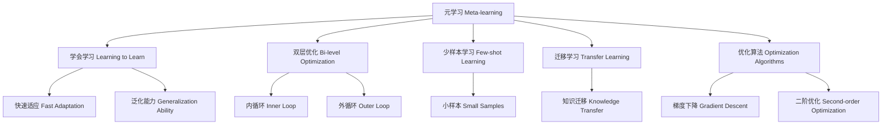

# 一切皆是映射：跟踪AI元学习（Meta-learning）的最新进展

关键词：元学习、少样本学习、迁移学习、优化算法、深度学习

## 1. 背景介绍
### 1.1  问题的由来
在人工智能的发展历程中，机器学习一直扮演着至关重要的角色。传统的机器学习方法需要大量的标注数据和计算资源来训练模型，这在实际应用中存在诸多限制。为了突破这一瓶颈，研究者们提出了元学习（Meta-learning）的概念，旨在让模型具备快速学习和适应新任务的能力。

### 1.2  研究现状
近年来，元学习领域涌现出许多创新性的工作，如MAML（Model-Agnostic Meta-Learning）、Reptile、LEO（Latent Embedding Optimization）等算法，大大推动了该领域的发展。这些算法在few-shot learning、迁移学习等任务上取得了优异的表现，展现出元学习的巨大潜力。

### 1.3  研究意义
元学习的研究意义主要体现在以下几个方面：
1. 提高模型的泛化能力，使其能够快速适应新的任务和环境。
2. 减少对大规模标注数据的依赖，降低人工标注的成本。
3. 加速模型的训练和优化过程，提高学习效率。
4. 为构建通用人工智能（AGI）奠定理论和技术基础。

### 1.4  本文结构
本文将从以下几个方面深入探讨元学习的最新进展：
- 核心概念与联系
- 核心算法原理与具体操作步骤
- 数学模型和公式详细讲解与举例说明
- 项目实践：代码实例和详细解释
- 实际应用场景
- 工具和资源推荐
- 未来发展趋势与挑战
- 常见问题与解答

## 2. 核心概念与联系
元学习的核心思想是"学会学习"（Learning to Learn），即通过设计特定的学习算法和优化策略，使模型能够在多个相关任务上快速适应和泛化。与传统的机器学习范式不同，元学习引入了两个层次的优化过程：
1. 内循环（Inner Loop）：在每个任务上对模型进行快速适应和更新。
2. 外循环（Outer Loop）：在多个任务上对学习算法本身进行优化。

通过这种双层优化，元学习算法能够提取任务之间的共性，并将其应用于新的任务中，实现快速学习和泛化。

元学习与以下几个领域有着密切的联系：
- 少样本学习（Few-shot Learning）：元学习算法常用于解决少样本学习问题，即在只有少量标注样本的情况下实现快速学习。
- 迁移学习（Transfer Learning）：元学习可以看作是一种特殊的迁移学习，旨在学习如何在不同任务之间进行知识迁移。
- 优化算法（Optimization Algorithms）：元学习算法通常涉及复杂的优化过程，需要设计高效的优化策略来更新模型参数。

下图展示了元学习的核心概念与关联领域之间的联系：



## 3. 核心算法原理 & 具体操作步骤
### 3.1  算法原理概述
元学习算法的核心原理是通过构建一个可学习的学习器（Learner），使其能够在多个任务上快速适应和泛化。常见的元学习算法可以分为以下三类：
1. 基于梯度的元学习算法：如MAML、Reptile等，通过计算梯度来更新学习器的参数。
2. 基于度量的元学习算法：如Prototypical Networks、Matching Networks等，通过度量样本之间的相似性来进行分类。
3. 基于优化的元学习算法：如LSTM-based Meta-Learner、LEO等，通过学习优化算法本身来实现快速适应。

### 3.2  算法步骤详解
以MAML算法为例，其具体步骤如下：
1. 初始化学习器的参数 $\theta$。
2. 对于每个任务 $\mathcal{T}_i$：
   - 在支持集 $\mathcal{D}_i^{train}$ 上计算损失 $\mathcal{L}_{\mathcal{T}_i}(f_\theta)$。
   - 计算梯度 $\nabla_\theta \mathcal{L}_{\mathcal{T}_i}(f_\theta)$，并更新参数：$\theta_i' = \theta - \alpha \nabla_\theta \mathcal{L}_{\mathcal{T}_i}(f_\theta)$。
   - 在查询集 $\mathcal{D}_i^{test}$ 上计算损失 $\mathcal{L}_{\mathcal{T}_i}(f_{\theta_i'})$。
3. 计算所有任务的损失平均值：$\mathcal{L}(\theta) = \frac{1}{n} \sum_{i=1}^n \mathcal{L}_{\mathcal{T}_i}(f_{\theta_i'})$。
4. 计算元梯度 $\nabla_\theta \mathcal{L}(\theta)$，并更新学习器参数：$\theta \leftarrow \theta - \beta \nabla_\theta \mathcal{L}(\theta)$。
5. 重复步骤2-4，直到收敛。

### 3.3  算法优缺点
MAML算法的优点包括：
- 可以适应各种类型的学习器，如神经网络、决策树等。
- 通过元梯度更新，可以有效地优化学习器参数。
- 在少样本学习任务上表现出色，具有很好的泛化能力。

但MAML算法也存在一些缺点：
- 计算复杂度较高，需要计算二阶梯度。
- 对初始化敏感，不同的初始化可能导致不同的性能。
- 在某些情况下可能出现过拟合现象。

### 3.4  算法应用领域
元学习算法在以下领域有着广泛的应用：
- 计算机视觉：如图像分类、目标检测等。
- 自然语言处理：如文本分类、语言模型等。
- 强化学习：如策略适应、元强化学习等。
- 推荐系统：如冷启动问题、跨域推荐等。

## 4. 数学模型和公式 & 详细讲解 & 举例说明
### 4.1  数学模型构建
元学习的数学模型可以用以下符号来表示：
- 任务集合 $\mathcal{T} = \{\mathcal{T}_1, \mathcal{T}_2, \dots, \mathcal{T}_n\}$。
- 每个任务 $\mathcal{T}_i$ 包含一个支持集 $\mathcal{D}_i^{train}$ 和一个查询集 $\mathcal{D}_i^{test}$。
- 学习器 $f_\theta$ 由参数 $\theta$ 定义。
- 损失函数 $\mathcal{L}_{\mathcal{T}_i}(f_\theta)$ 用于评估学习器在任务 $\mathcal{T}_i$ 上的性能。

元学习的目标是通过优化学习器参数 $\theta$，使其能够在所有任务上取得最小的损失：

$$
\min_\theta \mathbb{E}_{\mathcal{T}_i \sim p(\mathcal{T})} [\mathcal{L}_{\mathcal{T}_i}(f_{\theta_i'})]
$$

其中，$\theta_i'$ 是在任务 $\mathcal{T}_i$ 上快速适应后的学习器参数，$p(\mathcal{T})$ 是任务的分布。

### 4.2  公式推导过程
以MAML算法为例，其优化过程可以表示为：

$$
\theta_i' = \theta - \alpha \nabla_\theta \mathcal{L}_{\mathcal{T}_i}(f_\theta)
$$

$$
\theta \leftarrow \theta - \beta \nabla_\theta \sum_{i=1}^n \mathcal{L}_{\mathcal{T}_i}(f_{\theta_i'})
$$

其中，$\alpha$ 是内循环学习率，$\beta$ 是外循环学习率。

通过链式法则，可以将元梯度 $\nabla_\theta \mathcal{L}_{\mathcal{T}_i}(f_{\theta_i'})$ 展开为：

$$
\nabla_\theta \mathcal{L}_{\mathcal{T}_i}(f_{\theta_i'}) = \nabla_{\theta_i'} \mathcal{L}_{\mathcal{T}_i}(f_{\theta_i'}) \cdot \nabla_\theta \theta_i'
$$

$$
= \nabla_{\theta_i'} \mathcal{L}_{\mathcal{T}_i}(f_{\theta_i'}) \cdot (I - \alpha \nabla_\theta^2 \mathcal{L}_{\mathcal{T}_i}(f_\theta))
$$

可以看出，元梯度的计算涉及二阶导数 $\nabla_\theta^2 \mathcal{L}_{\mathcal{T}_i}(f_\theta)$，这也是MAML算法计算复杂度较高的原因。

### 4.3  案例分析与讲解
考虑一个简单的二分类任务，每个任务有4个训练样本和2个测试样本。我们使用一个单层神经网络作为学习器，其参数为 $\theta = (W, b)$。

在内循环中，对于每个任务 $\mathcal{T}_i$，我们计算损失函数：

$$
\mathcal{L}_{\mathcal{T}_i}(f_\theta) = \frac{1}{4} \sum_{j=1}^4 \log(1 + \exp(-y_j \cdot f_\theta(x_j)))
$$

然后更新学习器参数：

$$
\theta_i' = \theta - \alpha \nabla_\theta \mathcal{L}_{\mathcal{T}_i}(f_\theta)
$$

在外循环中，我们计算所有任务的测试损失平均值：

$$
\mathcal{L}(\theta) = \frac{1}{n} \sum_{i=1}^n \frac{1}{2} \sum_{j=1}^2 \log(1 + \exp(-y_j \cdot f_{\theta_i'}(x_j)))
$$

最后，更新学习器参数：

$$
\theta \leftarrow \theta - \beta \nabla_\theta \mathcal{L}(\theta)
$$

通过多次迭代，学习器可以在所有任务上实现快速适应和泛化。

### 4.4  常见问题解答
1. Q: MAML算法的计算复杂度如何？
   A: MAML算法需要计算二阶梯度，因此计算复杂度较高。一些改进算法如First-Order MAML（FOMAML）通过忽略二阶项来降低计算复杂度。

2. Q: 元学习和迁移学习有什么区别？
   A: 元学习旨在学习如何快速适应新任务，而迁移学习旨在将已学习的知识应用于新任务。元学习可以看作是一种特殊的迁移学习，侧重于学习跨任务的共性。

3. Q: 元学习算法对任务的选择有什么要求？
   A: 元学习算法要求任务之间存在一定的相关性，以便学习器能够提取共性。如果任务之间差异过大，元学习的效果可能会受到影响。

## 5. 项目实践：代码实例和详细解释说明
### 5.1  开发环境搭建
本项目使用PyTorch实现MAML算法，需要安装以下依赖：
- Python 3.6+
- PyTorch 1.8+
- NumPy
- tqdm

可以通过以下命令安装所需依赖：

```bash
pip install torch numpy tqdm
```

### 5.2  源代码详细实现
下面是MAML算法的PyTorch实现：

```python
import torch
import torch.nn as nn
import torch.optim as optim
from tqdm import tqdm

class MAML:
    def __init__(self, model, alpha, beta, num_inner_steps):
        self.model = model
        self.alpha = alpha
        self.beta = beta
        self.num_inner_steps = num_inner_steps

    def meta_train(self, tasks, num_epochs):
        optimizer = optim.Adam(self