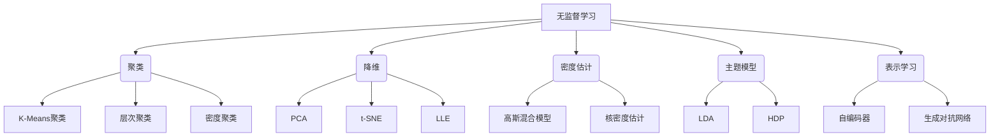

# 无监督学习 (Unsupervised Learning)

## 1. 背景介绍

### 1.1 问题的由来

在现实世界中,我们面临着大量的未标记数据,这些数据缺乏监督信息,使得传统的监督学习算法无法直接应用。然而,这些未标记数据蕴含着丰富的内在结构和模式,如果能够有效地从中提取有价值的信息,将为许多领域带来重大影响。因此,无监督学习应运而生,旨在从未标记的数据中发现隐藏的结构和模式。

无监督学习是机器学习的一个重要分支,它不需要任何人工标注的训练数据,而是直接从原始数据中自动发现数据的内在结构、模式或规律。与监督学习相比,无监督学习更接近于人类的学习方式,我们在成长过程中很大一部分知识都是通过观察和探索自然界而获得的,而非被明确告知。

### 1.2 研究现状

无监督学习在过去几十年中取得了长足的进步,已经广泛应用于多个领域,如计算机视觉、自然语言处理、推荐系统、异常检测等。常见的无监督学习算法包括聚类(Clustering)、降维(Dimensionality Reduction)、密度估计(Density Estimation)、主题模型(Topic Modeling)等。

随着大数据时代的到来,海量的未标记数据不断涌现,无监督学习的重要性与日俱增。同时,深度学习的兴起也为无监督学习注入了新的活力,使得无监督特征学习(Unsupervised Feature Learning)成为研究的热点。自编码器(Autoencoder)、生成对抗网络(Generative Adversarial Networks, GANs)等深度无监督模型展现出了巨大的潜力。

### 1.3 研究意义

无监督学习具有广阔的应用前景和重要的理论价值:

- 应用价值:无监督学习可以从大规模未标记数据中发现隐藏的模式和结构,为数据挖掘、信息检索、推荐系统等领域提供有力支持。
- 理论意义:无监督学习有助于揭示数据的本质特征,深入理解数据的内在结构,为监督学习提供有价值的先验知识。
- 智能系统:无监督学习是构建通用人工智能系统的关键组成部分,能够帮助机器自主获取知识,摆脱对大量人工标注数据的依赖。

### 1.4 本文结构

本文将系统地介绍无监督学习的核心概念、算法原理、数学模型,并通过实例代码和应用场景加深读者的理解。文章最后将探讨无监督学习的发展趋势和挑战,为读者提供全面的视角。文章主要内容包括:

- 核心概念与联系
- 核心算法原理与具体操作步骤
- 数学模型和公式详细讲解与案例分析
- 项目实践:代码实例和详细解释
- 实际应用场景
- 工具和资源推荐
- 总结:未来发展趋势与挑战
- 附录:常见问题与解答

## 2. 核心概念与联系

无监督学习包含多种不同的任务和算法,但是它们都围绕着从未标记数据中发现隐藏结构这一核心目标。以下是无监督学习的几个核心概念:

1. **聚类(Clustering)**: 将数据划分为多个簇(cluster),使得同一簇内的数据相似度较高,不同簇之间的数据相似度较低。常见的聚类算法有K-Means、层次聚类、密度聚类等。

2. **降维(Dimensionality Reduction)**: 将高维数据映射到低维空间,以减少数据的冗余和噪声,提高可解释性。主要算法有主成分分析(PCA)、t-SNE、局部线性嵌入(LLE)等。

3. **密度估计(Density Estimation)**: 估计样本数据的概率密度函数,常用于异常检测、数据生成等任务。典型模型包括高斯混合模型、核密度估计等。

4. **主题模型(Topic Modeling)**: 从文本语料库中自动发现潜在的主题结构。代表性算法有潜在狄利克雷分配(LDA)、层次狄利克雷过程(HDP)等。

5. **表示学习(Representation Learning)**: 自动学习数据的良好表示形式,捕捉数据的内在特征。主要方法包括自编码器、生成对抗网络等深度无监督模型。

这些核心概念相互关联、相辅相成,共同推动着无监督学习的发展。例如,降维和表示学习常被用作数据预处理,为后续的聚类和密度估计任务提供有效的低维表示;主题模型则可以看作是文本数据的聚类和表示学习。

## 3. 核心算法原理与具体操作步骤

无监督学习包含多种不同的算法,本节将重点介绍其中几种核心算法的原理和具体操作步骤。

### 3.1 算法原理概述

1. **K-Means聚类算法**

K-Means是一种简单而有效的聚类算法。它的基本思想是,首先随机初始化K个聚类中心,然后迭代地调整每个样本的簇分配和每个簇的中心,直至聚类结果收敛。算法旨在最小化所有样本到其所属簇中心的平方距离之和。

2. **主成分分析(PCA)降维算法**

PCA是一种常用的线性降维技术。它通过学习数据的协方差结构,将原始高维数据投影到一组相互正交的低维空间中,从而达到降维的目的。投影后的低维数据尽可能保留原始数据的方差信息。

3. **高斯混合模型(GMM)密度估计**

GMM假设数据服从多个高斯分布的混合,通过期望最大化(EM)算法来估计每个高斯分量的均值、协方差和混合系数。GMM可用于聚类、异常检测、数据生成等多种任务。

4. **自编码器(Autoencoder)表示学习**

自编码器是一种人工神经网络,它通过最小化输入数据与重构数据之间的差异,学习数据的有效编码表示。自编码器包括编码器和解码器两部分,前者将输入编码为潜在表示,后者则从潜在表示重建原始输入。

### 3.2 算法步骤详解

1. **K-Means聚类算法步骤**

输入: 数据集 $X = \{x_1, x_2, \ldots, x_n\}$, 簇数 $K$
输出: 每个样本的簇分配 $C = \{c_1, c_2, \ldots, c_n\}$

1) 随机初始化 $K$ 个聚类中心 $\mu_1, \mu_2, \ldots, \mu_K$
2) 重复直至收敛:
    a) 对每个样本 $x_i$, 计算其与每个聚类中心的距离 $d(x_i, \mu_j)$, 将其分配至最近的簇 $c_i = \arg\min_j d(x_i, \mu_j)$
    b) 对每个簇 $j$, 重新计算其中心 $\mu_j = \frac{1}{|C_j|}\sum_{x_i \in C_j}x_i$, 其中 $C_j$ 是簇 $j$ 中的样本集合
3) 返回每个样本的簇分配 $C$

2. **主成分分析(PCA)算法步骤**

输入: 数据矩阵 $X \in \mathbb{R}^{n \times d}$, 目标维度 $k$
输出: 降维后的数据 $Z \in \mathbb{R}^{n \times k}$

1) 对数据 $X$ 进行中心化,得到 $\tilde{X}$
2) 计算数据协方差矩阵 $\Sigma = \frac{1}{n}\tilde{X}^T\tilde{X}$
3) 对协方差矩阵 $\Sigma$ 进行特征值分解,得到特征值 $\lambda_1 \geq \lambda_2 \geq \ldots \geq \lambda_d$ 和对应的特征向量 $v_1, v_2, \ldots, v_d$
4) 选取前 $k$ 个最大特征值对应的特征向量,构成投影矩阵 $W = [v_1, v_2, \ldots, v_k]$
5) 将原始数据投影到 $k$ 维空间,得到降维后的数据 $Z = \tilde{X}W$

3. **高斯混合模型(GMM)EM算法步骤**

输入: 数据集 $X = \{x_1, x_2, \ldots, x_n\}$, 高斯分量数 $K$
输出: 每个高斯分量的参数 $\{\pi_k, \mu_k, \Sigma_k\}_{k=1}^K$

1) 随机初始化每个高斯分量的参数 $\{\pi_k, \mu_k, \Sigma_k\}_{k=1}^K$
2) 重复直至收敛:
    a) E步骤(Expectation): 计算每个样本 $x_i$ 对于每个高斯分量 $k$ 的响应度(responsibilities) $\gamma(z_{ik})$
    b) M步骤(Maximization): 更新每个高斯分量的参数
        - $\pi_k = \frac{1}{n}\sum_{i=1}^n\gamma(z_{ik})$
        - $\mu_k = \frac{1}{n_k}\sum_{i=1}^n\gamma(z_{ik})x_i$
        - $\Sigma_k = \frac{1}{n_k}\sum_{i=1}^n\gamma(z_{ik})(x_i - \mu_k)(x_i - \mu_k)^T$
    其中 $n_k = \sum_{i=1}^n\gamma(z_{ik})$
3) 返回每个高斯分量的参数 $\{\pi_k, \mu_k, \Sigma_k\}_{k=1}^K$

4. **自编码器(Autoencoder)训练步骤**

输入: 训练数据 $X = \{x_1, x_2, \ldots, x_n\}$, 编码器 $f_\theta$, 解码器 $g_\phi$
输出: 训练好的编码器 $f_\theta$ 和解码器 $g_\phi$

1) 初始化编码器参数 $\theta$ 和解码器参数 $\phi$
2) 对每个训练样本 $x_i$:
    a) 通过编码器获得潜在表示 $z_i = f_\theta(x_i)$
    b) 通过解码器从潜在表示重构输入 $\hat{x}_i = g_\phi(z_i)$
    c) 计算重构损失 $\mathcal{L}(x_i, \hat{x}_i)$
3) 通过梯度下降等优化算法,最小化所有样本的重构损失之和,更新 $\theta$ 和 $\phi$
4) 重复步骤2-3,直至收敛
5) 返回训练好的编码器 $f_\theta$ 和解码器 $g_\phi$

### 3.3 算法优缺点

1. **K-Means聚类**
    - 优点:简单、高效、可解释性强
    - 缺点:需要预先指定簇数K,对初始值敏感,只能发现球形簇

2. **主成分分析(PCA)**
    - 优点:理论基础扎实,计算高效
    - 缺点:只能捕捉线性结构,不能很好地处理非线性数据

3. **高斯混合模型(GMM)**
    - 优点:具有良好的理论基础,可以拟合任意形状的密度函数
    - 缺点:参数估计复杂,容易陷入局部最优

4. **自编码器**
    - 优点:能够学习数据的深层次表示,无需人工设计特征
    - 缺点:训练过程复杂