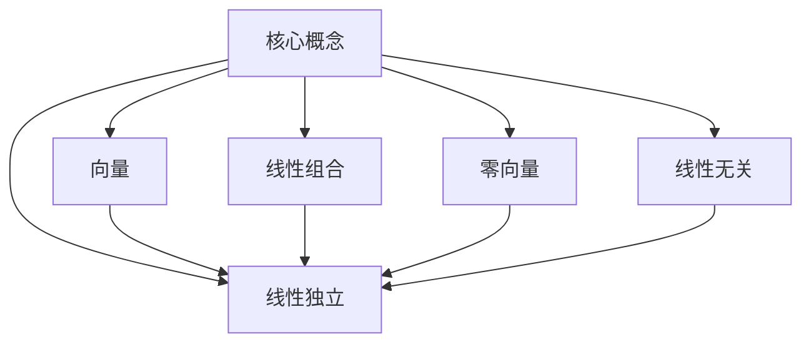

# 线性代数导引：线性独立性

## 1. 背景介绍

### 1.1 问题的由来

线性代数是数学的一个重要分支,在各个科学领域都有广泛的应用。线性独立性是线性代数中的一个基本概念,它描述了一组向量之间的关系,并为矩阵、线性变换等其他概念奠定了基础。线性独立性的概念源于对线性方程组的研究,旨在判断一组向量是否可以唯一确定一个线性组合。

### 1.2 研究现状

线性独立性的概念已经存在了很长时间,并且在线性代数的发展中扮演着重要角色。许多数学家和科学家对线性独立性进行了深入研究,并将其应用于各个领域。例如,在计算机科学中,线性独立性被用于图像处理、数据压缩和信号处理等领域。在物理学中,它被用于量子力学和相对论等领域。在工程领域,线性独立性被用于结构分析和控制系统等领域。

### 1.3 研究意义

线性独立性是线性代数的基础概念之一,对于理解和应用线性代数有着重要意义。掌握线性独立性的概念和性质,可以帮助我们更好地理解矩阵、线性变换等高级概念,并将线性代数应用于实际问题的求解。此外,线性独立性还与向量空间的基础理论密切相关,对于构建和理解向量空间具有重要意义。

### 1.4 本文结构

本文将从线性独立性的基本概念出发,逐步深入探讨其性质、判定方法和应用。文章将分为以下几个部分:

1. 背景介绍
2. 核心概念与联系
3. 核心算法原理与具体操作步骤
4. 数学模型和公式详细讲解与举例说明
5. 项目实践:代码实例和详细解释说明
6. 实际应用场景
7. 工具和资源推荐
8. 总结:未来发展趋势与挑战
9. 附录:常见问题与解答

## 2. 核心概念与联系

线性独立性是线性代数中的一个基本概念,它描述了一组向量之间的关系。在探讨线性独立性之前,我们需要先了解一些相关的核心概念。

1. **向量**:向量是一个具有大小和方向的量,通常用一组有序的实数或复数表示。向量是线性代数的基本对象。

2. **线性组合**:线性组合是指将多个向量按照某种比例相加而得到的新向量。具体来说,如果有一组向量 $\vec{v_1}, \vec{v_2}, \ldots, \vec{v_n}$,以及一组相应的标量 $c_1, c_2, \ldots, c_n$,那么线性组合可以表示为:

$$
c_1\vec{v_1} + c_2\vec{v_2} + \ldots + c_n\vec{v_n}
$$

3. **零向量**:零向量是一个特殊的向量,其所有分量都为零。零向量在线性代数中扮演着重要角色,它是线性组合的恒等元素。

4. **线性无关**:如果一组向量 $\vec{v_1}, \vec{v_2}, \ldots, \vec{v_n}$ 中,没有任何一个向量可以被其他向量的线性组合表示,那么这组向量就被称为线性无关。

5. **线性独立**:如果一组向量 $\vec{v_1}, \vec{v_2}, \ldots, \vec{v_n}$ 中,只有零向量可以被所有向量的线性组合表示为零向量,那么这组向量就被称为线性独立。换句话说,如果一组向量线性无关,那么它们就是线性独立的。

线性独立性是一个描述向量之间关系的重要概念,它与线性组合、零向量和线性无关等概念密切相关。掌握这些核心概念有助于我们更好地理解和应用线性独立性。

## 3. 核心算法原理与具体操作步骤

### 3.1 算法原理概述

判断一组向量是否线性独立的核心算法原理是基于线性组合的思想。具体来说,如果一组向量 $\vec{v_1}, \vec{v_2}, \ldots, \vec{v_n}$ 线性独立,那么它们之间就不存在非平凡的线性关系,即不存在一组非全为零的标量 $c_1, c_2, \ldots, c_n$,使得:

$$
c_1\vec{v_1} + c_2\vec{v_2} + \ldots + c_n\vec{v_n} = \vec{0}
$$

其中 $\vec{0}$ 表示零向量。

换句话说,如果一组向量线性独立,那么它们就不能被其他向量的线性组合表示为零向量,除非所有的标量系数都为零。这个原理可以用来判断一组向量是否线性独立。

### 3.2 算法步骤详解

判断一组向量是否线性独立的具体步骤如下:

1. 构造增广矩阵:将给定的向量作为增广矩阵的列向量,最后一列为常数项向量(通常为零向量)。

2. 高斯消元:对增广矩阵进行高斯消元,将其化为阶梯形矩阵。

3. 判断条件:
   - 如果在高斯消元的过程中,出现了一行全为零的情况,那么这组向量就是线性相关的(不独立)。
   - 如果在高斯消元的过程中,没有出现一行全为零的情况,并且最后一列全为零,那么这组向量就是线性无关的(独立)。

4. 特殊情况:如果给定的向量集合中包含零向量,那么这组向量一定是线性相关的。

这个算法的核心思想是利用高斯消元将线性组合的等式转化为增广矩阵的行阶梯形,然后根据最后一列是否全为零来判断线性独立性。

### 3.3 算法优缺点

这个算法的优点是:

1. 直观易懂:基于线性组合的思想,算法的原理直观易懂。

2. 通用性强:可以用于判断任意维度的向量组是否线性独立。

3. 计算效率较高:利用高斯消元的思想,算法的计算效率较高。

但是,这个算法也存在一些缺点:

1. 数值误差:在实际计算中,由于浮点数的精度限制,可能会引入数值误差,影响判断结果的准确性。

2. 计算量随维度增加而增加:当向量维度较高时,高斯消元的计算量会显著增加。

3. 无法给出线性相关的具体表示:算法只能判断向量组是否线性独立,但无法给出线性相关的具体表示形式。

### 3.4 算法应用领域

判断向量线性独立性的算法在许多领域都有重要应用,包括但不限于:

1. **线性方程组求解**:在求解线性方程组时,需要判断系数矩阵的列向量是否线性独立,以确定方程组是否有唯一解。

2. **矩阵秩计算**:矩阵的秩等于矩阵的线性无关列(或行)向量的个数,因此需要判断矩阵的列(或行)向量是否线性独立。

3. **向量空间基的构造**:在构造向量空间的基时,需要选取线性无关的向量作为基底向量。

4. **图像处理**:在图像压缩、去噪等图像处理任务中,需要判断像素向量之间的线性独立性。

5. **信号处理**:在信号处理中,需要判断信号向量之间的线性独立性,以进行信号分离和去噪。

6. **机器学习**:在特征选择、降维等机器学习任务中,需要判断特征向量之间的线性独立性。

总的来说,判断向量线性独立性是线性代数中一个基础而重要的问题,在许多科学和工程领域都有广泛的应用。

## 4. 数学模型和公式详细讲解与举例说明

### 4.1 数学模型构建

为了更好地理解和应用线性独立性的概念,我们需要构建一个数学模型。假设我们有一组 $n$ 个 $m$ 维向量 $\vec{v_1}, \vec{v_2}, \ldots, \vec{v_n}$,其中每个向量都可以表示为:

$$
\vec{v_i} = \begin{bmatrix}
v_{i1} \
v_{i2} \
\vdots \
v_{im}
\end{bmatrix}, \quad i = 1, 2, \ldots, n
$$

我们希望判断这组向量是否线性独立。为此,我们可以构造一个线性组合:

$$
c_1\vec{v_1} + c_2\vec{v_2} + \ldots + c_n\vec{v_n} = \vec{0}
$$

其中 $c_1, c_2, \ldots, c_n$ 是任意实数。

将上式展开,我们可以得到一个线性方程组:

$$
\begin{cases}
c_1v_{11} + c_2v_{21} + \ldots + c_nv_{n1} = 0 \
c_1v_{12} + c_2v_{22} + \ldots + c_nv_{n2} = 0 \
\vdots \
c_1v_{1m} + c_2v_{2m} + \ldots + c_nv_{nm} = 0
\end{cases}
$$

这个线性方程组可以用矩阵形式表示为:

$$
\begin{bmatrix}
v_{11} & v_{21} & \ldots & v_{n1} \
v_{12} & v_{22} & \ldots & v_{n2} \
\vdots & \vdots & \ddots & \vdots \
v_{1m} & v_{2m} & \ldots & v_{nm}
\end{bmatrix}
\begin{bmatrix}
c_1 \
c_2 \
\vdots \
c_n
\end{bmatrix}
= \vec{0}
$$

这个矩阵方程就构成了我们判断线性独立性的数学模型。如果这个方程组只有平凡解(即所有 $c_i$ 都为零),那么这组向量就是线性独立的;否则,这组向量就是线性相关的。

### 4.2 公式推导过程

接下来,我们将推导出判断线性独立性的一般公式。

假设我们有一组 $n$ 个 $m$ 维向量 $\vec{v_1}, \vec{v_2}, \ldots, \vec{v_n}$,它们的线性组合可以表示为:

$$
c_1\vec{v_1} + c_2\vec{v_2} + \ldots + c_n\vec{v_n} = \vec{0}
$$

将向量展开,我们可以得到:

$$
\begin{cases}
c_1v_{11} + c_2v_{21} + \ldots + c_nv_{n1} = 0 \
c_1v_{12} + c_2v_{22} + \ldots + c_nv_{n2} = 0 \
\vdots \
c_1v_{1m} + c_2v_{2m} + \ldots + c_nv_{nm} = 0
\end{cases}
$$

我们可以将这个线性方程组写成矩阵形式:

$$
\begin{bmatrix}
v_{11} & v_{21} & \ldots & v_{n1} \
v_{12} & v_{22} & \ldots & v_{n2} \
\vdots & \vdots & \ddots & \vdots \
v_{1m} & v_{2m} & \ldots & v_{nm}
\end{bmatrix}
\begin{bmatrix}
c_1 \
c_2 \
\vdots \
c_n
\end{bmatrix}
= \vec{0}
$$

令这个矩阵为 $A$,系数向量为 $\vec{c}$,那么上式可以简写为:

$$
A\vec{c} = \vec{0}
$$

根据线性代数的理论,如果这个方程只有平凡解(即 $\vec{c} = \vec{0}$),那么矩阵 $A$ 的列向量就是线性无关的,即这组向量 $\vec{v_1}, \vec{v_2}, \ldots, \vec{v_n}$ 是线性独立的。

反之,如果这个方程存在非平凡解(即存在 $\vec{c} \neq \vec{0