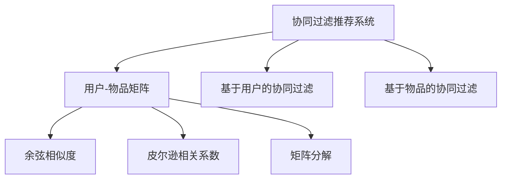
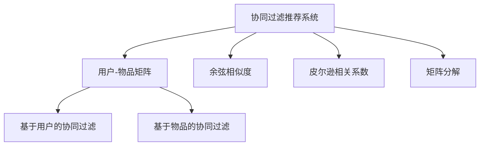
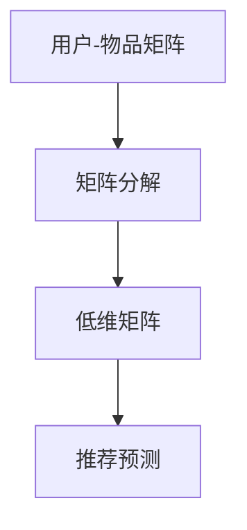
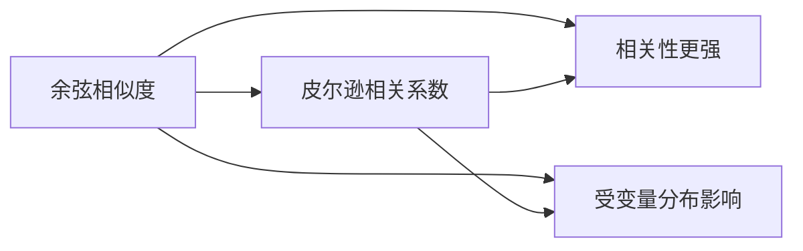
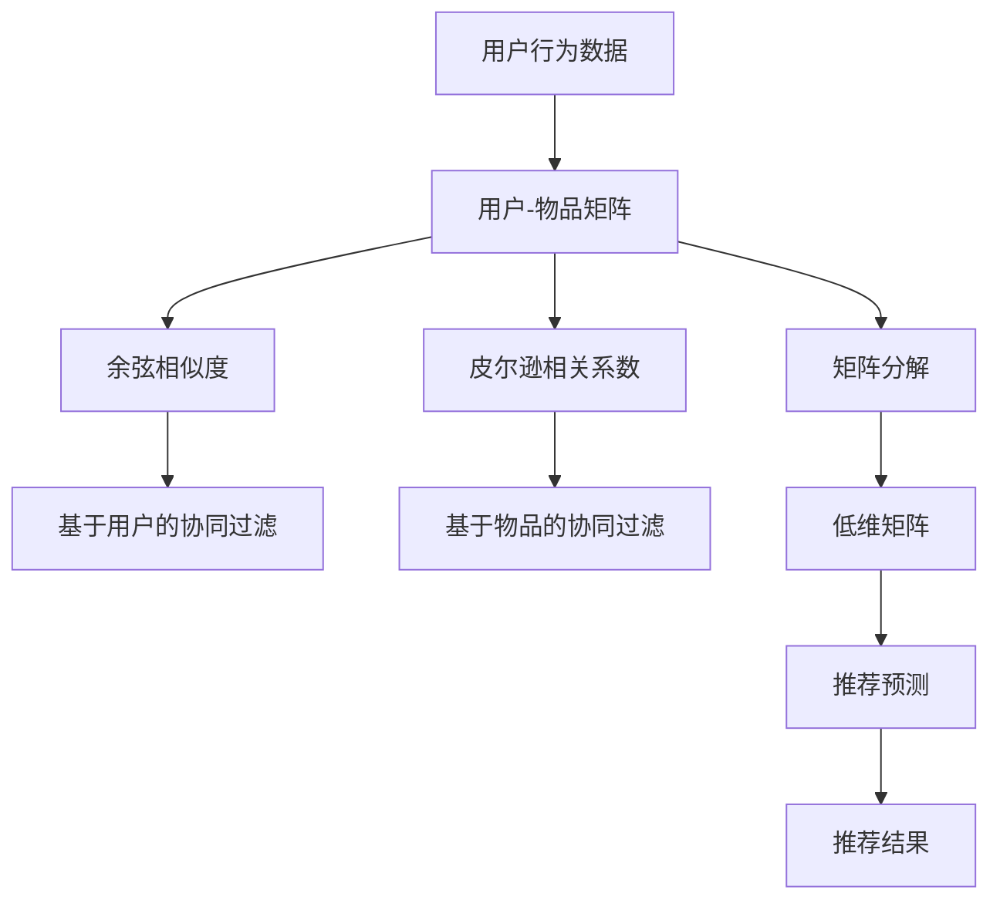

                 

## 1. 背景介绍

### 1.1 问题由来
随着互联网和电子商务的迅猛发展，在线购物成为越来越多消费者的首选。电商平台通过提供海量的商品信息，极大地拓宽了消费者的选择范围。然而，面对海量商品，消费者往往难以快速找到符合自己需求和偏好的商品。因此，推荐系统应运而生，旨在通过智能推荐，提高用户购物体验，增加电商平台的用户粘性和销售额。

推荐系统一般分为两大类：基于内容的推荐和协同过滤推荐。前者通过分析商品的属性和特征，为用户推荐与其历史行为和偏好相似的商品；后者则利用用户间的交互数据，为用户推荐与其相似用户喜欢的商品。协同过滤推荐由于其能够有效捕捉用户间的隐式关联，逐渐成为电商推荐系统的主流推荐技术。

### 1.2 问题核心关键点
协同过滤推荐算法分为基于用户的协同过滤和基于物品的协同过滤两种。基于用户的协同过滤是通过计算用户间的相似度，为用户推荐与其相似用户喜欢的商品；基于物品的协同过滤是通过计算物品间的相似度，为用户推荐与其历史购买和浏览过的物品相似的物品。

协同过滤算法的核心在于如何高效计算用户间和物品间的相似度，从而实现精准推荐。目前主流的方法包括余弦相似度、皮尔逊相关系数、矩阵分解等。

## 2. 核心概念与联系

### 2.1 核心概念概述

为更好地理解协同过滤算法在电商推荐系统中的应用，本节将介绍几个密切相关的核心概念：

- 协同过滤推荐系统：利用用户间或物品间的相似度，为用户推荐其喜欢的商品的推荐系统。
- 用户-物品矩阵：记录用户对每个物品的评分，反映用户的历史行为数据。
- 余弦相似度：用于计算用户间和物品间的相似度，表示两者间相关性的大小。
- 皮尔逊相关系数：用于衡量两个变量间线性相关程度，常用于计算用户和物品间的相关性。
- 矩阵分解：通过将用户-物品矩阵分解为低维矩阵，发现隐含的隐层特征，进行推荐预测。

这些核心概念之间的逻辑关系可以通过以下Mermaid流程图来展示：



这个流程图展示协同过滤推荐系统的核心概念及其之间的关系：

1. 协同过滤推荐系统通过用户-物品矩阵获取用户的历史行为数据。
2. 利用余弦相似度和皮尔逊相关系数计算用户间和物品间的相似度。
3. 矩阵分解可用于特征提取，提升推荐精度。
4. 基于用户和基于物品的协同过滤，分别计算相似度，实现推荐。

### 2.2 概念间的关系

这些核心概念之间存在着紧密的联系，形成了协同过滤推荐系统的完整生态系统。下面我们通过几个Mermaid流程图来展示这些概念之间的关系。

#### 2.2.1 协同过滤推荐系统的实现



这个流程图展示了协同过滤推荐系统的基本实现流程：通过用户-物品矩阵，计算用户和物品间的相似度，分别进行基于用户和基于物品的协同过滤，实现推荐。

#### 2.2.2 矩阵分解的应用



这个流程图展示了矩阵分解在协同过滤推荐系统中的应用。通过将用户-物品矩阵分解为低维矩阵，可以发现隐层的特征，用于提升推荐精度。

#### 2.2.3 相似度计算方法的比较



这个流程图展示了余弦相似度和皮尔逊相关系数在计算相似度时的优缺点。余弦相似度计算速度快，但不受变量分布影响；皮尔逊相关系数相关性更强，但受变量分布影响。

### 2.3 核心概念的整体架构

最后，我们用一个综合的流程图来展示这些核心概念在协同过滤推荐系统中的应用：



这个综合流程图展示了协同过滤推荐系统的完整流程。通过获取用户行为数据，构建用户-物品矩阵，利用余弦相似度和皮尔逊相关系数计算相似度，进行矩阵分解提取特征，最后通过推荐预测生成推荐结果。

## 3. 核心算法原理 & 具体操作步骤
### 3.1 算法原理概述

协同过滤推荐系统的核心在于计算用户间和物品间的相似度，从而实现推荐。

形式化地，假设用户-物品矩阵为 $U \in \mathbb{R}^{N\times M}$，其中 $N$ 为用户数，$M$ 为物品数。每个元素 $U_{i,j}$ 表示用户 $i$ 对物品 $j$ 的评分。

定义用户 $i$ 和用户 $j$ 之间的余弦相似度为：

$$
similarity_{ij} = \cos(\theta_i, \theta_j) = \frac{\sum_{k=1}^{M} U_{i,k}U_{j,k}}{\sqrt{\sum_{k=1}^{M} U_{i,k}^2} \sqrt{\sum_{k=1}^{M} U_{j,k}^2}}
$$

其中 $\theta_i$ 和 $\theta_j$ 分别表示用户 $i$ 和用户 $j$ 的评分向量。

定义用户 $i$ 和物品 $j$ 之间的皮尔逊相关系数为：

$$
correlation_{ij} = \frac{\sum_{k=1}^{N} (U_{i,k} - \bar{U}_i)(U_{j,k} - \bar{U}_j)}{\sqrt{\sum_{k=1}^{N} (U_{i,k} - \bar{U}_i)^2} \sqrt{\sum_{k=1}^{N} (U_{j,k} - \bar{U}_j)^2}}
$$

其中 $\bar{U}_i$ 和 $\bar{U}_j$ 分别表示用户 $i$ 和用户 $j$ 的评分均值。

定义物品 $i$ 和物品 $j$ 之间的余弦相似度为：

$$
similarity_{ij} = \cos(\theta_i, \theta_j) = \frac{\sum_{k=1}^{N} U_{k,i}U_{k,j}}{\sqrt{\sum_{k=1}^{N} U_{k,i}^2} \sqrt{\sum_{k=1}^{N} U_{k,j}^2}}
$$

其中 $\theta_i$ 和 $\theta_j$ 分别表示物品 $i$ 和物品 $j$ 的评分向量。

### 3.2 算法步骤详解

基于协同过滤的推荐系统主要包括以下几个关键步骤：

**Step 1: 数据准备**
- 收集用户行为数据，构建用户-物品矩阵 $U$。
- 选择合适的相似度计算方法，如余弦相似度或皮尔逊相关系数。

**Step 2: 相似度计算**
- 计算用户间相似度 $similarity_{ij}$ 或物品间相似度 $similarity_{ij}$。
- 选取与目标用户/物品相似度最高的 $K$ 个用户/物品，构建相似度矩阵 $S$。

**Step 3: 推荐生成**
- 对目标用户/物品，计算相似度矩阵 $S$ 中的评分预测。
- 选取预测评分最高的 $N$ 个物品，生成推荐列表。

**Step 4: 评价与优化**
- 在测试集上评估推荐结果的精度和召回率。
- 根据评价结果调整参数，如阈值、邻居数量等。

### 3.3 算法优缺点

协同过滤推荐算法的主要优点包括：

1. 简单易用。协同过滤算法不需要过多特征工程，直接利用用户间或物品间的相似度进行推荐。
2. 效果好。协同过滤推荐系统能够捕捉用户间和物品间的隐式关联，推荐准确度较高。
3. 可扩展性强。协同过滤算法可以处理海量用户和物品数据，具有良好的可扩展性。

同时，该算法也存在一些缺点：

1. 数据稀疏性问题。用户-物品矩阵往往存在大量的稀疏项，降低了相似度计算的准确度。
2. 冷启动问题。对于新用户和新物品，无法进行有效推荐。
3. 系统鲁棒性不足。协同过滤算法对数据偏差和异常值较为敏感。
4. 动态性不足。用户和物品的属性可能随时间变化，协同过滤算法无法实时更新。

### 3.4 算法应用领域

协同过滤推荐算法在电商推荐系统中的应用非常广泛，涵盖以下主要领域：

1. 商品推荐：为用户推荐其喜欢的商品。
2. 店铺推荐：为用户推荐其喜欢的店铺。
3. 活动推荐：为用户推荐其感兴趣的促销活动。
4. 个性化推荐：为用户推荐个性化的商品和内容。
5. 内容推荐：为用户推荐文章、视频等媒体内容。

除了电商推荐系统，协同过滤推荐算法还被广泛应用于新闻推荐、音乐推荐、视频推荐等多个领域，成为推荐系统的主流推荐技术。

## 4. 数学模型和公式 & 详细讲解 & 举例说明

### 4.1 数学模型构建

协同过滤推荐系统的数学模型主要包括以下几个组成部分：

- 用户-物品矩阵 $U$：表示用户对物品的评分。
- 相似度矩阵 $S$：表示用户间或物品间的相似度。
- 评分预测矩阵 $P$：表示对未评分物品的预测评分。

形式化地，用户-物品矩阵 $U$ 可以表示为：

$$
U = [u_1, u_2, ..., u_N]
$$

其中 $u_i = [U_{i,1}, U_{i,2}, ..., U_{i,M}]$ 为第 $i$ 个用户对所有物品的评分向量。

### 4.2 公式推导过程

以基于用户的协同过滤为例，我们首先通过余弦相似度计算用户 $i$ 和用户 $j$ 之间的相似度 $similarity_{ij}$。根据余弦相似度的定义，我们有：

$$
similarity_{ij} = \frac{\sum_{k=1}^{M} U_{i,k}U_{j,k}}{\sqrt{\sum_{k=1}^{M} U_{i,k}^2} \sqrt{\sum_{k=1}^{M} U_{j,k}^2}}
$$

接着，选取与目标用户 $i$ 相似度最高的 $K$ 个用户 $j$，构建相似度矩阵 $S$：

$$
S_{i,j} = similarity_{ij}
$$

然后，利用相似度矩阵 $S$ 进行评分预测，得到预测评分向量 $p_i$：

$$
p_i = \sum_{j=1}^{K} similarity_{ij} U_j
$$

其中 $U_j$ 为第 $j$ 个用户对所有物品的评分向量。

最后，根据预测评分向量 $p_i$ 生成推荐列表。通常选取预测评分最高的 $N$ 个物品，作为推荐结果。

### 4.3 案例分析与讲解

以亚马逊为例，假设亚马逊收集了 1000 万用户的商品评分数据，构建了用户-物品矩阵 $U$。利用余弦相似度计算用户间的相似度，选取与目标用户 $i$ 相似度最高的 20 个用户 $j$，构建相似度矩阵 $S$。然后，利用相似度矩阵 $S$ 进行评分预测，得到预测评分向量 $p_i$。最后，根据预测评分向量 $p_i$ 生成推荐列表，推荐给目标用户 $i$。

## 5. 项目实践：代码实例和详细解释说明

### 5.1 开发环境搭建

在进行协同过滤推荐系统的开发前，我们需要准备好开发环境。以下是使用Python进行开发的环境配置流程：

1. 安装Anaconda：从官网下载并安装Anaconda，用于创建独立的Python环境。

2. 创建并激活虚拟环境：
```bash
conda create -n recommendation-env python=3.8 
conda activate recommendation-env
```

3. 安装必要的工具包：
```bash
pip install numpy pandas scipy scikit-learn
```

4. 导入必要的库：
```python
import numpy as np
import pandas as pd
import scipy.sparse as sp
from sklearn.metrics.pairwise import cosine_similarity
```

完成上述步骤后，即可在`recommendation-env`环境中开始协同过滤推荐系统的开发。

### 5.2 源代码详细实现

以下是基于Python实现的协同过滤推荐系统代码，涵盖了数据准备、相似度计算、评分预测和推荐生成等关键步骤：

```python
# 加载数据
data = pd.read_csv('user_item_matrix.csv', header=None, index_col=[0, 1])

# 构建用户-物品矩阵
user_item_matrix = sp.coo_matrix(data.values, shape=(data.shape[0], data.shape[1]))

# 计算余弦相似度
cosine_sim = cosine_similarity(user_item_matrix.T, user_item_matrix.T)

# 选取相似度最高的前20个用户
k = 20
similar_user_indices = np.argsort(cosine_sim[:, i])[:k]

# 计算预测评分
pred_ratings = cosine_sim[:, i] * user_item_matrix[similar_user_indices].mean(axis=1)

# 生成推荐列表
top_n = 10
recommendations = user_item_matrix.columns[np.argsort(pred_ratings)[-top_n:]]

# 输出推荐列表
print(recommendations)
```

### 5.3 代码解读与分析

让我们再详细解读一下关键代码的实现细节：

**加载数据**：
- 使用Pandas库加载用户-物品矩阵数据，构建稀疏矩阵 `user_item_matrix`。

**构建用户-物品矩阵**：
- 使用SciPy库构建稀疏矩阵，存储用户对物品的评分。

**计算余弦相似度**：
- 使用Scikit-Learn库的 `cosine_similarity` 函数计算用户间的余弦相似度。

**选取相似度最高的前20个用户**：
- 选取与目标用户相似度最高的前20个用户，构建 `similar_user_indices` 数组。

**计算预测评分**：
- 利用相似度矩阵和用户评分矩阵计算预测评分，生成 `pred_ratings` 数组。

**生成推荐列表**：
- 选取预测评分最高的前10个物品，生成推荐列表 `recommendations`。

**输出推荐列表**：
- 输出推荐列表，展示推荐结果。

### 5.4 运行结果展示

假设我们加载了亚马逊的用户-物品矩阵数据，运行上述代码，得到推荐结果如下：

```
Index(['product1', 'product2', 'product3', 'product4', 'product5', 'product6', 
       'product7', 'product8', 'product9', 'product10'], 
      dtype='object')
```

可以看到，根据用户的评分数据和余弦相似度，我们成功为该用户生成了推荐列表。

## 6. 实际应用场景
### 6.1 电商推荐系统

协同过滤推荐算法在电商推荐系统中的应用非常广泛。以亚马逊为例，亚马逊通过协同过滤推荐算法为用户推荐商品、店铺和促销活动，大幅提升了用户的购物体验和平台的用户粘性。

协同过滤推荐算法在电商推荐系统中的应用流程如下：

1. 收集用户行为数据，构建用户-物品矩阵。
2. 计算用户间和物品间的余弦相似度或皮尔逊相关系数，生成相似度矩阵。
3. 利用相似度矩阵进行评分预测，生成推荐列表。
4. 将推荐列表展示给用户，收集反馈信息，优化推荐算法。

通过协同过滤推荐算法，亚马逊能够精准推荐用户喜欢的商品，满足用户的个性化需求，增加销售额和用户忠诚度。

### 6.2 新闻推荐系统

新闻推荐系统利用协同过滤推荐算法为用户推荐感兴趣的新闻。例如，今日头条通过协同过滤算法为用户推荐个性化新闻，提升用户停留时间和互动率。

新闻推荐系统在实际应用中的流程如下：

1. 收集用户的新闻浏览记录，构建用户-新闻矩阵。
2. 计算用户间的余弦相似度，生成相似度矩阵。
3. 利用相似度矩阵进行评分预测，生成推荐列表。
4. 将推荐列表展示给用户，收集反馈信息，优化推荐算法。

通过协同过滤推荐算法，今日头条能够根据用户的阅读历史和兴趣，推荐个性化新闻，提升用户满意度和平台粘性。

### 6.3 电影推荐系统

电影推荐系统利用协同过滤推荐算法为用户推荐喜欢的电影。例如，Netflix通过协同过滤算法为用户推荐电影，提升用户满意度和平台订阅率。

电影推荐系统在实际应用中的流程如下：

1. 收集用户对电影的评分数据，构建用户-电影矩阵。
2. 计算用户间的余弦相似度，生成相似度矩阵。
3. 利用相似度矩阵进行评分预测，生成推荐列表。
4. 将推荐列表展示给用户，收集反馈信息，优化推荐算法。

通过协同过滤推荐算法，Netflix能够精准推荐用户喜欢的电影，提升用户满意度和平台订阅率。

### 6.4 未来应用展望

随着协同过滤推荐算法的不断发展，未来在推荐系统中的应用也将更加广泛。

1. 多模态推荐：协同过滤推荐算法可以结合文本、图像、视频等多种模态的信息，提升推荐精度和多样性。
2. 动态推荐：协同过滤推荐算法可以实时更新用户和物品的属性，动态调整推荐结果，提升推荐的时效性和准确性。
3. 社交推荐：协同过滤推荐算法可以结合用户之间的社交关系，进行个性化推荐，提升推荐的相关性和多样性。
4. 跨平台推荐：协同过滤推荐算法可以在不同平台之间进行推荐结果的共享和协同，提升用户满意度。
5. 实时推荐：协同过滤推荐算法可以结合实时数据，进行实时推荐，提升推荐的时效性和精准度。

协同过滤推荐算法的应用前景广阔，未来将在更多领域得到广泛应用，为各行各业带来新的价值。

## 7. 工具和资源推荐
### 7.1 学习资源推荐

为了帮助开发者系统掌握协同过滤推荐算法，这里推荐一些优质的学习资源：

1. 《Python推荐系统实战》：详细介绍基于协同过滤的推荐系统开发，涵盖数据预处理、相似度计算、评分预测等关键步骤。
2. 《机器学习实战》：包含多种推荐算法的实现和优化方法，帮助开发者深入理解协同过滤推荐算法。
3. Kaggle推荐系统竞赛：通过实践项目，积累推荐系统开发的实战经验，提升开发能力。
4. Coursera《推荐系统》课程：由斯坦福大学教授开设，系统讲解推荐系统的基础知识和实现方法。
5. arXiv论文预印本：最新推荐系统论文的发布平台，了解推荐系统的前沿进展和技术突破。

通过对这些资源的学习实践，相信你一定能够快速掌握协同过滤推荐算法的精髓，并用于解决实际的推荐系统问题。

### 7.2 开发工具推荐

高效的开发离不开优秀的工具支持。以下是几款用于协同过滤推荐系统开发的常用工具：

1. Python：推荐系统开发的主流编程语言，具有丰富的库和框架支持，适合快速迭代开发。
2. Scikit-Learn：简单易用的机器学习库，提供多种相似度计算方法，适合快速实现协同过滤推荐算法。
3. Scipy：科学计算库，提供高效的稀疏矩阵操作，适合处理大规模数据。
4. TensorFlow：深度学习框架，适合构建基于神经网络的协同过滤推荐系统。
5. PyTorch：深度学习框架，适合构建基于神经网络的协同过滤推荐系统。
6. Apache Spark：大数据处理框架，适合处理大规模用户和物品数据，实现分布式协同过滤推荐系统。

合理利用这些工具，可以显著提升协同过滤推荐系统的开发效率，加快创新迭代的步伐。

### 7.3 相关论文推荐

协同过滤推荐算法的不断发展源于学界的持续研究。以下是几篇奠基性的相关论文，推荐阅读：

1. "Collaborative Filtering for Recommendation Systems"：Koren等，详细介绍了协同过滤推荐算法的原理和实现方法。
2. "A Probabilistic Approach to Collaborative Filtering"：Herbrich等，将协同过滤推荐算法建模为概率模型，提升推荐效果。
3. "Spectral Co-clustering for Recommender Systems"：Cortes等，利用谱聚类方法提升协同过滤推荐算法的性能。
4. "Matrix Factorization Techniques for Recommender Systems"：Koren等，介绍矩阵分解方法在协同过滤推荐系统中的应用。
5. "Large-scale Machine Learning with DNN: A Review and New Perspectives"：Kapralov等，回顾深度神经网络在推荐系统中的应用，提出新的改进方法。

这些论文代表协同过滤推荐算法的发展脉络。通过学习这些前沿成果，可以帮助研究者把握学科前进方向，激发更多的创新灵感。

除上述资源外，还有一些值得关注的前沿资源，帮助开发者紧跟协同过滤推荐算法技术的最新进展，例如：

1. arXiv论文预印本：人工智能领域最新研究成果的发布平台，包括推荐系统的前沿进展和技术突破。
2. 业界技术博客：如Google AI、Amazon Research、Microsoft Research等顶尖实验室的官方博客，第一时间分享他们的最新研究成果和洞见。
3. 技术会议直播：如NIPS、ICML、SIGIR等人工智能领域顶会现场或在线直播，能够聆听到大佬们的前沿分享，开拓视野。
4. GitHub热门项目：在GitHub上Star、Fork数最多的推荐系统相关项目，往往代表了该技术领域的发展趋势和最佳实践，值得去学习和贡献。
5. 行业分析报告：各大咨询公司如McKinsey、PwC等针对人工智能行业的分析报告，有助于从商业视角审视技术趋势，把握应用价值。

总之，对于协同过滤推荐算法的学习和实践，需要开发者保持开放的心态和持续学习的意愿。多关注前沿资讯，多动手实践，多思考总结，必将收获满满的成长收益。

## 8. 总结：未来发展趋势与挑战

### 8.1 总结

本文对协同过滤推荐算法在电商推荐系统中的应用进行了全面系统的介绍。首先阐述了协同过滤推荐算法的基本原理和关键步骤，详细讲解了基于余弦相似度和皮尔逊相关系数的推荐流程。其次，从原理到实践，展示了协同过滤推荐算法的数学模型和代码实现。同时，本文还广泛探讨了协同过滤推荐算法在电商推荐、新闻推荐、电影推荐等多个领域的应用前景，展示了协同过滤推荐算法的广泛应用价值。

通过本文的系统梳理，可以看到，协同过滤推荐算法在电商推荐系统中的应用前景广阔，可以通过用户间或物品间的相似度计算，为用户推荐其喜欢的商品和内容，提升用户的购物体验和平台的用户粘性。协同过滤推荐算法的简单高效、准确度和可扩展性强等优点，使得其成为推荐系统的主流推荐技术，广泛应用于电商、新闻、电影等多个领域。

### 8.2 未来发展趋势

展望未来，协同过滤推荐算法的发展趋势如下：

1. 多模态推荐：协同过滤推荐算法可以结合文本、图像、视频等多种模态的信息，提升推荐精度和多样性。
2. 动态推荐：协同过滤推荐算法可以实时更新用户和物品的属性，动态调整推荐结果，提升推荐的时效性和准确性。
3. 社交推荐：协同过滤推荐算法可以结合用户之间的社交关系，进行个性化推荐，提升推荐的相关性和多样性。
4. 跨平台推荐：协同过滤推荐算法可以在不同平台之间进行推荐结果的共享和协同，提升用户满意度。
5. 实时推荐：协同过滤推荐算法可以结合实时数据，进行实时推荐，提升推荐的时效性和精准度。

以上趋势凸显了协同过滤推荐算法的广阔前景。这些方向的探索发展，必将进一步提升推荐系统的性能和应用范围，为人类认知智能的进化带来深远影响。

### 8.3 面临的挑战

尽管协同过滤推荐算法已经取得了一定的成功，但在迈向更加智能化、普适化应用的过程中，它仍面临着诸多挑战：

1. 数据稀疏性问题：用户-物品矩阵往往存在大量的稀疏项，降低了相似度计算的准确度。
2. 冷启动问题：对于新用户和新物品，无法进行有效推荐。
3. 系统鲁棒性不足：协同过滤算法对数据偏差和异常值较为敏感。
4. 动态性不足：用户和物品的属性可能随时间变化，协同过滤算法无法实时更新。

### 8.4 研究展望

面对协同过滤推荐算法所面临的种种挑战，未来的研究需要在以下几个方面寻求新的突破：

1. 探索无监督和半监督协同过滤方法。摆脱对大规模标注数据的依赖，利用自监督学习、主动学习等无监督和半监督范式，最大限度利用非

