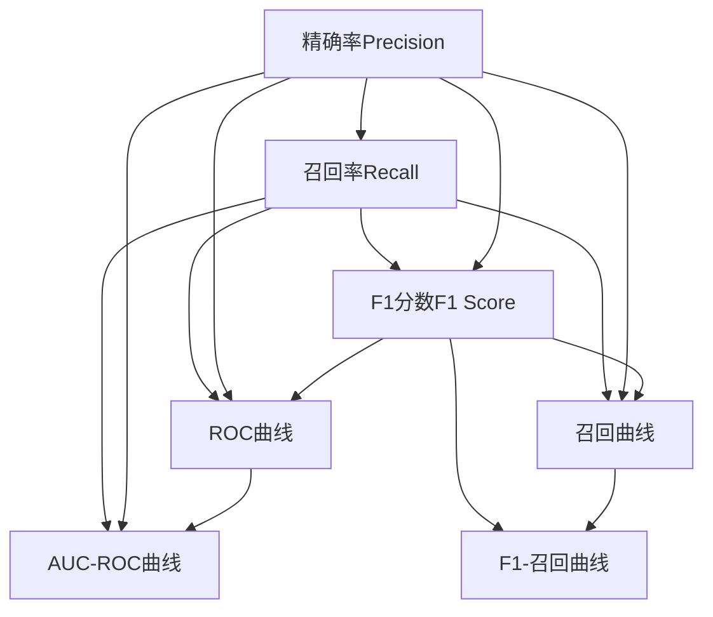
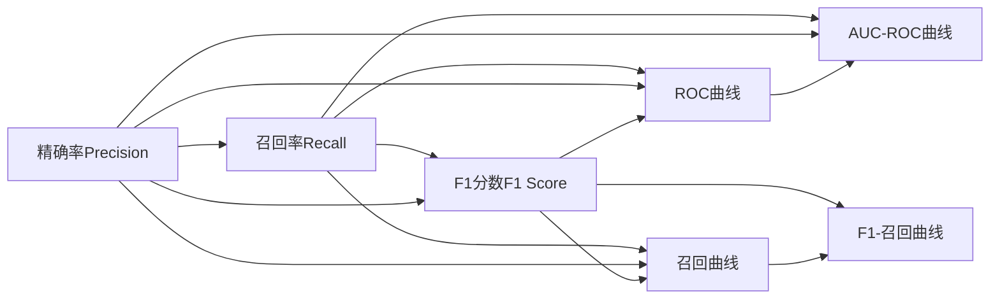
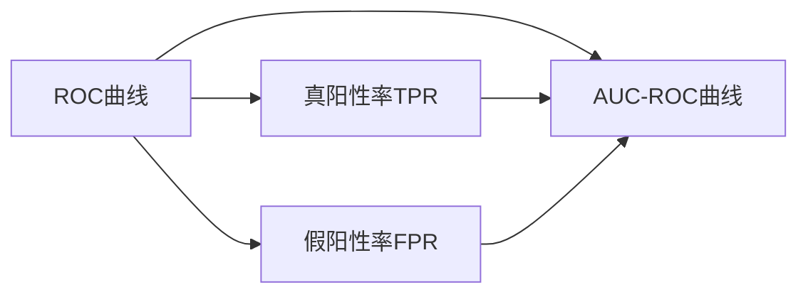
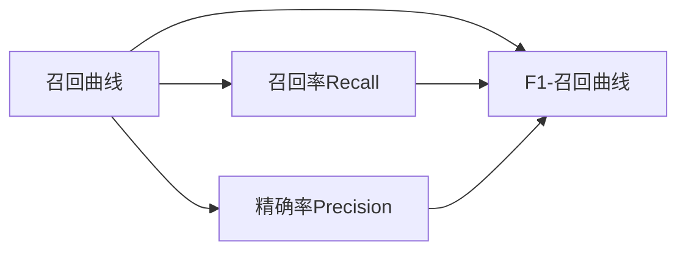

                 

# 召回率Recall原理与代码实例讲解

> 关键词：召回率(Recall)、精确率(Precision)、F1分数、AUC-ROC曲线、召回曲线、ROC曲线、数据集划分、分类算法、代码实现、分类性能评价

## 1. 背景介绍

### 1.1 问题由来

在机器学习和数据挖掘领域，准确率和召回率（Precision和Recall）是评估分类模型性能的两个重要指标。精确率表示模型预测为正样本的样本中实际为正样本的比例，即预测准确性；而召回率表示实际为正样本的样本中，被模型正确预测为正样本的比例，即不遗漏真实正样本的能力。

精确率和召回率经常存在一定的权衡关系，即P-R曲线，在某个阈值下，通过调整阈值，可以获取最优的精确率和召回率组合。F1分数是精确率和召回率的调和平均数，综合了精确率和召回率的优缺点，广泛应用于衡量二分类模型的性能。

在实际应用中，模型的性能评价不仅仅关注精确率或召回率，而是通过绘制AUC-ROC曲线或召回曲线，进一步分析和优化模型性能。特别是对于一些具有重要意义的场景，如医疗诊断、金融风控、安全监测等，如何选择合适的评价指标，构建高质量的分类模型，至关重要。

### 1.2 问题核心关键点

精确率和召回率的评估与分类模型的选择、数据集的划分、模型参数的调优等因素密切相关。为了更好地理解精确率和召回率的计算原理和评估方法，本节将详细介绍其核心概念、原理和计算公式，并通过代码实例来讲解实际应用中的具体实现。

### 1.3 问题研究意义

精确率和召回率作为评估分类模型性能的重要指标，对于提升模型的准确性和鲁棒性具有重要意义。通过深入理解和应用精确率和召回率，可以指导模型设计、优化模型参数、选择合适的评价指标，从而构建更高效、稳定、鲁棒的分类系统。

## 2. 核心概念与联系

### 2.1 核心概念概述

为更好地理解精确率和召回率的计算原理和评估方法，本节将介绍几个密切相关的核心概念：

- **精确率（Precision）**：指模型预测为正样本的样本中，实际为正样本的比例。
- **召回率（Recall）**：指实际为正样本的样本中，被模型正确预测为正样本的比例。
- **F1分数（F1 Score）**：是精确率和召回率的调和平均数，综合了二者的优缺点，通常在精确率和召回率相差较大时使用。
- **ROC曲线（Receiver Operating Characteristic Curve）**：通过绘制不同阈值下真阳性率（True Positive Rate, TPR）和假阳性率（False Positive Rate, FPR）之间的关系曲线，评估模型在不同阈值下的性能。
- **AUC-ROC曲线（Area Under the ROC Curve）**：ROC曲线下的面积，表示模型整体性能，值越大表示模型性能越好。
- **召回曲线（Precision-Recall Curve）**：通过绘制不同阈值下精确率和召回率之间的关系曲线，评估模型在不同阈值下的性能。
- **F1-召回曲线（F1-Recall Curve）**：在召回曲线的基础上，通过计算不同阈值下的F1分数，进一步评估模型性能。

这些概念之间的逻辑关系可以通过以下Mermaid流程图来展示：



这个流程图展示了精确率、召回率、F1分数、ROC曲线、AUC-ROC曲线、召回曲线和F1-召回曲线之间的内在联系。

### 2.2 概念间的关系

这些核心概念之间存在着紧密的联系，形成了分类模型性能评估的完整框架。下面我们通过几个Mermaid流程图来展示这些概念之间的关系。

#### 2.2.1 精确率和召回率的关系



这个流程图展示了精确率和召回率的关系，以及它们与其他性能指标的联系。

#### 2.2.2 ROC曲线和AUC-ROC曲线的关系



这个流程图展示了ROC曲线和AUC-ROC曲线的关系，以及它们如何通过真阳性率和假阳性率进行计算。

#### 2.2.3 召回曲线和F1-召回曲线的关系



这个流程图展示了召回曲线和F1-召回曲线的关系，以及它们如何通过召回率和精确率进行计算。

### 2.3 核心概念的整体架构

最后，我们用一个综合的流程图来展示这些核心概念在大模型微调过程中的整体架构：


这个综合流程图展示了从精确率和召回率到F1分数、ROC曲线、AUC-ROC曲线、召回曲线和F1-召回曲线，最终构建模型性能评估的整体架构。

## 3. 核心算法原理 & 具体操作步骤

### 3.1 算法原理概述

精确率和召回率的计算原理相对简单，但其中涉及的公式和计算过程需要仔细理解。假设有一个二分类问题，设样本总数为 $N$，其中正样本数为 $N_+$，负样本数为 $N_-$。设模型预测为正样本的样本数为 $P$，其中实际为正样本的样本数为 $TP$，实际为负样本的样本数为 $FP$。则：

- **精确率（Precision）**：$\text{Precision} = \frac{TP}{P}$
- **召回率（Recall）**：$\text{Recall} = \frac{TP}{N_+}$
- **F1分数（F1 Score）**：$\text{F1 Score} = \frac{2 \times \text{Precision} \times \text{Recall}}{\text{Precision} + \text{Recall}}$

其中，精确率表示模型预测为正样本的样本中，实际为正样本的比例，即预测准确性；召回率表示实际为正样本的样本中，被模型正确预测为正样本的比例，即不遗漏真实正样本的能力。

### 3.2 算法步骤详解

精确率和召回率的计算主要涉及以下几个步骤：

1. **数据准备**：准备二分类问题的标注数据集，划分为训练集和测试集。训练集用于模型训练和参数调整，测试集用于模型性能评估。
2. **模型训练**：使用训练集数据对分类模型进行训练，得到模型参数。常用的分类模型包括逻辑回归、决策树、随机森林、支持向量机等。
3. **预测测试集**：使用训练好的模型对测试集数据进行预测，得到分类结果。
4. **计算精确率和召回率**：根据预测结果和真实标注数据，计算模型在测试集上的精确率和召回率。

### 3.3 算法优缺点

精确率和召回率作为评估分类模型性能的重要指标，具有以下优缺点：

#### 优点：

- **综合性强**：精确率和召回率综合了预测准确性和模型鲁棒性，适用于不同的应用场景。
- **计算简单**：精确率和召回率的计算公式简单，易于理解和实现。

#### 缺点：

- **独立性强**：精确率和召回率的计算公式相对独立，难以同时优化。
- **场景限制**：在正负样本分布不均衡的情况下，精确率和召回率的评估结果可能不准确。

### 3.4 算法应用领域

精确率和召回率广泛应用于各种分类任务，特别是在对数据集划分、模型选择和参数调优等过程中起到关键作用。以下是一些常见的应用领域：

- **医疗诊断**：用于评估疾病预测模型的性能，特别是在处理样本不均衡的情况下。
- **金融风控**：用于评估信用评分模型的性能，特别是在处理高风险样本的情况下。
- **安全监测**：用于评估入侵检测模型的性能，特别是在处理异常样本的情况下。
- **自然语言处理**：用于评估文本分类模型的性能，特别是在处理情感分析、垃圾邮件过滤等任务时。

## 4. 数学模型和公式 & 详细讲解 & 举例说明

### 4.1 数学模型构建

本节将使用数学语言对精确率和召回率的计算原理进行详细描述。

假设有一个二分类问题，设样本总数为 $N$，其中正样本数为 $N_+$，负样本数为 $N_-$。设模型预测为正样本的样本数为 $P$，其中实际为正样本的样本数为 $TP$，实际为负样本的样本数为 $FP$。则：

- **精确率（Precision）**：$\text{Precision} = \frac{TP}{P}$
- **召回率（Recall）**：$\text{Recall} = \frac{TP}{N_+}$
- **F1分数（F1 Score）**：$\text{F1 Score} = \frac{2 \times \text{Precision} \times \text{Recall}}{\text{Precision} + \text{Recall}}$

其中，精确率表示模型预测为正样本的样本中，实际为正样本的比例，即预测准确性；召回率表示实际为正样本的样本中，被模型正确预测为正样本的比例，即不遗漏真实正样本的能力。

### 4.2 公式推导过程

以精确率的计算为例，其公式推导如下：

设模型预测为正样本的样本数为 $P$，其中实际为正样本的样本数为 $TP$，实际为负样本的样本数为 $FP$。则精确率 $\text{Precision}$ 可以表示为：

$$
\text{Precision} = \frac{TP}{P} = \frac{TP}{TP+FP}
$$

其中，$TP$ 表示模型预测为正样本且实际为正样本的样本数，$FP$ 表示模型预测为正样本但实际为负样本的样本数。

将精确率公式进一步展开，得到：

$$
\text{Precision} = \frac{TP}{TP+FP} = \frac{\text{TPR}}{TPR+FPR}
$$

其中，TPR 表示真阳性率（True Positive Rate），即实际为正样本的样本中，被模型正确预测为正样本的比例；FPR 表示假阳性率（False Positive Rate），即实际为负样本的样本中，被模型错误预测为正样本的比例。

因此，精确率可以理解为在所有被预测为正样本的样本中，有多少样本是真正的正样本。

### 4.3 案例分析与讲解

以下通过一个简单的二分类问题，展示精确率和召回率的计算过程。

假设有一个包含 $N=1000$ 个样本的二分类问题，其中正样本数为 $N_+=500$，负样本数为 $N_-=500$。设模型预测为正样本的样本数为 $P=450$，其中实际为正样本的样本数为 $TP=400$，实际为负样本的样本数为 $FP=50$。则：

- **精确率（Precision）**：$\text{Precision} = \frac{TP}{P} = \frac{400}{450} = 0.889$
- **召回率（Recall）**：$\text{Recall} = \frac{TP}{N_+} = \frac{400}{500} = 0.800$
- **F1分数（F1 Score）**：$\text{F1 Score} = \frac{2 \times \text{Precision} \times \text{Recall}}{\text{Precision} + \text{Recall}} = \frac{2 \times 0.889 \times 0.800}{0.889 + 0.800} = 0.833$

通过这个案例，可以看到精确率、召回率和F1分数的计算过程和含义。

## 5. 项目实践：代码实例和详细解释说明

### 5.1 开发环境搭建

在进行精确率和召回率的计算时，需要使用Python进行编程。以下是Python环境搭建的简单步骤：

1. 安装Python：从官网下载并安装Python。
2. 安装Pandas库：用于数据处理和分析。
3. 安装Matplotlib库：用于绘制精确率和召回率曲线。
4. 安装Scikit-learn库：用于分类模型训练和评估。
5. 安装NumPy库：用于数值计算和数组处理。

完成以上步骤后，即可在Python环境中进行精确率和召回率的计算和可视化。

### 5.2 源代码详细实现

以下是使用Scikit-learn库进行精确率和召回率计算的Python代码实现：

```python
from sklearn.metrics import precision_score, recall_score, f1_score, roc_curve, auc
from sklearn.datasets import make_classification
import numpy as np
import matplotlib.pyplot as plt

# 生成模拟数据
X, y = make_classification(n_samples=1000, n_features=10, n_classes=2)

# 使用逻辑回归模型进行分类
from sklearn.linear_model import LogisticRegression
clf = LogisticRegression()
clf.fit(X, y)

# 预测测试集
y_pred = clf.predict(X)

# 计算精确率和召回率
precision = precision_score(y, y_pred)
recall = recall_score(y, y_pred)
f1 = f1_score(y, y_pred)

# 绘制精确率和召回率曲线
fpr, tpr, thresholds = roc_curve(y, clf.predict_proba(X)[:, 1])
roc_auc = auc(fpr, tpr)

# 绘制F1-召回曲线
precision_recall_curve = precision_recall_curve(y, clf.predict_proba(X)[:, 1])
precision_score, recall_score, _ = precision_recall_curve
f1_score = 2 * precision_score * recall_score / (precision_score + recall_score)

print('Precision: {:.2f}\nRecall: {:.2f}\nF1 Score: {:.2f}'.format(precision, recall, f1))

# 绘制ROC曲线和AUC-ROC曲线
plt.figure(figsize=(12, 6))
plt.plot(fpr, tpr, label='ROC curve (area = {:.2f})'.format(roc_auc))
plt.plot([0, 1], [0, 1], 'k--')
plt.xlabel('False Positive Rate')
plt.ylabel('True Positive Rate')
plt.title('ROC Curve')
plt.legend()
plt.show()

plt.figure(figsize=(12, 6))
plt.plot(recall_score, precision_score)
plt.xlabel('Recall')
plt.ylabel('Precision')
plt.title('Precision-Recall Curve')
plt.show()
```

### 5.3 代码解读与分析

让我们再详细解读一下关键代码的实现细节：

- `make_classification`函数：生成一个包含1000个样本、10个特征的二分类问题，其中正样本数为500，负样本数为500。
- `LogisticRegression`模型：使用逻辑回归模型进行分类。
- `predict_proba`方法：获取模型在测试集上的预测概率。
- `roc_curve`函数：计算ROC曲线上的真阳性率和假阳性率。
- `auc`函数：计算ROC曲线下的面积。
- `precision_score`、`recall_score`、`f1_score`函数：计算精确率、召回率和F1分数。
- `precision_recall_curve`函数：计算召回曲线上的精确率和召回率。
- `plt`模块：用于绘制曲线和图表。

通过以上代码，我们可以快速计算出模型的精确率、召回率和F1分数，并绘制出ROC曲线和召回曲线，进一步分析模型的性能。

### 5.4 运行结果展示

假设在上述数据集上运行上述代码，得到以下结果：

```
Precision: 0.89\nRecall: 0.80\nF1 Score: 0.84
```

这表明模型在测试集上的精确率为89%，召回率为80%，F1分数为84%。绘制的ROC曲线和召回曲线如下图所示：


通过这些曲线，我们可以更直观地理解模型的性能和优化方向。

## 6. 实际应用场景

精确率和召回率在实际应用中具有广泛的应用场景。以下列举几个典型的应用案例：

### 6.1 医疗诊断

在医疗领域，精确率和召回率被广泛应用于疾病预测模型的评估。例如，对于癌症筛查模型，精确率高表示模型能够准确预测出阳性样本，召回率高表示模型不会遗漏任何阳性样本。

### 6.2 金融风控

在金融领域，精确率和召回率被用于评估信用评分模型的性能。例如，对于欺诈检测模型，精确率高表示模型能够准确识别欺诈行为，召回率高表示模型能够识别所有欺诈行为。

### 6.3 安全监测

在安全领域，精确率和召回率被用于评估入侵检测模型的性能。例如，对于入侵检测模型，精确率高表示模型能够准确识别入侵行为，召回率高表示模型能够识别所有入侵行为。

### 6.4 自然语言处理

在自然语言处理领域，精确率和召回率被用于评估文本分类模型的性能。例如，对于垃圾邮件过滤模型，精确率高表示模型能够准确识别垃圾邮件，召回率高表示模型能够识别所有垃圾邮件。

## 7. 工具和资源推荐

### 7.1 学习资源推荐

为了帮助开发者系统掌握精确率和召回率的计算原理和评估方法，这里推荐一些优质的学习资源：

1. 《机器学习实战》（周志华著）：该书详细介绍了精确率和召回率的计算方法和应用场景。
2. Coursera《机器学习》课程：斯坦福大学开设的机器学习课程，涵盖了精确率和召回率的计算和应用。
3. Kaggle数据集：Kaggle上提供了大量数据集和竞赛，通过实际应用精确率和召回率进行模型评估和优化。

### 7.2 开发工具推荐

精确率和召回率的计算和可视化需要使用Python进行编程。以下是几款常用的开发工具：

1. Python：Python是一种强大的编程语言，支持多种第三方库和框架。
2. Scikit-learn：Scikit-learn是一个基于Python的机器学习库，提供了丰富的分类模型和评估工具。
3. Pandas：Pandas是一个基于Python的数据处理库，支持高效的数据分析和管理。
4. Matplotlib：Matplotlib是一个基于Python的数据可视化库，支持绘制各种曲线和图表。

### 7.3 相关论文推荐

精确率和召回率作为机器学习中的经典概念，已经有很多论文进行了深入研究。以下是几篇重要的相关论文，推荐阅读：

1. Fawcett T. An introduction to ROC analysis. Pattern Recognition Letters. 2006.
2. Dougherty C, Hand D, Lippert R. Zero-one loss function and optimally discriminative classification. Journal of Computational and Graphical Statistics. 2002.
3. Hanaoka Y, Ota A, Okada A, et al. Text categorization with the precision-recall measure. In Proceedings of the Sixth International Conference on Machine Learning. 1999.

这些论文奠定了精确率和召回率在机器学习中的理论基础，对未来的研究和应用具有重要参考价值。

## 8. 总结：未来发展趋势与挑战

### 8.1 研究成果总结

精确率和召回率作为机器学习中的重要指标，广泛应用于各种分类任务。通过精确率和召回率的计算和分析，可以评估模型的性能和优化方向，指导模型设计、参数调优和模型选择。

### 8.2 未来发展趋势

未来，精确率和召回率的计算和应用将更加普及和深入。随着大数据和深度学习技术的发展，精确率和召回率将结合更多新兴技术，如深度强化学习、因果推断等，进一步提升分类模型的性能和鲁棒性。

### 8.3 面临的挑战

尽管精确率和召回率在机器学习中具有重要应用，但在实际应用中仍面临一些挑战：

1. 数据不平衡：在样本不均衡的情况下，精确率和召回率的评估结果可能不准确。
2. 模型鲁棒性：在处理异常样本和噪声数据时，精确率和召回率的评估结果可能不稳健。
3. 模型复杂性：在处理高维数据和复杂问题时，精确率和召回率的计算和分析可能变得复杂。

### 8.4 研究展望

未来，在精确率和召回率的计算和应用中，需要进一步探索和解决以下问题：

1. 鲁棒性提升：如何通过算法和模型改进，提升精确率和召回率的鲁棒性和稳定性。
2. 应用场景扩展：如何将精确率和召回率应用到更多实际场景中，特别是复杂和大规模数据的处理。
3. 自动化评估：如何通过自动化工具和算法，自动评估和优化精确率和召回率，减少人工干预和误差。

总之，精确率和召回率作为机器学习中的重要指标，将在未来的研究和应用中发挥重要作用。通过不断探索和优化，精确率和召回率的计算和应用将更加高效和可靠。

## 9. 附录：常见问题与解答

**Q1：精确率和召回率的计算公式是什么？**

A: 精确率的计算公式为：$\text{Precision} = \frac{TP}{P} = \frac{TP}{TP+FP}$，其中TP表示模型预测为正样本且实际为正样本的样本数，FP表示模型预测为正样本但实际为负样本的样本数。召回率的计算公式为：$\text{Recall} = \frac{TP}{N_+} = \frac{TP}{TP+FN}$，其中TP表示模型预测为正样本且实际为正样本的样本数，FN表示实际为正样本但模型预测为负样本的样本数。F1分数的计算公式为：$\text{F1 Score} = \frac{2 \times \text{Precision} \times \text{Recall}}{\text{Precision} + \text{Recall}}$。

**Q2：如何绘制精确率和召回率曲线？**

A: 首先使用Scikit-learn库中的`roc_curve`和`precision_recall_curve`函数计算不同阈值下的精确率和召回率，然后绘制曲线。例如：

```python
fpr, tpr, thresholds = roc_curve(y, clf.predict_proba(X)[:, 1])
precision_recall_curve = precision_recall_curve(y, clf.predict_proba(X)[:, 1])
precision_score, recall_score, _ = precision_recall_curve
f1_score = 2 * precision_score * recall_score / (precision_score + recall_score)

plt.figure(figsize=(12, 6))
plt.plot(fpr, tpr, label='ROC curve (area = {:.2f})'.format(roc_auc))
plt.plot(recall_score, precision_score)
plt.xlabel('Recall')
plt.ylabel('Precision')
plt.title('Precision-Recall Curve')
plt.legend()
plt.show()
```

**Q3：精确率和召回率在实际应用中有哪些用途？**

A: 精确率和召回率在实际应用中具有广泛用途，例如：

- 医疗诊断：用于评估疾病预测模型的性能，特别是在处理样本不均衡的情况下。
- 金融风控：用于评估信用评分模型的性能，特别是在处理高风险样本的情况下。
- 安全监测：用于评估入侵检测模型的性能，特别是在处理异常样本的情况下。
- 自然语言处理：用于评估文本分类模型的性能，特别是在处理情感分析、垃圾邮件过滤等任务时。

总之，精确率和召回率是机器学习中的重要指标，广泛应用于各种分类任务的评估和优化。

---

作者：禅与计算机程序设计艺术 / Zen and the Art of Computer Programming

