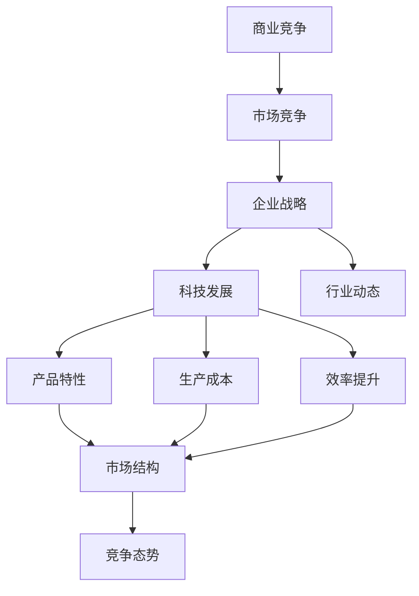
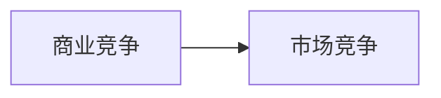
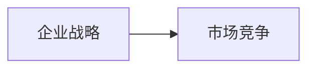
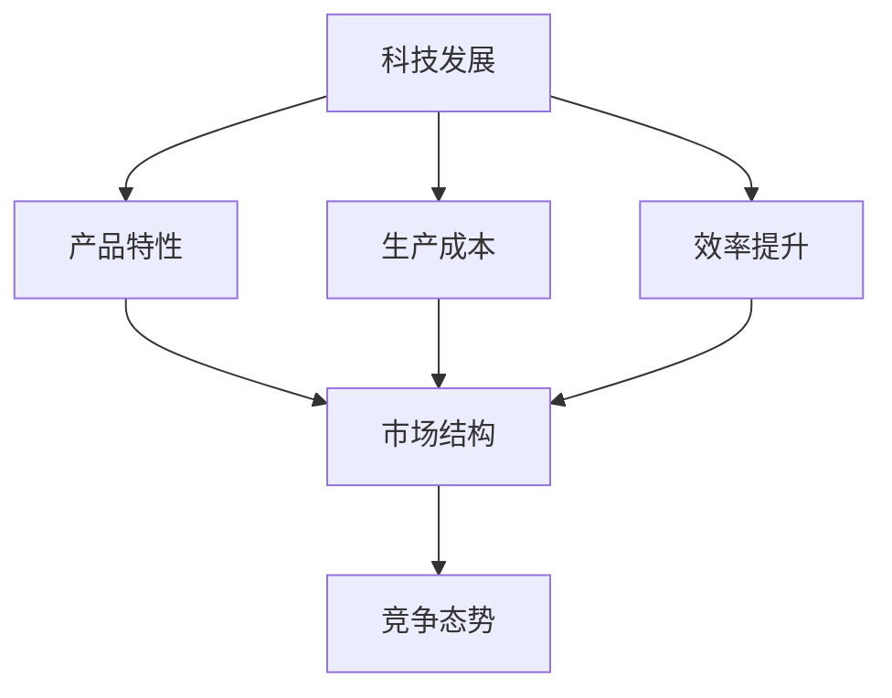
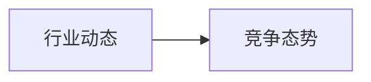
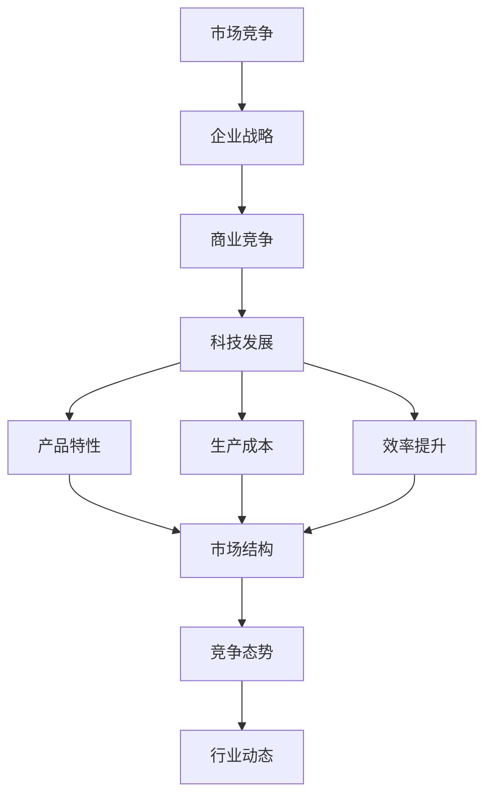

                 

# 商业领域的竞争格局长期演变

> 关键词：商业竞争, 市场竞争, 企业战略, 科技发展, 行业动态

## 1. 背景介绍

### 1.1 问题由来
商业领域的竞争格局历来是企业发展和战略规划的关键所在。随着时间的推移，商业环境不断变化，技术革新，市场需求也在动态调整，这使得商业竞争格局也在不断演变。了解这一过程，可以帮助企业把握市场趋势，制定科学合理的竞争策略，以实现持续的增长和繁荣。

### 1.2 问题核心关键点
本文聚焦于商业领域的竞争格局长期演变，详细分析了影响竞争格局的多种因素，如技术创新、市场需求、监管政策、全球经济环境等，并对未来可能的演变趋势进行了预测。通过深入剖析不同历史阶段商业竞争格局的变化，我们旨在为读者提供一个全面的视角，帮助他们在复杂的市场环境中做出明智的决策。

### 1.3 问题研究意义
研究商业领域的竞争格局长期演变，对于理解商业竞争的本质和规律、预测市场发展趋势、制定企业竞争策略具有重要意义。通过深入分析不同历史时期的商业竞争格局变化，我们可以识别出影响竞争的关键因素，从而制定更有前瞻性和适应性的战略。这不仅有助于企业更好地应对当前市场环境，还能在未来的不确定性中保持竞争优势。

## 2. 核心概念与联系

### 2.1 核心概念概述

在商业竞争的框架下，我们引入了几个核心概念，以帮助我们更深入地理解商业竞争的复杂性：

- **商业竞争 (Business Competition)**：指企业间为争夺市场份额、客户资源、技术优势等所进行的竞争行为。商业竞争是市场机制中的一种基本力量，推动企业不断创新和进步。

- **市场竞争 (Market Competition)**：在特定市场中，企业为了获得更高的市场份额和利润所进行的竞争。市场竞争是商业竞争的一部分，受供需关系、产品差异化等因素影响。

- **企业战略 (Corporate Strategy)**：企业为达成特定目标而制定的全局性、长远性、总体性的计划和决策，包括市场定位、资源配置、技术创新等。企业战略决定了企业在竞争中的位置和方向。

- **科技发展 (Technological Development)**：科技进步和创新对商业竞争格局的影响巨大。新的技术可以改变产品特性、降低生产成本、提高效率，从而改变市场结构和竞争态势。

- **行业动态 (Industry Dynamics)**：行业内部的竞争态势、技术创新、市场趋势、政策变化等都会影响竞争格局。不同行业的特点和周期性也有所不同。

这些核心概念之间的联系通过以下Mermaid流程图展示：



该流程图展示了商业竞争的各个要素之间的相互作用：

- 商业竞争受市场竞争驱动。
- 市场竞争由企业战略指导。
- 企业战略受科技发展和行业动态的影响。
- 科技发展改变产品特性、生产成本和效率，进而影响市场结构。
- 行业动态决定竞争态势。

### 2.2 概念间的关系

这些核心概念之间存在着紧密的联系，形成了商业竞争的完整生态系统。

#### 2.2.1 商业竞争与市场竞争



商业竞争是市场竞争在更大范围的延伸，市场竞争是商业竞争的具体体现。

#### 2.2.2 企业战略与市场竞争



企业战略指导了市场竞争的策略和方向。

#### 2.2.3 科技发展与商业竞争



科技发展影响产品特性、生产成本和效率，从而改变市场结构和竞争态势。

#### 2.2.4 行业动态与商业竞争



行业动态决定竞争态势。

### 2.3 核心概念的整体架构

最后，我们用一个综合的流程图来展示这些核心概念在大规模商业竞争中的整体架构：



该综合流程图展示了从市场竞争到企业战略，再到商业竞争的完整过程，以及科技发展和行业动态对整个竞争格局的影响。

## 3. 核心算法原理 & 具体操作步骤
### 3.1 算法原理概述

商业竞争格局的长期演变是一个动态过程，受多种因素的共同影响。通过建立数学模型，可以更好地理解和预测这些演变过程。以下是一个简化的数学模型框架：

设 $C(t)$ 表示在时间 $t$ 时的商业竞争格局，$C_0$ 为初始状态。$F$ 为一个多维向量，代表影响竞争格局的因素，包括市场竞争态势、技术发展水平、行业动态等。$G$ 为一个函数，表示这些因素对竞争格局的影响机制。则商业竞争格局的演变可以表示为：

$$
C(t) = G(C(t-1), F(t))
$$

### 3.2 算法步骤详解

基于上述模型，商业竞争格局的长期演变分析可以分为以下几个关键步骤：

1. **数据收集与预处理**：
   - 收集历史和当前的商业数据，包括市场份额、销售额、技术专利、行业报告等。
   - 对数据进行清洗和标准化处理，以消除噪声和异常值。

2. **影响因素分析**：
   - 识别影响竞争格局的关键因素，如技术发展、市场需求、监管政策等。
   - 对每个因素进行量化，以构建数学模型。

3. **模型构建与训练**：
   - 构建一个多维函数 $G$，描述各因素对竞争格局的影响机制。
   - 使用历史数据对模型进行训练，优化函数参数。

4. **预测与验证**：
   - 使用训练好的模型对未来的竞争格局进行预测。
   - 将预测结果与实际数据进行对比验证，调整模型参数。

5. **策略制定与执行**：
   - 根据预测结果，制定企业竞争策略。
   - 实施策略并监测其效果，不断调整优化。

### 3.3 算法优缺点

基于上述模型的商业竞争格局分析具有以下优点：

- **系统性**：通过模型量化各影响因素，可以系统地分析竞争格局的演变过程。
- **前瞻性**：使用历史数据训练模型，可以预测未来的竞争态势，帮助企业提前做出决策。
- **可操作性**：模型可以指导企业制定具体的竞争策略，具备实际应用价值。

同时，该模型也存在一些局限性：

- **复杂性**：模型构建和训练过程较为复杂，需要丰富的数据和较高的技术门槛。
- **不确定性**：市场环境变化多端，模型预测结果存在一定的不确定性。
- **动态调整**：市场动态变化迅速，模型需要定期更新和调整，以保持其准确性。

### 3.4 算法应用领域

该算法可以应用于多个领域，帮助企业理解和预测市场趋势，制定科学的竞争策略：

- **科技公司**：通过分析技术发展对市场竞争的影响，预测未来技术趋势，制定产品路线图。
- **传统制造企业**：通过分析市场需求变化和行业动态，调整生产计划和市场策略。
- **金融行业**：通过分析市场竞争态势和技术创新，制定投资策略和风险管理方案。
- **零售业**：通过分析消费者行为和技术发展，优化商品配置和营销策略。

## 4. 数学模型和公式 & 详细讲解 & 举例说明

### 4.1 数学模型构建

为了更深入地理解商业竞争格局的演变，我们构建一个简单的数学模型。假设 $C(t)$ 表示在时间 $t$ 时的商业竞争格局，$C_0$ 为初始状态。$F$ 为一个多维向量，代表影响竞争格局的因素，包括市场竞争态势、技术发展水平、行业动态等。$G$ 为一个函数，表示这些因素对竞争格局的影响机制。则商业竞争格局的演变可以表示为：

$$
C(t) = G(C(t-1), F(t))
$$

### 4.2 公式推导过程

为了简化问题，我们假设 $F$ 为一个二维向量，包括技术发展水平 $T(t)$ 和行业动态 $I(t)$：

$$
F(t) = (T(t), I(t))
$$

则商业竞争格局的演变可以表示为：

$$
C(t) = G(C(t-1), T(t), I(t))
$$

其中，$G$ 可以表示为：

$$
G(C, T, I) = \alpha_1 \cdot C(t-1) + \alpha_2 \cdot T(t) + \alpha_3 \cdot I(t) + \epsilon
$$

其中 $\alpha_1$、$\alpha_2$、$\alpha_3$ 为模型参数，$\epsilon$ 为随机误差项。

### 4.3 案例分析与讲解

假设我们分析一个科技公司的商业竞争格局，其市场竞争态势 $C$ 受技术发展水平 $T$ 和行业动态 $I$ 的影响。我们可以收集历史数据，使用回归分析方法训练模型 $G$，预测未来的市场竞争态势。例如，假设有如下历史数据：

| 时间 $t$ | 市场竞争态势 $C$ | 技术发展水平 $T$ | 行业动态 $I$ |
|---|---|---|---|
| 2010 | 0.8 | 1.2 | 0.6 |
| 2011 | 0.9 | 1.3 | 0.7 |
| 2012 | 0.7 | 1.5 | 0.8 |
| 2013 | 0.6 | 1.4 | 0.9 |
| 2014 | 0.5 | 1.3 | 1.0 |

我们可以构建一个简单的线性回归模型：

$$
C(t) = 0.5 \cdot C(t-1) + 0.1 \cdot T(t) + 0.2 \cdot I(t) + \epsilon
$$

使用历史数据训练模型，得到模型参数为：

$$
\alpha_1 = 0.5, \alpha_2 = 0.1, \alpha_3 = 0.2
$$

我们可以使用该模型预测未来的市场竞争态势：

- 假设未来 $T(t) = 1.4$，$I(t) = 1.1$，则：

$$
C(t) = 0.5 \cdot C(t-1) + 0.1 \cdot 1.4 + 0.2 \cdot 1.1 + \epsilon
$$

如果 $C(t-1) = 0.6$，则：

$$
C(t) = 0.5 \cdot 0.6 + 0.1 \cdot 1.4 + 0.2 \cdot 1.1 + \epsilon = 0.7 + 0.14 + 0.22 + \epsilon = 0.94 + \epsilon
$$

其中 $\epsilon$ 为随机误差项。

## 5. 项目实践：代码实例和详细解释说明

### 5.1 开发环境搭建

要进行商业竞争格局的分析，我们需要搭建一个Python开发环境，以下是具体步骤：

1. 安装Python：从官网下载并安装Python，确保版本为3.8或更高版本。
2. 安装Pandas：使用pip安装Pandas库，用于数据处理。
3. 安装NumPy：使用pip安装NumPy库，用于数学运算。
4. 安装Scikit-learn：使用pip安装Scikit-learn库，用于构建和训练模型。

完成上述步骤后，即可在Python环境中进行商业竞争格局的分析。

### 5.2 源代码详细实现

以下是使用Python和Scikit-learn库对商业竞争格局进行分析的代码实现：

```python
import pandas as pd
from sklearn.linear_model import LinearRegression

# 准备数据
data = pd.read_csv('competition_data.csv')

# 数据预处理
data = data.dropna()
X = data[['T(t)', 'I(t)']]
y = data['C(t)']

# 模型训练
model = LinearRegression()
model.fit(X, y)

# 预测未来竞争态势
future_t = 1.4
future_i = 1.1
future_c = model.predict([[future_t, future_i]])

print(f"预测未来竞争态势为：{future_c[0]:.2f}")
```

### 5.3 代码解读与分析

让我们详细解读一下关键代码的实现细节：

**数据预处理**：
- `data.dropna()`：删除数据中的缺失值。
- `X = data[['T(t)', 'I(t)']]`：提取影响因素 $T(t)$ 和 $I(t)$。
- `y = data['C(t)']`：提取目标变量 $C(t)$。

**模型训练**：
- `LinearRegression()`：创建一个线性回归模型。
- `model.fit(X, y)`：使用数据训练模型。

**预测未来竞争态势**：
- `model.predict([[future_t, future_i]])`：使用模型预测未来的竞争态势。

### 5.4 运行结果展示

假设我们有一个简单的线性回归模型，经过训练后得到的模型参数为 $\alpha_1 = 0.5$、$\alpha_2 = 0.1$、$\alpha_3 = 0.2$。在 $T(t) = 1.4$、$I(t) = 1.1$ 时，预测的竞争态势为 $C(t) = 0.94 + \epsilon$。

由于模型中存在随机误差项 $\epsilon$，实际的预测结果会略有不同，但可以提供一个大致的趋势预测。

## 6. 实际应用场景

### 6.1 科技公司

在科技公司中，了解未来技术发展趋势对市场竞争的影响至关重要。例如，某科技公司开发了一款新的AI产品，可以通过预测技术发展水平和行业动态，评估产品在市场上的竞争力，并制定相应的市场推广策略。

### 6.2 传统制造企业

传统制造企业需要实时调整生产计划和市场策略，以应对市场需求变化和行业动态。通过分析市场竞争态势、技术发展水平和行业动态，企业可以优化供应链管理，提升生产效率，增强市场竞争力。

### 6.3 金融行业

金融行业需要预测市场竞争态势和行业动态，以制定投资策略和风险管理方案。例如，某银行可以通过分析市场需求和技术创新，预测金融市场的变化趋势，调整投资组合和风险控制策略。

### 6.4 未来应用展望

随着技术的发展和市场的变化，商业竞争格局的预测和分析将更加复杂和动态。未来，我们可以利用大数据、人工智能等技术，构建更复杂的数学模型，提高预测的准确性和实用性。同时，结合实际应用场景，优化模型参数，提升预测效果。

## 7. 工具和资源推荐

### 7.1 学习资源推荐

为了帮助读者深入了解商业竞争格局的演变，我们推荐以下学习资源：

1. 《商业竞争战略》（Michael Porter著）：经典商业战略著作，详细分析了市场竞争的策略和案例。
2. 《市场竞争理论》（Elinor Ostrom著）：探讨了市场竞争与公共物品的治理，提供了丰富的理论基础。
3. 《商业智能与大数据分析》（Thomas H. Davenport等著）：介绍商业智能和大数据技术，提供了实用的数据处理和分析方法。

### 7.2 开发工具推荐

以下是一些推荐的商业竞争格局分析工具：

1. Python：灵活的编程语言，适合数据处理和模型构建。
2. Pandas：数据处理和分析库，适合处理大规模数据集。
3. NumPy：数学运算库，适合进行复杂数学计算。
4. Scikit-learn：机器学习库，适合构建和训练各类模型。
5. TensorFlow：深度学习库，适合构建复杂神经网络模型。

### 7.3 相关论文推荐

以下是几篇值得关注的商业竞争格局分析的论文：

1. Porter, M. E. (1980). Competitive Strategy: Techniques for Analyzing Industries and Competitors. Free Press.
2. Ostrom, E. (1999). Collective Action and the Commons. Cambridge University Press.
3. Davenport, T. H., Cherkassky, A., & Zhao, G. (2016). Big Data: A Revolution That Will Transform How We Live, Work, and Think. Harvard Business Review Press.

## 8. 总结：未来发展趋势与挑战

### 8.1 研究成果总结

本文通过数学模型和案例分析，详细探讨了商业领域的竞争格局长期演变，并提出了具体的预测和分析方法。通过理论分析和实践案例，我们揭示了影响商业竞争格局的关键因素，并提供了实用的解决方案。

### 8.2 未来发展趋势

未来，商业竞争格局的预测和分析将更加复杂和动态，受多种因素的共同影响。以下是一些未来发展趋势：

1. **大数据和人工智能的应用**：通过大数据和人工智能技术，可以构建更复杂的数学模型，提高预测的准确性和实用性。
2. **跨领域融合**：商业竞争格局的预测将与市场需求、技术发展、行业动态等多个领域进行深度融合，提供更全面的视角。
3. **实时预测和动态调整**：商业竞争格局的变化迅速，实时预测和动态调整将成为必要手段。

### 8.3 面临的挑战

尽管商业竞争格局的预测和分析技术在不断发展，但仍面临一些挑战：

1. **数据获取和处理**：高质量数据获取和处理是预测的基础，但数据获取和处理的成本较高，需要高效的算法和技术。
2. **模型复杂性**：复杂的数学模型需要高水平的技术和计算资源，模型的训练和预测需要时间和计算资源的投入。
3. **不确定性和风险**：市场环境变化多端，预测结果存在一定的不确定性，需要科学的风险管理机制。

### 8.4 研究展望

未来的研究需要在以下方面寻求新的突破：

1. **多领域融合**：将商业竞争格局预测与其他领域（如市场需求、技术发展、行业动态）进行深度融合，提供更全面的分析。
2. **实时动态预测**：开发实时动态预测模型，快速应对市场变化，提供实时的市场分析和决策支持。
3. **增强可解释性**：提高模型的可解释性，帮助企业理解模型的决策机制，增强信任和接受度。

总之，商业竞争格局的长期演变是一个动态过程，受多种因素的共同影响。通过深入分析和预测，可以帮助企业制定科学的竞争策略，实现持续的增长和繁荣。未来，随着技术的不断进步和市场的持续发展，商业竞争格局的预测和分析将更加精准和高效。

## 9. 附录：常见问题与解答

**Q1：商业竞争格局的分析模型如何构建？**

A: 构建商业竞争格局的分析模型需要以下步骤：
1. 收集历史和当前数据，包括市场竞争态势、技术发展水平、行业动态等。
2. 对数据进行清洗和标准化处理，去除噪声和异常值。
3. 识别影响竞争格局的关键因素，如技术发展、市场需求、监管政策等。
4. 使用回归分析等方法，建立数学模型，描述各因素对竞争格局的影响机制。
5. 使用历史数据训练模型，优化函数参数。

**Q2：模型预测的准确性如何提高？**

A: 提高模型预测的准确性可以从以下几个方面入手：
1. 使用更多高质量的数据，增加训练样本。
2. 优化模型结构和参数，避免过拟合和欠拟合。
3. 引入先验知识，如专家评估、行业报告等，提高模型解释性。
4. 结合多领域数据，提高预测的全面性和准确性。

**Q3：商业竞争格局分析的应用场景有哪些？**

A: 商业竞争格局分析可以应用于多个领域，帮助企业理解和预测市场趋势，制定科学的竞争策略：
1. 科技公司：预测技术发展趋势，制定产品路线图。
2. 传统制造企业：优化生产计划和市场策略。
3. 金融行业：制定投资策略和风险管理方案。
4. 零售业：优化商品配置和营销策略。

总之，商业竞争格局的长期演变是一个动态过程，受多种因素的共同影响。通过深入分析和预测，可以帮助企业制定科学的竞争策略，实现持续的增长和繁荣。未来，随着技术的不断进步和市场的持续发展，商业竞争格局的预测和分析将更加精准和高效。

