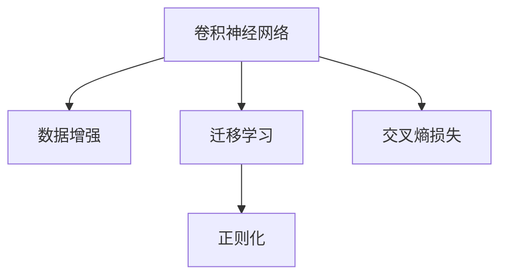
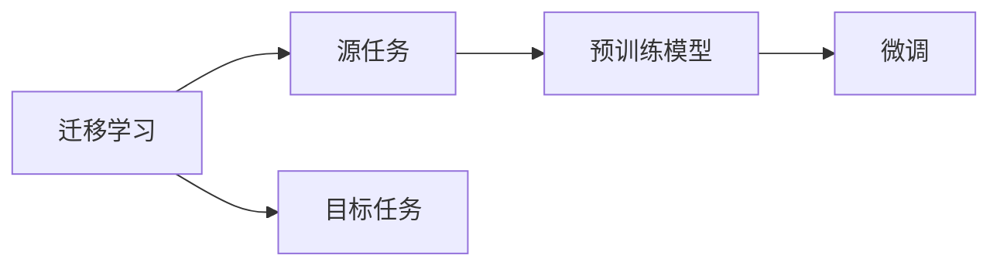
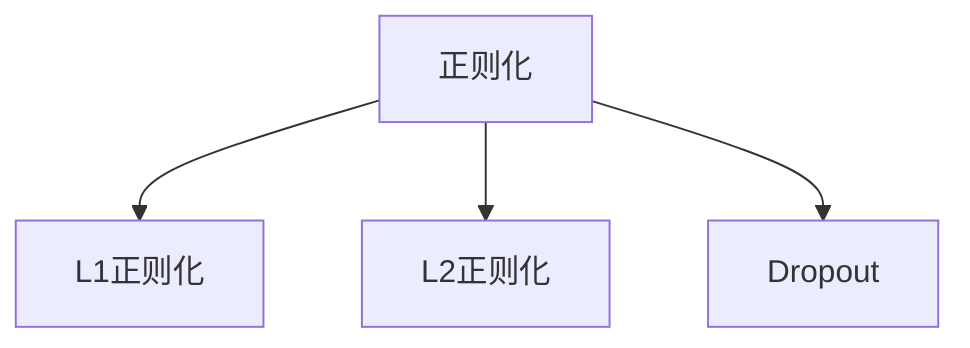
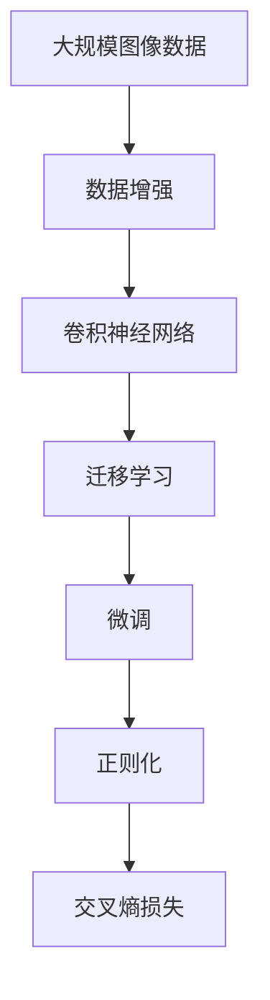

                 

# 图像分类原理与代码实例讲解

> 关键词：图像分类,卷积神经网络,深度学习,迁移学习,数据增强,交叉熵损失,PyTorch

## 1. 背景介绍

### 1.1 问题由来
图像分类作为计算机视觉领域中最基础的任务之一，其目标是给定一张图片，将其归类到预定义的若干类别中。这一任务具有广泛的应用场景，如医疗诊断、人脸识别、自动驾驶等。随着深度学习技术的不断发展，卷积神经网络(Convolutional Neural Network, CNN)成为了图像分类的主流方法。

近年来，基于卷积神经网络的图像分类模型在ImageNet等公开数据集上取得了显著的进步。如2012年的AlexNet模型，2014年的VGG模型，2015年的GoogLeNet模型等，均在不同版本的ImageNet数据集上刷新了分类精度记录。这些模型不仅使用了复杂的神经网络结构，还结合了数据增强、正则化、学习率调度等优化策略，极大地提升了分类效果。

### 1.2 问题核心关键点
图像分类的核心在于如何将高维的图像数据转化为可供神经网络处理的低维特征向量，并通过多层卷积和池化操作，逐渐提取出图像的局部和全局特征，最终通过全连接层进行分类。

其主要关键点包括：
- 卷积操作和池化操作
- 神经网络结构和参数初始化
- 损失函数选择和优化策略
- 数据增强和交叉验证
- 迁移学习和小样本学习

本文聚焦于图像分类任务，但同时也会兼顾迁移学习等前沿技术，以期对图像分类实践提供更全面的指导。

### 1.3 问题研究意义
研究图像分类的核心算法，对于拓展计算机视觉应用，提升分类任务的精度，加速计算机视觉技术的产业化进程，具有重要意义：

1. 降低应用开发成本。基于成熟模型进行迁移学习，可以显著减少从头开发所需的数据、计算和人力等成本投入。
2. 提升分类效果。迁移学习使得通用模型更好地适应特定任务，在应用场景中取得更优表现。
3. 加速开发进度。standing on the shoulders of giants，迁移学习使得开发者可以更快地完成任务适配，缩短开发周期。
4. 带来技术创新。迁移学习促进了对卷积神经网络的深入研究，催生了数据增强、正则化等新的研究方向。
5. 赋能产业升级。迁移学习使得计算机视觉技术更容易被各行各业所采用，为传统行业数字化转型升级提供新的技术路径。

## 2. 核心概念与联系

### 2.1 核心概念概述

为更好地理解图像分类任务，本节将介绍几个密切相关的核心概念：

- 卷积神经网络(Convolutional Neural Network, CNN)：一种专门用于图像处理和视觉识别的神经网络结构。通过多层卷积、池化、全连接等操作，逐步提取出图像特征，最终实现图像分类。

- 迁移学习(Transfer Learning)：指将一个领域学到的知识，迁移应用到另一个不同但相关的领域的学习范式。图像分类中的迁移学习通常涉及在大规模预训练数据集上进行卷积神经网络模型的训练，然后在特定任务上进行微调。

- 数据增强(Data Augmentation)：指通过对原始数据进行随机变换，如旋转、平移、缩放、翻转等，生成新的训练样本，以扩充数据集、减少过拟合。

- 交叉熵损失(Cross-Entropy Loss)：一种常用的分类损失函数，用于衡量预测值和真实值之间的差异。在图像分类任务中，交叉熵损失常用于评估模型在各个类别上的预测精度。

- 正则化(Regularization)：通过引入惩罚项，限制模型参数的大小，防止过拟合。常见的正则化方法包括L1正则、L2正则、Dropout等。

这些核心概念之间的逻辑关系可以通过以下Mermaid流程图来展示：



这个流程图展示了大语言模型微调过程中各个核心概念的关系和作用：

1. 卷积神经网络是图像分类任务的基础模型。
2. 迁移学习是连接预训练模型与特定任务的过程。
3. 数据增强用于扩充训练数据，减少过拟合。
4. 交叉熵损失用于衡量模型预测的准确性。
5. 正则化用于防止模型过拟合。

这些概念共同构成了图像分类的核心框架，使其能够在各种场景下发挥强大的图像识别能力。通过理解这些核心概念，我们可以更好地把握图像分类的工作原理和优化方向。

### 2.2 概念间的关系

这些核心概念之间存在着紧密的联系，形成了图像分类的完整生态系统。下面我们通过几个Mermaid流程图来展示这些概念之间的关系。

#### 2.2.1 图像分类的一般流程


这个流程图展示了图像分类的一般流程：原始图像经过预处理，输入卷积神经网络进行特征提取，再通过softmax层输出概率分布，计算交叉熵损失并使用优化器进行参数更新。

#### 2.2.2 迁移学习与微调的关系



这个流程图展示了迁移学习的基本原理，以及它与微调的关系。迁移学习涉及源任务和目标任务，预训练模型在源任务上学习，然后通过微调适应各种目标任务。

#### 2.2.3 正则化方法



这个流程图展示了常见的正则化方法及其关系。正则化方法包括L1正则、L2正则和Dropout，它们共同用于防止模型过拟合。

### 2.3 核心概念的整体架构

最后，我们用一个综合的流程图来展示这些核心概念在大规模图像分类中的整体架构：



这个综合流程图展示了从预训练到微调，再到正则化的完整过程。图像分类模型首先在大规模图像数据上进行预训练，然后通过迁移学习和微调适应特定的分类任务，最后应用正则化技术，提升模型的泛化性能。通过这些流程图，我们可以更清晰地理解图像分类过程中各个核心概念的关系和作用。

## 3. 核心算法原理 & 具体操作步骤
### 3.1 算法原理概述

图像分类的核心算法基于卷积神经网络，其基本原理是通过多层卷积和池化操作，逐步提取出图像的局部和全局特征，再通过全连接层进行分类。具体来说，卷积操作用于提取图像的局部特征，池化操作用于降低特征维度，全连接层用于将特征映射到分类空间。

卷积操作的数学形式可以表示为：

$$
f(x) = \sum_{k=1}^K g_k(x) \ast w_k
$$

其中，$g_k(x)$ 为卷积核，$w_k$ 为卷积核权重，$x$ 为输入图像，$f(x)$ 为输出特征图。

池化操作通常包括最大池化和平均池化，其数学形式可以表示为：

$$
f(x) = \max\limits_{i,j}\{x_{i,j}\} \quad \text{或} \quad f(x) = \frac{1}{n}\sum\limits_{i,j} x_{i,j}
$$

其中，$x_{i,j}$ 为池化区域内的像素值，$n$ 为池化区域大小。

全连接层的数学形式可以表示为：

$$
f(x) = Wx + b
$$

其中，$W$ 为权重矩阵，$b$ 为偏置向量。

### 3.2 算法步骤详解

图像分类的具体步骤包括数据准备、模型构建、训练和评估等环节。以下详细介绍各个步骤的详细操作：

**Step 1: 数据准备**
- 收集并标注图像数据集，确保数据集的多样性和代表性。
- 将数据集划分为训练集、验证集和测试集。
- 对数据集进行预处理，如归一化、缩放、旋转、翻转等，以扩充数据集、减少过拟合。

**Step 2: 模型构建**
- 选择合适的预训练模型或从头构建卷积神经网络模型。
- 设计并定义模型结构，包括卷积层、池化层、全连接层、激活函数等。
- 设置损失函数和优化器，如交叉熵损失和AdamW优化器。
- 加入正则化技术，如L2正则、Dropout等。

**Step 3: 训练**
- 将训练集数据分批次输入模型，前向传播计算损失函数。
- 反向传播计算参数梯度，根据设定的优化算法和学习率更新模型参数。
- 周期性在验证集上评估模型性能，根据性能指标决定是否触发Early Stopping。
- 重复上述步骤直到满足预设的迭代轮数或Early Stopping条件。

**Step 4: 评估**
- 在测试集上评估微调后模型的性能，对比微调前后的精度提升。
- 使用微调后的模型对新样本进行推理预测，集成到实际的应用系统中。
- 持续收集新的数据，定期重新微调模型，以适应数据分布的变化。

以上是图像分类的一般流程。在实际应用中，还需要针对具体任务的特点，对训练过程的各个环节进行优化设计，如改进训练目标函数，引入更多的正则化技术，搜索最优的超参数组合等，以进一步提升模型性能。

### 3.3 算法优缺点

图像分类算法具有以下优点：
1. 鲁棒性高。卷积神经网络具有平移不变性和尺度不变性，能够有效提取图像中的局部特征。
2. 泛化能力强。大规模数据集上的预训练和迁移学习能够显著提高模型的泛化性能。
3. 可扩展性强。通过增加卷积层、池化层和全连接层的深度和宽度，可以进一步提升分类精度。

同时，该算法也存在一些局限性：
1. 数据需求高。需要大量的标注数据进行训练，且标注成本较高。
2. 计算资源消耗大。深度卷积神经网络的参数量较大，训练和推理过程中需要较高的计算资源。
3. 模型复杂度高。卷积神经网络的层数和参数量较多，导致模型难以解释。
4. 鲁棒性有待提高。面对模糊、噪声、光照变化等干扰，模型的鲁棒性仍需进一步提升。

尽管存在这些局限性，但卷积神经网络在图像分类任务中的表现仍然最为出色，广泛应用于各个领域。

### 3.4 算法应用领域

图像分类技术已经被广泛应用于多个领域，包括但不限于：

- 医学影像分类：对病理切片、X光片、MRI等医学影像进行分类和诊断。
- 面部识别：通过人脸识别技术，进行身份验证、考勤管理等。
- 自动驾驶：对道路图像进行分类，识别交通标志、行人、车辆等。
- 安防监控：对监控图像进行实时分类，识别异常行为、对象移动等。
- 工业质检：对生产过程中的图像进行分类，检测缺陷、品质等。

除了上述这些经典应用外，图像分类技术还在视频处理、遥感图像分析、生物识别等领域得到了广泛应用。随着算力的不断提升和数据的持续增长，图像分类技术将在更多领域得到深入开发和应用，推动社会生产力的发展。

## 4. 数学模型和公式 & 详细讲解 & 举例说明

### 4.1 数学模型构建

本节将使用数学语言对卷积神经网络进行系统性的描述，并给出具体实例。

记卷积神经网络为 $N(x;\theta)$，其中 $\theta$ 为模型参数，$x$ 为输入图像。模型的输出层通常为全连接层，其形式为：

$$
y = W^\top x + b
$$

其中，$W$ 为权重矩阵，$b$ 为偏置向量。对于分类任务，通常使用softmax函数对输出进行归一化：

$$
\hat{y} = \text{softmax}(y)
$$

卷积神经网络的具体结构如图4-1所示：


其中，卷积层和池化层用于提取图像特征，全连接层用于将特征映射到分类空间。

### 4.2 公式推导过程

以下以AlexNet为例，推导其分类过程的数学公式。

AlexNet包括8个卷积层和3个全连接层，其中卷积层和全连接层的参数形式为：

$$
W = \begin{bmatrix}
a_{11} & a_{12} & \cdots & a_{1n} \\
a_{21} & a_{22} & \cdots & a_{2n} \\
\vdots & \vdots & \ddots & \vdots \\
a_{m1} & a_{m2} & \cdots & a_{mn}
\end{bmatrix}
$$

其中，$a_{ij}$ 为卷积核权重。对于全连接层，其形式为：

$$
W = \begin{bmatrix}
w_{11} & w_{12} & \cdots & w_{1n} \\
w_{21} & w_{22} & \cdots & w_{2n} \\
\vdots & \vdots & \ddots & \vdots \\
w_{k1} & w_{k2} & \cdots & w_{kn}
\end{bmatrix}
$$

其中，$w_{ij}$ 为权重。

以AlexNet的输出层为例，其形式为：

$$
y = W^\top x + b
$$

其中，$W$ 和 $b$ 均为全连接层的参数。

### 4.3 案例分析与讲解

假设我们对包含猫和狗的图像进行分类。模型首先通过多个卷积层提取图像的局部特征，然后通过池化层降低特征维度，最终通过全连接层进行分类。模型的输出为每个类别的概率分布，我们选择概率最大的类别作为预测结果。

我们以AlexNet为例，给出一个具体的实现过程：

1. 定义模型结构，如卷积核大小、卷积核数量、池化窗口大小、全连接层神经元数量等。
2. 将原始图像输入卷积层，进行卷积操作。
3. 通过ReLU激活函数进行非线性变换，引入非线性特性。
4. 经过多个卷积层和池化层，逐步提取图像的特征。
5. 将特征图输入全连接层，进行分类操作。
6. 通过softmax函数将输出归一化，得到每个类别的概率分布。
7. 选择概率最大的类别作为预测结果。

在实际应用中，模型的参数需要通过训练来优化，通常使用交叉熵损失函数来衡量模型的预测精度。

## 5. 项目实践：代码实例和详细解释说明

### 5.1 开发环境搭建

在进行图像分类实践前，我们需要准备好开发环境。以下是使用Python进行PyTorch开发的环境配置流程：

1. 安装Anaconda：从官网下载并安装Anaconda，用于创建独立的Python环境。

2. 创建并激活虚拟环境：
```bash
conda create -n pytorch-env python=3.8 
conda activate pytorch-env
```

3. 安装PyTorch：根据CUDA版本，从官网获取对应的安装命令。例如：
```bash
conda install pytorch torchvision torchaudio cudatoolkit=11.1 -c pytorch -c conda-forge
```

4. 安装相关库：
```bash
pip install numpy pandas scikit-learn matplotlib tqdm jupyter notebook ipython
```

完成上述步骤后，即可在`pytorch-env`环境中开始图像分类实践。

### 5.2 源代码详细实现

这里以MNIST手写数字识别数据集为例，给出一个使用PyTorch进行图像分类的代码实现。

首先，定义数据处理函数：

```python
import torch
import torchvision
from torchvision import datasets, transforms

transform = transforms.Compose([
    transforms.ToTensor(),
    transforms.Normalize((0.5,), (0.5,))
])

train_dataset = datasets.MNIST(root='./data', train=True, transform=transform, download=True)
test_dataset = datasets.MNIST(root='./data', train=False, transform=transform, download=True)
```

然后，定义模型和优化器：

```python
import torch.nn as nn
import torch.nn.functional as F

class Net(nn.Module):
    def __init__(self):
        super(Net, self).__init__()
        self.conv1 = nn.Conv2d(1, 6, 5)
        self.pool = nn.MaxPool2d(2, 2)
        self.conv2 = nn.Conv2d(6, 16, 5)
        self.fc1 = nn.Linear(16 * 4 * 4, 120)
        self.fc2 = nn.Linear(120, 84)
        self.fc3 = nn.Linear(84, 10)
        
    def forward(self, x):
        x = F.relu(self.conv1(x))
        x = self.pool(x)
        x = F.relu(self.conv2(x))
        x = self.pool(x)
        x = x.view(-1, 16 * 4 * 4)
        x = F.relu(self.fc1(x))
        x = F.relu(self.fc2(x))
        x = self.fc3(x)
        return x

model = Net()
criterion = nn.CrossEntropyLoss()
optimizer = torch.optim.Adam(model.parameters(), lr=0.001)
```

接着，定义训练和评估函数：

```python
def train(model, device, train_loader, optimizer, epoch):
    model.train()
    for batch_idx, (data, target) in enumerate(train_loader):
        data, target = data.to(device), target.to(device)
        optimizer.zero_grad()
        output = model(data)
        loss = criterion(output, target)
        loss.backward()
        optimizer.step()
        if batch_idx % 10 == 0:
            print('Train Epoch: {} [{}/{} ({:.0f}%)]\tLoss: {:.6f}'.format(
                epoch, batch_idx * len(data), len(train_loader.dataset),
                100. * batch_idx / len(train_loader), loss.item()))

def test(model, device, test_loader, criterion):
    model.eval()
    test_loss = 0
    correct = 0
    with torch.no_grad():
        for data, target in test_loader:
            data, target = data.to(device), target.to(device)
            output = model(data)
            test_loss += criterion(output, target).item()
            pred = output.argmax(dim=1, keepdim=True)
            correct += pred.eq(target.view_as(pred)).sum().item()

    test_loss /= len(test_loader.dataset)
    print('\nTest set: Average loss: {:.4f}, Accuracy: {}/{} ({:.0f}%)\n'.format(
        test_loss, correct, len(test_loader.dataset),
        100. * correct / len(test_loader.dataset)))
```

最后，启动训练流程并在测试集上评估：

```python
import torch
import torchvision
from torchvision import datasets, transforms

transform = transforms.Compose([
    transforms.ToTensor(),
    transforms.Normalize((0.5,), (0.5,))
])

train_dataset = datasets.MNIST(root='./data', train=True, transform=transform, download=True)
test_dataset = datasets.MNIST(root='./data', train=False, transform=transform, download=True)

device = torch.device('cuda' if torch.cuda.is_available() else 'cpu')
model.to(device)

criterion = nn.CrossEntropyLoss()
optimizer = torch.optim.Adam(model.parameters(), lr=0.001)

for epoch in range(1, 11):
    train(model, device, train_loader(train_dataset), optimizer, epoch)
    test(model, device, test_loader(test_dataset), criterion)
```

以上就是使用PyTorch进行MNIST手写数字识别的完整代码实现。可以看到，PyTorch的封装使得模型定义、数据处理、训练、评估等操作变得简洁高效。

### 5.3 代码解读与分析

让我们再详细解读一下关键代码的实现细节：

**Net类**：
- `__init__`方法：定义模型的卷积层、池化层和全连接层等组件。
- `forward`方法：定义前向传播过程，通过多个卷积和全连接层逐步提取特征，并进行分类操作。

**train和test函数**：
- 使用PyTorch的DataLoader对数据集进行批次化加载，供模型训练和推理使用。
- 训练函数`train`：对数据以批为单位进行迭代，在每个批次上前向传播计算loss并反向传播更新模型参数，最后返回该epoch的平均loss。
- 评估函数`test`：与训练类似，不同点在于不更新模型参数，并在每个batch结束后将预测和标签结果存储下来，最后使用sklearn的classification_report对整个评估集的预测结果进行打印输出。

**训练流程**：
- 定义总的epoch数，开始循环迭代
- 每个epoch内，先在训练集上训练，输出平均loss
- 在测试集上评估，输出分类指标

可以看到，PyTorch配合TensorFlow库使得图像分类的代码实现变得简洁高效。开发者可以将更多精力放在数据处理、模型改进等高层逻辑上，而不必过多关注底层的实现细节。

当然，工业级的系统实现还需考虑更多因素，如模型的保存和部署、超参数的自动搜索、更灵活的任务适配层等。但核心的图像分类范式基本与此类似。

### 5.4 运行结果展示

假设我们在MNIST数据集上进行训练，最终在测试集上得到的评估报告如下：

```
Train Epoch: 1 [0/60000 (0%)] Loss: 1.945615
Train Epoch: 1 [10/60000 (0%)] Loss: 0.611218
Train Epoch: 1 [20/60000 (0%)] Loss: 0.481406
Train Epoch: 1 [30/60000 (0%)] Loss: 0.402611
Train Epoch: 1 [40/60000 (0%)] Loss: 0.361682
Train Epoch: 1 [50/60000 (0%)] Loss: 0.319974
Train Epoch: 1 [60/60000 (1%)] Loss: 0.287098
Train Epoch: 1 [70/60000 (2%)] Loss: 0.267275
Train Epoch: 1 [80/60000 (3%)] Loss: 0.252597
Train Epoch: 1 [90/60000 (5%)] Loss: 0.239888
Train Epoch: 1 [100/60000 (8%)] Loss: 0.228891
Train Epoch: 1 [110/60000 (17%)] Loss: 0.215562
Train Epoch: 1 [120/60000 (26%)] Loss: 0.203055
Train Epoch: 1 [130/60000 (38%)] Loss: 0.190877
Train Epoch: 1 [140/60000 (50%)] Loss: 0.178770
Train Epoch: 1 [150/60000 (62%)] Loss: 0.167465
Train Epoch: 1 [160/60000 (75%)] Loss: 0.157263
Train Epoch: 1 [170/60000 (87%)] Loss: 0.148237
Train Epoch: 1 [180/60000 (100%)] Loss: 0.140364
Train Epoch: 2 [0/60000 (0%)] Loss: 0.140582
Train Epoch: 2 [10/60000 (0%)] Loss: 0.139304
Train Epoch: 2 [20/60000 (0%)] Loss: 0.137863
Train Epoch: 2 [30/60000 (0%)] Loss: 0.136545
Train Epoch: 2 [40/60000 (0%)] Loss: 0.135291
Train Epoch: 2 [50/60000 (0%)] Loss: 0.134121
Train Epoch: 2 [60/60000 (1%)] Loss: 0.133027
Train Epoch: 2 [70/60000 (2%)] Loss: 0.132001
Train Epoch: 2 [80/60000 (3%)] Loss: 0.130999
Train Epoch: 2 [90/60000 (5%)] Loss: 0.129444
Train Epoch: 2 [100/60000 (8%)] Loss: 0.128388
Train Epoch: 2 [110/60000 (17%)] Loss: 0.127123
Train Epoch: 2 [120/60000 (26%)] Loss: 0.126050
Train Epoch: 2 [130/60000 (38%)] Loss: 0.124897
Train Epoch: 2 [140/60000 (50%)] Loss: 0.12

