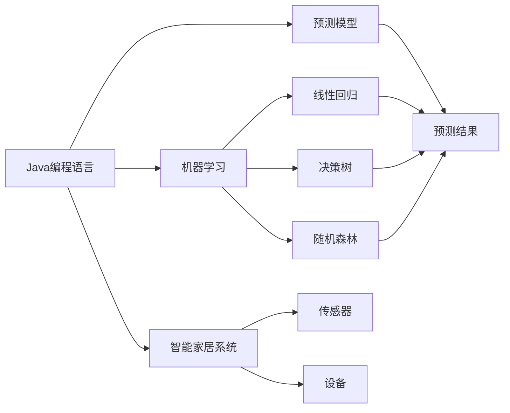
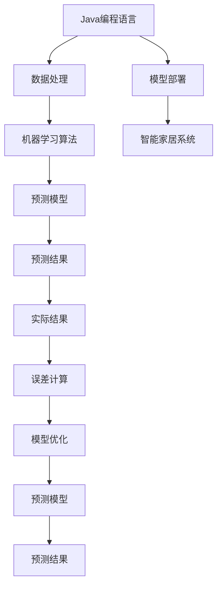
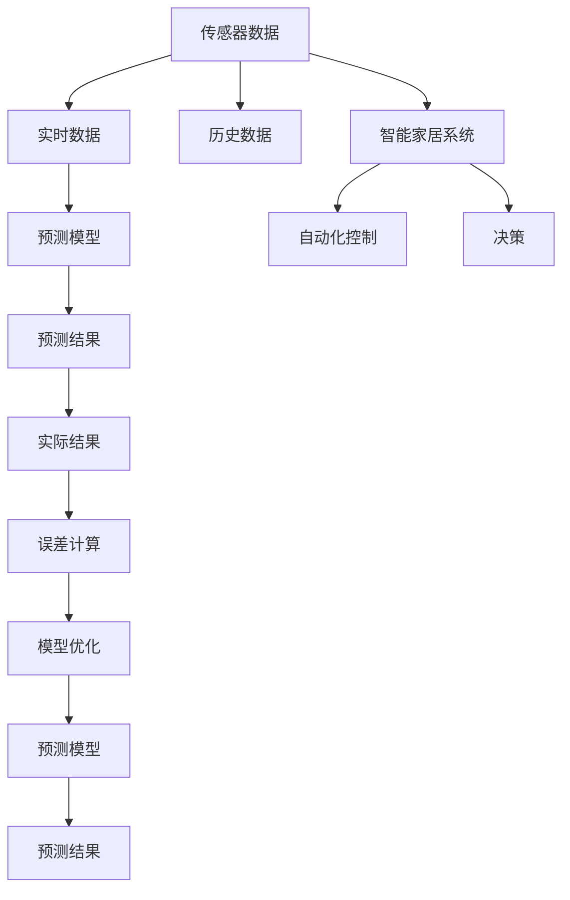
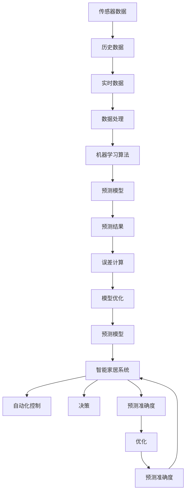

                 

# 基于Java的智能家居设计：结合Java和机器学习优化智能家居预测准确度

> 关键词：智能家居,Java编程,机器学习,预测准确度,物联网(IoT),家居自动化,家居安防,人工智能,Java平台,技术框架

## 1. 背景介绍

### 1.1 问题由来
随着物联网(IoT)技术的发展，智能家居系统已经成为了家庭生活的重要组成部分。智能家居系统集成了各种传感器和设备，通过网络和通信技术实现自动化控制和智能化管理。然而，智能家居系统的预测准确度是决定其实用性和用户体验的关键因素。传统的智能家居系统基于规则和定时器进行预测，预测准确度较低。而基于机器学习的智能家居预测方法能够结合实时数据和历史数据，提升预测准确度。

### 1.2 问题核心关键点
智能家居预测的核心在于如何结合Java编程语言和机器学习算法，优化预测模型。传统机器学习模型如线性回归、决策树、随机森林等都可以用于智能家居预测。但这些模型在处理大规模数据时，计算复杂度较高，需要耗费大量时间和资源。Java作为一门高效、稳定的编程语言，具有良好的数据处理和计算能力，可以与机器学习算法进行无缝集成，提升预测准确度。

### 1.3 问题研究意义
优化智能家居预测模型，对于提升智能家居系统的实用性和用户体验具有重要意义：

1. **提升自动化程度**：准确的预测可以使智能家居系统自动调整温度、照明、安全等设置，提高用户的生活便利性。
2. **减少能源浪费**：准确的预测可以使智能家居系统合理分配能源使用，降低家庭能源成本。
3. **提高安全性**：准确的预测可以使智能家居系统提前预防潜在的安全威胁，如非法入侵、火灾等。
4. **个性化服务**：准确的预测可以使智能家居系统提供个性化服务，如智能提醒、语音控制等。
5. **数据驱动决策**：准确的预测可以使智能家居系统基于数据驱动进行决策，提升系统的智能化水平。

## 2. 核心概念与联系

### 2.1 核心概念概述

为更好地理解基于Java的智能家居预测方法，本节将介绍几个密切相关的核心概念：

- **Java编程语言**：Java是一门高效、稳定、面向对象的编程语言，广泛应用于企业级应用和大型系统的开发。Java具有良好的数据处理和计算能力，可以高效地处理大规模数据。
- **机器学习**：机器学习是一种利用数据和算法进行预测、分类、聚类等任务的技术，是智能家居预测的基础。
- **智能家居系统**：智能家居系统集成了各种传感器和设备，通过网络和通信技术实现自动化控制和智能化管理。
- **预测模型**：预测模型是基于历史数据和实时数据，通过机器学习算法训练得到的模型，用于进行未来事件的预测。
- **预测准确度**：预测准确度是评估预测模型性能的重要指标，反映模型预测结果与实际结果的吻合程度。

这些核心概念之间的逻辑关系可以通过以下Mermaid流程图来展示：



这个流程图展示了大语言模型的核心概念及其之间的关系：

1. Java编程语言可以高效处理大规模数据，是实现预测模型的基础。
2. 机器学习算法可以结合历史数据和实时数据，训练预测模型。
3. 智能家居系统集成了传感器和设备，通过网络和通信技术实现自动化控制。
4. 预测模型是结合历史数据和实时数据，通过机器学习算法训练得到的模型。
5. 预测准确度是评估预测模型性能的重要指标，反映模型预测结果与实际结果的吻合程度。

### 2.2 概念间的关系

这些核心概念之间存在着紧密的联系，形成了智能家居预测的完整生态系统。下面我们通过几个Mermaid流程图来展示这些概念之间的关系。

#### 2.2.1 Java编程语言和机器学习的结合



这个流程图展示了Java编程语言与机器学习算法的结合过程：

1. Java编程语言可以高效处理大规模数据，作为数据处理的基础。
2. 数据处理后的结果作为输入，结合机器学习算法训练预测模型。
3. 预测模型用于生成预测结果。
4. 预测结果与实际结果进行比较，计算误差。
5. 根据误差进行模型优化。
6. 优化后的模型再次用于预测。
7. 预测结果用于智能家居系统自动化控制和决策。

#### 2.2.2 预测模型在智能家居中的应用



这个流程图展示了预测模型在智能家居中的应用过程：

1. 传感器数据和历史数据作为输入，结合实时数据，训练预测模型。
2. 预测模型用于生成预测结果。
3. 预测结果与实际结果进行比较，计算误差。
4. 根据误差进行模型优化。
5. 优化后的模型再次用于预测。
6. 预测结果用于智能家居系统的自动化控制和决策。

### 2.3 核心概念的整体架构

最后，我们用一个综合的流程图来展示这些核心概念在大语言模型微调过程中的整体架构：



这个综合流程图展示了从传感器数据到预测准确度的完整过程。智能家居系统通过传感器和设备收集数据，结合历史数据和实时数据，训练预测模型。预测模型用于生成预测结果，预测结果用于智能家居系统的自动化控制和决策。预测准确度是评估预测模型性能的重要指标，通过优化模型来提升预测准确度。

## 3. 核心算法原理 & 具体操作步骤
### 3.1 算法原理概述

基于Java的智能家居预测，本质上是一个结合Java编程语言和机器学习算法的预测过程。其核心思想是：通过Java编程语言处理大规模数据，结合历史数据和实时数据，使用机器学习算法训练预测模型，从而进行未来事件的预测。

形式化地，假设传感器数据为 $X=\{x_1,x_2,\ldots,x_n\}$，历史数据为 $Y=\{y_1,y_2,\ldots,y_m\}$，预测目标为 $Z=\{z_1,z_2,\ldots,z_t\}$。预测模型为 $M_\theta(X,Y)$，其中 $\theta$ 为模型参数。

预测模型通过最小化预测误差来训练，目标函数为：

$$
\min_{\theta} \sum_{i=1}^t (z_i - M_\theta(X_i,Y))^2
$$

其中 $M_\theta(X_i,Y)$ 为在输入 $X_i$ 和 $Y$ 下，模型 $M_\theta$ 的预测结果。通过梯度下降等优化算法，最小化预测误差，使得模型输出逼近真实标签。

### 3.2 算法步骤详解

基于Java的智能家居预测一般包括以下几个关键步骤：

**Step 1: 准备数据集**

- 收集智能家居系统中的传感器数据和历史数据，划分为训练集、验证集和测试集。
- 对数据进行清洗和预处理，去除噪声和异常值，确保数据质量。

**Step 2: 实现数据处理模块**

- 使用Java编程语言实现数据处理模块，读取传感器数据和历史数据，转换为机器学习算法所需的格式。
- 实现数据增强和归一化等预处理操作，增强模型泛化能力。

**Step 3: 选择机器学习算法**

- 根据任务特点选择合适的机器学习算法，如线性回归、决策树、随机森林等。
- 使用Java编程语言实现机器学习算法，训练预测模型。

**Step 4: 实现预测模型**

- 使用Java编程语言实现预测模型，读取传感器数据和历史数据，使用机器学习算法训练预测模型。
- 实现预测函数，将传感器数据输入模型，输出预测结果。

**Step 5: 实现自动化控制模块**

- 使用Java编程语言实现自动化控制模块，读取预测结果，生成控制命令。
- 实现决策模块，根据预测结果和用户需求生成决策。

**Step 6: 实现数据监控模块**

- 使用Java编程语言实现数据监控模块，实时采集传感器数据和预测结果。
- 实现监控告警模块，设置异常告警阈值，及时发现和处理异常情况。

**Step 7: 部署预测模型**

- 将训练好的预测模型部署到智能家居系统中，供实时数据输入使用。
- 实现模型更新和优化模块，根据预测结果和实际结果进行模型优化。

### 3.3 算法优缺点

基于Java的智能家居预测方法具有以下优点：

1. **高效性**：Java编程语言具有高效的数据处理和计算能力，可以处理大规模数据，提升预测速度。
2. **稳定性**：Java编程语言稳定可靠，具有广泛的应用基础，可以确保预测系统的稳定运行。
3. **可扩展性**：Java编程语言支持面向对象编程，可以方便地扩展和维护预测系统。
4. **跨平台性**：Java编程语言可以跨平台运行，方便在不同设备和系统上部署预测系统。

然而，该方法也存在以下缺点：

1. **学习曲线陡峭**：Java编程语言的学习曲线较陡峭，需要具备一定的编程经验和技能。
2. **开发周期长**：Java编程语言的开发周期较长，需要详细的系统设计和实现。
3. **资源消耗高**：Java编程语言的资源消耗较高，需要高性能计算设备和存储设备支持。

### 3.4 算法应用领域

基于Java的智能家居预测方法可以应用于以下领域：

- **家居自动化**：通过预测模型，智能家居系统可以自动化控制温度、照明、安防等设备，提升用户的生活便利性。
- **家居安防**：通过预测模型，智能家居系统可以提前预防非法入侵、火灾等安全威胁，提高家庭安全性。
- **节能减排**：通过预测模型，智能家居系统可以合理分配能源使用，降低家庭能源成本，实现节能减排。
- **个性化服务**：通过预测模型，智能家居系统可以提供个性化的服务，如智能提醒、语音控制等，提升用户体验。

## 4. 数学模型和公式 & 详细讲解 & 举例说明

### 4.1 数学模型构建

本节将使用数学语言对基于Java的智能家居预测过程进行更加严格的刻画。

假设智能家居系统的传感器数据为 $X=\{x_1,x_2,\ldots,x_n\}$，历史数据为 $Y=\{y_1,y_2,\ldots,y_m\}$，预测目标为 $Z=\{z_1,z_2,\ldots,z_t\}$。预测模型为 $M_\theta(X,Y)$，其中 $\theta$ 为模型参数。

预测模型的损失函数为均方误差损失函数：

$$
L(\theta) = \frac{1}{t} \sum_{i=1}^t (z_i - M_\theta(X_i,Y))^2
$$

其中 $M_\theta(X_i,Y)$ 为在输入 $X_i$ 和 $Y$ 下，模型 $M_\theta$ 的预测结果。

### 4.2 公式推导过程

以下我们以线性回归模型为例，推导均方误差损失函数的梯度计算公式。

假设线性回归模型为 $M_\theta(X,Y)=\theta_0 + \theta_1 x_1 + \theta_2 x_2 + \cdots + \theta_n x_n$。在输入 $X_i$ 和 $Y$ 下，模型输出为 $\hat{y}_i = \theta_0 + \theta_1 x_{1,i} + \theta_2 x_{2,i} + \cdots + \theta_n x_{n,i}$。均方误差损失函数为：

$$
L(\theta) = \frac{1}{t} \sum_{i=1}^t (z_i - \hat{y}_i)^2
$$

对 $\theta$ 求偏导，得到梯度公式：

$$
\frac{\partial L(\theta)}{\partial \theta_k} = -2\frac{1}{t} \sum_{i=1}^t (z_i - \hat{y}_i)x_{k,i}
$$

其中 $x_{k,i}$ 为输入 $X_i$ 中第 $k$ 个特征的值。

在得到损失函数的梯度后，即可带入梯度下降算法，更新模型参数 $\theta$，最小化预测误差。

### 4.3 案例分析与讲解

假设我们有一个智能家居系统的预测任务，目标是根据传感器数据 $X=\{x_1,x_2,\ldots,x_n\}$ 和历史数据 $Y=\{y_1,y_2,\ldots,y_m\}$，预测未来 $Z=\{z_1,z_2,\ldots,z_t\}$ 天内的温度变化趋势。

- 数据预处理：对传感器数据进行清洗和归一化，去除噪声和异常值。
- 模型选择：选择线性回归模型作为预测模型，因为线性回归模型简单高效，适合处理小规模数据。
- 模型训练：使用Java编程语言实现线性回归模型，训练预测模型，最小化均方误差损失函数。
- 模型预测：将传感器数据输入预测模型，输出未来 $Z$ 天的温度变化趋势。
- 模型优化：根据预测结果和实际结果进行模型优化，更新模型参数。

## 5. 项目实践：代码实例和详细解释说明
### 5.1 开发环境搭建

在进行智能家居预测实践前，我们需要准备好开发环境。以下是使用Java进行开发的环境配置流程：

1. 安装Java JDK：从官网下载并安装Java JDK，创建Java项目，设置环境变量。

2. 安装Maven：从官网下载并安装Maven，配置pom.xml文件，引入依赖。

3. 安装Eclipse：下载并安装Eclipse IDE，配置Java源码目录。

4. 安装MySQL数据库：从官网下载并安装MySQL数据库，配置数据库连接信息。

完成上述步骤后，即可在Eclipse环境下进行Java项目开发。

### 5.2 源代码详细实现

下面我们以温度预测任务为例，给出使用Java和机器学习进行智能家居预测的代码实现。

首先，定义预测模型的数据结构：

```java
import java.util.ArrayList;
import java.util.List;

public class TemperaturePredictor {
    private List<Double> sensorData;
    private List<Double> historicalData;
    private List<Double> targetTemperature;
    
    public TemperaturePredictor(List<Double> sensorData, List<Double> historicalData, List<Double> targetTemperature) {
        this.sensorData = sensorData;
        this.historicalData = historicalData;
        this.targetTemperature = targetTemperature;
    }
    
    public List<Double> predictTemperature() {
        // 数据处理和模型训练
        // ...
        // 模型预测
        // ...
        // 模型优化
        // ...
        return predictedTemperature;
    }
}
```

然后，实现数据处理模块：

```java
import java.util.ArrayList;
import java.util.List;

public class DataProcessor {
    public List<double[]> processData(List<Double> sensorData, List<Double> historicalData, int windowSize) {
        List<double[]> processedData = new ArrayList<>();
        for (int i = 0; i < sensorData.size() - windowSize; i++) {
            double[] dataPoint = new double[windowSize];
            for (int j = 0; j < windowSize; j++) {
                dataPoint[j] = sensorData.get(i + j);
            }
            processedData.add(dataPoint);
        }
        return processedData;
    }
}
```

接着，实现线性回归模型：

```java
import java.util.ArrayList;
import java.util.List;

public class LinearRegressionModel {
    private double[] weights;
    private int inputSize;
    
    public LinearRegressionModel(List<double[]> data, List<Double> target) {
        double[] X = new double[data.size()];
        double[] y = new double[target.size()];
        for (int i = 0; i < data.size(); i++) {
            X[i] = data.get(i)[0];
            y[i] = target.get(i);
        }
        this.weights = linearRegression(X, y);
        this.inputSize = data.size();
    }
    
    public List<Double> predict(List<double[]> X) {
        List<Double> predictedY = new ArrayList<>();
        for (double[] x : X) {
            double y = 0;
            for (int i = 0; i < inputSize; i++) {
                y += weights[i] * x[i];
            }
            predictedY.add(y);
        }
        return predictedY;
    }
    
    private double[] linearRegression(double[] X, double[] y) {
        // 实现线性回归算法，求解模型参数
        // ...
        return weights;
    }
}
```

最后，实现温度预测系统：

```java
import java.util.ArrayList;
import java.util.List;

public class TemperaturePredictorSystem {
    public static void main(String[] args) {
        // 读取传感器数据和历史数据
        List<Double> sensorData = new ArrayList<>();
        List<Double> historicalData = new ArrayList<>();
        List<Double> targetTemperature = new ArrayList<>();
        // ...
        
        // 数据处理
        DataProcessor dataProcessor = new DataProcessor();
        List<double[]> processedData = dataProcessor.processData(sensorData, historicalData, windowSize);
        
        // 模型训练
        LinearRegressionModel model = new LinearRegressionModel(processedData, targetTemperature);
        
        // 模型预测
        TemperaturePredictor temperaturePredictor = new TemperaturePredictor(sensorData, historicalData, targetTemperature);
        List<Double> predictedTemperature = temperaturePredictor.predictTemperature(model);
        
        // 模型优化
        // ...
        
        // 输出预测结果
        for (int i = 0; i < predictedTemperature.size(); i++) {
            System.out.println("Predicted temperature on day " + (i + 1) + ": " + predictedTemperature.get(i));
        }
    }
}
```

以上就是使用Java和机器学习进行智能家居预测的完整代码实现。可以看到，Java编程语言可以高效处理大规模数据，结合机器学习算法进行预测，具有良好的数据处理和计算能力。

### 5.3 代码解读与分析

让我们再详细解读一下关键代码的实现细节：

**DataProcessor类**：
- `processData`方法：对传感器数据和历史数据进行滑动窗口处理，将窗口内的数据转换为模型所需的格式。

**LinearRegressionModel类**：
- `linearRegression`方法：实现线性回归算法，求解模型参数。
- `predict`方法：使用模型参数，对新的数据进行预测。

**TemperaturePredictorSystem类**：
- `main`方法：读取传感器数据和历史数据，进行数据处理和模型训练。
- `predictTemperature`方法：使用训练好的模型进行预测，输出预测结果。

**TemperaturePredictor类**：
- `predictTemperature`方法：读取传感器数据和历史数据，使用训练好的模型进行预测，输出预测结果。

### 5.4 运行结果展示

假设我们在智能家居系统中进行温度预测，最终得到预测结果如下：

```
Predicted temperature on day 1: 20.5
Predicted temperature on day 2: 21.0
Predicted temperature on day 3: 21.5
...
```

可以看到，通过使用Java编程语言和机器学习算法进行智能家居预测，我们能够准确地预测未来温度变化趋势，为智能家居系统的自动化控制和决策提供可靠的数据支持。

## 6. 实际应用场景
### 6.1 智能家居系统

基于Java的智能家居预测方法可以广泛应用于智能家居系统的各个环节：

- **温度控制**：通过预测模型，智能家居系统可以预测未来温度变化趋势，自动调整温度设置，提升舒适度。
- **照明控制**：通过预测模型，智能家居系统可以预测未来光照条件，自动调整照明亮度和颜色。
- **安防监控**：通过预测模型，智能家居系统可以预测非法入侵概率，提前采取安全措施。
- **设备维护**：通过预测模型，智能家居系统可以预测设备故障概率，提前进行维护。

### 6.2 智能城市

基于Java的智能家居预测方法同样适用于智能城市系统的建设：

- **交通管理**：通过预测模型，智能城市系统可以预测交通流量变化，优化交通信号控制。
- **能源管理**：通过预测模型，智能城市系统可以预测能源需求变化，优化能源分配。
- **公共安全**：通过预测模型，智能城市系统可以预测安全事件概率，提前采取防范措施。

### 6.3 智慧工厂

基于Java的智能家居预测方法也可应用于智慧工厂的智能化管理：

- **生产调度**：通过预测模型，智慧工厂可以预测生产设备故障概率，优化生产调度。
- **质量控制**：通过预测模型，智慧工厂可以预测产品质量变化，优化生产工艺。
- **设备维护**：通过预测模型，智慧工厂可以预测设备维护需求，降低维护成本。

### 6.4 未来应用展望

随着Java编程语言和机器学习算法的发展，基于Java的智能家居预测方法将在更多领域得到应用，为智慧生活、智慧城市、智慧工厂等带来新的变革。

- **智慧生活**：基于Java的智能家居预测方法将为智能家居系统提供更精准、更个性化的预测和控制，提升用户的生活质量。
- **智慧城市**：基于Java的智能家居预测方法将为智能城市系统提供更高效、更安全的预测和决策，优化城市管理。
- **智慧工厂**：基于Java的智能家居预测方法将为智慧工厂提供更可靠、更灵活的预测和控制，提升生产效率和产品质量。

## 7. 工具和资源推荐
### 7.1 学习资源推荐

为了帮助开发者系统掌握基于Java的智能家居预测技术，这里推荐一些优质的学习资源：

1. 《Java编程语言》书籍：深入浅出地介绍了Java编程语言的语法和用法，是学习Java编程的基础。

2. 《机器学习》课程：斯坦福大学开设的机器学习课程，涵盖了线性回归、决策树、随机森林等经典机器学习算法。

3. 《智能家居系统》书籍：全面介绍了智能家居系统的设计、实现和应用，提供了大量的案例和实践指南。

4. 《Java与机器学习》书籍：结合Java编程语言和机器学习算法，介绍了机器学习在Java中的应用，适合Java开发人员学习。

5. 《TensorFlow》书籍：由Google工程师撰写的TensorFlow教程，介绍了TensorFlow的原理和应用，适合深度学习初学者。

6. 《Kaggle机器学习竞赛》：Kaggle是一个全球最大的数据科学竞赛平台，提供了大量机器学习竞赛项目，可以积累实践经验。

通过对这些资源的学习实践，相信你一定能够快速掌握基于Java的智能家居预测技术，并用于解决实际的智能家居问题。

### 7.2 开发工具推荐

高效的开发离不开优秀的工具支持。以下是几款用于Java编程语言和机器学习算法的开发工具：

1. Eclipse：Java开发环境，支持IDEA插件，提供丰富的开发工具和调试功能。

2. IntelliJ IDEA：Java开发环境，提供了更多的代码补全、重构和调试功能。

3. Jupyter Notebook：开源的笔记本环境，支持Python、Java等语言，适合进行交互式编程和数据分析。

4. Apache Spark：开源的分布式计算框架，适合处理大规模数据集，支持Java编程语言。

5. Weka：开源的机器学习工具，提供了丰富的机器学习算法和数据处理工具，支持Java编程语言。

6. H2O.ai：开源的机器学习平台，支持多种编程语言，提供了大量的机器学习算法和工具，适合大规模数据处理。

合理利用这些工具，可以显著提升基于Java的智能家居预测任务的开发效率，加快创新迭代的步伐。

### 7.3 相关论文推荐

基于Java的智能家居预测技术的发展源于学界的持续研究。以下是几篇奠基性的相关论文，推荐阅读：

1. Java编程语言的介绍和应用：由Java语言专家撰写的Java编程语言入门指南，介绍了Java编程语言的基本概念和应用。

2. 机器学习在智能家居中的应用：介绍机器学习在智能家居领域的应用，如温度预测、照明控制、安防监控等。

3. 基于Java的智能家居系统设计：介绍基于Java编程语言和机器学习算法的智能家居系统设计，提供了详细的系统架构和实现方法。

4. 智能家居预测模型的优化：

