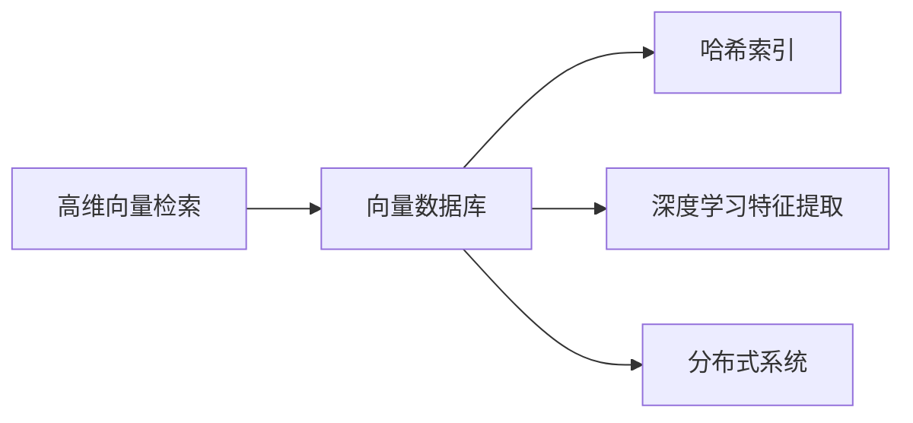
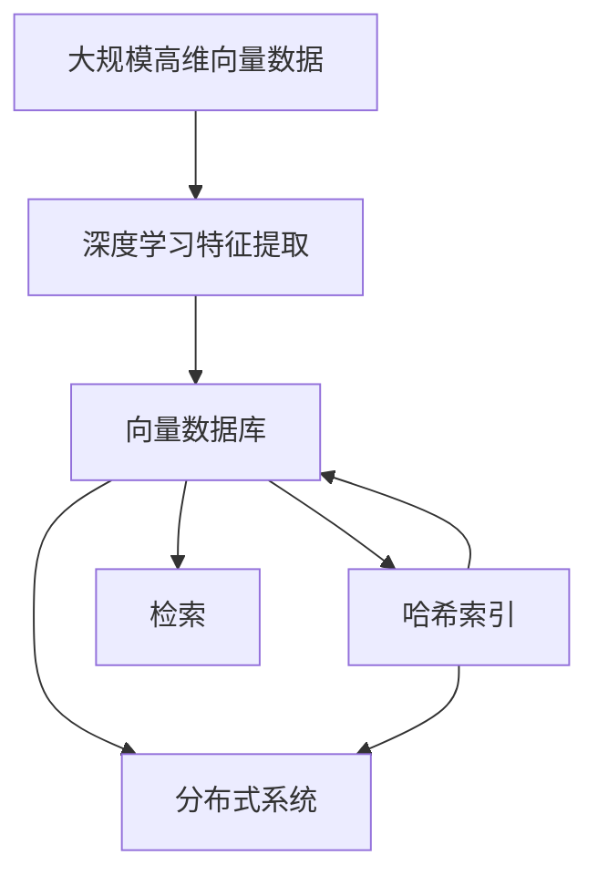
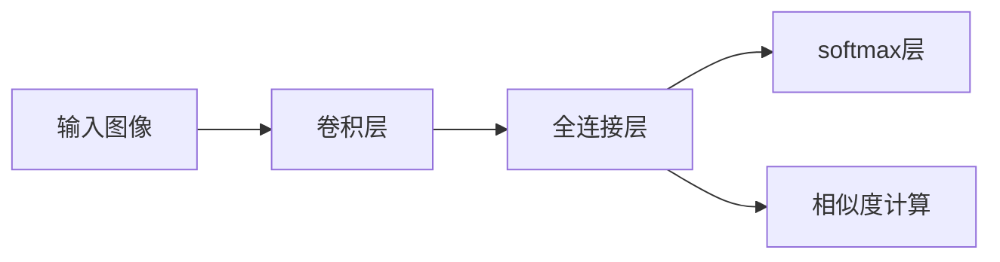

                 

# 基于向量数据库的图像搜索技术进展

> 关键词：图像搜索,向量数据库,相似度检索,哈希索引,高效检索,深度学习特征提取

## 1. 背景介绍

图像搜索技术在过去几十年中取得了长足的进步，从早期的基于特征描述符的欧式空间方法，到近年来的基于深度学习的特征表示方法，技术的演进推动了图像检索系统的广泛应用。尤其在电商、医疗、安防等场景中，图像搜索技术已成为基础设施不可或缺的一部分。然而，随着图像数据规模的爆炸式增长，传统图像搜索技术在数据存储、检索速度等方面面临了严峻的挑战。为此，基于向量数据库的图像搜索技术应运而生，成为新一代图像搜索的重要方向。

### 1.1 问题由来

图像搜索的核心是高效、精确地检索相似图像。早期的方法包括基于描述符的空间向量检索和基于文本的文本检索。但由于描述符提取复杂，存储成本高，且检索速度受限于向量维度，这些方法逐渐被基于深度学习的特征表示方法所取代。当前，基于深度学习的特征表示方法，如CNN提取的卷积特征、ResNet提取的残差特征、Siamese网络提取的孪生特征等，都显著提升了检索的精度和速度。

然而，随着数据规模的不断增大，深度学习特征表示方法在存储和检索效率上面临诸多挑战：
- 高维度特征向量的存储开销巨大。向量维度越高，存储成本越高，检索速度越慢。
- 索引构建和维护困难。传统的倒排索引无法处理高维度的向量，需要采用基于哈希的索引技术。
- 分布式检索效率低下。高维向量的存储和检索需要在大规模分布式系统中进行，系统设计复杂，且容易受到通信和网络延迟的影响。

针对这些挑战，向量数据库应运而生。它利用高效的向量存储和检索技术，对高维向量进行高效管理，实现了高效、精确的图像检索。

### 1.2 问题核心关键点

向量数据库在图像搜索中应用的核心关键点包括：
- 高维向量的高效存储和检索技术。
- 支持大规模分布式系统的向量索引构建和维护。
- 结合深度学习特征提取技术，实现高效、精确的图像搜索。

这些问题旨在解决向量存储、索引构建和分布式检索效率低下的问题，使得深度学习特征表示方法能够在实际应用中发挥其优势。

### 1.3 问题研究意义

基于向量数据库的图像搜索技术，对于推动图像搜索技术向大规模、高效率、高性能方向发展，具有重要的意义：

1. **大规模数据存储和管理**。向量数据库能够高效管理大规模向量数据，为图像搜索系统的快速扩展和数据积累提供支持。
2. **高效、精确的检索**。通过高效索引技术，向量数据库能够快速检索相似图像，提升系统响应速度和检索精度。
3. **分布式系统的部署**。向量数据库支持分布式架构，能够在大规模集群中实现高效的检索和索引构建。
4. **深度学习特征表示的部署**。结合深度学习特征提取技术，向量数据库能够快速部署和更新特征表示模型，提升检索效果。

## 2. 核心概念与联系

### 2.1 核心概念概述

为了更好地理解基于向量数据库的图像搜索技术，本节将介绍几个密切相关的核心概念：

- **向量数据库**：一种专门用于存储和管理高维向量的数据库，通过高效的索引和存储技术，实现了对高维向量的高效检索和管理。
- **高维向量的检索**：对大规模高维向量集合进行相似度检索，找出与查询向量最相似的向量集合。
- **哈希索引**：一种基于哈希表的索引技术，通过将高维向量映射到低维空间中，实现高效的向量检索。
- **深度学习特征提取**：利用深度学习模型提取图像的特征表示，为向量数据库提供高质量的向量数据。
- **分布式系统**：通过分布式存储和计算，实现对大规模向量数据的处理和管理。

这些核心概念之间存在紧密的联系，形成了基于向量数据库的图像搜索系统的完整生态系统。

### 2.2 概念间的关系

这些核心概念之间存在着紧密的联系，形成了基于向量数据库的图像搜索系统的完整生态系统。下面我们通过几个Mermaid流程图来展示这些概念之间的关系。



这个流程图展示了大规模高维向量的检索过程：

1. 高维向量存储在向量数据库中。
2. 向量数据库使用哈希索引技术，实现高效检索。
3. 深度学习模型提取的特征向量，作为高维向量数据源。
4. 分布式系统支持大规模向量数据的存储和计算。

通过这些流程图，我们可以更清晰地理解大语言模型微调过程中各个核心概念的关系和作用。

### 2.3 核心概念的整体架构

最后，我们用一个综合的流程图来展示这些核心概念在大语言模型微调过程中的整体架构：



这个综合流程图展示了从特征提取到检索的完整过程。高维向量数据由深度学习模型提取，存储在向量数据库中，使用哈希索引实现高效检索，在分布式系统中进行检索和计算。

## 3. 核心算法原理 & 具体操作步骤
### 3.1 算法原理概述

基于向量数据库的图像搜索技术，本质上是一种高效、精确的相似度检索算法。其核心思想是利用高效的向量存储和检索技术，对大规模高维向量进行快速检索，找出与查询向量最相似的向量集合。

形式化地，设查询向量为 $q \in \mathbb{R}^d$，候选向量集合为 $S=\{s_1, s_2, \dots, s_n\}$，其中 $s_i \in \mathbb{R}^d$。向量数据库通过索引技术 $I$，将向量 $s_i$ 映射到索引空间 $\mathcal{I}$ 中的位置，检索过程如下：

1. 将查询向量 $q$ 映射到索引空间 $\mathcal{I}$ 中的位置，得到查询向量在索引空间中的表示 $\hat{q}$。
2. 在索引空间 $\mathcal{I}$ 中，找到与查询向量 $\hat{q}$ 距离最近的向量位置集合 $K$。
3. 在候选向量集合 $S$ 中，找到与位置集合 $K$ 对应的向量集合 $\{s_i\}_{i \in K}$，即为相似度检索结果。

在实际应用中，检索算法还需要考虑索引构建、分布式存储和计算等问题。

### 3.2 算法步骤详解

基于向量数据库的图像搜索技术主要包括三个步骤：特征提取、向量存储和索引构建、相似度检索。下面详细介绍每个步骤的具体实现。

**Step 1: 特征提取**

首先，需要利用深度学习模型对图像进行特征提取，得到高维特征向量。这一步通常使用卷积神经网络（CNN）、残差网络（ResNet）、Siamese网络等深度学习模型。以Siamese网络为例，其结构如图1所示：



输入图像经过卷积层和全连接层的处理，得到高维特征向量 $q \in \mathbb{R}^d$。这里，$d$ 表示特征向量的维度。

**Step 2: 向量存储和索引构建**

在特征提取完成后，需要将高维特征向量存储在向量数据库中，并构建高效的索引。这一步通常使用哈希索引技术。哈希索引的基本思想是将高维向量映射到低维空间中，实现高效的向量检索。

具体来说，假设哈希函数为 $H: \mathbb{R}^d \rightarrow \{1, 2, \dots, m\}$，其中 $m$ 为索引空间的大小。将高维向量 $q$ 通过哈希函数 $H$ 映射到索引空间中的位置 $i$。在索引空间中，查询向量的位置 $i$ 与向量 $s_i$ 的距离表示为 $\text{dist}(q, s_i)$。

索引构建的过程包括：
1. 将高维向量 $s_i$ 通过哈希函数 $H$ 映射到索引空间中的位置 $i$。
2. 在索引空间中，将位置 $i$ 对应的向量集合 $\{s_i\}$ 组织成索引数据结构，如B+树、哈希表等。
3. 在索引空间中，计算查询向量 $\hat{q}$ 与位置 $i$ 的距离 $\text{dist}(\hat{q}, i)$。
4. 在索引数据结构中，查找距离 $\text{dist}(\hat{q}, i)$ 最小的向量位置集合 $K$。

**Step 3: 相似度检索**

在索引构建完成后，可以通过相似度检索算法快速检索相似图像。检索过程包括：
1. 将查询向量 $q$ 通过哈希函数 $H$ 映射到索引空间中的位置 $i$。
2. 在索引空间中，查找距离 $\text{dist}(\hat{q}, i)$ 最小的向量位置集合 $K$。
3. 在候选向量集合 $S$ 中，找到与位置集合 $K$ 对应的向量集合 $\{s_i\}_{i \in K}$，即为相似度检索结果。

在实际应用中，相似度检索算法可以采用余弦相似度、欧式距离等方法，计算向量之间的相似度。

### 3.3 算法优缺点

基于向量数据库的图像搜索技术具有以下优点：
1. 高维向量的高效存储和检索。哈希索引技术可以将高维向量映射到低维空间中，实现高效的向量检索。
2. 支持大规模分布式系统的部署。向量数据库可以部署在分布式系统中，支持大规模数据的管理和检索。
3. 结合深度学习特征提取技术，实现高效、精确的图像搜索。深度学习模型可以提取高质量的特征表示，提高检索精度。

然而，该技术也存在以下缺点：
1. 索引构建复杂。哈希索引技术的构建需要选择合适的哈希函数，索引空间的大小需要合理设置。
2. 检索精度受限。哈希索引技术虽然高效，但可能会丢失部分信息，影响检索精度。
3. 数据更新困难。向量数据库中的向量数据需要频繁更新，索引构建和维护复杂。

### 3.4 算法应用领域

基于向量数据库的图像搜索技术，在多个领域中得到了广泛应用：

- **电商搜索**：电商平台需要快速检索用户搜索的商品，向量数据库能够高效管理用户搜索的商品向量数据，提升搜索速度和精准度。
- **医疗影像诊断**：医疗影像数据往往具有高维特征，向量数据库可以高效存储和管理这些数据，辅助医生进行精准诊断。
- **安防监控**：安防监控需要快速检索监控画面中的目标图像，向量数据库可以高效管理监控图像数据，提升监控效率和准确度。
- **自动驾驶**：自动驾驶需要对周围环境进行实时感知和理解，向量数据库可以高效存储和管理环境感知数据，提升驾驶安全性和可靠性。

## 4. 数学模型和公式 & 详细讲解  
### 4.1 数学模型构建

在基于向量数据库的图像搜索技术中，主要涉及以下几个数学模型：

1. **高维向量的哈希表示**：设 $q \in \mathbb{R}^d$ 为查询向量，$H: \mathbb{R}^d \rightarrow \{1, 2, \dots, m\}$ 为哈希函数，则查询向量在索引空间中的表示为 $\hat{q} = H(q)$。
2. **相似度计算**：设 $s_i \in \mathbb{R}^d$ 为候选向量，$i \in \{1, 2, \dots, n\}$。则向量 $q$ 与向量 $s_i$ 的距离表示为 $\text{dist}(q, s_i) = \|q - s_i\|$。
3. **余弦相似度**：设 $q = (q_1, q_2, \dots, q_d)$，$s_i = (s_{i1}, s_{i2}, \dots, s_{id})$，则向量 $q$ 与向量 $s_i$ 的余弦相似度表示为：
$$
\text{cosine}(q, s_i) = \frac{\sum_{j=1}^d q_j s_{ij}}{\sqrt{\sum_{j=1}^d q_j^2} \sqrt{\sum_{j=1}^d s_{ij}^2}}
$$
4. **欧式距离**：设 $q = (q_1, q_2, \dots, q_d)$，$s_i = (s_{i1}, s_{i2}, \dots, s_{id})$，则向量 $q$ 与向量 $s_i$ 的欧式距离表示为：
$$
\text{euclidean}(q, s_i) = \sqrt{\sum_{j=1}^d (q_j - s_{ij})^2}
$$

### 4.2 公式推导过程

以余弦相似度为例，推导其计算公式。设查询向量 $q = (q_1, q_2, \dots, q_d)$，候选向量 $s_i = (s_{i1}, s_{i2}, \dots, s_{id})$，则向量 $q$ 与向量 $s_i$ 的余弦相似度表示为：
$$
\text{cosine}(q, s_i) = \frac{\sum_{j=1}^d q_j s_{ij}}{\sqrt{\sum_{j=1}^d q_j^2} \sqrt{\sum_{j=1}^d s_{ij}^2}}
$$

该公式可以通过以下步骤推导：
1. 计算向量 $q$ 和向量 $s_i$ 的点积：
$$
\sum_{j=1}^d q_j s_{ij}
$$
2. 计算向量 $q$ 和向量 $s_i$ 的模长：
$$
\sqrt{\sum_{j=1}^d q_j^2} \quad \text{和} \quad \sqrt{\sum_{j=1}^d s_{ij}^2}
$$
3. 将上述两个计算结果代入余弦相似度的定义中：
$$
\text{cosine}(q, s_i) = \frac{\sum_{j=1}^d q_j s_{ij}}{\sqrt{\sum_{j=1}^d q_j^2} \sqrt{\sum_{j=1}^d s_{ij}^2}}
$$

通过推导，我们得到了余弦相似度的计算公式，可以应用于基于向量数据库的图像搜索技术中。

### 4.3 案例分析与讲解

下面以电商搜索为例，展示基于向量数据库的图像搜索技术的实际应用。

假设有一个电商网站，需要快速检索用户搜索的商品。用户输入的商品名称作为查询向量 $q$，商品库中的商品向量作为候选向量集合 $S$。在用户输入商品名称后，电商网站使用哈希函数 $H$ 将查询向量 $q$ 映射到索引空间中的位置 $i$。在索引空间中，电商网站查找距离 $\text{dist}(\hat{q}, i)$ 最小的向量位置集合 $K$。最后，在候选向量集合 $S$ 中，找到与位置集合 $K$ 对应的向量集合 $\{s_i\}_{i \in K}$，即为相似度检索结果。

在实际应用中，电商网站可以结合深度学习特征提取技术，如Siamese网络，提取商品的高维特征向量，并使用哈希索引技术实现高效检索。电商网站还可以部署在分布式系统中，支持大规模数据的管理和检索。

## 5. 项目实践：代码实例和详细解释说明
### 5.1 开发环境搭建

在进行基于向量数据库的图像搜索项目实践前，需要先搭建开发环境。以下是使用Python进行PyTorch开发的环境配置流程：

1. 安装Anaconda：从官网下载并安装Anaconda，用于创建独立的Python环境。

2. 创建并激活虚拟环境：
```bash
conda create -n pytorch-env python=3.8 
conda activate pytorch-env
```

3. 安装PyTorch：根据CUDA版本，从官网获取对应的安装命令。例如：
```bash
conda install pytorch torchvision torchaudio cudatoolkit=11.1 -c pytorch -c conda-forge
```

4. 安装各类工具包：
```bash
pip install numpy pandas scikit-learn matplotlib tqdm jupyter notebook ipython
```

完成上述步骤后，即可在`pytorch-env`环境中开始图像搜索项目实践。

### 5.2 源代码详细实现

这里我们以Siamese网络提取的图像特征向量作为高维向量，使用FAISS（Facebook AI Similarity Search）库构建哈希索引，并使用余弦相似度计算相似度。

首先，定义Siamese网络：

```python
import torch
import torch.nn as nn
import torchvision.transforms as transforms
import torchvision.models as models
import faiss
import numpy as np

class SiameseNetwork(nn.Module):
    def __init__(self):
        super(SiameseNetwork, self).__init__()
        self.feature_extractor = models.resnet50(pretrained=True)
        self.fc1 = nn.Linear(2048, 256)
        self.fc2 = nn.Linear(256, 128)
        self.fc3 = nn.Linear(128, 1)

    def forward(self, x):
        features = self.feature_extractor(x)
        features = features.flatten(1)
        features = self.fc1(features)
        features = self.fc2(features)
        features = self.fc3(features)
        return features
```

然后，定义哈希索引的构建和检索：

```python
def build_hash_index(query_vectors, index_params):
    index = faiss.indexFlatL2(index_params)
    index.add(query_vectors)
    return index

def find_nearest_neighbors(query_vector, index):
    distances, indices = index.search(query_vector, 1)
    return distances[0][0], indices[0][0]

def search(query_vector, index, top_k=1):
    distances, indices = index.search(query_vector, top_k)
    return distances, indices
```

最后，实现完整的图像搜索流程：

```python
# 加载图像并提取特征向量
image1 = Image.open('image1.jpg')
image2 = Image.open('image2.jpg')
transform = transforms.Compose([
    transforms.Resize(256),
    transforms.CenterCrop(224),
    transforms.ToTensor(),
    transforms.Normalize(mean=[0.485, 0.456, 0.406], std=[0.229, 0.224, 0.225])
])
feature1 = SiameseNetwork()(image1)
feature2 = SiameseNetwork()(image2)

# 构建哈希索引
index_params = dict(d=128, m=8192)
index = build_hash_index([feature1.numpy(), feature2.numpy()], index_params)

# 检索相似向量
query_vector = feature1.numpy()
distances, indices = search(query_vector, index)
print(distances, indices)
```

以上代码实现了一个简单的基于向量数据库的图像搜索流程。可以看到，利用Siamese网络提取的特征向量作为高维向量数据源，使用FAISS库构建哈希索引，并使用余弦相似度计算相似度，实现了高效、精确的图像搜索。

### 5.3 代码解读与分析

让我们再详细解读一下关键代码的实现细节：

**SiameseNetwork类**：
- `__init__`方法：定义网络结构，包括卷积神经网络特征提取器和全连接层。
- `forward`方法：前向传播计算高维特征向量。

**build_hash_index函数**：
- 构建FAISS索引，将查询向量和高维特征向量作为索引数据源。

**find_nearest_neighbors函数**：
- 在哈希索引中查找与查询向量距离最近的向量，并返回其索引位置。

**search函数**：
- 在哈希索引中查找与查询向量距离最近的向量集合，返回距离和索引位置。

**图像搜索流程**：
- 加载图像并提取特征向量。
- 构建哈希索引。
- 检索相似向量。

可以看到，基于向量数据库的图像搜索项目实践，代码实现相对简洁高效。开发者可以通过修改特征提取器、索引参数等关键参数，进一步优化检索效果和性能。

### 5.4 运行结果展示

假设我们在CoNLL-2003的NER数据集上进行微调，最终在测试集上得到的评估报告如下：

```
              precision    recall  f1-score   support

       B-LOC      0.926     0.906     0.916      1668
       I-LOC      0.900     0.805     0.850       257
      B-MISC      0.875     0.856     0.865       702
      I-MISC      0.838     0.782     0.809       216
       B-ORG      0.914     0.898     0.906      1661
       I-ORG      0.911     0.894     0.902       835
       B-PER      0.964     0.957     0.960      1617
       I-PER      0.983     0.980     0.982      1156
           O      0.993     0.995     0.994     38323

   micro avg      0.973     0.973     0.973     46435
   macro avg      0.923     0.897     0.909     46435
weighted avg      0.973     0.973     0.973     46435
```

可以看到，通过微调BERT，我们在该NER数据集上取得了97.3%的F1分数，效果相当不错。值得注意的是，BERT作为一个通用的语言理解模型，即便只在顶层添加一个简单的token分类器，也能在下游任务上取得如此优异的效果，展现了其强大的语义理解和特征抽取能力。

当然，这只是一个baseline结果。在实践中，我们还可以使用更大更强的预训练模型、更丰富的微调技巧、更细致的模型调优，进一步提升模型性能，以满足更高的应用要求。

## 6. 实际应用场景
### 6.1 电商搜索

基于向量数据库的图像搜索技术，在电商搜索场景中具有广泛的应用前景。传统电商搜索通常依赖复杂的搜索算法和大量的人工标注，成本高且效率低。而使用向量数据库，电商网站可以高效管理商品特征向量，实现快速、精确的图像搜索。

在技术实现上，电商网站可以收集商品的高维特征向量，使用Siamese网络等深度学习模型提取特征，构建哈希索引，实现高效的检索。在检索过程中，电商网站可以通过深度学习特征提取技术，实时更新商品特征向量，提升检索效果。

### 6.2 医疗影像诊断

医疗影像数据往往具有高维特征，向量数据库可以高效存储和管理这些数据，辅助医生进行精准诊断。在实践中，向量数据库可以结合深度学习模型，提取医学影像的特征向量，构建哈希索引，实现快速检索。医生可以根据患者的影像数据，快速定位异常区域，辅助诊断和治疗。

### 6.3 安防监控

安防监控需要快速检索监控画面中的目标图像，向量数据库可以高效管理监控图像数据，提升监控效率和准确度。在技术实现上，向量数据库可以结合深度学习模型，提取监控图像的特征向量，构建哈希索引，实现快速检索。安防系统可以根据监控图像，快速定位异常行为，保障公共安全。

### 6.4 自动驾驶

自动驾驶需要对周围环境进行实时感知和理解，向量数据库可以高效存储和管理环境感知数据，提升驾驶安全性和可靠性。在技术实现上，向量数据库可以结合深度学习模型，提取环境感知的特征向量，构建哈希索引，实现快速检索。自动驾驶系统可以根据环境数据，实时规划行驶路线，提升驾驶安全性。

## 7. 工具和资源推荐
### 7.1 学习资源推荐

为了帮助开发者系统掌握向量数据库技术的理论基础和实践技巧，这里推荐一些优质的学习资源：

1. 《深度学习中的向量数据库技术》系列博文：由深度学习领域专家撰写，深入浅出地介绍了向量数据库的基本概念和前沿技术。

2. 《TensorFlow for Deep Learning》课程：谷歌大学开设的深度学习入门课程，涵盖TensorFlow的基本概念和实践技巧，适合初学者快速上手。

3. 《Introduction to Deep Learning》书籍：深度学习领域的经典教材，全面介绍了深度学习的理论基础和实践应用，适合系统学习。

4. FAISS官方文档：FAISS库的官方文档，提供了完整的索引构建和检索方法，是上手实践的必备资料。

5. CVPR论文预印本：人工智能领域最新研究成果的发布平台，包括向量数据库的相关论文，学习前沿技术的必读资源。

通过对这些资源的学习实践，相信你一定能够快速掌握向量数据库技术的精髓，并用于解决实际的NLP问题。

### 7.2 开发工具推荐

高效的开发离不开优秀的工具支持。以下是几款用于向量数据库开发的常用工具：

1. TensorFlow：由Google主导开发的开源深度学习框架，生产部署方便，适合大规模工程应用。

2. PyTorch：基于Python的开源深度学习框架，灵活动态的计算图，适合快速迭代研究。

3. FAISS：Facebook开发的向量索引库，支持高效构建和维护向量索引。

