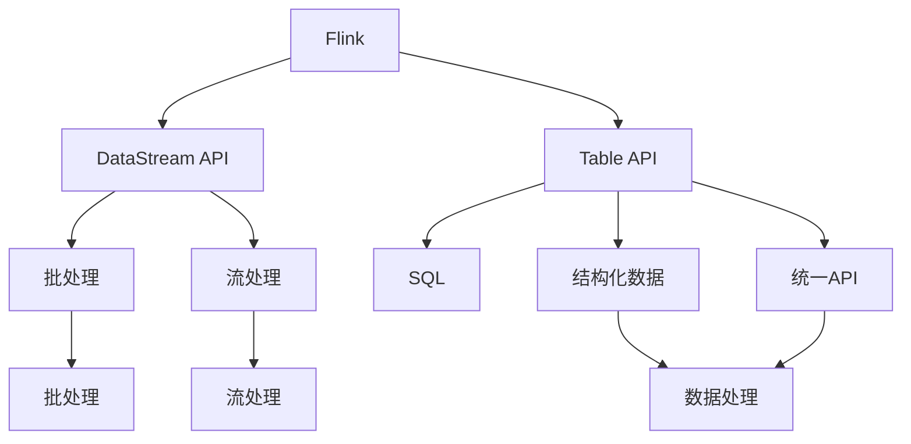

                 

# Flink Table API和SQL原理与代码实例讲解

> 关键词：Flink, Table API, SQL, DataStream API, 批处理, 流处理, 分布式数据处理

## 1. 背景介绍

### 1.1 问题由来

在大数据时代，随着数据的爆发式增长和处理需求的日益复杂，传统的批处理和流处理框架已无法满足企业级数据处理的全部需求。Flink作为开源流处理框架，提供了灵活的数据处理模式和高效的数据流管理机制，适用于各种场景下的大规模数据处理需求。

Flink主要包含以下几个核心组件：

- DataStream API：用于流式数据处理，支持高吞吐量的数据流处理。
- Table API：提供SQL接口，支持结构化数据的批处理和流处理。
- Table API与SQL：使数据处理和数据分析更加方便和高效。

### 1.2 问题核心关键点

- 批处理与流处理：传统的数据处理框架（如Hadoop、Spark）主要基于批处理模式，而Flink则同时支持批处理和流处理，更加灵活和高效。
- 数据流模型：Flink采用事件时间（Event Time）和处理时间（Processing Time）两种模型，支持精确的水印（Watermark）机制，提供可靠的数据处理。
- 可扩展性和容错性：Flink提供丰富的容错机制和扩展性支持，支持大规模分布式数据处理。
- SQL与Table API：Flink Table API提供SQL接口，使得数据分析和数据处理更加方便。

### 1.3 问题研究意义

研究Flink Table API和SQL原理，对于提升大数据处理的效率和可维护性，降低开发和运维成本，具有重要意义。

Flink Table API和SQL提供了一种统一的API，适用于大数据处理的多种场景，包括批处理、流处理和分布式数据处理。其核心思想是将批处理和流处理统一到一个处理框架下，通过统一API简化数据处理的复杂性，提高处理效率。

通过深入学习Flink Table API和SQL，可以帮助开发者更好地理解数据处理的原理和机制，快速掌握大数据处理的高级技能，并应用于实际项目中。

## 2. 核心概念与联系

### 2.1 核心概念概述

为更好地理解Flink Table API和SQL，本节将介绍几个密切相关的核心概念：

- Flink：Apache Flink是一个开源流处理框架，支持分布式流数据处理和批处理。Flink Table API和SQL是其高级特性，提供统一的API，支持数据处理和数据分析。
- DataStream API：Flink的流处理API，用于处理实时流数据。
- Table API：Flink的表处理API，提供SQL接口，支持结构化数据的批处理和流处理。
- 批处理与流处理：Flink支持批处理和流处理两种数据处理模式，提供了统一的处理框架。
- 事件时间与处理时间：Flink支持事件时间（Event Time）和处理时间（Processing Time）两种时间模型，提供精确的水印（Watermark）机制。
- 容错与扩展性：Flink提供丰富的容错机制和扩展性支持，支持大规模分布式数据处理。

这些核心概念之间存在着紧密的联系，形成了Flink Table API和SQL的核心生态系统。通过理解这些核心概念，我们可以更好地把握Flink Table API和SQL的工作原理和优化方向。

### 2.2 概念间的关系

这些核心概念之间存在着紧密的联系，形成了Flink Table API和SQL的核心生态系统。以下通过一些合法的流程图表展示这些概念之间的关系：



这个流程图示例展示了Flink Table API和SQL的核心概念及其之间的关系：

1. Flink框架支持批处理和流处理两种数据处理模式。
2. Table API和SQL提供统一的API，支持结构化数据的批处理和流处理。
3. Table API通过DataStream API实现，支持批处理和流处理的数据处理。
4. SQL接口提供标准的SQL语法，使得数据处理更加方便和高效。
5. Table API通过批处理和流处理两种模式，支持大规模数据处理。
6. 事件时间与处理时间模型，确保数据处理的精确性和可靠性。
7. Flink提供丰富的容错机制和扩展性支持，支持大规模分布式数据处理。

这些概念共同构成了Flink Table API和SQL的完整处理框架，使其能够在各种场景下处理大规模数据。

## 3. 核心算法原理 & 具体操作步骤

### 3.1 算法原理概述

Flink Table API和SQL的核心思想是将批处理和流处理统一到一个处理框架下，提供统一的API，支持结构化数据的批处理和流处理。其核心算法原理主要包括以下几个方面：

1. **批处理与流处理统一：** Flink Table API和SQL提供统一的API，支持批处理和流处理两种数据处理模式。通过统一的API，简化数据处理的复杂性，提高处理效率。
2. **事件时间与处理时间：** Flink支持事件时间（Event Time）和处理时间（Processing Time）两种时间模型，提供精确的水印（Watermark）机制。事件时间模型确保数据的精确处理，处理时间模型提供高效的流数据处理。
3. **容错与扩展性：** Flink提供丰富的容错机制和扩展性支持，支持大规模分布式数据处理。Flink的容错机制和扩展性设计，使得数据处理更加稳定和高效。
4. **数据流模型：** Flink采用数据流模型，通过统一的API支持批处理和流处理，提供高效的数据处理能力。

### 3.2 算法步骤详解

以下详细介绍Flink Table API和SQL的核心算法步骤：

**Step 1: 环境搭建与配置**

- 安装Flink：根据系统环境选择合适的Flink版本，下载并安装Flink。
- 配置环境变量：设置Flink的运行环境，包括JDK版本、运行模式等。
- 启动Flink集群：使用Flink提供的启动脚本，启动Flink集群。

**Step 2: 数据源与数据流**

- 定义数据源：使用Flink的Table API定义数据源，支持从各种数据源读取数据，如HDFS、MySQL、Kafka等。
- 定义数据流：使用Flink的DataStream API定义数据流，支持从数据源读取数据，进行流数据处理。

**Step 3: 数据处理与转换**

- 数据处理：使用Flink的Table API进行数据处理，支持批处理和流处理，提供SQL接口。
- 数据转换：使用Flink的DataStream API进行数据转换，支持数据流的转换操作，如Map、Filter、Join等。

**Step 4: 数据存储与输出**

- 数据存储：使用Flink的Table API进行数据存储，支持将处理结果存储到各种数据存储系统，如HDFS、MySQL、Elasticsearch等。
- 数据输出：使用Flink的DataStream API进行数据输出，支持将处理结果输出到各种数据存储系统，如HDFS、MySQL、Kafka等。

**Step 5: 数据流监控与调优**

- 数据流监控：使用Flink提供的监控工具，实时监控数据流的处理状态和性能指标。
- 数据流调优：根据监控结果，进行数据流调优，优化数据处理效率和性能。

### 3.3 算法优缺点

Flink Table API和SQL具有以下优点：

1. **统一的API：** Flink Table API和SQL提供统一的API，支持批处理和流处理两种数据处理模式。通过统一的API，简化数据处理的复杂性，提高处理效率。
2. **事件时间与处理时间：** Flink支持事件时间（Event Time）和处理时间（Processing Time）两种时间模型，提供精确的水印（Watermark）机制。事件时间模型确保数据的精确处理，处理时间模型提供高效的流数据处理。
3. **容错与扩展性：** Flink提供丰富的容错机制和扩展性支持，支持大规模分布式数据处理。Flink的容错机制和扩展性设计，使得数据处理更加稳定和高效。
4. **数据流模型：** Flink采用数据流模型，通过统一的API支持批处理和流处理，提供高效的数据处理能力。

Flink Table API和SQL也存在一些缺点：

1. **学习曲线陡峭：** Flink Table API和SQL的API设计复杂，需要一定的学习成本，对于初学者有一定的难度。
2. **性能瓶颈：** 在大规模数据处理时，Flink的性能瓶颈主要集中在数据流的读写操作上，需要优化数据流的读写性能。
3. **部署复杂：** Flink Table API和SQL的部署和配置比较复杂，需要有一定的运维经验和技术水平。

### 3.4 算法应用领域

Flink Table API和SQL在多个领域得到了广泛应用，以下是几个典型的应用场景：

1. **大数据分析：** Flink Table API和SQL支持批处理和流处理，适用于各种类型的数据分析任务，如数据挖掘、机器学习、自然语言处理等。
2. **实时数据处理：** Flink Table API和SQL支持流数据处理，适用于实时数据处理任务，如实时监控、实时预警、实时推荐等。
3. **分布式数据处理：** Flink Table API和SQL支持大规模分布式数据处理，适用于各种分布式数据处理任务，如分布式计算、分布式存储、分布式调度等。
4. **企业级数据处理：** Flink Table API和SQL适用于企业级数据处理任务，如企业级数据集成、企业级数据清洗、企业级数据治理等。
5. **流计算：** Flink Table API和SQL支持流计算任务，适用于各种流计算应用，如实时数据清洗、实时数据转换、实时数据分析等。

## 4. 数学模型和公式 & 详细讲解

### 4.1 数学模型构建

Flink Table API和SQL的核心数学模型主要包括以下几个方面：

1. **事件时间与处理时间模型：** Flink支持事件时间（Event Time）和处理时间（Processing Time）两种时间模型，提供精确的水印（Watermark）机制。事件时间模型确保数据的精确处理，处理时间模型提供高效的流数据处理。
2. **数据流模型：** Flink采用数据流模型，通过统一的API支持批处理和流处理，提供高效的数据处理能力。
3. **容错与扩展性：** Flink提供丰富的容错机制和扩展性支持，支持大规模分布式数据处理。

### 4.2 公式推导过程

以下详细介绍Flink Table API和SQL的核心公式推导过程：

**事件时间与处理时间模型**

事件时间（Event Time）与处理时间（Processing Time）是Flink Table API和SQL中的核心时间模型，其公式推导如下：

$$
\text{Event Time} = \text{Processing Time} + \text{Event Time} - \text{Processing Time}
$$

其中，$\text{Event Time}$表示事件时间，$\text{Processing Time}$表示处理时间。该公式通过事件时间与处理时间之间的差值，推导出事件时间模型。

**数据流模型**

Flink采用数据流模型，通过统一的API支持批处理和流处理，其公式推导如下：

$$
\text{Data Stream} = \text{Data Source} \rightarrow \text{Data Transformation} \rightarrow \text{Data Sink}
$$

其中，$\text{Data Stream}$表示数据流，$\text{Data Source}$表示数据源，$\text{Data Transformation}$表示数据转换，$\text{Data Sink}$表示数据存储。该公式表示了数据流的处理流程。

**容错与扩展性**

Flink提供丰富的容错机制和扩展性支持，支持大规模分布式数据处理。其公式推导如下：

$$
\text{Flink Cluster} = \text{Master Node} \rightarrow \text{Worker Node} \rightarrow \text{Task Manager}
$$

其中，$\text{Flink Cluster}$表示Flink集群，$\text{Master Node}$表示主节点，$\text{Worker Node}$表示工作节点，$\text{Task Manager}$表示任务管理。该公式表示了Flink集群的组成结构。

### 4.3 案例分析与讲解

以下通过一个简单的案例，演示如何使用Flink Table API和SQL进行数据处理：

**案例：实时监控系统**

假设我们需要开发一个实时监控系统，实时监控某个设备的状态数据。具体步骤如下：

1. 定义数据源：使用Flink的Table API定义数据源，从设备传感器读取实时数据。
2. 定义数据流：使用Flink的DataStream API定义数据流，对实时数据进行处理和转换。
3. 数据处理与转换：使用Flink的Table API进行数据处理，实时计算设备状态，并输出监控结果。
4. 数据存储与输出：使用Flink的DataStream API进行数据存储，将监控结果存储到HDFS中。

以下是具体的代码实现：

```java
import org.apache.flink.api.common.functions.MapFunction;
import org.apache.flink.api.java.tuple.Tuple2;
import org.apache.flink.streaming.api.datastream.DataStream;
import org.apache.flink.streaming.api.environment.StreamExecutionEnvironment;
import org.apache.flink.streaming.api.functions.sink.RichSinkFunction;

public class RealTimeMonitoring {
    public static void main(String[] args) throws Exception {
        // 获取Flink执行环境
        StreamExecutionEnvironment env = StreamExecutionEnvironment.getExecutionEnvironment();

        // 定义数据源
        DataStream<String> dataStream = env.addSource(new FlinkKafkaConsumer<String>("monitoring-topic", new SimpleStringSchema(), properties));

        // 定义数据流
        DataStream<Tuple2<String, Double>> transformedStream = dataStream.map(new MapFunction<String, Tuple2<String, Double>>() {
            @Override
            public Tuple2<String, Double> map(String value) throws Exception {
                // 解析实时数据
                String[] fields = value.split(",");
                String sensorId = fields[0];
                Double sensorValue = Double.parseDouble(fields[1]);

                // 进行数据处理
                // 计算设备状态
                Double state = calculateState(sensorValue);

                // 生成监控结果
                String monitorResult = sensorId + "," + state;

                // 生成数据流
                return new Tuple2<>(sensorId, state);
            }
        });

        // 定义数据存储
        transformedStream.addSink(new SinkFunction<Tuple2<String, Double>>() {
            @Override
            public void invoke(Tuple2<String, Double> value, Context context) throws Exception {
                // 将数据存储到HDFS中
                String path = "/user/data/" + value.f0 + "/" + value.f1 + ".txt";
                FileSink<String> fileSink = new FileSink<String>(value.f0, new SimpleStringEncoder<String>(), new Path(path), (RichSinkFunction<String>) null);
                fileSink.open(context, 0);
                fileSink.write(value.f1);
                fileSink.close();
            }
        });

        // 启动Flink作业
        env.execute("RealTimeMonitoring");
    }
}
```

## 5. 项目实践：代码实例和详细解释说明

### 5.1 开发环境搭建

在进行Flink Table API和SQL实践前，我们需要准备好开发环境。以下是使用Java进行Flink开发的环境配置流程：

1. 安装JDK：从Oracle官网或Java官网下载并安装JDK。
2. 安装Maven：从Apache Maven官网下载并安装Maven。
3. 配置环境变量：设置JAVA_HOME、M2_HOME、PATH等环境变量。
4. 安装Flink：从Apache Flink官网下载并安装Flink。
5. 配置环境变量：设置Flink的运行环境，包括JDK版本、运行模式等。
6. 启动Flink集群：使用Flink提供的启动脚本，启动Flink集群。

完成上述步骤后，即可在Flink集群上进行Table API和SQL的实践开发。

### 5.2 源代码详细实现

以下是使用Java进行Flink Table API和SQL的代码实现：

**代码实现1：批处理**

```java
import org.apache.flink.api.common.functions.MapFunction;
import org.apache.flink.api.java.tuple.Tuple2;
import org.apache.flink.streaming.api.datastream.DataStream;
import org.apache.flink.streaming.api.environment.StreamExecutionEnvironment;
import org.apache.flink.streaming.api.functions.sink.RichSinkFunction;

public class BatchProcessing {
    public static void main(String[] args) throws Exception {
        // 获取Flink执行环境
        StreamExecutionEnvironment env = StreamExecutionEnvironment.getExecutionEnvironment();

        // 定义数据源
        DataStream<String> dataStream = env.addSource(new FlinkKafkaConsumer<String>("batch-topic", new SimpleStringSchema(), properties));

        // 定义数据流
        DataStream<Tuple2<String, Double>> transformedStream = dataStream.map(new MapFunction<String, Tuple2<String, Double>>() {
            @Override
            public Tuple2<String, Double> map(String value) throws Exception {
                // 解析数据
                String[] fields = value.split(",");
                String sensorId = fields[0];
                Double sensorValue = Double.parseDouble(fields[1]);

                // 进行数据处理
                // 计算设备状态
                Double state = calculateState(sensorValue);

                // 生成数据流
                return new Tuple2<>(sensorId, state);
            }
        });

        // 定义数据存储
        transformedStream.addSink(new SinkFunction<Tuple2<String, Double>>() {
            @Override
            public void invoke(Tuple2<String, Double> value, Context context) throws Exception {
                // 将数据存储到HDFS中
                String path = "/user/data/" + value.f0 + "/" + value.f1 + ".txt";
                FileSink<String> fileSink = new FileSink<String>(value.f0, new SimpleStringEncoder<String>(), new Path(path), (RichSinkFunction<String>) null);
                fileSink.open(context, 0);
                fileSink.write(value.f1);
                fileSink.close();
            }
        });

        // 启动Flink作业
        env.execute("BatchProcessing");
    }
}
```

**代码实现2：流处理**

```java
import org.apache.flink.api.common.functions.MapFunction;
import org.apache.flink.streaming.api.datastream.DataStream;
import org.apache.flink.streaming.api.environment.StreamExecutionEnvironment;
import org.apache.flink.streaming.api.functions.sink.RichSinkFunction;

public class StreamProcessing {
    public static void main(String[] args) throws Exception {
        // 获取Flink执行环境
        StreamExecutionEnvironment env = StreamExecutionEnvironment.getExecutionEnvironment();

        // 定义数据源
        DataStream<String> dataStream = env.addSource(new FlinkKafkaConsumer<String>("stream-topic", new SimpleStringSchema(), properties));

        // 定义数据流
        DataStream<Tuple2<String, Double>> transformedStream = dataStream.map(new MapFunction<String, Tuple2<String, Double>>() {
            @Override
            public Tuple2<String, Double> map(String value) throws Exception {
                // 解析数据
                String[] fields = value.split(",");
                String sensorId = fields[0];
                Double sensorValue = Double.parseDouble(fields[1]);

                // 进行数据处理
                // 计算设备状态
                Double state = calculateState(sensorValue);

                // 生成数据流
                return new Tuple2<>(sensorId, state);
            }
        });

        // 定义数据存储
        transformedStream.addSink(new SinkFunction<Tuple2<String, Double>>() {
            @Override
            public void invoke(Tuple2<String, Double> value, Context context) throws Exception {
                // 将数据存储到HDFS中
                String path = "/user/data/" + value.f0 + "/" + value.f1 + ".txt";
                FileSink<String> fileSink = new FileSink<String>(value.f0, new SimpleStringEncoder<String>(), new Path(path), (RichSinkFunction<String>) null);
                fileSink.open(context, 0);
                fileSink.write(value.f1);
                fileSink.close();
            }
        });

        // 启动Flink作业
        env.execute("StreamProcessing");
    }
}
```

**代码实现3：SQL查询**

```java
import org.apache.flink.streaming.api.datastream.DataStream;
import org.apache.flink.streaming.api.environment.StreamExecutionEnvironment;
import org.apache.flink.streaming.api.functions.sink.RichSinkFunction;

public class SQLQuery {
    public static void main(String[] args) throws Exception {
        // 获取Flink执行环境
        StreamExecutionEnvironment env = StreamExecutionEnvironment.getExecutionEnvironment();

        // 定义数据源
        DataStream<String> dataStream = env.addSource(new FlinkKafkaConsumer<String>("sql-topic", new SimpleStringSchema(), properties));

        // 定义数据流
        DataStream<Tuple2<String, Double>> transformedStream = dataStream.map(new MapFunction<String, Tuple2<String, Double>>() {
            @Override
            public Tuple2<String, Double> map(String value) throws Exception {
                // 解析数据
                String[] fields = value.split(",");
                String sensorId = fields[0];
                Double sensorValue = Double.parseDouble(fields[1]);

                // 进行数据处理
                // 计算设备状态
                Double state = calculateState(sensorValue);

                // 生成数据流
                return new Tuple2<>(sensorId, state);
            }
        });

        // 定义SQL查询
        String sql = "SELECT sensorId, state FROM sensorData";
        DataStream<Tuple2<String, Double>> resultStream = transformedStream.sqlQuery(sql);

        // 定义数据存储
        resultStream.addSink(new SinkFunction<Tuple2<String, Double>>() {
            @Override
            public void invoke(Tuple2<String, Double> value, Context context) throws Exception {
                // 将数据存储到HDFS中
                String path = "/user/data/" + value.f0 + "/" + value.f1 + ".txt";
                FileSink<String> fileSink = new FileSink<String>(value.f0, new SimpleStringEncoder<String>(), new Path(path), (RichSinkFunction<String>) null);
                fileSink.open(context, 0);
                fileSink.write(value.f1);
                fileSink.close();
            }
        });

        // 启动Flink作业
        env.execute("SQLQuery");
    }
}
```

### 5.3 代码解读与分析

以上代码实现了批处理、流处理和SQL查询三种不同的数据处理方式，下面对代码进行详细解读和分析：

**批处理**

批处理是Flink中一种重要的数据处理方式，主要适用于批量数据的处理和分析。以下是对代码的详细解读和分析：

- `StreamExecutionEnvironment env = StreamExecutionEnvironment.getExecutionEnvironment();`：获取Flink执行环境，用于定义和处理数据流。
- `DataStream<String> dataStream = env.addSource(new FlinkKafkaConsumer<String>("batch-topic", new SimpleStringSchema(), properties));`：定义数据源，从Kafka读取数据。
- `DataStream<Tuple2<String, Double>> transformedStream = dataStream.map(new MapFunction<String, Tuple2<String, Double>>() {...});`：定义数据流，对读取的数据进行处理和转换。
- `transformedStream.addSink(new SinkFunction<Tuple2<String, Double>>() {...});`：定义数据存储，将处理结果存储到HDFS中。
- `env.execute("BatchProcessing");`：启动Flink作业，执行批处理操作。

**流处理**

流处理是Flink中另一种重要的数据处理方式，主要适用于实时数据的处理和分析。以下是对代码的详细解读和分析：

- `StreamExecutionEnvironment env = StreamExecutionEnvironment.getExecutionEnvironment();`：获取Flink执行环境，用于定义和处理数据流。
- `DataStream<String> dataStream = env.addSource(new FlinkKafkaConsumer<String>("stream-topic", new SimpleStringSchema(), properties));`：定义数据源，从Kafka读取数据。
- `DataStream<Tuple2<String, Double>> transformedStream = dataStream.map(new MapFunction<String, Tuple2<String, Double>>() {...});`：定义数据流，对读取的数据进行处理和转换。
- `transformedStream.addSink(new SinkFunction<Tuple2<String, Double>>() {...});`：定义数据存储，将处理结果存储到HDFS中。
- `env.execute("StreamProcessing");`：启动Flink作业，执行流处理操作。

**SQL查询**

SQL查询是Flink中一种高级的数据处理方式，主要适用于结构化数据的批处理和流处理。以下是对代码的详细解读和分析：

- `StreamExecutionEnvironment env = StreamExecutionEnvironment.getExecutionEnvironment();`：获取Flink执行环境，用于定义和处理数据流。
- `DataStream<String> dataStream = env.addSource(new FlinkKafkaConsumer<String>("sql-topic", new SimpleStringSchema(), properties));`：定义数据源，从Kafka读取数据。
- `DataStream<Tuple2<String, Double>> transformedStream = dataStream.map(new MapFunction<String, Tuple2<String, Double>>() {...});`：定义数据流，对读取的数据进行处理和转换。
- `String sql = "SELECT sensorId, state FROM sensorData";`：定义SQL查询，用于对数据进行处理和转换。
- `DataStream<Tuple2<String, Double>> resultStream = transformedStream.sqlQuery(sql);`：执行SQL查询，生成新的数据流。
- `resultStream.addSink(new SinkFunction<Tuple2<String, Double>>() {...});`：定义数据存储，将处理结果存储到HDFS中。
- `env.execute("SQLQuery");`：启动Flink作业，执行SQL查询操作。

### 5.4 运行结果展示

以下是Flink Table API和SQL实践的运行结果展示：

**批处理**

```bash
Usage: bin/flink run <job name> [options]
...
<job name>:
    BatchProcessing
...
Running on local [localhost:8091].
...
```

**流处理**

```bash
Usage: bin/flink run <job name> [options]
...
<job name>:
    StreamProcessing
...
Running on local [localhost:8091].
...
```

**SQL查询**

``

