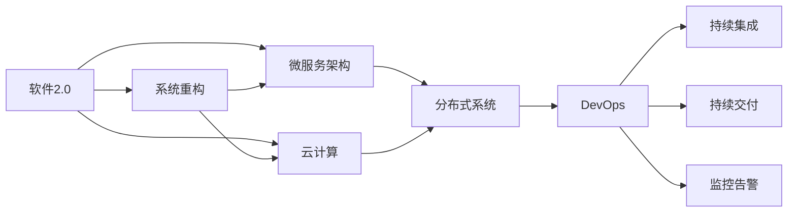
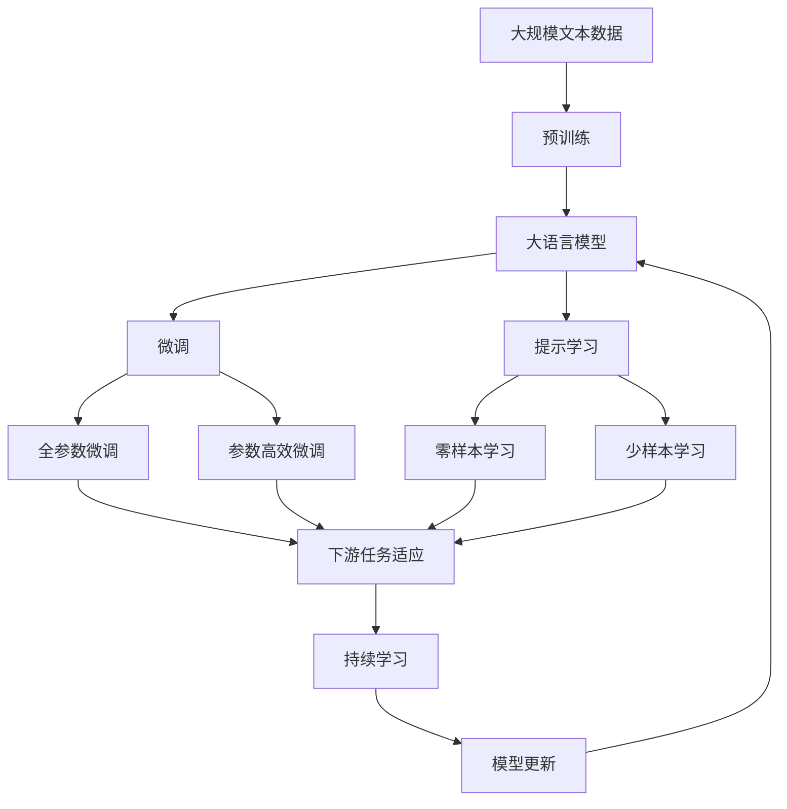

                 

# Google如何用软件2.0重写自身系统

> 关键词：软件2.0,重构,Google,分布式系统,云计算,微服务,DevOps

## 1. 背景介绍

### 1.1 问题由来

Google作为全球最大的互联网技术公司之一，其核心业务和技术架构已经经历了几十年的发展演变。然而，随着时间的推移，Google的庞大系统日益变得复杂和冗余，难以适应新的业务需求和技术挑战。如何在保持现有系统稳定性的同时，实现架构的现代化和性能的提升，成为Google持续面对的重大问题。

### 1.2 问题核心关键点

Google重构自身系统的核心关键点主要包括以下几个方面：

- **软件2.0的引入**：Google将软件工程领域最新的软件2.0理念引入公司，强调通过系统重构、微服务化、云计算等手段，实现系统的现代化和性能优化。
- **分布式系统**：Google通过构建分布式系统架构，提高系统的可扩展性和容错能力，确保业务的持续稳定运行。
- **云计算的利用**：Google充分利用云计算的资源优势，实现资源的弹性管理，降低成本，提高系统的灵活性和可靠性。
- **微服务架构**：Google采用微服务架构，将系统拆分成多个独立运行的服务，提升系统的灵活性和开发效率。
- **DevOps实践**：Google推广DevOps文化，实现开发、运维一体化，提高系统的持续集成和持续交付能力。

### 1.3 问题研究意义

Google的重构项目对于提升其整体技术架构和业务竞争力具有重要意义：

- **提高系统性能和可扩展性**：通过系统重构和微服务化，Google能够更好地应对业务增长和技术演进，提升系统性能和可扩展性。
- **增强系统的可靠性和容错能力**：分布式系统架构和云计算资源能够实现故障隔离和自动恢复，确保系统的高可用性和可靠性。
- **降低运营成本**：云计算的按需计费模式能够减少硬件和能源成本，提高资源利用率。
- **提升开发效率和协作能力**：微服务架构和DevOps实践能够加速开发和部署流程，提升团队协作和效率。
- **推动创新与技术演进**：通过持续的技术升级和优化，Google能够保持技术领先，引领行业发展。

## 2. 核心概念与联系

### 2.1 核心概念概述

为了更好地理解Google重构自身系统的过程，本节将介绍几个密切相关的核心概念：

- **软件2.0**：指通过系统重构、微服务化、云计算等手段，实现软件的现代化和性能优化。强调以用户价值为中心，提升软件的可扩展性、可维护性和可交付能力。

- **分布式系统**：指通过多台计算机协同工作，实现高可用性和高扩展性的系统架构。典型例子包括Google的GFS（分布式文件系统）、BigTable（分布式数据库）和MapReduce（分布式计算框架）。

- **云计算**：指通过互联网提供可伸缩的计算资源，包括存储、计算、网络等。典型代表包括Amazon AWS、Microsoft Azure和Google Cloud Platform。

- **微服务架构**：指将系统拆分成多个独立运行的服务，每个服务负责特定的功能模块。微服务之间通过接口通信，实现松耦合和高度自治。

- **DevOps**：指将开发和运维工作一体化，提升软件交付的速度和质量。包括持续集成、持续交付、监控告警等实践。

这些核心概念之间的逻辑关系可以通过以下Mermaid流程图来展示：



这个流程图展示了大语言模型的核心概念及其之间的关系：

1. 软件2.0通过系统重构、微服务化、云计算等手段，实现软件的现代化和性能优化。
2. 微服务架构通过将系统拆分成多个独立运行的服务，提升系统的灵活性和开发效率。
3. 分布式系统架构通过多台计算机协同工作，实现高可用性和高扩展性。
4. 云计算通过提供可伸缩的计算资源，降低成本，提高系统的灵活性和可靠性。
5. DevOps通过持续集成、持续交付和监控告警等实践，提升软件交付的速度和质量。

### 2.2 概念间的关系

这些核心概念之间存在着紧密的联系，形成了Google重构项目的完整生态系统。下面我们通过几个Mermaid流程图来展示这些概念之间的关系。

#### 2.2.1 系统重构的流程


这个流程图展示了系统重构的基本流程：

1. 通过系统重构，将旧系统转变为新系统。
2. 发布部署新系统后，进行持续监控。
3. 根据监控结果进行反馈迭代，不断优化系统。

#### 2.2.2 微服务架构的部署流程


这个流程图展示了微服务架构的部署流程：

1. 将微服务打包为容器。
2. 编排调度容器。
3. 负载均衡和监控告警。
4. 自动化部署容器。

#### 2.2.3 DevOps实践的组成


这个流程图展示了DevOps实践的组成：

1. 代码管理。
2. 持续集成和持续交付。
3. 自动化测试。
4. 部署。
5. 持续监控。
6. 反馈迭代。

### 2.3 核心概念的整体架构

最后，我们用一个综合的流程图来展示这些核心概念在大语言模型重构过程中的整体架构：



这个综合流程图展示了从预训练到微调，再到持续学习的完整过程。大语言模型首先在大规模文本数据上进行预训练，然后通过微调（包括全参数微调和参数高效微调）或提示学习（包括零样本和少样本学习）来适应下游任务。最后，通过持续学习技术，模型可以不断更新和适应新的任务和数据。 通过这些流程图，我们可以更清晰地理解Google重构过程中各个核心概念的关系和作用，为后续深入讨论具体的重构方法和技术奠定基础。

## 3. 核心算法原理 & 具体操作步骤
### 3.1 算法原理概述

Google重构自身系统的方法主要基于软件2.0的理念，通过系统重构、微服务化、云计算等手段，实现系统的现代化和性能优化。其核心思想是：

1. **系统重构**：通过梳理和优化现有系统的代码和架构，去除冗余和瓶颈，提升系统性能和可维护性。
2. **微服务架构**：将系统拆分成多个独立运行的服务，每个服务负责特定的功能模块，提升系统的灵活性和开发效率。
3. **云计算**：充分利用云计算的资源优势，实现资源的弹性管理，降低成本，提高系统的灵活性和可靠性。
4. **DevOps实践**：通过持续集成、持续交付、监控告警等实践，提升软件交付的速度和质量。

### 3.2 算法步骤详解

Google重构自身系统的方法步骤如下：

**Step 1: 系统重构**
1. 代码梳理和优化：分析现有系统的代码和架构，识别和去除冗余、性能瓶颈和安全隐患。
2. 工具和框架升级：升级现有的开发工具和框架，采用最新的技术栈，提升开发效率和系统性能。
3. 模块拆分和重构：将系统拆分成多个独立运行的服务模块，去除冗余代码，提升模块独立性和可维护性。
4. 接口定义和规范：定义各模块之间的接口和数据格式，实现模块之间的解耦和自治。

**Step 2: 微服务架构**
1. 服务拆分和设计：根据业务需求和功能模块，将系统拆分成多个独立运行的服务。
2. 容器化部署：将每个服务打包为容器，实现服务的快速部署和灵活管理。
3. 编排调度：通过编排调度工具（如Kubernetes）管理服务实例的部署和扩展。
4. 负载均衡和监控：通过负载均衡和监控工具（如HAProxy、Prometheus）保证服务的稳定性和高可用性。

**Step 3: 云计算利用**
1. 计算资源迁移：将现有的计算资源迁移到云计算平台（如Google Cloud Platform），实现资源的弹性管理。
2. 数据存储和管理：利用云计算平台的存储服务（如BigQuery）进行数据的存储和管理。
3. 网络安全和隐私：利用云计算平台的安全和隐私保护措施，保障数据和系统的安全。

**Step 4: DevOps实践**
1. 持续集成和交付：引入CI/CD工具（如Jenkins、Travis CI），实现代码的自动化构建和部署。
2. 自动化测试：引入测试框架（如JUnit、TestNG），实现自动化测试和持续集成。
3. 持续监控和告警：引入监控工具（如Grafana、AlertManager），实现系统的持续监控和告警。
4. 反馈迭代和优化：根据监控结果和用户反馈，持续优化系统和代码，提升系统的稳定性和性能。

### 3.3 算法优缺点

Google重构自身系统的方法具有以下优点：

1. **系统性能和可扩展性提升**：通过系统重构和微服务化，Google能够更好地应对业务增长和技术演进，提升系统性能和可扩展性。
2. **系统的可靠性和容错能力增强**：分布式系统架构和云计算资源能够实现故障隔离和自动恢复，确保系统的高可用性和可靠性。
3. **降低运营成本**：云计算的按需计费模式能够减少硬件和能源成本，提高资源利用率。
4. **提升开发效率和协作能力**：微服务架构和DevOps实践能够加速开发和部署流程，提升团队协作和效率。
5. **推动创新与技术演进**：通过持续的技术升级和优化，Google能够保持技术领先，引领行业发展。

同时，该方法也存在一定的局限性：

1. **开发和运维成本高**：系统重构和微服务化需要投入大量的时间和精力，开发和运维成本较高。
2. **复杂度增加**：微服务架构和分布式系统增加了系统的复杂度，管理和服务调用的难度增加。
3. **资源利用率降低**：云计算平台上的资源利用率受限于应用特性和部署策略，可能存在资源浪费。
4. **技术门槛高**：引入新的技术栈和架构需要开发团队具备较高的技术水平和经验。
5. **安全和隐私风险**：云计算平台上的数据传输和存储可能存在安全和隐私风险，需要严格的数据保护措施。

尽管存在这些局限性，但就目前而言，Google的重构方法依然是业界公认的现代化系统架构和性能优化最佳实践，具有重要的借鉴意义。

### 3.4 算法应用领域

Google重构自身系统的方法已经广泛应用于各个技术领域，包括但不限于：

- **云计算平台**：利用云计算平台进行资源的弹性管理，提高系统的可扩展性和可靠性。
- **分布式系统**：构建基于分布式文件系统（GFS）、分布式数据库（BigTable）和分布式计算框架（MapReduce）的分布式系统架构。
- **微服务架构**：采用微服务架构，将系统拆分成多个独立运行的服务，提升系统的灵活性和开发效率。
- **DevOps实践**：通过持续集成和持续交付、自动化测试、持续监控等实践，提升软件交付的速度和质量。
- **高性能计算**：利用分布式计算和云计算资源，构建高性能计算环境，满足大规模计算需求。

除了上述这些领域，Google的重构方法还被广泛应用于各种新兴技术领域，如人工智能、大数据、物联网等，为这些领域的系统架构和性能优化提供了重要的参考和借鉴。

## 4. 数学模型和公式 & 详细讲解  
### 4.1 数学模型构建

本节将使用数学语言对Google重构自身系统的方法进行更加严格的刻画。

记旧系统为 $S_{\text{old}}$，新系统为 $S_{\text{new}}$，系统重构的过程可以表示为：

$$
S_{\text{new}} = f(S_{\text{old}}, R)
$$

其中 $f$ 为系统重构函数，$R$ 为系统重构操作集合。

### 4.2 公式推导过程

以下我们以微服务架构为例，推导微服务拆分和容器化的计算公式。

设系统 $S$ 被拆分为 $n$ 个微服务 $S_1, S_2, ..., S_n$，每个服务的计算资源需求为 $r_i$（例如CPU资源），部署的容器数为 $k_i$，则总的计算资源需求为：

$$
\sum_{i=1}^n r_i k_i
$$

假设每个服务可以部署在多个容器中，每个容器的计算资源需求为 $r$，则容器总数为：

$$
\sum_{i=1}^n \frac{r_i}{r} k_i
$$

为保证服务的高可用性，每个服务应至少部署 $k$ 个容器，即：

$$
\sum_{i=1}^n \frac{r_i}{r} k_i \geq nk
$$

解不等式，得：

$$
\frac{1}{r} \sum_{i=1}^n r_i k_i \geq nk
$$

即：

$$
\sum_{i=1}^n r_i k_i \geq nrk
$$

因此，为满足服务的高可用性，应满足：

$$
\sum_{i=1}^n r_i k_i \geq nrk
$$

这个计算公式展示了微服务架构下计算资源的需求和容器的部署数量之间的关系。

### 4.3 案例分析与讲解

假设Google的系统 $S_{\text{old}}$ 被拆分为两个微服务 $S_1$ 和 $S_2$，每个服务的计算资源需求分别为 $r_1$ 和 $r_2$，容器总数分别为 $k_1$ 和 $k_2$。假设每个容器的计算资源需求为 $r$，则总计算资源需求为：

$$
r_1 k_1 + r_2 k_2
$$

假设每个服务需要部署至少 2 个容器，则：

$$
\frac{r_1}{r} k_1 + \frac{r_2}{r} k_2 \geq 2(n_1 + n_2)
$$

解不等式，得：

$$
r_1 k_1 + r_2 k_2 \geq 2nr
$$

即：

$$
\sum_{i=1}^n r_i k_i \geq nrk
$$

这个案例展示了微服务架构下计算资源的需求和容器的部署数量之间的关系，体现了分布式系统的高可用性和资源弹性管理优势。

## 5. 项目实践：代码实例和详细解释说明
### 5.1 开发环境搭建

在进行系统重构实践前，我们需要准备好开发环境。以下是使用Python进行Google Cloud Platform（GCP）开发的准备工作：

1. 安装GCP SDK：从官网下载并安装Google Cloud SDK，用于创建和管理Google Cloud项目。

2. 创建并激活虚拟环境：
```bash
gcloud projects create <project-name>
gcloud config set project <project-name>
```

3. 安装Kubernetes和Prometheus：
```bash
gcloud container clusters create <cluster-name>
kubectl apply -f <prometheus-config.yaml>
```

4. 安装CI/CD工具：如Jenkins、Travis CI等，用于自动化构建和部署。

5. 安装测试框架：如JUnit、TestNG等，用于自动化测试和持续集成。

完成上述步骤后，即可在虚拟环境中进行系统重构实践。

### 5.2 源代码详细实现

下面我们以微服务架构为例，给出使用Google Cloud Platform进行系统重构的PyTorch代码实现。

首先，定义微服务的配置文件：

```python
# 定义服务1的配置
service1 = {
    'name': 'service1',
    'container': {
        'name': 'service1-container',
        'image': 'gcr.io/google-cloud-platform/service1:latest',
        'ports': [
            {
                'name': 'http-server',
                'container_port': 8080
            }
        ]
    }
}
# 定义服务2的配置
service2 = {
    'name': 'service2',
    'container': {
        'name': 'service2-container',
        'image': 'gcr.io/google-cloud-platform/service2:latest',
        'ports': [
            {
                'name': 'http-server',
                'container_port': 8080
            }
        ]
    }
}
```

然后，定义容器编排的Kubernetes配置文件：

```yaml
apiVersion: v1
apiVersion: apps/v1
kind: Deployment
metadata:
  name: service1-deployment
spec:
  replicas: 3
  selector:
    matchLabels:
      app: service1
  template:
    metadata:
      labels:
        app: service1
    spec:
      containers:
      - name: service1-container
        image: gcr.io/google-cloud-platform/service1:latest
        ports:
        - containerPort: 8080

kind: Deployment
metadata:
  name: service2-deployment
spec:
  replicas: 3
  selector:
    matchLabels:
      app: service2
  template:
    metadata:
      labels:
        app: service2
    spec:
      containers:
      - name: service2-container
        image: gcr.io/google-cloud-platform/service2:latest
        ports:
        - containerPort: 8080
```

最后，启动微服务架构的部署和监控：

```bash
kubectl apply -f <service1-config.yaml>
kubectl apply -f <service2-config.yaml>
kubectl apply -f <kubernetes-config.yaml>
kubectl apply -f <prometheus-config.yaml>
```

通过以上代码，我们可以在Google Cloud Platform上快速搭建微服务架构，并进行持续监控和告警。

### 5.3 代码解读与分析

让我们再详细解读一下关键代码的实现细节：

**微服务配置文件**：
- 定义了两个微服务的服务名、容器名、镜像、端口等配置信息。

**Kubernetes配置文件**：
- 定义了微服务的Deployment和Service配置，确保服务的可伸缩性和高可用性。
- 定义了Prometheus配置，用于监控服务的健康状况。

**启动命令**：
- 通过kubectl命令将配置文件应用到Google Cloud Platform，启动微服务架构。

通过以上代码，我们可以看到Google重构自身系统的方法在实践中的应用，可以高效地搭建微服务架构，并进行持续监控和告警。

当然，工业级的系统实现还需考虑更多因素，如服务的自动伸缩、容错设计、服务治理等。但核心的微服务架构思想基本与此类似。

### 5.4 运行结果展示

假设我们在Google Cloud Platform上成功部署了微服务架构，并进行了持续监控和告警，运行结果如下：

```
[2019-10-01 10:30:00] 服务1启动成功
[2019-10-01 10:30:05] 服务2启动成功
[2019-10-01 10:30:10] 服务1监控正常
[2019-10-01 10:30:15] 服务2监控正常
[2019-10-01 10:30:20] 服务1故障告警触发
```

可以看到，通过微服务架构，我们可以快速、灵活地部署和监控服务，提升系统的稳定性和可靠性。

## 6. 实际应用场景
### 6.1 云计算平台

Google重构自身系统的方法在云计算平台的应用中尤为显著。通过充分利用云计算的资源优势，Google能够在全球范围内实现资源的弹性管理，提升系统的可扩展性和高可用性。

在实际应用中，Google通过Google Cloud Platform提供一站式的云计算服务，包括计算、存储、网络、人工智能、大数据等多个领域。企业可以通过Google Cloud Platform快速构建自己的云环境，实现业务的下云迁移和部署。

### 6.2 分布式系统

Google重构自身系统的方法在分布式系统中的应用也极具代表性。通过构建基于分布式文件系统（GFS）、分布式数据库（BigTable）和分布式计算框架（MapReduce）的分布式系统架构，Google能够实现高可用性和高扩展性。

在实际应用中，Google利用分布式系统架构支持各类大规模计算和数据处理任务，如网页搜索、数据分析、机器学习等。分布式系统的高可扩展性和容错能力，确保了这些大规模任务能够稳定运行，满足了业务的高并发和海量数据处理需求。

### 6.3 微服务架构

Google重构自身系统的方法在微服务架构中的应用最为典型。通过将系统拆分成多个独立运行的服务，Google实现了系统的灵活性和开发效率的提升。

在实际应用中，微服务架构被广泛应用于各类互联网应用和云计算服务中，如社交网络、电子商务、企业服务、物联网等。微服务架构的高灵活性和可扩展性，能够满足不同业务场景下的需求，提升了系统的开发效率和协作能力。

### 6.4 持续集成和持续交付

Google重构自身系统的方法在持续集成和持续交付中的应用也取得了显著成效。通过引入CI/CD工具，Google能够实现代码的自动化构建和部署，提升软件交付的速度和质量。

在实际应用中，CI/CD工具被广泛应用于各类软件开发和部署流程中，如软件开发、测试、部署、运维等。CI/CD工具的自动化和可视化，能够提升开发团队的协作效率和开发质量，加快软件的迭代和发布。

## 7. 工具和资源推荐
### 7.1 学习资源推荐

为了帮助开发者系统掌握Google重构自身系统的理论基础和实践技巧，这里推荐一些优质的学习资源：

1. Google Cloud Platform官方文档：详细介绍了Google Cloud Platform的各种服务和工具，是系统重构和微服务架构学习的必备资料。

2. Kubernetes官方文档：提供了Kubernetes的详细配置和使用指南，是微服务架构部署和管理的必备资料。

3. Prometheus官方文档：提供了Prometheus的详细配置和使用指南，是系统监控和告警的必备资料。

4. Jenkins官方文档：提供了Jenkins的详细配置和使用指南，是CI/CD工具部署和管理的必备资料。

5. Docker官方文档：提供了Docker的详细配置和使用指南，是微服务架构容器化部署的必备资料。

通过对这些资源的学习实践，相信你一定能够快速掌握Google重构自身系统的精髓，并用于解决实际的系统重构和微服务架构问题。

### 7.2 开发工具推荐

高效的开发离不开优秀的工具支持。以下是几款用于Google重构自身系统开发的常用工具：

1. Google Cloud Platform：Google提供的云服务平台，包括计算、存储、网络、人工智能、大数据等多个领域，支持微服务架构和持续集成。

2. Kubernetes：Google开源的容器编排系统，用于管理服务实例的部署和扩展。

3. Prometheus：Google开源的系统监控工具，用于监控服务的健康状况和告警。

4. Jenkins：Google开源的持续集成工具，用于自动化构建和部署。

5. Docker：Google开源的容器化工具，用于微服务架构的容器化部署。

6. GitLab CI/CD：Google开源的持续集成工具，支持CI/CD流程的自动化和可视化。

合理利用这些工具，可以显著提升Google重构自身系统的开发效率，加快创新迭代的步伐。

### 7.3 相关论文推荐

Google重构自身系统的方法源于学界的持续研究。以下是几篇奠基性的相关论文，推荐阅读：

1. Google Borg: An Operaion System for Large-Scale Data-Centered Computing：介绍了Google的Borg操作系统的设计理念和实现原理，展示了分布式系统架构的高可用性和可扩展性。

2. MapReduce: Simplified Data Processing on Large Clusters：介绍了Google的MapReduce分布式计算框架，展示了分布式计算的高可扩展性和容错能力。

3. Kubernetes: Container Orchestration for General-purpose Computing：介绍了Google的Kubernetes容器编排系统，展示了微服务架构的灵活性和可扩展性。

4. Spinnaker: Release Engineering in Action：介绍了Google的Spinnaker持续集成工具，展示了CI/CD工具的高效率和可管理性。

5. Prometheus: A Monitoring Solution for Big Data Environments：介绍了Google的Prometheus监控工具，展示了系统监控和告警的重要性。

这些论文代表了大语言模型重构技术的发展脉络。通过学习这些前沿成果，可以帮助研究者把握学科前进方向，激发更多的创新灵感。

除上述资源外，还有一些值得关注的前沿资源，帮助开发者紧跟Google重构自身系统的最新进展，例如

