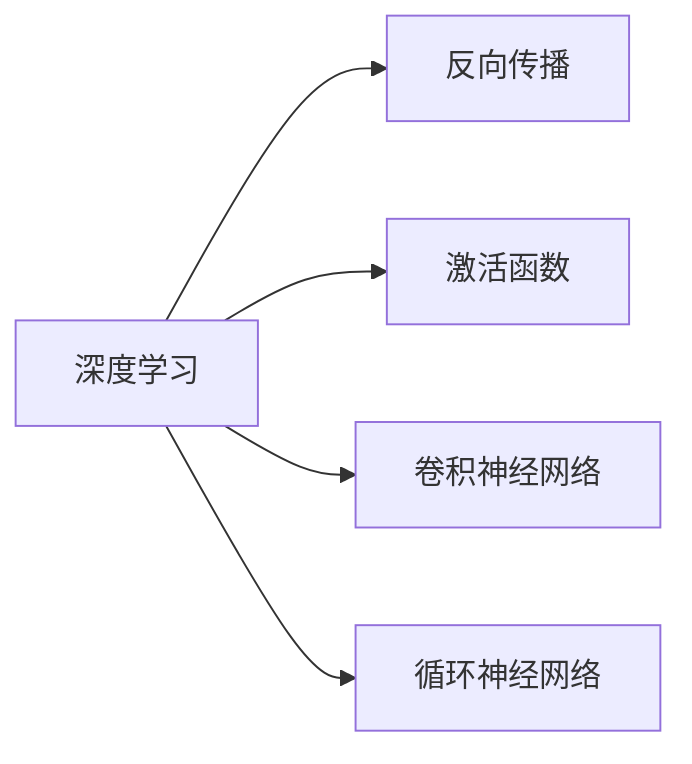
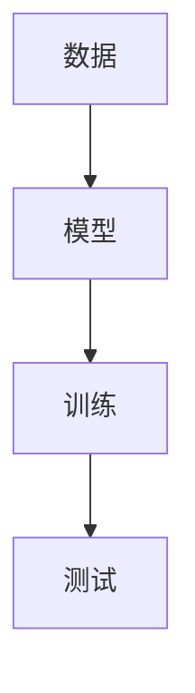
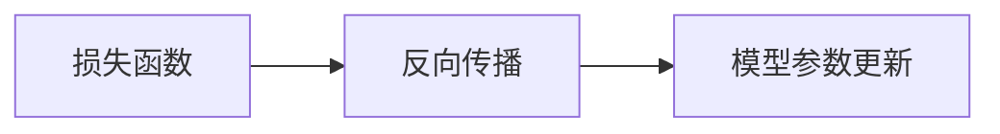
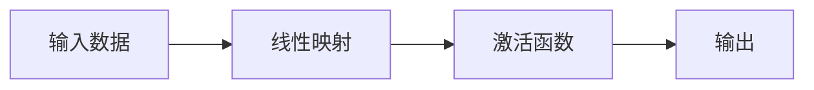
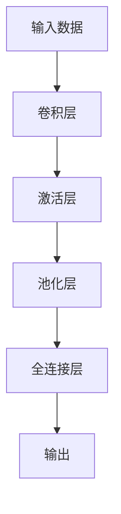
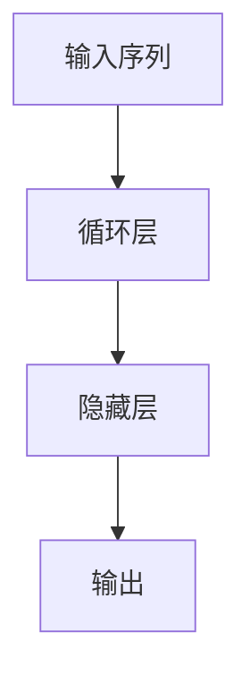
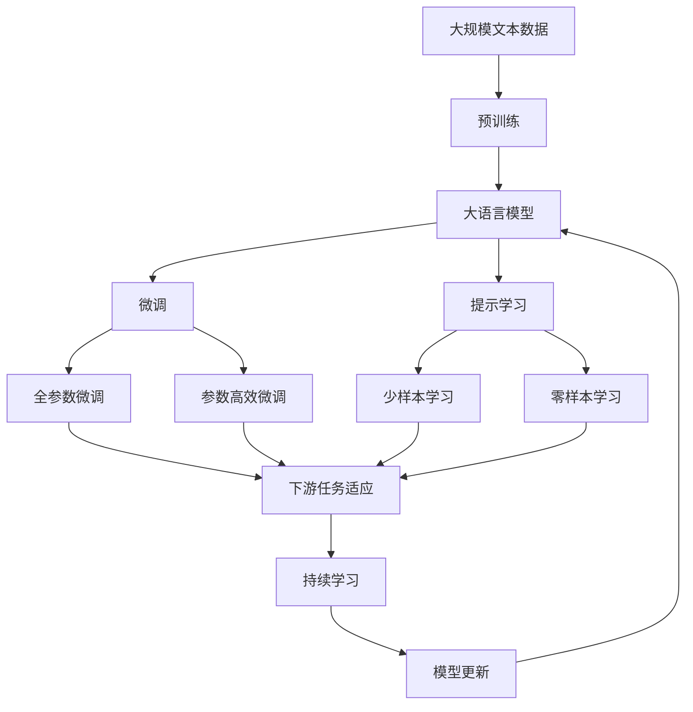

                 

# Hinton、LeCun、Bengio：AI算法的奠基者

> 关键词：
**Deep Learning, Neural Network, Backpropagation, Activation Function, Convolutional Neural Network, Recurrent Neural Network**

## 1. 背景介绍

### 1.1 问题由来

在人工智能（AI）的历史长河中，三位学者对深度学习（Deep Learning）的发展做出了开创性的贡献。他们分别是**Geoffrey Hinton**、**Yann LeCun**和**Yoshua Bengio**。他们的工作奠定了深度学习的基础，使得AI技术得以从符号计算向连接主义迈进，开启了现代机器学习的革命。

### 1.2 问题核心关键点

Hinton、LeCun和Bengio的主要贡献在于：

- **反向传播算法**（Backpropagation）：使深度学习成为可能。
- **卷积神经网络**（Convolutional Neural Network, CNN）：用于图像识别等视觉任务。
- **循环神经网络**（Recurrent Neural Network, RNN）：用于时间序列分析等序列任务。
- **激活函数**（Activation Function）：增加神经网络的表达能力。

这些贡献使得深度学习成为现代AI技术的核心，极大地推动了机器视觉、自然语言处理、语音识别、推荐系统等领域的进展。

### 1.3 问题研究意义

理解Hinton、LeCun和Bengio的工作，不仅有助于我们掌握深度学习的核心算法，还能深刻理解AI技术的演变脉络。此外，他们的研究也为未来的AI发展指明了方向，如模型可解释性、公平性和普适性等。

## 2. 核心概念与联系

### 2.1 核心概念概述

为了更好地理解Hinton、LeCun和Bengio的贡献，本节将介绍几个密切相关的核心概念：

- **深度学习**：一种基于多层神经网络的机器学习方法，通过反向传播算法优化模型参数，使得网络能够学习到数据的复杂表示。
- **反向传播**：一种计算图上的算法，用于计算损失函数对神经网络参数的梯度，从而实现模型参数的优化。
- **激活函数**：一种非线性映射，用于增加神经网络的非线性表达能力。
- **卷积神经网络**：一种特殊的神经网络，用于处理网格状的输入数据，如图像和视频。
- **循环神经网络**：一种特殊的神经网络，用于处理序列数据，如文本和时间序列。

这些概念之间的逻辑关系可以通过以下Mermaid流程图来展示：



这个流程图展示了大语言模型微调过程中各个核心概念的关系和作用。

### 2.2 概念间的关系

这些核心概念之间存在着紧密的联系，形成了深度学习的基础框架。下面通过几个Mermaid流程图来展示这些概念之间的关系。

#### 2.2.1 深度学习的核心流程



这个流程图展示了深度学习的核心流程：数据的输入、模型的训练和测试。

#### 2.2.2 反向传播与模型优化



这个流程图展示了反向传播的计算过程，即通过计算损失函数对模型参数的梯度，实现参数的优化。

#### 2.2.3 激活函数与非线性映射



这个流程图展示了激活函数的作用，即将线性映射输出映射到非线性空间，增加模型的表达能力。

#### 2.2.4 卷积神经网络的结构



这个流程图展示了卷积神经网络的基本结构，即卷积层、激活层和池化层，最后通过全连接层输出。

#### 2.2.5 循环神经网络的结构



这个流程图展示了循环神经网络的基本结构，即循环层和隐藏层，用于处理序列数据。

### 2.3 核心概念的整体架构

最后，我们用一个综合的流程图来展示这些核心概念在大语言模型微调过程中的整体架构：



这个综合流程图展示了从预训练到微调，再到持续学习的完整过程。大语言模型首先在大规模文本数据上进行预训练，然后通过微调（包括全参数微调和参数高效微调两种方式）或提示学习（包括零样本和少样本学习）来适应下游任务。最后，通过持续学习技术，模型可以不断更新和适应新的任务和数据。

## 3. 核心算法原理 & 具体操作步骤
### 3.1 算法原理概述

深度学习是一种基于多层神经网络的机器学习方法，通过反向传播算法优化模型参数，使得网络能够学习到数据的复杂表示。具体来说，深度学习模型由多个神经网络层组成，每个层都有多个神经元，每个神经元都有多个输入和一个输出。

反向传播算法是深度学习中最重要的算法之一，用于计算损失函数对模型参数的梯度。反向传播的核心思想是将损失函数对输出层的误差，通过链式法则逐步传递到每一层，从而计算出每一层的误差，并更新模型参数。

激活函数是深度学习中的重要组成部分，用于增加神经网络的非线性表达能力。常见的激活函数包括Sigmoid、ReLU、Tanh等。激活函数的作用是将神经元的输出映射到非线性空间，增加模型的表达能力。

卷积神经网络（CNN）和循环神经网络（RNN）是深度学习中的两个重要模型。CNN主要用于图像识别等视觉任务，通过卷积操作提取图像的局部特征，然后通过池化操作减少特征维度，最后通过全连接层输出结果。RNN主要用于时间序列分析等序列任务，通过循环层逐个处理序列中的每个元素，最后通过全连接层输出结果。

### 3.2 算法步骤详解

深度学习模型的训练一般包括以下几个步骤：

1. **准备数据**：将原始数据集划分为训练集、验证集和测试集，并对数据进行预处理，如归一化、标准化等。

2. **定义模型**：选择合适的深度学习模型，如卷积神经网络（CNN）、循环神经网络（RNN）等，并定义模型的结构和参数。

3. **定义损失函数**：根据任务特点，选择合适的损失函数，如均方误差（MSE）、交叉熵（Cross-Entropy）等。

4. **定义优化器**：选择合适的优化器，如随机梯度下降（SGD）、Adam等，并设置优化器的超参数。

5. **训练模型**：在训练集上使用优化器逐步更新模型参数，最小化损失函数。

6. **评估模型**：在验证集和测试集上评估模型的性能，并进行超参数调优。

7. **测试模型**：在测试集上评估模型的最终性能，判断模型是否满足实际应用需求。

### 3.3 算法优缺点

深度学习模型具有以下优点：

- **表达能力强**：通过多层神经网络，深度学习模型可以学习到复杂的数据表示，适用于处理复杂的数据结构。
- **可训练性强**：通过反向传播算法，深度学习模型可以优化模型参数，提高模型的准确性和泛化能力。
- **应用广泛**：深度学习模型已经广泛应用于计算机视觉、自然语言处理、语音识别等领域，取得了显著的成果。

然而，深度学习模型也存在以下缺点：

- **计算资源消耗大**：深度学习模型需要大量的计算资源，包括高性能的GPU和TPU等。
- **参数量庞大**：深度学习模型的参数量通常很大，训练和推理过程需要大量的时间和内存。
- **可解释性差**：深度学习模型通常是黑盒系统，难以解释其内部工作机制和决策逻辑。

### 3.4 算法应用领域

深度学习模型已经在多个领域得到了广泛的应用，例如：

- **计算机视觉**：如图像分类、目标检测、图像分割等。通过卷积神经网络（CNN），深度学习模型能够处理图像和视频等高维数据。

- **自然语言处理**：如文本分类、机器翻译、问答系统等。通过循环神经网络（RNN）和Transformer等模型，深度学习模型能够处理文本序列数据。

- **语音识别**：如语音转文本、语音合成等。通过循环神经网络（RNN）和卷积神经网络（CNN），深度学习模型能够处理时间序列数据。

- **推荐系统**：如个性化推荐、广告推荐等。通过深度学习模型，推荐系统能够根据用户的历史行为和兴趣，推荐个性化的商品和服务。

- **游戏AI**：如AlphaGo、Dota 2 AI等。通过深度学习模型，AI系统能够在复杂的游戏中表现出超越人类的水平。

## 4. 数学模型和公式 & 详细讲解 & 举例说明

### 4.1 数学模型构建

假设深度学习模型的输入为$x$，输出为$y$，模型的损失函数为$\mathcal{L}$，模型参数为$\theta$，则深度学习模型的训练目标是最小化损失函数$\mathcal{L}$。

具体来说，深度学习模型的训练过程如下：

1. 准备数据：将原始数据集划分为训练集、验证集和测试集。

2. 定义模型：选择合适的深度学习模型，如卷积神经网络（CNN）、循环神经网络（RNN）等，并定义模型的结构和参数。

3. 定义损失函数：根据任务特点，选择合适的损失函数，如均方误差（MSE）、交叉熵（Cross-Entropy）等。

4. 定义优化器：选择合适的优化器，如随机梯度下降（SGD）、Adam等，并设置优化器的超参数。

5. 训练模型：在训练集上使用优化器逐步更新模型参数，最小化损失函数。

6. 评估模型：在验证集和测试集上评估模型的性能，并进行超参数调优。

7. 测试模型：在测试集上评估模型的最终性能，判断模型是否满足实际应用需求。

### 4.2 公式推导过程

以CNN为例，CNN的反向传播算法如下：

1. 前向传播：
   $$
   y = \sigma(z) = \sigma(W \cdot x + b)
   $$
   其中$\sigma$为激活函数，$W$为权重矩阵，$b$为偏置向量。

2. 计算损失函数对输出层的误差：
   $$
   \frac{\partial \mathcal{L}}{\partial y} = -\frac{\partial \mathcal{L}}{\partial z}
   $$

3. 通过链式法则计算损失函数对权重矩阵$W$和偏置向量$b$的梯度：
   $$
   \frac{\partial \mathcal{L}}{\partial W} = \frac{\partial \mathcal{L}}{\partial z} \cdot \frac{\partial z}{\partial W} = \frac{\partial \mathcal{L}}{\partial y} \cdot \frac{\partial y}{\partial z} \cdot \frac{\partial z}{\partial W}
   $$

4. 更新权重矩阵$W$和偏置向量$b$：
   $$
   W \leftarrow W - \eta \frac{\partial \mathcal{L}}{\partial W}, b \leftarrow b - \eta \frac{\partial \mathcal{L}}{\partial b}
   $$

其中$\eta$为学习率，$\partial \mathcal{L}/\partial W$和$\partial \mathcal{L}/\partial b$分别为损失函数对权重矩阵$W$和偏置向量$b$的梯度。

### 4.3 案例分析与讲解

以ImageNet分类任务为例，使用CNN模型进行训练。假设输入数据为$x$，输出标签为$y$，模型的损失函数为均方误差（MSE），模型参数为$\theta$。

1. 前向传播：
   $$
   y = \sigma(z) = \sigma(W \cdot x + b)
   $$

2. 计算损失函数对输出层的误差：
   $$
   \frac{\partial \mathcal{L}}{\partial y} = \frac{1}{2} (y - \hat{y})^2
   $$

3. 通过链式法则计算损失函数对权重矩阵$W$和偏置向量$b$的梯度：
   $$
   \frac{\partial \mathcal{L}}{\partial W} = \frac{\partial \mathcal{L}}{\partial y} \cdot \frac{\partial y}{\partial z} \cdot \frac{\partial z}{\partial W}
   $$

4. 更新权重矩阵$W$和偏置向量$b$：
   $$
   W \leftarrow W - \eta \frac{\partial \mathcal{L}}{\partial W}, b \leftarrow b - \eta \frac{\partial \mathcal{L}}{\partial b}
   $$

通过以上步骤，CNN模型可以逐步更新参数，使得模型能够更好地拟合训练数据，提高分类精度。

## 5. 项目实践：代码实例和详细解释说明

### 5.1 开发环境搭建

在进行深度学习模型训练前，我们需要准备好开发环境。以下是使用Python进行PyTorch开发的环境配置流程：

1. 安装Anaconda：从官网下载并安装Anaconda，用于创建独立的Python环境。

2. 创建并激活虚拟环境：
```bash
conda create -n pytorch-env python=3.8 
conda activate pytorch-env
```

3. 安装PyTorch：根据CUDA版本，从官网获取对应的安装命令。例如：
```bash
conda install pytorch torchvision torchaudio cudatoolkit=11.1 -c pytorch -c conda-forge
```

4. 安装TensorFlow：如果需要使用TensorFlow，可以使用以下命令：
```bash
conda install tensorflow -c pytorch -c conda-forge
```

5. 安装各类工具包：
```bash
pip install numpy pandas scikit-learn matplotlib tqdm jupyter notebook ipython
```

完成上述步骤后，即可在`pytorch-env`环境中开始深度学习模型的训练。

### 5.2 源代码详细实现

以下是使用PyTorch进行卷积神经网络（CNN）模型训练的代码实现。

```python
import torch
import torch.nn as nn
import torch.optim as optim
import torchvision
import torchvision.transforms as transforms

# 定义卷积神经网络模型
class CNN(nn.Module):
    def __init__(self):
        super(CNN, self).__init__()
        self.conv1 = nn.Conv2d(3, 32, kernel_size=3, stride=1, padding=1)
        self.pool = nn.MaxPool2d(kernel_size=2, stride=2)
        self.conv2 = nn.Conv2d(32, 64, kernel_size=3, stride=1, padding=1)
        self.fc1 = nn.Linear(64 * 28 * 28, 128)
        self.fc2 = nn.Linear(128, 10)

    def forward(self, x):
        x = nn.functional.relu(self.conv1(x))
        x = self.pool(x)
        x = nn.functional.relu(self.conv2(x))
        x = self.pool(x)
        x = x.view(-1, 64 * 28 * 28)
        x = nn.functional.relu(self.fc1(x))
        x = self.fc2(x)
        return x

# 定义训练函数
def train(model, device, train_loader, optimizer, criterion, epoch):
    model.train()
    for batch_idx, (data, target) in enumerate(train_loader):
        data, target = data.to(device), target.to(device)
        optimizer.zero_grad()
        output = model(data)
        loss = criterion(output, target)
        loss.backward()
        optimizer.step()

# 定义测试函数
def test(model, device, test_loader, criterion):
    model.eval()
    test_loss = 0
    correct = 0
    with torch.no_grad():
        for data, target in test_loader:
            data, target = data.to(device), target.to(device)
            output = model(data)
            test_loss += criterion(output, target).item()
            pred = output.argmax(dim=1, keepdim=True)
            correct += pred.eq(target.view_as(pred)).sum().item()

    test_loss /= len(test_loader.dataset)
    print('Test set: Average loss: {:.4f}, Accuracy: {}/{} ({:.0f}%)\n'.format(
        test_loss, correct, len(test_loader.dataset),
        100. * correct / len(test_loader.dataset)))

# 训练模型
model = CNN().to(device)
optimizer = optim.SGD(model.parameters(), lr=0.001, momentum=0.9)
criterion = nn.CrossEntropyLoss()

train_loader = torchvision.datasets.CIFAR10(root='./data', train=True,
                                           transform=transforms.ToTensor(),
                                           download=True,
                                           batch_size=64)
test_loader = torchvision.datasets.CIFAR10(root='./data', train=False,
                                          transform=transforms.ToTensor())

for epoch in range(10):
    train(model, device, train_loader, optimizer, criterion, epoch)
    test(model, device, test_loader, criterion)
```

这个代码实现了一个简单的卷积神经网络模型，并使用CIFAR-10数据集进行了训练和测试。

### 5.3 代码解读与分析

以下是关键代码的实现细节：

**CNN类**：
- `__init__`方法：初始化CNN模型，定义卷积层、池化层和全连接层。
- `forward`方法：定义模型的前向传播过程。

**train函数**：
- 在每个epoch中，遍历训练集，前向传播计算输出，计算损失函数并反向传播更新模型参数。

**test函数**：
- 在测试集上计算模型输出与真实标签之间的交叉熵损失，并输出模型在测试集上的准确率。

**训练流程**：
- 定义模型、优化器和损失函数，构建数据加载器。
- 循环训练10个epoch，在每个epoch后输出测试集上的准确率和损失函数。

这个代码实现展示了深度学习模型的基本流程，从模型定义到训练和测试，代码结构清晰，易于理解。

## 6. 实际应用场景

### 6.1 智能推荐系统

基于深度学习模型的推荐系统已经广泛应用于电商、社交网络等领域。通过深度学习模型，推荐系统能够根据用户的历史行为和兴趣，推荐个性化的商品和服务，极大地提高了用户体验和销售额。

在技术实现上，可以收集用户浏览、点击、购买等行为数据，提取和用户交互的物品特征，如图片、标题、标签等。使用深度学习模型，从物品特征中学习用户兴趣，生成推荐列表，并在用户浏览行为中实时更新模型参数，实现个性化推荐。

### 6.2 自动驾驶

深度学习模型在自动驾驶领域也得到了广泛应用。通过深度学习模型，自动驾驶系统能够实时感知环境信息，如道路、交通标志、行人等，并做出相应的驾驶决策。

在技术实现上，可以部署深度学习模型，实时处理摄像头、雷达等传感器采集的环境数据，提取道路、交通标志、行人等特征，并进行分类、检测、跟踪等任务。同时，通过强化学习技术，使自动驾驶系统能够根据实时环境动态调整驾驶策略，确保行车安全。

### 6.3 医疗影像分析

深度学习模型在医疗影像分析领域也取得了显著的成果。通过深度学习模型，能够对医疗影像进行自动化分析和诊断，如肿瘤检测、病灶分割、影像增强等。

在技术实现上，可以收集大量的医疗影像数据，并对其进行标注，如肿瘤的位置、大小、形状等。使用深度学习模型，从影像中学习肿瘤的特征，并进行分类、检测、分割等任务。同时，通过迁移学习技术，将大模型的通用知识迁移到具体的医疗影像分析任务中，提升模型的准确性和泛化能力。

## 7. 工具和资源推荐

### 7.1 学习资源推荐

为了帮助开发者系统掌握深度学习理论基础和实践技巧，这里推荐一些优质的学习资源：

1. 《深度学习》系列书籍：由Ian Goodfellow、Yoshua Bengio和Aaron Courville合著，深入浅出地介绍了深度学习的基本概念和经典模型。

2. CS231n《卷积神经网络》课程：斯坦福大学开设的计算机视觉课程，涵盖卷积神经网络的基本原理和实现细节，是学习深度学习的重要资源。

3. CS224n《自然语言处理》课程：斯坦福大学开设的NLP课程，涵盖自然语言处理的基本概念和经典模型，是学习深度学习的重要资源。

4. 深度学习框架文档：如PyTorch、TensorFlow等深度学习框架的官方文档，提供了丰富的教程、样例和API文档，是学习深度学习的重要资源。

5. 深度学习社区：如Kaggle、GitHub等社区平台，汇聚了大量的深度学习论文、代码和数据集，是学习深度学习的重要资源。

### 7.2 开发工具推荐

高效的开发离不开优秀的工具支持。以下是几款用于深度学习开发的常用工具：

1. PyTorch：基于Python的开源深度学习框架，灵活动态的计算图，适合快速迭代研究。

2. TensorFlow：由Google主导开发的开源深度学习框架，生产部署方便，适合大规模工程应用。

3. Keras：高层次的深度学习框架，易于使用，适合快速原型开发。

4. Jupyter Notebook：交互式的编程环境，支持Python、R等多种语言，适合进行数据处理、模型训练和结果展示。

5. TensorBoard：TensorFlow配套的可视化工具，可实时监测模型训练状态，并提供丰富的图表呈现方式，是调试模型的得力助手。

6. Weights & Biases：模型训练的实验跟踪工具，可以记录和可视化模型训练过程中的各项指标，方便对比和调优。

7. GitHub：代码托管平台，支持版本控制和协作开发，适合进行模型代码的管理和分享。

### 7.3 相关论文推荐

深度学习模型的发展源于学界的持续研究。以下是几篇奠基性的相关论文，推荐阅读：

1. Deep Blue Book（Ian Goodfellow、Yoshua Bengio、Aaron Courville）：深度学习领域的经典教材，详细介绍了深度学习的基本概念和算法。

2. AlexNet：提出AlexNet模型，使用多层卷积神经网络进行图像分类，刷新了ImageNet比赛的SOTA。

3. RNNs、LSTMs、GRUs：提出循环神经网络（RNN）、长短期记忆网络（LSTM）和门控循环单元（GRU）等模型，用于处理时间序列数据。

4. Attention is All You Need（Vaswani等）：提出Transformer模型，使用自注意力机制进行序列建模，刷新了机器翻译任务的SOTA。

5. ResNet：提出残差网络（ResNet），通过残差连接解决深度神经网络训练中的梯度消失问题。

6. GANs：提出生成对抗网络（GANs），用于生成高质量的图像、视频、音频等数据。

## 8. 总结：未来发展趋势与挑战

### 8.1 研究成果总结

Hinton、LeCun和Bengio的工作奠定了深度学习的基础，使得AI技术得以从符号计算向连接主义迈进，开启了现代机器学习的革命。他们的研究成果不仅在学术界引起了广泛关注，还推动了深度学习在各个领域的应用和发展。

### 8.2 未来发展趋势

展望未来，深度学习技术将继续快速发展，推动AI技术的进一步突破：

1. **模型规模不断增大**：随着算力成本的下降和数据规模的扩张，深度学习模型的参数量将不断增大，以应对更加复杂的任务。

2. **模型效率不断提升**：通过模型压缩、量化加速等技术，深度学习模型的推理速度和资源占用将不断优化，实现更高效的应用。

3. **跨模态深度学习**：通过融合视觉、语音、文本等多模态数据，深度学习模型能够更好地理解和处理复杂的数据结构。

4. **深度强化学习**：结合深度学习和强化学习技术，深度学习模型能够更好地进行智能决策和优化。

5. **联邦学习**：通过在分布式环境下训练模型，深度学习模型能够保护用户隐私，实现多用户合作学习。

6. **迁移学习**：通过在多个任务之间共享模型知识，深度学习模型能够更好地适应新任务和数据分布变化。

7. **可解释性和公平性**：深度学习模型需要具备更好的可解释性和公平性，以应对道德、法律等方面的挑战。

### 8.3 面临的挑战

尽管深度学习技术已经取得了显著的成果，但在应用过程中仍然面临诸多挑战：

1. **数据需求**：深度学习模型通常需要大量的标注数据，而标注数据的获取和处理成本较高。

2. **计算资源**：深度学习模型的训练和推理需要大量的计算资源，如高性能的GPU和TPU等，

