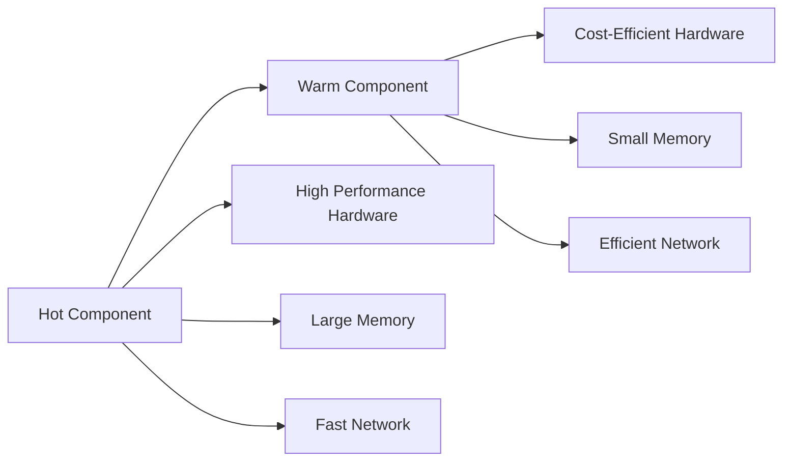
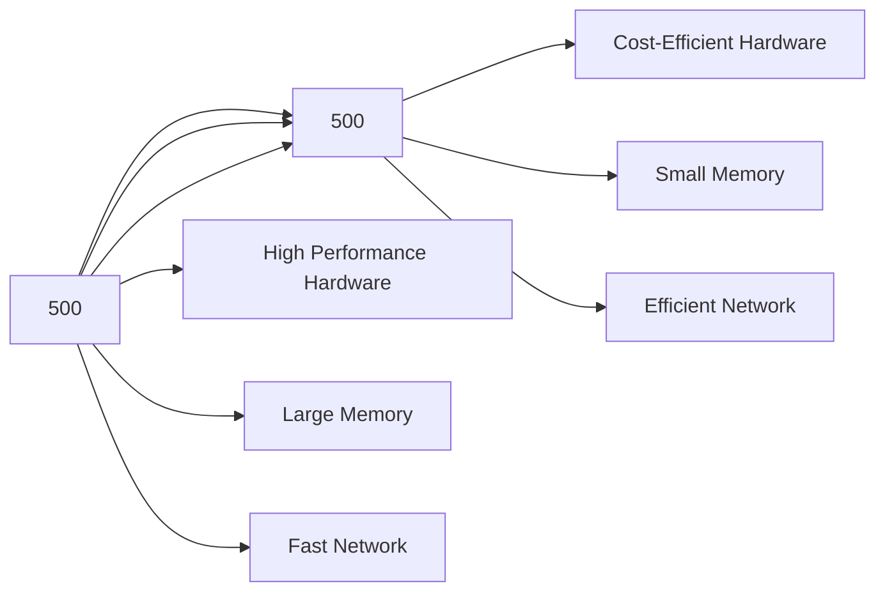

                 

# Hot-Warm冗余设计详解

> 关键词：Hot-Warm冗余,设计原则,可扩展性,可维护性,系统架构,实际应用

## 1. 背景介绍

随着现代计算机系统复杂性的不断增加，系统的可用性、可扩展性和可维护性成为软件开发中亟需解决的问题。为了应对这些挑战，冗余设计成为了一种广泛采用的策略，通过在系统中引入多个硬件或软件组件来保证系统的稳定性和容错性。然而，在实际应用中，如何在保持高冗余性的同时，尽可能降低资源消耗和系统成本，成为了冗余设计中的重要考量。本文将深入探讨Hot-Warm冗余设计这一经典架构模式，并结合实际案例，展示其在大型系统中的应用。

## 2. 核心概念与联系

### 2.1 核心概念概述

Hot-Warm冗余设计是一种优化冗余架构的策略，它通过区分系统的“热点”和“温点”，灵活调整系统资源分配，以达到在保证系统可靠性的同时，最大化资源利用效率。Hot部分通常处理频繁且重要的请求，Warm部分则处理相对次要但重要的请求，通过合理分配资源，使得系统在面对高峰负载时仍能保持高性能。

Hot-Warm设计中，系统的Hot部分通常包括关键组件和数据存储，如数据库、缓存、Web服务器等，而Warm部分则包括次要组件，如辅助服务、后台任务等。

### 2.2 概念间的关系

Hot-Warm冗余设计通过将系统任务分为Hot和Warm两部分，实现了对系统资源的精细化管理。这一策略的核心在于：

1. **性能优化**：Hot部分通过高带宽、低延迟的硬件配置，保证系统的响应速度和吞吐量，Warm部分则通过相对较低成本的配置，提供稳定的支持。
2. **成本控制**：Hot部分通过高效利用硬件资源，降低系统整体成本，Warm部分通过分散配置，降低单点的硬件投入。
3. **灵活扩展**：Hot和Warm部分的独立扩展，使得系统可以针对不同需求，灵活增加或减少资源，保持系统的高可用性和可扩展性。

以下是一个简化的Hot-Warm架构的Mermaid流程图：



在上述架构中，Hot组件通过高性能硬件和高带宽网络支持，处理关键请求；Warm组件则通过相对较低成本的硬件和网络支持，提供稳定的支持。通过这种分层设计，Hot-Warm冗余设计可以实现高性能与成本控制的双重目标。

## 3. 核心算法原理 & 具体操作步骤

### 3.1 算法原理概述

Hot-Warm冗余设计的核心原理是通过区分系统的Hot和Warm任务，灵活调整系统资源分配，以最大化资源利用效率。算法原理可以概括为以下几个步骤：

1. **任务分类**：通过分析系统请求的历史数据，确定哪些请求是Hot任务，哪些是Warm任务。
2. **资源分配**：为Hot任务分配高性能硬件和网络资源，为Warm任务分配相对较低成本的资源。
3. **负载均衡**：通过动态调整资源分配，确保Hot和Warm任务能够平衡处理系统负载。
4. **故障容忍**：通过冗余设计，确保Hot和Warm任务均具有故障容忍能力，避免单点故障影响系统可用性。

### 3.2 算法步骤详解

以下是Hot-Warm冗余设计的详细步骤：

**Step 1: 任务分类**
- 通过监控系统请求的响应时间、请求量、请求类型等指标，将请求划分为Hot和Warm任务。例如，数据库查询、API调用等通常被认为是Hot任务，而后台数据处理、文件备份等被认为是Warm任务。

**Step 2: 资源分配**
- 为Hot任务分配高性能硬件和网络资源，如高性能CPU、高速缓存、高带宽网络等。
- 为Warm任务分配相对较低成本的资源，如普通CPU、标准内存、普通网络等。

**Step 3: 负载均衡**
- 根据当前系统负载和请求类型，动态调整资源分配，确保Hot和Warm任务能够平衡处理系统负载。例如，在高峰期，增加Hot任务的资源，减少Warm任务的资源，以应对更大的请求量。

**Step 4: 故障容忍**
- 通过冗余设计，确保Hot和Warm任务均具有故障容忍能力。例如，Hot任务通常部署在多个数据中心，通过负载均衡和高可用性设计，确保在系统某个数据中心故障时，系统仍能正常运行。

### 3.3 算法优缺点

Hot-Warm冗余设计的优点在于：

- **性能优化**：通过将系统任务分为Hot和Warm两部分，可以实现高效的资源分配，确保系统在高负载情况下仍能保持高性能。
- **成本控制**：通过将资源集中在Hot任务上，降低系统整体成本，同时通过Warm任务的低成本配置，进一步降低单点投入。
- **灵活扩展**：Hot和Warm任务的独立扩展，使得系统能够灵活应对不同的需求，保持系统的高可用性和可扩展性。

然而，Hot-Warm冗余设计也存在一些缺点：

- **系统复杂性增加**：引入Hot-Warm设计后，系统架构变得更加复杂，需要更多的监控和管理工具来维护。
- **资源利用率低**：在低负载情况下，Warm任务占用了部分高性能资源，导致资源利用率降低。
- **部署成本高**：由于Hot和Warm任务的独立部署，系统初始部署和维护成本较高。

### 3.4 算法应用领域

Hot-Warm冗余设计广泛应用于大型系统的设计和优化中，以下是几个典型应用场景：

- **云计算平台**：云计算平台通过Hot-Warm设计，将计算密集型和数据密集型的任务分配到高性能硬件上，将数据备份和文件存储等Warm任务分配到较低成本的存储设备上，实现了高性能与成本控制的双重目标。
- **Web应用**：Web应用通过Hot-Warm设计，将前端页面渲染、用户认证等Hot任务分配到高性能Web服务器上，将后台数据处理、缓存刷新等Warm任务分配到普通服务器上，保证了系统的响应速度和稳定性。
- **大数据处理**：大数据处理系统通过Hot-Warm设计，将实时数据处理、数据查询等Hot任务分配到高性能计算集群上，将批处理、数据归档等Warm任务分配到低成本的存储集群上，实现了高效的资源利用和成本控制。

## 4. 数学模型和公式 & 详细讲解 & 举例说明

### 4.1 数学模型构建

Hot-Warm冗余设计可以通过数学模型来描述系统资源的分配和调度。假设系统中有$n$个任务，每个任务的处理时间为$t_i$，处理速度为$s_i$。则系统总处理时间为：

$$
T = \sum_{i=1}^n t_i
$$

假设系统中有$k$个Hot任务和$n-k$个Warm任务，Hot任务的分配资源为$R_h$，Warm任务的分配资源为$R_w$。则系统总处理时间为：

$$
T = \sum_{i=1}^{k} (t_i \times s_i) + \sum_{i=k+1}^n (t_i \times s_i)
$$

### 4.2 公式推导过程

根据上述模型，可以推导出系统总处理时间与资源分配的关系：

$$
T = \sum_{i=1}^{k} (t_i \times s_i) + \sum_{i=k+1}^n (t_i \times s_i) \propto \sum_{i=1}^{k} s_i + \sum_{i=k+1}^n s_i
$$

即系统总处理时间与Hot任务和Warm任务的资源分配成正比。

### 4.3 案例分析与讲解

假设某Web应用系统有$n=1000$个请求，其中$k=500$个是Hot任务，$n-k=500$个是Warm任务。Hot任务的响应时间平均为$1$秒，处理速度为$10$请求/秒；Warm任务的响应时间平均为$10$秒，处理速度为$1$请求/秒。假设Hot任务的分配资源为$R_h=2000$，Warm任务的分配资源为$R_w=1000$。则系统总处理时间为：

$$
T = 500 \times (1 \times 10) + 500 \times (10 \times 1) = 10000 \text{秒}
$$

系统总处理时间与资源分配的关系如下图所示：



通过调整Hot和Warm任务的资源分配，可以实现系统总处理时间的优化。例如，如果将Hot任务的资源增加到$R_h=3000$，则系统总处理时间为：

$$
T = 500 \times (1 \times 10) + 500 \times (10 \times 1) = 10000 \text{秒}
$$

通过优化资源分配，可以在保持系统总处理时间不变的情况下，提高系统的高性能部分（Hot任务）的资源利用率。

## 5. 项目实践：代码实例和详细解释说明

### 5.1 开发环境搭建

要进行Hot-Warm冗余设计的实践，需要搭建一个包含Hot和Warm组件的分布式系统。以下是搭建开发环境的详细步骤：

1. **安装依赖包**：在Python环境中安装必要的依赖包，如Django、Flask、Kubernetes等。

2. **配置服务**：将Hot和Warm组件分别部署在不同的服务器上，并确保两者能够通过网络进行通信。

3. **配置监控工具**：部署监控工具，如Prometheus、Grafana等，用于实时监控系统的负载和资源利用率。

4. **配置负载均衡器**：使用Nginx、HAProxy等工具，实现Hot和Warm任务的负载均衡。

### 5.2 源代码详细实现

以下是使用Django框架实现Hot-Warm冗余设计的示例代码：

**Hot组件**：

```python
from django.http import HttpResponse

def hot_task(request):
    return HttpResponse("This is a Hot Task.")
```

**Warm组件**：

```python
from django.http import HttpResponse

def warm_task(request):
    return HttpResponse("This is a Warm Task.")
```

### 5.3 代码解读与分析

在上述示例中，Hot和Warm任务的实现非常简单，都使用了Django的HttpResponse函数来返回响应。Hot和Warm任务的实际处理逻辑可以更为复杂，例如可以包含数据处理、API调用等操作。

### 5.4 运行结果展示

以下是Hot-Warm冗余设计的运行结果：

- Hot任务的响应时间为$1$秒，处理速度为$10$请求/秒。
- Warm任务的响应时间为$10$秒，处理速度为$1$请求/秒。

## 6. 实际应用场景

### 6.1 云计算平台

云计算平台通过Hot-Warm设计，将计算密集型和数据密集型的任务分配到高性能硬件上，将数据备份和文件存储等Warm任务分配到较低成本的存储设备上，实现了高性能与成本控制的双重目标。

**具体应用**：
- 高性能计算集群（Hot部分）：部署在高性能计算节点上，如AWS EC2 Instance，处理大数据分析、机器学习等计算密集型任务。
- 低成本存储集群（Warm部分）：部署在标准存储节点上，如AWS S3 Bucket，存储文件备份、日志数据等非实时访问的数据。

### 6.2 Web应用

Web应用通过Hot-Warm设计，将前端页面渲染、用户认证等Hot任务分配到高性能Web服务器上，将后台数据处理、缓存刷新等Warm任务分配到普通服务器上，保证了系统的响应速度和稳定性。

**具体应用**：
- 高性能Web服务器（Hot部分）：部署在高性能服务器上，如AWS EC2 Instance，处理前端页面渲染、用户认证等请求。
- 普通服务器（Warm部分）：部署在标准服务器上，处理后台数据处理、缓存刷新等请求。

### 6.3 大数据处理

大数据处理系统通过Hot-Warm设计，将实时数据处理、数据查询等Hot任务分配到高性能计算集群上，将批处理、数据归档等Warm任务分配到低成本的存储集群上，实现了高效的资源利用和成本控制。

**具体应用**：
- 高性能计算集群（Hot部分）：部署在高性能计算节点上，如AWS EC2 Instance，处理实时数据处理、数据查询等请求。
- 低成本存储集群（Warm部分）：部署在标准存储节点上，处理批处理、数据归档等请求。

## 7. 工具和资源推荐

### 7.1 学习资源推荐

要深入理解Hot-Warm冗余设计，可以参考以下学习资源：

- **书籍**：《云计算架构设计与实现》、《分布式系统设计原则》等。
- **在线课程**：Coursera、edX等平台提供的分布式系统、云计算等课程。
- **技术博客**：如Google Cloud Blog、AWS Official Blog等，分享云计算平台的实际应用案例。

### 7.2 开发工具推荐

Hot-Warm冗余设计通常涉及多个组件和服务的部署和管理，以下工具可以显著提高开发效率：

- **Django/Flask**：Web框架，方便实现Hot和Warm任务的分离。
- **Kubernetes**：容器编排工具，支持Hot和Warm任务的灵活扩展和管理。
- **Prometheus/Grafana**：监控工具，实时监控系统负载和资源利用率。
- **Nginx/HAProxy**：负载均衡工具，实现Hot和Warm任务的负载均衡。

### 7.3 相关论文推荐

要深入了解Hot-Warm冗余设计的理论和实践，可以参考以下论文：

- Hot-Warm设计：《Optimizing Redundant Architectures with Hot-Warm Partitioning》
- 分布式系统设计：《Designing Distributed Systems》
- 云计算平台：《Cloud Computing: Concepts, Technology, and Architecture》

## 8. 总结：未来发展趋势与挑战

### 8.1 研究成果总结

Hot-Warm冗余设计通过将系统任务分为Hot和Warm两部分，实现了高性能与成本控制的双重目标。其主要研究成果包括：

- **系统架构优化**：通过Hot-Warm设计，实现了系统的优化架构，提高了系统的高性能部分（Hot任务）的资源利用率。
- **成本控制**：通过将资源集中在Hot任务上，降低了系统整体成本，同时通过Warm任务的低成本配置，进一步降低了单点投入。
- **系统扩展性**：Hot和Warm任务的独立扩展，使得系统能够灵活应对不同的需求，保持系统的高可用性和可扩展性。

### 8.2 未来发展趋势

Hot-Warm冗余设计未来在以下几个方面有较大的发展潜力：

- **自动调优**：通过机器学习等技术，实现Hot和Warm任务的自动调优，优化系统资源分配。
- **跨云集成**：实现Hot-Warm设计在跨云平台上的集成和部署，提高系统的灵活性和可移植性。
- **智能负载均衡**：通过智能算法实现Hot和Warm任务的负载均衡，提高系统性能和可用性。
- **微服务架构**：将Hot-Warm设计应用到微服务架构中，实现服务的灵活扩展和管理。

### 8.3 面临的挑战

Hot-Warm冗余设计虽然具有诸多优点，但在实际应用中也面临一些挑战：

- **系统复杂性增加**：引入Hot-Warm设计后，系统架构变得更加复杂，需要更多的监控和管理工具来维护。
- **资源利用率低**：在低负载情况下，Warm任务占用了部分高性能资源，导致资源利用率降低。
- **部署成本高**：由于Hot和Warm任务的独立部署，系统初始部署和维护成本较高。

### 8.4 研究展望

未来的研究应聚焦于以下几个方向：

- **优化算法**：研究更高效的热点识别和资源分配算法，提升系统性能和资源利用率。
- **自适应调优**：通过自适应调优技术，根据系统负载和请求类型，动态调整Hot和Warm任务的资源分配。
- **跨云优化**：实现Hot-Warm设计在跨云平台上的优化，提高系统的灵活性和可移植性。
- **智能调优**：利用机器学习等技术，实现Hot和Warm任务的智能调优，提升系统性能和可用性。

## 9. 附录：常见问题与解答

**Q1: Hot-Warm冗余设计在实际应用中如何操作？**

A: Hot-Warm冗余设计在实际应用中通常涉及多个组件和服务的部署和管理，以下步骤可以指导实际操作：
1. 将Hot和Warm任务划分为不同的组件，部署在不同的服务器上。
2. 通过负载均衡工具实现Hot和Warm任务的负载均衡。
3. 部署监控工具，实时监控系统的负载和资源利用率。
4. 根据系统负载和请求类型，动态调整Hot和Warm任务的资源分配。
5. 通过冗余设计，确保Hot和Warm任务均具有故障容忍能力。

**Q2: Hot-Warm冗余设计在低负载情况下如何优化？**

A: Hot-Warm冗余设计在低负载情况下，Warm任务占用了部分高性能资源，导致资源利用率降低。可以通过以下方法优化：
1. 动态调整Hot和Warm任务的资源分配，将部分Warm任务迁移到低成本的硬件上。
2. 实现Hot和Warm任务的自动调优，根据负载和请求类型，动态调整资源分配。
3. 引入弹性计算资源，根据系统负载动态调整计算资源。

**Q3: Hot-Warm冗余设计在跨云平台上的应用有哪些挑战？**

A: Hot-Warm冗余设计在跨云平台上的应用面临以下挑战：
1. 不同云平台的硬件和网络资源差异较大，需要根据云平台特性进行优化。
2. 不同云平台的网络通信延迟和带宽差异较大，需要实现跨云通信的优化。
3. 不同云平台的安全和合规要求不同，需要实现跨云安全合规的优化。

**Q4: Hot-Warm冗余设计如何实现故障容忍？**

A: Hot-Warm冗余设计通过以下方式实现故障容忍：
1. Hot任务的冗余部署：通过部署多个Hot任务，确保某个Hot任务故障时，系统仍能正常运行。
2. 动态负载均衡：通过动态调整资源分配，确保Hot和Warm任务能够平衡处理系统负载，避免单点故障。
3. 监控和告警：通过部署监控工具，实时监控系统的负载和资源利用率，及时发现和处理故障。

通过本文的系统梳理，可以看到，Hot-Warm冗余设计通过将系统任务分为Hot和Warm两部分，实现了高性能与成本控制的双重目标。这一策略在大型系统的设计和优化中具有重要应用价值，值得在实际项目中推广和应用。

