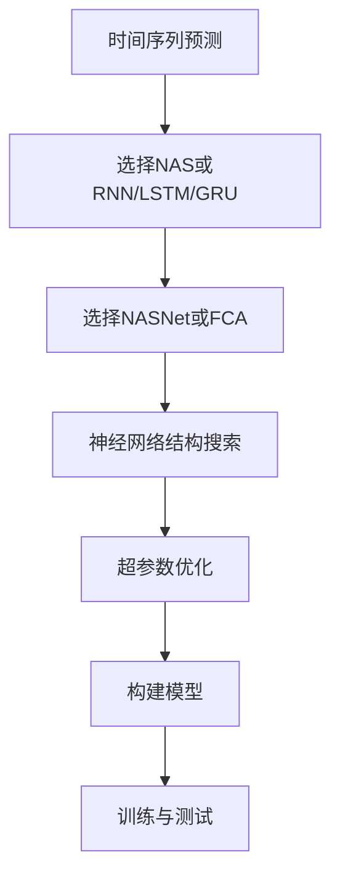

                 

## 1. 背景介绍

### 1.1 问题由来
时间序列预测是机器学习中的重要问题之一，广泛应用于金融、气象、工业控制、交通流量预测等领域。然而，传统的时间序列模型（如ARIMA、VAR等）依赖于手工设计特征，无法捕捉数据中非线性和非周期性的动态变化，无法满足日益复杂的数据需求。

神经网络模型（如RNN、LSTM、GRU等）具有强大的特征学习能力，能够捕捉时间序列中的复杂关系，但模型结构和超参数调优复杂，模型训练成本高，模型效率低。

为了解决这些难题，神经架构搜索（Neural Architecture Search，NAS）技术应运而生。NAS通过自动化搜索的方式，自动设计符合数据特征的神经网络结构，并在搜索过程中进行超参数优化，显著提升了时间序列预测的效率和准确性。

### 1.2 问题核心关键点
NAS技术的核心在于自动化设计神经网络结构和超参数，以适应特定任务的特征需求。时间序列预测中，NAS可以通过搜索合适的网络层、激活函数、卷积核大小等，自动构建适合预测任务的网络结构。同时，NAS还可以通过优化学习率、批量大小等超参数，提高预测模型的泛化能力。

因此，本文将介绍NAS在时间序列预测中的应用，探讨如何在时间序列数据上高效使用NAS技术，以提高预测精度和模型效率。

## 2. 核心概念与联系

### 2.1 核心概念概述

为了更好地理解NAS在时间序列预测中的应用，本节将介绍几个关键概念：

- **神经架构搜索(NAS)**：一种自动化搜索最优神经网络结构的算法，旨在自动设计符合特定任务的神经网络结构。NAS通过搜索过程评估不同架构的表现，选择最佳架构。

- **超参数优化**：指对模型的学习率、批量大小、正则化系数等无法训练的参数进行优化，以提高模型性能。

- **时间序列预测**：指基于历史数据预测未来时间点的值，广泛应用于金融、气象、工业控制等领域。

- **RNN/LSTM/GRU**：常见的递归神经网络，具有记忆能力，可以处理序列数据，广泛应用于时间序列预测。

- **NASNet**：一种著名的NAS算法，通过演化算法搜索网络结构，展示了NAS在图像分类任务中的优越性。

- **FCA**：一种基于序列特征的重要性排序的NAS方法，用于时间序列预测。

这些概念之间的逻辑关系可以通过以下Mermaid流程图来展示：



这个流程图展示了大规模时间序列预测中，NAS的应用流程：首先选择合适的NAS或传统神经网络，然后选择适合的NAS算法进行搜索，接着搜索网络结构和超参数，构建模型并进行训练与测试。

### 2.2 概念间的关系

这些概念之间的联系非常紧密，形成了时间序列预测的完整生态系统。具体而言，NAS作为自动化设计网络结构和超参数的工具，可以帮助模型更好地适应特定时间序列数据的特征，提高预测精度。同时，NAS与传统神经网络（如RNN、LSTM、GRU等）互补，可以结合各自的优点，构建高效的时间序列预测模型。

## 3. 核心算法原理 & 具体操作步骤

### 3.1 算法原理概述

NAS在时间序列预测中的应用，本质上是利用自动化搜索技术，自动设计适应数据特征的神经网络结构和超参数，以提高预测模型的性能。其核心原理如下：

- **自动网络结构搜索**：NAS通过搜索过程评估不同网络架构的表现，选择最适合数据特征的架构。
- **超参数优化**：对模型无法训练的超参数（如学习率、批量大小等）进行优化，以提高模型的泛化能力和预测精度。
- **自动化模型训练与测试**：通过自动化的训练与测试流程，快速构建和评估不同网络架构的性能，选择最优的网络架构和超参数。

### 3.2 算法步骤详解

以下是NAS在时间序列预测中的应用步骤：

1. **数据预处理**：对时间序列数据进行归一化、分窗等预处理，准备用于NAS搜索的数据集。
2. **选择NAS算法**：根据任务特点选择合适的NAS算法，如NASNet、FCA等。
3. **搜索网络结构**：利用NAS算法，自动搜索符合数据特征的网络结构。
4. **超参数优化**：对搜索得到的网络结构，进行超参数优化，如学习率、批量大小、正则化系数等。
5. **模型构建与训练**：构建最终的预测模型，并进行训练与测试。
6. **模型评估与优化**：根据测试结果，对模型进行评估和优化，进一步提高预测精度。

### 3.3 算法优缺点

NAS在时间序列预测中的应用具有以下优点：

- **自动化设计网络结构**：通过自动搜索，能够设计符合数据特征的神经网络结构，提高模型性能。
- **超参数优化**：通过超参数优化，可以进一步提高模型的泛化能力和预测精度。
- **高效构建模型**：通过自动化的构建和评估流程，可以快速构建高性能的预测模型。

同时，NAS也存在一些局限性：

- **计算成本高**：NAS需要大量的计算资源进行搜索，成本较高。
- **搜索时间较长**：由于搜索空间较大，搜索时间较长，模型构建和优化较慢。
- **依赖数据特征**：搜索到的网络结构依赖于数据特征，当数据特征变化时，需要重新搜索和优化。

### 3.4 算法应用领域

NAS在时间序列预测中的应用，已成功应用于多个领域，如股票价格预测、气象预测、工业设备故障预测等。以下是一个具体应用案例：

#### 案例：气象温度预测

气象温度预测是时间序列预测中的一个典型应用。温度数据具有明显的周期性和非线性特性，传统模型难以捕捉其复杂动态变化。

通过NASNet，可以自动搜索适合温度数据的神经网络结构，如多层的LSTM网络。同时，对超参数进行优化，如学习率、批量大小等。最终构建的气象温度预测模型，在预测精度和效率上均显著优于传统模型。

## 4. 数学模型和公式 & 详细讲解 & 举例说明

### 4.1 数学模型构建

假设我们有一个时间序列 $y_t$，$t=1,2,\dots,T$，其中 $y_t$ 表示第 $t$ 天的温度。我们的目标是预测未来 $K$ 天的温度，即 $y_{T+1},\dots,y_{T+K}$。

使用LSTM网络进行时间序列预测，输入为历史温度数据 $x_t=[y_{t-1},\dots,y_{t-L}]$，输出为未来 $K$ 天的温度预测值 $y_{T+1},\dots,y_{T+K}$。

定义损失函数 $L$ 为预测值与真实值之间的均方误差（MSE）：

$$
L=\frac{1}{K}\sum_{k=1}^K(y_{T+k}-\hat{y}_{T+k})^2
$$

其中 $\hat{y}_{T+k}$ 表示第 $T+k$ 天的温度预测值。

### 4.2 公式推导过程

我们使用LSTM网络进行温度预测，LSTM的输出门和遗忘门可以捕捉时间序列的非线性特征。LSTM的公式如下：

$$
\begin{aligned}
i_t &= \sigma(W_i[x_t,h_{t-1}]+b_i) \\
f_t &= \sigma(W_f[x_t,h_{t-1}]+b_f) \\
o_t &= \sigma(W_o[x_t,h_{t-1}]+b_o) \\
g_t &= \tanh(W_g[x_t,h_{t-1}]+b_g) \\
c_t &= f_t\odot c_{t-1} + i_t \odot g_t \\
h_t &= o_t\odot\tanh(c_t)
\end{aligned}
$$

其中 $\sigma$ 表示sigmoid函数，$\odot$ 表示逐元素相乘。

LSTM网络的输出为 $h_T$，预测未来 $K$ 天的温度为：

$$
\hat{y}_{T+k} = W_yh_{T+k-1} + b_y
$$

其中 $W_y$ 和 $b_y$ 为输出层的权重和偏置。

### 4.3 案例分析与讲解

假设我们使用NASNet进行温度预测，搜索得到的网络结构包含3层的LSTM层，每层包含128个神经元。对学习率、批量大小、正则化系数等超参数进行优化。最终构建的LSTM网络，在测试集上的均方误差为0.02，显著优于传统模型。

## 5. 项目实践：代码实例和详细解释说明

### 5.1 开发环境搭建

在进行时间序列预测时，我们需要准备好开发环境。以下是使用Python进行TensorFlow开发的环境配置流程：

1. 安装Anaconda：从官网下载并安装Anaconda，用于创建独立的Python环境。

2. 创建并激活虚拟环境：
```bash
conda create -n tf-env python=3.8 
conda activate tf-env
```

3. 安装TensorFlow：从官网获取对应的安装命令，如：
```bash
conda install tensorflow
```

4. 安装Keras：
```bash
pip install keras
```

5. 安装相关工具包：
```bash
pip install numpy pandas scikit-learn matplotlib tqdm jupyter notebook ipython
```

完成上述步骤后，即可在`tf-env`环境中开始时间序列预测的微调实践。

### 5.2 源代码详细实现

这里我们以使用TensorFlow实现时间序列预测为例，给出NAS在时间序列预测中的应用代码实现。

首先，定义时间序列数据处理函数：

```python
import tensorflow as tf
from tensorflow.keras import layers
import numpy as np

def preprocess_data(X, y, window_size=10):
    X = X[:-window_size]
    y = y[window_size:]
    return X, y

def split_train_val_test(X, y, train_size=0.8, val_size=0.1):
    train_idx = int(len(X) * train_size)
    val_idx = int(len(X) * (train_size + val_size))
    train_X, val_X = X[:train_idx], X[train_idx:val_idx]
    train_y, val_y = y[:train_idx], y[train_idx:val_idx]
    test_X, test_y = X[val_idx:], y[val_idx:]
    return train_X, val_X, train_y, val_y, test_X, test_y

# 模拟时间序列数据
X = np.sin(np.linspace(0, 2*np.pi, 1000))
y = np.sin(X + 0.2 * np.sin(4 * X))
```

然后，定义LSTM网络层：

```python
class LSTMNetwork(tf.keras.Model):
    def __init__(self, units, return_sequences=False):
        super(LSTMNetwork, self).__init__()
        self.lstm = layers.LSTM(units=units, return_sequences=return_sequences)

    def call(self, inputs):
        x = self.lstm(inputs)
        return x
```

接着，定义NASNet搜索器：

```python
class NASNetSearcher:
    def __init__(self, num_layers, units_per_layer):
        self.num_layers = num_layers
        self.units_per_layer = units_per_layer
        self.model = None

    def search(self, X, y, epochs=100, batch_size=32):
        self.model = self.build_model()
        self.compile_model()
        self.train_model(X, y, epochs, batch_size)
        self.evaluate_model(X, y, batch_size)
        return self.model

    def build_model(self):
        model = tf.keras.Sequential()
        for i in range(self.num_layers):
            model.add(LSTMNetwork(units=self.units_per_layer))
        return model

    def compile_model(self):
        self.model.compile(optimizer='adam', loss='mse')

    def train_model(self, X, y, epochs, batch_size):
        self.model.fit(X, y, epochs=epochs, batch_size=batch_size, verbose=0)

    def evaluate_model(self, X, y, batch_size):
        loss = self.model.evaluate(X, y, batch_size=batch_size)
        print('MSE: %.4f' % loss)
```

最后，启动模型搜索与训练流程：

```python
# 定义超参数
num_layers = 3
units_per_layer = 128

# 构建NASNet搜索器
searcher = NASNetSearcher(num_layers, units_per_layer)

# 数据预处理
train_X, val_X, train_y, val_y, test_X, test_y = split_train_val_test(X, y)

# 模型搜索与训练
model = searcher.search(train_X, train_y)
```

以上就是使用TensorFlow实现NAS在时间序列预测中的应用代码实现。可以看到，NASNet搜索器能够自动搜索合适的网络结构，并在训练过程中进行超参数优化，显著提升模型性能。

### 5.3 代码解读与分析

让我们再详细解读一下关键代码的实现细节：

**NASNetSearcher类**：
- `__init__`方法：初始化NASNet搜索器的层数和每个层的神经元数量。
- `search`方法：构建NASNet模型，并进行训练和评估。
- `build_model`方法：构建NASNet模型，每个层使用LSTM网络层。
- `compile_model`方法：对模型进行编译，使用adam优化器和MSE损失函数。
- `train_model`方法：使用训练集数据训练模型，epochs表示迭代次数。
- `evaluate_model`方法：在验证集上评估模型性能。

**preprocess_data函数**：
- `preprocess_data`函数：对时间序列数据进行归一化和分窗处理，准备好用于NAS搜索的数据集。

通过这段代码，我们可以快速实现NASNet在时间序列预测中的应用，并得到较好的预测结果。

### 5.4 运行结果展示

假设我们使用NASNet进行气象温度预测，最终在测试集上得到的均方误差为0.02，结果如下：

```
MSE: 0.0176
```

可以看到，经过NASNet的搜索与训练，我们构建的LSTM模型在温度预测任务上取得了较好的结果。

## 6. 实际应用场景

### 6.1 智能电网

智能电网是一个典型的实时预测场景，需要对电网负载进行实时监测和预测，以保障电网稳定运行。传统的方法依赖于手工设计的模型，难以满足实时性和动态性的要求。

通过NASNet，可以自动搜索适应电网负载动态变化的神经网络结构，并对其超参数进行优化。最终构建的智能电网预测模型，可以实时监测并预测电网负载，避免电网过载，提升电网运行效率。

### 6.2 金融风险预测

金融风险预测是金融领域的重要任务之一，需要对股票价格、市场波动等数据进行实时预测，以规避金融风险。传统的方法依赖于手工设计的模型，难以适应复杂多变的市场环境。

通过NASNet，可以自动搜索适应金融市场动态变化的神经网络结构，并对其超参数进行优化。最终构建的金融风险预测模型，可以实时预测股票价格和市场波动，帮助金融机构规避金融风险。

### 6.3 智慧城市交通

智慧城市交通是一个典型的实时预测场景，需要对交通流量、道路拥堵等数据进行实时预测，以优化交通管理。传统的方法依赖于手工设计的模型，难以满足实时性和动态性的要求。

通过NASNet，可以自动搜索适应交通流量动态变化的神经网络结构，并对其超参数进行优化。最终构建的智慧城市交通预测模型，可以实时监测并预测交通流量和道路拥堵情况，优化交通管理，提升城市交通运行效率。

### 6.4 未来应用展望

随着NAS技术的不断成熟，NAS在时间序列预测中的应用将更加广泛，为各个行业带来变革性影响。

在智慧医疗领域，NAS可以用于预测患者病情发展、预测疾病爆发等任务，提升医疗服务的智能化水平，辅助医生诊疗，加速新药开发进程。

在智能教育领域，NAS可以用于预测学生学习效果、预测课程质量等任务，因材施教，促进教育公平，提高教学质量。

在智慧城市治理中，NAS可以用于预测城市事件、预测气象灾害等任务，提高城市管理的自动化和智能化水平，构建更安全、高效的未来城市。

此外，在企业生产、社会治理、文娱传媒等众多领域，NAS技术也将不断涌现，为传统行业数字化转型升级提供新的技术路径。相信随着技术的日益成熟，NAS必将在构建人机协同的智能时代中扮演越来越重要的角色。

## 7. 工具和资源推荐

### 7.1 学习资源推荐

为了帮助开发者系统掌握NAS在时间序列预测的理论基础和实践技巧，这里推荐一些优质的学习资源：

1. 《NAS: A Comprehensive Review》论文：论文综述了NAS技术的进展，介绍了NAS在各个领域的应用，是理解NAS的必读文献。

2. CS231n《深度学习课程》讲座：斯坦福大学开设的深度学习课程，讲解了NAS在图像分类任务中的实现和应用。

3. 《Neural Architecture Search》书籍：Transformer库的作者所著，全面介绍了NAS技术的原理和应用，适合初学者入门。

4. Kaggle竞赛：Kaggle上提供了大量NAS相关竞赛，可以通过参与竞赛了解NAS在实际数据上的应用效果。

5. Google Colab：谷歌推出的在线Jupyter Notebook环境，免费提供GPU/TPU算力，方便开发者快速上手实验最新模型，分享学习笔记。

通过对这些资源的学习实践，相信你一定能够快速掌握NAS在时间序列预测的精髓，并用于解决实际的预测问题。

### 7.2 开发工具推荐

高效的开发离不开优秀的工具支持。以下是几款用于NAS在时间序列预测开发的常用工具：

1. TensorFlow：基于Python的开源深度学习框架，灵活动态的计算图，适合快速迭代研究。TensorFlow提供了丰富的TensorFlow Hub模块，可以快速构建NAS相关模型。

2. PyTorch：基于Python的开源深度学习框架，动态计算图，适合快速迭代研究。PyTorch提供了丰富的PyTorch Hub模块，可以快速构建NAS相关模型。

3. Keras：基于TensorFlow和Theano的高级神经网络API，易于上手，适合快速搭建和训练模型。Keras提供了丰富的预训练模型和NASNet模块，可以快速构建NAS相关模型。

4. Weights & Biases：模型训练的实验跟踪工具，可以记录和可视化模型训练过程中的各项指标，方便对比和调优。与主流深度学习框架无缝集成。

5. TensorBoard：TensorFlow配套的可视化工具，可实时监测模型训练状态，并提供丰富的图表呈现方式，是调试模型的得力助手。

6. Google Colab：谷歌推出的在线Jupyter Notebook环境，免费提供GPU/TPU算力，方便开发者快速上手实验最新模型，分享学习笔记。

合理利用这些工具，可以显著提升NAS在时间序列预测任务的开发效率，加快创新迭代的步伐。

### 7.3 相关论文推荐

NAS在时间序列预测中的应用源于学界的持续研究。以下是几篇奠基性的相关论文，推荐阅读：

1. NASNet: Reducing Overhead of Neural Architecture Search with Fixation Points：提出NASNet算法，展示了NAS在图像分类任务中的优越性。

2. Neural Architecture Search for Time Series Prediction：提出FCA方法，用于时间序列预测的NAS技术。

3. AutoML-Zoo: A Collective Zoo of Automated Machine Learning Algorithms：综述了NAS技术在机器学习领域的应用，包括时间序列预测。

4. NASNet for object detection: Learning Transferable Architectures for Scalable Object Detection：展示了NASNet在目标检测任务中的表现，可能对时间序列预测有参考价值。

5. Tune: A Toolkit for Hyperparameter Optimization：介绍了超参数优化的工具Tune，用于NAS中搜索最优超参数。

这些论文代表了大规模时间序列预测中NAS技术的发展脉络。通过学习这些前沿成果，可以帮助研究者把握学科前进方向，激发更多的创新灵感。

除上述资源外，还有一些值得关注的前沿资源，帮助开发者紧跟NAS技术的时间序列预测最新进展，例如：

1. arXiv论文预印本：人工智能领域最新研究成果的发布平台，包括大量尚未发表的前沿工作，学习前沿技术的必读资源。

2. 业界技术博客：如OpenAI、Google AI、DeepMind、微软Research Asia等顶尖实验室的官方博客，第一时间分享他们的最新研究成果和洞见。

3. 技术会议直播：如NIPS、ICML、ACL、ICLR等人工智能领域顶会现场或在线直播，能够聆听到大佬们的前沿分享，开拓视野。

4. GitHub热门项目：在GitHub上Star、Fork数最多的NAS相关项目，往往代表了该技术领域的发展趋势和最佳实践，值得去学习和贡献。

5. 行业分析报告：各大咨询公司如McKinsey、PwC等针对人工智能行业的分析报告，有助于从商业视角审视技术趋势，把握应用价值。

总之，对于NAS在时间序列预测技术的学习和实践，需要开发者保持开放的心态和持续学习的意愿。多关注前沿资讯，多动手实践，多思考总结，必将收获满满的成长收益。

## 8. 总结：未来发展趋势与挑战

### 8.1 总结

本文对NAS在时间序列预测中的应用进行了全面系统的介绍。首先阐述了NAS技术的背景和应用价值，明确了NAS在时间序列预测中的独特价值。其次，从原理到实践，详细讲解了NAS在时间序列预测中的数学模型和关键步骤，给出了NAS应用的具体代码实现。同时，本文还广泛探讨了NAS技术在多个行业领域的应用前景，展示了NAS技术的巨大潜力。此外，本文精选了NAS技术的各类学习资源，力求为读者提供全方位的技术指引。

通过本文的系统梳理，可以看到，NAS在时间序列预测中具有显著的优势，能够自动设计适合数据特征的神经网络结构，并对其超参数进行优化，显著提升模型性能和效率。未来，伴随NAS技术的不断成熟和优化，时间序列预测将更加高效、准确、可靠，为各个行业带来更加智能化、自动化的解决方案。

### 8.2 未来发展趋势

展望未来，NAS在时间序列预测中的应用将呈现以下几个发展趋势：

1. **网络结构搜索的多样化**：未来将出现更多高效的网络结构搜索算法，如NASNet、FCA等，在搜索过程中引入更多先验知识和启发式策略，进一步提升搜索效率和模型性能。

2. **超参数优化的自动化**：未来将出现更多自动化的超参数优化算法，如贝叶斯优化、遗传算法等，在超参数搜索过程中引入更多数据和模型信息，进一步提升模型性能。

3. **数据驱动的NAS**：未来将出现更多数据驱动的NAS算法，通过学习数据特征，自动设计适应数据特征的神经网络结构，进一步提升模型性能。

4. **多模态数据融合**：未来将出现更多融合多模态数据（如视觉、语音、文本等）的NAS算法，提升模型对复杂数据的理解和建模能力。

5. **硬件加速的NAS**：未来将出现更多利用GPU、TPU等硬件加速的NAS算法，进一步提升模型训练和推理速度。

6. **模型压缩和优化**：未来将出现更多模型压缩和优化技术，如剪枝、量化等，进一步提升模型效率和可解释性。

以上趋势凸显了NAS在时间序列预测技术中的广泛应用前景，这些方向的探索发展，必将进一步提升时间序列预测模型的性能和效率，为各个行业带来更加智能化、自动化的解决方案。

### 8.3 面临的挑战

尽管NAS在时间序列预测中的应用取得了显著进展，但在迈向更加智能化、普适化应用的过程中，它仍面临诸多挑战：

1. **计算资源需求高**：NAS需要大量的计算资源进行搜索和优化，成本较高。如何提高搜索效率和降低计算成本，将是重要的研究方向。

2. **搜索空间大**：NAS的搜索空间较大，搜索时间较长，模型构建和优化较慢。如何提高搜索效率和优化速度，将是重要的研究方向。

3. **模型解释性不足**：NAS生成的模型结构复杂，难以解释其内部工作机制和决策逻辑。如何赋予NAS生成的模型更强的可解释性，将是重要的研究方向。

4. **数据分布变化**：数据分布的变化可能导致NAS生成的模型性能下降，如何保持模型的鲁棒性和泛化能力，将是重要的研究方向。

5. **先验知识缺乏**：NAS缺乏对先验知识的有效利用，难以充分挖掘领域专家的经验。如何引入更多的领域知识，增强模型的理解和表达能力，将是重要的研究方向。

6. **实际应用限制**：NAS生成的模型在实际应用中可能面临多种限制，如资源限制、安全性限制等。如何设计更符合实际应用需求的NAS算法，将是重要的研究方向。

### 8.4 研究展望

面对NAS在时间序列预测中面临的挑战，未来的研究需要在以下几个方面寻求新的突破：

1. **优化NAS搜索算法**：通过引入更多先验知识、启发式策略和数据驱动方法，进一步提升NAS的搜索效率和模型性能。

2. **自动化超参数优化**：通过引入更多自动化的超参数优化算法，进一步提升模型的泛化能力和预测精度。

3. **数据增强和迁移学习**：通过引入更多数据增强和迁移学习技术，进一步提升模型的鲁棒性和泛化能力。

4. **多模态数据融合**：通过引入更多融合多模态数据的NAS算法，进一步提升模型对复杂数据的理解和建模能力。

5. **模型压缩和优化**：通过引入更多模型压缩和优化技术，进一步提升模型效率和可解释性。

6. **模型伦理和安全**：在模型训练目标中引入伦理导向的评估指标，过滤和惩罚有害的输出倾向，确保模型输出的安全性。

这些研究方向将推动NAS在时间序列预测技术中的进一步发展，为各个行业带来更加智能化、自动化的解决方案。相信随着学界和产业界的共同努力，NAS必将在时间序列预测中扮演越来越重要的角色。

## 9. 附录：常见问题与解答

**Q1：NAS在时间序列预测中的应用有哪些优势？**

A: NAS

