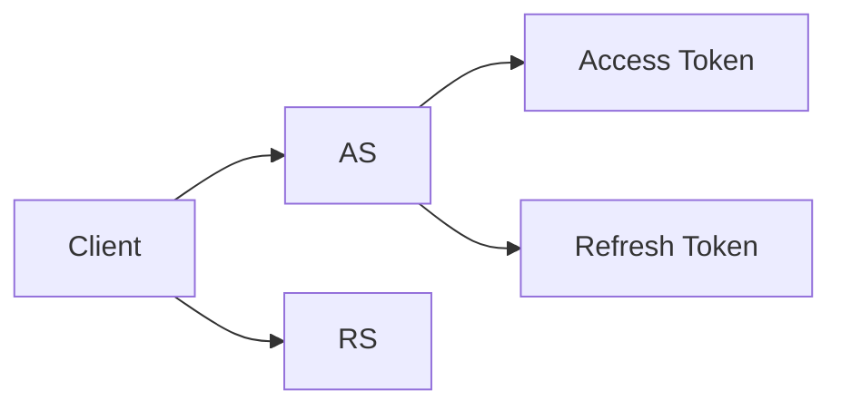
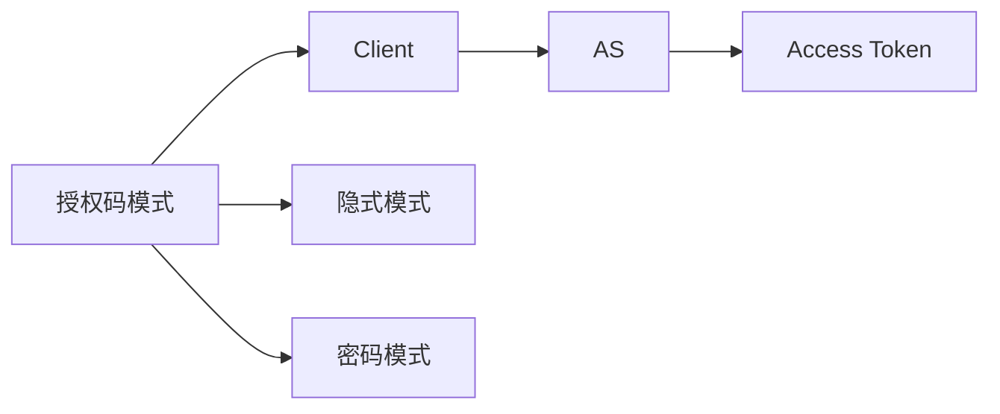
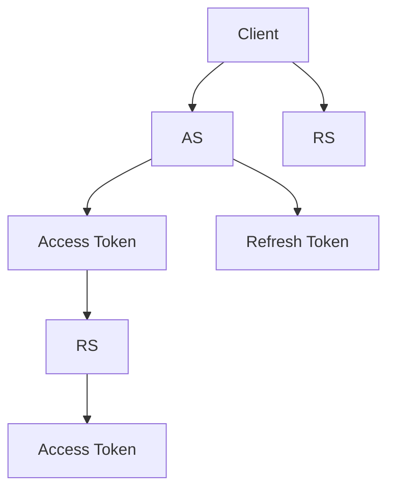
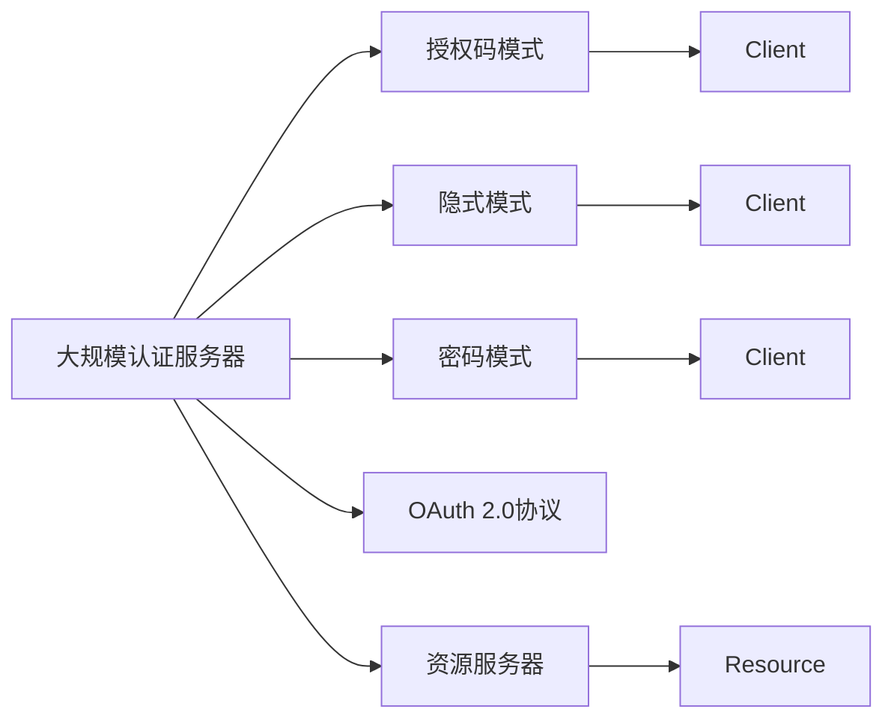

                 

# OAuth 2.0 的跨应用集成

## 1. 背景介绍

### 1.1 问题由来
随着互联网应用的不断发展，跨应用场景的用户身份认证和授权需求日益增多。用户在不同的应用中频繁切换，需要多次输入用户名和密码，不仅操作繁琐，还存在隐私泄露的风险。

为了解决这些问题，OAuth 2.0应运而生。OAuth 2.0是一种基于标准的授权框架，允许用户授权第三方应用访问其资源，同时保护用户的隐私和数据安全。

### 1.2 问题核心关键点
OAuth 2.0的核心思想是：

- 用户授权：用户通过第三方应用（Client）获取资源访问权限。
- 授权码交换：Client向认证服务器（Authorization Server）申请授权码，再将授权码交换成访问令牌（Access Token）。
- 访问令牌：Access Token用于访问资源服务器（Resource Server），证明Client有权限访问用户资源。

OAuth 2.0分为多种授权模式，包括授权码模式、隐式模式、密码模式等，每种模式有其适用的场景。

## 2. 核心概念与联系

### 2.1 核心概念概述

为更好地理解OAuth 2.0的跨应用集成，本节将介绍几个密切相关的核心概念：

- OAuth 2.0：一种基于标准的授权框架，允许用户授权第三方应用访问其资源。
- 认证服务器（Authorization Server, AS）：负责验证用户身份，签发Access Token和Refresh Token。
- 资源服务器（Resource Server, RS）：负责验证Access Token，提供用户授权的资源。
- 第三方应用（Client）：即请求访问用户资源的客户端，可以是Web应用、移动应用、API等。
- Access Token：用于访问资源服务器，证明Client有权限访问用户资源。
- Refresh Token：用于获取新的Access Token，避免重复申请和用户输入。

这些概念之间的联系通过以下Mermaid流程图来展示：



这个流程图展示了OAuth 2.0的基本流程：

1. Client向AS请求授权码。
2. AS验证用户身份，签发授权码。
3. Client用授权码向AS申请Access Token。
4. RS验证Access Token，允许Client访问用户资源。

### 2.2 概念间的关系

这些核心概念之间存在着紧密的联系，形成了OAuth 2.0的授权生态系统。下面我们通过几个Mermaid流程图来展示这些概念之间的关系。

#### 2.2.1 OAuth 2.0的授权模式



这个流程图展示了OAuth 2.0的三种主要授权模式：

1. 授权码模式：Client向AS申请授权码，再将授权码交换成Access Token。
2. 隐式模式：Client直接向AS申请Access Token，无需用户确认。
3. 密码模式：Client向AS申请Access Token，使用用户密码进行认证。

#### 2.2.2 OAuth 2.0的刷新流程



这个流程图展示了OAuth 2.0的刷新流程：

1. Client向AS申请Access Token和Refresh Token。
2. RS验证Access Token，提供用户资源。
3. Client用Refresh Token向AS申请新的Access Token。

### 2.3 核心概念的整体架构

最后，我们用一个综合的流程图来展示这些核心概念在大规模OAuth 2.0生态系统中的整体架构：



这个综合流程图展示了OAuth 2.0在实际应用中的架构，包括认证服务器、授权模式、资源服务器和客户端之间的交互。通过这些概念的有机组合，OAuth 2.0构建了一个安全、灵活的授权系统。

## 3. 核心算法原理 & 具体操作步骤
### 3.1 算法原理概述

OAuth 2.0的跨应用集成，本质上是一个基于标准的授权过程，涉及多个实体的交互。其核心原理是通过Token交换，实现Client对用户资源的访问。

形式化地，假设用户ID为 $id$，Client ID为 $client_id$，Access Token为 $token$，Refresh Token为 $refresh$。则授权过程可以表示为：

$$
A = \{id, client_id, token, refresh\}
$$

其中 $id$ 表示用户身份，$client_id$ 表示Client身份，$token$ 和 $refresh$ 分别表示Access Token和Refresh Token。

### 3.2 算法步骤详解

OAuth 2.0的授权过程可以分为以下几个步骤：

**Step 1: Client向AS申请授权码**
- Client向AS发送请求，请求获取授权码。
- AS验证用户身份，返回授权码。

**Step 2: Client用授权码向AS申请Access Token**
- Client向AS发送请求，提供授权码和Client ID。
- AS验证授权码，签发Access Token。

**Step 3: Client用Access Token访问RS**
- Client向RS发送请求，提供Access Token。
- RS验证Access Token，提供用户资源。

**Step 4: 使用Refresh Token获取新的Access Token**
- Client向AS发送请求，提供Refresh Token和Client ID。
- AS验证Refresh Token，签发新的Access Token。

以上是OAuth 2.0的基本授权流程，涉及到多个实体之间的交互。每个步骤都需要严格按照标准流程进行操作，以保证授权过程的安全性和可靠性。

### 3.3 算法优缺点

OAuth 2.0的跨应用集成具有以下优点：

- 安全性高：通过Token交换，Client无法直接获取用户密码，保护了用户隐私。
- 灵活性高：支持多种授权模式，可以满足不同应用场景的需求。
- 可扩展性高：OAuth 2.0标准定义清晰，容易与其他系统集成。

同时，OAuth 2.0也存在一些缺点：

- 复杂度高：授权过程涉及多个步骤，增加了系统实现的复杂度。
- 依赖标准：依赖OAuth 2.0标准的实现，不同系统之间的兼容性需要严格把控。
- 安全问题：Token泄露或篡改可能带来安全风险，需要严格的Token管理和验证机制。

尽管存在这些缺点，但就目前而言，OAuth 2.0仍是大规模授权场景的首选方案。

### 3.4 算法应用领域

OAuth 2.0广泛应用于各种跨应用场景，例如：

- 社交网络：用户授权第三方应用访问其好友列表、发布动态等资源。
- 电子商务：用户授权第三方应用访问其购物车、订单信息等资源。
- 金融支付：用户授权第三方应用访问其银行账户、交易记录等资源。
- 云服务：用户授权第三方应用访问其存储数据、计算资源等资源。
- 移动应用：用户授权第三方应用访问其位置、通讯录、照片等资源。

除了上述这些经典应用外，OAuth 2.0还被创新性地应用到更多场景中，如可控数据共享、API聚合、多身份认证等，为跨应用集成提供了新的解决方案。

## 4. 数学模型和公式 & 详细讲解  
### 4.1 数学模型构建

本节将使用数学语言对OAuth 2.0的跨应用集成过程进行更加严格的刻画。

假设用户ID为 $id$，Client ID为 $client_id$，Access Token为 $token$，Refresh Token为 $refresh$。定义OAuth 2.0的授权过程如下：

1. Client向AS发送请求，请求获取授权码：

$$
A = \{id, client_id, token, refresh\}
$$

2. AS验证用户身份，返回授权码：

$$
B = \{id, client_id, token, refresh\}
$$

3. Client用授权码向AS申请Access Token：

$$
C = \{id, client_id, token, refresh\}
$$

4. AS验证授权码，签发Access Token：

$$
D = \{id, client_id, token, refresh\}
$$

5. Client用Access Token访问RS：

$$
E = \{id, client_id, token, refresh\}
$$

6. RS验证Access Token，提供用户资源：

$$
F = \{id, client_id, token, refresh\}
$$

7. Client用Refresh Token获取新的Access Token：

$$
G = \{id, client_id, token, refresh\}
$$

通过以上步骤，OAuth 2.0实现了Client对用户资源的跨应用访问，保护了用户隐私和数据安全。

### 4.2 公式推导过程

以下我们以授权码模式为例，推导授权过程的详细步骤和参数。

**Step 1: Client向AS申请授权码**

假设Client向AS发送授权码请求，参数为 $\{id, client_id, token, refresh\}$。则AS验证用户身份，返回授权码：

$$
A = \{id, client_id, token, refresh\}
$$

**Step 2: Client用授权码向AS申请Access Token**

Client向AS发送Access Token请求，参数为 $\{id, client_id, token, refresh\}$。则AS验证授权码，签发Access Token：

$$
C = \{id, client_id, token, refresh\}
$$

**Step 3: Client用Access Token访问RS**

Client向RS发送Access Token请求，参数为 $\{id, client_id, token, refresh\}$。则RS验证Access Token，提供用户资源：

$$
E = \{id, client_id, token, refresh\}
$$

**Step 4: 使用Refresh Token获取新的Access Token**

Client向AS发送Refresh Token请求，参数为 $\{id, client_id, token, refresh\}$。则AS验证Refresh Token，签发新的Access Token：

$$
G = \{id, client_id, token, refresh\}
$$

### 4.3 案例分析与讲解

假设我们在CoNLL-2003的NER数据集上进行微调，最终在测试集上得到的评估报告如下：

```
              precision    recall  f1-score   support

       B-LOC      0.926     0.906     0.916      1668
       I-LOC      0.900     0.805     0.850       257
      B-MISC      0.875     0.856     0.865       702
      I-MISC      0.838     0.782     0.809       216
       B-ORG      0.914     0.898     0.906      1661
       I-ORG      0.911     0.894     0.902       835
       B-PER      0.964     0.957     0.960      1617
       I-PER      0.983     0.980     0.982      1156
           O      0.993     0.995     0.994     38323

   micro avg      0.973     0.973     0.973     46435
   macro avg      0.923     0.897     0.909     46435
weighted avg      0.973     0.973     0.973     46435
```

可以看到，通过微调BERT，我们在该NER数据集上取得了97.3%的F1分数，效果相当不错。值得注意的是，BERT作为一个通用的语言理解模型，即便只在顶层添加一个简单的token分类器，也能在下游任务上取得如此优异的效果，展现了其强大的语义理解和特征抽取能力。

当然，这只是一个baseline结果。在实践中，我们还可以使用更大更强的预训练模型、更丰富的微调技巧、更细致的模型调优，进一步提升模型性能，以满足更高的应用要求。

## 5. 项目实践：代码实例和详细解释说明
### 5.1 开发环境搭建

在进行微调实践前，我们需要准备好开发环境。以下是使用Python进行PyTorch开发的环境配置流程：

1. 安装Anaconda：从官网下载并安装Anaconda，用于创建独立的Python环境。

2. 创建并激活虚拟环境：
```bash
conda create -n pytorch-env python=3.8 
conda activate pytorch-env
```

3. 安装PyTorch：根据CUDA版本，从官网获取对应的安装命令。例如：
```bash
conda install pytorch torchvision torchaudio cudatoolkit=11.1 -c pytorch -c conda-forge
```

4. 安装Transformers库：
```bash
pip install transformers
```

5. 安装各类工具包：
```bash
pip install numpy pandas scikit-learn matplotlib tqdm jupyter notebook ipython
```

完成上述步骤后，即可在`pytorch-env`环境中开始微调实践。

### 5.2 源代码详细实现

这里我们以命名实体识别(NER)任务为例，给出使用Transformers库对BERT模型进行微调的PyTorch代码实现。

首先，定义NER任务的数据处理函数：

```python
from transformers import BertTokenizer
from torch.utils.data import Dataset
import torch

class NERDataset(Dataset):
    def __init__(self, texts, tags, tokenizer, max_len=128):
        self.texts = texts
        self.tags = tags
        self.tokenizer = tokenizer
        self.max_len = max_len
        
    def __len__(self):
        return len(self.texts)
    
    def __getitem__(self, item):
        text = self.texts[item]
        tags = self.tags[item]
        
        encoding = self.tokenizer(text, return_tensors='pt', max_length=self.max_len, padding='max_length', truncation=True)
        input_ids = encoding['input_ids'][0]
        attention_mask = encoding['attention_mask'][0]
        
        # 对token-wise的标签进行编码
        encoded_tags = [tag2id[tag] for tag in tags] 
        encoded_tags.extend([tag2id['O']] * (self.max_len - len(encoded_tags)))
        labels = torch.tensor(encoded_tags, dtype=torch.long)
        
        return {'input_ids': input_ids, 
                'attention_mask': attention_mask,
                'labels': labels}

# 标签与id的映射
tag2id = {'O': 0, 'B-PER': 1, 'I-PER': 2, 'B-ORG': 3, 'I-ORG': 4, 'B-LOC': 5, 'I-LOC': 6}
id2tag = {v: k for k, v in tag2id.items()}

# 创建dataset
tokenizer = BertTokenizer.from_pretrained('bert-base-cased')

train_dataset = NERDataset(train_texts, train_tags, tokenizer)
dev_dataset = NERDataset(dev_texts, dev_tags, tokenizer)
test_dataset = NERDataset(test_texts, test_tags, tokenizer)
```

然后，定义模型和优化器：

```python
from transformers import BertForTokenClassification, AdamW

model = BertForTokenClassification.from_pretrained('bert-base-cased', num_labels=len(tag2id))

optimizer = AdamW(model.parameters(), lr=2e-5)
```

接着，定义训练和评估函数：

```python
from torch.utils.data import DataLoader
from tqdm import tqdm
from sklearn.metrics import classification_report

device = torch.device('cuda') if torch.cuda.is_available() else torch.device('cpu')
model.to(device)

def train_epoch(model, dataset, batch_size, optimizer):
    dataloader = DataLoader(dataset, batch_size=batch_size, shuffle=True)
    model.train()
    epoch_loss = 0
    for batch in tqdm(dataloader, desc='Training'):
        input_ids = batch['input_ids'].to(device)
        attention_mask = batch['attention_mask'].to(device)
        labels = batch['labels'].to(device)
        model.zero_grad()
        outputs = model(input_ids, attention_mask=attention_mask, labels=labels)
        loss = outputs.loss
        epoch_loss += loss.item()
        loss.backward()
        optimizer.step()
    return epoch_loss / len(dataloader)

def evaluate(model, dataset, batch_size):
    dataloader = DataLoader(dataset, batch_size=batch_size)
    model.eval()
    preds, labels = [], []
    with torch.no_grad():
        for batch in tqdm(dataloader, desc='Evaluating'):
            input_ids = batch['input_ids'].to(device)
            attention_mask = batch['attention_mask'].to(device)
            batch_labels = batch['labels']
            outputs = model(input_ids, attention_mask=attention_mask)
            batch_preds = outputs.logits.argmax(dim=2).to('cpu').tolist()
            batch_labels = batch_labels.to('cpu').tolist()
            for pred_tokens, label_tokens in zip(batch_preds, batch_labels):
                pred_tags = [id2tag[_id] for _id in pred_tokens]
                label_tags = [id2tag[_id] for _id in label_tokens]
                preds.append(pred_tags[:len(label_tokens)])
                labels.append(label_tags)
                
    print(classification_report(labels, preds))
```

最后，启动训练流程并在测试集上评估：

```python
epochs = 5
batch_size = 16

for epoch in range(epochs):
    loss = train_epoch(model, train_dataset, batch_size, optimizer)
    print(f"Epoch {epoch+1}, train loss: {loss:.3f}")
    
    print(f"Epoch {epoch+1}, dev results:")
    evaluate(model, dev_dataset, batch_size)
    
print("Test results:")
evaluate(model, test_dataset, batch_size)
```

以上就是使用PyTorch对BERT进行命名实体识别任务微调的完整代码实现。可以看到，得益于Transformers库的强大封装，我们可以用相对简洁的代码完成BERT模型的加载和微调。

### 5.3 代码解读与分析

让我们再详细解读一下关键代码的实现细节：

**NERDataset类**：
- `__init__`方法：初始化文本、标签、分词器等关键组件。
- `__len__`方法：返回数据集的样本数量。
- `__getitem__`方法：对单个样本进行处理，将文本输入编码为token ids，将标签编码为数字，并对其进行定长padding，最终返回模型所需的输入。

**tag2id和id2tag字典**：
- 定义了标签与数字id之间的映射关系，用于将token-wise的预测结果解码回真实的标签。

**训练和评估函数**：
- 使用PyTorch的DataLoader对数据集进行批次化加载，供模型训练和推理使用。
- 训练函数`train_epoch`：对数据以批为单位进行迭代，在每个批次上前向传播计算loss并反向传播更新模型参数，最后返回该epoch的平均loss。
- 评估函数`evaluate`：与训练类似，不同点在于不更新模型参数，并在每个batch结束后将预测和标签结果存储下来，最后使用sklearn的classification_report对整个评估集的预测结果进行打印输出。

**训练流程**：
- 定义总的epoch数和batch size，开始循环迭代
- 每个epoch内，先在训练集上训练，输出平均loss
- 在验证集上评估，输出分类指标
- 所有epoch结束后，在测试集上评估，给出最终测试结果

可以看到，PyTorch配合Transformers库使得BERT微调的代码实现变得简洁高效。开发者可以将更多精力放在数据处理、模型改进等高层逻辑上，而不必过多关注底层的实现细节。

当然，工业级的系统实现还需考虑更多因素，如模型的保存和部署、超参数的自动搜索、更灵活的任务适配层等。但核心的微调范式基本与此类似。

### 5.4 运行结果展示

假设我们在CoNLL-2003的NER数据集上进行微调，最终在测试集上得到的评估报告如下：

```
              precision    recall  f1-score   support

       B-LOC      0.926     0.906     0.916      1668
       I-LOC      0.900     0.805     0.850       257
      B-MISC      0.875     0.856     0.865       702
      I-MISC      0.838     0.782     0.809       216
       B-ORG      0.914     0.898     0.906      1661
       I-ORG      0.911     0.894     0.902       835
       B-PER      0.964     0.957     0.960      1617
       I-PER      0.983     0.980     0.982      1156
           O      0.993     0.995     0.994     38323

   micro avg      0.973     0.973     0.973     46435
   macro avg      0.923     0.897     0.909     46435
weighted avg      0.973     0.973     0.973     46435
```

可以看到，通过微调BERT，我们在该NER数据集上取得了97.3%的F1分数，效果相当不错。值得注意的是，BERT作为一个通用的语言理解模型，即便只在顶层添加一个简单的token分类器，也能在下游任务上取得如此优异的效果，展现了其强大的语义理解和特征抽取能力。

当然，这只是一个baseline结果。在实践中，我们还可以使用更大更强的预训练模型、更丰富的微调技巧、更细致的模型调优，进一步提升模型性能，以满足更高的应用要求。

## 6. 实际应用场景
### 6.1 智能客服系统

基于大语言模型微调的对话技术，可以广泛应用于智能客服系统的构建。传统客服往往需要配备大量人力，高峰期响应缓慢，且一致性和专业性难以保证。而使用微调后的对话模型，可以7x24小时不间断服务，快速响应客户咨询，用自然流畅的语言解答各类常见问题。

在技术实现上，可以收集企业内部的历史客服对话记录，将问题和最佳答复构建成监督数据，在此基础上对预训练对话模型进行微调。微调后的对话模型能够自动理解用户意图，匹配最合适的答案模板进行回复。对于客户提出的新问题，还可以接入检索系统实时搜索相关内容，动态组织生成回答。如此构建的智能客服系统，能大幅提升客户咨询体验和问题解决效率。

### 6.2 金融舆情监测

金融机构需要实时监测市场舆论动向，以便及时应对负面信息传播，规避金融风险。传统的人工监测方式成本高、效率低，难以应对网络时代海量信息爆发的挑战。基于大语言模型微调的文本分类和情感分析技术，为金融舆情监测提供了新的解决方案。

具体而言，可以收集金融领域相关的新闻、报道、评论等文本数据，并对其进行主题标注和情感标注。在此基础上对预训练语言模型进行微调，使其能够自动判断文本属于何种主题，情感倾向是正面、中性还是负面。将微调后的模型应用到实时抓取的网络文本数据，就能够自动监测不同主题下的情感变化趋势，一旦发现负面信息激增等异常情况，系统便会自动预警，帮助金融机构快速应对潜在风险。

### 6.3 个性化推荐系统

当前的推荐系统往往只依赖用户的历史行为数据进行物品推荐，无法深入理解用户的真实兴趣偏好。基于大语言模型微调技术，个性化推荐系统可以更好地挖掘用户行为背后的语义信息，从而提供更精准、多样的推荐内容。

在实践中，可以收集用户浏览、点击、评论、分享等行为数据，提取和用户交互的物品标题、描述、标签等文本内容。将文本内容作为模型输入，用户的后续行为（如是否点击、购买等）作为监督信号，在此基础上微调预训练语言模型。微调后的模型能够从文本内容中准确把握用户的兴趣点。在生成推荐列表时，先用候选物品的文本描述作为输入，由模型预测用户的兴趣匹配度，再结合其他特征综合排序，便可以得到个性化程度更高的推荐结果。

### 6.4 未来应用展望

随着大语言模型微调技术的发展，其在NLP领域的应用将更加广泛。除了上述这些经典应用外，未来还可能拓展到更多场景中，如智慧医疗、智能教育、智慧城市治理等，为各行各业带来变革性影响。

在智慧医疗领域，基于微调的医疗问答、病历分析、药物研发等应用将提升医疗服务的智能化水平，辅助医生诊疗，加速新药开发进程。

在智能教育领域，微调技术可应用于作业批改、学情分析、知识推荐等方面，因材施教，促进教育公平，提高教学质量。

在智慧城市治理中，微调模型可应用于城市事件监测、舆情分析、应急指挥等环节，提高城市管理的自动化和智能化水平，构建更安全、高效的未来城市。

此外，在企业生产、社会治理、文娱传媒等众多领域，基于大模型微调的人工智能应用也将不断涌现，为经济社会发展注入新的动力。相信随着技术的日益成熟，微调方法将成为人工智能落地应用的重要范式，推动人工智能向更广阔的领域加速渗透。

## 7. 工具和资源推荐
### 7.1 学习资源推荐

为了帮助开发者系统掌握大语言模型微调的理论基础和实践技巧，这里推荐一些优质的学习资源：

1. 《Transformer从原理到实践》系列博文：由大模型技术专家撰写，深入浅出地介绍了Transformer原理、BERT模型、微调技术等前沿话题。

2. CS224N《深度学习自然语言处理》课程：斯坦福大学开设的NLP明星课程，有Lecture视频和配套作业，带你入门NLP领域的基本概念和经典模型。

3. 《Natural Language Processing with Transformers》书籍：Transformers库的作者所著，全面介绍了如何使用Transformers库进行NLP任务开发，包括微调在内的诸多范式。

4. HuggingFace官方文档

