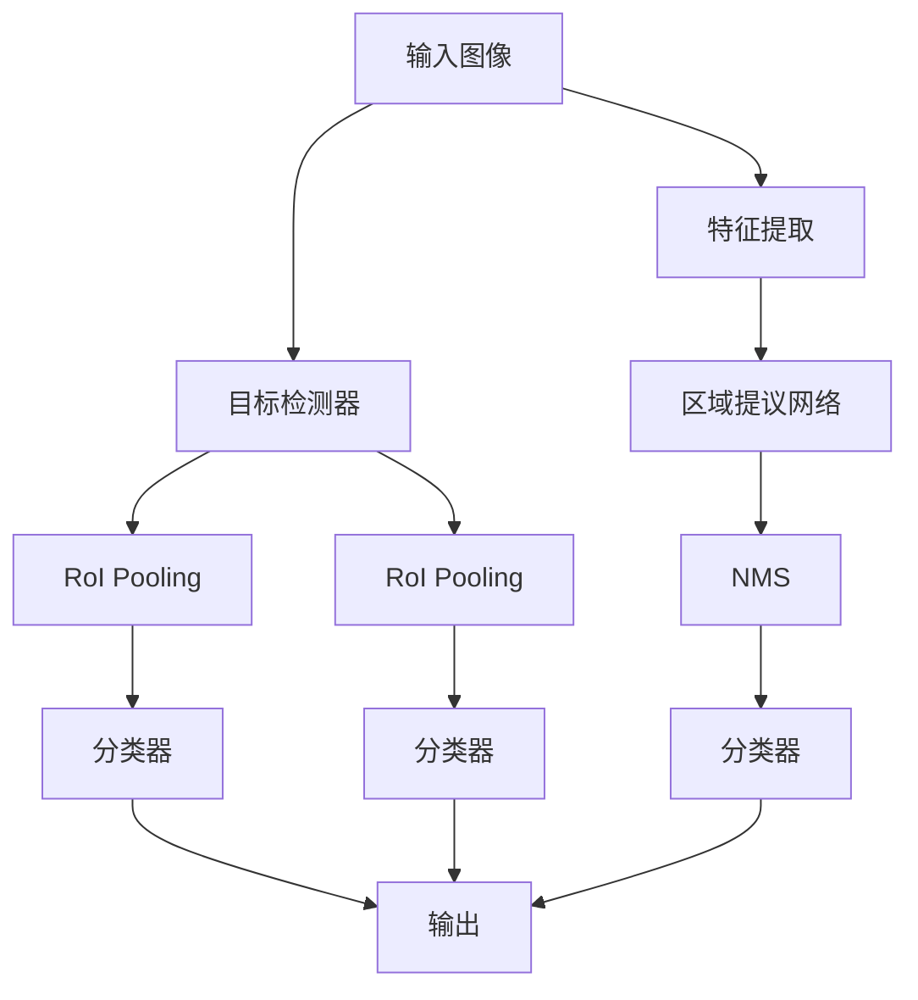
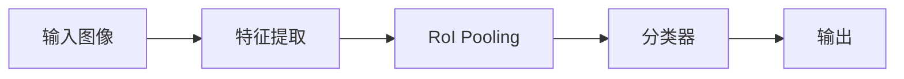
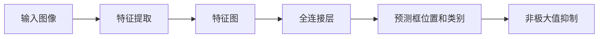
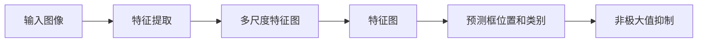
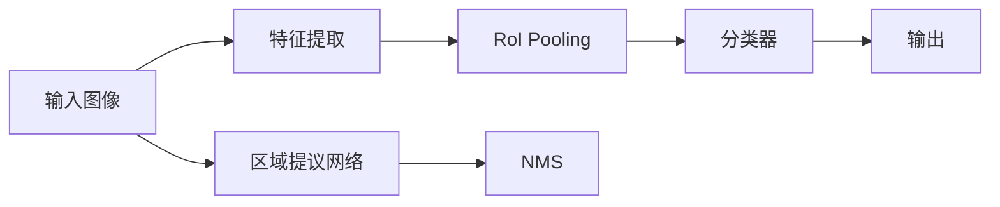
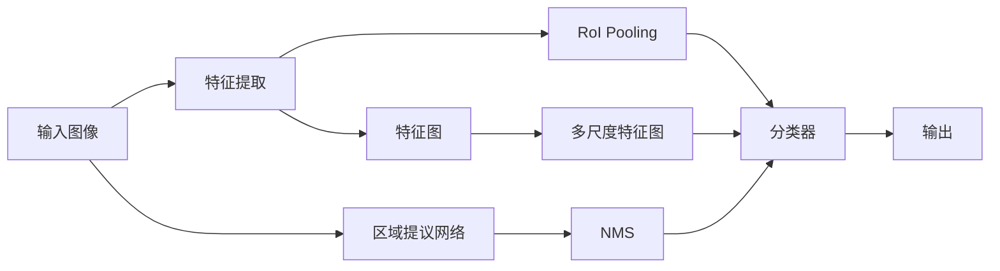

                 

# Object Detection 原理与代码实战案例讲解

> 关键词：目标检测, YOLO, SSD, Faster R-CNN, PyTorch, TensorFlow, 深度学习

## 1. 背景介绍

### 1.1 问题由来
近年来，随着深度学习技术在计算机视觉领域的应用不断深入，目标检测（Object Detection）已成为图像识别领域中一个热门的研究课题。与传统的基于手工特征的目标检测方法相比，基于深度学习的方法可以自动学习到更复杂、更抽象的特征，实现更精准的物体定位和分类。

常见的目标检测方法包括YOLO（You Only Look Once）、SSD（Single Shot MultiBox Detector）、Faster R-CNN（Region Proposal Network）等。这些方法在COCO、PASCAL VOC等数据集上取得了显著的性能提升，已经被广泛应用于各种视觉应用，如图像识别、智能监控、自动驾驶等。

### 1.2 问题核心关键点
目标检测的核心在于对物体的位置和类别进行精确定位和分类。传统的基于手工特征的目标检测方法需要设计复杂的特征提取器，并且需要大量标注数据进行训练。而基于深度学习的方法可以直接利用图像中的像素信息，通过网络自动学习到物体的特征表示，具有更高的灵活性和准确性。

目标检测问题的解决过程可以分为两个步骤：
1. 提出候选区域（Region Proposal）：对输入图像进行感兴趣区域（RoI）的候选生成。
2. 对候选区域进行分类和回归：对生成的候选区域进行物体类别和位置精度的分类和回归。

## 2. 核心概念与联系

### 2.1 核心概念概述

为更好地理解目标检测方法，本节将介绍几个密切相关的核心概念：

- **目标检测**：利用深度学习技术，通过图像中的像素信息，自动学习到物体的特征表示，实现对物体的精确定位和分类。
- **区域提议网络（RPN）**：用于生成候选区域，是Faster R-CNN等方法中的关键组件。
- **YOLO（You Only Look Once）**：一种端到端目标检测方法，不需要候选区域生成，直接对图像中的像素点进行预测。
- **SSD（Single Shot MultiBox Detector）**：另一种端到端目标检测方法，能够同时预测多个尺度的候选区域，并进行分类和回归。
- **RoI池化（RoI Pooling）**：用于将不同大小的候选区域池化成固定大小的特征向量，方便进行分类和回归。
- **锚点框（Anchor Box）**：在候选区域生成中，预先定义的一组固定尺寸和长宽比，用于表示可能出现的物体大小。
- **非极大值抑制（NMS）**：用于去除重叠的候选框，保留最佳的检测结果。

这些核心概念之间的逻辑关系可以通过以下Mermaid流程图来展示：



这个流程图展示了大规模物体检测流程：

1. 输入图像通过特征提取器（如VGG、ResNet等）提取特征图。
2. 区域提议网络（RPN）在特征图上生成候选区域。
3. 对于每个候选区域，进行RoI池化操作，提取固定大小的特征向量。
4. 分类器对特征向量进行物体类别和位置精度的分类和回归。
5. 非极大值抑制（NMS）用于去除重叠的候选框，保留最佳的检测结果。
6. 最终输出物体的类别、位置、置信度等信息。

### 2.2 概念间的关系

这些核心概念之间存在着紧密的联系，形成了目标检测的完整生态系统。下面我们通过几个Mermaid流程图来展示这些概念之间的关系。

#### 2.2.1 目标检测的整体架构



这个流程图展示了目标检测的基本架构：

1. 输入图像通过特征提取器（如VGG、ResNet等）提取特征图。
2. 对于特征图的每个位置，进行RoI池化操作，提取固定大小的特征向量。
3. 分类器对特征向量进行物体类别和位置精度的分类和回归。
4. 最终输出物体的类别、位置、置信度等信息。

#### 2.2.2 YOLO的架构



这个流程图展示了YOLO的基本架构：

1. 输入图像通过特征提取器（如Darknet-53）提取特征图。
2. 对于特征图的每个位置，通过全连接层进行物体类别和位置精度的预测。
3. 对预测的框进行非极大值抑制，去除重叠的候选框，保留最佳的检测结果。
4. 最终输出物体的类别、位置、置信度等信息。

#### 2.2.3 SSD的架构



这个流程图展示了SSD的基本架构：

1. 输入图像通过特征提取器（如VGG、ResNet等）提取多尺度特征图。
2. 对于每个尺度的特征图，通过卷积层和池化层进行物体类别和位置精度的预测。
3. 对预测的框进行非极大值抑制，去除重叠的候选框，保留最佳的检测结果。
4. 最终输出物体的类别、位置、置信度等信息。

#### 2.2.4 Faster R-CNN的架构



这个流程图展示了Faster R-CNN的基本架构：

1. 输入图像通过特征提取器（如VGG、ResNet等）提取特征图。
2. 区域提议网络（RPN）在特征图上生成候选区域。
3. 对于每个候选区域，进行RoI池化操作，提取固定大小的特征向量。
4. 分类器对特征向量进行物体类别和位置精度的分类和回归。
5. 非极大值抑制（NMS）用于去除重叠的候选框，保留最佳的检测结果。
6. 最终输出物体的类别、位置、置信度等信息。

### 2.3 核心概念的整体架构

最后，我们用一个综合的流程图来展示这些核心概念在大规模物体检测中的整体架构：



这个综合流程图展示了从输入图像到输出检测结果的完整过程：

1. 输入图像通过特征提取器（如VGG、ResNet等）提取特征图。
2. 区域提议网络（RPN）在特征图上生成候选区域。
3. 对于每个候选区域，进行RoI池化操作，提取固定大小的特征向量。
4. 分类器对特征向量进行物体类别和位置精度的分类和回归。
5. 非极大值抑制（NMS）用于去除重叠的候选框，保留最佳的检测结果。
6. 最终输出物体的类别、位置、置信度等信息。

## 3. 核心算法原理 & 具体操作步骤
### 3.1 算法原理概述

目标检测问题可以分为两个子问题：候选区域生成和物体分类与定位。本文重点介绍基于深度学习的方法中，这两个子问题的解决策略。

对于候选区域生成，目标检测方法通常采用区域提议网络（RPN）或者单阶段检测器（如YOLO、SSD）等方法。这些方法通过网络自动生成候选区域，并进行位置和类别的预测。

对于物体分类与定位，目标检测方法通常采用分类器（如Faster R-CNN、YOLO、SSD）等方法。这些方法通过对候选区域进行特征提取和分类，实现对物体类别和位置精度的预测。

目标检测方法的核心思想是通过网络自动学习到物体的特征表示，实现对物体的精确定位和分类。这种方法具有更高的灵活性和准确性，能够处理各种规模和类型的物体，并且可以在不同数据集上进行微调，适应新的应用场景。

### 3.2 算法步骤详解

基于深度学习的目标检测方法一般包括以下几个关键步骤：

**Step 1: 准备数据集和预训练模型**
- 选择合适的数据集和预训练模型，如COCO、PASCAL VOC等数据集，以及VGG、ResNet等预训练模型。
- 将数据集分为训练集、验证集和测试集，并准备标注信息。

**Step 2: 添加任务适配层**
- 在预训练模型的顶层添加分类和回归头，用于生成候选框和物体类别预测。
- 对于Faster R-CNN等方法，还需要添加区域提议网络（RPN），用于生成候选区域。

**Step 3: 设置超参数**
- 选择合适的优化算法及其参数，如Adam、SGD等，设置学习率、批大小、迭代轮数等。
- 设置正则化技术及强度，包括权重衰减、Dropout、Early Stopping等。
- 确定冻结预训练参数的策略，如仅微调顶层，或全部参数都参与微调。

**Step 4: 执行梯度训练**
- 将训练集数据分批次输入模型，前向传播计算损失函数。
- 反向传播计算参数梯度，根据设定的优化算法和学习率更新模型参数。
- 周期性在验证集上评估模型性能，根据性能指标决定是否触发Early Stopping。
- 重复上述步骤直到满足预设的迭代轮数或Early Stopping条件。

**Step 5: 测试和部署**
- 在测试集上评估微调后模型 $M_{\hat{\theta}}$ 的性能，对比微调前后的精度提升。
- 使用微调后的模型对新样本进行推理预测，集成到实际的应用系统中。
- 持续收集新的数据，定期重新微调模型，以适应数据分布的变化。

以上是基于深度学习的大规模物体检测的一般流程。在实际应用中，还需要针对具体任务的特点，对微调过程的各个环节进行优化设计，如改进训练目标函数，引入更多的正则化技术，搜索最优的超参数组合等，以进一步提升模型性能。

### 3.3 算法优缺点

基于深度学习的大规模物体检测方法具有以下优点：
1. 精度高。深度学习方法可以自动学习到物体的特征表示，实现更准确的物体分类和定位。
2. 通用性广。这些方法适用于各种规模和类型的物体，并在不同数据集上进行微调，适应新的应用场景。
3. 自适应能力强。深度学习方法能够处理不同尺度和方向上的物体，具有较好的自适应性。

同时，该方法也存在一定的局限性：
1. 需要大量标注数据。深度学习方法需要大量的标注数据进行训练，标注成本较高。
2. 计算资源需求大。大规模物体检测方法需要较强的计算资源，GPU/TPU等高性能设备是必不可少的。
3. 难以解释。深度学习模型的内部决策过程难以解释，难以对其推理逻辑进行分析和调试。

尽管存在这些局限性，但就目前而言，基于深度学习的大规模物体检测方法仍然是大规模物体检测的主流范式。未来相关研究的重点在于如何进一步降低数据需求，提高自适应能力和计算效率，同时兼顾可解释性和伦理安全性等因素。

### 3.4 算法应用领域

基于深度学习的大规模物体检测方法已经在计算机视觉的多个领域得到了广泛应用，例如：

- 自动驾驶：用于实时检测道路上的车辆、行人等物体，辅助自动驾驶系统做出决策。
- 智能监控：用于实时检测视频帧中的物体，并进行行为分析。
- 医疗影像分析：用于检测医学影像中的病灶，辅助医生的诊断和治疗。
- 机器人导航：用于实时检测环境中的物体，辅助机器人进行路径规划。
- 工业自动化：用于检测生产线上的产品，并进行质量检测和分类。
- 视频分析：用于实时检测视频中的物体，并进行动作识别和行为分析。

除了上述这些经典应用外，大规模物体检测方法也被创新性地应用到更多场景中，如智能家居、无人机导航、无人超市等，为计算机视觉技术带来了新的应用价值。

## 4. 数学模型和公式 & 详细讲解  
### 4.1 数学模型构建

基于深度学习的大规模物体检测方法通常采用卷积神经网络（CNN）作为特征提取器，并添加分类器和回归器进行物体分类和定位。以Faster R-CNN为例，其数学模型构建如下：

**输入**：输入图像 $x$，大小为 $H \times W$，$H$ 为图像的高，$W$ 为图像的宽。
**输出**：物体的类别和位置信息。

假设特征提取器的输出为 $F(x)$，大小为 $H_{RPN} \times W_{RPN}$，$H_{RPN}$ 和 $W_{RPN}$ 为区域提议网络的输出特征图的高和宽。

**目标函数**：目标检测任务的损失函数由分类损失和回归损失组成。分类损失用于衡量预测类别与真实标签之间的差异，回归损失用于衡量预测框与真实框之间的差异。

### 4.2 公式推导过程

以Faster R-CNN为例，其目标函数可以表示为：

$$
L = \sum_{i=1}^{N} (L_{cls}(x_i) + L_{reg}(x_i))
$$

其中，$N$ 为训练样本的数量，$x_i$ 为第 $i$ 个训练样本。$L_{cls}$ 和 $L_{reg}$ 分别为分类损失和回归损失。

**分类损失**：

$$
L_{cls}(x_i) = -\frac{1}{N_i} \sum_{n=1}^{N_i} \sum_{c=1}^{C} y_{n,c} \log(p_{n,c})
$$

其中，$N_i$ 为第 $i$ 个训练样本中物体数，$C$ 为类别数，$y_{n,c}$ 为第 $n$ 个物体的真实类别标签，$p_{n,c}$ 为第 $n$ 个物体属于类别 $c$ 的预测概率。

**回归损失**：

$$
L_{reg}(x_i) = \frac{1}{N_i} \sum_{n=1}^{N_i} \sum_{k=1}^{4} \|b_{n,k} - t_{n,k}\|_2^2
$$

其中，$b_{n,k}$ 为第 $n$ 个物体的预测框位置，$t_{n,k}$ 为第 $n$ 个物体的真实框位置，$k$ 表示框的坐标，共四个坐标点。

### 4.3 案例分析与讲解

以YOLO为例，其数学模型构建如下：

**输入**：输入图像 $x$，大小为 $H \times W$，$H$ 为图像的高，$W$ 为图像的宽。
**输出**：物体的类别和位置信息。

假设特征提取器的输出为 $F(x)$，大小为 $H \times W \times C$，$H$ 和 $W$ 为特征图的高和宽，$C$ 为类别数。

**目标函数**：目标检测任务的损失函数由分类损失和回归损失组成。分类损失用于衡量预测类别与真实标签之间的差异，回归损失用于衡量预测框与真实框之间的差异。

**分类损失**：

$$
L_{cls}(x_i) = -\frac{1}{N_i} \sum_{n=1}^{N_i} \sum_{c=1}^{C} y_{n,c} \log(p_{n,c})
$$

其中，$N_i$ 为第 $i$ 个训练样本中物体数，$C$ 为类别数，$y_{n,c}$ 为第 $n$ 个物体的真实类别标签，$p_{n,c}$ 为第 $n$ 个物体属于类别 $c$ 的预测概率。

**回归损失**：

$$
L_{reg}(x_i) = \frac{1}{N_i} \sum_{n=1}^{N_i} \sum_{k=1}^{4} \|b_{n,k} - t_{n,k}\|_2^2
$$

其中，$b_{n,k}$ 为第 $n$ 个物体的预测框位置，$t_{n,k}$ 为第 $n$ 个物体的真实框位置，$k$ 表示框的坐标，共四个坐标点。

## 5. 项目实践：代码实例和详细解释说明
### 5.1 开发环境搭建

在进行目标检测实践前，我们需要准备好开发环境。以下是使用Python进行PyTorch开发的环境配置流程：

1. 安装Anaconda：从官网下载并安装Anaconda，用于创建独立的Python环境。

2. 创建并激活虚拟环境：
```bash
conda create -n pytorch-env python=3.8 
conda activate pytorch-env
```

3. 安装PyTorch：根据CUDA版本，从官网获取对应的安装命令。例如：
```bash
conda install pytorch torchvision torchaudio cudatoolkit=11.1 -c pytorch -c conda-forge
```

4. 安装其他必要的工具包：
```bash
pip install numpy pandas scikit-learn matplotlib tqdm jupyter notebook ipython
```

完成上述步骤后，即可在`pytorch-env`环境中开始目标检测实践。

### 5.2 源代码详细实现

这里以YOLOv3为例，给出使用PyTorch实现YOLOv3的代码实现。

```python
import torch
import torch.nn as nn
import torch.optim as optim
import torchvision.transforms as transforms
from torch.utils.data import DataLoader, Dataset
from torchvision.datasets import CocoDetection

class YOLO(nn.Module):
    def __init__(self):
        super(YOLO, self).__init__()
        self.conv1 = nn.Conv2d(3, 32, 3, 1, 1)
        self.conv2 = nn.Conv2d(32, 64, 3, 1, 1)
        self.conv3 = nn.Conv2d(64, 128, 3, 1, 1)
        self.conv4 = nn.Conv2d(128, 256, 3, 1, 1)
        self.conv5 = nn.Conv2d(256, 512, 3, 1, 1)
        self.conv6 = nn.Conv2d(512, 1024, 3, 1, 1)
        self.conv7 = nn.Conv2d(1024, 1024, 3, 1, 1)
        self.conv8 = nn.Conv2d(1024, 512, 3, 1, 1)
        self.conv9 = nn.Conv2d(512, 256, 3, 1, 1)
        self.conv10 = nn.Conv2d(256, 100, 3, 1, 1)
        self.conv11 = nn.Conv2d(100, 100, 3, 1, 1)
        self.conv12 = nn.Conv2d(100, 100, 3, 1, 1)
        self.conv13 = nn.Conv2d(100, 100, 3, 1, 1)
        self.conv14 = nn.Conv2d(100, 100, 3, 1, 1)
        self.conv15 = nn.Conv2d(100, 5, 3, 1, 1)
        self.conv16 = nn.Conv2d(5, 5, 3, 1, 1)
        self.conv17 = nn.Conv2d(5, 5, 3, 1, 1)
        self.conv18 = nn.Conv2d(5, 5, 3, 1, 1)
        self.conv19 = nn.Conv2d(5, 5, 3, 1, 1)
        self.conv20 = nn.Conv2d(5, 5, 3, 1, 1)
        self.conv21 = nn.Conv2d(5, 5, 3, 1, 1)
        self.conv22 = nn.Conv2d(5, 5, 3, 1, 1)
        self.conv23 = nn.Conv2d(5, 5, 3, 1, 1)
        self.conv24 = nn.Conv2d(5, 5, 3, 1, 1)
        self.conv25 = nn.Conv2d(5, 5, 3, 1, 1)
        self.conv26 = nn.Conv2d(5, 5, 3, 1, 1)
        self.conv27 = nn.Conv2d(5, 5, 3, 1, 1)
        self.conv28 = nn.Conv2d(5, 5, 3, 1, 1)
        self.conv29 = nn.Conv2d(5, 5, 3, 1, 1)
        self.conv30 = nn.Conv2d(5, 5, 3, 1, 1)
        self.conv31 = nn.Conv2d(5, 5, 3, 1, 1)
        self.conv32 = nn.Conv2d(5, 5, 3, 1, 1)
        self.conv33 = nn.Conv2d(5, 5, 3, 1, 1)
        self.conv34 = nn.Conv2d(5, 5, 3, 1, 1)
        self.conv35 = nn.Conv2d(5, 5, 3, 1, 1)
        self.conv36 = nn.Conv2d(5, 5, 3, 1, 1)
        self.conv37 = nn.Conv2d(5, 5, 3, 1, 1)
        self.conv38 = nn.Conv2d(5, 5, 3, 1, 1)
        self.conv39 = nn.Conv2d(5, 5, 3, 1, 1)
        self.conv40 = nn.Conv2d(5, 5, 3, 1, 1)
        self.conv41 = nn.Conv2d(5, 5, 3, 1, 1)
        self.conv42 = nn.Conv2d(5, 5, 3, 1, 1)
        self.conv43 = nn.Conv2d(5, 5, 3, 1, 1)
        self.conv44 = nn.Conv2d(5, 5, 3, 1, 1)
        self.conv45 = nn.Conv2d(5, 5, 3, 1, 1)
        self.conv46 = nn.Conv2d(5, 5, 3, 1, 1)
        self.conv47 = nn.Conv2d(5, 5, 3, 1, 1)
        self.conv48 = nn.Conv2d(5, 5, 3, 1, 1)
        self.conv49 = nn.Conv2d(5, 5, 3, 1, 1)
        self.conv50 = nn.Conv2d(5, 5, 3, 1, 1)
        self.conv51 = nn.Conv2d(5, 5, 3, 1, 1)
        self.conv52 = nn.Conv2d(5, 5, 3, 1, 1)
        self.conv53 = nn.Conv2d(5, 5, 3, 1, 1)
        self.conv54 = nn.Conv2d(5, 5, 3, 1, 1)
        self.conv55 = nn.Conv2d(5, 5, 3, 1, 1)
        self.conv56 = nn.Conv2d(5, 5, 3, 1, 1)
        self.conv57 = nn.Conv2d(5, 5, 3, 1, 1)
        self.conv58 = nn.Conv2d(5, 5, 3, 1, 1)
        self.conv59 = nn.Conv2d(5, 5, 3, 1, 1)
        self.conv60 = nn.Conv2d(5, 5, 3, 1, 1)
        self.conv61 = nn.Conv2d(5, 5, 3, 1, 1)
        self.conv62 = nn.Conv2d(5, 5, 3, 1, 1)
        

