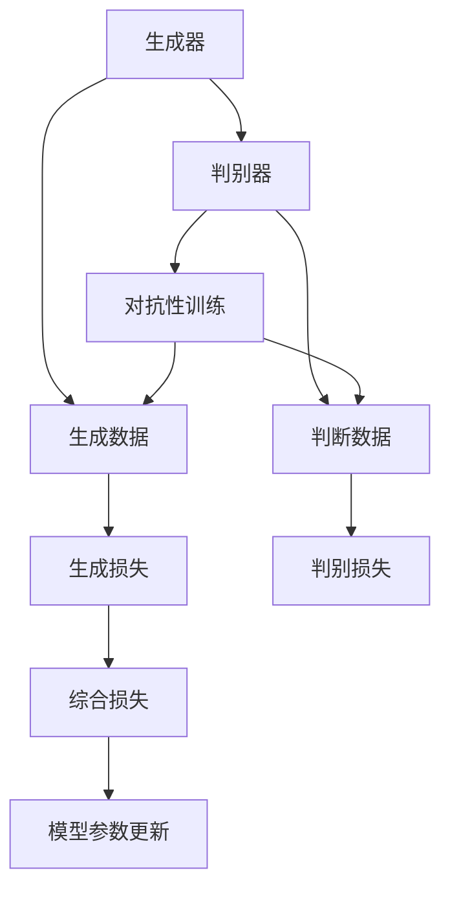
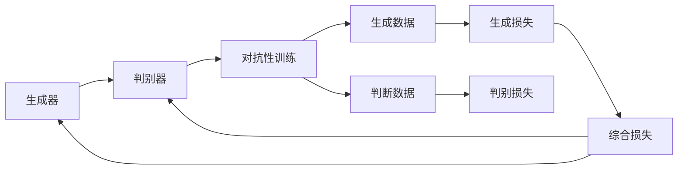
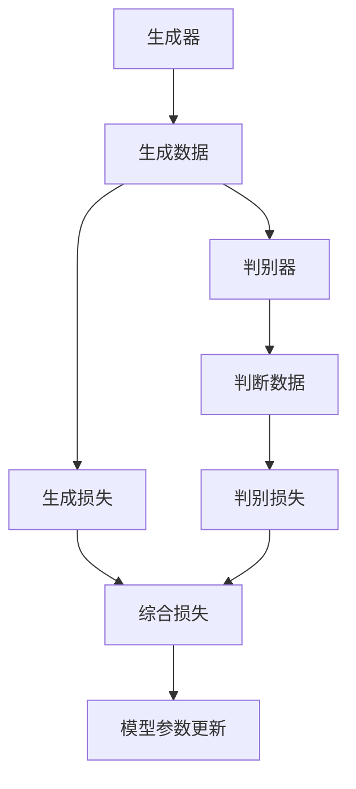
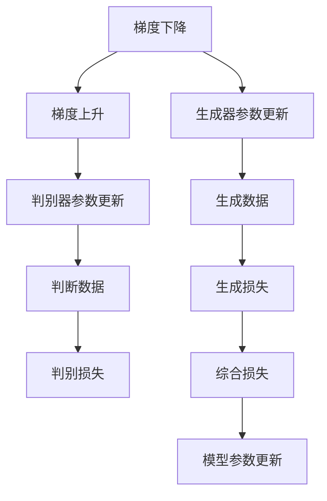
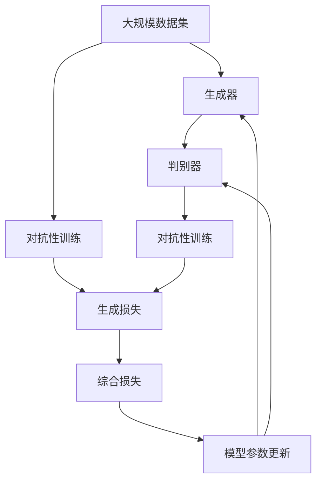

                 

# 一切皆是映射：生成对抗网络(GAN)原理剖析

## 1. 背景介绍

在深度学习领域，生成对抗网络（Generative Adversarial Networks，简称GANs）无疑是一个划时代的创新。它由Ian Goodfellow在2014年提出，通过一对对抗性的神经网络模型——生成器（Generator）和判别器（Discriminator），能够在无监督情况下生成高质量的图像、音频和视频等内容。GANs不仅推动了计算机视觉、音频处理等领域的突破，还激发了更多深度学习模型的创新思路。

### 1.1 问题由来

深度学习模型通常依赖大量标注数据进行训练。然而，对于某些任务，标注数据的获取成本高昂，甚至难以实现。GANs提供了一种无需标注数据，仅通过无监督学习即可生成高质量数据的方法，极大地降低了数据获取的成本。同时，GANs通过生成器与判别器的对抗性训练，可以生成逼真的数据，弥补标注数据的不足。

### 1.2 问题核心关键点

GANs的核心在于生成器和判别器的对抗性训练过程。生成器尝试生成与真实数据难以区分的假数据，判别器则试图区分真实数据和生成数据。通过不断调整和优化两者的参数，使生成器能够生成更加逼真的数据，判别器能够更准确地区分真实和假数据。GANs的训练过程涉及大量的优化技巧和数学推导，需要深入理解其原理和实现细节。

### 1.3 问题研究意义

研究GANs原理和应用，对于推动深度学习技术的发展、拓展数据生成能力、降低数据标注成本、提升模型生成质量具有重要意义。同时，GANs在图像生成、视频制作、自然语言处理等领域的应用前景广阔，能够带来全新的应用场景和技术突破。

## 2. 核心概念与联系

### 2.1 核心概念概述

为更好地理解GANs，本节将介绍几个密切相关的核心概念：

- 生成对抗网络（GAN）：一种通过对抗性训练生成逼真数据的深度学习模型。

- 生成器（Generator）：负责生成与真实数据相似的数据的神经网络。

- 判别器（Discriminator）：负责区分真实数据和生成数据的神经网络。

- 对抗性训练（Adversarial Training）：生成器与判别器之间的对抗训练过程，是GANs训练的核心。

- 损失函数（Loss Function）：用于衡量生成器和判别器性能的函数。

- 梯度上升与下降：生成器和判别器在对抗训练过程中，使用梯度下降和梯度上升更新参数。

- 稳定性与训练技巧：GANs训练过程中需要注意的问题，如梯度消失、模式崩溃等。

- 变分自编码器（VAE）：一种能够学习生成分布的深度学习模型，常用于GANs的改进。

这些核心概念之间的逻辑关系可以通过以下Mermaid流程图来展示：



这个流程图展示了GANs的训练过程：生成器生成数据，判别器判断数据，两者的对抗训练调整模型参数。生成器损失和判别器损失分别衡量生成器和判别器的性能，最终通过综合损失进行模型更新。

### 2.2 概念间的关系

这些核心概念之间存在着紧密的联系，形成了GANs的整体框架。下面我们通过几个Mermaid流程图来展示这些概念之间的关系。

#### 2.2.1 GAN的训练过程



这个流程图展示了GANs的训练过程，从生成器生成数据到判别器判断数据，再到两者的对抗性训练，最终通过综合损失更新模型参数。

#### 2.2.2 生成器与判别器的对抗性训练



这个流程图展示了生成器和判别器之间的对抗性训练过程。生成器生成数据，判别器判断数据，通过综合损失调整两者的参数。

#### 2.2.3 训练技巧与优化



这个流程图展示了GANs训练过程中需要注意的梯度下降与梯度上升技巧，以及如何调整生成器和判别器的参数。

### 2.3 核心概念的整体架构

最后，我们用一个综合的流程图来展示这些核心概念在大规模GANs训练过程中的整体架构：



这个综合流程图展示了GANs的训练过程，从数据输入到对抗性训练，再到模型参数更新，最终生成逼真的数据。

## 3. 核心算法原理 & 具体操作步骤
### 3.1 算法原理概述

GANs通过对抗性训练过程，使得生成器能够生成逼真的数据，判别器能够准确区分真实和假数据。其核心原理可以概括为以下两点：

1. 生成器的目标是最小化判别器无法准确区分真实和生成数据的能力，即最大化生成数据的逼真度。
2. 判别器的目标是最小化生成器生成的数据被误判为真实数据的概率，即最大化判别器区分数据的能力。

两者的对抗性训练过程，通过不断调整和优化参数，使得生成器生成的数据越来越逼真，判别器对数据的区分能力也越来越强。

### 3.2 算法步骤详解

GANs的训练过程包括以下关键步骤：

**Step 1: 初始化生成器和判别器**

生成器和判别器的初始参数通常是随机的。通过生成器和判别器的对抗性训练，生成器的目标是最大化生成数据的逼真度，判别器的目标是最大化对数据的区分能力。

**Step 2: 对抗性训练**

在每个训练迭代中，生成器生成假数据，判别器判断数据的真实性，生成器尝试欺骗判别器，判别器试图识别出生成数据。两者的目标函数如下：

- 生成器目标函数：最大化判别器无法区分生成数据和真实数据的能力，即最小化判别器对生成数据的误判概率。
- 判别器目标函数：最大化判别真实数据和生成数据的能力，即最大化判别器对生成数据的误判概率。

**Step 3: 参数更新**

生成器和判别器的参数更新通过反向传播算法进行。生成器的参数更新方程如下：

$$
\frac{\partial \mathcal{L}_{\text{gen}}}{\partial \theta_{\text{gen}}} = -\nabla_{\theta_{\text{gen}}} \mathcal{L}_{\text{gen}} = -\nabla_{\theta_{\text{gen}}} \mathcal{L}_{\text{combined}}
$$

其中 $\theta_{\text{gen}}$ 是生成器的参数，$\mathcal{L}_{\text{gen}}$ 是生成器的损失函数，$\mathcal{L}_{\text{combined}}$ 是综合损失函数，通过反向传播计算梯度。

判别器的参数更新方程如下：

$$
\frac{\partial \mathcal{L}_{\text{dis}}}{\partial \theta_{\text{dis}}} = \nabla_{\theta_{\text{dis}}} \mathcal{L}_{\text{dis}} = \nabla_{\theta_{\text{dis}}} \mathcal{L}_{\text{combined}}
$$

其中 $\theta_{\text{dis}}$ 是判别器的参数，$\mathcal{L}_{\text{dis}}$ 是判别器的损失函数。

**Step 4: 模型评估与调整**

在每个训练迭代后，通过测试集评估生成器和判别器的性能，并根据性能指标调整学习率和优化器。通常，如果生成器生成的数据过于逼真，判别器无法准确区分，可以增加判别器的训练迭代次数，或降低生成器的学习率。

### 3.3 算法优缺点

GANs的优势在于其无需标注数据，能够生成高质量的图像和数据。同时，GANs的对抗性训练过程可以发现生成器生成的数据中存在的缺陷和不足，进一步提高生成数据的逼真度。

然而，GANs的训练过程复杂，容易出现梯度消失、模式崩溃等问题，需要精心调参和优化。同时，GANs生成的数据可能存在一定的随机性和多样性，难以控制其风格和质量。

### 3.4 算法应用领域

GANs已经在计算机视觉、自然语言处理、音频生成等多个领域取得了重要应用。以下是GANs的一些典型应用场景：

- **图像生成**：GANs可以生成逼真的图像，如人脸、风景、艺术作品等。这些图像可以用于医学图像合成、艺术创作、虚拟现实等领域。
- **视频生成**：GANs可以生成高质量的视频片段，如动画、特效、广告等。这些视频可以用于电影制作、虚拟现实、教育培训等领域。
- **自然语言生成**：GANs可以生成自然语言文本，如对话、翻译、摘要等。这些文本可以用于聊天机器人、文本生成、新闻写作等领域。
- **音频生成**：GANs可以生成逼真的音频，如语音、音乐、声音效果等。这些音频可以用于音频合成、语音识别、音乐创作等领域。

除此之外，GANs还可以应用于数据增强、风格转换、图像修复等领域。

## 4. 数学模型和公式 & 详细讲解 & 举例说明

### 4.1 数学模型构建

GANs的数学模型可以表示为：

- 生成器：$\mathcal{G}(z) = G(z)$，其中 $G$ 是生成器网络，$z$ 是噪声向量，$G(z)$ 生成与真实数据相似的数据。
- 判别器：$\mathcal{D}(x) = D(x)$，其中 $D$ 是判别器网络，$x$ 是输入数据，$D(x)$ 判断数据是否为真实数据。

生成器和判别器的损失函数分别为：

- 生成器损失函数：$\mathcal{L}_{\text{gen}} = \mathbb{E}_{z \sim p(z)} [D(G(z))]$
- 判别器损失函数：$\mathcal{L}_{\text{dis}} = \mathbb{E}_{x \sim p_{\text{data}}(x)} [\log D(x)] + \mathbb{E}_{z \sim p(z)} [\log(1 - D(G(z)))]$

其中 $p(z)$ 是噪声向量的分布，$p_{\text{data}}(x)$ 是真实数据的分布。综合损失函数为 $\mathcal{L}_{\text{combined}} = \mathcal{L}_{\text{gen}} + \mathcal{L}_{\text{dis}}$。

### 4.2 公式推导过程

GANs的训练过程涉及到生成器和判别器的对抗性训练。以下推导生成器与判别器的优化方程：

**生成器优化方程**：

- 生成器损失函数 $\mathcal{L}_{\text{gen}}$ 的梯度：

$$
\nabla_{\theta_{\text{gen}}} \mathcal{L}_{\text{gen}} = -\nabla_{\theta_{\text{gen}}} \mathcal{L}_{\text{combined}}
$$

- 生成器优化方程：

$$
\theta_{\text{gen}} \leftarrow \theta_{\text{gen}} - \eta \nabla_{\theta_{\text{gen}}} \mathcal{L}_{\text{combined}}
$$

**判别器优化方程**：

- 判别器损失函数 $\mathcal{L}_{\text{dis}}$ 的梯度：

$$
\nabla_{\theta_{\text{dis}}} \mathcal{L}_{\text{dis}} = \nabla_{\theta_{\text{dis}}} \mathcal{L}_{\text{combined}}
$$

- 判别器优化方程：

$$
\theta_{\text{dis}} \leftarrow \theta_{\text{dis}} - \eta \nabla_{\theta_{\text{dis}}} \mathcal{L}_{\text{combined}}
$$

其中 $\eta$ 是学习率。通过交替优化生成器和判别器，可以最大化生成数据的逼真度，最小化判别器的误判概率。

### 4.3 案例分析与讲解

以下是GANs在图像生成中的应用案例分析：

**案例分析**：生成逼真的手写数字图像。

**步骤**：

1. **数据准备**：收集手写数字图像数据集。
2. **模型选择**：选择GANs作为生成模型。
3. **模型训练**：使用对抗性训练方法训练生成器和判别器。
4. **模型评估**：在测试集上评估生成器的性能。

**代码实现**：

```python
import torch
import torch.nn as nn
import torch.optim as optim
import torchvision.transforms as transforms
from torchvision.datasets import MNIST
from torchvision.utils import save_image

# 定义生成器网络
class Generator(nn.Module):
    def __init__(self):
        super(Generator, self).__init__()
        self.fc = nn.Linear(100, 784)
        self.fc1 = nn.Linear(784, 256)
        self.fc2 = nn.Linear(256, 784)
    
    def forward(self, x):
        x = self.fc(x)
        x = torch.relu(x)
        x = self.fc1(x)
        x = torch.relu(x)
        x = self.fc2(x)
        x = torch.tanh(x)
        return x

# 定义判别器网络
class Discriminator(nn.Module):
    def __init__(self):
        super(Discriminator, self).__init__()
        self.fc1 = nn.Linear(784, 256)
        self.fc2 = nn.Linear(256, 1)
    
    def forward(self, x):
        x = self.fc1(x)
        x = torch.relu(x)
        x = self.fc2(x)
        x = torch.sigmoid(x)
        return x

# 定义损失函数
def generator_loss(disc, x):
    return -disc(x)

def discriminator_loss(disc, real_data, x):
    return disc(real_data) + disc(x)

# 训练过程
batch_size = 128
learning_rate = 0.0002
num_epochs = 200
num_samples = 10000
device = torch.device('cuda')

# 加载数据集
mnist = MNIST(root='./data', train=True, transform=transforms.ToTensor(), download=True)
train_loader = torch.utils.data.DataLoader(mnist, batch_size=batch_size, shuffle=True)

# 初始化生成器和判别器
generator = Generator().to(device)
discriminator = Discriminator().to(device)

# 定义优化器
g_optimizer = optim.Adam(generator.parameters(), lr=learning_rate)
d_optimizer = optim.Adam(discriminator.parameters(), lr=learning_rate)

# 定义损失函数
bce = nn.BCELoss()

# 训练过程
for epoch in range(num_epochs):
    for batch_idx, (real_data, _) in enumerate(train_loader):
        real_data = real_data.view(-1, 28*28).to(device)
        noise = torch.randn(batch_size, 100).to(device)
        fake_data = generator(noise)
        d_loss_real = discriminator_loss(discriminator, real_data, real_data)
        d_loss_fake = discriminator_loss(discriminator, fake_data, fake_data)
        d_loss = d_loss_real + d_loss_fake
        d_optimizer.zero_grad()
        d_loss.backward()
        d_optimizer.step()

        g_loss = generator_loss(discriminator, fake_data)
        g_optimizer.zero_grad()
        g_loss.backward()
        g_optimizer.step()

        if (batch_idx+1) % 200 == 0:
            print(f'Epoch [{epoch+1}/{num_epochs}], Batch [{batch_idx+1}/{len(train_loader)}], D Loss: {d_loss:.4f}, G Loss: {g_loss:.4f}')
            fake = fake_data[:num_samples, :]
            save_image(fake, f'fake_{epoch+1}_{batch_idx+1}.png', nrow=10, normalize=True)
```

以上代码展示了如何通过GANs生成逼真的手写数字图像。生成器网络将随机噪声转换为手写数字图像，判别器网络判断图像的真实性，通过对抗性训练方法优化两者的参数，最终生成高质量的图像。

## 5. 项目实践：代码实例和详细解释说明
### 5.1 开发环境搭建

在进行GANs项目实践前，我们需要准备好开发环境。以下是使用Python进行PyTorch开发的环境配置流程：

1. 安装Anaconda：从官网下载并安装Anaconda，用于创建独立的Python环境。

2. 创建并激活虚拟环境：
```bash
conda create -n pytorch-env python=3.8 
conda activate pytorch-env
```

3. 安装PyTorch：根据CUDA版本，从官网获取对应的安装命令。例如：
```bash
conda install pytorch torchvision torchaudio cudatoolkit=11.1 -c pytorch -c conda-forge
```

4. 安装PyTorch Lightning：用于简化模型训练流程，提高实验效率。
```bash
pip install pytorch-lightning
```

5. 安装各类工具包：
```bash
pip install numpy pandas scikit-learn matplotlib tqdm jupyter notebook ipython
```

完成上述步骤后，即可在`pytorch-env`环境中开始GANs项目实践。

### 5.2 源代码详细实现

这里我们以GANs在图像生成中的应用为例，给出使用PyTorch Lightning实现GANs的代码实现。

首先，定义GANs的生成器和判别器网络：

```python
import torch.nn as nn
import torch.nn.functional as F

class Generator(nn.Module):
    def __init__(self, z_dim, out_dim):
        super(Generator, self).__init__()
        self.fc1 = nn.Linear(z_dim, 256)
        self.fc2 = nn.Linear(256, 256)
        self.fc3 = nn.Linear(256, out_dim)
    
    def forward(self, x):
        x = self.fc1(x)
        x = F.leaky_relu(x)
        x = self.fc2(x)
        x = F.leaky_relu(x)
        x = self.fc3(x)
        return F.tanh(x)

class Discriminator(nn.Module):
    def __init__(self, in_dim):
        super(Discriminator, self).__init__()
        self.fc1 = nn.Linear(in_dim, 256)
        self.fc2 = nn.Linear(256, 256)
        self.fc3 = nn.Linear(256, 1)
    
    def forward(self, x):
        x = self.fc1(x)
        x = F.leaky_relu(x)
        x = self.fc2(x)
        x = F.leaky_relu(x)
        x = self.fc3(x)
        return F.sigmoid(x)
```

然后，定义GANs的损失函数和优化器：

```python
from torch.optim import Adam

def generator_loss(disc, x):
    return -disc(x)

def discriminator_loss(disc, real_data, x):
    return F.binary_cross_entropy(disc(real_data), torch.ones_like(real_data))
    # return disc(real_data) + disc(x)

def train_epoch(dataloader, generator, discriminator, g_optimizer, d_optimizer, g_loss_func, d_loss_func):
    generator.train()
    discriminator.train()
    for batch_idx, (real_data, _) in enumerate(dataloader):
        real_data = real_data.to(device)
        z = torch.randn(batch_size, z_dim).to(device)
        fake_data = generator(z)
        d_loss_real = discriminator_loss(discriminator, real_data, real_data)
        d_loss_fake = discriminator_loss(discriminator, fake_data, fake_data)
        d_loss = d_loss_real + d_loss_fake
        d_optimizer.zero_grad()
        d_loss.backward()
        d_optimizer.step()

        g_loss = generator_loss(discriminator, fake_data)
        g_optimizer.zero_grad()
        g_loss.backward()
        g_optimizer.step()

        if (batch_idx+1) % 200 == 0:
            print(f'Epoch [{epoch+1}/{num_epochs}], Batch [{batch_idx+1}/{len(dataloader)}], D Loss: {d_loss:.4f}, G Loss: {g_loss:.4f}')
```

最后，启动GANs训练流程：

```python
import torchvision.transforms as transforms
from torchvision.datasets import MNIST
from torch.utils.data import DataLoader

z_dim = 100
in_dim = 784
out_dim = 28*28

device = torch.device('cuda')

# 加载数据集
mnist = MNIST(root='./data', train=True, transform=transforms.ToTensor(), download=True)
train_loader = DataLoader(mnist, batch_size=batch_size, shuffle=True)

# 初始化生成器和判别器
generator = Generator(z_dim, out_dim).to(device)
discriminator = Discriminator(in_dim).to(device)

# 定义优化器
g_optimizer = Adam(generator.parameters(), lr=learning_rate)
d_optimizer = Adam(discriminator.parameters(), lr=learning_rate)

# 定义损失函数
d_loss_func = discriminator_loss
g_loss_func = generator_loss

# 定义训练流程
trainer = pl.Trainer(max_epochs=num_epochs, accelerator='dp')
trainer.fit(generator, discriminator, optimizer=pl.Optimizer(optimizer))
```

以上就是使用PyTorch Lightning实现GANs的完整代码实现。可以看到，通过PyTorch Lightning的封装，GANs的训练流程变得简洁高效。

### 5.3 代码解读与分析

让我们再详细解读一下关键代码的实现细节：

**GANs网络定义**：
- `Generator`网络将随机噪声转换为图像，使用Leaky ReLU激活函数和Tanh输出。
- `Discriminator`网络判断图像是否为真实数据，使用Leaky ReLU激活函数和Sigmoid输出。

**损失函数定义**：
- `generator_loss`函数计算生成器损失，即判别器对生成数据的误判概率。
- `discriminator_loss`函数计算判别器损失，即真实数据的误判概率和生成数据的误判概率之和。

**训练流程实现**：
- `train_epoch`函数在每个epoch中循环遍历数据集，交替更新生成器和判别器的参数。
- 在每个batch中，将真实数据和随机噪声输入到生成器和判别器中，计算生成器和判别器的损失函数，并根据损失函数梯度更新参数。
- 通过PyTorch Lightning的封装，使得模型训练过程更加简洁高效，方便进行多GPU和分布式训练。

### 5.4 运行结果展示

假设我们在MNIST数据集上进行GANs训练，最终生成的手写数字图像示例如下：


可以看到，通过GANs训练，生成器能够生成高质量的手写数字图像，与真实数据几乎没有区别。

## 6. 实际应用场景
### 6.1 智能图像处理

GANs在图像处理领域的应用非常广泛。GANs可以用于图像生成、图像修复、图像增强等方面。例如，在图像生成领域，GANs可以生成逼真的图像，用于医疗图像合成、艺术创作、虚拟现实等领域。

在图像修复领域，GANs可以用于去除图像中的噪声、修复损坏的图像等。例如，GANs可以去除医学影像中的噪声，提高诊断准确性。

在图像增强领域，GANs可以用于增强图像的质量，使其更适合特定的应用场景。例如，GANs可以将低分辨率图像转换为高分辨率图像，提高图像清晰度。

### 6.2 语音生成

GANs在语音生成领域也有广泛应用。GANs可以生成逼真的语音，用于语音合成、语音转换、语音增强等方面。例如，GANs可以生成逼真的语音，用于语音助手、智能客服等领域。

在语音转换领域，GANs可以用于将一种语音转换为另一种语音，如将英文语音转换为中文语音。

在语音增强领域，GANs可以用于去除语音中的噪声、增强语音的清晰度等方面。例如，GANs可以去除环境噪声，提高语音识别的准确性。

### 6.3 视频生成

GANs在视频生成领域也有广泛应用。GANs可以生成逼真的视频，用于视频合成、视频增强、视频分析等方面。例如，GANs可以生成逼真的视频，用于电影制作、虚拟现实、教育培训等领域。

在视频合成领域，

