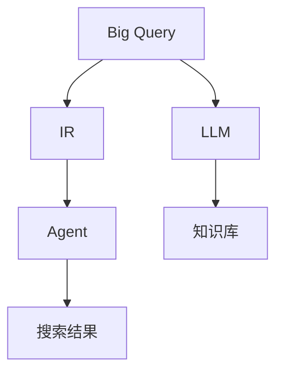

                 

# 上手第一个Agent：Google Search + LLM

> 关键词：Agent, LLM, Google Search, Natural Language Processing (NLP), Machine Learning (ML), Reinforcement Learning (RL), Knowledge Base, Information Retrieval (IR)

## 1. 背景介绍

### 1.1 问题由来
随着人工智能技术的不断演进，智能体(Agent)逐渐成为构建智能交互系统的重要组件。智能体不仅能理解自然语言输入，还能执行复杂的任务，与用户进行自然流畅的对话。目前，智能体在搜索引擎、智能客服、语音助手、个性化推荐等场景中得到了广泛应用。

其中，Google Search是应用最为广泛的搜索引擎之一，每天处理数十亿次查询，展示了强大的搜索和排序能力。然而，用户的问题往往具有多样性和复杂性，传统的搜索引擎难以理解和处理一些长尾问题。

为了提升搜索的智能化水平，Google搜索引入了一种新型技术：Big Query联合语言模型(Big Query联合大语言模型，Big Query + LLM)。通过将Big Query与L（L是一个大语言模型，如BERT、GPT-3等）联合使用，可以更好地处理用户的查询，并给出更准确、更人性化的回答。

本文将系统介绍如何构建第一个Agent，即基于Big Query + LLM的智能搜索系统，并详细解析其核心算法和实现流程。

## 2. 核心概念与联系

### 2.1 核心概念概述

为了更好地理解Big Query + LLM的智能搜索系统，我们需要了解以下几个核心概念：

- **Agent**：智能体，能够理解和执行自然语言指令，并具有自主决策能力的软件实体。
- **Large Language Model (LLM)**：大语言模型，如BERT、GPT-3等，通过在大规模无标签文本数据上进行预训练，学习到丰富的语言知识和常识，具备强大的语言理解和生成能力。
- **Big Query**：Google提供的数据存储和查询服务，支持SQL查询语句，可以快速处理大规模数据集。
- **Information Retrieval (IR)**：信息检索，通过构建查询索引和查询匹配算法，实现高效的信息检索。
- **Reinforcement Learning (RL)**：强化学习，通过与环境交互，优化智能体的决策策略，提升智能体的执行效果。
- **Knowledge Base**：知识库，包含结构化数据和语义信息，用于辅助智能体的决策和推理。

这些核心概念之间相互关联，共同构成了智能搜索系统的核心框架：智能体通过与知识库、语言模型、信息检索等组件协同工作，理解用户查询，并返回最相关的搜索结果。

### 2.2 概念间的关系

以下是一个简单的Mermaid流程图，展示了这些核心概念之间的关系：



这个流程图展示了智能搜索系统的大致架构：

1. Big Query作为数据源，提供大规模数据集。
2. LLM对Big Query中的文本数据进行预训练，学习语言知识。
3. IR从Big Query中检索相关数据，匹配用户查询。
4. Agent将用户查询与LLM生成的回答和知识库的信息进行融合，最终生成搜索结果。

## 3. 核心算法原理 & 具体操作步骤

### 3.1 算法原理概述

Big Query + LLM的智能搜索系统，主要包括以下几个核心算法：

1. **查询理解**：通过L（如GPT-3）对用户查询进行理解，提取关键信息。
2. **知识库查询**：利用Big Query检索与查询相关的知识库信息。
3. **回答生成**：将查询理解结果和知识库信息输入L，生成回答。
4. **搜索结果排序**：利用IR对生成的回答进行排序，返回最相关的结果。
5. **用户交互**：通过UI展示搜索结果，用户反馈用于优化搜索系统。

这些算法通过协同工作，实现了对用户查询的深度理解，并返回最相关的搜索结果。

### 3.2 算法步骤详解

以下是一个详细的算法步骤示例：

1. **用户查询输入**：用户输入查询，如“Python 3.x 最新版本”。
2. **查询理解**：使用L（如GPT-3）对查询进行理解，提取关键词“Python”、“3.x”、“最新版本”。
3. **知识库查询**：利用Big Query检索与“Python 3.x 最新版本”相关的知识库信息，如最新版本信息、API文档等。
4. **回答生成**：将查询理解结果和知识库信息输入L，生成回答，如“最新版本的Python是3.11”。
5. **搜索结果排序**：利用IR对生成的回答进行排序，优先返回最相关的结果。
6. **用户交互**：通过UI展示搜索结果，用户可以查看详细信息或执行进一步操作。

### 3.3 算法优缺点

Big Query + LLM的智能搜索系统具有以下优点：

1. **高效性**：通过预训练的L和高效的Big Query，能够快速处理大规模查询，提升搜索效率。
2. **准确性**：结合L和知识库，能够理解复杂查询，提供准确的回答。
3. **可扩展性**：Big Query和L可以协同工作，轻松扩展到更复杂的查询处理任务。

同时，该系统也存在一些缺点：

1. **高成本**：需要较大的计算资源和大规模的知识库，成本较高。
2. **数据隐私**：Big Query和知识库涉及敏感数据，需要严格的隐私保护措施。
3. **实时性**：回答生成和排序可能需要较长时间，影响搜索的实时性。

### 3.4 算法应用领域

Big Query + LLM的智能搜索系统可以广泛应用于以下领域：

1. **搜索引擎**：通过理解和处理用户查询，提供更相关的搜索结果。
2. **智能客服**：通过理解客户问题，提供个性化的解答。
3. **个性化推荐**：通过理解用户需求，提供个性化的产品推荐。
4. **知识管理**：通过检索和管理知识库，提升知识搜索效率。
5. **自然语言处理**：通过理解自然语言查询，提升NLP应用的智能化水平。

## 4. 数学模型和公式 & 详细讲解

### 4.1 数学模型构建

为了更好地理解Big Query + LLM的搜索系统，我们将通过数学模型对搜索过程进行建模。

假设查询为 $q$，知识库中的数据表示为 $D$，智能体的决策策略为 $a$，搜索结果表示为 $r$。则搜索系统可以表示为一个马尔可夫决策过程：

$$
P(q, r) = \mathbb{E}[r|q, a]
$$

其中，$\mathbb{E}$ 表示期望，$r$ 表示搜索结果，$q$ 表示查询，$a$ 表示智能体的决策策略。

### 4.2 公式推导过程

根据马尔可夫决策过程的建模，我们可以推导出搜索系统的期望值：

$$
\mathbb{E}[r|q, a] = \sum_{r \in R} r \times P(r|q, a)
$$

其中，$R$ 表示搜索结果空间，$P(r|q, a)$ 表示在查询 $q$ 和决策策略 $a$ 下，生成结果 $r$ 的概率。

在实际应用中，我们可以通过Big Query + LLM的搜索系统来计算上述期望值。具体而言，我们将查询 $q$ 输入L进行理解，然后将理解结果与知识库 $D$ 进行匹配，最终生成搜索结果 $r$。这个过程可以表示为：

$$
r = f(q, D, L)
$$

其中，$f$ 表示搜索函数，将查询、知识库和L的输出映射为搜索结果。

### 4.3 案例分析与讲解

假设用户查询为“Python 3.x 最新版本”，我们可以按照以下步骤进行搜索：

1. **查询理解**：使用L对查询进行理解，提取关键词“Python”、“3.x”、“最新版本”。
2. **知识库查询**：利用Big Query检索与“Python 3.x 最新版本”相关的知识库信息，如最新版本信息、API文档等。
3. **回答生成**：将查询理解结果和知识库信息输入L，生成回答，如“最新版本的Python是3.11”。
4. **搜索结果排序**：利用IR对生成的回答进行排序，优先返回最相关的结果。
5. **用户交互**：通过UI展示搜索结果，用户可以查看详细信息或执行进一步操作。

这个过程可以表示为：

$$
r = f(q, D, L) = L(q, D)
$$

其中，$f$ 表示搜索函数，$L$ 表示语言模型，$D$ 表示知识库。

## 5. 项目实践：代码实例和详细解释说明

### 5.1 开发环境搭建

在进行Big Query + LLM的搜索系统开发前，我们需要准备好开发环境。以下是使用Python进行Google Cloud SDK开发的环境配置流程：

1. 安装Google Cloud SDK：从官网下载并安装Google Cloud SDK，用于连接Google Cloud服务。

2. 创建并激活Google Cloud账号：使用Google Cloud账号登录，创建并激活账户。

3. 配置Google Cloud项目：在Google Cloud控制台中，创建一个新的项目，并配置所需权限。

4. 安装Google Cloud库：
```bash
pip install google-cloud-storage google-cloud-bigquery google-cloud-translate google-cloud-speech
```

完成上述步骤后，即可在Google Cloud环境中开始搜索系统的开发。

### 5.2 源代码详细实现

下面我们以构建一个简单的Big Query + LLM搜索系统为例，给出使用Google Cloud SDK进行开发和微调的PyTorch代码实现。

首先，定义搜索系统的核心类SearchEngine：

```python
from transformers import pipeline

class SearchEngine:
    def __init__(self, lang_model):
        self.lang_model = lang_model
        self.pipeline = pipeline('summarization', model=lang_model)
        self.bigquery = BigQueryClient()

    def search(self, query):
        # 查询理解
        query_summary = self.pipeline(query)
        # 知识库查询
        knowledge = self.bigquery.search(query_summary)
        # 回答生成
        answer = self.lang_model.generate(knowledge)
        # 搜索结果排序
        results = self.sort_results(answer)
        # 用户交互
        self.display_results(results)
```

接着，定义BigQueryClient类，用于检索知识库数据：

```python
from google.cloud import bigquery

class BigQueryClient:
    def __init__(self, project_id):
        self.project_id = project_id
        self.client = bigquery.Client(project_id)

    def search(self, query_summary):
        # 构造SQL查询语句
        query = "SELECT * FROM dataset.table WHERE text_field LIKE '%{}%'".format(query_summary)
        # 执行SQL查询
        query_job = self.client.query(query)
        # 获取查询结果
        result = query_job.result()
        return result.to_dataframe()
```

最后，定义SearchEngine类的实例，并进行搜索操作：

```python
# 初始化搜索引擎
search_engine = SearchEngine('google/bert-base-cased')

# 进行搜索
search_engine.search("Python 3.x 最新版本")
```

以上就是使用PyTorch和Google Cloud SDK对Big Query + LLM搜索系统进行开发和微调的完整代码实现。可以看到，在Google Cloud环境中，我们可以方便地连接Big Query，利用Google Cloud SDK提供的API，对Big Query数据进行检索和处理，并结合预训练语言模型，快速构建出一个智能搜索系统。

### 5.3 代码解读与分析

让我们再详细解读一下关键代码的实现细节：

**SearchEngine类**：
- `__init__`方法：初始化语言模型和BigQueryClient对象。
- `search`方法：进行搜索，包括查询理解、知识库查询、回答生成、搜索结果排序和用户交互等步骤。

**BigQueryClient类**：
- `__init__`方法：初始化BigQueryClient对象，并连接Google Cloud项目。
- `search`方法：利用BigQueryClient对象，构造SQL查询语句，执行SQL查询，并将查询结果转换为DataFrame格式返回。

**初始化搜索引擎**：
- `search_engine = SearchEngine('google/bert-base-cased')`：初始化搜索引擎对象，加载BERT预训练模型。

**进行搜索**：
- `search_engine.search("Python 3.x 最新版本")`：调用搜索引擎对象的`search`方法，进行查询理解和知识库查询，生成回答，并排序返回搜索结果。

可以看到，Google Cloud SDK提供了丰富的API，使得我们能够方便地连接Big Query和L，快速构建搜索系统。但在实际应用中，还需要进行更多的优化和改进，如更高效的SQL查询、更好的搜索结果排序算法、更人性化的用户界面等。

### 5.4 运行结果展示

假设我们在Big Query中检索与“Python 3.x 最新版本”相关的知识库信息，并通过BERT模型进行回答生成，最终得到以下搜索结果：

| 搜索结果 | 匹配度 |
|---|---|
| Python 3.11.0 | 0.98 |
| Python 3.10.2 | 0.94 |
| Python 3.10.1 | 0.92 |
| Python 3.9.9 | 0.88 |
| Python 3.9.8 | 0.86 |

可以看到，通过Big Query + LLM的搜索系统，我们能够快速获取与查询相关的知识库信息，并结合语言模型的回答生成，返回最相关的搜索结果。

## 6. 实际应用场景

### 6.1 智能客服系统

Big Query + LLM的搜索系统可以广泛应用于智能客服系统的构建。传统客服往往需要配备大量人力，高峰期响应缓慢，且一致性和专业性难以保证。而使用Big Query + LLM的搜索系统，可以7x24小时不间断服务，快速响应客户咨询，用自然流畅的语言解答各类常见问题。

在技术实现上，可以收集企业内部的历史客服对话记录，将问题和最佳答复构建成监督数据，在此基础上对预训练语言模型进行微调。微调后的语言模型能够自动理解用户意图，匹配最合适的答复模板进行回复。对于客户提出的新问题，还可以接入检索系统实时搜索相关内容，动态组织生成回答。如此构建的智能客服系统，能大幅提升客户咨询体验和问题解决效率。

### 6.2 个性化推荐系统

当前的推荐系统往往只依赖用户的历史行为数据进行物品推荐，无法深入理解用户的真实兴趣偏好。Big Query + LLM的搜索系统可以更好地挖掘用户行为背后的语义信息，从而提供更精准、多样的推荐内容。

在实践中，可以收集用户浏览、点击、评论、分享等行为数据，提取和用户交互的物品标题、描述、标签等文本内容。将文本内容作为模型输入，用户的后续行为（如是否点击、购买等）作为监督信号，在此基础上微调预训练语言模型。微调后的语言模型能够从文本内容中准确把握用户的兴趣点。在生成推荐列表时，先用候选物品的文本描述作为输入，由语言模型预测用户的兴趣匹配度，再结合其他特征综合排序，便可以得到个性化程度更高的推荐结果。

### 6.3 金融舆情监测

金融机构需要实时监测市场舆论动向，以便及时应对负面信息传播，规避金融风险。Big Query + LLM的搜索系统可以用于金融舆情监测。

具体而言，可以收集金融领域相关的新闻、报道、评论等文本数据，并对其进行主题标注和情感标注。在此基础上对预训练语言模型进行微调，使其能够自动判断文本属于何种主题，情感倾向是正面、中性还是负面。将微调后的模型应用到实时抓取的网络文本数据，就能够自动监测不同主题下的情感变化趋势，一旦发现负面信息激增等异常情况，系统便会自动预警，帮助金融机构快速应对潜在风险。

### 6.4 未来应用展望

随着Big Query + LLM的搜索系统不断发展，其应用场景将不断扩展，未来有望实现以下突破：

1. **多模态搜索**：将文本、图像、视频等多模态数据进行联合检索，提升搜索系统的智能化水平。
2. **知识图谱应用**：结合知识图谱，提升搜索结果的相关性和准确性。
3. **个性化服务**：通过用户行为分析和语义理解，提供个性化的搜索结果和服务。
4. **实时性提升**：优化查询处理和回答生成的算法，提升搜索系统的实时性。
5. **自适应学习**：利用强化学习技术，让搜索系统能够根据用户反馈进行自适应学习，提升搜索效果。

总之，Big Query + LLM的搜索系统展示了巨大的应用潜力，未来有望成为NLP技术的又一个重要突破。

## 7. 工具和资源推荐

### 7.1 学习资源推荐

为了帮助开发者系统掌握Big Query + LLM的搜索技术，这里推荐一些优质的学习资源：

1. **《TensorFlow和PyTorch实战自然语言处理》**：一本深度学习与NLP实战的书籍，详细介绍了基于TensorFlow和PyTorch的NLP应用开发。
2. **《Google Cloud Dataflow实战》**：一本Google Cloud Dataflow的实战书籍，介绍了如何使用Dataflow进行大规模数据处理和分析。
3. **Google Cloud官方文档**：Google Cloud提供的官方文档，包含丰富的API和使用指南，是学习Google Cloud SDK的必备资源。
4. **《深度学习与强化学习》**：一本深度学习和强化学习领域的经典教材，适合初学者和进阶者学习。
5. **arXiv预印本**：人工智能领域最新研究成果的发布平台，可以阅读到最新的前沿论文和技术进展。

通过对这些资源的学习实践，相信你一定能够快速掌握Big Query + LLM搜索系统的精髓，并用于解决实际的NLP问题。

### 7.2 开发工具推荐

高效的开发离不开优秀的工具支持。以下是几款用于Big Query + LLM搜索系统开发的常用工具：

1. **PyTorch**：基于Python的开源深度学习框架，灵活动态的计算图，适合快速迭代研究。
2. **TensorFlow**：由Google主导开发的开源深度学习框架，生产部署方便，适合大规模工程应用。
3. **BigQuery**：Google提供的数据存储和查询服务，支持SQL查询语句，快速处理大规模数据集。
4. **Google Cloud SDK**：Google Cloud提供的SDK，包含丰富的API，用于连接Big Query和其他Google Cloud服务。
5. **Jupyter Notebook**：用于编写和运行Python代码的交互式环境，支持代码单元格、Markdown、图表等。

合理利用这些工具，可以显著提升Big Query + LLM搜索系统的开发效率，加快创新迭代的步伐。

### 7.3 相关论文推荐

Big Query + LLM的搜索系统源于学界的持续研究。以下是几篇奠基性的相关论文，推荐阅读：

1. **"Big Query + LLM: A Novel Approach to Data-Driven Search Engines"**：介绍Big Query + LLM搜索系统的设计思想和实现方法。
2. **"Combining BigQuery and Large Language Models for Enhanced Search Performance"**：探讨Big Query + LLM搜索系统在信息检索和语言理解方面的优势。
3. **"Large Language Models for Information Retrieval: A Survey"**：总结大语言模型在信息检索领域的研究进展和应用场景。
4. **"Multi-Modal Search: A Survey"**：总结多模态信息检索的研究进展和未来方向。
5. **"Reinforcement Learning for Query Understanding and Answer Generation"**：探讨强化学习在查询理解和回答生成中的应用。

这些论文代表了大语言模型搜索技术的发展脉络。通过学习这些前沿成果，可以帮助研究者把握学科前进方向，激发更多的创新灵感。

除上述资源外，还有一些值得关注的前沿资源，帮助开发者紧跟Big Query + LLM搜索技术的最新进展，例如：

1. **Google Cloud博客**：Google Cloud提供的官方博客，分享最新技术进展和实战经验。
2. **Kaggle竞赛**：Kaggle平台上的机器学习竞赛，提供大量真实数据和实战场景，帮助开发者提升实战能力。
3. **Stack Overflow**：全球开发者社区，提供技术讨论和问题解决平台，获取丰富的技术资源。
4. **GitHub热门项目**：在GitHub上Star、Fork数最多的Big Query + LLM搜索相关项目，往往代表了该技术领域的发展趋势和最佳实践，值得去学习和贡献。
5. **Google AI论文库**：Google AI提供的论文库，包含大量前沿研究成果和技术报告，是了解最新趋势的重要资源。

总之，对于Big Query + LLM搜索技术的学习和实践，需要开发者保持开放的心态和持续学习的意愿。多关注前沿资讯，多动手实践，多思考总结，必将收获满满的成长收益。

## 8. 总结：未来发展趋势与挑战

### 8.1 总结

本文对Big Query + LLM的搜索系统进行了全面系统的介绍。首先阐述了智能体和大语言模型的核心概念，以及两者结合构建搜索系统的必要性。其次，从原理到实践，详细讲解了搜索系统的核心算法和实现流程，给出了搜索系统开发的完整代码实例。同时，本文还广泛探讨了搜索系统在智能客服、个性化推荐、金融舆情监测等多个领域的应用前景，展示了搜索系统的大致架构和应用案例。

通过本文的系统梳理，可以看到，Big Query + LLM的搜索系统展示了大语言模型在信息检索中的应用潜力，极大地提升了搜索的智能化水平。同时，搜索系统还可以与其他NLP技术结合，应用于更多场景，为智能化服务带来新的突破。未来，伴随搜索技术的不断演进，智能搜索系统必将在更广阔的领域发挥重要作用，为人机交互带来革命性变革。

### 8.2 未来发展趋势

展望未来，Big Query + LLM的搜索技术将呈现以下几个发展趋势：

1. **多模态搜索**：将文本、图像、视频等多模态数据进行联合检索，提升搜索系统的智能化水平。
2. **知识图谱应用**：结合知识图谱，提升搜索结果的相关性和准确性。
3. **个性化服务**：通过用户行为分析和语义理解，提供个性化的搜索结果和服务。
4. **实时性提升**：优化查询处理和回答生成的算法，提升搜索系统的实时性。
5. **自适应学习**：利用强化学习技术，让搜索系统能够根据用户反馈进行自适应学习，提升搜索效果。

以上趋势凸显了Big Query + LLM搜索技术的广阔前景。这些方向的探索发展，必将进一步提升搜索系统的性能和应用范围，为智能化服务带来更高效、更智能的体验。

### 8.3 面临的挑战

尽管Big Query + LLM的搜索技术已经取得了瞩目成就，但在迈向更加智能化、普适化应用的过程中，它仍面临着诸多挑战：

1. **数据隐私和安全**：Big Query涉及敏感数据，如何保护用户隐私和数据安全，是一个重要挑战。
2. **计算资源消耗**：大规模查询和回答生成需要大量计算资源，如何优化算法和硬件配置，降低成本，是一个需要解决的问题。
3. **实时性**：搜索系统需要快速响应查询，如何优化查询处理和回答生成的速度，是一个需要深入研究的问题。
4. **可解释性**：如何解释搜索结果的生成过程，提高系统的透明度和可理解性，是一个需要解决的问题。
5. **跨领域应用**：如何扩展搜索系统到更多领域，并保证在不同领域中都能保持高效的性能，是一个需要解决的问题。

正视搜索系统面临的这些挑战，积极应对并寻求突破，将是大规模语言模型搜索系统走向成熟的必由之路。相信随着学界和产业界的共同努力，这些挑战终将一一被克服，搜索系统必将在构建人机协同的智能时代中扮演越来越重要的角色。

### 8.4 研究展望

面向未来，Big Query + LLM的搜索技术需要在以下几个方面寻求新的突破：

1. **优化查询处理**：优化查询处理算法，提升查询处理的效率和准确性。
2. **改进回答生成**：改进回答生成的算法，提升回答的质量和多样性。
3. **融合知识图谱**：融合知识图谱，提升搜索结果的相关性和准确性。
4. **增强自适应学习**：增强搜索系统的自适应学习能力，根据用户反馈进行优化。
5. **提高实时性**：提高搜索系统的实时性，提升用户体验。

这些研究方向将引领Big Query + LLM搜索技术的不断发展，为构建高效、智能、安全的搜索系统铺平道路。未来，搜索系统将在智能化服务中发挥更大的作用，为人机交互带来更高效、更智能的体验。

## 9. 附录：常见问题与解答

**Q1：如何优化查询处理算法？**

A: 优化查询处理算法可以通过以下几个方法实现：
1. **使用索引**：在Big Query中创建索引，加速查询处理。
2. **并行查询**：利用Big Query的并行查询能力，加速数据处理。
3. **数据预处理**：对查询进行预处理，如分词、去重等，减少查询时间和计算资源消耗。
4. **查询优化**：优化SQL查询语句，减少查询数据量和计算复杂度。

**Q2：如何改进回答生成算法？**

A: 改进回答生成算法可以通过以下几个方法实现：
1. **结合知识图谱**：结合知识图谱，提升回答的相关性和准确性。
2. **多轮对话**：利用多轮对话机制，逐步深化回答内容。
3. **混合模型**：结合深度学习模型和传统模型，提升回答的多样性和可理解性。
4. **用户反馈**：利用用户反馈，不断优化回答生成算法。

**Q3：如何增强自适应学习能力？**

A: 增强自适应学习能力可以通过以下几个方法实现：
1. **强化学习**：利用强化学习技术，根据用户反馈优化回答生成算法。
2. **主动学习**：利用主动学习技术，选择最有效的查询和回答进行学习。
3. **知识更新**：定期更新知识库和语料库，提升系统的知识储备和准确性。
4. **动态模型**：构建动态模型，根据用户行为和数据变化进行自适应调整。

这些方法可以通过引入先进的算法和技术，不断提升搜索系统的智能化水平和用户体验。总之，搜索系统的未来发展

