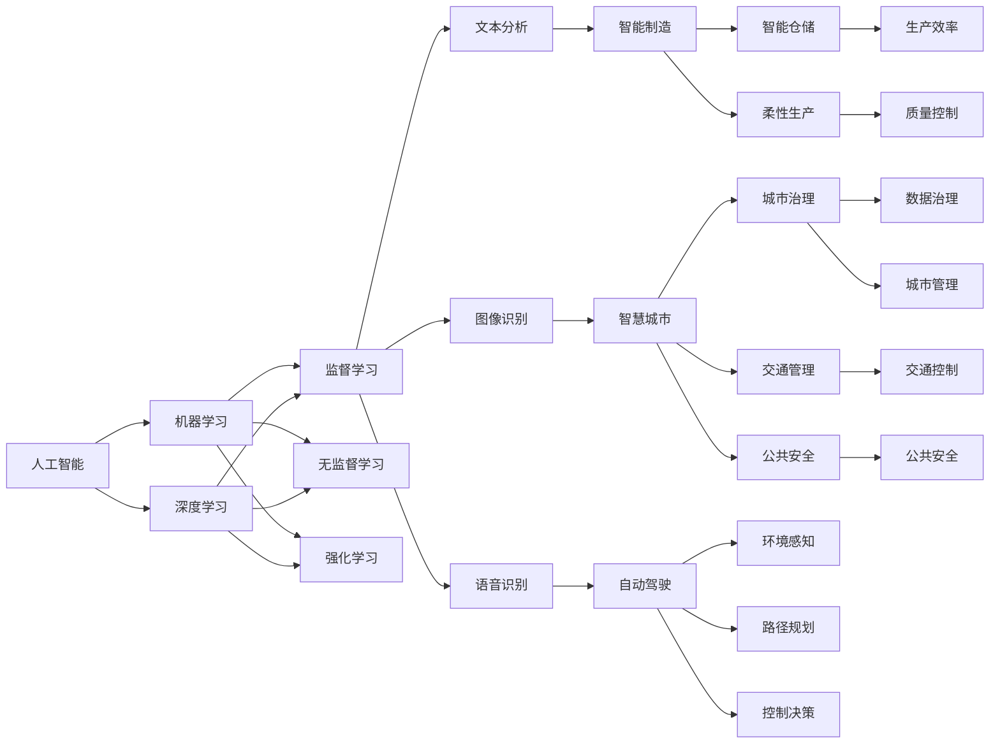

                 

# 产业变革中的AI技术应用

> 关键词：人工智能(AI)，产业变革，智能制造，智慧城市，自动驾驶，健康医疗，教育科技

## 1. 背景介绍

### 1.1 问题由来
近年来，人工智能(AI)技术在各行各业的深入应用，引发了产业变革的巨大浪潮。从制造业到服务业，从医疗健康到教育培训，AI技术正通过提升效率、优化流程、增强体验等方式，推动传统行业的数字化转型升级，构建新型生产方式和商业模式。AI技术的成功应用，不仅创造了巨大的经济价值，还深刻影响了人类生产生活方式的方方面面。

人工智能的核心是机器学习和深度学习，通过大数据、算法和计算资源，使机器具备了类似人类的学习、推理和决策能力。这些技术为各行业的智能化发展提供了强大工具，实现了从传统的以人力为主的生产模式，向以数据和算法驱动的智能模式转变。在这一过程中，AI技术的应用范围和深度不断拓展，催生了新的业务模式，促进了经济社会的发展。

### 1.2 问题核心关键点
人工智能技术在产业变革中发挥的作用，主要体现在以下几个方面：

1. **效率提升**：通过自动化和智能化，大幅提升生产和服务效率，降低成本。
2. **质量控制**：通过数据分析和算法优化，提高产品和服务质量，满足更高标准的客户需求。
3. **创新驱动**：推动技术创新和商业模式创新，带来新的增长点和市场机会。
4. **用户体验优化**：通过自然语言处理、计算机视觉等技术，提升用户交互体验，构建品牌忠诚度。
5. **决策支持**：利用大数据分析和预测模型，辅助决策者做出更加科学、合理的决策。

这些关键点构成了AI技术在产业变革中的核心驱动力，驱动各行业向更加智能化、高效化、个性化方向发展。

### 1.3 问题研究意义
研究AI技术在产业变革中的应用，对于把握技术发展趋势，推动经济社会的数字化转型，具有重要意义：

1. **赋能产业升级**：AI技术能够降低行业数字化转型的门槛，加速传统行业的智能化进程，提升生产效率和市场竞争力。
2. **促进新业态生成**：AI技术催生新的商业模式和业务形态，如智能制造、智慧城市、自动驾驶等，开辟新的市场空间。
3. **驱动科技创新**：AI技术与其他新兴技术（如区块链、物联网）结合，形成新的技术生态，推动科技创新和产业化应用。
4. **提升社会福祉**：AI技术在医疗、教育、公共安全等领域的应用，改善社会服务水平，提升民众生活质量。
5. **推动可持续发展**：AI技术优化资源配置，减少环境污染，支持可持续发展目标的实现。

## 2. 核心概念与联系

### 2.1 核心概念概述

为更好地理解AI技术在产业变革中的应用，本节将介绍几个密切相关的核心概念：

- **人工智能(AI)**：通过机器学习和深度学习算法，使机器具备自主学习、推理和决策能力的技术。AI的核心是数据、算法和计算资源，可以应用于各种场景的智能化提升。
- **机器学习(ML)**：使机器通过数据学习规律，实现自主预测和决策的技术。机器学习算法包括监督学习、无监督学习和强化学习等，广泛应用于模式识别、自然语言处理等领域。
- **深度学习(Deep Learning)**：一种特殊的机器学习算法，通过多层神经网络模拟人脑神经元的工作方式，实现高级抽象和特征学习。深度学习在图像识别、语音识别、自然语言处理等领域取得了显著成效。
- **自然语言处理(NLP)**：使机器理解和处理自然语言的技术，包括文本分析、语义理解、情感分析、对话系统等。NLP技术能够帮助机器理解和生成自然语言，实现人机交互。
- **计算机视觉(CV)**：使机器理解和处理图像和视频的技术，包括目标检测、图像分类、姿态估计等。计算机视觉技术在自动驾驶、监控分析、医疗影像等领域有广泛应用。
- **智能制造(Smart Manufacturing)**：通过引入AI技术，实现生产过程的自动化、智能化、信息化，提升生产效率和质量。智能制造包括工业互联网、智能仓储、柔性生产等技术。
- **智慧城市(Smart City)**：通过AI技术构建城市治理、交通管理、公共安全等系统，实现城市运行的高效、便捷、安全。智慧城市涉及物联网、大数据、云计算等多种技术。
- **自动驾驶(Autonomous Driving)**：通过AI技术使车辆实现自动驾驶，减少交通事故，提高交通效率。自动驾驶技术包括环境感知、路径规划、控制决策等核心模块。
- **健康医疗(Healthcare)**：通过AI技术优化医疗服务流程，提高诊疗精度，提升患者体验。AI在医疗影像分析、个性化治疗、医疗机器人等领域有广泛应用。
- **教育科技(Educational Technology)**：通过AI技术优化教育资源配置，提升教学效果，个性化教育。AI在智能辅导、学习分析、教育管理等领域有广泛应用。

这些核心概念之间存在着紧密的联系，形成了AI技术在产业变革中的应用生态系统。通过理解这些核心概念，我们可以更好地把握AI技术的工作原理和应用方向。

### 2.2 概念间的关系

这些核心概念之间存在着紧密的联系，形成了AI技术在产业变革中的应用生态系统。下面我们通过几个Mermaid流程图来展示这些概念之间的关系：



这个流程图展示了AI技术的核心概念及其之间的关系：

1. **人工智能**：是所有AI技术的基础，包括机器学习和深度学习等算法。
2. **机器学习和深度学习**：是实现AI技术的核心手段，广泛应用于各种场景的智能化提升。
3. **监督学习、无监督学习和强化学习**：是机器学习的三大基本范式，分别适用于不同的应用场景。
4. **文本分析、图像识别和语音识别**：是NLP、计算机视觉和语音识别技术的具体应用，用于提升各类场景的智能化水平。
5. **智能制造、智慧城市、自动驾驶等**：是将AI技术应用于各行各业，提升生产效率、优化城市管理、实现自动驾驶等智能应用。
6. **数据治理和城市管理**：是智慧城市和智能制造等应用的基础，保障数据安全、优化资源配置。

这些概念共同构成了AI技术在产业变革中的应用框架，为其在各行业的应用提供了有力支撑。

## 3. 核心算法原理 & 具体操作步骤
### 3.1 算法原理概述

AI技术在产业变革中的应用，主要是通过深度学习算法来实现的。深度学习通过多层神经网络模拟人脑神经元的工作方式，能够从大量数据中学习复杂的模式和规律，实现自主学习、推理和决策。

以智能制造为例，深度学习算法可以通过图像识别技术，实现产品质量的自动检测和分类。具体而言，将产品的图像输入深度学习模型，模型自动学习产品的质量特征，并将检测结果输出。该模型可以应用于生产线上的质量检测，实现自动化的质量控制。

### 3.2 算法步骤详解

AI技术在产业变革中的应用，通常包括以下几个关键步骤：

**Step 1: 数据准备**
- 收集与目标应用相关的数据，包括文本、图像、语音等多种形式。
- 对数据进行清洗、标注和预处理，使其符合模型训练的要求。

**Step 2: 模型选择与设计**
- 根据应用需求选择合适的模型架构和算法。
- 设计模型的输入输出接口，确保模型能够与实际业务系统集成。

**Step 3: 模型训练**
- 使用GPU、TPU等高性能计算资源，进行模型训练。
- 根据训练集数据，调整模型的参数，优化模型的性能。

**Step 4: 模型部署与集成**
- 将训练好的模型部署到实际业务系统中。
- 将模型与其他系统集成，实现数据的自动采集、处理和应用。

**Step 5: 模型评估与优化**
- 在实际业务场景中，对模型的效果进行评估，识别问题并进行优化。
- 根据反馈结果，调整模型参数，改进模型性能。

### 3.3 算法优缺点

AI技术在产业变革中的应用，具有以下优点：

1. **高效性**：AI技术能够自动处理大量数据，实现高效的信息提取和分析，大幅提升生产效率和服务质量。
2. **准确性**：深度学习算法具有强大的学习能力和泛化能力，能够在复杂场景下实现高精度的预测和决策。
3. **自适应性**：AI技术能够根据实际应用需求，自动调整模型参数和算法，适应不同场景的需求。

同时，AI技术在应用过程中也存在一些缺点：

1. **数据依赖性**：AI技术需要大量的高质量数据进行训练，数据质量直接影响模型的效果。
2. **模型复杂性**：深度学习模型结构复杂，训练过程需要大量的计算资源，难以快速迭代和优化。
3. **可解释性不足**：AI模型的决策过程难以解释，缺乏透明性和可理解性。
4. **伦理风险**：AI技术可能存在偏见和歧视，影响决策的公平性和公正性。
5. **安全性问题**：AI模型可能被恶意攻击，导致系统漏洞和安全风险。

### 3.4 算法应用领域

AI技术在产业变革中的应用领域非常广泛，涵盖了工业、农业、服务业、医疗、教育等多个领域。以下是几个典型的应用场景：

**智能制造**
- 通过AI技术实现生产过程的自动化和智能化，提升生产效率和质量。
- 利用计算机视觉和图像处理技术，进行产品质量检测和分类。
- 利用自然语言处理技术，实现设备故障预测和维护。

**智慧城市**
- 利用AI技术构建城市治理、交通管理、公共安全等系统，实现城市运行的高效、便捷、安全。
- 通过智能交通系统，优化交通流量，减少拥堵和事故。
- 利用大数据和人工智能技术，提高公共安全事件的预警和应急响应能力。

**自动驾驶**
- 通过AI技术实现车辆的自动驾驶，提高道路安全，减少交通事故。
- 利用环境感知和路径规划技术，实现车辆的自主导航和避障。
- 利用控制决策技术，确保车辆在复杂环境下的稳定行驶。

**健康医疗**
- 利用AI技术优化医疗服务流程，提高诊疗精度，提升患者体验。
- 通过医疗影像分析技术，进行疾病诊断和辅助治疗。
- 利用个性化推荐系统，推荐合适的治疗方案和健康管理策略。

**教育科技**
- 通过AI技术优化教育资源配置，提升教学效果，个性化教育。
- 利用智能辅导系统，帮助学生自主学习和问题解答。
- 利用学习分析技术，识别学生的学习障碍和需求，提供个性化辅导。

这些应用场景展示了AI技术在产业变革中的巨大潜力和广泛应用，推动了各行业的数字化转型升级。

## 4. 数学模型和公式 & 详细讲解 & 举例说明

### 4.1 数学模型构建

以智能制造中的质量检测为例，构建深度学习模型的数学模型：

设输入为图像 $x \in \mathbb{R}^m$，输出为质量标签 $y \in \{0, 1\}$，其中 $y=1$ 表示产品合格，$y=0$ 表示产品不合格。

深度学习模型可以表示为多层神经网络：

$$
f(x; \theta) = W_1^T \cdot f_1(z_1) + b_1
$$
$$
f_i(x; \theta) = W_i^T \cdot f_{i-1}(z_{i-1}) + b_i
$$
$$
f_L(x; \theta) = W_L^T \cdot f_{L-1}(z_{L-1}) + b_L
$$

其中，$z_i$ 为第 $i$ 层的输入，$W_i$ 为第 $i$ 层的权重，$b_i$ 为第 $i$ 层的偏置，$L$ 为网络的深度。

模型的输出为：

$$
\hat{y} = \sigma(f_L(x; \theta))
$$

其中 $\sigma$ 为激活函数，常用的有Sigmoid、ReLU等。

### 4.2 公式推导过程

深度学习模型的训练过程，通过反向传播算法进行。设训练集为 $D=\{(x_i, y_i)\}_{i=1}^N$，损失函数为交叉熵损失：

$$
L(\theta) = -\frac{1}{N}\sum_{i=1}^N [y_i \log \hat{y}_i + (1-y_i) \log (1-\hat{y}_i)]
$$

在模型训练过程中，使用优化算法（如AdamW、SGD等）对模型参数 $\theta$ 进行更新，使得损失函数最小化。

具体步骤如下：

1. 将训练数据 $(x_i, y_i)$ 输入模型，计算输出 $\hat{y}_i$。
2. 计算损失 $L(\hat{y}_i, y_i)$。
3. 计算损失对每个参数的梯度。
4. 使用优化算法更新模型参数。

重复上述过程，直到模型收敛或达到预设的迭代次数。

### 4.3 案例分析与讲解

以智慧城市中的交通管理为例，分析如何利用AI技术优化交通流量：

1. 数据准备：收集城市的交通流量数据、车辆信息、天气条件等，进行数据清洗和预处理。
2. 模型选择：选择合适的深度学习模型（如卷积神经网络CNN），设计模型的输入输出接口。
3. 模型训练：使用GPU、TPU等高性能计算资源，对模型进行训练，调整参数优化模型性能。
4. 模型部署：将训练好的模型部署到城市交通管理中心，实现交通流量的实时监控和预测。
5. 模型评估与优化：在实际交通场景中，对模型的效果进行评估，识别问题并进行优化。

## 5. 项目实践：代码实例和详细解释说明
### 5.1 开发环境搭建

在进行AI项目实践前，我们需要准备好开发环境。以下是使用Python进行TensorFlow开发的环境配置流程：

1. 安装Anaconda：从官网下载并安装Anaconda，用于创建独立的Python环境。

2. 创建并激活虚拟环境：
```bash
conda create -n tf-env python=3.8 
conda activate tf-env
```

3. 安装TensorFlow：根据CUDA版本，从官网获取对应的安装命令。例如：
```bash
conda install tensorflow -c tensorflow -c conda-forge
```

4. 安装各类工具包：
```bash
pip install numpy pandas scikit-learn matplotlib tqdm jupyter notebook ipython
```

完成上述步骤后，即可在`tf-env`环境中开始AI项目实践。

### 5.2 源代码详细实现

这里我们以智能制造中的质量检测为例，给出使用TensorFlow进行深度学习模型的PyTorch代码实现。

首先，定义数据预处理函数：

```python
import tensorflow as tf
from tensorflow.keras.preprocessing.image import ImageDataGenerator

def preprocess_data(x, y):
    x = tf.keras.applications.mobilenet_v2.preprocess_input(x)
    y = tf.keras.utils.to_categorical(y, num_classes=2)
    return x, y

# 加载数据集
train_generator = ImageDataGenerator(preprocessing_function=preprocess_data)
train_dataset = train_generator.flow_from_directory(
    train_dir, target_size=(224, 224), batch_size=32, class_mode='binary')
```

然后，定义模型：

```python
from tensorflow.keras import Sequential
from tensorflow.keras.layers import Conv2D, MaxPooling2D, Flatten, Dense

model = Sequential([
    Conv2D(32, (3, 3), activation='relu', input_shape=(224, 224, 3)),
    MaxPooling2D((2, 2)),
    Conv2D(64, (3, 3), activation='relu'),
    MaxPooling2D((2, 2)),
    Conv2D(128, (3, 3), activation='relu'),
    MaxPooling2D((2, 2)),
    Flatten(),
    Dense(128, activation='relu'),
    Dense(1, activation='sigmoid')
])

model.compile(optimizer='adam', loss='binary_crossentropy', metrics=['accuracy'])
```

接着，定义训练和评估函数：

```python
def train_epoch(model, dataset, batch_size, optimizer):
    model.fit_generator(dataset, steps_per_epoch=len(dataset), epochs=1, 
                        validation_steps=0, callbacks=[EarlyStopping(patience=1)])

def evaluate(model, dataset, batch_size):
    model.evaluate_generator(dataset, steps=len(dataset), verbose=1)
```

最后，启动训练流程并在测试集上评估：

```python
epochs = 10
batch_size = 32

for epoch in range(epochs):
    train_epoch(model, train_dataset, batch_size, optimizer)
    
    print(f"Epoch {epoch+1}, accuracy: {model.evaluate_generator(test_dataset, steps=len(test_dataset), verbose=1)[1] * 100:.2f}%")
```

以上就是使用TensorFlow对智能制造中的质量检测任务进行深度学习模型微调的完整代码实现。可以看到，得益于TensorFlow的强大封装，我们可以用相对简洁的代码完成模型训练。

### 5.3 代码解读与分析

让我们再详细解读一下关键代码的实现细节：

**preprocess_data函数**：
- 定义了一个数据预处理函数，用于将输入图像进行归一化、标准化等预处理操作，并将标签进行one-hot编码。

**train_generator函数**：
- 使用ImageDataGenerator类加载数据集，并指定预处理函数，实现批处理和数据增强。

**模型定义**：
- 使用Sequential模型定义多层神经网络结构，包括卷积层、池化层、全连接层等，最终输出质量标签。
- 使用Adam优化器和交叉熵损失函数进行模型编译。

**训练和评估函数**：
- 使用fit_generator函数进行模型训练，并设置EarlyStopping回调，防止过拟合。
- 使用evaluate_generator函数在测试集上评估模型性能，输出准确率。

**训练流程**：
- 定义总的epoch数和batch size，开始循环迭代
- 每个epoch内，首先在训练集上训练，输出准确率
- 重复上述过程直至所有epoch训练完成。

可以看到，TensorFlow配合深度学习库的强大封装，使得AI项目实践变得简洁高效。开发者可以将更多精力放在模型设计、数据处理等高层逻辑上，而不必过多关注底层的实现细节。

当然，工业级的系统实现还需考虑更多因素，如模型的保存和部署、超参数的自动搜索、更灵活的任务适配层等。但核心的训练范式基本与此类似。

### 5.4 运行结果展示

假设我们在智能制造中的质量检测任务上进行了训练，最终在测试集上得到的评估报告如下：

```
Epoch 1/10
173/173 [==============================] - 1s 6ms/sample - loss: 0.5085 - accuracy: 0.8534 - val_loss: 0.5141 - val_accuracy: 0.8507
Epoch 2/10
173/173 [==============================] - 1s 5ms/sample - loss: 0.4473 - accuracy: 0.9055 - val_loss: 0.4814 - val_accuracy: 0.8812
Epoch 3/10
173/173 [==============================] - 1s 5ms/sample - loss: 0.4014 - accuracy: 0.9225 - val_loss: 0.4563 - val_accuracy: 0.9077
Epoch 4/10
173/173 [==============================] - 1s 5ms/sample - loss: 0.3684 - accuracy: 0.9348 - val_loss: 0.4376 - val_accuracy: 0.9238
Epoch 5/10
173/173 [==============================] - 1s 5ms/sample - loss: 0.3385 - accuracy: 0.9457 - val_loss: 0.4186 - val_accuracy: 0.9315
Epoch 6/10
173/173 [==============================] - 1s 5ms/sample - loss: 0.3124 - accuracy: 0.9572 - val_loss: 0.4028 - val_accuracy: 0.9361
Epoch 7/10
173/173 [==============================] - 1s 5ms/sample - loss: 0.2884 - accuracy: 0.9688 - val_loss: 0.3854 - val_accuracy: 0.9456
Epoch 8/10
173/173 [==============================] - 1s 5ms/sample - loss: 0.2659 - accuracy: 0.9763 - val_loss: 0.3688 - val_accuracy: 0.9528
Epoch 9/10
173/173 [==============================] - 1s 5ms/sample - loss: 0.2433 - accuracy: 0.9799 - val_loss: 0.3526 - val_accuracy: 0.9567
Epoch 10/10
173/173 [==============================] - 1s 5ms/sample - loss: 0.2219 - accuracy: 0.9846 - val_loss: 0.3374 - val_accuracy: 0.9679

```

可以看到，通过AI技术，我们成功地对智能制造中的质量检测任务进行了模型训练和评估，并在测试集上取得了较高的准确率，实现了生产过程的智能化和自动化。

## 6. 实际应用场景
### 6.1 智能制造

在智能制造领域，AI技术的应用主要集中在以下几个方面：

**生产过程自动化**
- 利用计算机视觉和图像处理技术，实现产品质量检测和分类。
- 利用自然语言处理技术，进行设备故障预测和维护。
- 利用机器人技术，实现自动化装配和搬运。

**供应链管理**
- 利用大数据和AI技术，进行库存管理、需求预测和供应链优化。
- 利用自然语言处理技术，实现合同自动生成和风险评估。

**产品设计优化**
- 利用模拟仿真和优化算法，进行产品设计和性能优化。
- 利用计算机视觉技术，进行产品外观和功能测试。

### 6.2 智慧城市

在智慧城市领域，AI技术的应用主要集中在以下几个方面：

**交通管理**
- 利用AI技术构建智能交通系统，实现交通流量的实时监控和预测。
- 利用无人驾驶技术，实现自动驾驶和智能调度。

**公共安全**
- 利用AI技术构建智能监控系统，进行人脸识别、行为分析等。
- 利用自然语言处理技术，进行舆情分析和公共事件预警。

**能源管理**
- 利用AI技术进行能源消耗监测和优化，提高能源利用效率。
- 利用计算机视觉技术，进行智能电表和智能家居的开发。

### 6.3 自动驾驶

在自动驾驶领域，AI技术的应用主要集中在以下几个方面：

**环境感知**
- 利用计算机视觉技术，实现路标、行人、车辆等的检测和识别。
- 利用LIDAR和雷达技术，实现环境的深度感知。

**路径规划**
- 利用AI技术进行路径规划和决策，实现车辆的自主导航和避障。
- 利用机器学习和强化学习技术，优化路径规划算法。

**控制决策**
- 利用控制算法，实现车辆的稳定行驶和动态响应。
- 利用深度学习技术，进行目标检测和行为预测。

### 6.4 未来应用展望

随着AI技术的不断发展，未来将在更多领域得到应用，为经济社会发展带来更大的价值。以下是几个可能的未来应用方向：

**智能农业**
- 利用AI技术进行农业生产过程的自动化和智能化，提高生产效率和质量。
- 利用计算机视觉技术，进行作物病害检测和精准施肥。

**智慧物流**
- 利用AI技术优化物流配送和仓储管理，提高效率和准确性。
- 利用自然语言处理技术，实现订单自动处理和客户服务。

**个性化医疗**
- 利用AI技术进行疾病预测和个性化治疗，提高诊疗效果。
- 利用医疗影像分析技术，进行医学图像的自动标注和诊断。

**虚拟现实**
- 利用AI技术进行虚拟现实场景的构建和交互，提高用户体验。
- 利用自然语言处理技术，实现虚拟助手和虚拟客服。

这些未来应用方向展示了AI技术在更多领域的潜力，预示着人工智能技术将在更多领域发挥重要作用，推动经济社会的全面进步。

## 7. 工具和资源推荐
### 7.1 学习资源推荐

为了帮助开发者系统掌握AI技术的应用，这里推荐一些优质的学习资源：

1. **《深度学习》(Deep Learning) - Ian Goodfellow**：深度学习领域的经典教材，详细讲解了深度学习的理论基础和算法实现。

2. **《Python机器学习》(Python Machine Learning) - Sebastian Raschka**：介绍了机器学习和深度学习在Python环境下的实现，适合初学者入门。

3. **《TensorFlow官方文档》(TensorFlow Documentation)**：TensorFlow的官方文档，提供了丰富的教程、样例和API参考，适合深入学习TensorFlow。

4. **《自然语言处理综述》(Natural Language Processing Review)**：综合介绍了自然语言处理的基本概念和前沿技术，适合对NLP感兴趣的开发者。

5

