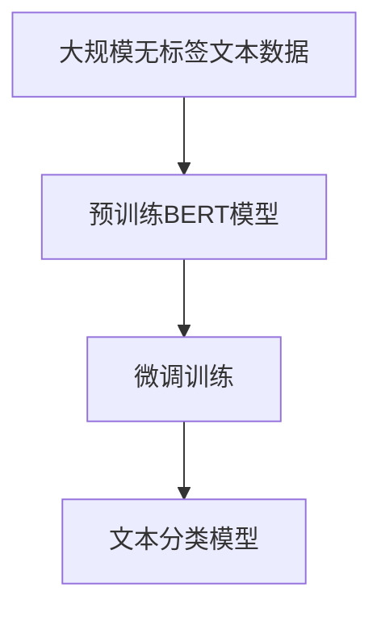

                 

# 从零开始大模型开发与微调：BERT实战文本分类

## 1. 背景介绍

在当今信息爆炸的时代，文本数据的处理和分析已经成为各行各业的重要需求。从社交媒体分析、新闻分类到客户评论情感分析，文本分类技术无处不在。而在大数据和深度学习的推动下，基于大模型(Big Models)的文本分类方法，已经开始引领行业前沿。

BERT(Bidirectional Encoder Representations from Transformers)作为一篇里程碑式的论文，不仅推翻了以往文本表示的方法，还引领了大模型的研究热潮。本博客将从零开始，详细讲解如何基于BERT模型开发和微调文本分类系统。希望通过本教程，读者能够对大模型和微调技术有一个全面的理解，并在实践中得到提升。

## 2. 核心概念与联系

### 2.1 核心概念概述

文本分类任务：是指将文本数据按照其内容进行分类的任务。文本分类的主要目标是从给定的文本数据中，识别出该文本所代表的类别。例如，可以将新闻文章分为科技、财经、体育等类别。

BERT模型：是由Google在2018年提出的一种预训练语言模型，其基于Transformer架构，能够捕捉文本中的上下文信息。BERT通过在大规模无标签文本数据上进行预训练，学习到丰富的语言表示，可以在各种NLP任务上取得优异的表现。

微调：是指在大模型的基础上，使用带有标签的文本数据进行有监督学习，从而将模型适配到特定的文本分类任务。微调的目标是优化模型在特定任务上的性能，使得模型能够更准确地对文本进行分类。

### 2.2 核心概念的联系

文本分类任务的解决通常基于大模型的微调。预训练模型（如BERT）在大规模文本数据上进行自监督预训练，学习到通用的语言表示，然后在特定任务上进行微调，学习特定的分类规则。微调不仅能够减少从头训练模型的复杂度，还能显著提高模型的性能。


通过Mermaid制作的流程图，可以直观地展示BERT模型进行文本分类时的微调过程：



## 3. 核心算法原理 & 具体操作步骤

### 3.1 算法原理概述

BERT模型进行文本分类的微调过程主要分为预训练和微调两个步骤。预训练是指在大规模无标签文本数据上，使用自监督学习方法对模型进行预训练，学习通用的语言表示。微调是指在特定任务（如文本分类）上，使用带标签的文本数据对模型进行有监督学习，优化模型在特定任务上的性能。

以文本分类为例，预训练和微调的过程可以用下图展示：


预训练阶段，BERT模型在包含大量文本数据的大型语料库上进行训练，学习到通用的语言表示。而微调阶段，模型会在特定任务的数据集上进行训练，学习到该任务的特定分类规则。这样，经过微调后的BERT模型可以更准确地对文本进行分类。

### 3.2 算法步骤详解

#### 3.2.1 数据准备

1. 数据集准备：选择一个大规模的无标签文本数据集，用于BERT模型的预训练。常用的数据集包括维基百科、新闻数据、小说等。
2. 标签数据准备：选择一个特定领域的带标签文本数据集，用于BERT模型的微调。标签数据集需要包含文本数据和对应的分类标签。

#### 3.2.2 BERT模型的加载

1. 安装依赖：使用pip安装transformers库和tensorflow库。
2. 加载BERT模型：使用transformers库中的BertModel类加载预训练的BERT模型。

#### 3.2.3 模型微调

1. 设置微调参数：包括学习率、批量大小、优化器等。
2. 编写微调代码：使用Keras等框架编写微调代码，包括数据预处理、模型构建、编译等步骤。

#### 3.2.4 训练与评估

1. 训练模型：使用训练数据集对模型进行训练。
2. 评估模型：使用验证数据集对模型进行评估，并输出评估结果。

#### 3.2.5 预测

1. 预测文本分类：使用测试数据集对模型进行预测，并输出分类结果。

### 3.3 算法优缺点

#### 3.3.1 优点

1. 减少从头训练时间：通过微调，可以利用预训练模型的大量知识，减少从头训练模型所需的时间。
2. 提高模型性能：通过微调，可以优化模型在特定任务上的性能，提高模型的分类准确率。
3. 降低标注成本：通过微调，可以充分利用已有标注数据，减少对新的标注数据的需求。

#### 3.3.2 缺点

1. 依赖标注数据：微调需要标注数据，标注数据的质量和数量会影响模型的性能。
2. 过拟合风险：微调过程可能会过拟合训练数据，导致模型在验证数据集上的性能下降。
3. 模型泛化性不足：微调后的模型对新数据的泛化能力可能不如预训练模型。

### 3.4 算法应用领域

BERT模型已经广泛应用于多个NLP任务，如文本分类、情感分析、命名实体识别、问答系统等。通过微调，可以在不同的应用场景中，将BERT模型适配到具体的文本分类任务中。

## 4. 数学模型和公式 & 详细讲解 & 举例说明

### 4.1 数学模型构建

文本分类的目标是从给定的文本数据中，识别出该文本所代表的类别。假设文本数据为 $x = (x_1, x_2, ..., x_n)$，每个文本由一个或多个单词组成，且每个单词 $x_i$ 可以表示为一个one-hot向量 $x_i \in \{0,1\}^{d}$。假设文本分类任务有 $k$ 个类别，则分类标签 $y \in \{0,1\}^k$。

对于文本分类任务，可以使用softmax函数对模型输出进行归一化，得到每个类别的概率：

$$ P(y|x) = \frac{e^{W_x \cdot x + b_x}}{\sum_{i=1}^k e^{W_i \cdot x + b_i}} $$

其中 $W_i$ 和 $b_i$ 为线性层权重和偏置，$x$ 为输入文本向量。通过交叉熵损失函数，可以计算模型的预测结果与真实标签之间的差异：

$$ L(x,y) = -\sum_{i=1}^k y_i \log P(y|x) $$

### 4.2 公式推导过程

以二分类任务为例，假设模型的输出为 $P(y|x)$，其中 $y \in \{0,1\}$，$x \in \mathbb{R}^d$。

假设模型输出为 $P(y|x) = \sigma(W \cdot x + b)$，其中 $W \in \mathbb{R}^{d\times k}$，$b \in \mathbb{R}^{k}$，$\sigma$ 为sigmoid函数。则模型的交叉熵损失函数为：

$$ L(x,y) = -y \log \sigma(W \cdot x + b) - (1-y) \log (1-\sigma(W \cdot x + b)) $$

对 $L(x,y)$ 求导，得到损失函数对权重矩阵 $W$ 的梯度：

$$ \frac{\partial L}{\partial W} = (y - \sigma(W \cdot x + b)) x^T $$

对模型输出 $P(y|x)$ 求导，得到损失函数对模型参数的梯度：

$$ \frac{\partial L}{\partial \theta} = \frac{\partial L}{\partial P(y|x)} \frac{\partial P(y|x)}{\partial \theta} $$

其中 $\theta$ 包括权重矩阵 $W$ 和偏置向量 $b$。

### 4.3 案例分析与讲解

假设我们有一个二分类任务，其中训练集包含100个文本样本和对应的标签。我们将使用BERT模型进行微调。

1. 数据准备：使用IMDB影评数据集，包含25,000个标注样本。
2. 加载BERT模型：使用transformers库中的BertTokenizer和BertForSequenceClassification类加载预训练的BERT模型。
3. 设置微调参数：包括学习率、批量大小、优化器等。
4. 编写微调代码：使用Keras编写微调代码，包括数据预处理、模型构建、编译等步骤。
5. 训练与评估：使用训练数据集对模型进行训练，使用验证数据集对模型进行评估。
6. 预测：使用测试数据集对模型进行预测，并输出分类结果。

## 5. 项目实践：代码实例和详细解释说明

### 5.1 开发环境搭建

1. 安装依赖：使用pip安装transformers、keras、tensorflow等库。
2. 安装BERT预训练模型：下载预训练的BERT模型和分词器。
3. 准备数据集：将IMDB影评数据集划分为训练集、验证集和测试集。

### 5.2 源代码详细实现

```python
import tensorflow as tf
import keras
from transformers import BertTokenizer, TFBertForSequenceClassification

# 加载BERT模型和分词器
tokenizer = BertTokenizer.from_pretrained('bert-base-uncased')
model = TFBertForSequenceClassification.from_pretrained('bert-base-uncased', num_labels=2)

# 准备数据集
train_dataset = ...
val_dataset = ...
test_dataset = ...

# 设置微调参数
learning_rate = 2e-5
num_epochs = 5
batch_size = 16

# 编写微调代码
def train(model, train_dataset, val_dataset, learning_rate, num_epochs, batch_size):
    optimizer = tf.keras.optimizers.Adam(learning_rate=learning_rate)
    model.compile(optimizer=optimizer, loss=keras.losses.SparseCategoricalCrossentropy(from_logits=True), metrics=[keras.metrics.SparseCategoricalAccuracy()])
    model.fit(train_dataset, epochs=num_epochs, batch_size=batch_size, validation_data=val_dataset)

# 训练与评估
train(model, train_dataset, val_dataset, learning_rate, num_epochs, batch_size)

# 预测
test_loss, test_acc = model.evaluate(test_dataset)
print('Test accuracy:', test_acc)
```

### 5.3 代码解读与分析

在上述代码中，我们首先使用transformers库加载BERT模型和分词器，然后准备数据集。在训练阶段，我们使用Adam优化器进行模型优化，并使用SparseCategoricalCrossentropy作为损失函数，计算模型的预测结果与真实标签之间的差异。在评估阶段，我们使用验证数据集对模型进行评估，并输出评估结果。在预测阶段，我们使用测试数据集对模型进行预测，并输出分类结果。

## 6. 实际应用场景

### 6.4 未来应用展望

随着BERT等大模型的不断进步，基于大模型的文本分类技术将在更多领域得到应用，为各行各业带来变革性影响。

在金融领域，文本分类技术可以用于分析客户投诉、监控舆情，帮助金融机构及时发现和解决问题，降低风险。

在医疗领域，文本分类技术可以用于分析医疗记录、医学文献，帮助医生快速诊断疾病、制定治疗方案。

在教育领域，文本分类技术可以用于分析学生作业、考试答案，帮助教师评估学生学习情况，提供个性化辅导。

未来，随着大模型和微调技术的不断发展，文本分类技术将越来越智能化、普适化，帮助各行各业提高效率、降低成本，为人类社会带来更多福祉。

## 7. 工具和资源推荐

### 7.1 学习资源推荐

1. 《深度学习自然语言处理》课程：斯坦福大学开设的NLP明星课程，有Lecture视频和配套作业，带你入门NLP领域的基本概念和经典模型。
2. 《Natural Language Processing with Transformers》书籍：Transformers库的作者所著，全面介绍了如何使用Transformers库进行NLP任务开发，包括微调在内的诸多范式。
3. CS224N《深度学习自然语言处理》讲义：斯坦福大学深度学习课程的讲义，详细介绍了NLP任务的基本框架和优化策略。
4. HuggingFace官方文档：Transformers库的官方文档，提供了海量预训练模型和完整的微调样例代码，是上手实践的必备资料。

### 7.2 开发工具推荐

1. PyTorch：基于Python的开源深度学习框架，灵活动态的计算图，适合快速迭代研究。
2. TensorFlow：由Google主导开发的开源深度学习框架，生产部署方便，适合大规模工程应用。
3. Keras：高级深度学习框架，可以轻松构建神经网络模型，适用于各种NLP任务。

### 7.3 相关论文推荐

1. Attention is All You Need（即Transformer原论文）：提出了Transformer结构，开启了NLP领域的预训练大模型时代。
2. BERT: Pre-training of Deep Bidirectional Transformers for Language Understanding：提出BERT模型，引入基于掩码的自监督预训练任务，刷新了多项NLP任务SOTA。
3. Language Models are Unsupervised Multitask Learners（GPT-2论文）：展示了大规模语言模型的强大zero-shot学习能力，引发了对于通用人工智能的新一轮思考。
4. Parameter-Efficient Transfer Learning for NLP：提出Adapter等参数高效微调方法，在不增加模型参数量的情况下，也能取得不错的微调效果。

这些论文代表了大语言模型微调技术的发展脉络。通过学习这些前沿成果，可以帮助研究者把握学科前进方向，激发更多的创新灵感。

## 8. 总结：未来发展趋势与挑战

### 8.1 总结

本博客详细讲解了基于BERT模型的文本分类任务的开发和微调过程。通过介绍大模型的预训练和微调技术，希望读者能够对NLP任务有一个全面的理解，并在实践中得到提升。

文本分类任务的解决通常基于大模型的微调。预训练模型在大规模文本数据上进行训练，学习到通用的语言表示，然后在特定任务上进行微调，学习到该任务的特定分类规则。微调不仅能够减少从头训练模型所需的时间，还能提高模型在特定任务上的性能。

### 8.2 未来发展趋势

展望未来，大模型和微调技术将呈现以下几个发展趋势：

1. 模型规模持续增大：随着算力成本的下降和数据规模的扩张，预训练语言模型的参数量还将持续增长。超大规模语言模型蕴含的丰富语言知识，有望支撑更加复杂多变的下游任务微调。
2. 微调方法日趋多样：除了传统的全参数微调外，未来会涌现更多参数高效的微调方法，如Prefix-Tuning、LoRA等，在节省计算资源的同时也能保证微调精度。
3. 持续学习成为常态：随着数据分布的不断变化，微调模型也需要持续学习新知识以保持性能。如何在不遗忘原有知识的同时，高效吸收新样本信息，将成为重要的研究课题。
4. 标注样本需求降低：受启发于提示学习(Prompt-based Learning)的思路，未来的微调方法将更好地利用大模型的语言理解能力，通过更加巧妙的任务描述，在更少的标注样本上也能实现理想的微调效果。
5. 多模态微调崛起：当前的微调主要聚焦于纯文本数据，未来会进一步拓展到图像、视频、语音等多模态数据微调。多模态信息的融合，将显著提升语言模型对现实世界的理解和建模能力。
6. 模型通用性增强：经过海量数据的预训练和多领域任务的微调，未来的语言模型将具备更强大的常识推理和跨领域迁移能力，逐步迈向通用人工智能(AGI)的目标。

这些趋势凸显了大语言模型微调技术的广阔前景。这些方向的探索发展，必将进一步提升NLP系统的性能和应用范围，为人类认知智能的进化带来深远影响。

### 8.3 面临的挑战

尽管大语言模型微调技术已经取得了瞩目成就，但在迈向更加智能化、普适化应用的过程中，它仍面临着诸多挑战：

1. 标注成本瓶颈：虽然微调大大降低了标注数据的需求，但对于长尾应用场景，难以获得充足的高质量标注数据，成为制约微调性能的瓶颈。如何进一步降低微调对标注样本的依赖，将是一大难题。
2. 模型鲁棒性不足：当前微调模型面对域外数据时，泛化性能往往大打折扣。对于测试样本的微小扰动，微调模型的预测也容易发生波动。如何提高微调模型的鲁棒性，避免灾难性遗忘，还需要更多理论和实践的积累。
3. 推理效率有待提高：大规模语言模型虽然精度高，但在实际部署时往往面临推理速度慢、内存占用大等效率问题。如何在保证性能的同时，简化模型结构，提升推理速度，优化资源占用，将是重要的优化方向。
4. 可解释性亟需加强：当前微调模型更像是"黑盒"系统，难以解释其内部工作机制和决策逻辑。对于医疗、金融等高风险应用，算法的可解释性和可审计性尤为重要。如何赋予微调模型更强的可解释性，将是亟待攻克的难题。
5. 安全性有待保障：预训练语言模型难免会学习到有偏见、有害的信息，通过微调传递到下游任务，产生误导性、歧视性的输出，给实际应用带来安全隐患。如何从数据和算法层面消除模型偏见，避免恶意用途，确保输出的安全性，也将是重要的研究课题。
6. 知识整合能力不足：现有的微调模型往往局限于任务内数据，难以灵活吸收和运用更广泛的先验知识。如何让微调过程更好地与外部知识库、规则库等专家知识结合，形成更加全面、准确的信息整合能力，还有很大的想象空间。

正视微调面临的这些挑战，积极应对并寻求突破，将是大语言模型微调走向成熟的必由之路。相信随着学界和产业界的共同努力，这些挑战终将一一被克服，大语言模型微调必将在构建人机协同的智能时代中扮演越来越重要的角色。

### 8.4 研究展望

面对大语言模型微调所面临的种种挑战，未来的研究需要在以下几个方面寻求新的突破：

1. 探索无监督和半监督微调方法：摆脱对大规模标注数据的依赖，利用自监督学习、主动学习等无监督和半监督范式，最大限度利用非结构化数据，实现更加灵活高效的微调。
2. 研究参数高效和计算高效的微调范式：开发更加参数高效的微调方法，在固定大部分预训练参数的同时，只更新极少量的任务相关参数。同时优化微调模型的计算图，减少前向传播和反向传播的资源消耗，实现更加轻量级、实时性的部署。
3. 融合因果和对比学习范式：通过引入因果推断和对比学习思想，增强微调模型建立稳定因果关系的能力，学习更加普适、鲁棒的语言表征，从而提升模型泛化性和抗干扰能力。
4. 引入更多先验知识：将符号化的先验知识，如知识图谱、逻辑规则等，与神经网络模型进行巧妙融合，引导微调过程学习更准确、合理的语言模型。同时加强不同模态数据的整合，实现视觉、语音等多模态信息与文本信息的协同建模。
5. 结合因果分析和博弈论工具：将因果分析方法引入微调模型，识别出模型决策的关键特征，增强输出解释的因果性和逻辑性。借助博弈论工具刻画人机交互过程，主动探索并规避模型的脆弱点，提高系统稳定性。
6. 纳入伦理道德约束：在模型训练目标中引入伦理导向的评估指标，过滤和惩罚有偏见、有害的输出倾向。同时加强人工干预和审核，建立模型行为的监管机制，确保输出符合人类价值观和伦理道德。

这些研究方向的探索，必将引领大语言模型微调技术迈向更高的台阶，为构建安全、可靠、可解释、可控的智能系统铺平道路。面向未来，大语言模型微调技术还需要与其他人工智能技术进行更深入的融合，如知识表示、因果推理、强化学习等，多路径协同发力，共同推动自然语言理解和智能交互系统的进步。只有勇于创新、敢于突破，才能不断拓展语言模型的边界，让智能技术更好地造福人类社会。

---

作者：禅与计算机程序设计艺术 / Zen and the Art of Computer Programming

