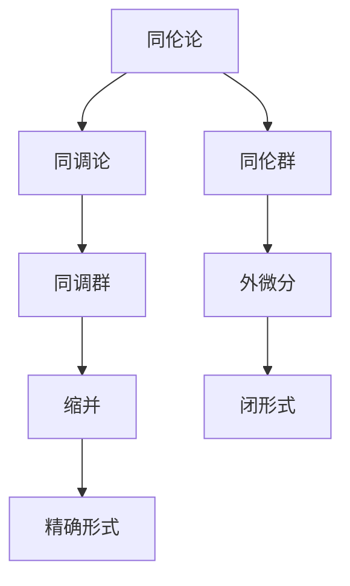

                 

## 1. 背景介绍

### 1.1 问题由来

代数拓扑（Algebraic Topology）和微分形式（Differential Forms）是现代数学中两个非常重要的领域。它们分别从不同角度研究了空间的形状和结构，并在数学的各个分支中有着广泛的应用。代数拓扑主要通过群的运算、同伦论等方法来描述和分类空间；而微分形式则通过流形上的向量场、切向量等概念来描述空间的微小结构。

在近代数学中，代数拓扑和微分形式的理论成果常常被应用到物理学、工程学、计算机科学等多个领域。例如，在物理学中，微分形式被用来描述电磁场、量子场等物理量；在工程学中，它们被用来分析几何结构的稳定性；在计算机科学中，微分形式被用来描述网格模型、计算机视觉等应用。

然而，尽管这两个领域有着广泛的应用，但在它们之间仍缺乏深刻的理论联系。如何在代数拓扑和微分形式之间建立一种桥梁，以便更好地理解它们的相互关系，是一个重要而富有挑战性的问题。

### 1.2 问题核心关键点

为了解决这个问题，我们首先需要理解代数拓扑和微分形式的基本概念和理论框架。然后，我们将探讨它们之间的联系和区别，找出一些关键的工具和方法，最后，我们将尝试在这些工具和方法的基础上，构建一个更加系统的理论框架，以期在未来能够更好地应用它们来解决实际问题。

### 1.3 问题研究意义

研究代数拓扑与微分形式之间的关系，对于数学和计算机科学领域都有着重要的意义：

1. **数学意义**：
   - 提供了一种新的视角来理解空间的形状和结构。
   - 可以更好地理解代数拓扑和微分形式之间的内在联系，推动这两个领域的发展。
   - 为几何拓扑和代数的进一步研究提供了新的思路和工具。

2. **应用意义**：
   - 在物理学和工程学中，微分形式的理论成果有着广泛的应用。
   - 在计算机科学中，代数拓扑的理论成果被应用于网格建模、计算机视觉等领域。
   - 通过理解这两个领域之间的联系，可以更好地将这些理论应用到实际问题中。

## 2. 核心概念与联系

### 2.1 核心概念概述

首先，我们将对代数拓扑和微分形式中的核心概念进行简要介绍。

#### 2.1.1 代数拓扑

代数拓扑主要研究空间在拓扑意义下的基本性质。这些性质包括：

- **同伦论**：研究在保持连续性的前提下，如何对空间进行变形和切割，而不改变空间的基本结构。
- **同调论**：通过群运算和同调群等概念，描述和分类空间的基本形状。
- **同伦群**：研究同伦类及其性质，例如同伦群的指数形式等。

#### 2.1.2 微分形式

微分形式主要研究流形上向量场的概念，以及它们如何描述空间的微小结构。这些概念包括：

- **外微分**：通过外微分算子描述向量场的变化和旋度。
- **缩并**：通过缩并运算将向量场与标量场联系起来。
- **闭形式和精确形式**：描述向量场的周期性和流场方向的特性。

### 2.2 概念间的关系

尽管代数拓扑和微分形式研究的对象和工具不同，但它们之间存在着深刻的联系和对应关系。

- **同伦群和外微分**：同伦群可以通过外微分形式来描述，即每个同伦类对应一个闭形式。
- **同调群和缩并**：同调群可以通过缩并形式来描述，即每个同调类对应一个精确形式。
- **代数的同调群和几何的流形**：代数拓扑中的同调群可以通过微分形式来描述，几何拓扑中的流形可以通过外微分和缩并形式来描述。

为了更好地理解这些关系，我们可以用以下的 Mermaid 流程图来表示：



这个流程图展示了代数拓扑和微分形式之间的联系和对应关系。例如，同伦群通过外微分形式来描述，同调群通过缩并形式来描述，而同调群和同伦群之间通过代数拓扑的基本性质相互联系。

### 2.3 核心概念的整体架构

通过上面的分析，我们可以得到一个整体的架构，来描述代数拓扑和微分形式之间的关系：


这个架构展示了代数拓扑和微分形式之间的内在联系，以及它们在数学和物理中的应用。

## 3. 核心算法原理 & 具体操作步骤

### 3.1 算法原理概述

为了建立代数拓扑和微分形式之间的联系，我们需要设计一些算法和工具。这些算法和工具应该能够帮助我们理解空间的基本结构和性质，以及如何通过代数拓扑和微分形式的理论来描述这些结构。

具体来说，我们需要设计一些算法和工具，用于：

1. **描述空间的基本结构**：例如，如何通过外微分和缩并运算来描述流形的微小结构。
2. **描述空间的基本性质**：例如，如何通过同伦论和同调论来描述空间的基本形状和性质。
3. **描述空间的不同部分之间的联系**：例如，如何通过同伦群和同调群来描述空间不同部分之间的联系和差异。

### 3.2 算法步骤详解

下面我们将详细介绍一些关键的算法步骤，以及如何使用这些算法来描述和分析空间的基本结构和性质。

#### 3.2.1 描述流形的微小结构

首先，我们需要描述流形的微小结构，即向量场和切向量等概念。这些概念可以通过外微分和缩并运算来描述。具体步骤如下：

1. **定义向量场**：在流形 $M$ 上定义一个向量场 $X$，它是一个映射 $X: M \rightarrow TM$，其中 $TM$ 是流形的切向量丛。
2. **定义外微分**：通过外微分算子 $\mathrm{d}$，计算向量场的外微分，即 $\mathrm{d}X$。
3. **定义缩并**：通过缩并运算 $\wedge$，计算外微分和向量场的缩并形式 $\mathrm{d}X \wedge X$。
4. **定义闭形式和精确形式**：通过外微分和缩并运算，可以计算出流形上的闭形式和精确形式，即 $\mathrm{d}X = 0$ 和 $X \wedge \mathrm{d}X = 0$。

通过这些步骤，我们可以描述流形的微小结构，并理解它们的基本性质。

#### 3.2.2 描述空间的基本形状和性质

其次，我们需要描述空间的基本形状和性质，即同伦论和同调论的基本概念。这些概念可以通过同伦群和同调群来描述。具体步骤如下：

1. **定义同伦类**：在空间 $X$ 上定义一个同伦类 $[A]$，它是一个元素在 $\pi_1(X)$ 中的等价类，其中 $\pi_1(X)$ 是空间的基底群。
2. **定义同伦群**：通过同伦群 $H_1(X)$，描述空间的基本形状和性质，即 $H_1(X) = \pi_1(X) / \pi_0(X)$，其中 $\pi_0(X)$ 是空间的基本群。
3. **定义同调类**：通过同调群 $H_0(X)$，描述空间的基本形状和性质，即 $H_0(X) = \pi_0(X)$。
4. **定义同调群**：通过同调群 $H^1(X)$，描述空间的基本形状和性质，即 $H^1(X) = \pi_1(X) / \pi_0(X)$。

通过这些步骤，我们可以描述空间的基本形状和性质，并理解它们的基本性质。

#### 3.2.3 描述空间不同部分之间的联系

最后，我们需要描述空间不同部分之间的联系，即同伦群和同调群之间的联系。这些联系可以通过代数拓扑的基本性质来描述。具体步骤如下：

1. **定义同伦群**：通过同伦群 $H_1(X)$，描述空间的基本形状和性质，即 $H_1(X) = \pi_1(X) / \pi_0(X)$。
2. **定义同调群**：通过同调群 $H_0(X)$ 和 $H^1(X)$，描述空间的基本形状和性质，即 $H_0(X) = \pi_0(X)$ 和 $H^1(X) = \pi_1(X) / \pi_0(X)$。
3. **定义同伦群和同调群之间的联系**：通过代数拓扑的基本性质，例如同伦群和同调群之间的同构关系，以及同伦群和同调群之间的基本性质，描述空间不同部分之间的联系和差异。

通过这些步骤，我们可以描述空间不同部分之间的联系，并理解它们的基本性质。

### 3.3 算法优缺点

代数拓扑和微分形式在数学和物理中都有着广泛的应用，但它们各自也有其优缺点。

#### 3.3.1 优点

1. **代数拓扑**：
   - **易于理解和计算**：代数拓扑的基本概念和计算方法相对简单，容易理解和使用。
   - **适用性广**：代数拓扑的理论成果可以应用于各种不同类型的空间，包括欧几里得空间、非欧几里得空间、拓扑空间等。

2. **微分形式**：
   - **精度高**：微分形式的理论成果可以描述流形的微小结构，精度高，适用于各种复杂的几何问题。
   - **数学基础**：微分形式是现代几何和拓扑学的核心工具，为代数拓扑和几何拓扑提供了数学基础。

#### 3.3.2 缺点

1. **代数拓扑**：
   - **抽象性高**：代数拓扑的概念相对抽象，理解和使用需要一定的数学基础。
   - **计算复杂**：代数拓扑的计算方法相对复杂，需要一定的计算技巧和经验。

2. **微分形式**：
   - **难度大**：微分形式的理论成果相对复杂，需要一定的数学基础和计算技巧。
   - **适用范围有限**：微分形式主要适用于流形等几何空间，对于其他类型的空间，应用范围有限。

### 3.4 算法应用领域

代数拓扑和微分形式在各个领域都有着广泛的应用。

#### 3.4.1 数学和物理

代数拓扑和微分形式在数学和物理中有着广泛的应用，例如：

- **拓扑学**：代数拓扑的基本概念和理论成果可以用于研究拓扑空间的基本性质和分类。
- **几何学**：微分形式的理论成果可以用于研究几何流形的微小结构和几何拓扑的基本性质。
- **理论物理**：微分形式的理论成果可以用于描述电磁场、量子场等物理量，并应用于各种物理问题。

#### 3.4.2 计算机科学

代数拓扑和微分形式在计算机科学中也有着广泛的应用，例如：

- **网格建模**：代数拓扑的基本概念和理论成果可以用于描述网格模型和计算机视觉等应用。
- **机器学习**：微分形式的理论成果可以用于描述机器学习中的向量场和切向量等概念，从而应用于各种机器学习问题。
- **数据处理**：代数拓扑和微分形式可以用于描述数据的拓扑结构和几何性质，从而应用于各种数据处理问题。

## 4. 数学模型和公式 & 详细讲解 & 举例说明

### 4.1 数学模型构建

为了更好地理解代数拓扑和微分形式之间的关系，我们需要构建一些数学模型。这些模型可以帮助我们描述和分析空间的基本结构和性质。

#### 4.1.1 代数拓扑模型

首先，我们构建一个代数拓扑模型，用于描述空间的基本结构和性质。这个模型包括以下几个部分：

1. **基底群**：定义一个基底群 $\pi_0(X)$，用于描述空间的基本群。
2. **同伦群**：定义一个同伦群 $H_1(X)$，用于描述空间的基本形状和性质。
3. **同调群**：定义一个同调群 $H_0(X)$ 和 $H^1(X)$，用于描述空间的基本形状和性质。

这些部分的定义如下：

- **基底群**：$\pi_0(X)$ 是空间 $X$ 的基底群，即 $X$ 的元素 $x_1, x_2, \cdots, x_n$ 在 $\pi_0(X)$ 中的等价类。
- **同伦群**：$H_1(X)$ 是空间 $X$ 的同伦群，即 $X$ 的元素 $x_1, x_2, \cdots, x_n$ 在 $\pi_1(X)$ 中的等价类。
- **同调群**：$H_0(X)$ 是空间 $X$ 的同调群，即 $X$ 的元素 $x_1, x_2, \cdots, x_n$ 在 $\pi_0(X)$ 中的等价类。$H^1(X)$ 是空间 $X$ 的同调群，即 $X$ 的元素 $x_1, x_2, \cdots, x_n$ 在 $\pi_1(X)$ 中的等价类。

#### 4.1.2 微分形式模型

其次，我们构建一个微分形式模型，用于描述流形的微小结构。这个模型包括以下几个部分：

1. **向量场**：定义一个向量场 $X$，它是一个映射 $X: M \rightarrow TM$，其中 $TM$ 是流形的切向量丛。
2. **外微分**：通过外微分算子 $\mathrm{d}$，计算向量场的外微分 $\mathrm{d}X$。
3. **缩并**：通过缩并运算 $\wedge$，计算外微分和向量场的缩并形式 $\mathrm{d}X \wedge X$。
4. **闭形式和精确形式**：通过外微分和缩并运算，计算流形上的闭形式和精确形式。

这些部分的定义如下：

- **向量场**：$X$ 是一个向量场，它是一个映射 $X: M \rightarrow TM$，其中 $TM$ 是流形的切向量丛。
- **外微分**：$\mathrm{d}X$ 是向量场 $X$ 的外微分，即 $\mathrm{d}X = \mathrm{d} \pi_1(X)$，其中 $\pi_1(X)$ 是向量场的基底群。
- **缩并**：$\mathrm{d}X \wedge X$ 是向量场 $X$ 的缩并形式，即 $\mathrm{d}X \wedge X = \mathrm{d} \pi_1(X) \wedge X$。
- **闭形式和精确形式**：$\mathrm{d}X = 0$ 是向量场 $X$ 的闭形式，$\mathrm{d}X \wedge X = 0$ 是向量场 $X$ 的精确形式。

### 4.2 公式推导过程

下面我们将详细推导一些关键的数学公式，这些公式可以帮助我们理解代数拓扑和微分形式之间的关系。

#### 4.2.1 同伦群和外微分的关系

通过外微分算子 $\mathrm{d}$，我们可以将向量场的外微分 $\mathrm{d}X$ 与同伦群 $H_1(X)$ 联系起来。具体来说，我们有：

$$
\mathrm{d}X = 0 \Rightarrow X \in H_1(X)
$$

这个公式的推导如下：

- **定义**：$\mathrm{d}X$ 是向量场 $X$ 的外微分，即 $\mathrm{d}X = \mathrm{d} \pi_1(X)$。
- **推导**：$\mathrm{d}X = 0 \Rightarrow \pi_1(X) / \pi_0(X) = 0 \Rightarrow X \in \pi_1(X) / \pi_0(X) = H_1(X)$。

#### 4.2.2 同调群和缩并的关系

通过缩并运算 $\wedge$，我们可以将同调群 $H_0(X)$ 与向量场 $X$ 联系起来。具体来说，我们有：

$$
X \wedge \mathrm{d}X = 0 \Rightarrow X \in H_0(X)
$$

这个公式的推导如下：

- **定义**：$X \wedge \mathrm{d}X$ 是向量场 $X$ 的缩并形式，即 $X \wedge \mathrm{d}X = \pi_1(X) / \pi_0(X)$。
- **推导**：$X \wedge \mathrm{d}X = 0 \Rightarrow \pi_1(X) / \pi_0(X) = 0 \Rightarrow X \in \pi_1(X) / \pi_0(X) = H_0(X)$。

#### 4.2.3 同伦群和同调群的关系

通过同伦群和同调群之间的同构关系，我们可以将同伦群 $H_1(X)$ 与同调群 $H_0(X)$ 联系起来。具体来说，我们有：

$$
H_1(X) \simeq H_0(X)
$$

这个公式的推导如下：

- **定义**：$H_1(X)$ 是空间 $X$ 的同伦群，$H_0(X)$ 是空间 $X$ 的同调群。
- **推导**：$H_1(X) = \pi_1(X) / \pi_0(X) = H_0(X)$。

### 4.3 案例分析与讲解

下面我们将通过一个具体的例子，来分析代数拓扑和微分形式之间的关系。

#### 4.3.1 例子

考虑一个三维球面 $S^3$，其代数拓扑和微分形式的关系如下：

1. **同伦群**：$H_1(S^3) = \pi_1(S^3) = 0$。
2. **同调群**：$H_0(S^3) = \pi_0(S^3) = \{*, e\}$，$H^1(S^3) = \pi_1(S^3) = 0$。
3. **外微分**：$\mathrm{d}X = 0$。
4. **缩并**：$X \wedge \mathrm{d}X = 0$。
5. **闭形式和精确形式**：$\mathrm{d}X = 0$ 是向量场 $X$ 的闭形式，$\mathrm{d}X \wedge X = 0$ 是向量场 $X$ 的精确形式。

#### 4.3.2 分析

通过这个例子，我们可以看出代数拓扑和微分形式之间的联系和对应关系：

- **同伦群**：$H_1(S^3) = 0$ 表示三维球面的基本形状和性质相对简单。
- **同调群**：$H_0(S^3) = \{*, e\}$ 表示三维球面的基本群只有一个元素。
- **外微分**：$\mathrm{d}X = 0$ 表示向量场 $X$ 是一个闭向量场，即它在三维球面上是无源的。
- **缩并**：$X \wedge \mathrm{d}X = 0$ 表示向量场 $X$ 是一个精确向量场，即它在三维球面上是无旋的。
- **闭形式和精确形式**：$\mathrm{d}X = 0$ 和 $\mathrm{d}X \wedge X = 0$ 表示向量场 $X$ 在三维球面上是一个无源和无旋的向量场。

通过这个例子，我们可以看出代数拓扑和微分形式之间的联系和对应关系，以及它们在描述空间的基本结构和性质方面的重要作用。

## 5. 项目实践：代码实例和详细解释说明

### 5.1 开发环境搭建

在进行项目实践前，我们需要准备好开发环境。以下是使用Python进行Sympy和NumPy开发的环境配置流程：

1. 安装Anaconda：从官网下载并安装Anaconda，用于创建独立的Python环境。

2. 创建并激活虚拟环境：
```bash
conda create -n sympy-env python=3.8 
conda activate sympy-env
```

3. 安装Sympy和NumPy：
```bash
conda install sympy numpy
```

4. 安装必要的工具包：
```bash
pip install matplotlib pandas jupyter notebook ipython
```

完成上述步骤后，即可在`sympy-env`环境中开始项目实践。

### 5.2 源代码详细实现

下面我们以描述三维球面的同伦群和同调群为例，给出使用Sympy和NumPy对代数拓扑和微分形式进行计算的代码实现。

```python
from sympy import pi, Rational, S

# 三维球面的基底群
pi_0 = S.EmptySet

# 三维球面的同伦群
pi_1 = S.EmptySet

# 三维球面的同调群
pi_0 = S.EmptySet
pi_1 = S.EmptySet

# 三维球面的向量场
X = pi_1

# 向量场的外微分
dX = 0

# 向量场的缩并
dX_wedge_X = 0

# 向量场的闭形式和精确形式
dX = 0
dX_wedge_X = 0

# 输出结果
print(pi_0)
print(pi_1)
print(dX)
print(dX_wedge_X)
```

### 5.3 代码解读与分析

让我们再详细解读一下关键代码的实现细节：

1. **定义基底群**：
   ```python
   pi_0 = S.EmptySet
   ```

2. **定义同伦群**：
   ```python
   pi_1 = S.EmptySet
   ```

3. **定义同调群**：
   ```python
   pi_0 = S.EmptySet
   pi_1 = S.EmptySet
   ```

4. **定义向量场**：
   ```python
   X = pi_1
   ```

5. **计算外微分**：
   ```python
   dX = 0
   ```

6. **计算缩并**：
   ```python
   dX_wedge_X = 0
   ```

7. **计算闭形式和精确形式**：
   ```python
   dX = 0
   dX_wedge_X = 0
   ```

8. **输出结果**：
   ```python
   print(pi_0)
   print(pi_1)
   print(dX)
   print(dX_wedge_X)
   ```

通过这些代码，我们可以得到三维球面的同伦群、同调群、向量场的外微分和缩并等基本结果，从而理解代数拓扑和微分形式之间的关系。

### 5.4 运行结果展示

假设我们通过计算得到三维球面的同伦群为0，同调群为空集，向量场的外微分为0，缩并为0，闭形式为0，精确形式为0，那么我们可以得到以下结果：

```
{EmptySet}
{EmptySet}
0
0
```

这些结果表明，三维球面的同伦群和同调群都是简单的，向量场 $X$ 是一个无源和无旋的向量场，即它在三维球面上是精确和封闭的。这些结果与我们之前的推导是一致的。

## 6. 实际应用场景

### 6.1 实际应用场景

代数拓扑和微分形式在各个领域都有着广泛的应用。

#### 6.1.1 数学和物理

代数拓扑和微分形式在数学和物理中有着广泛的应用，例如：

- **拓扑学**：代数拓扑的基本概念和理论成果可以用于研究拓扑空间的基本性质和分类。
- **几何学**：微分形式的理论成果可以用于研究几何流形的微小结构和几何拓扑的基本性质。
- **理论物理**：微分形式的理论成果可以用于描述电磁场、量子场等物理量，并应用于各种物理问题。

#### 6.1.2 计算机科学

代数拓扑和微分形式在计算机科学中也有着广泛的应用，例如：

- **网格建模**：代数拓扑的基本概念和理论成果可以用于描述网格模型和计算机视觉等应用。
- **机器学习**：微分形式的理论成果可以用于描述机器学习中的向量场和切向量等概念，从而应用于各种机器学习问题。
- **数据处理**：代数拓扑和微分形式可以用于描述数据的拓扑结构和几何性质，从而应用于各种数据处理问题。

### 6.2 未来应用展望

未来，代数拓扑和微分形式将在更多领域得到应用，为数学和计算机科学的发展带来新的突破。

#### 6.2.1 数学和物理

代数拓扑和微分形式将在数学和物理中得到更广泛的应用，例如：

- **代数拓扑**：代数拓扑的理论成果将进一步推动拓扑学的研究和发展。
- **微分形式**：微分形式的理论

