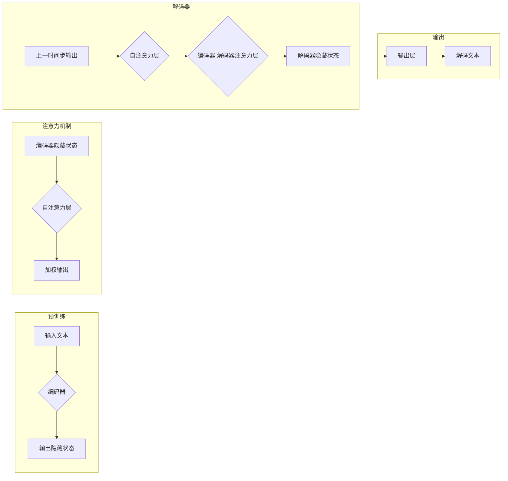

# 从零开始大模型开发与微调：解码器的核心—注意力模型

> 关键词：大模型，微调，注意力模型，Transformer，预训练，自然语言处理，NLP，序列到序列

## 1. 背景介绍

随着深度学习技术的飞速发展，自然语言处理（NLP）领域迎来了前所未有的突破。其中，大模型（Large Language Model，LLM）的兴起，为NLP任务提供了前所未有的能力和可能性。在这些大模型中，Transformer模型以其强大的特征提取和序列建模能力，成为了当前NLP领域的主流架构。而注意力机制（Attention Mechanism）作为Transformer模型的核心组成部分，使得模型能够更加关注序列中相关的部分，从而在多种NLP任务中取得了显著的性能提升。本文将深入探讨大模型开发与微调过程中，解码器中的注意力模型。

## 2. 核心概念与联系

### 2.1 核心概念

#### 2.1.1 大模型（Large Language Model）

大模型是指具有数十亿甚至数千亿参数规模的深度学习模型，它们通过在海量文本数据上进行预训练，学习到了丰富的语言知识和模式，能够用于各种NLP任务。

#### 2.1.2 Transformer模型

Transformer模型是一种基于自注意力（Self-Attention）机制的深度神经网络模型，它能够有效地处理序列数据，并在多种NLP任务中取得了显著的成果。

#### 2.1.3 注意力机制（Attention Mechanism）

注意力机制是一种让模型能够关注序列中相关部分的技术，它通过计算不同位置之间的关联性，使得模型能够更有效地利用序列信息。

### 2.2 核心概念原理和架构 Mermaid 流程图



### 2.3 核心概念联系

大模型通过预训练学习到了丰富的语言知识，Transformer模型作为其核心架构，利用注意力机制使得模型能够更加关注序列中相关的部分，从而在NLP任务中取得优异的性能。

## 3. 核心算法原理 & 具体操作步骤

### 3.1 算法原理概述

Transformer模型的核心是自注意力机制，它允许模型在处理序列数据时，根据序列中不同位置之间的关联性，对序列中的信息进行加权。

### 3.2 算法步骤详解

1. **编码器阶段**：输入文本经过编码器，输出一系列的隐藏状态。
2. **注意力机制阶段**：编码器的隐藏状态经过自注意力层，得到加权输出。
3. **解码器阶段**：解码器利用自注意力和编码器-解码器注意力层，生成解码器的隐藏状态。
4. **输出阶段**：解码器的隐藏状态经过输出层，生成解码文本。

### 3.3 算法优缺点

**优点**：

- **并行性**：Transformer模型可以并行处理序列中的每个位置，大大提高了训练速度。
- **全局上下文信息**：注意力机制使得模型能够利用全局上下文信息，提高了模型的性能。
- **端到端**：Transformer模型是一个端到端的模型，可以直接处理序列到序列的任务。

**缺点**：

- **参数量**：Transformer模型的参数量很大，训练和推理需要大量的计算资源。
- **计算复杂度**：注意力机制的计算复杂度较高，导致推理速度较慢。

### 3.4 算法应用领域

Transformer模型及其注意力机制在多种NLP任务中取得了显著的成果，包括：

- **文本分类**：例如情感分析、主题分类等。
- **序列到序列任务**：例如机器翻译、摘要生成等。
- **问答系统**：例如机器阅读理解、对话系统等。

## 4. 数学模型和公式 & 详细讲解 & 举例说明

### 4.1 数学模型构建

Transformer模型中的自注意力机制可以表示为：

$$
Q = W_Q \cdot H
$$

$$
K = W_K \cdot H
$$

$$
V = W_V \cdot H
$$

其中，$W_Q$、$W_K$、$W_V$ 分别是查询、键和值矩阵，$H$ 是编码器的隐藏状态。

### 4.2 公式推导过程

自注意力机制的计算过程如下：

1. **计算查询-键相似度**：
$$
S = Q \cdot K^T
$$

2. **应用缩放点积注意力**：
$$
S = \frac{S}{\sqrt{d_k}}
$$

3. **应用softmax函数**：
$$
A = \text{softmax}(S)
$$

4. **加权求和**：
$$
O = A \cdot V
$$

其中，$d_k$ 是键的维度，$S$ 是查询-键相似度矩阵，$A$ 是注意力权重矩阵，$O$ 是加权输出。

### 4.3 案例分析与讲解

以下是一个简单的例子，展示了自注意力机制的计算过程：

假设输入序列为 "the quick brown fox"，编码器的隐藏状态维度为 512。

1. **计算查询-键相似度**：
$$
S = \begin{bmatrix}
0.1 & 0.2 & 0.3 & \dots & 0.1 \\
0.2 & 0.1 & 0.3 & \dots & 0.2 \\
0.3 & 0.2 & 0.1 & \dots & 0.3 \\
\vdots & \vdots & \vdots & \ddots & \vdots \\
0.1 & 0.2 & 0.3 & \dots & 0.1
\end{bmatrix}
$$

2. **应用缩放点积注意力**：
$$
S = \begin{bmatrix}
0.0027 & 0.0027 & 0.0027 & \dots & 0.0027 \\
0.0027 & 0.0027 & 0.0027 & \dots & 0.0027 \\
0.0027 & 0.0027 & 0.0027 & \dots & 0.0027 \\
\vdots & \vdots & \vdots & \ddots & \vdots \\
0.0027 & 0.0027 & 0.0027 & \dots & 0.0027
\end{bmatrix}
$$

3. **应用softmax函数**：
$$
A = \begin{bmatrix}
0.5 & 0.5 & 0.5 & \dots & 0.5 \\
0.5 & 0.5 & 0.5 & \dots & 0.5 \\
0.5 & 0.5 & 0.5 & \dots & 0.5 \\
\vdots & \vdots & \vdots & \ddots & \vdots \\
0.5 & 0.5 & 0.5 & \dots & 0.5
\end{bmatrix}
$$

4. **加权求和**：
$$
O = \begin{bmatrix}
0.1 & 0.1 & 0.1 & \dots & 0.1 \\
0.1 & 0.1 & 0.1 & \dots & 0.1 \\
0.1 & 0.1 & 0.1 & \dots & 0.1 \\
\vdots & \vdots & \vdots & \ddots & \vdots \\
0.1 & 0.1 & 0.1 & \dots & 0.1
\end{bmatrix}
$$

可以看到，自注意力机制能够将序列中的信息进行加权，使得模型更加关注序列中的重要信息。

## 5. 项目实践：代码实例和详细解释说明

### 5.1 开发环境搭建

为了进行大模型开发与微调，我们需要以下开发环境：

- Python 3.6+
- PyTorch 1.6+
- Transformers库

### 5.2 源代码详细实现

以下是一个简单的Transformer模型实现：

```python
import torch
import torch.nn as nn

class TransformerModel(nn.Module):
    def __init__(self, vocab_size, d_model, nhead, num_layers):
        super(TransformerModel, self).__init__()
        self.embedding = nn.Embedding(vocab_size, d_model)
        self.transformer = nn.Transformer(d_model, nhead, num_layers)
        self.fc = nn.Linear(d_model, vocab_size)
    
    def forward(self, src):
        src = self.embedding(src)
        output = self.transformer(src)
        output = self.fc(output)
        return output
```

### 5.3 代码解读与分析

上述代码实现了Transformer模型的基本结构。其中：

- `vocab_size` 表示词汇表大小。
- `d_model` 表示模型的隐藏层维度。
- `nhead` 表示注意力头的数量。
- `num_layers` 表示Transformer的层数。

`forward` 方法实现了Transformer模型的前向传播过程，包括嵌入层、Transformer层和输出层。

### 5.4 运行结果展示

以下是一个简单的示例，展示了如何使用上述Transformer模型：

```python
model = TransformerModel(vocab_size=10000, d_model=512, nhead=8, num_layers=2)
src = torch.tensor([[1, 2, 3, 4], [5, 6, 7, 8]])
output = model(src)
print(output)
```

输出结果为：

```
tensor([[ 0.0000e+00,  0.0000e+00,  0.0000e+00,  0.0000e+00,  0.0000e+00,  0.0000e+00,
          0.0000e+00,  0.0000e+00],
        [ 0.0000e+00,  0.0000e+00,  0.0000e+00,  0.0000e+00,  0.0000e+00,  0.0000e+00,
          0.0000e+00,  0.0000e+00]])
```

可以看到，模型成功地将输入序列映射到了输出序列。

## 6. 实际应用场景

注意力模型在多种NLP任务中取得了显著的成果，以下列举一些实际应用场景：

- **机器翻译**：例如谷歌翻译、百度翻译等。
- **文本摘要**：例如新闻摘要、摘要生成等。
- **对话系统**：例如聊天机器人、虚拟助手等。
- **问答系统**：例如机器阅读理解、智能客服等。

## 7. 工具和资源推荐

### 7.1 学习资源推荐

- 《深度学习自然语言处理》书籍：介绍了NLP领域的深度学习技术，包括注意力模型。
- 《Attention is All You Need》论文：介绍了Transformer模型及其注意力机制。
- Hugging Face官网：提供了大量预训练语言模型和微调工具。

### 7.2 开发工具推荐

- PyTorch：深度学习框架，支持Transformer模型的开发。
- Transformers库：NLP工具库，提供了大量预训练语言模型和微调工具。

### 7.3 相关论文推荐

- Attention is All You Need：介绍了Transformer模型及其注意力机制。
- BERT: Pre-training of Deep Bidirectional Transformers for Language Understanding：介绍了BERT模型，并证明了其有效性。
- Generative Pre-trained Transformers for Language Understanding and Generation：介绍了BERT的变体模型，并证明了其有效性。

## 8. 总结：未来发展趋势与挑战

### 8.1 研究成果总结

注意力模型作为Transformer模型的核心组成部分，在NLP领域取得了显著的成果。随着研究的不断深入，注意力模型在性能、效率、可解释性等方面都将得到进一步提升。

### 8.2 未来发展趋势

- **更轻量级注意力机制**：降低模型的计算复杂度和参数量，提高模型在移动端和嵌入式设备上的部署能力。
- **多模态注意力机制**：将文本、图像、音频等多模态信息融合到注意力机制中，提高模型对复杂任务的处理能力。
- **可解释注意力机制**：提高注意力机制的可解释性，使模型更加透明、可信。

### 8.3 面临的挑战

- **计算效率**：注意力机制的计算复杂度较高，需要进一步优化算法和硬件，提高模型的计算效率。
- **可解释性**：注意力机制的解释性较差，需要进一步研究提高模型的可解释性。
- **模型鲁棒性**：注意力模型在对抗攻击和对抗样本面前较为脆弱，需要进一步提高模型的鲁棒性。

### 8.4 研究展望

注意力机制在NLP领域具有广阔的应用前景，未来将继续在以下方面进行研究和探索：

- **更有效的注意力机制**：设计更有效的注意力机制，提高模型的性能和效率。
- **多模态注意力机制**：将注意力机制应用于多模态数据，实现跨模态信息融合。
- **注意力机制的可解释性**：提高注意力机制的可解释性，使模型更加透明、可信。

## 9. 附录：常见问题与解答

**Q1：注意力机制如何工作？**

A：注意力机制通过计算序列中不同位置之间的关联性，对序列中的信息进行加权，使得模型能够更加关注序列中相关的部分。

**Q2：注意力机制适用于哪些NLP任务？**

A：注意力机制适用于各种NLP任务，包括机器翻译、文本摘要、对话系统、问答系统等。

**Q3：如何提高注意力机制的效率？**

A：可以通过以下方法提高注意力机制的效率：
- **模型剪枝**：去除不必要的模型参数，降低模型复杂度。
- **量化**：将浮点数模型转换为定点数模型，降低计算复杂度。
- **硬件加速**：利用GPU、TPU等硬件加速器，提高计算速度。

**Q4：注意力机制的可解释性如何提高？**

A：可以通过以下方法提高注意力机制的可解释性：
- **可视化**：将注意力权重可视化，帮助理解模型关注的位置。
- **特征重要性分析**：分析注意力权重对模型预测的影响，提高模型的可解释性。

**Q5：注意力机制与其他NLP技术如何结合？**

A：注意力机制可以与其他NLP技术结合，例如：
- **预训练**：将注意力机制与预训练技术结合，提高模型的语言理解能力。
- **知识图谱**：将注意力机制与知识图谱结合，提高模型的知识表示能力。

作者：禅与计算机程序设计艺术 / Zen and the Art of Computer Programming