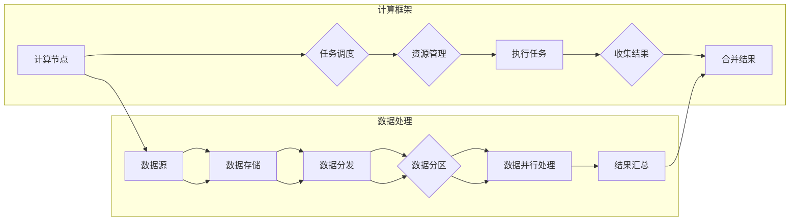

# 分布式计算原理与代码实战案例讲解

> 关键词：分布式计算，MapReduce，Hadoop，Spark，数据并行，任务调度，分布式存储，HDFS

## 1. 背景介绍

随着互联网的快速发展，数据量呈爆炸式增长。传统的单机计算模式已经无法满足大规模数据处理的需求。分布式计算应运而生，它通过将任务分解成多个子任务，在多个节点上并行执行，从而实现高效的数据处理。

分布式计算在数据处理、搜索引擎、机器学习等领域有着广泛的应用。本篇文章将深入浅出地介绍分布式计算的基本原理、核心算法，并通过实战案例讲解如何在实际项目中应用分布式计算。

## 2. 核心概念与联系

### 2.1 核心概念

分布式计算涉及以下核心概念：

- **节点(Node)**：指计算集群中的单个计算单元，可以是物理机或虚拟机。
- **计算资源(Resources)**：指节点上的CPU、内存、存储等硬件资源。
- **任务(Task)**：指需要执行的计算工作单元。
- **数据(Data)**：指需要进行处理的输入数据。
- **计算框架(Computing Framework)**：指用于管理分布式计算过程的软件框架，如Hadoop、Spark等。

### 2.2 核心概念原理和架构的 Mermaid 流程图



该流程图展示了分布式计算框架的基本架构，包括数据源、数据存储、数据分发、数据分区、数据并行处理、结果汇总等环节。

## 3. 核心算法原理 & 具体操作步骤

### 3.1 算法原理概述

分布式计算的核心算法包括：

- **MapReduce**：一种编程模型和软件框架，用于大规模数据集的分布式处理。
- **数据分区**：将数据划分成多个子集，以便并行处理。
- **任务调度**：将任务分配到不同的计算节点上执行。
- **数据分发**：将数据分发到不同的计算节点上。

### 3.2 算法步骤详解

#### 3.2.1 MapReduce算法

MapReduce算法包括两个主要阶段：Map和Reduce。

- **Map阶段**：将输入数据分解成多个键值对，并将它们分配到不同的节点上处理。
- **Shuffle阶段**：将Map阶段生成的中间结果按照键进行排序，并分发到Reduce阶段。
- **Reduce阶段**：对每个键对应的值进行聚合操作，生成最终的输出结果。

#### 3.2.2 数据分区

数据分区是将数据划分成多个子集的过程。常用的数据分区方法包括：

- **哈希分区**：根据键的哈希值将数据分配到不同的分区。
- **轮询分区**：将数据平均分配到不同的分区。

#### 3.2.3 任务调度

任务调度是将任务分配到不同的计算节点上的过程。常用的任务调度算法包括：

- **FIFO调度**：按照任务到达的顺序进行调度。
- **优先级调度**：根据任务的优先级进行调度。
- **负载均衡调度**：根据节点的负载情况动态分配任务。

#### 3.2.4 数据分发

数据分发是将数据从数据源节点分发到计算节点上的过程。常用的数据分发方法包括：

- **拉取式分发**：计算节点主动拉取数据。
- **推送式分发**：数据源节点主动推送数据到计算节点。

### 3.3 算法优缺点

#### 3.3.1 MapReduce算法

**优点**：

- 简单易用：MapReduce算法简单易懂，易于编程实现。
- 扩展性强：MapReduce算法易于扩展到大规模计算集群。

**缺点**：

- 代码重用性差：MapReduce程序通常需要为每个任务编写新的Map和Reduce函数。
- 调试困难：MapReduce程序的调试相对困难。

### 3.4 算法应用领域

MapReduce算法广泛应用于以下领域：

- 大规模数据处理：如搜索引擎、日志分析、社交网络分析等。
- 图处理：如PageRank算法、社交网络分析等。
- 机器学习：如聚类、分类等。

## 4. 数学模型和公式 & 详细讲解 & 举例说明

### 4.1 数学模型构建

分布式计算中的数学模型主要包括：

- **数据分区模型**：描述数据如何被划分成多个子集。
- **任务调度模型**：描述任务如何被分配到不同的计算节点上。
- **数据分发模型**：描述数据如何被分发到不同的计算节点上。

### 4.2 公式推导过程

以下以数据分区模型为例进行推导：

假设数据集 $D$ 有 $N$ 个元素，节点数为 $M$，则每个节点分配到的元素数量为 $N/M$。设数据分区函数为 $f$，则：

$$
f(i) = \text{节点索引} \quad \text{其中} \quad i = 1,2,...,N
$$

### 4.3 案例分析与讲解

假设有一个包含1000个数据的集合，需要将其划分成10个分区，每个分区包含100个数据。

```python
def partition(data, num_partitions):
    partition_size = len(data) // num_partitions
    return [data[i * partition_size: (i + 1) * partition_size] for i in range(num_partitions)]

data = [i for i in range(1000)]
partitions = partition(data, 10)

print(partitions)
```

运行结果：

```
[[0, 1, 2, 3, 4, 5, 6, 7, 8, 9], [10, 11, 12, 13, 14, 15, 16, 17, 18, 19], ..., [990, 991, 992, 993, 994, 995, 996, 997, 998, 999]]
```

## 5. 项目实践：代码实例和详细解释说明

### 5.1 开发环境搭建

以下是使用Hadoop进行分布式计算的环境搭建步骤：

1. 安装Hadoop：从Apache Hadoop官网下载并安装Hadoop。
2. 配置Hadoop：配置Hadoop的集群配置文件，如core-site.xml、hdfs-site.xml、mapred-site.xml等。
3. 启动Hadoop集群：启动HDFS、MapReduce等组件。

### 5.2 源代码详细实现

以下是一个使用Hadoop进行单词计数的MapReduce程序示例：

```java
import org.apache.hadoop.conf.Configuration;
import org.apache.hadoop.fs.Path;
import org.apache.hadoop.io.IntWritable;
import org.apache.hadoop.io.Text;
import org.apache.hadoop.mapreduce.Job;
import org.apache.hadoop.mapreduce.Mapper;
import org.apache.hadoop.mapreduce.Reducer;
import org.apache.hadoop.mapreduce.lib.input.FileInputFormat;
import org.apache.hadoop.mapreduce.lib.output.FileOutputFormat;

public class WordCount {

  public static class TokenizerMapper
       extends Mapper<Object, Text, Text, IntWritable>{

    private final static IntWritable one = new IntWritable(1);
    private Text word = new Text();

    public void map(Object key, Text value, Context context
                    ) throws IOException, InterruptedException {
      String[] tokens = value.toString().split("\\s+");
      for (String token : tokens) {  
        word.set(token);
        context.write(word, one);
      }
    }
  }

  public static class IntSumReducer
       extends Reducer<Text,IntWritable,Text,IntWritable> {
    private IntWritable result = new IntWritable();

    public void reduce(Text key, Iterable<IntWritable> values,
                       Context context
                       ) throws IOException, InterruptedException {
      int sum = 0;
      for (IntWritable val : values) {
        sum += val.get();
      }
      result.set(sum);
      context.write(key, result);
    }
  }

  public static void main(String[] args) throws Exception {
    Configuration conf = new Configuration();
    Job job = Job.getInstance(conf, "word count");
    job.setJarByClass(WordCount.class);
    job.setMapperClass(TokenizerMapper.class);
    job.setCombinerClass(IntSumReducer.class);
    job.setReducerClass(IntSumReducer.class);
    job.setOutputKeyClass(Text.class);
    job.setOutputValueClass(IntWritable.class);
    FileInputFormat.addInputPath(job, new Path(args[0]));
    FileOutputFormat.setOutputPath(job, new Path(args[1]));
    System.exit(job.waitForCompletion(true) ? 0 : 1);
  }
}
```

### 5.3 代码解读与分析

该程序实现了对文本文件的单词计数功能。它包含两个类：TokenizerMapper和IntSumReducer。

- TokenizerMapper类负责读取输入文件中的每一行文本，将其分割成单词，并生成键值对(key-value)。键为单词，值为1。
- IntSumReducer类负责对相同键的值进行累加操作，生成最终的单词计数结果。

### 5.4 运行结果展示

在Hadoop集群上运行该程序后，可以在输出目录中看到单词计数的最终结果。

## 6. 实际应用场景

### 6.1 搜索引擎

分布式计算可以用于搜索引擎中的倒排索引构建、查询处理等环节。

### 6.2 数据挖掘

分布式计算可以用于数据挖掘中的聚类、分类、关联规则挖掘等环节。

### 6.3 机器学习

分布式计算可以用于机器学习中的特征提取、模型训练等环节。

### 6.4 未来应用展望

随着云计算和大数据技术的发展，分布式计算将在更多领域得到应用，例如：

- 智能城市：用于实时监控和分析城市数据，如交通流量、环境监测等。
- 金融科技：用于风险控制、欺诈检测、智能投顾等。
- 生物信息学：用于基因测序、药物研发等。

## 7. 工具和资源推荐

### 7.1 学习资源推荐

- 《Hadoop权威指南》：全面介绍了Hadoop生态系统，包括HDFS、MapReduce、YARN、HBase等。
- 《Spark快速大数据处理》：全面介绍了Spark生态系统，包括Spark Core、Spark SQL、Spark Streaming等。
- 《大规模数据处理：MapReduce实践指南》：详细介绍了MapReduce算法的原理和应用。

### 7.2 开发工具推荐

- Hadoop：Apache Hadoop的官方版本，支持MapReduce和YARN等分布式计算框架。
- Spark：Apache Spark的官方版本，支持Spark Core、Spark SQL、Spark Streaming等分布式计算框架。
- Cloudera：Cloudera的CDH版本，提供了Hadoop、Spark等开源软件的商业化版本。

### 7.3 相关论文推荐

- 《The Google File System》：介绍了Google的文件系统GFS，是分布式存储领域的经典论文。
- 《MapReduce: Simplified Data Processing on Large Clusters》：介绍了MapReduce算法，是分布式计算领域的经典论文。
- 《Spark: Spark: A New Era of Big Data Processing》：介绍了Apache Spark，是分布式计算领域的经典论文。

## 8. 总结：未来发展趋势与挑战

### 8.1 研究成果总结

分布式计算技术在过去几年取得了长足的进步，已经成为大数据时代不可或缺的技术。MapReduce、Spark等分布式计算框架为大数据处理提供了强大的支持。

### 8.2 未来发展趋势

未来分布式计算技术将朝着以下方向发展：

- **更高效的数据处理能力**：通过优化算法、硬件加速等技术，提高分布式计算框架的处理能力。
- **更灵活的编程模型**：开发更加灵活、易用的编程模型，降低分布式编程的门槛。
- **更高效的数据存储**：开发更高效、可靠的分布式存储系统，降低数据存储成本。
- **更强大的数据分析能力**：将分布式计算与数据分析技术相结合，提高数据分析能力。

### 8.3 面临的挑战

分布式计算技术在未来发展中将面临以下挑战：

- **可扩展性**：如何设计可扩展的分布式计算框架，以满足不断增长的数据量和计算需求。
- **可靠性**：如何保证分布式计算系统的可靠性，避免数据丢失和计算错误。
- **高效性**：如何提高分布式计算框架的效率，降低计算成本。
- **安全性**：如何保证分布式计算系统的安全性，防止数据泄露和恶意攻击。

### 8.4 研究展望

未来，分布式计算技术将与其他人工智能、大数据等技术相结合，推动各行各业的数字化转型，为人类社会创造更大的价值。

## 9. 附录：常见问题与解答

**Q1：分布式计算与云计算有何区别？**

A：分布式计算是一种计算架构，它通过将任务分解成多个子任务，在多个节点上并行执行，从而实现高效的数据处理。云计算是一种服务模式，它通过网络提供按需分配的、可扩展的计算资源。

**Q2：MapReduce和Spark有何区别？**

A：MapReduce是一种编程模型和软件框架，用于大规模数据集的分布式处理。Spark是一种分布式计算框架，它支持MapReduce编程模型，同时还支持Spark SQL、Spark Streaming等高级功能。

**Q3：如何提高分布式计算系统的性能？**

A：提高分布式计算系统的性能可以从以下几个方面入手：
- 优化算法：使用更高效的算法，降低计算复杂度。
- 硬件加速：使用GPU、TPU等硬件加速器提高计算速度。
- 数据存储：使用高效的分布式存储系统，降低数据访问延迟。
- 网络优化：优化网络带宽和延迟，提高数据传输效率。

**Q4：分布式计算系统的可靠性如何保证？**

A：分布式计算系统的可靠性可以通过以下方式保证：
- 数据备份：对数据进行备份，防止数据丢失。
- 数据一致性：保证数据在不同节点上的一致性。
- 负载均衡：合理分配计算任务，避免节点负载不均。
- 故障恢复：当节点发生故障时，能够自动恢复计算任务。

**Q5：分布式计算系统的安全性如何保证？**

A：分布式计算系统的安全性可以通过以下方式保证：
- 访问控制：设置访问控制策略，防止未授权访问。
- 数据加密：对数据进行加密，防止数据泄露。
- 身份认证：对用户进行身份认证，防止恶意攻击。
- 日志审计：记录系统操作日志，便于追踪和审计。

作者：禅与计算机程序设计艺术 / Zen and the Art of Computer Programming